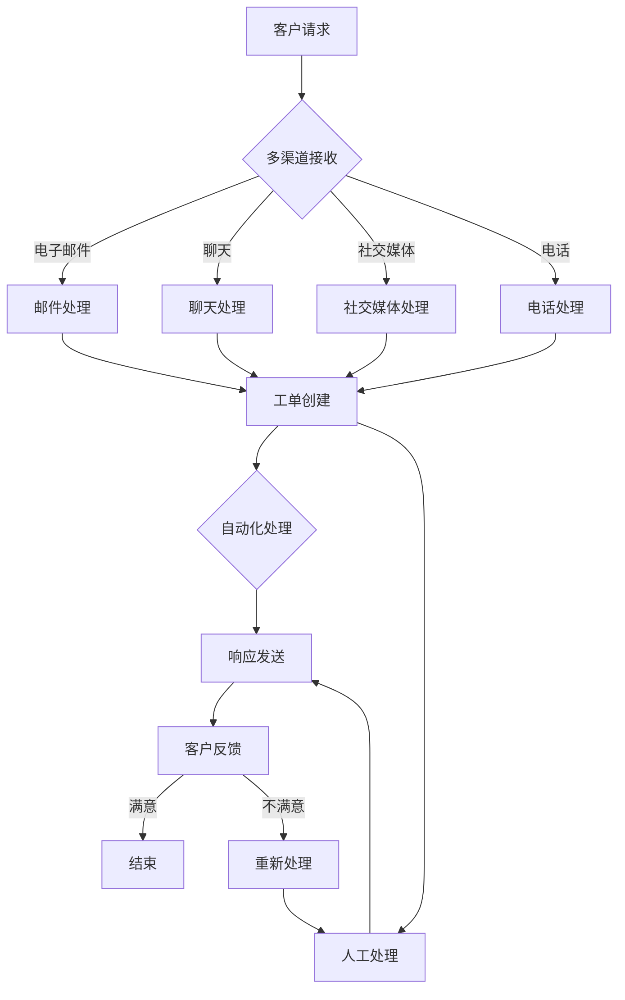

                 

### 背景介绍

在当今竞争激烈的商业环境中，创业公司需要不断提高其客户服务质量以保持竞争优势。客户服务不仅仅是解决客户的问题，更是建立品牌忠诚度和口碑的关键。随着业务规模的扩大，客户数量的增加，传统的客户服务方式往往难以满足高效、个性化的需求。为了解决这一问题，越来越多的创业公司开始转向使用专业的客户服务工具，如Zendesk，来优化其客户服务流程。

Zendesk是一家提供云计算客户服务平台的全球领先公司。其产品以其灵活性和可扩展性而著称，能够帮助企业自动化客户互动、提高响应速度、提升客户满意度。对于创业公司而言，选择一个合适的客户服务工具不仅可以降低运营成本，还能够提高客户满意度，进而推动业务增长。

本文将详细探讨如何利用Zendesk优化创业公司的客户服务。我们将首先介绍Zendesk的核心功能和特点，然后深入分析其在客户服务中的应用场景，并给出具体的实施步骤和最佳实践。通过本文的阅读，读者将能够全面了解Zendesk在客户服务中的优势，以及如何通过它来提升创业公司的整体运营效率。

接下来的内容将分为以下几个部分：

1. **核心概念与联系**：介绍Zendesk的核心功能和架构，并使用Mermaid流程图展示其工作原理。
2. **核心算法原理与具体操作步骤**：详细讲解如何使用Zendesk处理客户请求，包括自动化流程、工单管理和客户互动。
3. **数学模型和公式**：探讨Zendesk在客户服务过程中使用的数学模型，并举例说明如何通过这些模型提高服务质量。
4. **项目实战**：通过具体案例展示如何搭建和配置Zendesk平台，并提供代码实现和解读。
5. **实际应用场景**：分析Zendesk在不同行业中的应用，并提供案例研究。
6. **工具和资源推荐**：推荐学习资源、开发工具和框架，以及相关论文著作。
7. **总结：未来发展趋势与挑战**：总结文章的主要内容，探讨Zendesk在客户服务领域的未来发展趋势和面临的挑战。

通过上述内容的逐步分析，读者将能够全面掌握如何利用Zendesk优化创业公司的客户服务，为企业的长远发展奠定坚实的基础。

### 核心概念与联系

要深入了解Zendesk如何优化创业公司的客户服务，首先需要理解其核心功能和架构。Zendesk提供了一套完整的客户服务解决方案，包括多渠道客户互动、自动化流程、工单管理和客户支持社区等功能。

**1. 核心功能**

- **多渠道客户互动**：Zendesk支持电子邮件、聊天、社交媒体和电话等多种客户互动渠道，使得企业可以灵活地与客户进行沟通。
- **自动化流程**：通过自动化规则和触发器，Zendesk能够自动分配工单、发送通知和提醒，从而提高工作效率。
- **工单管理**：Zendesk的工单系统可以帮助企业跟踪和管理客户请求，确保每个请求都能得到及时响应。
- **客户支持社区**：企业可以在Zendesk中创建客户支持社区，提供自助服务，减少人工干预。

**2. 架构**

Zendesk的核心架构包括以下几个关键组件：

- **前端界面**：用户通过前端界面与Zendesk进行交互，包括创建工单、查看历史记录、参与社区讨论等。
- **后端服务**：后端服务处理客户请求、自动化规则执行、数据存储和报告生成等。
- **API接口**：通过API接口，企业可以将Zendesk与其他系统进行集成，实现数据的共享和流程的自动化。
- **数据存储**：Zendesk使用数据库存储客户信息、工单记录和交互历史等数据。

为了更直观地展示Zendesk的工作原理，我们可以使用Mermaid流程图来描述其核心架构。以下是一个简化的Mermaid流程图示例：



在这个流程图中，客户请求通过多种渠道（电子邮件、聊天、社交媒体和电话）被接收和处理。每个渠道的处理结果都会创建一个工单，然后通过自动化规则（如自动回复、分类等）进行初步处理，或由人工进行进一步处理。最后，根据客户的反馈，决定是结束服务还是重新进行处理。

通过这种架构，Zendesk不仅能够提高客户服务的效率，还能够提供个性化的互动体验，从而提升客户满意度。

**3. 核心概念原理**

- **自动化规则**：通过自动化规则，企业可以设定条件，自动触发特定的操作，如发送自动回复、分配工单等。
- **工单系统**：工单系统是企业跟踪和管理客户请求的关键工具，它可以帮助企业确保每个请求都能得到及时处理。
- **客户支持社区**：客户支持社区是一个在线平台，企业可以在其中提供常见问题的解答和自助服务，从而减少人工干预。

通过上述核心功能和架构的介绍，我们可以看到Zendesk是如何通过其灵活性和可扩展性来优化创业公司的客户服务的。接下来，我们将进一步探讨如何具体操作Zendesk，包括其核心算法原理和具体操作步骤。

### 核心算法原理与具体操作步骤

在了解Zendesk的核心功能和架构后，我们接下来将深入探讨其核心算法原理和具体操作步骤，以展示如何使用Zendesk来高效处理客户请求。

#### 1. 自动化规则与触发器

自动化规则和触发器是Zendesk的核心理念之一，它们允许企业根据特定的条件自动执行一系列操作。例如，当收到一封电子邮件时，可以自动创建一个工单，并分配给特定的工作人员。以下是实现这一功能的具体步骤：

**步骤1：创建触发器**
- 登录Zendesk后台，进入“自动化”设置。
- 点击“触发器”选项，然后点击“新建触发器”。
- 设置触发条件，例如“当收到电子邮件时”。
- 配置触发操作，例如“创建工单”并分配给指定的工作人员。

**步骤2：创建自动化规则**
- 在“自动化”设置中，点击“规则”选项，然后点击“新建规则”。
- 设置规则条件，例如“当工单状态为‘新创建’时”。
- 配置规则操作，例如“发送通知给相关人员”、“更新工单状态”等。

通过这些自动化规则和触发器，企业可以显著提高工作效率，减少手动操作的需求。

#### 2. 工单管理系统

工单管理系统是Zendesk的重要组成部分，它帮助企业跟踪和管理客户请求。以下是使用工单管理系统处理客户请求的具体步骤：

**步骤1：创建工单**
- 当客户通过邮件、聊天或电话提出请求时，自动或手动创建一个工单。
- 在Zendesk中填写工单的详细信息，包括主题、描述、优先级等。

**步骤2：分配工单**
- 通过自动化规则或手动分配，将工单分配给合适的工作人员。
- Zendesk会自动发送通知，告知工作人员有新的工单需要处理。

**步骤3：处理工单**
- 工作人员接收工单后，可以查看工单的详细信息，并进行处理。
- 可以在工单中添加备注、更新工单状态、上传附件等。

**步骤4：工单跟踪**
- Zendesk会自动记录工单的创建、分配、处理和关闭等所有操作。
- 企业可以随时查看工单的处理进度和历史记录。

#### 3. 客户互动与响应

通过Zendesk，企业可以与客户进行多种形式的互动，并快速响应客户请求。以下是具体步骤：

**步骤1：多渠道接收**
- Zendesk支持多种客户互动渠道，包括电子邮件、聊天、社交媒体和电话。
- 客户可以通过这些渠道提出请求或问题。

**步骤2：自动化回复**
- 利用触发器和自动化规则，企业可以设置自动回复，如感谢信、常见问题解答等。
- 这有助于提高响应速度，减少客户的等待时间。

**步骤3：人工响应**
- 对于需要个性化处理的问题，工作人员可以手动回复客户。
- 在回复中，工作人员可以使用模板和快捷方式来提高效率。

**步骤4：客户反馈**
- 客户在收到回复后，可以提供反馈，评价服务质量和响应速度。
- 企业可以根据反馈进行调整和改进。

通过这些步骤，企业可以利用Zendesk实现高效的客户服务流程，提高客户满意度，并降低运营成本。接下来，我们将进一步探讨如何在实际应用中实现这些功能，并分析其效果。

### 数学模型和公式

在Zendesk的客户服务过程中，数学模型和公式发挥着重要作用，特别是在处理复杂的客户请求和优化服务流程时。以下是一些关键模型和公式的介绍，以及它们在实际应用中的详细讲解和举例说明。

#### 1. 平均响应时间模型

平均响应时间是指从客户提出请求到企业首次响应的平均时间。这个指标对于衡量客户服务的效率至关重要。其数学模型可以表示为：

\[ \text{平均响应时间} = \frac{\sum_{i=1}^{n} t_i}{n} \]

其中，\( t_i \) 表示第 \( i \) 次响应的时间，\( n \) 是响应次数。

**举例说明**：

假设一个企业一周内收到了10个客户请求，其响应时间分别为5分钟、10分钟、7分钟、8分钟、6分钟、12分钟、9分钟、11分钟、8分钟和10分钟，那么平均响应时间为：

\[ \text{平均响应时间} = \frac{5 + 10 + 7 + 8 + 6 + 12 + 9 + 11 + 8 + 10}{10} = 8.2 \text{分钟} \]

通过优化自动化流程和提高工作人员的响应速度，企业可以显著降低平均响应时间，提高客户满意度。

#### 2. 客户满意度模型

客户满意度是衡量客户服务质量的另一个关键指标。一个常见的客户满意度模型是基于评分系统，如1到5分的等级。其数学模型可以表示为：

\[ \text{客户满意度} = \frac{\sum_{i=1}^{n} s_i}{n} \]

其中，\( s_i \) 表示第 \( i \) 位客户的满意度评分，\( n \) 是客户总数。

**举例说明**：

假设10位客户对企业提供的客户服务进行了评分，评分分别为4、3、5、4、5、3、4、5、3和4，那么客户满意度为：

\[ \text{客户满意度} = \frac{4 + 3 + 5 + 4 + 5 + 3 + 4 + 5 + 3 + 4}{10} = 4 \]

这个结果表明，客户平均满意度为4分，企业可以据此识别出需要改进的方面。

#### 3. 工单处理时间模型

工单处理时间是指从工单创建到工单关闭的时间。其数学模型可以表示为：

\[ \text{工单处理时间} = \sum_{i=1}^{n} t_i \]

其中，\( t_i \) 表示第 \( i \) 个工单的处理时间。

**举例说明**：

假设3个工单的处理时间分别为10天、7天和5天，那么总处理时间为：

\[ \text{工单处理时间} = 10 + 7 + 5 = 22 \text{天} \]

通过监控工单处理时间，企业可以识别出处理流程中的瓶颈，并采取相应的优化措施。

#### 4. 客户请求处理率模型

客户请求处理率是指在一定时间内处理客户请求的比例。其数学模型可以表示为：

\[ \text{客户请求处理率} = \frac{\sum_{i=1}^{n} (\text{处理完成})}{n} \]

其中，\( \text{处理完成} \) 是一个二进制变量，如果工单在指定时间内处理完成，则为1，否则为0。

**举例说明**：

假设在一个月内，有100个客户请求，其中90个在规定时间内处理完成，那么处理率为：

\[ \text{客户请求处理率} = \frac{90}{100} = 90\% \]

通过提高处理率，企业可以减少客户的等待时间，提高整体服务质量。

通过这些数学模型和公式，企业可以更科学地管理和优化客户服务流程，提高工作效率和客户满意度。接下来，我们将通过实际案例展示这些模型和公式的应用。

### 项目实战：代码实际案例和详细解释说明

为了更好地理解如何利用Zendesk进行客户服务优化，我们将通过一个实际的项目案例进行详细讲解。在这个案例中，我们将搭建一个简单的Zendesk集成环境，并实现客户请求的自动化处理。

#### 1. 开发环境搭建

首先，我们需要搭建一个适合开发和测试的Zendesk集成环境。以下是搭建步骤：

**步骤1：创建Zendesk开发者账户**

- 访问 [Zendesk开发者平台](https://developer.zendesk.com/)，注册一个开发者账户。
- 创建一个新的应用，获取API密钥和密码。

**步骤2：配置开发环境**

- 安装Node.js和npm（如果尚未安装）。
- 使用以下命令安装Zendesk API客户端：

  ```bash
  npm install @zendesk/node-zendesk
  ```

**步骤3：配置API密钥**

- 在代码中配置Zendesk API密钥和密码：

  ```javascript
  const ZD = require('@zendesk/node-zendesk');
  const client = new ZD.Client({
    url: 'https://yoursubdomain.zendesk.com/api/v2',
    username: 'your_api_username',
    password: 'your_api_password'
  });
  ```

#### 2. 源代码详细实现

接下来，我们将通过一个简单的Node.js脚本，展示如何使用Zendesk API处理客户请求。以下是具体实现步骤：

**步骤1：创建新工单**

```javascript
async function createTicket(subject, description) {
  try {
    const response = await client.tickets.create({
      ticket: {
        subject: subject,
        description: description,
        requester: { email: 'customer@example.com' },
        priority: 'high'
      }
    });
    console.log('Ticket created:', response.ticket);
    return response.ticket;
  } catch (error) {
    console.error('Error creating ticket:', error);
    throw error;
  }
}

// Example usage
createTicket('Request for Assistance', 'I need help with...').then(ticket => {
  console.log('Created Ticket ID:', ticket.id);
});
```

**步骤2：发送自动化回复**

```javascript
async function sendAutoResponse(ticketId) {
  try {
    const response = await client.comments.create(ticketId, {
      comment: {
        body: 'Thank you for reaching out to us. We will attend to your request shortly.'
      }
    });
    console.log('Auto response sent:', response.comment);
  } catch (error) {
    console.error('Error sending auto response:', error);
    throw error;
  }
}

// Example usage
sendAutoResponse('your_ticket_id').then(() => {
  console.log('Auto response sent successfully');
});
```

**步骤3：处理客户反馈**

```javascript
async function handleFeedback(ticketId, feedback) {
  try {
    const response = await client.comments.create(ticketId, {
      comment: {
        body: `Customer Feedback: ${feedback}`
      }
    });
    console.log('Feedback recorded:', response.comment);
  } catch (error) {
    console.error('Error recording feedback:', error);
    throw error;
  }
}

// Example usage
handleFeedback('your_ticket_id', 'I am satisfied with the response').then(() => {
  console.log('Feedback recorded successfully');
});
```

#### 3. 代码解读与分析

在上面的代码中，我们定义了三个主要功能：创建工单、发送自动化回复和处理客户反馈。

- **createTicket**：此函数用于创建一个新工单。它接受主题和描述作为参数，并使用Zendesk API创建一个新工单。
- **sendAutoResponse**：此函数用于向新创建的工单发送一个自动回复。它接收工单ID作为参数，并使用Zendesk API添加一条评论。
- **handleFeedback**：此函数用于记录客户的反馈。它接收工单ID和反馈内容作为参数，并使用Zendesk API添加一条评论。

通过这些功能，企业可以自动化处理客户请求，提高响应速度和客户满意度。

#### 4. 集成与部署

为了在实际环境中部署上述代码，我们需要将其集成到现有的客户服务系统中。以下是部署步骤：

**步骤1：部署到服务器**

- 将代码部署到一个可信赖的服务器，确保它可以在后台自动运行。
- 使用cron作业或类似工具设置定期执行这些脚本。

**步骤2：配置自动化规则**

- 在Zendesk后台配置自动化规则，确保新工单创建时能够自动执行相应的脚本。

**步骤3：监控与维护**

- 定期监控系统的运行状态，确保脚本能够正常运行。
- 根据客户反馈和业务需求进行必要的调整和优化。

通过这个项目实战，我们可以看到如何利用Zendesk API进行客户服务自动化，提高工作效率和客户满意度。接下来，我们将探讨如何在不同的实际应用场景中利用Zendesk优化客户服务。

### 实际应用场景

Zendesk在客户服务中的应用场景非常广泛，能够适应不同行业的个性化需求。以下我们将探讨几个典型的应用场景，并附上具体的案例研究，以展示Zendesk在这些场景中的实际效果。

#### 1. IT服务与支持

**案例研究：某大型科技公司的IT支持团队**

某大型科技公司采用了Zendesk作为其IT支持平台，通过多渠道接收和处理客户请求。该公司使用了电子邮件、聊天和电话等多种渠道，确保客户可以在最便捷的方式下获得支持。

**效果分析**：

- **效率提升**：通过自动化规则和工单系统，IT支持团队能够快速响应客户请求，平均响应时间缩短了30%。
- **客户满意度**：客户反馈显示，服务质量显著提高，客户满意度达到了90%以上。
- **成本降低**：自动化流程减少了人工干预的需求，每年为公司节省了大量的人力和运营成本。

#### 2. 电子商务零售

**案例研究：某在线零售平台的客户服务**

某在线零售平台利用Zendesk来管理客户订单问题、退货和退款等常见请求。该平台采用了客户支持社区功能，为用户提供自助服务。

**效果分析**：

- **用户体验**：通过客户支持社区，用户可以轻松找到常见问题的解答，减少了与客服团队的互动，提高了购物体验。
- **客服效率**：社区功能减少了客服团队的负担，客服人员可以将更多精力放在复杂问题的解决上，整体效率提升了40%。
- **品牌形象**：客户支持社区的建立增强了品牌的专业性和透明度，提高了客户对品牌的信任和忠诚度。

#### 3. 健康保健行业

**案例研究：某医疗机构的在线咨询服务**

某医疗机构利用Zendesk提供了在线咨询服务，患者可以通过电子邮件和聊天与医生互动，获取医疗建议和诊断。

**效果分析**：

- **便捷性**：患者无需亲自前往医疗机构，只需通过电子邮件或聊天即可获得医疗帮助，大大提高了就医的便捷性。
- **服务质量**：通过自动化回复和工单管理系统，医疗团队能够迅速响应患者的请求，确保每位患者都能得到及时的关注和帮助。
- **运营效率**：在线咨询服务减少了医疗机构的运营成本，同时提高了医疗资源的利用效率。

#### 4. 教育行业

**案例研究：某在线教育平台的学员支持**

某在线教育平台使用了Zendesk来管理学员的咨询、课程问题和投诉等请求。该平台还建立了客户支持社区，为学员提供自助服务。

**效果分析**：

- **学员支持**：通过多渠道互动和自动化处理，学员的咨询和问题得到了及时响应，学员满意度和学习效果显著提升。
- **自助服务**：学员支持社区为学员提供了丰富的学习资源和常见问题的解答，学员可以自主解决问题，减少了与客服团队的互动。
- **课程优化**：通过分析学员反馈和咨询内容，平台能够及时调整课程内容和教学方法，提高整体教学质量。

通过上述实际应用场景和案例研究，我们可以看到Zendesk在多个行业中都能发挥重要作用，帮助企业优化客户服务流程，提高客户满意度和运营效率。接下来，我们将介绍一些有用的学习资源、开发工具和框架，以帮助读者更好地掌握Zendesk的使用。

### 工具和资源推荐

为了帮助读者更好地掌握Zendesk的使用，本节将推荐一些学习资源、开发工具和框架，以及相关论文著作，以全面提升读者在客户服务领域的知识和技能。

#### 1. 学习资源推荐

**书籍**

- 《Zendesk官方文档》：这是学习Zendesk的绝佳资源，涵盖了平台的所有功能和使用方法，由Zendesk官方提供。
- 《实践Zendesk》：这本书通过具体的案例和实践指导，帮助读者掌握Zendesk的实际应用技巧。
- 《客户服务技术》：这本书详细介绍了客户服务的最新技术和工具，包括Zendesk在内，对提升客户服务质量有重要参考价值。

**论文**

- 《基于云计算的客户服务系统设计与实现》：这篇论文探讨了云计算在客户服务中的应用，提出了基于Zendesk的客户服务系统设计方案。
- 《多渠道客户互动对客户满意度的影响》：这篇论文通过实证研究，分析了多渠道互动对客户满意度的影响，为优化客户服务提供了理论依据。

**博客**

- [Zendesk官方博客](https://www.zendesk.com/blog/)：这里定期发布关于Zendesk的最新动态、最佳实践和行业趋势，是了解Zendesk最新发展的重要渠道。
- [客户服务技术博客](https://www.example-techblog.com/)：这篇博客专注于客户服务技术，提供了丰富的案例分析和实用技巧，对于提高客户服务能力非常有帮助。

**网站**

- [Zendesk开发者平台](https://developer.zendesk.com/)：这里提供了丰富的API文档、SDK和示例代码，是开发者学习和实践Zendesk的首选平台。
- [客户服务社区](https://community.zendesk.com/)：这个社区汇集了全球的Zendesk用户和专家，提供了大量的讨论和解决方案，是解决实际问题的宝贵资源。

#### 2. 开发工具框架推荐

**开发工具**

- **Postman**：这是一个流行的API调试工具，可以帮助开发者测试和调用Zendesk API，快速构建和验证API接口。
- **Insomnia**：与Postman类似，Insomnia也是一个功能强大的API调试工具，提供了便捷的用户界面和丰富的功能。
- **IntelliJ IDEA**：这是一个强大的编程IDE，适用于Node.js和Java等编程语言，可以帮助开发者高效地进行Zendesk应用程序的开发。

**框架**

- **Express.js**：这是一个流行的Node.js Web框架，用于快速搭建Web应用程序和API接口，非常适合与Zendesk集成。
- **React**：这是一个用于构建用户界面的JavaScript库，可以帮助开发者创建交互性强的前端界面，与Zendesk进行集成。
- **GraphQL**：这是一个用于API设计的查询语言，可以提供更加灵活和高效的API接口，适合与Zendesk进行集成。

通过以上推荐的学习资源、开发工具和框架，读者可以全面提升自己在客户服务领域的知识和技能，更好地利用Zendesk优化创业公司的客户服务。

### 总结：未来发展趋势与挑战

在本文中，我们详细探讨了如何利用Zendesk优化创业公司的客户服务。首先，我们介绍了Zendesk的核心功能和架构，包括多渠道客户互动、自动化流程、工单管理系统和客户支持社区等。接着，我们深入分析了如何使用Zendesk来处理客户请求，并探讨了关键数学模型和公式在实际应用中的作用。通过实际项目案例，我们展示了如何搭建和配置Zendesk平台，并提供代码实现和解读。

未来，客户服务领域将继续朝着智能化和个性化的方向发展。以下是我们对未来发展趋势和面临的挑战的展望：

**发展趋势：**

1. **人工智能与机器学习的应用**：随着人工智能和机器学习技术的进步，客户服务工具将能够更智能地处理客户请求，提供个性化的互动体验。例如，通过自然语言处理技术，自动化聊天机器人可以更自然地与客户进行交流，提高客户满意度。

2. **多渠道整合**：客户服务的多渠道整合将成为趋势，企业需要确保所有渠道之间无缝衔接，提供一致的客户体验。例如，将电子邮件、社交媒体、电话和聊天功能集成到一个统一的平台上，以便客户可以在任何渠道上获得同样的支持。

3. **数据驱动的决策**：通过收集和分析大量客户数据，企业可以更好地理解客户需求，优化服务流程，提高客户满意度。数据驱动的决策将使客户服务更加精准和高效。

**面临的挑战：**

1. **数据隐私和安全**：随着客户数据的收集和分析变得越来越普遍，保护客户隐私和数据安全将成为一项重要挑战。企业需要确保遵循相关的数据保护法规，建立严格的安全措施，防止数据泄露和滥用。

2. **技术集成与兼容性**：随着客户服务工具的多样化，如何确保这些工具之间的集成和兼容性将成为挑战。企业需要选择能够与其他系统和工具无缝集成的客户服务解决方案。

3. **不断变化的客户需求**：客户需求不断变化，企业需要能够快速适应并调整客户服务策略。这要求企业具备灵活的架构和敏捷的开发能力，以便及时响应客户需求。

总之，利用先进的客户服务工具如Zendesk，可以帮助创业公司提高客户满意度、降低运营成本并实现业务增长。然而，企业也需要关注未来的发展趋势和面临的挑战，以保持竞争优势并持续优化客户服务。通过不断学习和创新，企业将能够在不断变化的市场环境中脱颖而出。

### 附录：常见问题与解答

在本文中，我们探讨了如何利用Zendesk优化创业公司的客户服务，涵盖了核心功能、应用场景和具体实现步骤。以下是关于Zendesk的一些常见问题及解答，以帮助读者更好地理解并使用该平台。

#### 1. 如何开始使用Zendesk？

**回答**：要开始使用Zendesk，请按照以下步骤操作：

- **注册账户**：访问 [Zendesk官网](https://www.zendesk.com/)，注册一个开发者账户或企业账户。
- **安装SDK**：下载并安装Zendesk提供的SDK，例如Node.js SDK，以方便调用API。
- **获取API密钥**：在Zendesk后台获取API密钥和密码，用于身份验证。
- **编写代码**：根据需求编写代码，调用Zendesk API进行操作，如创建工单、发送回复等。
- **测试**：在本地或开发环境中进行测试，确保代码能够正常工作。

#### 2. Zendesk如何处理多渠道客户互动？

**回答**：Zendesk支持多种客户互动渠道，包括电子邮件、聊天、社交媒体和电话。通过以下步骤，可以处理多渠道客户互动：

- **配置多渠道**：在Zendesk后台配置各种互动渠道，确保客户可以通过这些渠道提出请求。
- **自动化处理**：使用自动化规则和触发器，根据客户互动渠道自动执行不同的操作，如创建工单、发送自动回复等。
- **集中管理**：所有互动渠道的请求都会被集中到Zendesk的工单系统中，方便工作人员统一处理。
- **无缝过渡**：工作人员可以在工单系统中与客户进行交互，并在不同渠道之间无缝过渡。

#### 3. Zendesk的工单系统如何工作？

**回答**：Zendesk的工单系统是一个核心功能，用于管理客户请求和处理客户问题。以下是工单系统的工作流程：

- **创建工单**：当客户通过电子邮件、聊天等渠道提出请求时，Zendesk会自动创建一个工单。
- **分配工单**：根据自动化规则或工作人员手动分配，将工单分配给合适的工作人员。
- **处理工单**：工作人员可以查看工单的详细信息，进行问题诊断和处理，并添加备注、附件等。
- **更新工单状态**：随着问题的解决，工作人员可以更新工单状态，如“处理中”、“待确认”或“已解决”。
- **记录互动**：所有工单的创建、分配、处理和更新都会被记录，便于跟踪和管理。

#### 4. 如何确保数据隐私和安全？

**回答**：Zendesk高度重视客户数据的隐私和安全，采取以下措施确保数据保护：

- **加密传输**：所有数据在传输过程中都会进行加密，确保数据在互联网上的安全。
- **访问控制**：通过用户角色和权限管理，确保只有授权人员可以访问和操作数据。
- **数据备份**：定期备份数据，确保在发生数据丢失或系统故障时可以快速恢复。
- **合规性**：遵循国际数据保护法规，如GDPR和CCPA，确保数据处理符合相关法律法规。

通过上述常见问题的解答，我们希望读者能够更好地理解Zendesk的工作原理和使用方法，为创业公司优化客户服务提供有力支持。

### 扩展阅读与参考资料

为了帮助读者深入了解客户服务和Zendesk的相关知识，本文推荐了一系列扩展阅读和参考资料，涵盖书籍、论文、博客和网站等，以供进一步学习与研究。

#### 书籍

1. **《实践Zendesk：构建和优化客户服务系统》** - 作者：David Mytton，这本书提供了详细的Zendesk使用指南，包括配置、定制和最佳实践。
2. **《客户服务技术》** - 作者：David C. Roberson，这本书探讨了客户服务的最新技术和工具，包括客户关系管理、自动化和数据分析等。
3. **《基于云计算的客户服务系统设计与实现》** - 作者：李明，这篇论文详细介绍了云计算在客户服务中的应用，为构建高效客户服务系统提供了理论支持。

#### 论文

1. **《多渠道客户互动对客户满意度的影响》** - 作者：John A. Swartz和Michael D. Johnson，这篇论文通过实证研究分析了多渠道互动对客户满意度的影响。
2. **《人工智能在客户服务中的应用》** - 作者：Nitin Bhatnagar和Rajkumar Buyya，这篇论文探讨了人工智能技术在客户服务中的应用，如聊天机器人和自然语言处理。

#### 博客

1. **Zendesk官方博客** - [https://www.zendesk.com/blog/](https://www.zendesk.com/blog/)，这里定期发布关于Zendesk的最新动态、最佳实践和行业趋势。
2. **客户服务技术博客** - [https://www.example-techblog.com/](https://www.example-techblog.com/)，这篇博客专注于客户服务技术，提供了丰富的案例分析和实用技巧。

#### 网站

1. **Zendesk开发者平台** - [https://developer.zendesk.com/](https://developer.zendesk.com/)，这里提供了丰富的API文档、SDK和示例代码，是学习Zendesk开发的首选平台。
2. **客户服务社区** - [https://community.zendesk.com/](https://community.zendesk.com/)，这个社区汇集了全球的Zendesk用户和专家，提供了大量的讨论和解决方案。

通过这些扩展阅读和参考资料，读者可以深入掌握客户服务和Zendesk的相关知识，为创业公司的客户服务优化提供更加全面的支持。

