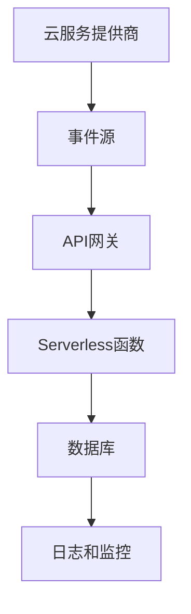

                 

# 如何利用serverless架构降低运维成本

> **关键词：** Serverless架构、云服务、运维成本、自动扩展、无服务器、函数即服务、FaaS

> **摘要：** 本文将探讨如何通过采用Serverless架构，在云服务环境中实现成本优化和运维效率的提升。通过详细解析Serverless架构的核心概念、实现原理和实际应用，读者将了解如何在各种业务场景中利用Serverless技术降低运维成本。

## 1. 背景介绍

在传统云计算模型中，企业需要为运行应用程序的服务器资源进行采购、配置和管理，这不仅涉及到高额的初始投资，还需要大量的时间和人力成本来维护。此外，当业务需求波动时，企业还需要动态调整服务器资源，以避免资源浪费或系统过载。

随着云计算和容器技术的发展，Serverless架构应运而生。Serverless，顾名思义，是一种无需管理服务器即可运行代码的架构，它将计算资源的分配和管理交给云服务提供商。Serverless架构的核心是函数即服务（Function as a Service，简称FaaS），通过FaaS，开发者可以专注于业务逻辑的实现，无需关心底层基础设施的维护。

Serverless架构的出现，不仅为企业提供了灵活的计算资源管理方式，还大大降低了运维成本。本文将围绕Serverless架构的核心概念、实现原理和实际应用，详细分析其在降低运维成本方面的优势。

## 2. 核心概念与联系

### 2.1. Serverless架构的核心概念

Serverless架构的核心在于将计算资源抽象化，使得开发者无需关注底层基础设施的管理。以下是Serverless架构的几个关键概念：

- **函数即服务（FaaS）**：FaaS是一种云计算服务，它允许开发者将代码作为独立的函数部署到云端，并按实际使用量进行计费。
- **无服务器（Serverless）**：无服务器是一种云计算模型，开发者无需管理服务器，只需专注于编写和部署代码。
- **事件驱动（Event-Driven）**：Serverless架构中的函数通常基于事件触发，当某个事件发生时，相关的函数会自动执行。

### 2.2. Serverless架构的架构图

以下是一个简化的Serverless架构图，展示了各组件之间的关系：



### 2.3. Serverless架构的工作原理

Serverless架构的工作原理可以分为以下几个步骤：

1. **事件触发**：事件源（如Web请求、定时任务等）产生事件，并传递给API网关。
2. **API网关接收**：API网关接收事件，并将事件路由到相应的Serverless函数。
3. **函数执行**：Serverless函数根据事件内容执行相应的业务逻辑，并可能访问数据库等外部资源。
4. **结果返回**：函数执行完成后，将结果返回给API网关，最终返回给事件源。

### 2.4. Serverless架构与微服务架构的联系

Serverless架构与微服务架构在很多方面有相似之处，例如它们都强调模块化、可扩展性和高可用性。然而，Serverless架构在底层基础设施管理方面更为抽象，使得开发者可以专注于业务逻辑的实现。

## 3. 核心算法原理 & 具体操作步骤

### 3.1. 核心算法原理

Serverless架构的核心在于其自动扩展和按需计费的能力。具体来说，Serverless架构具有以下两个核心算法原理：

- **自动扩展（Auto Scaling）**：当Serverless函数接收到的请求量增加时，云服务提供商会自动增加函数的实例数量，以保持系统的高性能和高可用性。
- **按需计费（Pay-as-you-Use）**：Serverless架构按照函数的实际执行时间和调用次数进行计费，使得企业能够更精准地控制成本。

### 3.2. 具体操作步骤

下面是一个简单的Serverless函数部署和调用的操作步骤：

1. **编写函数代码**：首先，开发者需要编写函数代码，例如使用Node.js编写的函数如下：

    ```javascript
    exports.handler = async (event, context) => {
        // 处理事件逻辑
        return 'Hello, World!';
    };
    ```

2. **上传函数代码**：将编写的函数代码上传到云服务提供商的函数管理平台，例如AWS Lambda或Azure Functions。

3. **配置函数**：配置函数的触发器和权限，例如设置API网关触发器和函数的角色权限。

4. **测试函数**：通过API网关或其他方式测试函数，确保函数可以正确执行业务逻辑。

5. **部署函数**：将配置好的函数部署到生产环境，等待事件触发。

6. **监控与优化**：通过云服务提供商提供的监控工具，监控函数的执行性能和资源消耗，进行必要的优化。

## 4. 数学模型和公式 & 详细讲解 & 举例说明

### 4.1. 数学模型

Serverless架构的计费通常基于以下数学模型：

- **执行时间（T）**：函数执行的时长，单位为秒。
- **调用次数（C）**：函数被调用的次数。
- **费用（Cost）**：函数的总费用，单位为美元。

费用计算公式如下：

$$
Cost = (C \times C_{\text{per call}}) + (T \times C_{\text{per second}})
$$

其中，$C_{\text{per call}}$ 为每次调用的费用，$C_{\text{per second}}$ 为每秒执行的费用。

### 4.2. 详细讲解

Serverless架构的计费方式与传统的按需计费和包年包月计费有显著不同。在按需计费模型中，费用通常与资源的实际使用量成正比，而在包年包月模型中，费用固定，不受使用量影响。

Serverless架构的计费模型更灵活，能够根据实际的业务需求进行成本优化。例如，当业务高峰期时，调用次数和执行时间可能会增加，导致总费用增加；而在业务低谷期，调用次数和执行时间减少，费用相应降低。

### 4.3. 举例说明

假设一个Serverless函数的每次调用费用为0.0001美元，每秒执行费用为0.00005美元。如果函数在1小时内被调用了1000次，并且执行了平均10秒，那么该函数的总费用计算如下：

$$
Cost = (1000 \times 0.0001) + (3600 \times 0.00005) = 4.8 \text{美元}
$$

这意味着，在该小时内，函数的总费用为4.8美元。如果业务需求发生变动，例如调用次数增加到2000次，执行时间增加到平均15秒，则总费用将增加到7.2美元。

## 5. 项目实战：代码实际案例和详细解释说明

### 5.1. 开发环境搭建

在进行Serverless项目实战之前，我们需要搭建一个适合开发、测试和部署的本地开发环境。以下是使用AWS Lambda和Amazon API Gateway搭建开发环境的步骤：

1. **安装AWS CLI**：在本地计算机上安装AWS CLI，并配置访问权限。
2. **创建AWS账号**：如果没有AWS账号，需要创建一个AWS账号。
3. **设置AWS配置文件**：在本地计算机上创建一个AWS配置文件，用于存储访问凭证。
4. **安装Node.js**：确保本地计算机上安装了Node.js，以便使用AWS Lambda的Node.js运行时。

### 5.2. 源代码详细实现和代码解读

以下是一个简单的AWS Lambda函数示例，该函数用于处理HTTP请求并返回一个JSON响应：

```javascript
const AWS = require('aws-sdk');

exports.handler = async (event) => {
    // 解析请求参数
    const requestId = event.requestContext.requestId;
    const path = event.path;

    // 构建响应数据
    const response = {
        statusCode: 200,
        body: JSON.stringify({
            requestId: requestId,
            path: path
        })
    };

    // 返回响应
    return response;
};
```

### 5.3. 代码解读与分析

上述代码是一个简单的AWS Lambda函数，用于处理HTTP请求并返回一个包含请求ID和路径的JSON响应。以下是代码的详细解读：

- **导入AWS模块**：首先，导入AWS模块，以便使用AWS Lambda和API Gateway的相关API。
- **定义函数入口**：使用`exports.handler`定义函数入口，这是AWS Lambda要求的标准函数入口点。
- **异步函数**：`async`关键字表示这是一个异步函数，可以处理异步操作。
- **解析请求参数**：从请求事件中获取请求ID和路径。
- **构建响应数据**：构建一个包含请求ID和路径的JSON响应对象。
- **返回响应**：使用`return`关键字返回响应对象。

### 5.4. 部署函数

部署AWS Lambda函数的步骤如下：

1. **上传函数代码**：将本地编写的函数代码上传到AWS Lambda服务。
2. **配置函数**：配置函数的触发器和权限，例如设置API Gateway触发器和AWS IAM角色。
3. **测试函数**：通过API Gateway或AWS CloudWatch测试函数，确保函数可以正确执行。

## 6. 实际应用场景

Serverless架构在许多实际应用场景中具有优势，以下是一些常见的应用场景：

- **Web后端服务**：例如，处理HTTP请求、API接口调用等。
- **数据加工和处理**：例如，实时数据处理、批处理任务等。
- **移动应用后端**：为移动应用提供后端支持，例如用户认证、数据存储等。
- **物联网（IoT）应用**：处理来自物联网设备的实时数据，例如传感器数据处理等。

### 6.1. 应用场景分析

在Web后端服务场景中，Serverless架构可以提供高性能、可扩展的后端支持。由于函数可以根据请求量自动扩展，因此可以轻松应对高并发请求。此外，Serverless架构还减少了服务器管理和维护的工作量，使得开发者可以更加专注于业务逻辑的实现。

在数据加工和处理场景中，Serverless架构可以提供灵活的数据处理解决方案。开发者可以基于事件驱动的方式，实时处理来自数据源的数据，并触发后续的加工和处理任务。这种模式不仅提高了数据处理效率，还降低了维护成本。

在移动应用后端场景中，Serverless架构可以为移动应用提供高效、稳定的后端支持。由于函数可以根据请求量自动扩展，因此可以轻松应对移动应用的突发流量。此外，Serverless架构还减少了服务器管理和维护的工作量，使得开发者可以更加专注于移动应用的开发。

在物联网（IoT）应用场景中，Serverless架构可以提供高效、实时的数据处理解决方案。开发者可以基于事件驱动的方式，实时处理来自物联网设备的传感器数据，并触发后续的数据分析和处理任务。这种模式不仅提高了数据处理效率，还降低了维护成本。

## 7. 工具和资源推荐

### 7.1. 学习资源推荐

- **书籍**：
  - 《Serverless架构：构建弹性和可扩展的应用》（Building Serverless Architectures）
  - 《无服务器架构：实践指南》（Serverless Architectures: How to Enable and Use Modern Cloud Services）
- **论文**：
  - "Serverless Computing: Everything You Need to Know"（Serverless Computing：你需要了解的一切）
  - "Serverless Architecture Design Patterns"（无服务器架构设计模式）
- **博客**：
  - AWS Lambda官方博客：[https://aws.amazon.com/blogs/compute/](https://aws.amazon.com/blogs/compute/)
  - Azure Functions官方博客：[https://docs.microsoft.com/en-us/azure/azure-functions/](https://docs.microsoft.com/en-us/azure/azure-functions/)
- **网站**：
  - Serverless官网：[https://serverless.com/](https://serverless.com/)
  - Serverless Weekly：[https://serverless-weekly.com/](https://serverless-weekly.com/)

### 7.2. 开发工具框架推荐

- **AWS Lambda**：AWS提供的Serverless计算服务，支持多种编程语言。
- **Azure Functions**：Azure提供的Serverless计算服务，支持多种编程语言。
- **Google Cloud Functions**：Google提供的Serverless计算服务，支持多种编程语言。
- **Kubernetes**：用于容器编排和管理的开源平台，支持在容器中运行Serverless函数。

### 7.3. 相关论文著作推荐

- "Serverless Architectures: An Introduction"（无服务器架构：介绍）
- "A Comparison of Serverless and Container Technologies"（无服务器与容器技术比较）
- "Serverless and Edge Computing: A Survey"（无服务器与边缘计算：调查）

## 8. 总结：未来发展趋势与挑战

Serverless架构在云计算领域的发展趋势持续向好，越来越多的企业选择采用Serverless技术来构建和优化其应用架构。以下是Serverless架构的未来发展趋势和面临的挑战：

### 8.1. 发展趋势

- **技术成熟度提升**：随着各大云服务提供商对Serverless技术的不断优化，其性能和可靠性得到了显著提升，为企业提供了更加可靠的选择。
- **功能丰富**：Serverless架构的功能持续丰富，支持更多的编程语言、数据库和第三方服务，使得开发者可以更加灵活地构建应用。
- **生态系统完善**：Serverless生态系统的完善，包括工具、框架和社区资源的丰富，使得开发者可以更加高效地开发和部署Serverless应用。

### 8.2. 面临的挑战

- **安全性**：Serverless架构的安全性仍然是一个重要挑战，如何确保函数的安全运行和数据的保护，需要企业投入更多的关注。
- **资源规划**：虽然Serverless架构提供了自动扩展和按需计费的优势，但如何进行合理的资源规划，以避免资源浪费或成本过高，仍然是一个需要解决的问题。
- **技术迁移**：对于已经采用传统云计算模型的企业，如何进行技术迁移，以充分利用Serverless架构的优势，也是一项挑战。

## 9. 附录：常见问题与解答

### 9.1. 什么是Serverless架构？

Serverless架构是一种云计算模型，它允许开发者无需管理服务器即可运行代码。Serverless架构的核心是函数即服务（FaaS），通过FaaS，开发者可以专注于业务逻辑的实现，无需关心底层基础设施的维护。

### 9.2. Serverless架构的优势是什么？

Serverless架构的主要优势包括：

- **自动扩展**：Serverless架构可以根据实际需求自动扩展和缩减资源，提高系统性能和稳定性。
- **按需计费**：Serverless架构按照实际使用量进行计费，降低企业成本。
- **减少运维**：Serverless架构减轻了开发者对服务器管理的负担，使其能够更加专注于业务逻辑的实现。

### 9.3. 如何选择Serverless平台？

选择Serverless平台时，可以从以下几个方面进行考虑：

- **功能支持**：平台是否支持所需的功能，如编程语言、数据库和第三方服务。
- **性能和可靠性**：平台的性能和可靠性如何，是否符合业务需求。
- **成本**：平台的计费模式和成本是否符合预算。
- **社区和支持**：平台的社区资源是否丰富，技术支持是否及时。

### 9.4. Serverless架构与容器技术有何区别？

Serverless架构与容器技术的主要区别在于资源管理和部署模型。容器技术通过Docker等工具将应用程序及其依赖项打包到容器中，由Kubernetes等容器编排工具进行管理。而Serverless架构则将代码作为独立的函数部署到云端，由云服务提供商进行资源管理和调度。

## 10. 扩展阅读 & 参考资料

- **参考文献**：
  - "Serverless Computing: Everything You Need to Know"（Serverless Computing：你需要了解的一切）
  - "Serverless Architectures: How to Enable and Use Modern Cloud Services"（无服务器架构：实践指南）
  - "Building Serverless Architectures"（Serverless架构：构建弹性和可扩展的应用）
- **在线资源**：
  - AWS Lambda官方文档：[https://aws.amazon.com/lambda/](https://aws.amazon.com/lambda/)
  - Azure Functions官方文档：[https://docs.microsoft.com/en-us/azure/azure-functions/](https://docs.microsoft.com/en-us/azure/azure-functions/)
  - Serverless官网：[https://serverless.com/](https://serverless.com/)
  - Serverless Weekly：[https://serverless-weekly.com/](https://serverless-weekly.com/)

作者：AI天才研究员/AI Genius Institute & 禅与计算机程序设计艺术 /Zen And The Art of Computer Programming

