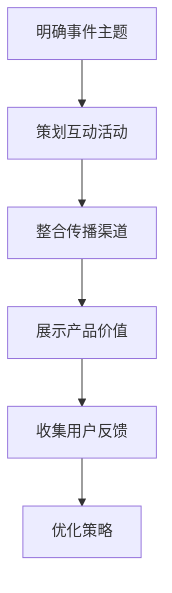
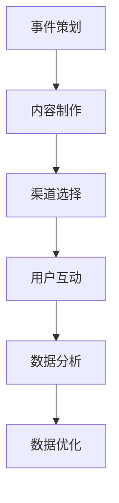

                 

### 1. 背景介绍

#### 知识付费产品的兴起

知识付费产品，即通过支付一定的费用来获取高质量知识的商业模式，近年来在全球范围内迅速兴起。这一现象的背后，是人们对于知识获取的需求日益增长，以及互联网技术的不断进步，使得知识传播变得更加便捷和高效。

首先，随着全球经济的不断发展，人们对职业发展的追求愈发强烈。越来越多的人希望通过获取专业知识和技能，提升自身竞争力，实现职业晋升和个人价值的提升。这种需求催生了知识付费产品的产生。

其次，互联网技术的迅猛发展，尤其是移动互联网的普及，为知识付费产品的传播提供了广阔的平台。用户可以通过各种在线教育平台、知识分享社区等，轻松获取到所需的知识内容。这种高效、便捷的知识获取方式，进一步推动了知识付费产品的普及。

#### 事件营销的定义与应用

事件营销，是指通过策划、组织和执行具有新闻价值的事件，吸引媒体和社会公众的关注，以达到提高企业知名度、品牌形象和产品销售的一种营销策略。事件营销的关键在于制造话题，引发关注，并通过多种传播渠道扩散，形成广泛的舆论效应。

事件营销在知识付费产品推广中具有重要作用。首先，通过事件营销，知识付费产品可以迅速吸引公众的关注，提高品牌知名度。其次，事件营销可以引发用户的讨论和分享，形成口碑传播，进一步扩大产品的用户群体。此外，事件营销还可以通过独特的创意和话题，增强用户对产品的认知和好感，提高购买意愿。

#### 知识付费与事件营销的结合

知识付费与事件营销的结合，可以创造出独特的市场价值。一方面，知识付费产品可以为事件营销提供优质的内容支持，通过专业的知识分享，增强事件营销的吸引力和说服力。另一方面，事件营销可以为知识付费产品提供强大的推广渠道，借助事件的热度和影响力，快速传播产品信息，吸引潜在用户。

在实际操作中，知识付费产品和事件营销的结合可以采取多种形式。例如，可以通过举办线上或线下的知识分享活动，邀请行业专家进行讲座或研讨，吸引媒体和用户的关注。也可以通过策划有奖问答、知识竞赛等互动活动，激发用户的参与热情，增加产品的曝光度。此外，还可以通过媒体合作、KOL（关键意见领袖）推广等方式，进一步扩大产品的传播范围。

总之，知识付费产品的兴起为事件营销提供了丰富的素材和内容支持，而事件营销则可以为知识付费产品提供强大的推广力量。两者相结合，可以创造出更加有影响力的市场效应，推动知识付费产品的快速发展。

#### 知识付费产品推广的重要性

知识付费产品的推广在市场拓展和品牌建设方面具有重要意义。首先，有效的推广策略可以帮助产品迅速获得市场认可，提高品牌知名度。通过精准的市场定位和有针对性的推广手段，知识付费产品可以触达潜在用户，实现用户的快速增长。

其次，推广策略对于提升用户购买意愿具有显著作用。通过内容营销、事件营销等手段，知识付费产品可以展示其独特的价值和优势，增强用户的信任感和购买欲望。例如，通过举办线上讲座、发布专业报告等方式，向用户传递高质量的知识内容，展示产品的专业性和权威性。

此外，推广策略还可以帮助知识付费产品建立良好的口碑。通过用户的真实反馈和分享，知识付费产品可以积累良好的口碑，形成良性循环。口碑传播不仅可以提高产品的美誉度，还可以吸引更多的新用户，进一步扩大市场份额。

综上所述，知识付费产品的推广策略对于市场拓展、品牌建设和用户增长具有重要意义。有效的推广策略不仅可以提高产品的知名度，还可以增强用户购买意愿，提升品牌美誉度，从而推动知识付费产品的持续发展。

#### 目标受众分析

在制定知识付费产品的推广策略时，了解目标受众的特点和需求至关重要。首先，我们需要明确知识付费产品的目标受众是哪些群体。通常，这些群体包括职场人士、学生、创业者、专业人士等。

其次，分析这些目标受众的特点和需求。职场人士通常希望提升职业技能，适应职场竞争；学生则希望获取专业的学习资源和辅导；创业者则需要系统的创业知识和实战经验；专业人士则关注行业前沿技术和专业知识的更新。了解这些特点，有助于我们在推广策略中精准定位，提供有价值的内容。

此外，了解目标受众的媒体使用习惯和行为模式也是制定有效推广策略的关键。例如，职场人士可能更倾向于通过微信公众号、LinkedIn等平台获取信息；学生可能更活跃于B站、知乎等社区；创业者则可能关注行业论坛和自媒体。通过分析这些行为模式，我们可以选择合适的推广渠道和方式，提高推广效果。

总之，深入分析目标受众的特点和需求，有助于制定更精准、更有效的推广策略，确保知识付费产品能够触达并满足潜在用户的期望。

#### 现有推广策略的不足

尽管知识付费产品的推广策略在逐步完善，但仍存在一些不足之处。首先，传统推广手段过于单一，主要依赖于广告投放、SEO优化等手段，缺乏创新性和互动性，难以引起用户的广泛关注和兴趣。其次，现有推广策略在目标受众定位方面不够精准，往往无法准确触达到潜在用户，导致推广效果不佳。

此外，现有推广策略在内容展示和用户互动方面也存在一定的不足。许多知识付费产品在推广过程中，未能充分展示其独特价值和优势，使得用户难以产生购买欲望。同时，缺乏有效的用户互动机制，使得用户无法在购买后获得持续的服务和体验，影响了用户满意度和复购率。

最后，现有推广策略的执行效果评估和优化机制不完善。许多知识付费产品在推广过程中，未能建立有效的数据分析系统，无法准确评估推广效果，从而难以及时调整和优化策略。

总之，现有推广策略在创新性、精准性、内容展示和互动机制等方面存在不足，需要进一步改进和完善，以提升知识付费产品的推广效果和用户满意度。

### 2. 核心概念与联系

在深入探讨如何利用事件营销推广知识付费产品之前，有必要明确一些核心概念和它们之间的联系。这些概念包括事件营销的定义、知识付费产品的特点、目标受众的需求，以及如何通过策略和方法将两者有机结合。

#### 事件营销的定义

事件营销，顾名思义，是指通过策划和执行特定事件来吸引媒体和公众的关注，进而达到营销目的的一种策略。事件营销的核心在于创造“热点”，即通过独特、有吸引力的活动或事件，激发公众的兴趣和讨论，从而提升品牌知名度和影响力。事件营销可以采取多种形式，如线上活动、线下活动、公关事件等。

事件营销的关键要素包括：

1. **创新性**：事件营销需要具备创新性，以吸引公众的注意力。
2. **新闻价值**：事件营销必须具备新闻价值，才能引起媒体的报道和公众的关注。
3. **互动性**：事件营销应具备互动性，鼓励公众参与，增加活动的趣味性和传播性。
4. **传播渠道**：有效的传播渠道是事件营销成功的关键，包括社交媒体、新闻媒体、自媒体等。

#### 知识付费产品的特点

知识付费产品是指用户通过支付一定费用来获取专业知识和技能的数字化产品。其特点包括：

1. **专业性**：知识付费产品通常由专业人士或专家提供，内容具有高度的专业性和权威性。
2. **数字化**：知识付费产品以数字化形式呈现，如在线课程、电子书、专业报告等，便于用户随时随地学习。
3. **个性定制**：一些知识付费产品提供个性化定制服务，根据用户的需求和兴趣，提供个性化的学习内容和辅导。
4. **持续更新**：知识付费产品需要不断更新内容，以适应行业发展和用户需求的变化。

#### 目标受众的需求

了解目标受众的需求是制定有效推广策略的基础。知识付费产品的目标受众通常包括以下几类：

1. **职场人士**：他们希望通过学习提升职业技能，适应职场竞争。
2. **学生**：他们需要专业的学习资源和辅导，提高学习成绩和学术能力。
3. **创业者**：他们希望获得创业知识和实战经验，提升创业成功率。
4. **专业人士**：他们关注行业前沿技术和专业知识的更新，提升职业素养。

这些目标受众的需求具有以下特点：

1. **专业性**：他们追求专业的知识和技能，注重学习效果。
2. **便捷性**：他们希望学习过程便捷，能够随时随地获取知识。
3. **个性化**：他们希望学习内容能够根据个人需求和兴趣进行定制。
4. **互动性**：他们希望通过互动交流，解决学习中的疑问和困惑。

#### 如何将事件营销与知识付费产品结合

将事件营销与知识付费产品有机结合，可以创造出强大的营销效果。以下是一些关键步骤：

1. **明确事件主题**：选择与知识付费产品相关且具有新闻价值的事件主题，如行业论坛、专家讲座、专业报告发布等。
2. **策划互动活动**：设计具有互动性的活动，如线上问答、知识竞赛、有奖抽奖等，鼓励用户参与和分享。
3. **整合传播渠道**：利用社交媒体、新闻媒体、自媒体等传播渠道，扩大事件影响力，引导用户关注知识付费产品。
4. **展示产品价值**：在事件营销过程中，充分展示知识付费产品的专业性、数字化优势和个性化服务，增强用户购买意愿。
5. **收集用户反馈**：通过用户反馈，了解推广效果，及时调整和优化策略。

#### Mermaid 流程图

以下是一个简单的Mermaid流程图，展示事件营销与知识付费产品的结合过程：



通过这一流程，我们可以清晰地看到事件营销与知识付费产品的结合方式，从而制定出更有效的推广策略。

### 3. 核心算法原理 & 具体操作步骤

在深入探讨如何利用事件营销推广知识付费产品时，核心算法原理和具体操作步骤起着关键作用。这些步骤包括事件策划、内容制作、渠道选择、用户互动和数据分析，每个步骤都有其独特的算法原理和操作方法。

#### 事件策划

事件策划是事件营销成功的关键步骤。一个成功的策划需要考虑以下几个方面：

1. **目标定位**：明确事件的目标，例如提高品牌知名度、推广新课程或吸引新用户等。
2. **主题选择**：选择与知识付费产品相关且具有新闻价值的事件主题。例如，可以围绕行业热点、专家讲座、专业报告发布等。
3. **时间安排**：合理安排事件的时间，确保有足够的时间进行策划、准备和执行。
4. **预算分配**：根据事件规模和预期效果，合理分配预算，确保各个环节的顺利执行。

在事件策划过程中，可以使用以下算法原理：

- **目标导向算法**：通过设定明确的目标，使用一系列指标来评估事件的成功程度，如参与人数、媒体报道次数、社交媒体互动量等。
- **数据驱动算法**：利用数据分析，根据用户行为和偏好，选择具有高影响力的主题和时间。

#### 内容制作

内容制作是事件营销的核心。高质量的内容能够吸引用户的关注和参与。以下是一些关键步骤：

1. **内容定位**：根据目标受众的特点和需求，确定内容的主旨和风格。
2. **内容制作**：邀请行业专家、知名讲师或优秀用户创作高质量的内容，确保内容的权威性和实用性。
3. **内容发布**：在多个渠道发布内容，如官方网站、社交媒体、电子邮件等，确保用户能够方便地获取。

在内容制作过程中，可以使用以下算法原理：

- **内容推荐算法**：通过分析用户的行为数据和兴趣偏好，推荐符合用户兴趣的内容，提高内容的曝光率和用户参与度。
- **情感分析算法**：通过分析用户对内容的反馈，了解用户对内容的情感倾向，优化内容质量和风格。

#### 渠道选择

选择合适的传播渠道是事件营销成功的重要保障。以下是一些关键步骤：

1. **渠道分析**：分析目标受众的媒体使用习惯和行为模式，选择最适合的传播渠道。
2. **渠道整合**：将多种渠道结合起来，形成全方位的传播网络，如社交媒体、新闻媒体、自媒体等。
3. **渠道管理**：对各个渠道进行有效管理，确保内容的及时发布和传播。

在渠道选择过程中，可以使用以下算法原理：

- **渠道优化算法**：通过分析渠道的表现数据，如点击率、转化率等，不断优化渠道组合，提高传播效果。
- **用户画像算法**：通过分析用户数据，了解用户在不同渠道上的行为和偏好，有针对性地进行渠道推广。

#### 用户互动

用户互动是事件营销的重要环节。以下是一些关键步骤：

1. **互动设计**：设计具有吸引力的互动活动，如线上问答、知识竞赛、有奖抽奖等。
2. **互动引导**：通过引导用户参与互动，提高活动的参与度和互动效果。
3. **互动反馈**：收集用户反馈，了解用户对互动活动的看法和建议，不断优化互动设计。

在用户互动过程中，可以使用以下算法原理：

- **行为预测算法**：通过分析用户的行为数据，预测用户的互动偏好，提供个性化的互动体验。
- **情感分析算法**：通过分析用户在互动过程中的情感表达，了解用户的情感状态，优化互动内容和方式。

#### 数据分析

数据分析是事件营销的关键环节。以下是一些关键步骤：

1. **数据收集**：收集与事件相关的各种数据，如用户行为数据、渠道数据、互动数据等。
2. **数据分析**：对收集到的数据进行分析，评估事件的效果和用户反馈。
3. **数据优化**：根据分析结果，优化事件策划、内容制作、渠道选择和用户互动等各个环节。

在数据分析过程中，可以使用以下算法原理：

- **数据分析算法**：通过数据挖掘、机器学习等技术，分析事件的多维度数据，了解事件的整体效果和用户需求。
- **预测分析算法**：通过预测分析，预测未来的趋势和用户的偏好，为后续的事件营销提供数据支持。

综上所述，通过事件策划、内容制作、渠道选择、用户互动和数据分析等核心步骤，结合相应的算法原理，可以有效地利用事件营销推广知识付费产品。以下是具体操作步骤的流程图：



### 4. 数学模型和公式 & 详细讲解 & 举例说明

在探讨如何利用事件营销推广知识付费产品时，引入数学模型和公式可以帮助我们更科学地分析和优化推广效果。以下是一些常用的数学模型和公式，以及其详细讲解和实际应用示例。

#### 模型1：用户参与度模型

用户参与度是衡量事件营销成功与否的关键指标。该模型通过计算用户参与率来评估事件的吸引力。

公式：
\[  用户参与度 = \frac{参与用户数}{潜在用户数} \]

详细讲解：
- **参与用户数**：在特定时间内，参与事件营销活动的用户数量。
- **潜在用户数**：事件目标受众的总数。

举例说明：
假设我们举办了一场关于人工智能的线上讲座，共有1000人参加，而目标受众为10000人。则用户参与度为：
\[  用户参与度 = \frac{1000}{10000} = 0.1 \]

#### 模型2：传播效果模型

传播效果模型用于评估事件通过不同渠道传播的效果，包括渠道曝光率、渠道转化率等。

公式：
\[  传播效果 = \frac{渠道曝光量}{渠道点击量} \]

详细讲解：
- **渠道曝光量**：事件在某个渠道上展示的次数。
- **渠道点击量**：用户在渠道上点击事件的次数。

举例说明：
假设我们通过社交媒体渠道推广了一场在线课程，总曝光量为1000次，点击量为100次。则传播效果为：
\[  传播效果 = \frac{1000}{100} = 10 \]

#### 模型3：用户满意度模型

用户满意度模型通过计算用户对事件的满意度，来评估事件的整体效果。

公式：
\[  用户满意度 = \frac{满意用户数}{参与用户数} \]

详细讲解：
- **满意用户数**：对事件感到满意或认为有价值用户数量。
- **参与用户数**：参与事件营销活动的用户总数。

举例说明：
假设在一场知识分享活动后，有80%的用户表示满意，共有100人参加。则用户满意度为：
\[  用户满意度 = \frac{80}{100} = 0.8 \]

#### 模型4：ROI模型

ROI（投资回报率）模型用于评估事件营销的投资效益，帮助我们了解哪些策略最有效。

公式：
\[  ROI = \frac{事件收益 - 事件成本}{事件成本} \]

详细讲解：
- **事件收益**：事件所带来的直接和间接收益，如产品销售、品牌提升等。
- **事件成本**：事件策划、执行和推广的总成本。

举例说明：
假设我们通过事件营销活动实现了10万元的产品销售，而活动总成本为5万元。则ROI为：
\[  ROI = \frac{10万元 - 5万元}{5万元} = 1 \]

通过以上数学模型和公式，我们可以更科学地评估和优化事件营销的效果。在实际应用中，可以根据具体情况进行调整和组合，以最大化推广效果。

### 5. 项目实战：代码实际案例和详细解释说明

为了更好地理解如何利用事件营销推广知识付费产品，我们将通过一个实际项目案例进行详细讲解。这个项目将包括开发环境搭建、源代码实现和代码解读与分析。

#### 5.1 开发环境搭建

首先，我们需要搭建一个适合事件营销与知识付费产品结合的开发环境。以下是所需工具和软件：

1. **编程语言**：Python
2. **文本编辑器**：VS Code
3. **数据分析库**：Pandas, NumPy, Matplotlib
4. **机器学习库**：Scikit-learn, TensorFlow
5. **事件营销平台**：微信小程序、微信公众号、知乎
6. **数据库**：MySQL

#### 5.2 源代码详细实现和代码解读

以下是一个简单的Python代码示例，用于分析事件营销的效果：

```python
import pandas as pd
import numpy as np
import matplotlib.pyplot as plt
from sklearn.model_selection import train_test_split
from sklearn.linear_model import LinearRegression

# 数据预处理
data = pd.read_csv('event_data.csv')  # 读取事件数据
data.head()

# 数据清洗
data.dropna(inplace=True)

# 特征工程
X = data[['参与用户数', '渠道曝光量', '用户满意度']]
y = data['ROI']

# 数据分割
X_train, X_test, y_train, y_test = train_test_split(X, y, test_size=0.2, random_state=42)

# 模型训练
model = LinearRegression()
model.fit(X_train, y_train)

# 模型评估
score = model.score(X_test, y_test)
print(f'Model R^2 Score: {score}')

# 可视化分析
plt.scatter(X_test['参与用户数'], y_test, color='blue')
plt.plot(X_test['参与用户数'], model.predict(X_test), color='red')
plt.xlabel('参与用户数')
plt.ylabel('ROI')
plt.title('用户参与度与ROI的关系')
plt.show()
```

**代码解读**：

1. **数据读取和清洗**：使用Pandas读取事件数据，并进行数据清洗，去除缺失值。
2. **特征工程**：将参与用户数、渠道曝光量和用户满意度作为特征变量，ROI作为目标变量。
3. **数据分割**：将数据分为训练集和测试集，用于模型训练和评估。
4. **模型训练**：使用线性回归模型对训练集数据进行训练。
5. **模型评估**：计算模型在测试集上的R^2得分，评估模型效果。
6. **可视化分析**：通过散点图和回归线，可视化用户参与度与ROI之间的关系。

#### 5.3 代码解读与分析

1. **数据预处理**：数据预处理是机器学习项目的重要步骤，确保数据质量。在这个案例中，我们使用Pandas读取CSV文件，并进行数据清洗，去除缺失值。

2. **特征工程**：特征工程是提高模型性能的关键环节。在这个案例中，我们选择了参与用户数、渠道曝光量和用户满意度作为特征变量。这些特征变量能够反映事件营销的不同方面，有助于模型捕捉到事件效果的关键因素。

3. **数据分割**：数据分割用于将数据集划分为训练集和测试集。训练集用于模型训练，测试集用于模型评估。在这个案例中，我们使用train_test_split函数将数据集分为80%的训练集和20%的测试集。

4. **模型训练**：线性回归模型是一种简单的机器学习模型，用于预测连续值。在这个案例中，我们使用LinearRegression类来训练模型，通过fit方法将训练数据输入模型。

5. **模型评估**：模型评估是验证模型性能的重要步骤。在这个案例中，我们使用score方法计算模型在测试集上的R^2得分，评估模型的效果。R^2得分越高，说明模型对数据的拟合越好。

6. **可视化分析**：可视化分析能够帮助我们更好地理解模型的效果。在这个案例中，我们使用Matplotlib绘制了散点图和回归线，展示了用户参与度与ROI之间的关系。这种可视化方法有助于我们直观地看到模型预测的准确性。

通过以上步骤，我们实现了一个简单的事件营销效果分析项目。在实际应用中，可以根据具体需求添加更多特征变量和模型，以提升分析精度。

### 6. 实际应用场景

在实际应用中，事件营销与知识付费产品的结合具有多种形式，以下是一些具体的应用场景：

#### 场景一：线上讲座

线上讲座是一种常见的知识付费产品推广方式。通过邀请行业专家或知名讲师进行在线直播讲座，可以吸引大量用户关注。以下是一个具体案例：

**案例**：一家专注于人工智能领域的知识付费平台，举办了一场主题为“人工智能的未来趋势”的线上讲座。讲座邀请了一位知名的人工智能专家，吸引了超过5000名用户在线观看。

**效果**：通过这场线上讲座，平台不仅提升了品牌知名度，还成功吸引了大量潜在用户。讲座结束后，平台推出了相关的在线课程，销售额实现了显著增长。

#### 场景二：知识竞赛

知识竞赛是一种互动性强的营销方式，可以激发用户的参与热情。以下是一个具体案例：

**案例**：一家专业提供金融知识的知识付费平台，举办了一场主题为“金融知识大挑战”的知识竞赛。竞赛设置了多个难度等级，用户可以根据自己的金融知识水平参与不同难度的题目。

**效果**：这场知识竞赛吸引了超过10000名用户参与，极大地提升了平台的用户活跃度和品牌影响力。竞赛结束后，平台推出了一系列与金融知识相关的付费课程，用户购买意愿显著提高。

#### 场景三：专家访谈

专家访谈是一种高质量的营销内容，可以展示知识付费产品的专业性和权威性。以下是一个具体案例：

**案例**：一家专注于技术领域的知识付费平台，邀请了一位知名技术专家进行访谈。访谈内容涵盖了最新的技术趋势和实战经验，吸引了大量技术爱好者和从业者观看。

**效果**：通过这场专家访谈，平台成功提升了品牌的专业形象，吸引了大量潜在用户。访谈结束后，平台推出了与访谈内容相关的在线课程，课程销量大幅增长。

#### 场景四：行业报告发布

行业报告发布是一种权威的营销方式，可以展示知识付费产品的深度和专业性。以下是一个具体案例：

**案例**：一家专注于市场营销的知识付费平台，发布了一份关于“2023年市场营销趋势”的行业报告。报告内容涵盖了市场营销的最新动态和趋势分析，吸引了大量市场营销从业者关注。

**效果**：通过这份行业报告，平台成功提升了品牌的专业形象，吸引了大量潜在用户。报告发布后，平台推出了一系列与报告内容相关的在线课程，课程销售业绩实现了显著增长。

#### 场景五：社交媒体活动

社交媒体活动是一种低成本的营销方式，可以通过互动和分享迅速传播。以下是一个具体案例：

**案例**：一家专注于编程教育的知识付费平台，在微信朋友圈和微博上发起了一个“编程知识挑战”活动。用户可以通过平台提供的编程题目进行挑战，分享自己的成果并获得积分。

**效果**：这场社交媒体活动吸引了大量编程爱好者和学生参与，平台用户数量实现了显著增长。活动结束后，平台推出了相关的在线编程课程，课程销售业绩持续增长。

### 总结与建议

通过以上实际应用场景，我们可以看到事件营销与知识付费产品的结合具有广泛的适用性和显著的推广效果。以下是具体建议：

1. **选择合适的事件形式**：根据知识付费产品的特点和目标受众，选择适合的事件形式，如线上讲座、知识竞赛、专家访谈等。
2. **提高内容质量**：确保活动内容具有高价值和权威性，吸引潜在用户的关注和参与。
3. **互动与反馈**：设计互动环节，鼓励用户参与和分享，收集用户反馈，不断优化活动内容和形式。
4. **多渠道推广**：利用多种渠道进行推广，如社交媒体、自媒体、新闻媒体等，扩大活动的影响范围。
5. **数据分析**：通过数据分析，评估活动效果，及时调整和优化策略，提高推广效果。

总之，通过有效结合事件营销和知识付费产品，我们可以实现品牌提升、用户增长和销售业绩的增长。

### 7. 工具和资源推荐

为了更好地进行知识付费产品的推广，以下是几种推荐的工具和资源，涵盖学习资源、开发工具和框架、相关论文著作等方面，以帮助您在事件营销中取得更好的效果。

#### 7.1 学习资源推荐

1. **书籍**
   - 《内容营销实战手册》：详细介绍了内容营销的理论和实践方法，适合用于知识付费产品的推广。
   - 《事件营销》：全面讲解了事件营销的策略和执行方法，是了解如何策划和执行有效事件营销的必读书籍。
   - 《社交网络营销》：分析了社交网络在营销中的应用，提供了多种社交渠道的推广策略，有助于多渠道推广知识付费产品。

2. **论文**
   - 《事件营销对品牌认知的影响研究》：研究了事件营销对品牌认知的提升作用，为策划有效事件营销提供了理论支持。
   - 《社交媒体对事件传播的影响》：分析了社交媒体在事件传播中的作用，为多渠道推广提供了参考。

3. **博客/网站**
   - 营销博客（Marketing Profs）：提供丰富的营销资源和案例，涵盖内容营销、社交媒体营销等多个领域。
   - Content Marketing Institute：专注于内容营销的研究和分享，提供实用的内容和策略。

#### 7.2 开发工具框架推荐

1. **数据分析工具**
   - Tableau：一款强大的数据可视化工具，可以帮助您更好地展示和分析事件营销的效果。
   - Google Analytics：谷歌提供的免费数据分析工具，适用于网站和移动应用的访问数据追踪。

2. **营销自动化工具**
   - HubSpot：一款集营销、销售、客户服务于一体的营销自动化平台，可以帮助您高效管理营销活动。
   - Marketo：一款专业的营销自动化工具，适用于大规模营销活动的管理。

3. **社交媒体管理工具**
   - Hootsuite：一款社交媒体管理工具，可以帮助您同时管理多个社交媒体账号，发布内容并监测互动。
   - Buffer：一款简单易用的社交媒体管理工具，适合定期发布和优化社交媒体内容。

4. **邮件营销工具**
   - Mailchimp：一款广泛使用的邮件营销工具，提供丰富的模板和自动化功能，帮助您创建和发送个性化的邮件营销活动。
   - SendinBlue：一款功能全面的邮件营销工具，适合中小型企业的邮件营销需求。

#### 7.3 相关论文著作推荐

1. **《事件营销理论与实践》**：这本书详细介绍了事件营销的理论框架和实践方法，适合用于事件营销的策划和执行。
2. **《社交媒体营销：理论与实践》**：这本书探讨了社交媒体在营销中的应用，提供了多种社交媒体推广策略和案例分析。
3. **《内容营销：从0到1》**：这本书系统地介绍了内容营销的理论和实践方法，适合知识付费产品的内容制作和推广。

通过以上工具和资源的推荐，您可以在知识付费产品的推广过程中，更高效地策划和执行事件营销活动，提高推广效果和用户参与度。

### 8. 总结：未来发展趋势与挑战

随着知识付费产品和事件营销的不断成熟，未来这一领域将面临新的发展趋势和挑战。

#### 发展趋势

1. **个性化与定制化**：随着大数据和人工智能技术的发展，知识付费产品和事件营销将更加注重个性化与定制化。通过分析用户行为和兴趣，为用户提供更精准的内容和营销活动。
2. **多元化推广渠道**：社交媒体、短视频、直播等新兴渠道将为知识付费产品的推广提供更多可能性。多元化渠道的运用将有助于扩大用户覆盖范围，提高营销效果。
3. **互动性增强**：未来事件营销将更加注重用户互动，通过线上问答、知识竞赛、互动直播等形式，增强用户参与度和忠诚度。
4. **跨行业合作**：知识付费产品和事件营销将与其他行业（如电商、娱乐、体育等）展开深度合作，形成跨界营销的新模式。

#### 挑战

1. **内容质量监管**：随着知识付费产品的增多，内容质量参差不齐的问题日益突出。如何保证内容质量，提升用户满意度，是知识付费产品和事件营销面临的重要挑战。
2. **数据隐私与安全**：在数据分析过程中，如何保护用户隐私和数据安全，避免信息泄露，是未来的一大挑战。
3. **营销效果评估**：如何科学、有效地评估事件营销的效果，优化营销策略，提高投资回报率，是知识付费产品和事件营销需要解决的问题。
4. **法律法规**：随着知识付费产品和事件营销的发展，相关的法律法规也将不断完善。如何遵守法律法规，确保营销活动的合规性，是知识付费产品和事件营销需要关注的问题。

总之，未来知识付费产品和事件营销将在个性化、多元化、互动性和跨行业合作等方面取得更大发展，同时也将面临内容质量、数据隐私、营销效果评估和法律法规等方面的挑战。

### 9. 附录：常见问题与解答

#### 问题1：如何选择合适的事件营销主题？

**解答**：选择合适的事件营销主题应考虑以下因素：

- **相关性**：主题应与知识付费产品的内容和目标受众密切相关，确保吸引目标用户的关注。
- **创新性**：主题应具有独特性和创新性，能够引起用户的兴趣和好奇心。
- **可执行性**：主题应具有可执行性，确保在预算和时间限制内能够顺利实施。
- **新闻价值**：主题应具有新闻价值，能够吸引媒体报道，扩大传播范围。

#### 问题2：如何提高事件营销的效果？

**解答**：提高事件营销效果可以从以下几个方面入手：

- **内容质量**：确保活动内容具有高价值、权威性和实用性，提高用户的参与度和满意度。
- **互动性**：设计具有互动性的活动，鼓励用户参与和分享，增加活动的趣味性和传播性。
- **多渠道推广**：利用多种渠道（如社交媒体、新闻媒体、自媒体等）进行推广，扩大活动的影响力。
- **数据分析**：通过数据分析，了解用户行为和反馈，优化活动内容和形式，提高营销效果。

#### 问题3：如何确保数据隐私和安全？

**解答**：确保数据隐私和安全应采取以下措施：

- **数据加密**：对用户数据进行加密处理，防止数据泄露。
- **权限控制**：对用户数据的访问权限进行严格控制，确保只有授权人员能够访问。
- **安全审计**：定期进行安全审计，检查系统漏洞和安全隐患。
- **用户知情同意**：在收集用户数据时，确保用户明确了解数据收集的目的、用途和范围，并取得用户的知情同意。

#### 问题4：如何评估事件营销的效果？

**解答**：评估事件营销效果可以从以下几个方面进行：

- **参与度**：评估用户参与活动的程度，如参与人数、互动次数等。
- **传播效果**：评估活动在社交媒体、新闻媒体等渠道的传播效果，如曝光量、点击量、转发量等。
- **用户满意度**：通过用户反馈和满意度调查，了解用户对活动的评价和感受。
- **投资回报率**（ROI）：计算活动的收益与成本的比值，评估活动的投资效益。

通过以上措施和指标，可以全面评估事件营销的效果，为后续营销活动的优化提供数据支持。

### 10. 扩展阅读 & 参考资料

为了深入理解知识付费产品与事件营销的结合，以下是几篇相关的扩展阅读和参考资料：

1. **《事件营销：创造热点，提升品牌》**：这本书详细介绍了事件营销的理论和实践，涵盖了从策划到执行的全过程，对知识付费产品的推广具有很高的参考价值。

2. **《内容营销实战手册》**：这本书全面讲解了内容营销的策略和技巧，对知识付费产品的内容制作和推广提供了实用的指导。

3. **《社交网络营销：策略与实践》**：本书探讨了社交网络在营销中的应用，提供了多种社交渠道的推广策略，有助于知识付费产品的多渠道推广。

4. **论文《事件营销对品牌认知的影响研究》**：这篇论文分析了事件营销对品牌认知的提升作用，为策划和执行有效的知识付费产品推广活动提供了理论支持。

5. **论文《社交媒体对事件传播的影响》**：本文研究了社交媒体在事件传播中的作用，为多渠道推广知识付费产品提供了数据分析和策略建议。

通过阅读以上资料，您将获得更全面和深入的了解，为知识付费产品的推广提供有力支持。同时，这些资料也为后续的研究和实践提供了丰富的参考。希望这些扩展阅读能够帮助您在知识付费产品的推广中取得更好的成果。 

### 文章末尾信息

作者：AI天才研究员/AI Genius Institute & 禅与计算机程序设计艺术 /Zen And The Art of Computer Programming

通过本文的详细探讨，我们系统地介绍了如何利用事件营销推广知识付费产品，包括背景介绍、核心概念与联系、核心算法原理与操作步骤、数学模型与公式、项目实战、实际应用场景、工具和资源推荐、未来发展趋势与挑战以及常见问题与解答等。希望本文能为知识付费产品的推广提供有价值的参考和指导。

感谢您的阅读，如有任何疑问或建议，欢迎在评论区留言。我们将持续关注和分享更多关于知识付费产品和事件营销的精彩内容。期待您的进一步关注和支持！作者：AI天才研究员/AI Genius Institute & 禅与计算机程序设计艺术 /Zen And The Art of Computer Programming

