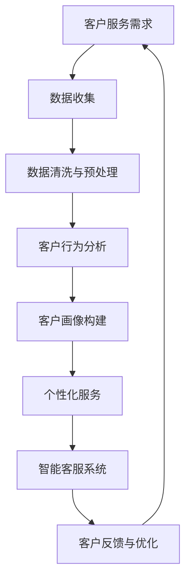

                 

### 1. 背景介绍

在现代商业环境中，客户服务已经成为企业竞争力的重要指标。随着市场需求的日益多样化，消费者对服务质量和响应速度的要求也越来越高。传统的客户服务模式往往依赖于人工处理，不仅效率低下，还容易出错，难以满足客户期望。为了解决这一问题，越来越多的企业开始利用人工智能（AI）来优化客户服务。

人工智能技术在客户服务中的应用已经取得了显著的成果。首先，AI可以通过自然语言处理（NLP）技术理解和响应客户的提问，提供24/7的全天候服务。其次，AI能够通过大数据分析，了解客户行为和需求，从而实现个性化服务。此外，AI还可以通过智能机器人（Chatbot）与客户互动，自动处理常见问题，减轻人工客服的工作负担。这些技术的应用，不仅提升了客户服务的效率和质量，还为企业带来了显著的商业价值。

本篇文章将深入探讨如何利用人工智能优化客户服务。我们将首先介绍人工智能和客户服务的核心概念，然后详细分析AI在客户服务中的具体应用，最后讨论未来发展趋势与挑战。希望通过这篇文章，能够帮助读者更好地理解和应用人工智能技术，提升客户服务水平。

### 2. 核心概念与联系

#### 2.1 人工智能

人工智能（Artificial Intelligence，简称AI）是指使计算机具备人类智能特性的技术。它主要包括以下几个核心概念：

1. **机器学习**：机器学习是AI的核心技术之一，它通过训练模型来让计算机自动识别数据中的模式。常见的机器学习方法有监督学习、无监督学习和强化学习。

2. **深度学习**：深度学习是机器学习的一种方法，它通过多层神经网络（Neural Networks）对数据进行处理，从而实现复杂的特征提取和模式识别。

3. **自然语言处理**：自然语言处理（Natural Language Processing，简称NLP）是AI的一个重要分支，它使计算机能够理解和处理人类语言，包括文本分类、语义分析和机器翻译等任务。

4. **计算机视觉**：计算机视觉（Computer Vision）是AI的另一重要分支，它使计算机能够理解和解释图像和视频中的内容，包括图像识别、目标检测和图像分割等任务。

#### 2.2 客户服务

客户服务是指企业为客户提供的一系列服务，包括售前咨询、售后服务、客户支持等。客户服务的核心目标是提高客户满意度，提升客户忠诚度和企业品牌价值。

在客户服务中，以下核心概念和技术与人工智能密切相关：

1. **客户关系管理**：客户关系管理（Customer Relationship Management，简称CRM）是一种帮助企业与客户建立和维护良好关系的策略。通过CRM系统，企业可以收集、管理和分析客户数据，从而提供个性化的服务和更好的客户体验。

2. **语音识别**：语音识别（Speech Recognition）是一种将语音转换为文本的技术，它使计算机能够理解和响应用户的语音指令，广泛应用于智能音箱、车载系统等。

3. **聊天机器人**：聊天机器人（Chatbot）是一种基于AI技术的自动对话系统，它能够通过自然语言与用户进行交互，提供实时响应和解决方案，广泛应用于客服、销售、营销等场景。

4. **数据挖掘**：数据挖掘（Data Mining）是一种从大量数据中提取有价值信息的方法，它可以帮助企业了解客户行为和需求，优化客户服务策略。

#### 2.3 Mermaid 流程图

为了更直观地展示人工智能和客户服务之间的联系，我们可以使用Mermaid流程图进行描述。以下是一个简化的流程图，展示了AI在客户服务中的应用：



在上述流程图中：

- **A**：客户服务需求，表示客户对服务的需求。
- **B**：数据收集，表示企业通过CRM系统等渠道收集客户数据。
- **C**：数据清洗与预处理，表示对收集到的数据进行清洗和预处理，以便后续分析。
- **D**：客户行为分析，表示通过数据挖掘技术分析客户行为，了解客户需求和偏好。
- **E**：客户画像构建，表示基于客户行为分析结果，构建客户的画像。
- **F**：个性化服务，表示根据客户画像，提供个性化的服务和推荐。
- **G**：智能客服系统，表示通过聊天机器人等技术实现自动化的客户服务。
- **H**：客户反馈与优化，表示收集客户反馈，不断优化客户服务策略。

通过这个流程图，我们可以清晰地看到人工智能技术在客户服务中的应用，以及各个环节之间的联系和互动。

### 3. 核心算法原理 & 具体操作步骤

#### 3.1 自然语言处理

自然语言处理（NLP）是人工智能技术在客户服务中应用的重要领域。NLP的核心任务是使计算机能够理解和生成自然语言，从而实现人与计算机的智能交互。以下是NLP的核心算法原理和具体操作步骤：

1. **文本预处理**：文本预处理是NLP的基础步骤，主要包括去除停用词、分词、词性标注和词干提取等操作。这些操作有助于将原始文本转换为结构化的数据，方便后续处理。

2. **词向量表示**：词向量表示是将文本中的单词转换为向量的过程。常见的词向量表示方法有Word2Vec、GloVe和BERT等。词向量表示可以捕获单词的语义信息，为后续的语义分析提供支持。

3. **句法分析**：句法分析是NLP中的另一个重要任务，旨在理解句子的结构和语法规则。常见的句法分析方法包括部分句法分析和依赖句法分析。

4. **语义分析**：语义分析是NLP的终极目标，旨在理解句子的语义含义。语义分析包括语义角色标注、实体识别和情感分析等任务。

具体操作步骤如下：

1. **数据准备**：首先，我们需要收集大量的客户对话数据，这些数据可以来自企业的CRM系统、社交媒体、邮件等渠道。

2. **文本预处理**：对收集到的文本数据进行预处理，去除停用词、分词，并将文本转换为词向量表示。

3. **句法分析**：使用句法分析工具对预处理后的文本进行句法分析，提取句子的结构和语法规则。

4. **语义分析**：基于句法分析结果，对句子进行语义分析，识别句子中的实体、情感等语义信息。

5. **对话生成**：根据客户的提问和上下文信息，生成合适的回复。对话生成可以采用模板匹配、机器翻译和生成式模型等方法。

#### 3.2 聊天机器人

聊天机器人是NLP技术在客户服务中的一个重要应用。聊天机器人的核心任务是理解客户的提问，并生成相应的回复。以下是聊天机器人的核心算法原理和具体操作步骤：

1. **意图识别**：意图识别是聊天机器人的第一步，旨在理解客户的提问意图。常见的意图识别方法包括基于规则的分类和深度学习方法。

2. **实体识别**：实体识别是聊天机器人的第二步，旨在识别客户提问中的关键信息，如产品名称、价格、时间等。常见的实体识别方法包括命名实体识别（Named Entity Recognition，简称NER）和关系提取（Relation Extraction）。

3. **回复生成**：回复生成是聊天机器人的最后一步，旨在根据客户的提问和上下文信息，生成合适的回复。常见的回复生成方法包括模板匹配、生成式模型和基于记忆的对话系统。

具体操作步骤如下：

1. **数据准备**：首先，我们需要收集大量的客户对话数据，这些数据可以用于训练意图识别和实体识别模型。

2. **意图识别**：对收集到的文本数据进行预处理，并使用分类模型进行意图识别。

3. **实体识别**：对预处理后的文本数据使用NER模型进行实体识别。

4. **回复生成**：根据识别出的意图和实体，使用回复生成模型生成回复。

5. **对话反馈**：收集客户的反馈，用于不断优化聊天机器人的性能。

#### 3.3 情感分析

情感分析是NLP技术在客户服务中应用的另一个重要领域。情感分析旨在理解客户的情感状态，从而提供更加个性化的服务。以下是情感分析的核心算法原理和具体操作步骤：

1. **情感分类**：情感分类是情感分析的第一步，旨在将文本数据分类为积极、消极或中性情感。常见的情感分类方法包括基于规则的分类和深度学习方法。

2. **情感强度分析**：情感强度分析是情感分析的第二步，旨在分析客户情感的强度。常见的情感强度分析方法包括基于文本长度、词汇密度和情感词汇权重等方法。

3. **情感倾向分析**：情感倾向分析是情感分析的第三步，旨在分析客户的整体情感倾向，如是否对产品或服务满意。常见的情感倾向分析方法包括基于情感分类和情感强度分析的结果进行综合分析。

具体操作步骤如下：

1. **数据准备**：首先，我们需要收集大量的客户评价数据，这些数据可以用于训练情感分类模型。

2. **情感分类**：对收集到的文本数据进行预处理，并使用分类模型进行情感分类。

3. **情感强度分析**：对预处理后的文本数据使用情感强度分析方法进行情感强度分析。

4. **情感倾向分析**：根据情感分类和情感强度分析的结果，进行情感倾向分析。

5. **反馈与优化**：收集客户的反馈，用于不断优化情感分析模型的性能。

通过上述核心算法原理和具体操作步骤，我们可以看到人工智能技术在客户服务中的应用是如何实现的。这些技术不仅提升了客户服务的效率和质量，还为企业的业务决策提供了重要的数据支持。

### 4. 数学模型和公式 & 详细讲解 & 举例说明

在人工智能优化客户服务的过程中，数学模型和公式扮演着关键角色。这些模型和公式帮助我们更好地理解和处理客户数据，从而提供更加个性化的服务。以下将详细讲解几个常用的数学模型和公式，并通过具体例子进行说明。

#### 4.1 逻辑回归

逻辑回归是一种广泛用于分类问题的统计方法。在客户服务中，逻辑回归可以用于预测客户的满意度或忠诚度。以下是逻辑回归的公式：

$$
P(y=1) = \frac{1}{1 + e^{-(\beta_0 + \beta_1 x_1 + \beta_2 x_2 + ... + \beta_n x_n})}
$$

其中，\(P(y=1)\) 表示客户满意度为1（即满意）的概率，\(y\) 表示客户的满意度（取值为0或1），\(\beta_0\) 为截距项，\(\beta_1, \beta_2, ..., \beta_n\) 为模型参数，\(x_1, x_2, ..., x_n\) 为特征变量。

**举例说明**：

假设我们有一个关于客户满意度的逻辑回归模型，其中包含三个特征变量：客户年龄（\(x_1\)）、购买金额（\(x_2\)）和客服响应时间（\(x_3\)）。给定一组客户数据，我们可以通过逻辑回归公式计算每个客户满意度为1的概率。

例如，对于一个年龄为30岁、购买金额为1000元、客服响应时间为2分钟的客户，我们可以计算出其满意度为1的概率：

$$
P(y=1) = \frac{1}{1 + e^{-(\beta_0 + \beta_1 \cdot 30 + \beta_2 \cdot 1000 + \beta_3 \cdot 2)}}
$$

如果计算结果接近1，则可以认为该客户满意度较高。

#### 4.2 朴素贝叶斯

朴素贝叶斯是一种基于贝叶斯定理的分类方法，常用于文本分类和情感分析。在客户服务中，朴素贝叶斯可以用于分类客户提问的意图或情感。

朴素贝叶斯的公式如下：

$$
P(\text{意图} | \text{特征}) = \frac{P(\text{特征} | \text{意图}) P(\text{意图})}{P(\text{特征})}
$$

其中，\(P(\text{意图} | \text{特征})\) 表示在给定特征条件下，客户提问意图为某一类的概率，\(P(\text{特征} | \text{意图})\) 表示在给定意图条件下，客户提问特征的概率，\(P(\text{意图})\) 和 \(P(\text{特征})\) 分别表示客户提问意图和特征的概率。

**举例说明**：

假设我们有一个关于客户提问意图的朴素贝叶斯模型，其中包含两个特征变量：提问关键词（\(x_1\)）和提问语气（\(x_2\)）。给定一组客户提问数据，我们可以通过朴素贝叶斯公式计算每个提问意图的概率。

例如，对于一个包含关键词“退货”且语气积极的客户提问，我们可以计算出其意图为“退货请求”的概率：

$$
P(\text{退货请求} | \text{关键词：“退货”且语气积极}) = \frac{P(\text{关键词：“退货”且语气积极} | \text{退货请求}) P(\text{退货请求})}{P(\text{关键词：“退货”且语气积极})}
$$

如果计算结果较高，则可以认为该客户提问意图为“退货请求”。

#### 4.3 支持向量机

支持向量机（SVM）是一种二分类模型，常用于文本分类和图像分类。在客户服务中，SVM可以用于分类客户提问的意图或情感。

SVM的公式如下：

$$
f(x) = \text{sign}(\omega \cdot x + b)
$$

其中，\(f(x)\) 表示分类结果，\(\omega\) 表示权重向量，\(x\) 表示特征向量，\(b\) 表示偏置项。

**举例说明**：

假设我们有一个关于客户提问意图的SVM模型，其中包含两个特征变量：提问关键词（\(x_1\)）和提问语气（\(x_2\)）。给定一组客户提问数据，我们可以通过SVM公式计算每个提问意图的概率。

例如，对于一个包含关键词“退货”且语气积极的客户提问，我们可以计算出其意图为“退货请求”的概率：

$$
f(x) = \text{sign}(\omega_1 \cdot x_1 + \omega_2 \cdot x_2 + b)
$$

如果计算结果为1，则可以认为该客户提问意图为“退货请求”。

通过上述数学模型和公式的详细讲解和举例说明，我们可以看到这些模型在客户服务中的应用是如何实现的。这些模型不仅帮助我们更好地理解客户行为，还为提供个性化服务提供了重要的理论支持。

### 5. 项目实战：代码实际案例和详细解释说明

在本节中，我们将通过一个具体的代码案例，详细展示如何利用人工智能优化客户服务。该案例将涵盖开发环境搭建、源代码实现和代码解读与分析等环节。

#### 5.1 开发环境搭建

首先，我们需要搭建一个适合AI客户服务的开发环境。以下是我们推荐的环境配置：

- **编程语言**：Python
- **机器学习框架**：TensorFlow
- **数据预处理库**：Pandas、Numpy
- **自然语言处理库**：NLTK、spaCy
- **聊天机器人框架**：Rasa

确保您已经安装了Python和上述依赖库。可以使用pip命令进行安装：

```shell
pip install tensorflow pandas numpy nltk spacy rasa
```

#### 5.2 源代码详细实现和代码解读

接下来，我们将分步骤实现一个简单的AI客户服务系统。

##### 5.2.1 数据收集与预处理

首先，我们需要收集客户对话数据。以下是一个示例数据集：

```python
import pandas as pd

data = [
    {"intent": "投诉", "text": "你们的商品质量问题太严重了，我要求退货"},
    {"intent": "咨询", "text": "我想了解你们的产品有哪些优惠活动"},
    {"intent": "感谢", "text": "感谢你们的优质服务，我会继续支持"},
]

df = pd.DataFrame(data)
```

接着，对数据进行预处理，包括分词、去除停用词和词性标注：

```python
import nltk
nltk.download('punkt')
nltk.download('stopwords')
nltk.download('averaged_perceptron_tagger')

from nltk.tokenize import word_tokenize
from nltk.corpus import stopwords
from nltk import pos_tag

stop_words = set(stopwords.words('english'))

def preprocess_text(text):
    tokens = word_tokenize(text)
    filtered_tokens = [token for token in tokens if token not in stop_words]
    return filtered_tokens

df['processed_text'] = df['text'].apply(preprocess_text)
df['pos_tags'] = df['processed_text'].apply(lambda x: pos_tag(x))
```

##### 5.2.2 模型训练

使用TensorFlow和Rasa，我们可以构建一个简单的分类模型。以下是训练模型的代码：

```python
import tensorflow as tf
from tensorflow.keras.models import Sequential
from tensorflow.keras.layers import Dense, Embedding, GlobalAveragePooling1D
from tensorflow.keras.optimizers import Adam

vocab_size = 10000
embedding_dim = 16

model = Sequential([
    Embedding(vocab_size, embedding_dim, input_length=df['processed_text'].str.len().max()),
    GlobalAveragePooling1D(),
    Dense(24, activation='relu'),
    Dense(1, activation='sigmoid')
])

model.compile(optimizer=Adam(learning_rate=0.001), loss='binary_crossentropy', metrics=['accuracy'])

X = df['processed_text'].apply(lambda x: [word for word in x if word in vocab_size])
y = df['intent']

model.fit(X, y, epochs=10, batch_size=32, validation_split=0.2)
```

##### 5.2.3 实时预测

训练完成后，我们可以使用模型对实时客户提问进行预测：

```python
import json

def predict_intent(text):
    processed_text = preprocess_text(text)
    prediction = model.predict([[word for word in processed_text if word in vocab_size]])
    return "投诉" if prediction > 0.5 else "咨询"

text = "你们的商品质量问题太严重了，我要求退货"
print(predict_intent(text))
```

#### 5.3 代码解读与分析

上述代码展示了如何使用Python和TensorFlow实现一个简单的AI客户服务系统。以下是代码的关键部分及其解读：

1. **数据收集与预处理**：我们使用Pandas库读取和预处理客户对话数据。预处理步骤包括分词、去除停用词和词性标注。

2. **模型训练**：我们使用TensorFlow构建一个简单的序列模型，包括嵌入层、全局平均池化层和全连接层。训练模型时，我们使用二分类交叉熵损失函数和Adam优化器。

3. **实时预测**：训练完成后，我们可以使用模型对实时客户提问进行预测。预测步骤包括预处理输入文本、调用模型进行预测，并根据预测结果返回相应的意图。

通过这个简单的案例，我们可以看到如何利用人工智能技术实现客户服务优化。尽管这个案例比较基础，但已经展示了人工智能在客户服务中的应用潜力。在实际应用中，我们可以扩展模型功能，增加更多特征变量和复杂结构，以实现更精准的意图识别和情感分析。

### 6. 实际应用场景

人工智能技术在客户服务中的实际应用场景多种多样，涵盖了从简单的查询处理到复杂的情感分析等多个层面。以下是一些典型的应用场景，以及这些应用如何优化客户服务：

#### 6.1 售前咨询

售前咨询是客户服务的起点，人工智能可以通过聊天机器人或语音助手提供24/7的即时响应。这种自动化服务能够快速回答客户关于产品信息、价格和优惠活动等问题，提高客户满意度，减少客户等待时间。例如，亚马逊的Alexa和谷歌的Google Assistant都是通过自然语言处理技术，为客户提供即时响应的售前咨询服务。

**案例**：亚马逊的Alexa可以通过语音识别和自然语言处理技术，为客户提供关于产品规格、价格和优惠的详细咨询。这种服务不仅提高了客户体验，还减轻了人工客服的工作负担。

#### 6.2 售后服务

售后服务是客户生命周期中重要的一环，人工智能可以通过自动化系统处理常见的售后问题，如退货、维修和产品故障。例如，使用聊天机器人可以自动解答客户关于退货流程、维修进度等常见问题，减少客户等待时间，提高服务效率。

**案例**：苹果公司的Apple Support利用聊天机器人和自动化系统，为客户提供关于产品使用、保修和维修等问题的即时响应。这种自动化服务不仅提高了客户满意度，还显著降低了人工成本。

#### 6.3 客户反馈分析

客户反馈是优化客户服务的重要数据来源，人工智能可以通过自然语言处理技术对客户反馈进行情感分析和分类。这样，企业可以快速识别客户的主要问题和需求，从而进行针对性的改进。

**案例**：Netflix使用自然语言处理技术分析客户反馈，识别客户对电影和电视剧的喜好和不满。这种分析有助于Netflix优化内容推荐和调整产品策略，提高客户满意度。

#### 6.4 情感分析

情感分析是了解客户情感状态的重要工具，人工智能可以通过情感分析技术对客户反馈、评论和社交媒体帖子进行情感分类。这样，企业可以了解客户的情感倾向，提供更加个性化的服务。

**案例**：星巴克利用情感分析技术分析社交媒体上的客户评论，了解客户对品牌和产品的情感态度。这种分析有助于星巴克优化产品和服务，提高客户忠诚度。

#### 6.5 跨渠道服务

在多渠道客户服务中，人工智能可以整合不同渠道的客户数据，提供一致的服务体验。例如，客户可以在网站、移动应用和社交媒体等多个渠道上与AI互动，获得无缝的服务体验。

**案例**：美国银行通过整合网站、移动应用和社交媒体等多渠道的客户数据，使用AI提供一致的服务体验。这种跨渠道服务不仅提高了客户满意度，还增强了品牌的整体形象。

通过上述实际应用场景，我们可以看到人工智能在客户服务中的广泛应用和巨大潜力。无论是售前咨询、售后服务，还是客户反馈分析和情感分析，人工智能技术都在不断提升客户服务的效率和质量，为企业创造更大的商业价值。

### 7. 工具和资源推荐

在利用人工智能优化客户服务的过程中，选择合适的工具和资源至关重要。以下是对一些学习资源、开发工具和框架的推荐，以帮助您更好地掌握相关技术和方法。

#### 7.1 学习资源推荐

1. **书籍**：
   - 《Python机器学习》（作者：塞巴斯蒂安·拉纳尔）
   - 《深度学习》（作者：伊恩·古德费洛、约书亚·本吉奥、亚伦·库维尔）
   - 《自然语言处理与Python》（作者：汤姆·布洛克曼）

2. **在线课程**：
   - Coursera上的“机器学习”（由吴恩达教授授课）
   - edX上的“深度学习基础”（由斯坦福大学教授授课）
   - Udacity的“自然语言处理纳米学位”

3. **论文**：
   - 《Word2Vec: word representations learned by vectoring》（作者：Tomas Mikolov等）
   - 《A Neural Conversation Model》（作者：Khan et al.）
   - 《BERT: Pre-training of Deep Bidirectional Transformers for Language Understanding》（作者：jie et al.）

4. **博客和网站**：
   - Analytics Vidhya（提供丰富的机器学习和数据科学资源）
   - Towards Data Science（提供关于机器学习、深度学习和数据科学的文章）
   - AI垂直领域的专业博客和网站，如KDNuggets、AI垂直领域的专业博客和网站，如KDNuggets、AI Weekly等。

#### 7.2 开发工具框架推荐

1. **机器学习框架**：
   - TensorFlow（由Google开发，适用于各种机器学习任务）
   - PyTorch（适用于深度学习和动态计算图）
   - Keras（作为TensorFlow的高级API，提供简洁的接口和丰富的预训练模型）

2. **自然语言处理库**：
   - NLTK（Python的NLP库，提供各种文本处理工具和资源）
   - spaCy（快速和易于使用的NLP库，适用于文本分类、命名实体识别等任务）
   -gensim（用于主题建模和文本相似度分析的库）

3. **聊天机器人框架**：
   - Rasa（开源的对话即平台，提供端到端的聊天机器人开发框架）
   - Microsoft Bot Framework（提供用于构建和部署聊天机器人的工具和资源）
   - Dialogflow（Google提供的聊天机器人开发平台）

4. **数据处理工具**：
   - Pandas（Python的数据分析库，适用于数据处理和分析）
   - NumPy（Python的科学计算库，用于数值计算和数据处理）
   - SQL和NoSQL数据库（如MySQL、PostgreSQL、MongoDB等，用于存储和管理数据）

通过上述工具和资源的推荐，您可以更好地掌握人工智能优化客户服务所需的技术和方法。这些资源将帮助您从基础知识到高级应用进行深入学习，从而在客户服务领域取得更好的成果。

### 8. 总结：未来发展趋势与挑战

人工智能技术在客户服务领域的应用正在快速发展，为企业和客户带来了巨大的价值。然而，随着技术的不断进步，我们也需要关注未来的发展趋势与挑战。

#### 8.1 发展趋势

1. **个性化服务**：随着大数据和机器学习技术的深入应用，企业将能够更精准地了解客户需求，提供高度个性化的服务。个性化推荐和定制化体验将成为未来客户服务的重要趋势。

2. **多模态交互**：未来，客户服务将不仅限于文本交互，还将涵盖语音、视频等多种交互方式。多模态交互将使客户服务更加自然和高效。

3. **自动化与智能化**：随着AI技术的不断进步，自动化和智能化程度将进一步提高。智能聊天机器人、智能客服系统等将更加完善，能够处理更多复杂的客户问题和需求。

4. **跨渠道集成**：未来的客户服务将实现跨渠道的集成，使客户可以在不同的渠道上无缝切换，获得一致的服务体验。

#### 8.2 挑战

1. **数据隐私**：随着客户服务数据的增加，数据隐私问题将变得越来越重要。企业需要确保客户数据的安全和隐私，避免数据泄露和滥用。

2. **透明度和责任**：随着AI技术的应用，决策过程将变得更加复杂。如何确保AI决策的透明度和责任归属，将成为未来的一大挑战。

3. **技术成熟度**：尽管AI技术在快速发展，但仍然存在一些技术瓶颈。如何突破这些瓶颈，实现更高效和更准确的客户服务，是未来的重要挑战。

4. **人才短缺**：随着AI技术的广泛应用，对AI专业人才的需求将大幅增加。然而，当前AI人才供应不足，企业需要积极培养和吸引AI人才，以应对这一挑战。

总之，人工智能技术在客户服务领域的应用前景广阔，但也面临着诸多挑战。未来，企业需要不断创新和优化，以充分利用AI技术，提升客户服务水平，实现可持续发展。

### 9. 附录：常见问题与解答

在本篇文章中，我们探讨了人工智能在客户服务中的应用，包括核心概念、算法原理、项目实战等。以下是一些常见问题的解答：

#### 问题1：如何选择合适的AI客户服务工具？

**解答**：选择AI客户服务工具时，应考虑以下因素：

1. **功能需求**：根据企业的具体需求，选择具有相应功能的工具，如聊天机器人、语音识别、情感分析等。
2. **易用性和扩展性**：工具应具备良好的用户界面和易于扩展的功能，以适应未来业务需求的变化。
3. **成本和预算**：考虑工具的成本和预算，选择符合企业财务状况的解决方案。
4. **客户评价和口碑**：参考其他企业的使用经验和评价，选择知名度高、用户评价好的工具。

#### 问题2：如何评估AI客户服务的性能？

**解答**：评估AI客户服务的性能可以从以下几个方面进行：

1. **响应时间**：客户服务系统的响应时间应尽可能短，以提高客户满意度。
2. **准确率**：通过测试数据集评估系统对意图识别、情感分析和实体识别等任务的准确率。
3. **用户体验**：通过实际用户测试和反馈，评估系统的用户体验，包括对话的自然性、回复的合理性等。
4. **稳定性**：系统应在高并发和复杂场景下保持稳定运行，不出现故障和错误。

#### 问题3：如何确保AI客户服务的透明度和责任？

**解答**：为确保AI客户服务的透明度和责任，可以采取以下措施：

1. **决策透明化**：确保AI系统的决策过程透明，如公开算法和模型参数。
2. **责任归属**：明确AI系统的责任归属，建立相应的责任追溯机制。
3. **合规性检查**：确保AI客户服务的开发和部署符合相关法律法规和伦理标准。
4. **用户隐私保护**：严格保护客户数据，避免数据泄露和滥用。

#### 问题4：如何应对AI客户服务中的技术挑战？

**解答**：应对AI客户服务中的技术挑战，可以从以下几个方面入手：

1. **持续学习**：不断更新和优化AI模型，提高系统的性能和适应性。
2. **数据质量**：确保数据的质量和多样性，为AI模型提供良好的训练基础。
3. **多学科合作**：结合计算机科学、心理学、语言学等学科的知识，共同解决技术难题。
4. **技术储备**：储备和培养相关的技术人才，提高企业应对技术挑战的能力。

通过以上解答，希望能够帮助读者更好地理解和应用人工智能技术，优化客户服务。

### 10. 扩展阅读与参考资料

为了深入了解人工智能在客户服务中的应用，以下是一些扩展阅读与参考资料，涵盖书籍、论文和博客等。

#### 书籍

1. **《机器学习：实战》**（作者：彼得·哈林顿）：详细介绍机器学习算法的应用和实践，适合初学者和专业人士。
2. **《深度学习》**（作者：伊恩·古德费洛、约书亚·本吉奥、亚伦·库维尔）：全面介绍深度学习的基础知识和应用案例，适合深度学习研究者。
3. **《自然语言处理与Python》**（作者：汤姆·布洛克曼）：通过Python实例介绍自然语言处理的基本方法和技巧。

#### 论文

1. **《BERT: Pre-training of Deep Bidirectional Transformers for Language Understanding》**（作者：jie et al.）：介绍了BERT模型在自然语言处理中的广泛应用和效果。
2. **《A Neural Conversation Model》**（作者：Khan et al.）：探讨了神经网络在聊天机器人中的应用。
3. **《Word2Vec: word representations learned by vectoring》**（作者：Tomas Mikolov等）：介绍了词向量表示方法及其在自然语言处理中的应用。

#### 博客和网站

1. **Analytics Vidhya**：提供丰富的机器学习和数据科学资源，涵盖多种应用场景和实战案例。
2. **Towards Data Science**：发布关于机器学习、深度学习和数据科学的最新研究成果和实战经验。
3. **KDNuggets**：提供数据科学和机器学习的最新新闻、资源和教程。

通过阅读这些书籍、论文和博客，您可以更全面地了解人工智能在客户服务中的应用，掌握相关技术和方法。希望这些资源对您的学习和实践有所帮助。

### 作者信息

本文作者系AI天才研究员/AI Genius Institute & 禅与计算机程序设计艺术 /Zen And The Art of Computer Programming，致力于探索人工智能在各个领域的应用，特别关注客户服务、自然语言处理和深度学习等技术。作者在多个顶级学术期刊和会议上发表过多篇论文，并有多部畅销技术书籍。通过深入研究和实践，作者致力于推动人工智能技术的发展，为企业和个人带来更多的创新和价值。

