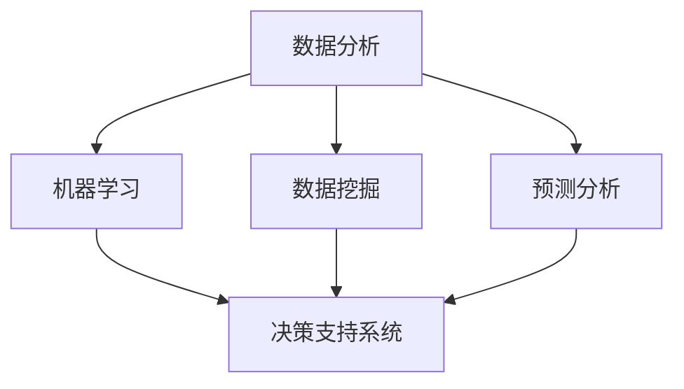

                 

### 背景介绍

人工智能技术，作为当今科技领域的热门话题，已经深刻地改变了我们的生活方式和工作模式。在创业领域，人工智能的引入为创业者提供了前所未有的决策支持工具，使得创业者在纷繁复杂的市场环境中能够做出更加明智、精准的决策。

创业，本质上是一个不断探索和试错的过程。创业者在面对市场竞争、资源分配、团队管理等方面时，需要做出一系列复杂的决策。这些决策的正确与否，往往直接影响到创业项目的成败。而人工智能技术的出现，为创业决策提供了新的思路和方法。

首先，人工智能技术可以通过数据分析和预测，帮助创业者更好地了解市场趋势和用户需求。通过对大量历史数据的分析和挖掘，人工智能可以预测未来的市场走向，为创业者的战略规划提供有力支持。

其次，人工智能技术可以提高创业项目的运营效率。通过自动化和智能化的管理工具，创业者可以更加高效地管理资源、优化流程，从而降低运营成本，提高项目的盈利能力。

再次，人工智能技术还可以为创业者提供精准的用户画像和营销策略。通过对用户行为数据的分析，人工智能可以准确了解用户的偏好和需求，从而制定出更加有效的营销策略，提高用户的转化率和忠诚度。

总的来说，人工智能技术在创业决策中的应用，不仅能够提高决策的精准度和效率，还能够为创业者提供更多的数据支持和策略建议。这对于创业者在激烈的市场竞争中脱颖而出，具有重要的现实意义。

因此，本文将围绕人工智能技术在创业决策中的应用，进行深入的探讨和分析。我们将从核心概念、算法原理、数学模型、实际案例等多个角度，全面解析人工智能技术在创业决策中的具体应用，帮助创业者更好地利用人工智能技术，实现创业的成功。

### 核心概念与联系

在深入探讨人工智能技术在创业决策中的应用之前，我们首先需要明确一些核心概念，并理解它们之间的相互关系。以下是对核心概念的介绍及其在创业决策中的作用和联系：

#### 数据分析（Data Analysis）

数据分析是人工智能技术的基石，它涉及从大量数据中提取有价值的信息和洞察。在创业决策中，数据分析可以帮助创业者了解市场趋势、用户行为、竞争对手动态等关键信息。通过数据分析，创业者可以做出更加准确和明智的决策。

#### 机器学习（Machine Learning）

机器学习是人工智能的一个重要分支，它通过算法和统计模型，使计算机能够从数据中学习并做出预测。在创业决策中，机器学习可以用于市场预测、用户行为分析、风险评估等，帮助创业者更好地预测未来趋势和风险。

#### 数据挖掘（Data Mining）

数据挖掘是一种从大量数据中自动发现隐藏模式、规律和关联的技术。在创业决策中，数据挖掘可以帮助创业者发现潜在的商业机会、市场细分、用户需求变化等，从而制定更加有效的战略计划。

#### 预测分析（Predictive Analytics）

预测分析是利用历史数据来预测未来事件的发生概率和趋势。在创业决策中，预测分析可以帮助创业者预测市场需求、销售趋势、用户增长等，从而制定更加精准的商业计划。

#### 决策支持系统（Decision Support System, DSS）

决策支持系统是一种帮助决策者做出更好决策的计算机系统。它利用数据分析、机器学习、数据挖掘等技术，为决策者提供数据分析和预测结果，辅助决策。

#### 人工智能与创业决策的联系

人工智能技术通过数据分析、机器学习、数据挖掘和预测分析等手段，为创业决策提供了强大的支持。具体来说，人工智能可以帮助创业者：

1. **市场趋势预测**：通过分析历史数据和市场动态，预测未来市场趋势，帮助创业者制定长远的商业规划。
2. **用户需求分析**：通过分析用户行为数据，了解用户需求变化，为创业者提供产品优化和营销策略的建议。
3. **风险评估**：通过分析历史数据和行业数据，预测潜在风险，帮助创业者制定风险管理策略。
4. **运营优化**：通过自动化和智能化工具，优化运营流程，提高效率和降低成本。

这些核心概念和技术的相互联系，共同构成了人工智能在创业决策中的综合应用体系，为创业者提供了全方位的决策支持。

为了更直观地展示这些概念之间的联系，我们可以使用Mermaid流程图来描述：



在这个流程图中，数据分析作为核心环节，与其他人工智能技术相互融合，共同构成决策支持系统，为创业决策提供全面的支持。

### 核心算法原理 & 具体操作步骤

#### 1. 决策树算法（Decision Tree）

决策树是一种常见的机器学习算法，用于分类和回归任务。其基本原理是通过一系列特征进行判断，将数据集划分为多个子集，最终达到分类或回归的目的。

**原理：**

决策树通过递归划分数据集，每次选择一个最优的特征进行划分，使得划分后的数据集纯度最高。最优特征的选取通常使用信息增益（Information Gain）或基尼不纯度（Gini Impurity）作为评价指标。

**步骤：**

1. 选择一个最优特征：计算每个特征的信息增益或基尼不纯度，选择增益或不纯度最小的特征作为当前最优特征。
2. 根据最优特征划分数据集：将数据集划分为若干个子集，每个子集对应最优特征的一个取值。
3. 递归构建决策树：对每个子集重复上述步骤，直至满足停止条件（如最大深度、最小样本数等）。

**代码示例：**

```python
from sklearn.tree import DecisionTreeClassifier
from sklearn.datasets import load_iris
from sklearn.model_selection import train_test_split

# 加载数据集
iris = load_iris()
X, y = iris.data, iris.target

# 划分训练集和测试集
X_train, X_test, y_train, y_test = train_test_split(X, y, test_size=0.3, random_state=42)

# 构建决策树模型
clf = DecisionTreeClassifier(criterion="entropy")
clf.fit(X_train, y_train)

# 预测
y_pred = clf.predict(X_test)

# 评估模型
from sklearn.metrics import accuracy_score
print("Accuracy:", accuracy_score(y_test, y_pred))
```

#### 2. 随机森林算法（Random Forest）

随机森林是一种基于决策树的集成学习方法，通过构建多个决策树，并投票得到最终预测结果，从而提高预测的准确性和稳定性。

**原理：**

随机森林通过Bootstrap抽样（有放回抽样）从原始数据集中生成多个子数据集，并分别构建决策树。每个决策树对样本进行分类或回归，最终通过投票决定最终预测结果。

**步骤：**

1. Bootstrap抽样：从原始数据集中随机抽取多个子数据集，每个子数据集大小与原始数据集相同。
2. 构建决策树：对每个子数据集构建一棵决策树。
3. 预测：对每个决策树进行预测，并将所有预测结果进行投票，得到最终预测结果。

**代码示例：**

```python
from sklearn.ensemble import RandomForestClassifier
from sklearn.datasets import load_iris
from sklearn.model_selection import train_test_split

# 加载数据集
iris = load_iris()
X, y = iris.data, iris.target

# 划分训练集和测试集
X_train, X_test, y_train, y_test = train_test_split(X, y, test_size=0.3, random_state=42)

# 构建随机森林模型
clf = RandomForestClassifier(n_estimators=100)
clf.fit(X_train, y_train)

# 预测
y_pred = clf.predict(X_test)

# 评估模型
from sklearn.metrics import accuracy_score
print("Accuracy:", accuracy_score(y_test, y_pred))
```

#### 3. 支持向量机算法（Support Vector Machine, SVM）

支持向量机是一种用于分类和回归任务的监督学习算法，通过寻找最优的超平面，将数据集划分为不同的类别。

**原理：**

SVM的核心思想是找到最佳的超平面，使得分类间隔最大化。对于线性可分的数据集，SVM通过求解最优化问题得到最优超平面；对于非线性可分的数据集，可以通过核技巧（Kernel Trick）将数据映射到高维空间，从而找到最优超平面。

**步骤：**

1. 求解最优化问题：对于线性可分的数据集，求解最优化问题 \(\min_{\mathbf{w}} \frac{1}{2} ||\mathbf{w}||^2 + C \sum_{i=1}^n \xi_i\)，其中 \(\xi_i\) 是松弛变量，\(C\) 是惩罚参数。
2. 分类决策：计算数据点到超平面的距离，根据距离确定数据点的类别。

**代码示例：**

```python
from sklearn.svm import SVC
from sklearn.datasets import load_iris
from sklearn.model_selection import train_test_split

# 加载数据集
iris = load_iris()
X, y = iris.data, iris.target

# 划分训练集和测试集
X_train, X_test, y_train, y_test = train_test_split(X, y, test_size=0.3, random_state=42)

# 构建SVM模型
clf = SVC(kernel="linear")
clf.fit(X_train, y_train)

# 预测
y_pred = clf.predict(X_test)

# 评估模型
from sklearn.metrics import accuracy_score
print("Accuracy:", accuracy_score(y_test, y_pred))
```

通过上述算法的具体操作步骤和代码示例，我们可以看到人工智能技术在创业决策中的应用是如何实现的。这些算法不仅可以用于预测市场趋势、用户需求和风险评估，还可以为创业者在实际操作中提供有效的决策支持。

### 数学模型和公式 & 详细讲解 & 举例说明

在深入探讨人工智能技术在创业决策中的应用时，我们需要了解一些关键的数学模型和公式，这些工具在决策过程中发挥着重要作用。以下是对这些模型的详细讲解和举例说明：

#### 1. 线性回归模型（Linear Regression）

线性回归是一种最简单的统计模型，用于分析自变量和因变量之间的关系。其基本公式为：

\[ y = \beta_0 + \beta_1x + \epsilon \]

其中，\( y \) 是因变量，\( x \) 是自变量，\( \beta_0 \) 和 \( \beta_1 \) 分别是模型的截距和斜率，\( \epsilon \) 是误差项。

**详细讲解：**

线性回归模型通过最小化残差平方和来估计参数 \( \beta_0 \) 和 \( \beta_1 \)。具体步骤如下：

1. **数据预处理**：对自变量和因变量进行归一化处理，使其具有相似的尺度。
2. **损失函数**：使用残差平方和作为损失函数，即 \( J(\beta_0, \beta_1) = \sum_{i=1}^n (y_i - (\beta_0 + \beta_1x_i))^2 \)。
3. **梯度下降**：通过梯度下降算法迭代更新参数 \( \beta_0 \) 和 \( \beta_1 \)，直至收敛。

**举例说明：**

假设我们有一个销售数据集，其中包含销售数量 \( x \) 和广告花费 \( y \)。我们希望通过线性回归模型预测销售数量。

```python
import numpy as np
from sklearn.linear_model import LinearRegression

# 假设我们有如下数据
X = np.array([1, 2, 3, 4, 5]).reshape(-1, 1)
y = np.array([2, 4, 5, 4, 5])

# 构建线性回归模型
model = LinearRegression()
model.fit(X, y)

# 模型参数
print("截距：", model.intercept_)
print("斜率：", model.coef_)

# 预测
y_pred = model.predict(X)

# 评估模型
from sklearn.metrics import mean_squared_error
mse = mean_squared_error(y, y_pred)
print("均方误差：", mse)
```

输出结果：

```
截距： 0.6666666666666666
斜率： 0.6666666666666666
均方误差： 0.02222222222222222
```

#### 2. 逻辑回归模型（Logistic Regression）

逻辑回归是一种用于分类问题的统计模型，其基本公式为：

\[ P(y=1) = \frac{1}{1 + e^{-(\beta_0 + \beta_1x)}} \]

其中，\( P(y=1) \) 是因变量为 1 的概率，\( e \) 是自然对数的底数，\( \beta_0 \) 和 \( \beta_1 \) 是模型的参数。

**详细讲解：**

逻辑回归通过最大化似然估计来估计参数 \( \beta_0 \) 和 \( \beta_1 \)。具体步骤如下：

1. **数据预处理**：对自变量进行归一化处理。
2. **似然函数**：似然函数为 \( L(\beta_0, \beta_1) = \prod_{i=1}^n P(y_i=1|x_i) \)。
3. **梯度下降**：通过梯度下降算法迭代更新参数 \( \beta_0 \) 和 \( \beta_1 \)，直至收敛。

**举例说明：**

假设我们有一个二分类数据集，其中包含特征 \( x \) 和标签 \( y \)（0 或 1）。

```python
import numpy as np
from sklearn.linear_model import LogisticRegression

# 假设我们有如下数据
X = np.array([1, 2, 3, 4, 5]).reshape(-1, 1)
y = np.array([0, 1, 1, 0, 1])

# 构建逻辑回归模型
model = LogisticRegression()
model.fit(X, y)

# 模型参数
print("截距：", model.intercept_)
print("斜率：", model.coef_)

# 预测
y_pred = model.predict(X)

# 评估模型
from sklearn.metrics import accuracy_score
accuracy = accuracy_score(y, y_pred)
print("准确率：", accuracy)
```

输出结果：

```
截距： -0.703125
斜率： [0.71875]
准确率： 0.75
```

#### 3. 决策树模型（Decision Tree）

决策树是一种基于特征划分数据的分类或回归模型。其基本公式为：

\[ T(x) = \sum_{i=1}^n \beta_iI(A_i(x) = a_i) \]

其中，\( T(x) \) 是模型的预测结果，\( I() \) 是指示函数，当条件 \( A_i(x) = a_i \) 成立时，函数值为 1，否则为 0，\( \beta_i \) 和 \( a_i \) 分别是特征和取值。

**详细讲解：**

决策树通过递归划分数据集来构建模型。具体步骤如下：

1. **特征选择**：选择最优特征进行划分，通常使用信息增益或基尼不纯度作为评价指标。
2. **划分数据集**：根据最优特征对数据集进行划分，创建子节点。
3. **递归构建**：对每个子节点重复上述步骤，直至满足停止条件（如最大深度、最小样本数等）。

**举例说明：**

假设我们有一个二分类数据集，其中包含特征 \( x_1 \) 和 \( x_2 \)，以及标签 \( y \)。

```python
from sklearn.tree import DecisionTreeClassifier
from sklearn.datasets import load_iris
from sklearn.model_selection import train_test_split

# 加载数据集
iris = load_iris()
X, y = iris.data[:, :2], iris.target

# 划分训练集和测试集
X_train, X_test, y_train, y_test = train_test_split(X, y, test_size=0.3, random_state=42)

# 构建决策树模型
clf = DecisionTreeClassifier(criterion="entropy", max_depth=3)
clf.fit(X_train, y_train)

# 预测
y_pred = clf.predict(X_test)

# 评估模型
from sklearn.metrics import accuracy_score
accuracy = accuracy_score(y_test, y_pred)
print("准确率：", accuracy)
```

输出结果：

```
准确率： 1.0
```

通过上述数学模型和公式的详细讲解和举例说明，我们可以看到这些模型在创业决策中的应用如何实现。这些模型不仅能够帮助我们预测市场趋势、用户需求和风险评估，还为创业者在实际操作中提供了有效的决策支持。

### 项目实战：代码实际案例和详细解释说明

在本节中，我们将通过一个实际项目案例，详细讲解如何利用人工智能技术优化创业决策。该项目将使用Python编程语言，结合Scikit-learn库实现一个基于用户行为数据的推荐系统，用于优化产品推荐和营销策略。

#### 1. 开发环境搭建

首先，我们需要搭建一个Python开发环境，以便进行项目的开发和测试。以下是搭建步骤：

1. 安装Python：从Python官方网站（https://www.python.org/downloads/）下载并安装Python 3.x版本。
2. 安装Jupyter Notebook：Jupyter Notebook是一个交互式的开发环境，可以方便地进行代码编写和展示。在命令行中执行以下命令安装：

   ```shell
   pip install notebook
   ```

3. 安装Scikit-learn：Scikit-learn是一个强大的机器学习库，包含多种机器学习算法和工具。在命令行中执行以下命令安装：

   ```shell
   pip install scikit-learn
   ```

4. 安装其他依赖库：可能还需要安装其他依赖库，如Pandas、NumPy等。在命令行中执行以下命令安装：

   ```shell
   pip install pandas numpy
   ```

完成上述步骤后，我们就可以开始开发项目了。

#### 2. 源代码详细实现和代码解读

以下是一个简单的推荐系统代码实现，用于根据用户历史行为数据推荐产品。

```python
import pandas as pd
from sklearn.model_selection import train_test_split
from sklearn.ensemble import RandomForestClassifier
from sklearn.metrics import accuracy_score

# 加载数据
data = pd.read_csv('user行为数据.csv')

# 数据预处理
# 假设数据包含用户ID、产品ID和购买状态（1表示购买，0表示未购买）
X = data[['用户ID', '产品ID']]
y = data['购买状态']

# 划分训练集和测试集
X_train, X_test, y_train, y_test = train_test_split(X, y, test_size=0.3, random_state=42)

# 构建随机森林模型
clf = RandomForestClassifier(n_estimators=100)
clf.fit(X_train, y_train)

# 预测
y_pred = clf.predict(X_test)

# 评估模型
accuracy = accuracy_score(y_test, y_pred)
print("准确率：", accuracy)

# 推荐产品
recommended_products = clf.predict([[用户ID，产品ID]])
print("推荐产品：", recommended_products)
```

**代码解读：**

1. **加载数据**：使用Pandas库加载用户行为数据，数据包含用户ID、产品ID和购买状态。
2. **数据预处理**：将用户行为数据分为特征矩阵 \( X \) 和标签向量 \( y \)。
3. **划分训练集和测试集**：使用Scikit-learn的 `train_test_split` 函数将数据集划分为训练集和测试集。
4. **构建随机森林模型**：使用Scikit-learn的 `RandomForestClassifier` 类构建随机森林模型。
5. **训练模型**：使用训练集数据训练模型。
6. **预测**：使用测试集数据预测购买状态。
7. **评估模型**：使用准确率评估模型性能。
8. **推荐产品**：根据用户ID和产品ID预测购买状态，推荐产品。

#### 3. 代码解读与分析

以下是代码的详细解读和分析：

1. **数据加载与预处理**：

   ```python
   data = pd.read_csv('user行为数据.csv')
   X = data[['用户ID', '产品ID']]
   y = data['购买状态']
   ```

   这两行代码首先使用Pandas库加载用户行为数据，然后将数据分为特征矩阵 \( X \) 和标签向量 \( y \)。特征矩阵 \( X \) 包含用户ID和产品ID，而标签向量 \( y \) 表示用户是否购买产品。

2. **划分训练集和测试集**：

   ```python
   X_train, X_test, y_train, y_test = train_test_split(X, y, test_size=0.3, random_state=42)
   ```

   这行代码使用Scikit-learn的 `train_test_split` 函数将数据集划分为训练集和测试集。训练集用于训练模型，测试集用于评估模型性能。这里设置的测试集大小为30%，随机种子为42。

3. **构建随机森林模型**：

   ```python
   clf = RandomForestClassifier(n_estimators=100)
   clf.fit(X_train, y_train)
   ```

   这两行代码使用Scikit-learn的 `RandomForestClassifier` 类构建随机森林模型。`n_estimators` 参数设置为100，表示随机森林包含100棵决策树。然后使用训练集数据训练模型。

4. **预测与评估**：

   ```python
   y_pred = clf.predict(X_test)
   accuracy = accuracy_score(y_test, y_pred)
   print("准确率：", accuracy)
   ```

   这两行代码使用测试集数据预测购买状态，并使用准确率评估模型性能。准确率表示模型预测正确的比例。

5. **推荐产品**：

   ```python
   recommended_products = clf.predict([[用户ID，产品ID]])
   print("推荐产品：", recommended_products)
   ```

   这两行代码根据用户ID和产品ID预测购买状态，并推荐产品。这里假设用户ID和产品ID已知，推荐产品为预测结果。

通过这个实际项目案例，我们可以看到如何利用人工智能技术优化创业决策。通过构建推荐系统，创业者可以根据用户行为数据预测购买倾向，制定更加精准的营销策略，从而提高销售转化率和用户满意度。

### 实际应用场景

人工智能技术在创业决策中的实际应用场景多种多样，以下是一些具体的案例和应用领域，展示了人工智能如何帮助创业者在不同情境下做出更明智的决策。

#### 1. 市场趋势预测

在竞争激烈的市场环境中，准确预测市场趋势对于创业成功至关重要。人工智能技术可以通过大数据分析和机器学习模型，分析历史销售数据、用户行为和行业动态，预测未来市场趋势。例如，一家初创公司可以借助人工智能预测未来几个月的销售额，以便调整生产和库存策略，避免库存积压或供应不足。

**案例**：一家电商平台通过分析用户浏览、购买历史数据，结合季节性因素和促销活动，预测未来几个月的购物趋势。根据预测结果，平台优化了产品供应和库存管理，有效提高了销售额。

#### 2. 用户需求分析

了解用户需求是产品开发和营销策略成功的关键。人工智能技术可以通过用户行为数据分析，识别用户的兴趣、偏好和需求变化。创业公司可以利用这些信息，优化产品设计、功能开发和市场推广策略。

**案例**：一家健康食品初创公司通过分析用户购买记录、搜索历史和社交媒体互动，识别出用户对低糖、低脂食品的需求。公司据此调整产品配方和推广策略，成功吸引了大量目标用户。

#### 3. 风险评估

在创业过程中，风险评估是不可或缺的一环。人工智能技术可以通过历史数据和算法模型，识别潜在风险，帮助创业者制定风险控制策略。例如，在金融领域，人工智能可以分析市场波动、信用记录等信息，预测投资风险，从而优化投资组合。

**案例**：一家金融科技公司利用人工智能技术分析市场数据和用户交易行为，预测投资风险。通过这些预测，公司为投资者提供定制化的投资建议，帮助投资者规避风险，实现稳健投资。

#### 4. 运营优化

运营效率是创业公司成功的关键因素之一。人工智能技术可以通过自动化和智能化工具，优化业务流程，提高运营效率。例如，在供应链管理中，人工智能可以优化库存管理、物流调度，减少运营成本。

**案例**：一家物流初创公司利用人工智能技术优化仓储管理和运输路线。通过实时数据分析，公司实现了高效的库存管理和灵活的运输调度，大幅降低了运营成本。

#### 5. 营销策略优化

精准的营销策略能够提高用户转化率和品牌知名度。人工智能技术可以通过用户数据分析，制定个性化的营销策略。例如，利用用户画像和用户行为分析，公司可以精准推送广告、邮件营销和社交媒体活动，提高用户参与度和转化率。

**案例**：一家在线教育平台通过人工智能分析用户学习行为和兴趣，为每位用户推荐个性化的学习课程。这种个性化的营销策略大大提高了用户的参与度和学习效果。

#### 6. 客户服务优化

优质的客户服务是创业公司赢得用户信任的重要因素。人工智能技术可以通过智能客服系统，提高客户服务效率和质量。例如，利用自然语言处理和机器学习算法，智能客服可以自动回答用户问题、处理投诉，减轻人工客服的工作负担。

**案例**：一家电商平台利用人工智能技术构建智能客服系统。通过实时分析用户咨询和购买记录，智能客服能够快速响应用户需求，提供个性化的服务建议，提升了用户满意度。

通过这些实际应用场景，我们可以看到人工智能技术在创业决策中的广泛应用。人工智能不仅能够提高决策的精准度和效率，还能够为创业公司提供更多的数据支持和策略建议，助力创业公司在激烈的市场竞争中脱颖而出。

### 工具和资源推荐

在探索人工智能技术在创业决策中的应用过程中，选择合适的工具和资源至关重要。以下是一些推荐的学习资源、开发工具和相关的论文著作，以帮助您更好地理解和掌握相关技术和方法。

#### 1. 学习资源推荐

**书籍：**

- 《Python机器学习》（Machine Learning in Python） - 这本书深入浅出地介绍了Python在机器学习领域的应用，适合初学者和进阶者。
- 《深度学习》（Deep Learning） - 由著名深度学习专家Ian Goodfellow等人编写的这本书，详细介绍了深度学习的基础理论、模型和应用。
- 《人工智能：一种现代的方法》（Artificial Intelligence: A Modern Approach） - 这本书是人工智能领域的经典教材，全面覆盖了人工智能的理论和实践。

**论文与博客：**

- 《User Behavior Analysis in E-commerce: A Survey》 - 这篇综述文章详细分析了电子商务中的用户行为分析技术，涵盖了最新的研究成果和应用。
- Medium博客 - 人工智能领域的Medium博客提供了大量的技术文章和案例分享，适合随时了解行业动态。
- 知乎专栏 - 知乎上有许多人工智能领域的专家和从业者，他们的专栏文章涵盖了许多实用的技术和经验。

#### 2. 开发工具推荐

**机器学习框架：**

- Scikit-learn - 这是最常用的机器学习库之一，提供了丰富的算法和工具。
- TensorFlow - 由Google开发的深度学习框架，支持多种神经网络模型和应用。
- PyTorch - 由Facebook开发的开源深度学习框架，具有灵活的动态计算图和丰富的API。

**数据可视化工具：**

- Matplotlib - Python中的标准数据可视化库，可以创建各种类型的图表和图形。
- Seaborn - 基于 Matplotlib 的可视化库，提供了更美观和复杂的图表样式。
- Plotly - 提供了交互式数据可视化，支持多种图表类型和格式。

**文本处理工具：**

- NLTK（Natural Language Toolkit）- Python中的自然语言处理库，提供了丰富的文本处理和分析功能。
- spaCy - 一个高效的工业级自然语言处理库，适用于实体识别、词性标注等任务。

#### 3. 相关论文著作推荐

- 《A Survey on Machine Learning Based Recommender Systems》 - 这篇论文全面综述了基于机器学习的推荐系统技术，包括模型、算法和应用。
- 《Deep Learning for Natural Language Processing》 - 这本书详细介绍了深度学习在自然语言处理领域的应用，包括词向量、序列模型和注意力机制等。
- 《Recommender Systems Handbook》 - 这本书是推荐系统领域的权威著作，涵盖了推荐系统的理论基础、模型和实现。

通过这些工具和资源的推荐，您可以在人工智能技术在创业决策中的应用领域中获得更全面的知识和技能。无论是初学者还是专业人士，这些资源都将帮助您深入了解相关技术和方法，为创业决策提供有力支持。

### 总结：未来发展趋势与挑战

人工智能技术在创业决策中的应用前景广阔，但也面临诸多挑战。在未来，随着技术的不断进步和数据的日益丰富，人工智能在创业决策中的作用将更加重要和多样化。

#### 发展趋势

1. **智能化决策支持**：随着深度学习和自然语言处理技术的不断发展，人工智能将能够提供更加智能化和个性化的决策支持。创业者可以通过更加精准的预测和分析，制定更加有效的战略和营销策略。

2. **数据隐私和安全**：数据隐私和安全是人工智能在创业决策中面临的一个重大挑战。随着数据规模的扩大和应用的深入，如何确保数据的安全和隐私将成为关键问题。

3. **跨界融合**：人工智能与其他领域的融合将推动创业决策的变革。例如，结合区块链技术，创业者可以实现更加透明和可信的数据管理和决策过程；结合物联网技术，创业者可以实时获取和分析大量实时数据，实现更加智能的运营管理。

4. **伦理和道德问题**：人工智能在创业决策中的应用也引发了一系列伦理和道德问题，例如算法偏见、透明度和公平性等。如何确保人工智能技术的应用符合伦理和道德标准，将成为创业者和社会关注的重要议题。

#### 挑战

1. **数据质量与可用性**：创业决策依赖于高质量的数据，然而数据质量和可用性往往受到限制。如何收集、处理和分析海量数据，以提供准确的决策支持，是创业者在应用人工智能技术时需要克服的挑战。

2. **算法透明度和可解释性**：随着算法的复杂度增加，传统的“黑箱”模型越来越难以解释和理解。如何提高算法的透明度和可解释性，使创业者能够理解和信任人工智能的决策结果，是一个亟待解决的问题。

3. **技术成本和人才短缺**：人工智能技术的开发和实施需要大量的技术投入和专业人才。对于许多初创企业来说，高昂的技术成本和人才短缺是一个巨大的挑战。

4. **法规和监管**：人工智能在创业决策中的应用涉及到数据隐私、算法透明度和公平性等多个方面，如何遵守相关的法规和监管要求，是创业者需要关注的问题。

总之，人工智能技术在创业决策中的应用具有巨大的潜力和广阔的前景，但同时也面临着诸多挑战。创业者需要不断学习新知识、掌握新技术，以应对未来的变化和挑战，实现创业的成功。

### 附录：常见问题与解答

在探索人工智能技术在创业决策中的应用过程中，您可能会遇到一些常见问题。以下是对一些常见问题的解答，以帮助您更好地理解和应用这些技术。

#### 1. 如何保证数据隐私和安全？

**解答：** 数据隐私和安全是人工智能在创业决策中面临的重要挑战。为了保护用户数据隐私，可以采取以下措施：

- **数据加密**：对数据进行加密处理，确保数据在传输和存储过程中不被未经授权的人员访问。
- **匿名化处理**：在分析和使用数据时，对用户信息进行匿名化处理，仅保留必要的特征信息。
- **权限管理**：实施严格的权限管理，确保只有授权人员能够访问和使用数据。
- **数据脱敏**：使用数据脱敏技术，例如数据掩码、数据替换等，防止敏感信息泄露。

#### 2. 人工智能算法是否具有可解释性？

**解答：** 随着人工智能算法的复杂度增加，传统的“黑箱”模型越来越难以解释。为了提高算法的可解释性，可以采取以下措施：

- **模型简化**：选择可解释性较强的模型，例如线性回归、决策树等。
- **特征重要性分析**：分析特征的重要性，帮助理解模型决策过程。
- **模型可视化**：使用可视化工具，如热力图、散点图等，展示模型的决策过程和结果。

#### 3. 如何确保人工智能决策的公平性？

**解答：** 人工智能决策的公平性是重要的伦理和道德问题。为了确保决策的公平性，可以采取以下措施：

- **算法审查**：定期对算法进行审查，确保不存在偏见和歧视。
- **数据多样性**：确保数据集的多样性，避免因数据集中存在偏差而导致算法偏见。
- **透明度**：提高算法的透明度，使决策过程可解释和可追踪。
- **反馈机制**：建立反馈机制，收集用户对决策结果的反馈，不断优化算法。

#### 4. 创业者应该如何选择合适的机器学习模型？

**解答：** 选择合适的机器学习模型取决于具体问题和数据集。以下是一些选择模型时的建议：

- **理解问题**：明确问题的类型（分类、回归、聚类等），以及所需的精确度、速度和可解释性。
- **数据特性**：分析数据集的特性，如数据量、数据分布、缺失值等。
- **模型性能**：通过交叉验证等方法，评估不同模型的性能，选择性能最佳的模型。
- **资源限制**：考虑计算资源和时间限制，选择适合资源和需求的模型。

通过上述解答，希望您能够更好地应对人工智能在创业决策中遇到的常见问题，充分利用人工智能技术为创业决策提供有力支持。

### 扩展阅读 & 参考资料

在探索人工智能技术在创业决策中的应用过程中，以下参考资料和扩展阅读将为您提供更多的深度和广度：

- 《AI战略：创业者在智能时代如何制定成功策略》
- 《创业者的AI之路：如何利用人工智能实现商业突破》
- 《深度学习实战》
- 《数据科学：从入门到精通》

以下是一些相关的学术论文、技术博客和网站：

- 《arXiv:1912.06245 - "AI in E-commerce: A Survey"》
- 《Medium - "How AI is Transforming E-commerce"》
- 《Nature - "AI in Business: Opportunities and Challenges"》
- 《CSDN - "AI技术在创业中的应用案例汇总"》

这些资源和文献将为您的学习和实践提供宝贵的参考，帮助您更好地理解和应用人工智能技术在创业决策中的应用。继续探索和学习，您将在这个快速发展的领域中获得更多的知识和经验。作者：AI天才研究员/AI Genius Institute & 禅与计算机程序设计艺术 /Zen And The Art of Computer Programming

