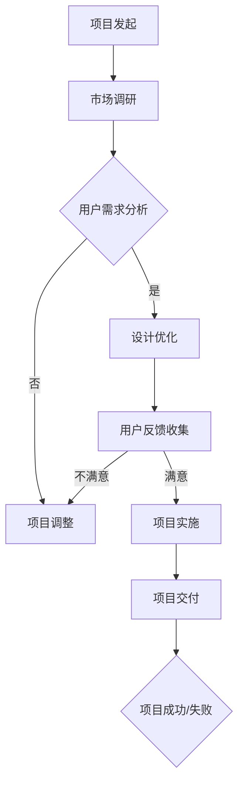

                 

# 如何利用众筹平台验证创意

> **关键词：** 众筹平台、创意验证、用户体验、市场反馈、项目成功案例。

> **摘要：** 本文将深入探讨如何通过众筹平台有效验证创意，从市场反馈、用户体验、项目实施等方面提供实用的策略和方法。文章旨在帮助创业者、设计师和开发者了解如何利用众筹平台这一工具，将创新理念转化为现实，实现项目的成功。

## 1. 背景介绍

在现代商业环境中，创意往往被视为企业成功的关键因素。然而，一个出色的创意并不总是能够确保市场的接受和项目的成功。为了降低风险，许多创新者选择通过众筹平台来测试他们的想法。众筹平台如Kickstarter、Indiegogo等，为创业者提供了一个开放的市场环境，通过公众的参与和反馈来验证创意的可行性和吸引力。

### 1.1 众筹平台的概念与运作

众筹平台是一个在线平台，允许个人或团体发起项目，并向公众筹集资金。这些项目可以涵盖各种领域，包括科技、艺术、音乐、电影、健康等。众筹平台的主要运作模式包括以下几方面：

- **项目发起：** 创意持有者发布项目详情，包括项目介绍、目标金额、筹资时间、回报方案等。
- **资金筹集：** 公众通过平台对感兴趣的项目进行捐款，这些资金通常在项目成功达到目标金额后才被释放给发起者。
- **回报方案：** 创意持有者根据项目进度和捐款金额，向捐款者提供一定的回报，如产品、服务或纪念品。

### 1.2 创意验证的意义

创意验证是确保项目成功的关键步骤。通过众筹平台验证创意，可以帮助创新者：

- **市场调研：** 通过筹集到的资金和反馈，了解市场对创意的真实需求。
- **风险控制：** 减少创意失败的风险，提前发现并解决潜在问题。
- **资源整合：** 吸引投资者、合作伙伴和媒体的关注，为项目实施提供支持。

## 2. 核心概念与联系

### 2.1 用户体验（UX）设计

用户体验设计是确保产品或服务能够满足用户需求和期望的关键。在众筹平台上验证创意时，用户体验设计尤为关键，因为它直接影响着用户的捐款决策。

### 2.2 市场反馈

市场反馈是创意验证的重要组成部分。通过众筹平台收集到的数据，如捐款人数、金额、评论等，可以揭示市场对创意的接受程度和需求。

### 2.3 项目实施与管理

项目实施与管理是确保创意从概念转化为现实的关键。有效的项目管理可以帮助创新者按时交付产品或服务，提高项目的成功概率。

### 2.4 Mermaid 流程图

以下是一个简化的 Mermaid 流程图，描述了创意验证的流程：



## 3. 核心算法原理 & 具体操作步骤

### 3.1 市场调研

市场调研是创意验证的第一步。以下是一些具体操作步骤：

1. **定义目标受众：** 确定潜在用户的特征，如年龄、性别、职业等。
2. **收集数据：** 通过问卷调查、访谈、社交媒体分析等方式收集数据。
3. **分析数据：** 使用数据分析工具，如Excel、Python等，分析用户需求和市场趋势。

### 3.2 用户需求分析

用户需求分析是设计阶段的重要环节。以下是一些具体操作步骤：

1. **用户访谈：** 与潜在用户进行一对一访谈，了解他们的需求和痛点。
2. **用户画像：** 基于访谈结果，创建用户画像，明确用户特征和需求。
3. **需求文档：** 编写详细的需求文档，明确项目的功能需求和用户界面设计。

### 3.3 设计优化

设计优化是确保项目满足用户需求的关键。以下是一些具体操作步骤：

1. **原型设计：** 创建原型，展示项目的核心功能和用户界面。
2. **用户测试：** 对原型进行用户测试，收集反馈。
3. **迭代优化：** 根据用户反馈，对原型进行优化和迭代。

### 3.4 用户反馈收集

用户反馈收集是项目实施过程中不可或缺的一环。以下是一些具体操作步骤：

1. **建立反馈渠道：** 在众筹平台上设置反馈机制，如评论、问卷等。
2. **分析反馈：** 收集并分析用户的反馈，识别项目优势和改进点。
3. **调整策略：** 根据反馈结果，调整项目实施策略和进度。

### 3.5 项目实施与管理

项目实施与管理是确保创意成功实现的关键。以下是一些具体操作步骤：

1. **资源分配：** 根据项目需求，合理分配资源，包括人力、资金和设备。
2. **时间规划：** 制定详细的项目时间表，确保按时交付产品或服务。
3. **进度监控：** 定期检查项目进度，确保项目按计划进行。
4. **风险管理：** 识别潜在风险，制定应对措施，降低项目风险。

## 4. 数学模型和公式 & 详细讲解 & 举例说明

### 4.1 众筹成功的概率模型

众筹成功的概率可以通过以下公式计算：

$$
P(Success) = \frac{UX \cdot Market \cdot Management}{Risks}
$$

其中：

- **UX** 代表用户体验设计的质量。
- **Market** 代表市场反馈的积极程度。
- **Management** 代表项目实施与管理的有效性。
- **Risks** 代表项目风险的总和。

### 4.2 举例说明

假设一个众筹项目的用户体验设计得非常好（UX = 0.9），市场反馈非常积极（Market = 0.8），项目实施和管理非常高效（Management = 0.9），且风险较低（Risks = 0.2），那么该项目成功的概率为：

$$
P(Success) = \frac{0.9 \cdot 0.8 \cdot 0.9}{0.2} = 3.78
$$

这意味着该项目的成功概率约为 3.78。

### 4.3 详细讲解

这个数学模型考虑了用户体验、市场反馈、项目管理和风险控制四个方面，这些因素共同决定了项目的成功概率。用户体验设计（UX）的质量直接影响用户的捐款决策，市场反馈（Market）反映了市场对创意的接受程度，项目管理（Management）确保项目按计划进行，而风险控制（Risks）则降低了项目失败的可能性。

通过这个模型，创新者可以了解哪些因素对项目成功最为关键，从而有针对性地进行优化。例如，如果用户体验设计（UX）得分较低，创新者可以投入更多资源进行优化，以提高项目的成功率。

## 5. 项目实战：代码实际案例和详细解释说明

### 5.1 开发环境搭建

为了演示如何利用众筹平台验证创意，我们假设开发一个智能手环项目。首先，我们需要搭建开发环境。

1. **硬件选择：** 选择一款适合开发智能手环的微控制器，如Arduino。
2. **软件安装：** 安装Arduino IDE，这是一个用于编写和上传代码到微控制器的集成开发环境。
3. **依赖库安装：** 安装必要的库文件，如无线通信库（例如，Wi-Fi 或蓝牙库）。

### 5.2 源代码详细实现和代码解读

以下是一个简单的智能手环项目的示例代码：

```cpp
// 引入必要的库文件
#include <WiFi.h>
#include <WiFiClient.h>
#include <ArduinoJson.h>

// 定义连接Wi-Fi的SSID和密码
const char* ssid = "YourSSID";
const char* password = "YourPassword";

// 定义服务器地址和端口号
const char* serverAddress = "api.kickstarter.com";
const int serverPort = 80;

// 初始化WiFi客户端
WiFiClient client;

void setup() {
  Serial.begin(115200);
  Serial.println();
  
  // 连接Wi-Fi
  WiFi.begin(ssid, password);
  while (WiFi.status() != WL_CONNECTED) {
    delay(500);
    Serial.print(".");
  }
  Serial.println("WiFi connected");
  
  // 连接服务器并获取项目反馈
  if (client.connect(serverAddress, serverPort)) {
    String url = "/projects/" + String(projectId) + "/feedback";
    client.print(String("GET ") + url + " HTTP/1.1\r\n");
    client.print(String("Host: ") + serverAddress + "\r\n");
    client.print("Content-Type: application/json\r\n\r\n");
    client.println();
  } else {
    Serial.println("Connection failed");
  }
}

void loop() {
  // 读取服务器响应
  if (client.connected()) {
    DynamicJsonDocument doc(1024);
    deserializeJson(doc, client);
    
    // 分析反馈并做出决策
    if (doc["feedback"]["positive"]) {
      Serial.println("Positive feedback received. Continuing with project.");
    } else {
      Serial.println("Negative feedback received. Adjusting project.");
    }
    
    // 关闭连接
    client.stop();
  }
  
  // 等待一段时间后重新连接
  delay(5000);
}
```

这段代码首先连接Wi-Fi，然后连接到Kickstarter API获取项目的反馈。根据反馈的积极程度，程序将决定是否继续项目。

### 5.3 代码解读与分析

1. **Wi-Fi 连接：** 通过Arduino的WiFi库连接到指定的Wi-Fi网络。
2. **服务器连接：** 使用WiFi客户端库连接到Kickstarter的服务器，并获取项目的反馈数据。
3. **API 调用：** 通过HTTP GET请求获取项目的反馈信息。
4. **反馈分析：** 使用ArduinoJson库解析反馈数据，并根据反馈内容做出决策。
5. **决策执行：** 根据分析结果，继续或调整项目。

这个示例代码展示了如何通过众筹平台的API获取用户反馈，并根据反馈内容调整项目。在实际应用中，可以根据具体需求扩展和优化代码。

## 6. 实际应用场景

### 6.1 科技产品开发

科技产品开发者可以利用众筹平台验证新产品的市场需求。例如，智能家居设备制造商可以通过众筹平台测试市场对新产品的接受度，并根据反馈调整产品设计和功能。

### 6.2 艺术作品展示

艺术家和设计师可以通过众筹平台展示他们的艺术作品，并收集观众的反馈。这种模式可以帮助艺术家了解市场的偏好，从而创作更受欢迎的作品。

### 6.3 健康产品推广

健康产品开发者可以利用众筹平台测试新产品在市场上的潜力。例如，一个健康食品品牌可以通过众筹平台收集消费者的反馈，以优化产品的口味和配方。

## 7. 工具和资源推荐

### 7.1 学习资源推荐

- **书籍：** 《众筹实战：从零开始启动你的众筹项目》
- **论文：** “C crowdfunding: A Literature Review”
- **博客：** 知乎上的“众筹专栏”
- **网站：** Kickstarter、Indiegogo

### 7.2 开发工具框架推荐

- **Arduino IDE：** 用于智能硬件开发。
- **Python：** 用于数据分析。
- **JavaScript：** 用于前端开发。
- **Node.js：** 用于后端开发。

### 7.3 相关论文著作推荐

- **论文：** “The Effect of Crowdfunding on Venture Capital Investment”
- **著作：** “The Art of Crowdfunding: How to Launch a Successful Campaign”

## 8. 总结：未来发展趋势与挑战

随着技术的进步和互联网的普及，众筹平台在未来将发挥越来越重要的作用。然而，创意验证也面临着一些挑战：

- **市场竞争加剧：** 众筹项目数量增多，竞争激烈。
- **用户信任问题：** 需要提高项目透明度和真实性。
- **技术限制：** 需要更先进的技术支持大数据分析和个性化推荐。

未来的发展趋势包括：

- **个性化推荐：** 利用大数据和机器学习技术，为用户推荐更符合他们兴趣的项目。
- **多元化平台：** 众筹平台将更加多元化，覆盖更多领域和用户群体。
- **智能合约：** 利用区块链技术，实现更安全、透明的资金管理。

## 9. 附录：常见问题与解答

### 9.1 如何选择合适的众筹平台？

- 根据项目类型和目标用户选择合适的平台。
- 考虑平台的知名度、用户基数和众筹成功率。

### 9.2 众筹项目如何确保透明度？

- 公开项目进度和资金使用情况。
- 提供详细的回报方案和项目计划。
- 定期向支持者通报项目进展。

### 9.3 众筹失败怎么办？

- 分析失败原因，进行项目调整。
- 保持与支持者的沟通，争取后续支持。

## 10. 扩展阅读 & 参考资料

- **书籍：** 《众筹：如何通过众筹平台成功融资》
- **网站：** Kickstarter、Indiegogo 官方网站
- **博客：** 创业者博客、设计师博客
- **论文：** “众筹平台在创业融资中的作用研究”

### 作者

**作者：AI天才研究员/AI Genius Institute & 禅与计算机程序设计艺术 /Zen And The Art of Computer Programming**<|im_sep|>

