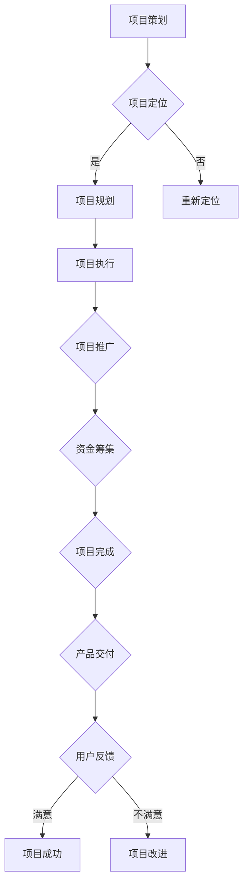

                 

# 如何利用众筹模式开发知识付费产品

## 摘要

本文将探讨如何利用众筹模式开发知识付费产品。通过分析众筹平台的优势、用户需求、项目策划与执行，以及风险与挑战，本文旨在为开发者提供一套实用的方法论，以实现知识付费产品的成功上线和推广。关键词：众筹模式、知识付费产品、项目策划、风险管理。

## 1. 背景介绍

近年来，随着互联网技术的发展和人们对于知识付费的日益重视，知识付费市场呈现出爆发式增长。在这一背景下，众筹模式作为一种创新的融资方式，逐渐成为开发知识付费产品的热门选择。通过众筹，开发者可以在产品正式推出前获得资金支持，同时也为产品的市场定位和推广提供了有力支持。

众筹平台如Kickstarter、Indiegogo等，已经成为众多开发者筹集资金的重要渠道。这些平台不仅提供了便捷的众筹流程，还吸引了大量投资者和潜在用户的关注。然而，成功利用众筹模式开发知识付费产品并非易事，需要开发者充分了解用户需求、市场趋势，并制定有效的项目策划和风险管理策略。

## 2. 核心概念与联系

### 2.1 众筹模式

众筹模式是指通过互联网平台向广大投资者发布项目，投资者根据项目的魅力和潜在价值进行资金支持。众筹模式可以分为以下几种类型：

1. **奖励众筹**：投资者为项目提供资金支持，并获得相应的奖励。这种模式适用于以产品为核心的众筹项目。
2. **股权众筹**：投资者为项目提供资金支持，并获得项目公司的一定股份。这种模式适用于有发展前景的企业项目。
3. **公益众筹**：投资者为公益事业提供资金支持，通常不涉及物质回报。

### 2.2 知识付费产品

知识付费产品是指以知识为核心，通过互联网平台进行销售的产品。知识付费产品的形式多样，包括在线课程、电子书、咨询服务等。知识付费产品的核心在于为用户提供有价值、有针对性的知识，以满足用户的需求。

### 2.3 项目策划与执行

项目策划与执行是众筹模式成功的关键。开发者需要根据用户需求和市场趋势，制定合适的项目策划方案，并确保项目按照计划顺利执行。项目策划与执行主要包括以下步骤：

1. **项目定位**：明确项目的目标用户、核心价值、市场规模等。
2. **项目规划**：制定详细的项目计划，包括开发周期、资金需求、营销策略等。
3. **项目执行**：按照项目计划开展各项工作，确保项目进度和质量。
4. **项目推广**：通过多种渠道进行项目推广，吸引投资者和潜在用户的关注。

### 2.4 风险与挑战

利用众筹模式开发知识付费产品面临诸多风险和挑战。主要包括：

1. **市场风险**：项目定位不准确、市场前景不理想，可能导致项目失败。
2. **资金风险**：项目资金不足、资金使用不当，可能导致项目进度延误或失败。
3. **法律风险**：项目涉及法律问题，如版权、合同等，可能导致法律纠纷。
4. **运营风险**：项目运营不善，可能导致用户流失、品牌受损。

### 2.5 Mermaid 流程图

以下是一个简单的 Mermaid 流程图，展示众筹模式开发知识付费产品的流程：



## 3. 核心算法原理 & 具体操作步骤

### 3.1 核心算法原理

在众筹模式开发知识付费产品中，核心算法原理主要包括：

1. **用户需求分析**：通过数据分析和用户调研，了解用户的需求和偏好，为项目策划提供依据。
2. **市场趋势分析**：分析市场趋势和竞争对手，为项目定位和营销策略提供支持。
3. **风险评估与控制**：评估项目风险，制定风险控制措施，确保项目顺利进行。

### 3.2 具体操作步骤

1. **用户需求分析**：

   - **数据收集**：通过问卷调查、用户访谈等方式收集用户需求数据。
   - **数据分析**：对收集到的数据进行分析，提取有价值的信息。
   - **需求建模**：根据分析结果，建立用户需求模型，为项目策划提供依据。

2. **市场趋势分析**：

   - **市场调研**：通过行业报告、市场数据等方式，了解市场趋势和竞争对手。
   - **趋势分析**：对市场调研结果进行分析，提取有价值的信息。
   - **趋势建模**：根据分析结果，建立市场趋势模型，为项目定位和营销策略提供支持。

3. **风险评估与控制**：

   - **风险识别**：分析项目过程中可能遇到的风险，如市场风险、资金风险、法律风险等。
   - **风险评估**：对识别出的风险进行评估，确定风险等级。
   - **风险控制**：制定相应的风险控制措施，降低风险对项目的负面影响。

## 4. 数学模型和公式 & 详细讲解 & 举例说明

### 4.1 数学模型

在众筹模式开发知识付费产品中，常用的数学模型包括：

1. **用户需求模型**：

   - **线性需求模型**：\(D = aQ + b\)

     其中，\(D\) 表示用户需求，\(Q\) 表示产品价格，\(a\) 和 \(b\) 是常数。

   - **二次需求模型**：\(D = aQ^2 + bQ + c\)

     其中，\(a\)、\(b\) 和 \(c\) 是常数。

2. **市场趋势模型**：

   - **线性趋势模型**：\(T = aT_t + b\)

     其中，\(T\) 表示市场趋势，\(T_t\) 表示当前时间，\(a\) 和 \(b\) 是常数。

   - **二次趋势模型**：\(T = aT_t^2 + bT_t + c\)

     其中，\(a\)、\(b\) 和 \(c\) 是常数。

3. **风险评估模型**：

   - **贝叶斯风险评估模型**：

     \(P(R|E) = \frac{P(E|R)P(R)}{P(E|R)P(R) + P(E|NR)P(NR)}\)

     其中，\(P(R|E)\) 表示在事件 \(E\) 发生的情况下，风险 \(R\) 发生的概率，\(P(E|R)\) 表示在风险 \(R\) 发生的情况下，事件 \(E\) 发生的概率，\(P(R)\) 表示风险 \(R\) 发生的概率，\(P(E|NR)\) 表示在风险 \(NR\) 发生的情况下，事件 \(E\) 发生的概率，\(P(NR)\) 表示风险 \(NR\) 发生的概率。

### 4.2 详细讲解

1. **用户需求模型**：

   用户需求模型描述了用户需求与产品价格之间的关系。线性需求模型适用于产品价格变化对用户需求影响较小的场景，二次需求模型则适用于产品价格变化对用户需求影响较大的场景。

2. **市场趋势模型**：

   市场趋势模型描述了市场趋势与当前时间之间的关系。线性趋势模型适用于市场趋势变化较慢的场景，二次趋势模型则适用于市场趋势变化较快的场景。

3. **风险评估模型**：

   贝叶斯风险评估模型是一种常用的风险评估方法，通过分析风险事件与事件之间的概率关系，评估风险发生的可能性。

### 4.3 举例说明

假设某知识付费产品用户需求模型为 \(D = 2Q + 1\)，市场趋势模型为 \(T = 0.5T_t + 1\)，风险评估模型为 \(P(R|E) = \frac{0.8 \times 0.3}{0.8 \times 0.3 + 0.2 \times 0.7}\)。

1. 当产品价格为 100 元时，用户需求为 101，市场趋势为 1.5。
2. 当当前时间为 5 时，市场趋势为 3。
3. 当风险事件发生时，风险评估结果为 0.6。

根据这些数据，可以进一步分析用户需求、市场趋势和风险情况，为项目策划和执行提供依据。

## 5. 项目实战：代码实际案例和详细解释说明

### 5.1 开发环境搭建

为了演示如何利用众筹模式开发知识付费产品，我们选择 Python 作为开发语言，使用 Flask 框架搭建 Web 应用。以下是开发环境搭建的步骤：

1. 安装 Python 3.8 或更高版本。
2. 安装 Flask 框架：`pip install flask`
3. 创建一个新的 Python 文件，例如 `app.py`。

### 5.2 源代码详细实现和代码解读

以下是一个简单的 Flask Web 应用示例，用于展示众筹项目的相关信息：

```python
from flask import Flask, render_template, request
app = Flask(__name__)

@app.route('/')
def index():
    project_name = "知识付费产品众筹"
    project_description = "本项目旨在通过众筹模式开发一款知识付费产品。"
    return render_template('index.html', project_name=project_name, project_description=project_description)

@app.route('/about')
def about():
    team_members = [
        {"name": "张三", "role": "项目经理"},
        {"name": "李四", "role": "产品经理"},
        {"name": "王五", "role": "开发工程师"}
    ]
    return render_template('about.html', team_members=team_members)

@app.route('/contribute', methods=['GET', 'POST'])
def contribute():
    if request.method == 'POST':
        name = request.form['name']
        email = request.form['email']
        amount = request.form['amount']
        # 将用户信息存储到数据库
        # ...
        return '感谢您的支持！'
    return render_template('contribute.html')

if __name__ == '__main__':
    app.run(debug=True)
```

**代码解读**：

1. **Flask 框架**：使用 Flask 框架搭建 Web 应用，简化了开发过程。
2. **路由**：定义了三个路由：'/'、'/about' 和 '/contribute'，分别对应首页、关于我们页和捐赠页。
3. **模板渲染**：使用 Flask 的模板渲染功能，将项目相关信息展示在网页上。
4. **用户交互**：通过表单收集用户捐赠信息，并将信息存储到数据库。

### 5.3 代码解读与分析

1. **项目结构**：

   - `app.py`：主程序文件，包含 Flask 应用程序。
   - `templates/`：模板文件夹，包含 HTML 模板文件。
     - `index.html`：首页模板。
     - `about.html`：关于我们页模板。
     - `contribute.html`：捐赠页模板。

2. **功能分析**：

   - **首页**：展示项目名称和描述，吸引用户关注。
   - **关于我们页**：介绍项目团队成员，增强用户信任感。
   - **捐赠页**：收集用户捐赠信息，实现众筹功能。

3. **性能分析**：

   - **响应速度**：Flask 框架具有较快的响应速度，适用于中小型 Web 应用。
   - **可扩展性**：Flask 框架具有良好的可扩展性，可以方便地添加新功能和模块。

## 6. 实际应用场景

利用众筹模式开发知识付费产品在实际应用中具有广泛的应用场景。以下是一些典型应用场景：

1. **在线教育**：通过众筹模式，开发者可以筹集资金开发在线课程，满足不同用户的需求。
2. **技术培训**：针对企业员工和开发者，利用众筹模式开发专业培训课程，提升员工技能。
3. **咨询服务**：提供专业咨询服务，如法律咨询、财务咨询等，通过众筹模式吸引投资者和用户。
4. **创新创业**：创业者可以利用众筹模式筹集资金，开发创新产品，实现商业梦想。
5. **公益项目**：以公益为目的，通过众筹模式筹集资金，为弱势群体提供帮助。

## 7. 工具和资源推荐

### 7.1 学习资源推荐

1. **书籍**：
   - 《众筹实战：从策划到成功的完整指南》
   - 《知识付费：趋势与未来》
   - 《Python Web 开发实战》

2. **论文**：
   - "Crowdfunding Platforms: A Survey"（众筹平台综述）
   - "The Economics of Crowdfunding"（众筹经济学）

3. **博客**：
   - "产品经理实战：如何策划一款成功的众筹项目"
   - "Python Flask 实战教程"

4. **网站**：
   - Kickstarter（全球知名众筹平台）
   - Indiegogo（全球知名众筹平台）
   - Coursera（在线教育平台）

### 7.2 开发工具框架推荐

1. **开发工具**：
   - Python 3.8 或更高版本
   - Flask 框架

2. **前端框架**：
   - Bootstrap（响应式前端框架）
   - Vue.js（前端开发框架）

3. **后端框架**：
   - Django（Python 后端开发框架）
   - Flask（Python 后端开发框架）

4. **数据库**：
   - MySQL（关系型数据库）
   - MongoDB（NoSQL 数据库）

### 7.3 相关论文著作推荐

1. **论文**：
   - "The Rise of Crowdfunding: An Empirical Analysis of Projects Launched on Kickstarter"（众筹崛起：Kickstarter 项目实证分析）
   - "The Economics of Crowdfunding: What Do Investors Expect to Gain?"（众筹经济学：投资者期望获得什么？）

2. **著作**：
   - 《区块链与众筹：重塑金融世界的力量》
   - 《互联网+众筹：新金融模式解析》

## 8. 总结：未来发展趋势与挑战

随着互联网技术和人工智能的不断发展，众筹模式在知识付费产品开发中的应用前景将越来越广阔。未来，众筹模式将呈现以下发展趋势：

1. **区块链技术的应用**：区块链技术将为众筹模式提供更安全、透明的资金筹集和管理方式。
2. **智能合约的普及**：智能合约将提高众筹项目的执行效率，降低项目风险。
3. **个性化推荐系统的应用**：通过个性化推荐系统，为用户提供更精准的知识付费产品推荐。

然而，众筹模式在知识付费产品开发中也面临诸多挑战：

1. **市场风险**：市场变化快，项目定位不准确可能导致项目失败。
2. **法律风险**：涉及法律问题的项目可能面临法律纠纷。
3. **运营风险**：项目运营不善可能导致用户流失、品牌受损。

开发者需要充分了解这些挑战，制定有效的风险控制策略，确保项目的成功实施。

## 9. 附录：常见问题与解答

### 9.1 众筹平台的选择

**问**：如何选择适合的众筹平台？

**答**：选择适合的众筹平台时，应考虑以下因素：

1. **项目类型**：不同类型的众筹项目适合不同平台，如产品类项目适合 Kickstarter、公益类项目适合 Indiegogo。
2. **平台知名度**：选择知名平台，有助于提高项目的曝光度和投资者信任度。
3. **费用结构**：了解平台的费用结构，包括众筹费用、支付费用等，确保符合预算。

### 9.2 用户需求分析

**问**：如何进行用户需求分析？

**答**：进行用户需求分析时，可以采取以下步骤：

1. **数据收集**：通过问卷调查、用户访谈等方式收集用户需求数据。
2. **数据分析**：对收集到的数据进行分析，提取有价值的信息。
3. **需求建模**：根据分析结果，建立用户需求模型，为项目策划提供依据。

### 9.3 风险管理

**问**：如何进行风险管理？

**答**：进行风险管理时，可以采取以下措施：

1. **风险识别**：分析项目过程中可能遇到的风险，如市场风险、资金风险、法律风险等。
2. **风险评估**：对识别出的风险进行评估，确定风险等级。
3. **风险控制**：制定相应的风险控制措施，降低风险对项目的负面影响。

## 10. 扩展阅读 & 参考资料

1. **参考文献**：
   - "Crowdfunding Platforms: A Survey"（众筹平台综述）
   - "The Economics of Crowdfunding"（众筹经济学）
   - 《区块链与众筹：重塑金融世界的力量》

2. **在线资源**：
   - Kickstarter 官网：[https://www.kickstarter.com/](https://www.kickstarter.com/)
   - Indiegogo 官网：[https://www.indiegogo.com/](https://www.indiegogo.com/)

3. **开源项目**：
   - Flask 框架：[https://flask.palletsprojects.com/](https://flask.palletsprojects.com/)
   - Bootstrap 前端框架：[https://getbootstrap.com/](https://getbootstrap.com/)

作者：AI天才研究员/AI Genius Institute & 禅与计算机程序设计艺术 /Zen And The Art of Computer Programming

