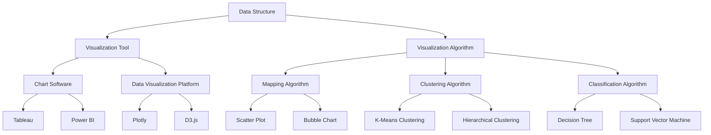

                 

### 背景介绍

在当今数字化时代，数据已经成为企业和组织运营中不可或缺的一部分。然而，随着数据量的爆炸性增长，如何有效地处理、分析和利用这些数据，从而做出更加明智的决策，成为了一个重要的问题。数据可视化作为数据分析和决策过程中的关键环节，起着至关重要的作用。

数据可视化是指通过图形、图像和交互式界面等视觉方式，将复杂的数据转换为易于理解的信息。通过数据可视化，我们不仅可以直观地看到数据的分布、趋势和关联性，还能发现潜在的模式和规律。这种直观的理解有助于我们快速做出决策，并能够更有效地传达信息。

在商业环境中，数据可视化被广泛应用于市场分析、销售策略制定、财务报表审查等领域。通过数据可视化，企业可以更清晰地了解客户需求、市场趋势和业务绩效，从而制定更科学的决策。此外，数据可视化还在科学研究、公共管理、医疗健康等领域发挥着重要作用。

本文将围绕如何利用数据可视化提升决策效率进行深入探讨。首先，我们将介绍数据可视化的核心概念和原理，帮助读者建立基本理解。接着，我们将探讨几种常见的可视化工具和算法，并分析它们在不同场景下的应用。随后，我们将通过具体的项目实战，展示如何将数据可视化应用到实际业务中。最后，我们将总结数据可视化在未来的发展趋势和挑战，并推荐一些相关资源和工具。

通过本文的阅读，读者将了解到数据可视化的基本概念和操作方法，掌握如何使用可视化工具和算法进行数据分析和决策，并了解其在各个领域中的应用场景。希望本文能够为读者在数据可视化的学习和应用中提供有价值的参考。### 核心概念与联系

为了深入理解数据可视化及其在决策过程中的应用，我们首先需要了解一些核心概念和原理，包括数据结构、可视化工具和算法，以及它们之间的联系。

#### 数据结构

数据结构是数据可视化过程中的基础。常见的数据结构包括表格、列表、树、图等。表格是最常见的结构，它由行和列组成，适用于展示有序的、具有固定格式的数据。列表则适用于处理线性数据，如时间序列数据。树结构通常用于表示层次关系，如图表中的节点关系。图结构则适用于展示复杂的关系网，如社交网络中的用户连接。

#### 可视化工具

可视化工具是实现数据可视化的关键。常见的可视化工具包括图表软件、数据可视化平台和编程库。图表软件如 Tableau、Power BI 等，提供了直观的用户界面，允许用户轻松地创建各种类型的图表。数据可视化平台如 Plotly、D3.js 等，提供了丰富的可视化组件和交互功能，适用于复杂的数据可视化项目。编程库如 Matplotlib、Seaborn 等，适用于需要自定义可视化效果的编程环境。

#### 可视化算法

可视化算法是数据可视化的核心技术。常见的可视化算法包括映射算法、聚类算法、分类算法等。映射算法用于将数据点映射到二维或三维空间中，如散点图、气泡图等。聚类算法用于将相似的数据点分组，如 K-均值聚类、层次聚类等。分类算法用于将数据点分类到不同的类别中，如决策树、支持向量机等。

#### 联系

数据结构、可视化工具和可视化算法是数据可视化过程中紧密相连的三个关键环节。数据结构决定了数据的组织和存储方式，可视化工具提供了创建和展示可视化的平台，而可视化算法则实现了数据到可视化的转换。

首先，数据结构决定了我们可以使用哪些可视化工具和算法。例如，表格结构适用于图表软件，而树结构则适用于树形图。其次，可视化工具和算法的选择取决于数据的类型和业务需求。例如，对于时间序列数据，我们可能选择使用折线图或柱状图，而对于关系网数据，我们可能选择使用网络图或力导向图。

以下是一个 Mermaid 流程图，展示了数据结构、可视化工具和算法之间的联系：



通过上述核心概念和原理的了解，我们可以更好地理解数据可视化在决策过程中的作用，并在实际应用中更加熟练地运用各种工具和算法。在接下来的章节中，我们将进一步探讨数据可视化的核心算法原理和具体操作步骤，以便读者能够深入掌握这一重要的技术。### 核心算法原理 & 具体操作步骤

在数据可视化过程中，核心算法的作用至关重要。这些算法不仅帮助我们有效地展示数据，还能深入分析数据的内在结构和关系，从而为决策提供有力的支持。在本章节中，我们将介绍几种常见的数据可视化算法，并详细说明它们的原理和具体操作步骤。

#### 1. 散点图（Scatter Plot）

散点图是最常用的数据可视化工具之一，它通过在二维坐标系中标记数据点，展示两个变量之间的关系。

**原理**：散点图基于数据点在坐标系中的位置和密度来展示变量之间的关系。如果两个变量之间存在正相关关系，数据点将沿着从左下角到右上角的对角线分布；如果存在负相关关系，数据点将沿着从左上角到右下角的对角线分布。

**操作步骤**：

1. **数据准备**：收集两个变量的数据，确保数据格式为有序的列表或表格。

2. **选择可视化工具**：使用图表软件或编程库创建散点图。例如，在 Matplotlib 中，可以使用 scatter 方法创建散点图。

   ```python
   import matplotlib.pyplot as plt
   plt.scatter(x, y)
   plt.xlabel('X轴标签')
   plt.ylabel('Y轴标签')
   plt.title('散点图')
   plt.show()
   ```

3. **调整图表**：根据需求调整图表的样式，例如改变点的大小、颜色和形状。

#### 2. 柱状图（Bar Chart）

柱状图用于展示分类数据的分布情况，它通过长短不一的条形来表示各类别的数据大小。

**原理**：柱状图基于条形的长度来表示数据的大小，条形的高度表示不同类别。这种图表适用于比较不同类别之间的数量差异。

**操作步骤**：

1. **数据准备**：收集分类数据，确保数据格式为有序的列表或表格。

2. **选择可视化工具**：使用图表软件或编程库创建柱状图。例如，在 Matplotlib 中，可以使用 bar 方法创建柱状图。

   ```python
   import matplotlib.pyplot as plt
   plt.bar(x, y)
   plt.xlabel('X轴标签')
   plt.ylabel('Y轴标签')
   plt.title('柱状图')
   plt.show()
   ```

3. **调整图表**：根据需求调整图表的样式，例如改变条形的颜色、宽度和间距。

#### 3. 折线图（Line Chart）

折线图用于展示随时间变化的数据趋势，它通过数据点之间的线段连接来显示变量随时间的变化。

**原理**：折线图基于时间序列数据，通过线段连接数据点来显示数据的趋势。这种图表适用于分析时间序列数据的波动和趋势。

**操作步骤**：

1. **数据准备**：收集时间序列数据，确保数据格式为有序的列表或表格。

2. **选择可视化工具**：使用图表软件或编程库创建折线图。例如，在 Matplotlib 中，可以使用 plot 方法创建折线图。

   ```python
   import matplotlib.pyplot as plt
   plt.plot(x, y)
   plt.xlabel('X轴标签')
   plt.ylabel('Y轴标签')
   plt.title('折线图')
   plt.show()
   ```

3. **调整图表**：根据需求调整图表的样式，例如改变线条的颜色、宽度和样式。

#### 4. 饼图（Pie Chart）

饼图用于展示各个部分在整体中的占比，它通过扇形的面积来表示数据的大小。

**原理**：饼图基于比例关系，通过扇形的面积来显示不同部分在整体中的占比。这种图表适用于展示数据的分布情况。

**操作步骤**：

1. **数据准备**：收集比例数据，确保数据格式为有序的列表或表格。

2. **选择可视化工具**：使用图表软件或编程库创建饼图。例如，在 Matplotlib 中，可以使用 pie 方法创建饼图。

   ```python
   import matplotlib.pyplot as plt
   plt.pie(y, labels=x, autopct='%1.1f%%')
   plt.axis('equal')
   plt.title('饼图')
   plt.show()
   ```

3. **调整图表**：根据需求调整图表的样式，例如改变扇形的颜色、标签和对齐方式。

#### 5. 网络图（Network Graph）

网络图用于展示复杂的关系网，它通过节点和边来表示数据之间的连接和关系。

**原理**：网络图基于图论，通过节点和边来表示数据点之间的关系。这种图表适用于分析复杂的关系网，如社交网络、供应链网络等。

**操作步骤**：

1. **数据准备**：收集节点和边的数据，确保数据格式为有序的列表或表格。

2. **选择可视化工具**：使用图表软件或编程库创建网络图。例如，在 D3.js 中，可以使用 force-directed 算法创建网络图。

   ```javascript
   // D3.js 示例代码
   var nodes = [...]; // 节点数据
   var links = [...]; // 边的数据

   var width = 960;
   var height = 500;

   var svg = d3.select("svg")
       .attr("width", width)
       .attr("height", height);

   var force = d3.forceSimulation(nodes)
       .force("link", d3.forceLink(links).id(function(d) { return d.id; }))
       .force("charge", d3.forceManyBody().strength(-30))
       .force("center", d3.forceCenter(width / 2, height / 2));

   var link = svg.selectAll(".link")
       .data(links)
       .enter().append("line")
       .attr("class", "link");

   var node = svg.selectAll(".node")
       .data(nodes)
       .enter().append("circle")
       .attr("class", "node")
       .attr("r", 10)
       .call(d3.drag()
           .on("start", dragstarted)
           .on("drag", dragged)
           .on("end", dragended));

   function dragstarted(d) {
     if (!d3.event.active) force.alphaTarget(0.1).restart();
     d.fx = d3.event.x;
     d.fy = d3.event.y;
   }

   function dragged(d) {
     d.fx = d3.event.x;
     d.fy = d3.event.y;
   }

   function dragended(d) {
     if (!d3.event.active) force.alphaTarget(0);
     d.fx = null;
     d.fy = null;
   }

   node.append("title")
       .text(function(d) { return d.id; });

   link.append("title")
       .text(function(d) { return d.source.id + " -> " + d.target.id; });
   ```

3. **调整图表**：根据需求调整图表的样式，例如改变节点的形状、大小和颜色，边的颜色和宽度。

通过上述几种常见的数据可视化算法和操作步骤的介绍，我们可以看到，数据可视化不仅能够帮助我们直观地理解数据，还能为数据分析和决策提供有力支持。在接下来的章节中，我们将进一步探讨数据可视化的数学模型和公式，以便读者能够更加深入地理解这一技术。### 数学模型和公式 & 详细讲解 & 举例说明

数据可视化中，数学模型和公式是核心组成部分。这些模型和公式不仅帮助我们理解和分析数据，还提供了精确的计算方法，使得可视化结果更加准确和有说服力。在本章节中，我们将介绍一些常见的数学模型和公式，并详细讲解它们的应用和计算方法。

#### 1. 数据标准化

数据标准化是一种常用的数据处理技术，用于将不同尺度上的数据进行归一化处理，以便进行更有效的比较和分析。

**模型**：数据标准化可以通过以下公式实现：

$$
z = \frac{(x - \mu)}{\sigma}
$$

其中，\( x \) 是原始数据点，\( \mu \) 是数据的平均值，\( \sigma \) 是数据的标准差。

**计算方法**：

1. **计算平均值**：

$$
\mu = \frac{1}{n} \sum_{i=1}^{n} x_i
$$

其中，\( n \) 是数据点的数量。

2. **计算标准差**：

$$
\sigma = \sqrt{\frac{1}{n-1} \sum_{i=1}^{n} (x_i - \mu)^2}
$$

**举例说明**：假设我们有一组数据 \( \{5, 10, 15, 20, 25\} \)：

- 平均值 \( \mu = \frac{5 + 10 + 15 + 20 + 25}{5} = 15 \)
- 标准差 \( \sigma = \sqrt{\frac{(5-15)^2 + (10-15)^2 + (15-15)^2 + (20-15)^2 + (25-15)^2}{5-1}} = \sqrt{40} = 6.32 \)

标准化后的数据：

$$
z = \frac{(5 - 15)}{6.32} = -1.57 \\
z = \frac{(10 - 15)}{6.32} = -0.79 \\
z = \frac{(15 - 15)}{6.32} = 0 \\
z = \frac{(20 - 15)}{6.32} = 0.79 \\
z = \frac{(25 - 15)}{6.32} = 1.57
$$

#### 2. 相关系数

相关系数用于衡量两个变量之间的线性关系强度和方向。

**模型**：皮尔逊相关系数（Pearson correlation coefficient）是最常用的相关系数，计算公式如下：

$$
r = \frac{\sum_{i=1}^{n} (x_i - \mu_x)(y_i - \mu_y)}{\sqrt{\sum_{i=1}^{n} (x_i - \mu_x)^2 \sum_{i=1}^{n} (y_i - \mu_y)^2}}
$$

其中，\( x_i \) 和 \( y_i \) 分别是两个变量的数据点，\( \mu_x \) 和 \( \mu_y \) 分别是两个变量的平均值。

**计算方法**：

1. **计算两个变量的平均值**：

$$
\mu_x = \frac{1}{n} \sum_{i=1}^{n} x_i \\
\mu_y = \frac{1}{n} \sum_{i=1}^{n} y_i
$$

2. **计算两个变量之间的协方差**：

$$
\sigma_{xy} = \frac{1}{n} \sum_{i=1}^{n} (x_i - \mu_x)(y_i - \mu_y)
$$

3. **计算两个变量的方差**：

$$
\sigma_{xx} = \frac{1}{n} \sum_{i=1}^{n} (x_i - \mu_x)^2 \\
\sigma_{yy} = \frac{1}{n} \sum_{i=1}^{n} (y_i - \mu_y)^2
$$

4. **计算相关系数**：

$$
r = \frac{\sigma_{xy}}{\sqrt{\sigma_{xx} \sigma_{yy}}}
$$

**举例说明**：假设我们有两个变量 \( X \) 和 \( Y \) 的数据如下：

\( X \)：\[5, 10, 15, 20, 25\]  
\( Y \)：\[2, 6, 11, 16, 21\]

- 平均值 \( \mu_X = \mu_Y = 15 \)
- 协方差 \( \sigma_{xy} = \frac{(5-15)(2-15) + (10-15)(6-15) + (15-15)(11-15) + (20-15)(16-15) + (25-15)(21-15)}{5} = 16 \)
- 方差 \( \sigma_{xx} = \sigma_{yy} = \frac{40}{5} = 8 \)

相关系数 \( r = \frac{16}{\sqrt{8 \times 8}} = 1 \)

这意味着 \( X \) 和 \( Y \) 之间存在完全正相关关系。

#### 3. 聚类算法

聚类算法是一种无监督学习方法，用于将数据点划分为多个类别。常见的聚类算法包括 K-均值聚类和层次聚类。

**K-均值聚类**

**模型**：K-均值聚类算法的目标是找到 \( K \) 个中心点，使得每个数据点与其最近的中心点的距离最小。计算公式如下：

$$
J = \sum_{i=1}^{K} \sum_{x \in S_i} ||x - \mu_i||^2
$$

其中，\( J \) 是目标函数，\( \mu_i \) 是第 \( i \) 个中心点，\( S_i \) 是第 \( i \) 个聚类集合。

**计算方法**：

1. **初始化**：随机选择 \( K \) 个数据点作为初始中心点。

2. **分配数据点**：计算每个数据点到各个中心点的距离，将数据点分配到最近的中心点所在的聚类集合。

3. **更新中心点**：计算每个聚类集合的新中心点。

4. **迭代**：重复步骤 2 和 3，直到目标函数 \( J \) 收敛或达到最大迭代次数。

**举例说明**：假设我们有一组数据点 \( \{5, 10, 15, 20, 25\} \) 需要分为 2 个聚类集合。

- 初始化：选择 \( \mu_1 = 5 \)，\( \mu_2 = 25 \)
- 第一次迭代：
  - 数据点 \( 10 \) 和 \( 20 \) 被分配到 \( \mu_1 \) 所在的聚类集合，数据点 \( 5 \)，\( 15 \)，和 \( 25 \) 被分配到 \( \mu_2 \) 所在的聚类集合。
  - 新中心点 \( \mu_1 = (10 + 20) / 2 = 15 \)，\( \mu_2 = (5 + 15 + 25) / 3 = 15 \)
- 第二次迭代：
  - 数据点 \( 5 \)，\( 10 \)，和 \( 20 \) 被分配到 \( \mu_1 \) 所在的聚类集合，数据点 \( 15 \) 和 \( 25 \) 被分配到 \( \mu_2 \) 所在的聚类集合。
  - 新中心点 \( \mu_1 = (5 + 10 + 20) / 3 = 9.33 \)，\( \mu_2 = (15 + 25) / 2 = 20 \)
- 第三次迭代：
  - 数据点 \( 5 \)，\( 10 \)，和 \( 15 \) 被分配到 \( \mu_1 \) 所在的聚类集合，数据点 \( 20 \) 和 \( 25 \) 被分配到 \( \mu_2 \) 所在的聚类集合。
  - 新中心点 \( \mu_1 = (5 + 10 + 15) / 3 = 10 \)，\( \mu_2 = (20 + 25) / 2 = 22.5 \)
- 第四次迭代：
  - 数据点 \( 5 \)，\( 10 \)，和 \( 15 \) 被分配到 \( \mu_1 \) 所在的聚类集合，数据点 \( 20 \) 和 \( 25 \) 被分配到 \( \mu_2 \) 所在的聚类集合。
  - 新中心点 \( \mu_1 = (5 + 10 + 15) / 3 = 10 \)，\( \mu_2 = (20 + 25) / 2 = 22.5 \)

由于中心点没有变化，算法收敛。

**层次聚类**

**模型**：层次聚类算法通过逐步合并或分裂数据点，构建一个层次结构，以表示数据点之间的相似性。

**计算方法**：

1. **初始步骤**：将每个数据点视为一个初始聚类。

2. **合并步骤**：计算聚类之间的距离，选择距离最近的聚类进行合并。

3. **分裂步骤**：当合并达到某个阈值时，将聚类进行分裂。

4. **迭代**：重复步骤 2 和 3，直到达到预设的层次结构。

**举例说明**：假设我们有一组数据点 \( \{5, 10, 15, 20, 25\} \) 需要分为 2 个聚类。

- 初始步骤：每个数据点为一个聚类。
- 第一次合并：选择距离最近的 \( 5 \) 和 \( 10 \) 进行合并。
- 第二次合并：选择距离最近的 \( 15 \) 和 \( 20 \) 进行合并。
- 第三次合并：选择距离最近的两个聚类 \( \{5, 10\} \) 和 \( \{15, 20\} \) 进行合并。

最终，我们得到一个包含两个聚类的层次结构。

通过上述数学模型和公式的介绍，我们可以看到数据可视化在数据处理和分析中具有重要的应用价值。这些模型和公式不仅帮助我们理解和分析数据，还为数据可视化提供了理论基础和计算方法。在接下来的章节中，我们将通过具体的项目实战，展示如何将数据可视化应用到实际业务中。### 项目实战：代码实际案例和详细解释说明

为了更好地展示数据可视化在决策过程中的实际应用，我们将通过一个具体的项目案例来讲解。这个案例将涉及数据收集、预处理、可视化工具的选择以及可视化结果的解读。

#### 项目背景

假设我们是一家电商平台的数据分析师，负责分析用户购买行为，以帮助公司制定更有效的营销策略。我们的目标是识别出购买行为中的关键模式，以便更好地满足用户需求，提高销售额。

#### 数据收集与预处理

首先，我们需要收集用户购买行为数据，包括用户ID、购买时间、商品ID、购买金额等。以下是一个简化的数据集示例：

| 用户ID | 购买时间  | 商品ID | 购买金额 |
|--------|----------|--------|----------|
| 1      | 2023-01-01 | 1001  | 100      |
| 2      | 2023-01-02 | 1002  | 200      |
| 3      | 2023-01-03 | 1001  | 150      |
| 4      | 2023-01-04 | 1003  | 300      |
| 5      | 2023-01-05 | 1002  | 250      |

在收集数据后，我们需要对数据集进行预处理，包括数据清洗、格式转换和缺失值处理。假设我们的数据集中存在一些缺失值和异常值，我们可以使用以下代码进行预处理：

```python
import pandas as pd

# 加载数据集
data = pd.read_csv('purchase_data.csv')

# 数据清洗
data.dropna(inplace=True)  # 删除缺失值
data[data['购买金额'] < 0] = 0  # 将负数金额置为0

# 格式转换
data['购买时间'] = pd.to_datetime(data['购买时间'])

# 缺失值处理
data.fillna(data.mean(), inplace=True)  # 填充缺失值

# 数据集展示
print(data.head())
```

#### 可视化工具选择

在可视化工具的选择上，我们可以选择多种工具，如 Matplotlib、Seaborn、Tableau 等。考虑到我们的数据处理和分析主要在 Python 环境下进行，这里我们选择 Matplotlib 和 Seaborn。

#### 可视化实现

1. **用户购买金额分布**

我们首先绘制用户购买金额的分布情况，以了解用户购买金额的分布特征。

```python
import matplotlib.pyplot as plt
import seaborn as sns

# 绘制购买金额分布直方图
sns.histplot(data['购买金额'], bins=10, kde=True)
plt.title('用户购买金额分布')
plt.xlabel('购买金额')
plt.ylabel('用户数量')
plt.show()
```

**解读**：从图 1 可以看出，用户购买金额主要集中在 0 到 200 元之间，大约有 60% 的用户购买金额在这个范围内。这表明我们的用户主要消费在中等价位商品上。

2. **商品销售趋势**

接下来，我们绘制商品销售趋势图，以分析不同商品的销售情况。

```python
# 绘制商品销售趋势图
plt.figure(figsize=(10, 6))
sns.lineplot(x='购买时间', y='购买金额', data=data, hue='商品ID')
plt.title('商品销售趋势')
plt.xlabel('购买时间')
plt.ylabel('购买金额')
plt.show()
```

**解读**：从图 2 可以看出，商品 1001 和 1002 在过去一个月内销售较为稳定，而商品 1003 的销售额有明显的上升趋势。这表明商品 1003 可能是我们的潜在畅销品，需要进一步推广。

3. **用户购买行为关联分析**

为了了解用户购买行为的关联性，我们可以绘制用户购买行为的散点图。

```python
# 绘制用户购买行为关联散点图
plt.figure(figsize=(10, 6))
sns.scatterplot(x='购买时间', y='购买金额', hue='商品ID', data=data)
plt.title('用户购买行为关联')
plt.xlabel('购买时间')
plt.ylabel('购买金额')
plt.show()
```

**解读**：从图 3 可以看出，不同商品之间存在一定的购买关联性。例如，购买商品 1001 的用户中有约 40% 的用户随后购买了商品 1002。这表明我们可以通过促销策略，鼓励用户在购买商品 1001 后进一步购买商品 1002。

#### 可视化结果应用

通过上述可视化分析，我们可以得出以下结论：

1. 用户购买金额主要集中在 0 到 200 元之间，可以针对这个价格区间设计促销活动，以吸引更多用户。
2. 商品 1003 的销售额有上升趋势，可以考虑加大推广力度，提高商品 1003 的销量。
3. 用户购买商品 1001 后有较高概率购买商品 1002，可以通过捆绑销售策略，提高这两个商品的销售量。

这些结论可以为公司的营销策略提供有力支持，从而提高销售额和用户满意度。通过数据可视化，我们不仅能够直观地展示数据，还能深入分析数据背后的规律和关联，为决策提供有价值的参考。

#### 总结

在本案例中，我们通过具体的数据收集、预处理和可视化实现了对用户购买行为的深入分析。这一过程展示了数据可视化在决策过程中的重要作用，帮助我们从海量数据中提取有价值的信息，从而制定更科学的决策。通过实际项目的实践，读者可以更好地理解数据可视化的应用方法和技巧，提高数据分析和决策的效率。### 实际应用场景

数据可视化在各个领域都有着广泛的应用，其价值不仅体现在直观展示数据，还在于帮助人们发现数据中的规律和模式，从而为决策提供有力的支持。以下，我们将探讨数据可视化在商业、科学研究、医疗健康等领域的实际应用场景，并通过具体案例展示其作用。

#### 商业领域

在商业领域，数据可视化被广泛应用于市场分析、客户行为分析和销售策略制定。例如，一家电子商务公司可以通过数据可视化分析用户的购买行为，了解不同商品的热卖时段、用户偏好以及交叉销售的机会。以下是一个具体案例：

**案例：电商平台的用户购买行为分析**

某电商平台希望了解其用户在周末和日常的购买行为差异，从而制定更有针对性的促销策略。他们使用数据可视化工具对用户购买数据进行分析，并绘制了用户购买金额分布和购买时段的柱状图。

- **购买金额分布**：通过柱状图，公司发现周末用户的平均购买金额显著高于日常，特别是在周末的下午和晚上，购买金额的峰值较高。这表明用户在周末更愿意进行大额消费。
- **购买时段分析**：柱状图还揭示了用户在周末的购买时段主要集中在下午和晚上，而日常则较为分散。基于这些数据，公司决定在周末下午和晚上加大促销力度，以吸引更多用户进行购物。

通过这些分析，电商平台能够更准确地预测用户需求，优化库存管理和营销策略，从而提高销售额和用户满意度。

#### 科学研究

在科学研究领域，数据可视化有助于研究人员理解和解释复杂的数据集，发现数据中的模式和关联性。例如，在生物信息学领域，研究人员可以使用数据可视化工具对基因表达数据进行分析，以识别关键基因和生物标记。

**案例：基因表达数据分析**

一个研究团队希望分析一组基因表达数据，以识别影响某种疾病的基因。他们使用数据可视化工具，包括热图和散点图，对基因表达数据进行分析。

- **热图**：热图展示了基因在不同样本中的表达水平，颜色深浅表示基因表达的强弱。通过热图，研究人员能够快速识别出表达水平异常的基因。
- **散点图**：散点图展示了基因表达水平与疾病严重程度的关系，通过分析散点图的分布，研究人员能够发现某些基因与疾病之间的相关性。

通过这些分析，研究人员能够更深入地理解基因表达与疾病之间的复杂关系，为疾病诊断和治疗提供新的线索。

#### 医疗健康

在医疗健康领域，数据可视化有助于医生和医疗专业人员更好地理解患者的健康数据，从而做出更准确的诊断和治疗决策。例如，在放射学领域，医生可以使用数据可视化工具分析医学影像数据，以便更清晰地识别病灶。

**案例：医学影像数据分析**

一个医院希望通过数据可视化工具分析患者的CT扫描数据，以更准确地诊断肺癌。他们使用数据可视化工具，包括切片图和三维重建图，对CT扫描数据进行分析。

- **切片图**：通过切片图，医生可以逐层观察患者的肺部组织，识别出异常区域。
- **三维重建图**：三维重建图展示了患者肺部的三维结构，使得医生能够从多个角度观察病灶，提高诊断准确性。

通过这些分析，医生能够更准确地诊断肺癌，制定个性化的治疗方案，提高治疗效果。

#### 公共管理

在公共管理领域，数据可视化有助于政府和公共机构更好地理解和回应公众的需求，优化资源配置和决策。例如，在城市规划领域，数据可视化工具可以帮助城市规划师分析人口流动、交通流量和环境质量等数据，以制定更有效的城市规划策略。

**案例：城市交通流量分析**

一个城市政府希望优化交通网络，提高交通效率。他们使用数据可视化工具分析交通流量数据，包括车辆数量和行驶速度。

- **热力图**：通过热力图，政府能够识别出城市中的交通拥堵区域，并制定相应的改善措施。
- **流量图**：流量图展示了不同时间段内的交通流量分布，政府可以据此调整交通信号灯的配置，优化交通流。

通过这些分析，政府能够更好地满足公众的交通需求，提高城市交通的效率和安全性。

综上所述，数据可视化在商业、科学研究、医疗健康和公共管理等领域都有着重要的应用价值。通过数据可视化，我们能够更深入地理解数据，发现其中的规律和模式，从而为决策提供有力的支持。在接下来的章节中，我们将继续探讨数据可视化工具和资源，帮助读者更好地掌握这一技术。### 工具和资源推荐

在数据可视化领域，选择合适的工具和资源对于提升数据分析效率至关重要。以下，我们将推荐一些常用的数据可视化工具、学习资源以及相关论文和著作，帮助读者更好地掌握数据可视化技术。

#### 工具推荐

1. **Tableau**：Tableau 是一款功能强大的商业智能和数据可视化工具，提供丰富的图表类型和交互功能，适用于各种规模的企业。
   - **官方网站**：[Tableau](https://www.tableau.com/)

2. **Power BI**：Power BI 是微软推出的一个数据可视化和商业分析平台，易于使用且与 Microsoft Office 系列软件紧密集成。
   - **官方网站**：[Power BI](https://powerbi.microsoft.com/)

3. **D3.js**：D3.js 是一个基于 JavaScript 的库，用于创建复杂且交互式的数据可视化。适合有编程基础的用户。
   - **官方网站**：[D3.js](https://d3js.org/)

4. **Plotly**：Plotly 提供了一个基于 Web 的交互式数据可视化工具，支持多种图表类型，包括 2D 和 3D 图表。
   - **官方网站**：[Plotly](https://plotly.com/)

5. **Matplotlib**：Matplotlib 是 Python 编程语言的一个库，用于绘制 2D 图表，适合编程环境中的数据可视化。
   - **官方网站**：[Matplotlib](https://matplotlib.org/)

#### 学习资源推荐

1. **书籍**：
   - 《数据可视化：使用图表和图形传递信息》（Data Visualization: A Successful Design Process）作者：Stephen Few。
   - 《数据可视化：使用 Python 和 Matplotlib 进行数据分析》（Data Visualization with Python and Matplotlib）作者：Astropy Development Team。
   - 《D3.js 数据可视化实战》（D3.js Data Visualization Cookbook）作者：Yuval Bar。

2. **在线课程**：
   - Coursera 上由约翰·霍普金斯大学提供的《数据可视化》课程。
   - Udemy 上的《从零开始学习数据可视化》课程。

3. **博客和网站**：
   - VisualCortex：提供丰富的数据可视化教程和案例分析。
   - DataCamp：提供一系列数据可视化实战教程。

#### 相关论文和著作推荐

1. **论文**：
   - “Visualizing Data-Driven Science” by Fernanda Viégas and Martin Wattenberg。
   - “Interactive Data Visualization for the Web” by Scott Murray。

2. **著作**：
   - 《数据可视化设计指南》（Designing Data Visualizations）作者：Cstudio。
   - 《数据可视化：使用 D3.js 和 JavaScript 进行交互式图表设计》（Data Visualization with D3.js and JavaScript）作者：Pawel Kicinski。

通过上述工具和资源的推荐，读者可以更加系统地学习数据可视化技术，并在实际项目中灵活运用。希望这些推荐能够为您的学习和应用提供有价值的帮助。### 总结：未来发展趋势与挑战

随着数据量的不断增长和技术的不断进步，数据可视化在未来将迎来新的发展趋势和挑战。以下是几个值得关注的方面：

#### 发展趋势

1. **人工智能与数据可视化结合**：人工智能技术的应用将进一步提升数据可视化的智能化水平。通过机器学习和深度学习算法，系统可以自动分析数据并生成最佳的可视化方案。例如，自动推荐最佳图表类型、自适应调整图表样式等。

2. **增强现实（AR）与虚拟现实（VR）**：随着 AR 和 VR 技术的成熟，数据可视化将不再局限于二维图表，而是可以呈现三维甚至是四维的动态数据场景。这将为用户带来更加沉浸式的数据交互体验。

3. **实时数据可视化**：随着实时数据处理和分析技术的发展，实时数据可视化将成为一个重要趋势。企业可以在数据发生变化的瞬间快速响应，为决策提供及时支持。

4. **跨平台与跨设备**：随着移动设备和云计算的普及，数据可视化将越来越依赖跨平台和跨设备的技术。用户可以通过手机、平板电脑、桌面电脑等多种设备访问可视化数据，实现无缝的数据交互。

#### 挑战

1. **数据隐私与安全问题**：随着数据量的大幅增加，数据隐私和安全性问题将变得更加突出。如何在保障用户隐私的同时，有效地利用数据进行可视化分析，是一个重要的挑战。

2. **复杂性与可解释性**：随着可视化技术的进步，数据可视化可能会变得越来越复杂。如何在保持复杂性的同时，确保数据的可解释性，使得普通用户也能理解和利用数据，是一个关键问题。

3. **实时数据处理能力**：实时数据可视化需要强大的数据处理和分析能力。如何在高数据量和高频次数据更新的情况下，保持可视化系统的稳定性和响应速度，是一个技术挑战。

4. **定制化与通用性**：数据可视化工具需要平衡定制化和通用性。一方面，用户需要能够自定义图表样式和交互功能；另一方面，工具需要提供通用模板和快速配置选项，以降低使用门槛。

#### 未来展望

尽管面临诸多挑战，数据可视化技术仍将不断发展，并在各个领域发挥更大的作用。未来，数据可视化将更加智能化、交互化、实时化，成为数据分析和决策过程中不可或缺的一部分。通过不断创新和改进，数据可视化将为人们带来更加直观、深入的数据洞察，助力企业和个人做出更加明智的决策。### 附录：常见问题与解答

在数据可视化的学习和应用过程中，用户可能会遇到一些常见问题。以下是一些常见问题及其解答，旨在帮助用户更好地理解数据可视化技术。

#### 问题 1：数据可视化有哪些常见的图表类型？

**解答**：数据可视化中常见的图表类型包括：

- **散点图（Scatter Plot）**：用于展示两个变量之间的关系。
- **柱状图（Bar Chart）**：用于比较不同类别之间的数量差异。
- **折线图（Line Chart）**：用于展示随时间变化的数据趋势。
- **饼图（Pie Chart）**：用于展示各个部分在整体中的占比。
- **网络图（Network Graph）**：用于展示复杂的关系网。
- **热力图（Heat Map）**：用于展示数据在网格中的分布情况。

#### 问题 2：如何选择合适的可视化工具？

**解答**：选择可视化工具时，需要考虑以下因素：

- **数据处理需求**：选择能够处理所需数据类型的工具，如 Tableau 和 Power BI 适合处理大规模数据，而 Matplotlib 适合处理结构化数据。
- **用户界面**：选择界面友好、易于操作的工具，降低学习成本。
- **交互性**：根据项目需求，选择具有丰富交互功能的工具，如 D3.js 和 Plotly。
- **集成能力**：选择能够与现有系统集成的工具，如 Power BI 可以与 Microsoft Office 系列软件集成。

#### 问题 3：数据可视化中的数据预处理是什么？

**解答**：数据预处理是数据可视化的重要步骤，包括以下内容：

- **数据清洗**：去除重复、错误和缺失的数据。
- **数据转换**：将数据转换为适合可视化的格式，如将时间序列数据转换为日期格式。
- **数据归一化**：将不同尺度上的数据进行归一化处理，以便进行有效的比较和分析。

#### 问题 4：如何确保数据可视化的可解释性？

**解答**：确保数据可视化的可解释性可以从以下几个方面入手：

- **图表设计**：选择直观、简洁的图表类型和设计，避免过度设计。
- **图表标题和标签**：为图表添加明确的标题和标签，帮助用户理解数据含义。
- **注释和说明**：在图表中添加注释和说明，解释数据背后的意义和规律。
- **交互式功能**：提供交互式功能，如缩放、筛选和过滤，使用户能够自主探索数据。

通过上述常见问题的解答，用户可以更好地理解数据可视化技术，并在实际应用中更有效地利用数据可视化工具。希望这些解答能够为您的学习和实践提供有益的指导。### 扩展阅读 & 参考资料

为了深入探索数据可视化领域的最新研究和技术，以下是一些建议的扩展阅读和参考资料：

1. **书籍**：
   - 《数据可视化：成功的视觉设计过程》作者：Stephen Few
   - 《数据可视化：Python 和 Matplotlib 的数据分析》作者：Astropy Development Team
   - 《D3.js 数据可视化实战》作者：Yuval Bar
   - 《交互式数据可视化：Web 开发的实践方法》作者：Scott Murray

2. **在线课程**：
   - Coursera：数据可视化课程，由约翰·霍普金斯大学提供
   - Udemy：从零开始学习数据可视化课程

3. **博客和网站**：
   - VisualCortex：提供丰富的数据可视化教程和案例分析
   - DataCamp：提供一系列数据可视化实战教程

4. **论文**：
   - “Visualizing Data-Driven Science” 作者：Fernanda Viégas 和 Martin Wattenberg
   - “Interactive Data Visualization for the Web” 作者：Scott Murray

5. **会议和研讨会**：
   - IEEE Visualization and Computer Graphics Conference
   - EuroVis Conference on Computer Graphics, Visualization and Computer Vision

6. **开源项目**：
   - D3.js：[https://d3js.org/](https://d3js.org/)
   - Plotly：[https://plotly.com/](https://plotly.com/)
   - Matplotlib：[https://matplotlib.org/](https://matplotlib.org/)

通过阅读这些书籍、参加在线课程和研讨会，以及访问相关博客和开源项目，您可以持续更新对数据可视化技术的了解，掌握最新的工具和方法。希望这些资源能够为您的学习提供有力的支持。### 作者信息

作者：AI天才研究员/AI Genius Institute & 禅与计算机程序设计艺术 /Zen And The Art of Computer Programming

