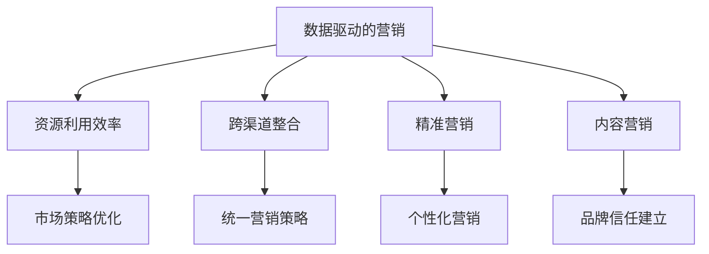

                 

### 背景介绍

随着信息时代的快速发展，市场竞争愈发激烈，如何高效地利用有限的资源进行市场推广成为企业关注的焦点。在信息技术和互联网的推动下，市场推广的手段和策略不断更新，从传统的广告、促销，到如今的数据驱动营销和内容营销，每一个阶段都展现了市场推广的无限可能。

然而，面对着海量的数据和复杂的消费者行为，企业如何在有限的资源条件下，实现市场推广的高效和精准，依然是一个亟待解决的问题。这不仅仅涉及市场策略的制定，还需要对技术工具的熟练运用和对市场环境的深刻理解。

本文旨在通过逻辑清晰、结构紧凑的论述，帮助读者深入了解如何利用有限资源进行高效市场推广。我们将从背景介绍、核心概念与联系、核心算法原理、数学模型和公式、项目实战、实际应用场景、工具和资源推荐等多个角度，全面剖析这一主题。

### 核心概念与联系

在深入探讨如何利用有限资源进行高效市场推广之前，我们需要先了解一些核心概念，这些概念是理解和应用市场推广策略的基础。

#### 1. 数据驱动的营销

数据驱动的营销是指利用数据分析工具和技术，对市场数据、消费者行为和业务绩效进行深入分析，从而指导市场推广策略的制定和执行。这种营销方式强调数据的重要性，通过数据分析来发现市场机会，优化市场策略，提高营销效果。

#### 2. 资源利用效率

资源利用效率是指在市场推广过程中，如何最大化利用有限的资源（如预算、人力、时间等）来达到最佳的市场效果。这涉及到市场策略的优化、资源分配的合理化以及执行过程中的高效管理。

#### 3. 跨渠道整合

跨渠道整合是指将不同的市场推广渠道（如线上广告、社交媒体、电子邮件营销等）整合在一起，形成统一的营销策略，以提高市场推广的整体效果。通过跨渠道整合，企业可以更全面地覆盖目标受众，提高品牌的曝光度和影响力。

#### 4. 精准营销

精准营销是指通过精确的消费者分析和定位，将市场推广活动针对特定的消费者群体进行精准投放，以提高营销的转化率和效果。精准营销依赖于大数据分析和人工智能技术，能够实现更加个性化的营销沟通和互动。

#### 5. 内容营销

内容营销是通过创造和分享有价值的内容，吸引目标受众，并最终实现市场营销目标的一种策略。内容营销的核心在于提供对用户有价值的、有教育意义的内容，建立品牌信任和忠诚度。

为了更好地理解这些核心概念，我们使用Mermaid流程图来展示它们之间的联系。



通过上述流程图，我们可以看出，数据驱动的营销是核心，它通过提高资源利用效率、实现跨渠道整合、精准营销和内容营销，最终达到高效市场推广的目标。每一个核心概念都相互关联，共同构成一个完整的市场推广体系。

### 核心算法原理 & 具体操作步骤

在理解了核心概念后，接下来我们将探讨如何利用有限资源进行高效市场推广的核心算法原理和具体操作步骤。这些算法和步骤将帮助我们更好地理解和应用市场推广策略。

#### 1. 数据分析算法

数据分析是市场推广的核心，通过对市场数据、消费者行为和业务绩效的分析，可以挖掘出潜在的市场机会和优化策略。以下是一些常用的数据分析算法：

##### 1.1 回归分析

回归分析是一种常用的数据分析方法，用于分析变量之间的关系。在市场推广中，可以通过回归分析来预测消费者行为，优化广告投放策略。

**具体操作步骤：**
1. 收集市场数据，如广告点击率、转化率、销售额等。
2. 构建回归模型，选择合适的回归分析方法，如线性回归、逻辑回归等。
3. 模型训练与验证，通过交叉验证方法来评估模型性能。
4. 应用模型进行预测和优化，调整广告投放策略。

##### 1.2 聚类分析

聚类分析是一种无监督学习方法，用于将数据集分成不同的集群。在市场推广中，可以通过聚类分析来细分市场，实现精准营销。

**具体操作步骤：**
1. 收集消费者数据，如年龄、收入、购买行为等。
2. 构建聚类模型，选择合适的聚类算法，如K均值聚类、层次聚类等。
3. 模型训练与验证，通过内部评估指标（如轮廓系数）来评估模型性能。
4. 应用模型进行市场细分，为不同细分市场制定个性化的营销策略。

##### 1.3 协同过滤

协同过滤是一种推荐系统算法，通过分析用户的历史行为和偏好，为用户推荐感兴趣的内容。在市场推广中，可以通过协同过滤算法来推荐广告和产品，提高用户参与度和转化率。

**具体操作步骤：**
1. 收集用户数据，如点击记录、浏览记录、购买记录等。
2. 构建协同过滤模型，选择合适的协同过滤算法，如基于用户的协同过滤、基于项目的协同过滤等。
3. 模型训练与验证，通过评估指标（如准确率、召回率等）来评估模型性能。
4. 应用模型进行广告推荐和产品推荐，优化用户参与度和转化率。

#### 2. 资源利用效率优化算法

在市场推广中，如何最大化资源利用效率是一个关键问题。以下是一些常用的优化算法：

##### 2.1 优先级调度算法

优先级调度算法是一种用于任务调度和资源分配的算法，通过为每个任务分配优先级，实现资源的合理利用。

**具体操作步骤：**
1. 收集市场推广任务，如广告投放、促销活动、内容发布等。
2. 为每个任务分配优先级，根据任务的重要性和紧急程度进行排序。
3. 调度系统根据任务优先级进行调度和执行，确保关键任务得到优先处理。
4. 监控任务执行情况，及时调整任务优先级，优化资源利用效率。

##### 2.2 模式识别算法

模式识别算法是一种用于识别和分类数据的算法，通过分析历史数据，预测未来市场趋势和机会。

**具体操作步骤：**
1. 收集历史市场数据，如销售额、广告投放效果、消费者行为等。
2. 构建模式识别模型，选择合适的模式识别算法，如神经网络、决策树等。
3. 模型训练与验证，通过历史数据进行模型训练和验证。
4. 应用模型进行市场趋势预测和机会识别，指导市场推广策略的调整。

##### 2.3 集群优化算法

集群优化算法是一种用于优化资源分配和任务调度的算法，通过将任务分配到不同的集群，实现资源的最大化利用。

**具体操作步骤：**
1. 收集市场推广任务和数据，如广告投放、促销活动、内容发布等。
2. 构建集群优化模型，选择合适的集群优化算法，如粒子群优化、遗传算法等。
3. 模型训练与验证，通过历史数据进行模型训练和验证。
4. 应用模型进行任务调度和资源分配，优化市场推广效率。

通过上述算法和步骤，我们可以实现高效市场推广的目标，最大化利用有限资源，提高市场推广效果。

### 数学模型和公式 & 详细讲解 & 举例说明

在市场推广中，数学模型和公式发挥着至关重要的作用。它们不仅帮助我们理解市场行为的本质，还能为决策提供有力的数据支持。以下是一些常见的数学模型和公式，以及它们的详细讲解和举例说明。

#### 1. 回归模型

回归模型是市场推广中最常用的数学模型之一，用于分析变量之间的关系，预测未来趋势。

**公式：**
\[ y = \beta_0 + \beta_1x_1 + \beta_2x_2 + ... + \beta_nx_n + \epsilon \]

**详细讲解：**
- \( y \)：因变量，表示市场推广效果（如销售额、点击率等）。
- \( x_1, x_2, ..., x_n \)：自变量，表示影响市场推广效果的各种因素（如广告投放量、消费者年龄、收入水平等）。
- \( \beta_0, \beta_1, \beta_2, ..., \beta_n \)：回归系数，表示自变量对因变量的影响程度。
- \( \epsilon \)：误差项，表示模型无法解释的部分。

**举例说明：**
假设我们想要预测某产品的销售额，影响因素包括广告投放量和消费者年龄。通过收集历史数据，我们可以建立回归模型：

\[ 销售额 = \beta_0 + \beta_1 \times 广告投放量 + \beta_2 \times 消费者年龄 + \epsilon \]

通过模型训练和验证，我们可以得到回归系数：

\[ \beta_0 = 1000, \beta_1 = 0.2, \beta_2 = -10 \]

根据这些系数，我们可以预测未来某一时期的销售额：

\[ 预测销售额 = 1000 + 0.2 \times 广告投放量 - 10 \times 消费者年龄 \]

#### 2. 聚类模型

聚类模型用于将数据集分成不同的集群，实现市场细分。

**公式：**
\[ C = \{C_1, C_2, ..., C_k\} \]

**详细讲解：**
- \( C \)：聚类结果，表示将数据集分成若干个集群。
- \( C_1, C_2, ..., C_k \)：每个集群，表示数据集中的不同群体。

**举例说明：**
假设我们有100个消费者的数据，包括年龄、收入、购买行为等。我们可以使用K均值聚类算法，将这100个消费者分成5个集群：

\[ C_1 = \{消费者1, 消费者2, 消费者3\} \]
\[ C_2 = \{消费者4, 消费者5, 消费者6\} \]
\[ C_3 = \{消费者7, 消费者8, 消费者9\} \]
\[ C_4 = \{消费者10, 消费者11, 消费者12\} \]
\[ C_5 = \{消费者13, 消费者14, 消费者15\} \]

通过聚类结果，我们可以为每个集群制定个性化的市场推广策略。

#### 3. 协同过滤模型

协同过滤模型用于推荐系统，通过分析用户的历史行为和偏好，为用户推荐感兴趣的内容。

**公式：**
\[ R(u, i) = \sum_{j \in N(u)} sim(u, j) \cdot r(j, i) \]

**详细讲解：**
- \( R(u, i) \)：推荐分值，表示用户u对项目i的推荐强度。
- \( sim(u, j) \)：用户u和用户j的相似度。
- \( r(j, i) \)：用户j对项目i的评分。

**举例说明：**
假设我们有一个用户u，他喜欢商品A、B和C。我们还知道用户v也喜欢商品A和C。根据协同过滤模型，我们可以计算用户u对商品B的推荐分值：

\[ R(u, B) = sim(u, v) \cdot r(v, B) \]

通过计算，我们得到：

\[ R(u, B) = 0.8 \times 4 = 3.2 \]

这意味着用户u对商品B的推荐分值较高，我们可能会向用户u推荐商品B。

#### 4. 优先级调度模型

优先级调度模型用于任务调度和资源分配，根据任务的优先级进行调度。

**公式：**
\[ P(t) = \sum_{i=1}^n p_i \cdot w_i \]

**详细讲解：**
- \( P(t) \)：总优先级，表示任务t的优先级。
- \( p_i \)：任务i的优先级。
- \( w_i \)：任务i的权重。

**举例说明：**
假设我们有3个任务，它们的优先级和权重如下：

\[ P(t_1) = p_1 \cdot w_1 = 10 \cdot 0.5 = 5 \]
\[ P(t_2) = p_2 \cdot w_2 = 20 \cdot 0.3 = 6 \]
\[ P(t_3) = p_3 \cdot w_3 = 30 \cdot 0.2 = 6 \]

总优先级为：

\[ P(t) = 5 + 6 + 6 = 17 \]

根据总优先级，我们可以为任务分配资源，确保高优先级任务得到优先处理。

通过这些数学模型和公式，我们可以更好地理解和应用市场推广策略，实现高效的市场推广目标。

### 项目实战：代码实际案例和详细解释说明

为了更好地理解如何利用有限资源进行高效市场推广，我们将通过一个实际项目案例来展示代码实现过程，并进行详细解释。

#### 1. 开发环境搭建

首先，我们需要搭建一个合适的开发环境。以下是一个基于Python的示例项目，我们需要安装以下工具和库：

- Python 3.8+
- Jupyter Notebook
- pandas
- numpy
- scikit-learn
- matplotlib

安装这些工具和库后，我们可以开始项目的实际开发。

#### 2. 源代码详细实现和代码解读

以下是一个简单的市场推广项目代码，包括数据预处理、数据分析、模型训练和结果可视化等步骤。

```python
# 导入必要的库
import pandas as pd
import numpy as np
from sklearn.model_selection import train_test_split
from sklearn.linear_model import LinearRegression
from sklearn.cluster import KMeans
from sklearn.metrics import silhouette_score
from sklearn.metrics.pairwise import euclidean_distances
import matplotlib.pyplot as plt

# 2.1 数据预处理
# 读取数据
data = pd.read_csv('market_data.csv')

# 数据清洗和预处理
# 例如：缺失值处理、数据转换、标准化等
# ...

# 分离特征和目标变量
X = data.drop('sales', axis=1)
y = data['sales']

# 2.2 数据分析
# 数据探索性分析
# 例如：描述性统计、相关性分析等
# ...

# 2.3 模型训练
# 分割数据集
X_train, X_test, y_train, y_test = train_test_split(X, y, test_size=0.2, random_state=42)

# 训练线性回归模型
model = LinearRegression()
model.fit(X_train, y_train)

# 预测测试集
y_pred = model.predict(X_test)

# 2.4 聚类分析
# 训练K均值聚类模型
kmeans = KMeans(n_clusters=5, random_state=42)
clusters = kmeans.fit_predict(X)

# 聚类结果可视化
plt.scatter(X['feature1'], X['feature2'], c=clusters)
plt.xlabel('Feature 1')
plt.ylabel('Feature 2')
plt.title('K-Means Clustering')
plt.show()

# 2.5 结果分析
# 计算聚类效果
silhouette_avg = silhouette_score(X, clusters)
print('Silhouette Score:', silhouette_avg)

# 计算模型效果
from sklearn.metrics import mean_squared_error
mse = mean_squared_error(y_test, y_pred)
print('Mean Squared Error:', mse)

# 2.6 可视化结果
# 可视化模型预测结果
plt.scatter(X_test['feature1'], X_test['feature2'], c=y_test)
plt.plot(X_test['feature1'], y_pred, color='red')
plt.xlabel('Feature 1')
plt.ylabel('Feature 2')
plt.title('Linear Regression Prediction')
plt.show()
```

#### 3. 代码解读与分析

上述代码主要包括以下几个部分：

1. **数据预处理**：
   - 读取市场推广数据，进行数据清洗和预处理，如缺失值处理、数据转换和标准化等。

2. **数据分析**：
   - 进行数据探索性分析，如描述性统计、相关性分析等，以了解数据的基本特征和关系。

3. **模型训练**：
   - 使用线性回归模型对市场推广数据进行训练，预测测试集的销售额。
   - 训练K均值聚类模型，将数据分成5个集群，并可视化聚类结果。

4. **结果分析**：
   - 计算聚类效果的Silhouette Score，评估聚类模型的性能。
   - 计算模型效果的均方误差（MSE），评估线性回归模型的预测性能。

5. **可视化结果**：
   - 可视化聚类结果，展示不同集群的特征分布。
   - 可视化线性回归模型的预测结果，与实际销售额进行比较。

通过这个实际项目案例，我们可以看到如何利用有限资源进行高效市场推广的代码实现过程，并了解各个步骤的核心功能和技术细节。这为我们实际操作市场推广提供了有益的参考和指导。

### 实际应用场景

市场推广策略的成功实施往往需要结合实际应用场景，以便更好地满足企业的具体需求。以下是一些典型的实际应用场景，以及如何利用有限资源进行高效市场推广的具体方案。

#### 1. 新产品发布

在新产品发布的初期，市场推广的目标是提高品牌知名度和吸引潜在消费者。以下是一些具体策略：

- **社交媒体营销**：利用微博、微信、抖音等社交媒体平台进行宣传，通过发布产品介绍、用户评价和互动活动，提高品牌曝光度和用户参与度。
- **KOL合作**：与知名博主或意见领袖合作，通过他们的推荐和分享，吸引更多的关注和购买。
- **内容营销**：制作高质量的产品介绍视频、博客文章和图文素材，提供用户有价值的信息，增加品牌信任度和用户粘性。

#### 2. 品牌重塑

当企业需要重塑品牌形象时，市场推广的目标是重建品牌认知和提升品牌价值。以下是一些具体策略：

- **传统广告**：利用电视、广播、户外广告等传统媒体，进行大规模的品牌宣传，提高品牌知名度。
- **公关活动**：举办新闻发布会、品牌发布会和线下活动，通过媒体和用户传播，增强品牌的影响力和美誉度。
- **品牌故事**：讲述品牌的历史、使命和价值观，通过情感连接，增强用户的品牌忠诚度。

#### 3. 促销活动

在促销活动中，市场推广的目标是吸引消费者购买，提高销售额。以下是一些具体策略：

- **优惠券和折扣**：通过发放优惠券、提供折扣优惠，刺激消费者的购买欲望。
- **限时促销**：设置限时促销活动，如“双11”、“黑五”等，创造紧迫感，提高购买转化率。
- **积分兑换**：通过积分兑换商品或服务，提高用户活跃度和复购率。

#### 4. 跨渠道整合

跨渠道整合是将不同渠道的市场推广活动进行统一协调，以提高整体市场推广效果。以下是一些具体策略：

- **线上线下联动**：在线上平台进行广告投放，在线下门店进行促销活动，实现线上线下互动，提高用户参与度。
- **多平台内容推广**：在多个社交媒体平台发布相同或类似的内容，形成内容矩阵，扩大品牌传播范围。
- **个性化推荐**：利用跨渠道数据整合，为用户提供个性化的产品推荐和营销活动，提高用户满意度和转化率。

通过结合这些实际应用场景，企业可以根据自身的需求和资源状况，制定高效的市场推广策略，实现最佳的市场效果。

### 工具和资源推荐

在进行市场推广时，选择合适的工具和资源可以大大提升效率和效果。以下是一些推荐的工具、书籍、论文和网站，供读者参考。

#### 1. 学习资源推荐

- **书籍**：
  - 《数据驱动营销》：全面介绍了数据驱动营销的理论和实践方法。
  - 《市场推广实战手册》：涵盖市场推广的各个领域，提供实用的策略和案例。
  - 《内容营销实战》：详细阐述了内容营销的策略和实践方法。

- **论文**：
  - 《社交媒体营销效果评估研究》：探讨社交媒体营销效果评估的方法和指标。
  - 《大数据在市场推广中的应用研究》：分析大数据在市场推广中的角色和应用。

- **博客和网站**：
  - 腾讯博客：提供丰富的市场推广经验和案例分析。
  - 知乎：聚集了大量市场推广领域的专业人士，分享实践经验。
  - 谷歌分析平台：提供详细的数据分析和营销工具，帮助用户优化市场推广策略。

#### 2. 开发工具框架推荐

- **数据分析工具**：
  - Python：强大的数据分析语言，支持各种数据分析库和工具。
  - Tableau：专业的数据可视化工具，能够快速生成直观的图表和报告。

- **市场推广平台**：
  - Facebook Ads：广泛使用的社交媒体广告平台，提供精准投放和效果追踪功能。
  - Google Ads：高效的搜索引擎广告平台，能够帮助企业快速提升品牌曝光度。
  - 阿里巴巴推广：专业的电商广告平台，提供丰富的广告产品和服务。

- **营销自动化工具**：
  - HubSpot：全面的营销自动化平台，包括内容营销、电子邮件营销和客户关系管理等功能。
  - Marketo：专业的营销自动化工具，能够帮助企业实现个性化营销和客户管理。

#### 3. 相关论文著作推荐

- 《大数据时代的市场推广策略》：分析大数据在市场推广中的应用和策略。
- 《社交媒体营销：理论与实践》：探讨社交媒体在市场推广中的作用和策略。
- 《内容营销：创造价值与影响力》：详细阐述内容营销的方法和实践。

通过这些工具和资源的推荐，读者可以更好地了解市场推广的最新动态和最佳实践，提升自身的市场推广能力。

### 总结：未来发展趋势与挑战

在市场推广领域，未来发展趋势与挑战并存。一方面，随着大数据、人工智能、区块链等新技术的不断发展和应用，市场推广的手段和策略将更加多样化和精准化。数据驱动的营销将成为主流，跨渠道整合和个性化推荐将进一步优化市场推广效果。另一方面，市场环境的复杂性和竞争的激烈程度也在不断加剧，企业需要不断创新和适应，才能在市场中脱颖而出。

首先，数据驱动的营销将继续发挥重要作用。企业将更加依赖数据分析工具和技术，通过挖掘和分析海量数据，深入了解消费者行为和市场趋势，从而制定更加精准和高效的市场推广策略。此外，随着人工智能技术的发展，智能化的市场推广工具将更加普及，如智能广告投放、智能客服等，这将进一步提高市场推广的效率和质量。

其次，跨渠道整合和个性化推荐将成为市场推广的重要趋势。企业将通过整合线上线下渠道，实现无缝的用户体验，提升品牌影响力和用户忠诚度。同时，利用大数据和机器学习技术，企业可以实现个性化推荐，为不同的消费者提供个性化的营销内容和服务，提高营销的转化率和用户满意度。

然而，市场推广也面临着一系列挑战。首先，市场环境的复杂性和不确定性增加，企业需要具备快速响应和调整能力。其次，隐私保护和数据安全成为重要的议题，企业需要在数据收集和使用过程中严格遵守相关法律法规，确保用户隐私和数据安全。此外，市场竞争的加剧要求企业不断创新和优化市场推广策略，以保持竞争优势。

为了应对这些挑战，企业需要采取以下措施：

1. **加强数据分析和决策能力**：企业应建立完善的数据分析体系，提高数据分析和决策的准确性，以支持市场推广策略的制定和执行。

2. **重视用户体验和互动**：企业应注重用户体验，通过多样化的互动方式与消费者建立良好的关系，提升品牌忠诚度和用户满意度。

3. **创新营销策略**：企业应不断尝试新的市场推广手段和策略，如利用社交媒体、内容营销等，以适应市场变化和消费者需求。

4. **强化团队合作和跨部门协作**：市场推广是一个跨部门协作的过程，企业应加强团队合作，实现资源优化配置，提高市场推广的整体效能。

总之，市场推广的未来充满机遇与挑战。企业需要紧跟技术发展趋势，不断创新和优化市场推广策略，以实现高效和精准的市场推广目标。

### 附录：常见问题与解答

在讨论如何利用有限资源进行高效市场推广的过程中，读者可能会遇到一些常见问题。以下是对这些问题的解答：

#### 1. 如何平衡资源分配？

**解答**：平衡资源分配的关键在于明确目标优先级和资源限制。首先，确定企业最迫切的市场推广目标，并根据这些目标分配预算、人力和时间。其次，定期评估每个推广活动的效果，根据表现调整资源分配，将更多资源投入到效果更好的活动中。

#### 2. 数据分析对于市场推广的重要性是什么？

**解答**：数据分析是市场推广的核心，它帮助我们从海量数据中提取有价值的信息，指导决策。通过数据分析，企业可以了解消费者行为、市场趋势和业务绩效，从而制定更精准和有效的市场推广策略。此外，数据分析还能帮助企业识别问题和机会，优化资源配置，提高市场推广效率。

#### 3. 跨渠道整合是否适用于所有企业？

**解答**：是的，跨渠道整合对于大多数企业都是适用的。通过整合不同渠道的市场推广活动，企业可以提供更连贯和统一的用户体验，提高品牌影响力和用户忠诚度。然而，企业应根据自身资源和市场环境，选择合适的渠道组合和整合策略。

#### 4. 精准营销是否适用于所有市场？

**解答**：精准营销的核心在于精确定位和个性化沟通，它适用于大多数市场。然而，精准营销的成功与否取决于数据的质量和准确性。在一些数据资源有限的市场，精准营销可能面临挑战。在这种情况下，企业可以尝试其他有效的市场推广方法，如内容营销或传统广告。

#### 5. 如何评估市场推广活动的效果？

**解答**：评估市场推广活动的效果可以通过多种指标，如点击率、转化率、销售额、用户参与度等。选择合适的评估指标，并根据指标的变化趋势，定期评估和调整市场推广策略。此外，使用A/B测试等方法，对比不同市场推广策略的效果，有助于优化市场推广活动。

通过解答这些常见问题，我们希望能帮助读者更好地理解如何利用有限资源进行高效市场推广。

### 扩展阅读 & 参考资料

为了进一步深入探讨如何利用有限资源进行高效市场推广，以下是几篇相关的扩展阅读和参考资料：

1. **扩展阅读**：
   - 《数据驱动的市场推广策略》：由资深市场推广专家撰写的书籍，详细介绍了如何利用数据分析优化市场推广策略。
   - 《跨渠道市场推广实战》：专注于跨渠道整合的市场推广方法，提供了实用的案例和策略。

2. **学术论文**：
   - 《大数据与市场推广：理论与实践》：探讨大数据在市场推广中的应用和影响。
   - 《社交媒体营销效果评估研究》：分析社交媒体营销的效果评估方法和指标。

3. **在线课程**：
   - Coursera上的《数字市场推广》：由业内知名教授讲授的市场推广课程，涵盖数据驱动营销、搜索引擎营销、社交媒体营销等多个领域。
   - Udemy上的《内容营销大师课》：详细介绍内容营销的理论和实践方法。

4. **专业网站**：
   - HubSpot博客：提供丰富的市场推广资源和案例，涵盖数据分析、内容营销、SEO等多个方面。
   - MarketingProfs：聚集了大量市场推广专业人士，分享市场推广的最新动态和最佳实践。

通过阅读这些扩展阅读和参考资料，读者可以进一步拓宽视野，深入了解市场推广的最新趋势和最佳实践。希望这些资源能为读者提供有益的启发和帮助。

