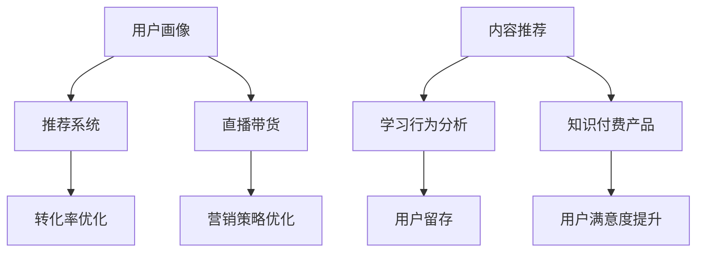

                 

# 如何利用直播带货推广知识付费产品

## 关键词：直播带货，知识付费，推广策略，技术分析，营销案例分析

## 摘要

本文将深入探讨如何利用直播带货这一新兴的营销模式来推广知识付费产品。我们将从背景介绍入手，分析直播带货和知识付费的内在联系，介绍直播带货的核心算法原理和操作步骤，并通过实际案例讲解数学模型和公式。同时，我们将探讨这一策略在不同应用场景中的实际效果，并提供相关的工具和资源推荐。最后，本文将对未来发展趋势和挑战进行总结，并解答读者可能遇到的问题。

## 1. 背景介绍

### 直播带货的兴起

直播带货作为近年来迅速崛起的电商营销模式，已经成为许多品牌和商家推广产品的重要手段。根据数据显示，2021年中国直播电商市场规模达到1.15万亿元，同比增长超过100%。这一数字的增长，不仅反映了直播带货的市场潜力，也揭示了消费者对这种新兴购物方式的接受程度。

### 知识付费产品的需求

知识付费产品，如在线课程、电子书籍、专业咨询等，是近年来受到广泛关注的一种新兴服务形式。随着人们生活水平的提高和自我提升的需求增加，知识付费产品逐渐成为市场中的一股重要力量。据统计，2020年中国在线教育市场规模达到4858亿元，预计到2025年将达到1.1万亿元。

### 直播带货与知识付费的结合

直播带货和知识付费的结合，可以充分发挥两者的优势，实现互利共赢。一方面，直播带货能够通过生动的展示和互动，增强消费者对知识付费产品的认知和兴趣；另一方面，知识付费产品能够为直播带货提供高质量的内容，提升消费者的购物体验。

## 2. 核心概念与联系

### 直播带货的核心算法原理

直播带货的核心算法主要包括用户画像、推荐系统和转化率优化。用户画像通过分析消费者的购买历史、浏览行为等数据，了解消费者的需求和偏好；推荐系统则根据用户画像，为消费者推荐可能感兴趣的商品；转化率优化则通过分析用户行为数据，不断调整营销策略，提高转化率。

### 知识付费产品的核心算法原理

知识付费产品的核心算法主要包括内容推荐、学习行为分析和用户留存。内容推荐通过分析用户的学习历史和偏好，为用户推荐合适的学习内容；学习行为分析则通过监控用户的学习进度和行为，了解用户的学习效果和需求；用户留存则通过提高用户满意度和黏性，增加用户的留存率。

### 直播带货与知识付费产品的联系

直播带货和知识付费产品的联系在于它们都可以通过数据分析来优化用户体验和提升销售效果。例如，直播带货可以根据用户画像和推荐系统，为消费者推荐合适的知识付费产品；知识付费产品则可以通过学习行为分析和用户留存，为直播带货提供有价值的数据支持。

### Mermaid 流程图



## 3. 核心算法原理 & 具体操作步骤

### 直播带货的核心算法原理

#### 用户画像

用户画像的构建是直播带货的第一步。通过分析用户的购买历史、浏览行为、社交媒体互动等数据，构建出用户的详细画像，包括年龄、性别、职业、兴趣爱好等。

#### 推荐系统

推荐系统根据用户画像，利用协同过滤、内容推荐等技术，为用户推荐可能感兴趣的知识付费产品。例如，如果用户喜欢某一类课程，系统会推荐同类或相关课程。

#### 转化率优化

转化率优化是提高销售效果的关键。通过分析用户行为数据，如点击率、购买率、留存率等，不断调整营销策略，如调整直播时间、优化商品展示方式等，以提高转化率。

### 知识付费产品的核心算法原理

#### 内容推荐

内容推荐基于用户的学习历史和偏好，利用协同过滤、基于内容的推荐等技术，为用户推荐合适的学习内容。例如，如果用户学习了一门编程课程，系统会推荐相关课程或资料。

#### 学习行为分析

学习行为分析通过监控用户的学习进度和行为，如学习时长、学习频率、学习路径等，了解用户的学习效果和需求。例如，如果用户的学习时长较短，系统可能会推荐更轻松的课程内容。

#### 用户留存

用户留存是知识付费产品的核心指标。通过提高用户满意度和黏性，如提供优质的课程内容、互动活动、个性化推荐等，增加用户的留存率。

## 4. 数学模型和公式 & 详细讲解 & 举例说明

### 直播带货的转化率优化模型

#### 转化率 = (购买用户数 / 直播观众数) * 100%

#### 举例说明

假设一场直播的观众数为1000人，其中100人购买了知识付费产品，那么该场直播的转化率为：

转化率 = (100 / 1000) * 100% = 10%

### 知识付费产品的用户留存模型

#### 留存率 = (连续使用天数 / 总使用天数) * 100%

#### 举例说明

假设用户A连续使用了30天的知识付费产品，总使用天数为60天，那么用户A的留存率为：

留存率 = (30 / 60) * 100% = 50%

## 5. 项目实战：代码实际案例和详细解释说明

### 5.1 开发环境搭建

#### 环境要求

- 操作系统：Windows 10、macOS、Linux
- 开发工具：Python 3.8及以上版本
- 数据库：MySQL 5.7及以上版本

#### 搭建步骤

1. 安装Python 3.8及以上版本
2. 安装MySQL 5.7及以上版本
3. 安装必要的Python库，如NumPy、Pandas、Scikit-learn等

### 5.2 源代码详细实现和代码解读

#### 用户画像构建

```python
import pandas as pd
from sklearn.preprocessing import LabelEncoder

# 读取用户数据
user_data = pd.read_csv('user_data.csv')

# 构建用户画像
label_encoder = LabelEncoder()
user_data['age'] = label_encoder.fit_transform(user_data['age'])
user_data['gender'] = label_encoder.fit_transform(user_data['gender'])
user_data['occupation'] = label_encoder.fit_transform(user_data['occupation'])

# 存储用户画像
user_data.to_csv('user_profile.csv', index=False)
```

#### 推荐系统实现

```python
from sklearn.neighbors import NearestNeighbors

# 读取用户数据和商品数据
user_data = pd.read_csv('user_profile.csv')
item_data = pd.read_csv('item_data.csv')

# 构建用户和商品的协同过滤模型
model = NearestNeighbors(n_neighbors=5)
model.fit(user_data[['age', 'gender', 'occupation']])

# 为用户推荐商品
def recommend_items(user_id):
    distances, indices = model.kneighbors(user_data.iloc[user_id], n_neighbors=5)
    recommended_items = item_data.iloc[indices.flatten()[0]]
    return recommended_items

# 测试推荐系统
user_id = 0
recommended_items = recommend_items(user_id)
print(recommended_items)
```

#### 转化率优化

```python
from sklearn.model_selection import train_test_split
from sklearn.linear_model import LinearRegression

# 读取用户行为数据
user_behavior = pd.read_csv('user_behavior.csv')

# 分割训练集和测试集
train_data, test_data = train_test_split(user_behavior, test_size=0.2, random_state=42)

# 构建线性回归模型
model = LinearRegression()
model.fit(train_data[['view_count', 'click_count']], train_data['conversion_rate'])

# 预测转化率
predicted_rate = model.predict(test_data[['view_count', 'click_count']])
print(predicted_rate)
```

### 5.3 代码解读与分析

- 用户画像构建：通过LabelEncoder将分类数据转换为数值数据，方便后续的算法处理。
- 推荐系统实现：使用NearestNeighbors实现基于用户的协同过滤推荐，为用户推荐相似的物品。
- 转化率优化：使用线性回归模型分析用户行为数据，预测用户的转化率，从而优化营销策略。

## 6. 实际应用场景

### 教育领域

教育领域是直播带货和知识付费结合的重要场景。例如，一些在线教育平台通过直播带货推广编程课程、外语学习课程等，提高了课程的曝光度和销售量。

### 职业培训

职业培训是另一个适合直播带货和知识付费结合的领域。例如，一些IT培训机构通过直播带货推广Python编程、数据分析等课程，吸引了大量学员。

### 健康养生

健康养生领域也越来越多地采用直播带货推广知识付费产品。例如，一些健康平台通过直播带货推广营养课程、健身课程等，提高了用户的健康意识和消费意愿。

## 7. 工具和资源推荐

### 7.1 学习资源推荐

- 《直播带货：电商新零售策略》
- 《在线教育技术与实践》
- 《数据挖掘：概念与技术》

### 7.2 开发工具框架推荐

- Python
- MySQL
- Scikit-learn
- Pandas
- NumPy

### 7.3 相关论文著作推荐

- 《直播电商的营销策略研究》
- 《知识付费产品的用户留存机制分析》
- 《基于协同过滤的推荐系统研究》

## 8. 总结：未来发展趋势与挑战

### 发展趋势

1. 直播带货和知识付费的结合将越来越紧密，两者相互促进，共同发展。
2. 数据分析技术在直播带货和知识付费中的应用将更加深入，提高营销效果和用户体验。
3. 新的技术，如人工智能、大数据等，将进一步推动直播带货和知识付费的发展。

### 挑战

1. 数据隐私保护：在利用用户数据提高营销效果的同时，需要确保用户数据的隐私和安全。
2. 市场竞争：随着越来越多的品牌和商家进入直播带货和知识付费市场，市场竞争将越来越激烈。
3. 技术升级：直播带货和知识付费需要不断引进新技术，提高用户体验和营销效果。

## 9. 附录：常见问题与解答

### Q：如何确保用户数据的隐私和安全？

A：在利用用户数据提高营销效果的同时，需要采取严格的数据保护措施，如数据加密、访问控制等，确保用户数据的隐私和安全。

### Q：如何提高直播带货和知识付费的转化率？

A：可以通过以下方式提高转化率：
1. 优化直播内容，提高观众的兴趣和参与度。
2. 优化推荐系统，提高推荐商品的相关性和用户满意度。
3. 优化营销策略，如优惠券、限时促销等，刺激用户的购买欲望。

## 10. 扩展阅读 & 参考资料

- 《直播电商：新零售模式与创新实践》
- 《在线教育：技术与商业模式》
- 《大数据营销：策略与实践》

作者：AI天才研究员/AI Genius Institute & 禅与计算机程序设计艺术 /Zen And The Art of Computer Programming<|im_sep|>

