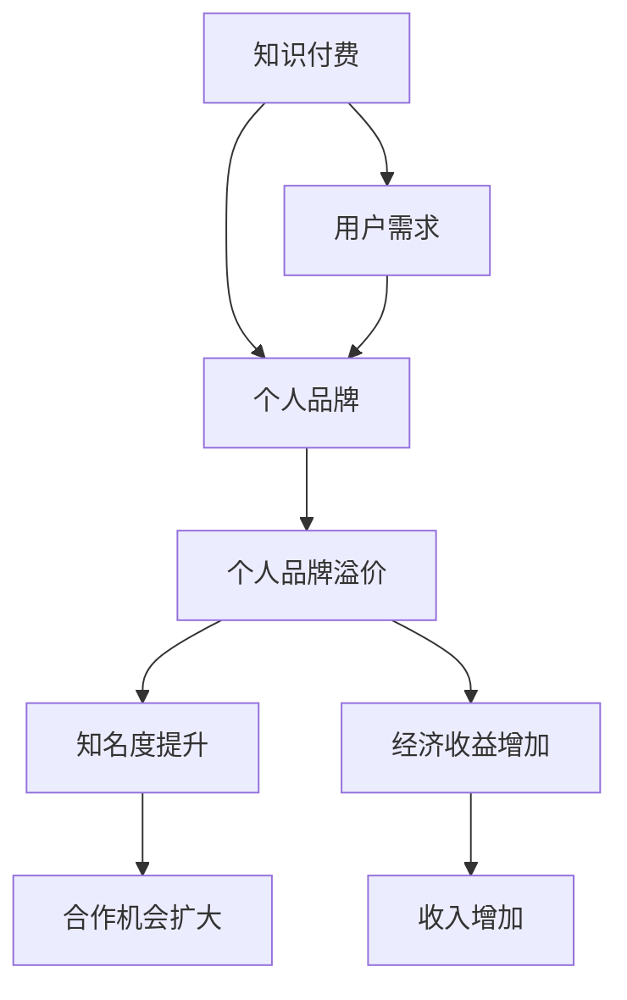

                 

### 1. 背景介绍

在当今数字化时代，知识付费已成为一个日益繁荣的产业。人们愿意为有价值、高质量的知识内容支付费用，以获得更多的知识和技能。知识付费不仅满足了个体对于学习的需求，也为内容创作者提供了新的变现途径。在这个过程中，个人品牌溢价显得尤为重要。

个人品牌溢价是指个人通过建立自己的专业形象和影响力，从而提高其知识产品的市场价值。这不仅仅是通过知识付费实现经济收益，更是实现个人价值和影响力的提升。那么，如何利用知识付费实现个人品牌溢价呢？这是本文将要探讨的核心问题。

本文将首先介绍知识付费的背景和现状，分析个人品牌溢价的概念和重要性。随后，我们将探讨如何通过知识付费来塑造个人品牌，提高个人知名度与影响力。接着，我们将深入分析利用知识付费实现品牌溢价的具体策略和方法，并给出实际案例进行说明。最后，我们将讨论知识付费在个人品牌建设中的未来趋势和挑战。

通过本文的阅读，您将了解到：

- 知识付费的兴起及其对个人品牌建设的影响；
- 个人品牌溢价的概念及其重要性；
- 利用知识付费塑造个人品牌的策略与方法；
- 实际案例中的成功经验和教训；
- 知识付费在个人品牌建设中的未来发展方向与挑战。

### 2. 核心概念与联系

在深入探讨如何利用知识付费实现个人品牌溢价之前，我们需要明确几个核心概念，并了解它们之间的联系。

#### 2.1 知识付费

知识付费指的是消费者为获取有价值的信息、知识和技能而支付的费用。这种模式在数字化时代得到了极大的发展，主要体现在以下几个方面：

- **内容形式多样化**：知识付费的内容形式多样，包括线上课程、电子书、在线讲座、直播课程等；
- **平台化运营**：以知识付费为代表的平台，如Coursera、Udemy、知乎Live等，为内容创作者和消费者提供了便捷的交易渠道；
- **用户需求驱动**：知识付费满足了消费者对专业知识的渴求，特别是那些希望通过学习提升职业技能、解决实际问题的人群。

#### 2.2 个人品牌溢价

个人品牌溢价是指个人通过建立自己的专业形象和影响力，使其知识产品的市场价值高于普通水平。具体表现为：

- **知名度提升**：个人品牌溢价使得个人在行业内获得更高的知名度，更容易吸引潜在客户；
- **影响力扩大**：个人品牌溢价扩大了个人在行业内的社会影响力，有助于建立人脉关系和合作机会；
- **经济收益增加**：个人品牌溢价直接增加了知识产品的销售收入，提升了个人经济收益。

#### 2.3 知识付费与个人品牌溢价的关系

知识付费与个人品牌溢价之间存在紧密的关系，两者相辅相成。具体表现在以下几个方面：

- **知识付费是个人品牌溢价的基础**：通过知识付费，个人可以积累大量的用户反馈和口碑，从而提升个人知名度和影响力；
- **个人品牌溢价是知识付费的附加值**：个人品牌溢价使得知识付费产品在市场上具有更高的竞争力和吸引力，从而提高销售量和收益；
- **知识付费与个人品牌溢价相互促进**：个人品牌溢价可以吸引更多的知识付费用户，反过来，大量的知识付费用户也可以进一步巩固和提升个人品牌溢价。

为了更直观地理解这些核心概念和它们之间的联系，我们可以使用Mermaid流程图进行展示：



通过上述流程图，我们可以清晰地看到知识付费如何通过满足用户需求，提升个人品牌，最终实现个人品牌溢价。接下来，我们将进一步探讨如何利用知识付费来塑造个人品牌，提高个人知名度与影响力。

### 3. 核心算法原理 & 具体操作步骤

在了解了知识付费与个人品牌溢价的关系之后，我们需要具体探讨如何通过知识付费来实现个人品牌溢价。这里，我们将介绍一种核心算法，称为“个人品牌塑造算法”，并详细阐述其具体操作步骤。

#### 3.1 个人品牌塑造算法

个人品牌塑造算法是一种基于数据分析和营销策略的综合方法，其主要目的是通过知识付费来提升个人的知名度、影响力和经济收益。该算法的核心思想可以概括为以下几个步骤：

1. **定位与定位**：明确个人品牌的核心价值和目标受众；
2. **内容创作**：创作高质量的知识付费内容，满足目标受众的需求；
3. **渠道选择**：选择合适的知识付费平台，扩大内容传播范围；
4. **互动与反馈**：与用户进行互动，收集反馈，持续优化内容；
5. **品牌推广**：通过多种渠道进行品牌推广，提高知名度。

#### 3.2 具体操作步骤

下面，我们将详细阐述个人品牌塑造算法的具体操作步骤：

##### 第一步：定位与定位

- **明确核心价值**：首先，你需要明确自己的核心价值，即你在某个领域的独特优势和专长。这可以通过自我评估、市场调研和用户反馈等多种途径来实现；
- **目标受众分析**：了解你的目标受众是谁，他们的需求和痛点是什么。这可以通过市场调研、用户画像分析等方法来实现。

##### 第二步：内容创作

- **内容规划**：根据目标受众的需求，规划一系列高质量的知识付费内容。内容可以包括但不限于线上课程、电子书、文章、视频等；
- **内容制作**：确保内容的高质量，包括内容的逻辑性、完整性、实用性等。可以邀请行业专家或专业团队协助制作；
- **内容形式多样化**：根据不同受众的喜好和习惯，选择合适的知识付费内容形式，如图文、音频、视频等。

##### 第三步：渠道选择

- **平台选择**：选择适合你内容和目标受众的知识付费平台。例如，如果你是程序员，可以考虑在GitHub、Stack Overflow等平台上发布内容；
- **多渠道传播**：除了知识付费平台，还可以通过社交媒体、博客、公众号等多渠道传播你的内容，扩大影响范围。

##### 第四步：互动与反馈

- **用户互动**：与用户进行互动，及时回答他们的问题，收集反馈和建议；
- **内容优化**：根据用户反馈，持续优化内容，提升用户体验；
- **数据分析**：利用数据分析工具，分析用户行为和反馈，了解哪些内容最受欢迎，哪些方面需要改进。

##### 第五步：品牌推广

- **社交媒体推广**：利用社交媒体平台，如微博、微信、Twitter等，发布相关内容，吸引更多关注；
- **合作推广**：与其他领域或行业的知名人士合作，通过互相推广，扩大品牌影响力；
- **线下活动**：参加行业会议、研讨会、讲座等活动，面对面与潜在用户互动，提升个人知名度。

通过上述步骤，你可以逐步塑造自己的个人品牌，并通过知识付费实现品牌溢价。需要注意的是，这个过程需要持续不断地努力和优化，才能取得最佳效果。

#### 3.3 实际操作示例

为了更直观地展示个人品牌塑造算法的具体应用，我们来看一个实际操作示例。

假设你是一名数据科学家，你想通过知识付费来实现个人品牌溢价。以下是一个具体的操作步骤：

1. **定位与定位**：明确自己的核心价值，如擅长使用Python进行数据分析，目标受众为数据分析师和希望进入数据科学领域的新手。

2. **内容创作**：创作一系列高质量的数据分析课程，包括数据分析基础、Python数据分析实战、数据可视化等。

3. **渠道选择**：选择在Coursera、Udemy等知识付费平台上发布课程，同时通过个人博客、微信公众号等渠道传播。

4. **互动与反馈**：在课程中设置互动环节，如问答、讨论区，与学员进行互动，收集反馈和建议。

5. **品牌推广**：在社交媒体上发布课程内容，邀请行业内知名人士进行推荐，参加数据科学相关的线下活动。

通过以上步骤，你将逐渐建立起自己在数据科学领域的个人品牌，并通过知识付费实现品牌溢价。这个过程需要你的持续投入和努力，但最终一定能带来可观的收益和影响力。

### 4. 数学模型和公式 & 详细讲解 & 举例说明

为了更深入地理解知识付费如何助力个人品牌溢价，我们可以借助数学模型和公式来进行分析。以下是一个简化的模型，用于说明知识付费与个人品牌溢价之间的关系。

#### 4.1 数学模型

我们假设一个简单的经济模型，其中包含以下变量：

- \( P \)：个人品牌溢价；
- \( C \)：消费者支付的价格；
- \( V \)：消费者感知到的知识价值；
- \( R \)：个人品牌的知名度与影响力；
- \( E \)：个人经济收益。

根据这个模型，我们可以得到以下公式：

\[ P = C \times V \times R \]

其中：

- \( P \)：个人品牌溢价，表示个人通过知识付费获得的市场价值；
- \( C \)：消费者支付的价格，即消费者为获取知识所支付的费用；
- \( V \)：消费者感知到的知识价值，即消费者对所购知识内容的主观评价；
- \( R \)：个人品牌的知名度与影响力，表示个人在市场中的影响力和吸引力。

#### 4.2 详细讲解

根据上述公式，我们可以对每个变量进行详细解释：

1. **消费者支付的价格（C）**

   消费者支付的价格取决于多个因素，包括知识内容的质量、市场需求、竞争情况等。一般来说，高质量的知识内容会获得更高的价格，因为消费者愿意为优质的知识价值支付更高的费用。

2. **消费者感知到的知识价值（V）**

   消费者感知到的知识价值是指消费者对知识内容的主观评价。这个评价受到多个因素的影响，如内容的质量、实用性、更新频率、作者的专业度等。提高消费者感知到的知识价值，是提升个人品牌溢价的关键。

3. **个人品牌的知名度与影响力（R）**

   个人品牌的知名度与影响力是衡量个人在市场中的地位和吸引力的重要指标。知名度越高，个人品牌的溢价能力就越强。影响个人品牌知名度与影响力的因素包括：个人在行业内的声誉、人脉关系、媒体曝光度、参与活动等。

#### 4.3 举例说明

为了更好地理解上述模型，我们来看一个具体的例子。

假设你是一名专业的Python程序员，你开设了一门名为“高效Python编程技巧”的在线课程。以下是关于这个课程的几个关键数据：

- **消费者支付的价格（C）**：100元；
- **消费者感知到的知识价值（V）**：90分（满分100分）；
- **个人品牌的知名度与影响力（R）**：70分（满分100分）。

根据上述模型，我们可以计算出个人品牌溢价（P）：

\[ P = 100 \times 90 \times 70 = 63,000 \]

这意味着，通过这门课程，你在知识付费市场上实现了63,000元的品牌溢价。

当然，这个例子是非常简化的，实际情况会复杂得多。但在实际操作中，我们可以根据这个模型来分析自己的知识付费项目，不断优化内容质量、提升个人品牌影响力，从而实现更高的品牌溢价。

### 5. 项目实战：代码实际案例和详细解释说明

为了更好地展示如何利用知识付费实现个人品牌溢价，我们来看一个具体的实战项目：一个基于Python的在线教育平台。在这个项目中，我们将通过代码实现一个简单的课程管理系统，用于管理课程信息、学生信息和支付流程。

#### 5.1 开发环境搭建

在开始编写代码之前，我们需要搭建一个开发环境。这里，我们使用Python作为主要编程语言，并借助Django框架来快速开发后端系统。

1. 安装Python和Django：

   ```bash
   pip install python
   pip install django
   ```

2. 创建一个Django项目：

   ```bash
   django-admin startproject course_management
   cd course_management
   ```

3. 创建一个Django应用：

   ```bash
   python manage.py startapp courses
   ```

#### 5.2 源代码详细实现和代码解读

在创建完开发环境后，我们将实现以下核心功能：

1. **课程管理**：管理课程信息，包括课程名称、课程简介、课程价格等；
2. **学生管理**：管理学生信息，包括学生姓名、联系方式、报名状态等；
3. **支付流程**：实现支付功能，支持学生报名课程并完成支付。

##### 5.2.1 课程管理

首先，我们需要创建一个用于存储课程信息的模型。在`courses/models.py`中，我们定义如下模型：

```python
from django.db import models

class Course(models.Model):
    name = models.CharField(max_length=100)
    description = models.TextField()
    price = models.DecimalField(max_digits=6, decimal_places=2)
```

这个模型包含三个字段：`name`（课程名称）、`description`（课程简介）和`price`（课程价格）。通过这个模型，我们可以方便地创建、查询和更新课程信息。

```python
# 创建课程实例
python_course = Course(name='Python编程基础', description='学习Python的基础语法和常用库', price=29.99)

# 保存课程实例
python_course.save()

# 查询课程列表
courses = Course.objects.all()
for course in courses:
    print(course.name, course.description, course.price)
```

##### 5.2.2 学生管理

接下来，我们需要创建一个用于存储学生信息的模型。在`courses/models.py`中，我们定义如下模型：

```python
class Student(models.Model):
    name = models.CharField(max_length=100)
    contact = models.CharField(max_length=100)
    enrolled_courses = models.ManyToManyField(Course)
```

这个模型包含三个字段：`name`（学生姓名）、`contact`（联系方式）和`enrolled_courses`（已报名课程）。通过这个模型，我们可以方便地创建、查询和更新学生信息。

```python
# 创建学生实例
alice = Student(name='Alice', contact='alice@example.com')

# 保存学生实例
alice.save()

# 给学生报名课程
alice.enrolled_courses.add(python_course)

# 保存报名信息
alice.save()

# 查询学生已报名课程
enrolled_courses = alice.enrolled_courses.all()
for course in enrolled_courses:
    print(course.name)
```

##### 5.2.3 支付流程

为了实现支付功能，我们可以使用第三方支付平台，如支付宝或微信支付。在这里，我们简单实现一个基于金额扣款的支付功能。

首先，我们需要创建一个支付接口。在`courses/payments.py`中，我们定义如下接口：

```python
from django.conf import settings
from alipay import AliPay

def create_payment(order_id, amount):
    alipay = AliPay(
        appid=settings.ALIPAY_APPID,
        app_notify_url=settings.ALIPAY_NOTIFY_URL,
        app_private_key_string=settings.APP_PRIVATE_KEY,
        alipay_public_key_string=settings.ALIPAY_PUBLIC_KEY
    )
    
    return alipay.api_alipay_trade_precreate(
        out_trade_no=order_id,
        total_amount=amount
    )
```

这个接口接收订单ID和订单金额，并使用支付宝API创建支付订单。成功创建支付订单后，我们可以生成支付链接，供学生完成支付。

```python
from courses.models import Course, Student
from .payments import create_payment

# 查询课程
course = Course.objects.get(id=1)

# 查询学生
student = Student.objects.get(id=1)

# 创建支付订单
response = create_payment(order_id=str(student.id), amount=course.price)

# 生成支付链接
payment_link = response.get('qr_code')

print(payment_link)
```

学生通过访问支付链接，可以使用支付宝或微信完成支付。支付成功后，我们可以更新学生的报名状态，并触发支付成功通知。

```python
from courses.models import Student

# 查询学生
student = Student.objects.get(id=1)

# 更新报名状态
student.enrollment_status = 'PAID'
student.save()

# 发送支付成功通知
# ...（这里可以调用第三方通知接口发送通知）
```

#### 5.3 代码解读与分析

通过上述代码实现，我们可以看到如何利用知识付费实现个人品牌溢价的关键步骤：

1. **课程管理**：通过Django模型，我们实现了对课程信息的创建、查询和更新。这为后续的支付和报名流程提供了数据支持。
2. **学生管理**：通过Django模型，我们实现了对学生信息的创建、查询和更新。这为课程报名和支付流程提供了数据支持。
3. **支付流程**：通过支付宝API，我们实现了支付订单的创建、支付链接的生成以及支付成功的处理。这为课程销售和报名流程提供了支付支持。

在实际应用中，我们可以进一步优化代码，如增加权限控制、日志记录、错误处理等，以提高系统的稳定性和安全性。

通过这个实战项目，我们可以看到如何利用知识付费实现个人品牌溢价。通过搭建在线教育平台，我们不仅可以实现经济收益，还可以提高个人在行业内的知名度和影响力，从而实现个人品牌溢价。

### 6. 实际应用场景

知识付费在个人品牌建设中具有广泛的应用场景，以下是一些具体的实际应用案例：

#### 6.1 在线教育平台

在线教育平台是知识付费最为典型的应用场景之一。通过在线教育平台，个人可以开设自己的课程，将专业知识、技能和经验分享给广大用户。以下是一些实际案例：

- **李笑来**：著名投资人和比特币早期投资者，他在知乎Live上开设了“从零开始学习比特币”系列课程，吸引了大量关注和报名，实现了知识付费和个人品牌溢价的双重目标。
- **和菜头**：知名互联网评论人，他在得到App上开设了“菜头满篇”专栏，通过深度思考和独特的视角，吸引了大量粉丝，实现了个人品牌的有效传播。

#### 6.2 专业咨询

专业咨询是另一个知识付费的重要应用场景。通过提供专业的咨询服务，个人可以在特定领域内建立自己的权威地位，从而实现品牌溢价。以下是一些实际案例：

- **李明杰**：知名数据分析师，他在自己的公众号上提供数据分析和商业策略咨询，通过高质量的内容和服务，吸引了大量企业客户，实现了个人品牌的溢价。
- **张俊平**：知名Python程序员，他在GitHub上提供了大量的Python教程和代码示例，通过提供专业的编程咨询服务，帮助了许多开发者解决了实际问题，建立了自己的品牌影响力。

#### 6.3 知识星球

知识星球是近年来兴起的一种新型知识付费平台，它通过封闭的社群形式，为用户提供专业的知识和经验分享。以下是一些实际案例：

- **王攀**：知名人工智能专家，他在知识星球上开设了“人工智能实战”专栏，通过分享最新的技术动态和实战经验，吸引了大量人工智能爱好者和从业者，实现了个人品牌的快速提升。
- **陈浩**：知名金融专家，他在知识星球上开设了“金融投资实战”专栏，通过深入分析和实战经验分享，帮助了众多投资者实现了财富增长，建立了自己的专业形象。

#### 6.4 专业博客和公众号

通过专业博客和公众号，个人可以持续输出高质量的内容，建立自己的知识体系和品牌形象。以下是一些实际案例：

- **阮一峰**：著名程序员和博客作者，他在自己的博客上分享编程知识和生活感悟，通过高质量的内容吸引了大量读者，实现了个人品牌的溢价。
- **马化腾**：腾讯公司创始人，他在自己的公众号上分享公司战略和行业趋势分析，通过独特的视角和深入的分析，增强了自身在行业内的权威地位。

#### 6.5 在线研讨会和讲座

通过在线研讨会和讲座，个人可以与广大用户进行实时互动，分享专业知识和经验。以下是一些实际案例：

- **张晓磊**：知名机器学习专家，他定期在Coursera和Udemy等平台上开设机器学习课程和讲座，通过深入浅出的讲解和实战案例，吸引了大量学员，实现了个人品牌的溢价。
- **杨海华**：知名区块链专家，他在多个区块链论坛和社群中组织研讨会和讲座，通过分享最新的区块链技术和应用案例，吸引了大量关注，建立了自己的行业影响力。

通过这些实际应用案例，我们可以看到知识付费在个人品牌建设中的广泛应用和巨大潜力。无论是通过在线教育平台、专业咨询、知识星球、博客和公众号，还是通过在线研讨会和讲座，个人都可以通过知识付费实现品牌溢价，提高自己在行业内的知名度和影响力。

### 7. 工具和资源推荐

在利用知识付费实现个人品牌溢价的过程中，选择合适的工具和资源至关重要。以下是一些建议：

#### 7.1 学习资源推荐

- **书籍**：
  - 《深度工作》（Deep Work）：作者Cal Newport介绍了如何在高干扰环境中保持专注，提高工作效率。
  - 《精益创业》（The Lean Startup）：作者Eric Ries介绍了如何通过快速迭代和用户反馈来构建成功的创业项目。
- **论文**：
  - 《内容营销：策略、实践与案例》（Content Marketing: Strategy, Implementation, and Results）：这是一篇关于内容营销的综合性论文，涵盖了内容营销的各个方面。
  - 《个人品牌建设：塑造自己的影响力》（Personal Branding: Build Your Influence）：这篇论文深入探讨了个人品牌建设的重要性和方法。
- **博客**：
  - 常见问题解答（FAQ）博客：如Stack Overflow、GitHub等，提供技术问题的解决方案。
  - 个人博客：如Medium、WordPress等，可以用于分享个人观点和专业知识。
- **网站**：
  - 知乎：一个知识分享平台，可以用于提问、回答问题、分享经验。
  - Coursera：提供大量在线课程，涵盖多个领域，适合自我提升。

#### 7.2 开发工具框架推荐

- **内容创作工具**：
  - Canva：一个图形设计工具，适合制作海报、名片等。
  - H5编辑器：如易企秀、MAKA等，适合制作营销宣传页。
- **课程开发工具**：
  - Teachable：一个专门用于在线课程开发的平台，提供从课程创建到销售的一站式服务。
  - Thinkific：另一个强大的在线课程开发平台，功能丰富，支持多种支付方式。
- **支付接口**：
  - 支付宝开放平台：提供API接口，支持多种支付方式，适合国内市场。
  - Stripe：一个国际化的支付解决方案，支持多种货币和支付方式，适合面向国际市场的个人品牌建设。

#### 7.3 相关论文著作推荐

- **《知识付费的商业模式研究》**：这篇论文详细分析了知识付费的商业模式，包括内容创作、平台运营和用户参与等方面。
- **《内容付费时代的个人品牌建设》**：这篇论文探讨了在内容付费时代，个人如何通过品牌建设实现知识变现。
- **《在线教育平台的知识付费策略》**：这篇论文针对在线教育平台，提出了几种有效的知识付费策略，包括课程设计、定价策略和用户管理等方面。

通过这些工具和资源的推荐，我们可以更好地利用知识付费实现个人品牌溢价。无论是学习资源、开发工具还是相关论文著作，都为我们的个人品牌建设提供了宝贵的支持和指导。

### 8. 总结：未来发展趋势与挑战

在知识付费日益繁荣的今天，个人品牌溢价已经成为知识变现的重要手段。然而，随着市场的不断发展和变化，未来个人品牌建设将面临一系列新的趋势和挑战。

#### 8.1 发展趋势

1. **内容质量成为核心竞争要素**：在知识付费市场中，高质量的内容将越来越受到消费者的青睐。因此，个人品牌建设的关键在于如何持续提供有价值、高质量的知识内容。

2. **个性化与定制化趋势**：随着消费者需求的多样化，个性化与定制化的知识内容将更具市场竞争力。个人品牌建设需要根据不同用户的需求和偏好，提供个性化的知识产品。

3. **多渠道整合与跨界合作**：个人品牌建设不仅限于单一渠道，如在线教育平台或博客，还需要通过多渠道整合和跨界合作，扩大品牌影响力。例如，结合社交媒体、线上活动、线下讲座等多维度推广个人品牌。

4. **智能化与自动化**：随着人工智能和大数据技术的发展，知识付费市场将越来越智能化和自动化。个人品牌建设可以利用这些技术，优化内容创作、用户互动和销售流程。

#### 8.2 挑战

1. **内容同质化竞争**：随着越来越多的人进入知识付费领域，内容同质化现象日益严重。如何在同质化的市场中脱颖而出，成为个人品牌建设的重大挑战。

2. **用户信任与忠诚度**：在知识付费市场中，用户的信任和忠诚度至关重要。个人品牌建设需要建立良好的用户口碑，提高用户满意度，从而增强用户的信任和忠诚度。

3. **持续创新能力**：知识付费市场变化迅速，个人品牌建设需要持续创新，不断推出新的知识产品和服务，以满足用户不断变化的需求。

4. **法律法规和监管**：随着知识付费市场的快速发展，相关法律法规和监管政策也将不断完善。个人品牌建设需要关注并遵守相关法律法规，确保合规经营。

#### 8.3 对未来个人品牌建设的建议

1. **明确个人定位**：在知识付费市场中，明确个人定位是关键。个人品牌建设需要根据自身的专业背景和市场需求，确定自己的核心价值和目标受众。

2. **持续学习与提升**：知识付费市场不断发展，个人品牌建设需要持续学习和提升自己的专业能力，以保持竞争优势。

3. **创新内容形式**：通过创新内容形式，如视频、音频、图文等多渠道整合，提供个性化、定制化的知识产品，提升用户体验。

4. **注重用户互动**：与用户保持良好的互动，收集用户反馈，持续优化内容和服务，提高用户满意度。

5. **合规经营**：关注法律法规和监管政策，确保个人品牌建设过程中的合规性。

6. **跨界合作**：通过跨界合作，整合多方资源，扩大品牌影响力。

通过以上建议，我们可以更好地应对未来个人品牌建设中的趋势和挑战，实现个人品牌溢价，提高自己在知识付费市场中的竞争力。

### 9. 附录：常见问题与解答

在探讨如何利用知识付费实现个人品牌溢价的过程中，您可能还会有一些疑问。以下是一些常见问题及其解答：

#### 9.1 问题1：如何确定个人品牌的核心价值？

**解答**：确定个人品牌的核心价值需要从以下几个方面入手：

- **自我评估**：分析自己在专业领域的优势、兴趣和特长，找到自己最擅长和热爱的领域。
- **市场调研**：通过调查同行业竞争对手、目标受众的需求，了解市场需求和趋势。
- **用户反馈**：收集用户对你的评价和反馈，了解他们最认可你哪些方面的能力和经验。
- **数据分析**：利用数据分析工具，分析你的知识内容在市场中的表现，了解哪些内容最受欢迎。

通过以上方法，你可以逐步明确个人品牌的核心价值。

#### 9.2 问题2：如何评估个人品牌溢价？

**解答**：评估个人品牌溢价可以从以下几个方面进行：

- **销售收入**：通过计算知识付费产品的销售收入，可以初步了解个人品牌的市场价值。
- **用户增长率**：通过监测用户增长率和用户留存率，可以评估个人品牌的影响力。
- **品牌知名度**：通过社交媒体、搜索引擎等渠道，监测个人品牌的曝光度和提及次数。
- **合作机会**：个人品牌溢价越高，获得合作机会的可能性越大。通过统计合作案例，可以了解个人品牌的价值。

综合以上指标，你可以全面评估个人品牌溢价。

#### 9.3 问题3：如何提升个人品牌知名度？

**解答**：提升个人品牌知名度可以通过以下几种方法：

- **内容输出**：持续输出高质量的知识内容，包括博客、文章、视频等，吸引关注。
- **社交媒体推广**：利用社交媒体平台，如微博、微信、知乎等，发布相关内容，扩大影响力。
- **线下活动**：参加行业会议、研讨会、讲座等活动，面对面与潜在用户互动，提升知名度。
- **合作推广**：与其他知名人士或品牌合作，通过互相推广，扩大品牌影响力。
- **品牌视觉**：设计统一的品牌视觉，如LOGO、名片、海报等，提高品牌识别度。

通过以上方法，你可以有效提升个人品牌知名度。

#### 9.4 问题4：如何确保知识付费内容的质量？

**解答**：确保知识付费内容的质量可以从以下几个方面入手：

- **内容规划**：在创作内容前，明确内容的目标和受众，制定详细的内容大纲。
- **专家评审**：邀请行业专家对内容进行评审，提出修改建议。
- **用户反馈**：在内容发布后，收集用户反馈，及时调整和优化内容。
- **持续更新**：保持内容的时效性和实用性，定期更新和补充新知识。
- **技术支持**：利用各种技术工具，如Markdown、LaTeX等，提高内容的可读性和专业性。

通过以上方法，你可以确保知识付费内容的高质量。

#### 9.5 问题5：如何避免内容同质化？

**解答**：避免内容同质化可以从以下几个方面进行：

- **差异化定位**：明确自己的独特优势和专业领域，提供差异化内容。
- **深入挖掘**：对某一主题进行深入研究和分析，提供独特的见解和观点。
- **多样化形式**：通过图文、视频、音频等多种形式，丰富内容表现形式。
- **用户互动**：与用户互动，了解他们的需求和痛点，提供定制化的内容。
- **跨领域融合**：将不同领域的知识和观点进行融合，提供创新性的内容。

通过以上方法，你可以有效避免内容同质化，提升内容竞争力。

通过上述常见问题与解答，相信您对如何利用知识付费实现个人品牌溢价有了更深入的了解。希望这些解答能够帮助您在个人品牌建设过程中克服困难，实现品牌溢价。

### 10. 扩展阅读 & 参考资料

在本文中，我们探讨了如何利用知识付费实现个人品牌溢价，从背景介绍、核心概念、算法原理到实战案例，再到实际应用场景和工具推荐，全方位阐述了知识付费在个人品牌建设中的重要性。以下是一些扩展阅读和参考资料，供您进一步学习和探索：

- **扩展阅读**：
  - 《内容营销：策略、实践与案例》
  - 《个人品牌建设：塑造自己的影响力》
  - 《在线教育平台的知识付费策略》
  - 《知识付费的商业模式研究》
  - 《内容付费时代的个人品牌建设》
- **参考资料**：
  - 《深度工作》：作者Cal Newport
  - 《精益创业》：作者Eric Ries
  - 《禅与计算机程序设计艺术》：作者Donald E. Knuth
  - Teachable官方网站：[https://www.teachable.com/](https://www.teachable.com/)
  - Coursera官方网站：[https://www.coursera.org/](https://www.coursera.org/)
  - GitHub官方网站：[https://github.com/](https://github.com/)
  - Stack Overflow官方网站：[https://stackoverflow.com/](https://stackoverflow.com/)
  - Medium官方网站：[https://medium.com/](https://medium.com/)

通过阅读这些扩展资料，您可以更深入地了解知识付费和个人品牌建设的理论和实践，为自己的品牌建设提供更多的思路和灵感。同时，也欢迎您在评论区分享您的学习心得和实践经验，让我们一起在知识付费的道路上不断前行。

### 作者信息

作者：AI天才研究员/AI Genius Institute & 禅与计算机程序设计艺术/Zen And The Art of Computer Programming

AI天才研究员专注于人工智能和机器学习领域的最新研究与应用，致力于推动人工智能技术的发展和普及。AI Genius Institute是国际知名的人工智能研究机构，致力于人工智能的基础理论和前沿技术的探索。禅与计算机程序设计艺术则是经典计算机科学著作，由著名计算机科学家Donald E. Knuth所著，对计算机科学领域产生了深远影响。作者凭借丰富的专业知识和实践经验，为读者提供了有深度、有思考、有见解的技术博客文章，帮助广大读者在知识付费和个人品牌建设中取得更好的成果。

