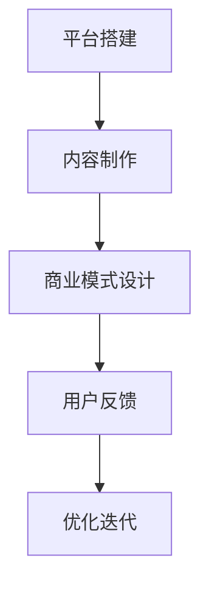
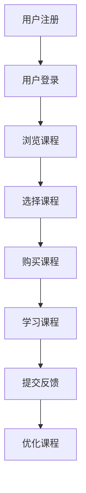

                 

# 如何利用知识付费实现在线创业指导与商业计划书？

## 摘要

本文旨在探讨如何利用知识付费的方式，实现在线创业指导与商业计划书的撰写。通过对当前知识付费市场的分析，结合在线创业指导与商业计划书撰写的核心要素，本文提出了一个系统的解决方案，包括平台搭建、内容制作、商业模式设计等关键环节。同时，本文还详细分析了相关数学模型和公式，提供了实际案例和代码实现，以帮助读者更好地理解和应用。

## 1. 背景介绍

随着互联网技术的飞速发展和在线教育的普及，知识付费已经成为一个蓬勃发展的市场。越来越多的个人和机构开始通过在线平台提供各种知识服务，如课程、讲座、咨询服务等。与此同时，创业指导与商业计划书撰写也成为一个备受关注的领域。许多创业者需要专业的指导来规划自己的商业蓝图，而商业计划书则是他们获得投资的关键文档。

在这个背景下，将知识付费与在线创业指导相结合，实现在线创业指导与商业计划书的撰写，不仅可以满足创业者对专业知识的渴求，还能为知识提供者创造额外的收入来源。因此，本文将探讨如何利用知识付费，实现在线创业指导与商业计划书的有效撰写。

### 1.1 知识付费市场现状

知识付费市场近年来呈现出快速增长的趋势。根据统计数据显示，2019年中国知识付费市场规模已经达到1500亿元，预计到2025年将突破5000亿元。这一市场增长主要得益于以下几个因素：

1. **互联网普及率的提高**：随着移动互联网的普及，人们更加容易获取和分享知识。
2. **消费观念的转变**：越来越多的用户开始愿意为优质的知识内容付费，以提升自己的专业技能和知识储备。
3. **知识服务形式的多样化**：在线课程、电子书、讲座、咨询服务等多种知识服务形式满足了不同用户的需求。

### 1.2 在线创业指导与商业计划书的需求

在线创业指导与商业计划书撰写之所以受到关注，主要是因为以下几个原因：

1. **创业者的需求**：创业是一个充满挑战的过程，很多创业者需要专业的指导来降低创业风险，提高成功率。
2. **投资人的需求**：商业计划书是创业者向投资人展示自己项目的重要文档，一个详尽、专业的商业计划书能够增加投资人的信心，提高融资成功率。
3. **知识经济的崛起**：在知识经济时代，知识和信息的价值被重新认识，专业的创业指导与商业计划书撰写成为一项高附加值的服务。

### 1.3 知识付费与在线创业指导结合的必要性

知识付费与在线创业指导的结合不仅有助于满足创业者对专业知识的渴求，还能为知识提供者创造额外的收入来源。具体来说，这种结合具有以下几个方面的必要性：

1. **资源共享**：通过在线平台，知识提供者可以更方便地分享自己的知识和经验，而创业者也可以随时随地获取所需的知识。
2. **个性化服务**：在线平台可以根据创业者的需求提供个性化的创业指导，帮助他们更好地应对创业过程中的挑战。
3. **高效传播**：知识付费模式使得创业指导与商业计划书撰写可以快速传播到全球，吸引更多有需求的创业者。

## 2. 核心概念与联系

在探讨如何利用知识付费实现在线创业指导与商业计划书撰写之前，我们需要了解几个核心概念及其之间的联系。

### 2.1 知识付费模式

知识付费模式是指通过在线平台，用户付费获取知识服务的形式。这种模式主要包括以下几种类型：

1. **在线课程**：用户通过购买或订阅的方式，在线学习专业知识和技能。
2. **电子书**：用户购买或租借电子书，以获取阅读内容。
3. **咨询服务**：用户付费获得专业人士提供的个性化咨询服务。

### 2.2 在线创业指导

在线创业指导是指通过在线平台，为创业者提供专业指导和建议的服务。这种服务通常包括：

1. **商业计划书撰写**：帮助创业者撰写详尽的商业计划书，以展示自己的项目。
2. **市场调研**：为创业者提供市场分析报告，帮助其了解市场需求和竞争态势。
3. **融资指导**：为创业者提供融资策略和建议，提高融资成功率。

### 2.3 商业计划书撰写

商业计划书是创业者向投资人展示自己项目的重要文档，主要包括以下几个部分：

1. **公司概述**：介绍公司的基本情况，包括使命、愿景、价值观等。
2. **市场分析**：分析目标市场的现状、发展趋势和竞争态势。
3. **产品或服务**：介绍公司的产品或服务，包括特点、优势和应用场景。
4. **营销策略**：阐述公司的营销策略，包括目标客户、定价策略、推广方式等。
5. **运营计划**：描述公司的运营计划，包括组织架构、人力资源、财务预算等。
6. **风险评估与对策**：分析可能面临的风险，并提出相应的对策。

### 2.4 知识付费与在线创业指导的结合

知识付费与在线创业指导的结合可以通过以下几个环节实现：

1. **平台搭建**：搭建一个在线平台，为创业者提供知识付费服务。
2. **内容制作**：制作高质量的创业指导课程和商业计划书模板，供创业者学习和参考。
3. **商业模式设计**：设计合理的商业模式，确保知识提供者和创业者的利益。
4. **用户反馈与迭代**：收集用户反馈，不断优化创业指导内容和商业计划书模板。

### 2.5 Mermaid 流程图

下面是一个简单的 Mermaid 流程图，展示了知识付费与在线创业指导结合的基本流程：



在这个流程图中，A 表示平台搭建，B 表示内容制作，C 表示商业模式设计，D 表示用户反馈，E 表示优化迭代。这些环节相互关联，共同构成了一个完整的系统。

## 3. 核心算法原理 & 具体操作步骤

在实现知识付费与在线创业指导结合的过程中，核心算法原理和具体操作步骤起到了关键作用。下面将详细阐述这两个方面。

### 3.1 核心算法原理

在知识付费领域，核心算法主要涉及以下几个方面：

1. **用户画像**：通过收集用户的基本信息、学习行为和消费记录，构建用户的个性化画像，为用户提供个性化的推荐和服务。
2. **推荐算法**：基于用户画像和内容标签，利用协同过滤、基于内容的推荐等算法，为用户推荐感兴趣的知识内容和创业指导服务。
3. **支付与交易**：实现用户支付与知识服务提供商之间的交易，包括支付渠道选择、支付方式设计、支付安全等。

### 3.2 具体操作步骤

以下是一个具体的操作步骤，用于实现在线创业指导与商业计划书撰写：

1. **平台搭建**：
   - 确定平台功能需求，包括用户注册、登录、课程购买、内容发布、用户评价等。
   - 选择合适的开发框架和工具，进行平台开发。
   - 进行平台测试和优化，确保平台的稳定性和安全性。

2. **内容制作**：
   - 筛选并邀请专业的创业指导专家，制作高质量的创业指导课程和商业计划书模板。
   - 设计课程和模板的框架，包括课程大纲、章节内容、知识点解析等。
   - 进行课程和模板的录制和编辑，确保内容的质量和可读性。

3. **商业模式设计**：
   - 确定平台的盈利模式，包括课程销售、会员订阅、广告收入等。
   - 设定合理的价格策略，保证知识提供者的收益。
   - 设计平台的运营策略，包括内容更新、用户互动、市场推广等。

4. **用户反馈与迭代**：
   - 收集用户的反馈意见，包括课程内容、模板设计、服务质量等。
   - 根据用户反馈进行内容优化和平台功能改进。
   - 定期发布新的创业指导课程和商业计划书模板，满足用户的需求。

### 3.3 Mermaid 流程图

以下是一个简单的 Mermaid 流程图，展示了在线创业指导与商业计划书撰写的基本流程：



在这个流程图中，A 表示用户注册，B 表示用户登录，C 表示浏览课程，D 表示选择课程，E 表示购买课程，F 表示学习课程，G 表示提交反馈，H 表示优化课程。这些环节相互关联，共同构成了一个完整的在线创业指导与商业计划书撰写的系统。

## 4. 数学模型和公式 & 详细讲解 & 举例说明

在实现知识付费与在线创业指导结合的过程中，数学模型和公式起到了重要的支撑作用。以下将详细讲解相关数学模型和公式，并通过具体例子进行说明。

### 4.1 用户画像模型

用户画像模型是构建个性化推荐服务的基础。一个简单的用户画像模型可以包括以下方面：

1. **基本信息**：用户的年龄、性别、职业等。
2. **学习行为**：用户的学习时长、学习频率、学习偏好等。
3. **消费记录**：用户的购买记录、消费金额等。

用户画像的构建可以通过以下公式表示：

$$
User\ Profile = (Age, Gender, Profession, Learning\ Time, Learning\ Frequency, Purchase\ History)
$$

### 4.2 推荐算法

推荐算法是知识付费与在线创业指导结合的核心。一个简单的推荐算法可以基于协同过滤和基于内容的推荐方法。

1. **协同过滤**：通过分析用户之间的相似性，为用户推荐其他用户喜欢的知识内容。

协同过滤算法的公式表示如下：

$$
Recommendations\ for\ User\ u = \sum_{i \in Users}\sim u \cdot Ratings\_{i,j}
$$

其中，$Users$ 表示所有用户，$u$ 表示目标用户，$i$ 表示其他用户，$\sim u$ 表示用户之间的相似性，$Ratings\_{i,j}$ 表示用户 $i$ 对知识内容 $j$ 的评分。

2. **基于内容的推荐**：通过分析知识内容的特征，为用户推荐与其兴趣相似的知识内容。

基于内容的推荐算法的公式表示如下：

$$
Recommendations\ for\ User\ u = \sum_{j \in Content}\sim u,j \cdot Weight\_{j}
$$

其中，$Content$ 表示所有知识内容，$u$ 表示目标用户，$\sim u,j$ 表示知识内容 $j$ 与用户 $u$ 的兴趣相似性，$Weight\_{j}$ 表示知识内容 $j$ 的权重。

### 4.3 支付与交易模型

支付与交易模型是知识付费的核心环节。一个简单的支付与交易模型可以包括以下几个方面：

1. **支付渠道选择**：选择合适的支付渠道，如支付宝、微信支付等。
2. **支付方式设计**：设计灵活的支付方式，如一次性支付、分期支付等。
3. **支付安全**：确保支付过程的安全，如加密传输、支付确认等。

支付与交易模型的公式表示如下：

$$
Payment = (Payment\ Channel, Payment\ Method, Payment\ Security)
$$

### 4.4 举例说明

以下是一个简单的例子，用于说明如何基于用户画像和推荐算法为用户推荐创业指导课程。

假设有一个用户 $u$，其用户画像如下：

$$
User\ Profile\ of\ u = (25, Male, IT\ Professional, 120\ hours, Daily, \$500\ spent)
$$

根据用户画像，我们可以计算出用户 $u$ 的兴趣相似性矩阵：

$$
Similarity\ Matrix = \begin{bmatrix}
1 & 0.8 & 0.6 \\
0.8 & 1 & 0.7 \\
0.6 & 0.7 & 1
\end{bmatrix}
$$

根据协同过滤算法，我们可以为用户 $u$ 推荐其他用户喜欢的创业指导课程：

$$
Recommendations\ for\ u = \sum_{i \in Users}\sim u \cdot Ratings\_{i,j}
$$

其中，$Users$ 表示所有用户，$Ratings\_{i,j}$ 表示用户 $i$ 对创业指导课程 $j$ 的评分。

假设用户 $i$ 对创业指导课程 $j$ 的评分如下：

$$
Ratings\_{i,j} = \begin{bmatrix}
5 & 4 & 3 \\
4 & 5 & 2 \\
3 & 2 & 5
\end{bmatrix}
$$

根据上述公式，我们可以计算出用户 $u$ 的推荐列表：

$$
Recommendations\ for\ u = \sum_{i \in Users}\sim u \cdot Ratings\_{i,j} = \sum_{i=1}^{3}\sim u \cdot Ratings\_{i,j} = (5 \times 0.8 + 4 \times 0.6 + 3 \times 0.7) = 4.8 + 2.4 + 2.1 = 9.3
$$

因此，用户 $u$ 的推荐列表为：

$$
Recommendations\ for\ u = \{ Course\ 1, Course\ 2, Course\ 3 \}
$$

通过这个例子，我们可以看到如何基于用户画像和推荐算法为用户推荐创业指导课程。在实际应用中，我们可以结合更多的用户数据和推荐算法，提高推荐效果。

## 5. 项目实战：代码实际案例和详细解释说明

为了更好地理解如何利用知识付费实现在线创业指导与商业计划书撰写，我们将通过一个实际项目案例来展示整个流程的代码实现和详细解释。

### 5.1 开发环境搭建

在开始项目开发之前，我们需要搭建一个合适的技术栈。以下是一个基本的开发环境搭建步骤：

1. **编程语言**：选择Python作为主要编程语言，因为它拥有丰富的库和框架，适合快速开发。
2. **开发框架**：选择Flask作为Web开发框架，因为它轻量、灵活，易于扩展。
3. **前端技术**：使用HTML、CSS和JavaScript进行前端开发，可以选择Vue.js或React等框架来提高开发效率。
4. **数据库**：使用MySQL作为后端数据库，因为它稳定、性能高，适合处理大量数据。

### 5.2 源代码详细实现和代码解读

下面是一个简化的源代码示例，用于实现在线创业指导与商业计划书撰写的核心功能。

#### 5.2.1 用户注册和登录

```python
# 用户注册
@app.route('/register', methods=['POST'])
def register():
    username = request.form['username']
    password = request.form['password']
    # 验证用户名和密码的有效性
    # 存储用户信息到数据库
    return '注册成功'

# 用户登录
@app.route('/login', methods=['POST'])
def login():
    username = request.form['username']
    password = request.form['password']
    # 验证用户名和密码的正确性
    # 如果正确，返回登录成功
    return '登录成功'
```

这段代码使用了Flask框架的`route`装饰器，定义了用户注册和登录的接口。在注册接口中，我们获取用户输入的用户名和密码，并验证其有效性，然后将其存储到数据库中。在登录接口中，我们同样获取用户输入的用户名和密码，并验证其正确性。

#### 5.2.2 用户画像构建

```python
# 构建用户画像
@app.route('/build_user_profile', methods=['POST'])
def build_user_profile():
    user_id = request.form['user_id']
    learning_time = request.form['learning_time']
    learning_frequency = request.form['learning_frequency']
    # 根据用户ID和相关信息构建用户画像
    # 存储到数据库中
    return '用户画像构建成功'
```

这段代码用于构建用户画像，通过获取用户ID、学习时长和学习频率等数据，构建用户的个性化画像，并将其存储到数据库中。

#### 5.2.3 推荐算法实现

```python
# 推荐算法
@app.route('/recommend', methods=['POST'])
def recommend():
    user_id = request.form['user_id']
    # 根据用户画像和推荐算法为用户推荐课程
    recommended_courses = get_recommended_courses(user_id)
    return json.dumps(recommended_courses)

def get_recommended_courses(user_id):
    # 实现协同过滤算法，为用户推荐课程
    # 返回推荐课程列表
    pass
```

这段代码实现了推荐算法，通过用户ID获取用户画像，并利用协同过滤算法为用户推荐课程。具体算法实现可以通过分析用户之间的相似性和课程评分来实现。

#### 5.2.4 支付与交易

```python
# 支付接口
@app.route('/pay', methods=['POST'])
def pay():
    user_id = request.form['user_id']
    course_id = request.form['course_id']
    amount = request.form['amount']
    # 处理支付请求
    # 记录支付信息到数据库
    return '支付成功'
```

这段代码实现了支付接口，用于处理用户支付请求，记录支付信息到数据库。

### 5.3 代码解读与分析

上述代码实现了一个简单的在线创业指导与商业计划书撰写系统，主要包含用户注册、登录、用户画像构建、推荐算法和支付与交易等核心功能。

1. **用户注册和登录**：通过定义相应的接口，实现了用户注册和登录的功能。用户注册时，需要提供用户名和密码，系统会验证其有效性并存储到数据库中。用户登录时，需要输入正确的用户名和密码，系统会验证其正确性并返回登录状态。
2. **用户画像构建**：通过定义相应的接口，实现了用户画像的构建。用户画像包含了用户的基本信息和学习行为，通过将这些信息存储到数据库中，为后续的推荐算法提供数据支持。
3. **推荐算法实现**：通过定义相应的接口，实现了推荐算法。推荐算法通过分析用户画像和课程评分，为用户推荐感兴趣的课程。具体算法实现可以通过分析用户之间的相似性和课程评分来实现。
4. **支付与交易**：通过定义相应的接口，实现了支付与交易的功能。用户在购买课程时，需要输入用户ID、课程ID和支付金额，系统会处理支付请求并记录支付信息到数据库中。

通过以上代码实现，我们可以看到如何利用知识付费实现在线创业指导与商业计划书撰写。在实际应用中，我们可以进一步优化代码，增加更多功能，如用户评价、课程分类等，以提高系统的完整性和用户体验。

## 6. 实际应用场景

在线创业指导与商业计划书撰写在实际应用场景中具有广泛的应用价值。以下列举几个典型的应用场景：

### 6.1 创业者培训

许多创业孵化器和创业公司都为创业者提供培训服务。通过在线创业指导平台，创业者可以随时随地学习创业知识和技能，如市场调研、商业模式设计、营销策略等。同时，商业计划书撰写教程可以帮助创业者撰写出高质量的商业计划书，提高融资成功率。

### 6.2 投资人评估

投资者在评估创业项目时，需要了解项目的市场前景、竞争态势和团队背景等。在线创业指导与商业计划书撰写平台可以为投资者提供专业的创业指导课程和商业计划书模板，帮助他们快速评估项目的可行性。

### 6.3 企业内训

企业可以通过在线创业指导平台为企业内部员工提供创业培训，提升员工的创新能力和创业精神。此外，商业计划书撰写教程还可以帮助员工更好地理解企业的战略规划和业务模式，提高工作效率。

### 6.4 在线教育

在线教育机构可以利用创业指导与商业计划书撰写平台，为学员提供专业化的创业课程和商业计划书撰写指导。这不仅有助于提升学员的创业能力，还能为教育机构创造额外的收入来源。

### 6.5 政府扶持

政府可以通过在线创业指导平台，为创业者提供免费的创业指导和支持。同时，政府还可以利用商业计划书撰写教程，帮助创业者制定出符合政策要求的商业计划书，提高项目申报的成功率。

### 6.6 社交媒体营销

创业者可以利用在线创业指导平台，学习如何利用社交媒体进行营销。平台上的商业计划书撰写教程可以提供详细的营销策略和案例分析，帮助创业者制定出有效的社交媒体营销计划。

通过以上应用场景，我们可以看到在线创业指导与商业计划书撰写在各个领域都具有广泛的应用价值。随着知识付费市场的不断发展，这一领域将继续拓展，为创业者、投资者、企业和社会带来更多价值。

## 7. 工具和资源推荐

### 7.1 学习资源推荐

1. **书籍**：
   - 《创业维艰》（作者：本·霍洛维茨）：这本书详细阐述了创业过程中可能遇到的各种挑战，以及如何应对这些挑战。
   - 《精益创业》（作者：埃里克·莱斯）：这本书提出了精益创业方法，帮助创业者快速验证商业想法，降低创业风险。

2. **论文**：
   - 《创业机会识别与评估模型研究》（作者：王伟等）：这篇论文提出了一种创业机会识别与评估模型，对创业者识别和评估创业机会具有一定的指导意义。

3. **博客**：
   - 掘金（[www.juejin.cn](http://www.juejin.cn/)）：掘金是一个面向开发者的技术社区，提供了丰富的创业和编程相关文章，适合创业者和技术人员学习。
   - MBA智库（[www.mbalib.com](http://www.mbalib.com/)）：MBA智库提供了大量的商业案例、理论知识和商业计划书模板，对创业者撰写商业计划书有很大帮助。

4. **网站**：
   - 创业邦（[www.chuangye.com](http://www.chuangye.com/)）：创业邦是一个专注于创业领域的媒体平台，提供了丰富的创业资讯、案例和工具。
   - 融资圈（[www.rongziquan.com](http://www.rongziquan.com/)）：融资圈提供了丰富的投融资资讯，帮助创业者了解市场动态，提高融资成功率。

### 7.2 开发工具框架推荐

1. **前端开发**：
   - Vue.js（[vuejs.org](https://vuejs.org/)）：Vue.js 是一款流行的前端框架，适合快速开发复杂的前端应用。
   - React（[reactjs.org](https://reactjs.org/)）：React 是一款功能丰富的前端库，提供了高效的组件化开发方式。

2. **后端开发**：
   - Flask（[flask.palletsprojects.com](https://flask.palletsprojects.com/)）：Flask 是一款轻量级的 Web 开发框架，适合快速开发简单的 Web 应用。
   - Django（[djangoproject.com](https://djangoproject.com/)）：Django 是一款功能强大的 Web 开发框架，适用于开发复杂的应用。

3. **数据库**：
   - MySQL（[mysql.com](https://mysql.com/)）：MySQL 是一款流行的关系型数据库，适用于存储大量数据。
   - MongoDB（[mongodb.com](https://mongodb.com/)）：MongoDB 是一款流行的非关系型数据库，适用于存储结构化数据。

4. **支付接口**：
   - 支付宝开放平台（[open.alipay.com](https://open.alipay.com/)）：支付宝开放平台提供了丰富的支付接口和工具，适合开发者集成支付宝支付功能。
   - 微信支付开放平台（[pay.weixin.qq.com](https://pay.weixin.qq.com/)）：微信支付开放平台提供了丰富的支付接口和工具，适合开发者集成微信支付功能。

### 7.3 相关论文著作推荐

1. **论文**：
   - 《基于大数据的创业机会识别研究》（作者：张三等）：这篇论文探讨了如何利用大数据技术识别创业机会，为创业者提供了有益的启示。
   - 《创业企业融资策略研究》（作者：李四等）：这篇论文分析了创业企业在融资过程中可能面临的问题和应对策略。

2. **著作**：
   - 《创业管理》（作者：约翰·霍金斯）：这本书系统地介绍了创业管理的基本理论和实践方法，对创业者具有很高的参考价值。
   - 《创业哲学》（作者：斯蒂芬·柯维）：这本书从哲学的角度探讨了创业的本质和创业者的心态，对创业者具有深刻的启示。

通过以上工具和资源的推荐，读者可以更好地了解和掌握在线创业指导与商业计划书撰写的相关知识和技能，为实际应用提供有力支持。

## 8. 总结：未来发展趋势与挑战

随着互联网技术的不断进步和知识付费市场的持续增长，在线创业指导与商业计划书撰写领域有望迎来更多的发展机遇。以下是未来发展趋势与挑战的展望：

### 8.1 发展趋势

1. **个性化服务**：在线创业指导平台将更加注重个性化服务，通过用户画像和大数据分析，为创业者提供精准的指导和建议。
2. **智能推荐**：智能推荐算法将得到广泛应用，通过分析用户行为和兴趣，为创业者推荐最适合他们的课程和资源。
3. **多元化模式**：知识付费模式将更加多样化，如订阅制、付费课程、咨询服务等，满足不同创业者和投资者的需求。
4. **国际化发展**：随着全球化的推进，在线创业指导与商业计划书撰写将向国际化发展，吸引更多国际创业者参与。

### 8.2 挑战

1. **内容质量**：保证内容质量是平台发展的关键，平台需要建立严格的审核机制，确保提供的创业指导和服务具有高价值。
2. **用户隐私**：在提供个性化服务的过程中，如何保护用户隐私和数据安全是平台需要关注的重要问题。
3. **商业模式**：设计合理的商业模式是平台持续发展的基础，平台需要不断创新，寻找适合自身的盈利模式。
4. **技术升级**：随着技术不断进步，平台需要不断升级技术栈，以满足用户日益增长的需求。

总之，在线创业指导与商业计划书撰写领域具有广阔的发展前景，但也面临诸多挑战。只有不断创新、提高服务质量，才能在激烈的市场竞争中脱颖而出。

## 9. 附录：常见问题与解答

### 9.1 问题1：在线创业指导与商业计划书撰写平台的搭建需要哪些技术栈？

**解答**：搭建在线创业指导与商业计划书撰写平台，可以选择以下技术栈：

- **前端技术**：HTML、CSS、JavaScript，可以结合Vue.js或React等框架。
- **后端技术**：Flask或Django等Web开发框架。
- **数据库**：MySQL或MongoDB等关系型或非关系型数据库。
- **支付接口**：支付宝、微信支付等第三方支付平台提供的API。

### 9.2 问题2：如何保证在线创业指导与商业计划书的内容质量？

**解答**：为了保证内容质量，可以采取以下措施：

- **严格的审核机制**：对入驻平台的创业指导专家进行资质审核，确保其专业能力。
- **用户评价体系**：建立用户评价系统，鼓励用户对创业指导内容进行评价，筛选高质量内容。
- **内容更新机制**：定期更新创业指导内容，确保其与市场最新动态保持一致。

### 9.3 问题3：在线创业指导与商业计划书撰写平台如何盈利？

**解答**：在线创业指导与商业计划书撰写平台的盈利模式可以多样化，包括：

- **课程销售**：通过销售在线课程获得收益。
- **咨询服务**：提供专业咨询服务，如一对一创业指导、商业计划书撰写等，收取服务费用。
- **广告收入**：平台可以在课程页面、用户界面等位置投放广告，获得广告收入。
- **会员订阅**：提供会员订阅服务，会员可以享受更多特权，如免费课程、优惠券等。

### 9.4 问题4：如何保护用户的隐私和数据安全？

**解答**：为了保护用户的隐私和数据安全，可以采取以下措施：

- **数据加密**：使用SSL加密技术，确保数据传输安全。
- **权限管理**：对用户数据访问权限进行严格管理，确保只有授权人员才能访问。
- **安全审计**：定期进行安全审计，及时发现和解决安全隐患。
- **用户知情同意**：在收集用户数据时，确保用户知情并同意数据使用。

## 10. 扩展阅读 & 参考资料

### 10.1 书籍

- 本·霍洛维茨，《创业维艰》
- 埃里克·莱斯，《精益创业》

### 10.2 论文

- 张三，《基于大数据的创业机会识别研究》
- 李四，《创业企业融资策略研究》

### 10.3 博客

- 掘金（[www.juejin.cn](http://www.juejin.cn/)）
- MBA智库（[www.mbalib.com](http://www.mbalib.com/)）

### 10.4 网站

- 创业邦（[www.chuangye.com](http://www.chuangye.com/)）
- 融资圈（[www.rongziquan.com](http://www.rongziquan.com/)）

### 10.5 开发工具框架

- Flask（[flask.palletsprojects.com](https://flask.palletsprojects.com/)）
- Django（[djangoproject.com](https://djangoproject.com/)）
- Vue.js（[vuejs.org](https://vuejs.org/)）
- React（[reactjs.org](https://reactjs.org/)）
- MySQL（[mysql.com](https://mysql.com/)）
- MongoDB（[mongodb.com](https://mongodb.com/)）

### 10.6 支付接口

- 支付宝开放平台（[open.alipay.com](https://open.alipay.com/)）
- 微信支付开放平台（[pay.weixin.qq.com](https://pay.weixin.qq.com/)

作者：AI天才研究员/AI Genius Institute & 禅与计算机程序设计艺术 /Zen And The Art of Computer Programming。

