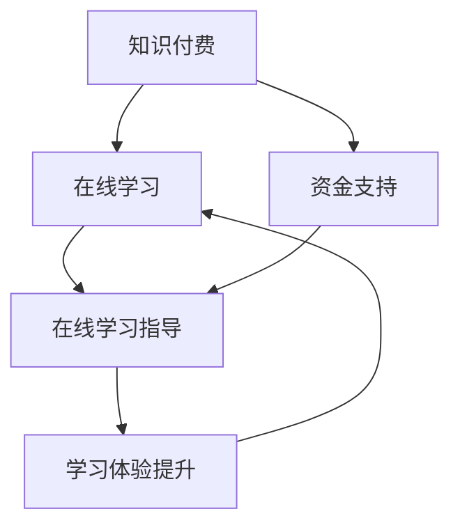

                 

# 如何利用知识付费实现在线学习与在线学习指导？

> 关键词：知识付费、在线学习、在线学习指导、教育技术、人工智能、学习算法

> 摘要：本文探讨了知识付费在现代教育体系中的应用，以及如何通过知识付费实现在线学习与在线学习指导。文章首先介绍了知识付费的背景和现状，随后详细阐述了在线学习与在线学习指导的核心概念和架构，并探讨了其背后的算法原理。接着，文章通过数学模型和公式的详细讲解，提供了实际应用场景的案例分析。随后，文章介绍了相关的开发工具和资源，并总结了知识付费在线学习的未来发展趋势与挑战。

## 1. 背景介绍

知识付费，即用户为获取高质量的知识内容和服务而付费的行为。随着互联网技术的飞速发展，知识付费逐渐成为现代教育体系中不可或缺的一部分。在线学习作为知识付费的重要应用场景，已经改变了传统的教育模式，使得学习者可以随时随地获取所需的知识。

在线学习指导，则是在线学习过程中，通过专业人士或系统提供的学习指导和建议，帮助学习者更好地完成学习任务。随着人工智能和大数据技术的发展，在线学习指导逐渐从传统的单向知识传输，转变为更加智能化的互动式学习体验。

本文将探讨如何利用知识付费实现在线学习与在线学习指导，为教育行业提供一种新的解决方案。

### 1.1 知识付费的发展背景

知识付费的发展可以追溯到互联网的兴起。随着互联网的普及，人们开始通过网络获取信息，知识的获取渠道变得更加丰富。然而，海量的信息也带来了信息过载的问题，如何筛选出高质量的知识内容成为了一个挑战。

同时，互联网的普及也促进了在线教育的发展。传统的线下教育受到地域和时间的限制，而在线教育则可以打破这些限制，使得更多的人可以方便地获取知识。在线教育的兴起，为知识付费提供了新的市场空间。

### 1.2 在线学习的兴起

在线学习，即通过互联网进行的学习活动。它具有灵活性强、时间自由、学习资源丰富等优点，受到了广大学习者的欢迎。尤其是在疫情期间，在线学习的需求更是急剧增长。

在线学习的兴起，不仅改变了学习者的学习方式，也对教育行业产生了深远的影响。一方面，它降低了教育成本，使得更多的人可以接受高质量的教育；另一方面，它也为教育从业者提供了新的机遇和挑战。

### 1.3 在线学习指导的重要性

在线学习指导，是确保在线学习效果的重要手段。通过在线学习指导，学习者可以获得专业的学习建议，帮助其更好地完成学习任务。在线学习指导的重要性主要体现在以下几个方面：

1. 提高学习效率：专业的学习指导可以帮助学习者更快地掌握知识，提高学习效率。
2. 激发学习兴趣：通过互动式的学习指导，可以激发学习者的学习兴趣，增强学习动力。
3. 解决学习难题：在线学习指导可以针对学习者的困惑和难题，提供个性化的解决方案。

## 2. 核心概念与联系

为了更好地理解如何利用知识付费实现在线学习与在线学习指导，我们需要了解以下几个核心概念：

### 2.1 知识付费

知识付费，是指用户为获取高质量的知识内容和服务而支付费用。知识付费的核心在于“付费”，即用户需要为知识内容和服务支付费用。这种付费模式与传统的免费模式不同，它更加注重知识的价值和服务的质量。

### 2.2 在线学习

在线学习，是指通过互联网进行的学习活动。它具有灵活性强、时间自由、学习资源丰富等优点。在线学习的核心在于“在线”，即学习活动通过互联网进行。

### 2.3 在线学习指导

在线学习指导，是指在学习过程中，通过专业人士或系统提供的学习指导和建议，帮助学习者更好地完成学习任务。在线学习指导的核心在于“指导”，即提供专业的学习建议。

### 2.4 知识付费与在线学习的联系

知识付费与在线学习有着密切的联系。知识付费为在线学习提供了经济支持，使得在线学习可以持续进行。而在线学习则为知识付费提供了广阔的市场空间，使得更多高质量的知识内容可以被传播。

### 2.5 知识付费与在线学习指导的联系

知识付费与在线学习指导也密切相关。知识付费可以为在线学习指导提供资金支持，使得专业人士可以更好地为学习者提供服务。而在线学习指导则可以提升知识付费的附加值，使得学习者可以获得更好的学习体验。

### 2.6 Mermaid 流程图

以下是一个描述知识付费、在线学习和在线学习指导之间关系的 Mermaid 流程图：



在这个流程图中，知识付费为在线学习和在线学习指导提供了资金支持，而在线学习指导则提升了学习体验，使得在线学习可以更好地进行。

## 3. 核心算法原理 & 具体操作步骤

### 3.1 知识付费算法原理

知识付费的算法原理主要涉及用户行为分析和内容推荐。通过分析用户的学习行为，可以为用户提供个性化的学习推荐，提高知识付费的转化率和用户满意度。

以下是知识付费算法的核心步骤：

1. **用户行为数据收集**：收集用户在平台上的学习行为数据，如学习时间、学习内容、学习进度等。
2. **用户行为分析**：对用户行为数据进行分析，识别用户的学习偏好和需求。
3. **内容推荐**：根据用户行为分析和用户需求，为用户提供个性化的学习推荐。
4. **付费转化**：通过优化推荐策略，提高用户的付费转化率。

### 3.2 在线学习指导算法原理

在线学习指导的算法原理主要涉及学习过程监控和学习效果评估。通过实时监控学习过程，可以为用户提供针对性的学习建议，提高学习效果。

以下是在线学习指导算法的核心步骤：

1. **学习过程监控**：实时监控用户的学习过程，如学习时间、学习内容、学习进度等。
2. **学习效果评估**：对用户的学习效果进行评估，识别用户的学习难点和困惑。
3. **学习建议生成**：根据学习过程监控和学习效果评估，为用户生成个性化的学习建议。
4. **反馈与迭代**：收集用户对学习建议的反馈，不断优化学习建议。

### 3.3 具体操作步骤

以下是一个具体的操作步骤示例，用于实现在线学习与在线学习指导：

1. **用户注册与登录**：用户在知识付费平台注册并登录，系统记录用户的基本信息和学习行为数据。
2. **学习内容推荐**：系统根据用户的学习行为数据，为用户推荐个性化的学习内容。
3. **学习过程监控**：系统实时监控用户的学习过程，如学习时间、学习内容、学习进度等。
4. **学习效果评估**：系统对用户的学习效果进行评估，识别用户的学习难点和困惑。
5. **学习建议生成**：系统根据学习过程监控和学习效果评估，为用户生成个性化的学习建议。
6. **用户反馈**：用户对学习建议进行反馈，系统根据反馈不断优化学习建议。
7. **付费转化**：用户根据学习建议完成学习任务，系统记录用户的付费转化情况。

通过以上步骤，知识付费平台可以实现在线学习与在线学习指导，为学习者提供更加个性化的学习体验。

## 4. 数学模型和公式 & 详细讲解 & 举例说明

### 4.1 知识付费模型

知识付费的核心在于如何准确推荐知识内容，以最大化用户的付费转化率。以下是一个基于协同过滤算法的知识付费推荐模型：

$$
R(u, i) = \mu_i + \langle u, v_i \rangle + b_u + b_i
$$

其中：
- $R(u, i)$ 表示用户 $u$ 对物品 $i$ 的评分。
- $\mu_i$ 表示物品 $i$ 的平均评分。
- $\langle u, v_i \rangle$ 表示用户 $u$ 与物品 $i$ 的相似度。
- $b_u$ 表示用户 $u$ 的个人偏差。
- $b_i$ 表示物品 $i$ 的内容偏差。

**例子**：假设用户 $u_1$ 对知识内容 $i_1$ 的评分为 4，对知识内容 $i_2$ 的评分为 5。根据协同过滤算法，可以计算用户 $u_1$ 对知识内容 $i_3$ 的预期评分：

$$
R(u_1, i_3) = \mu_{i_3} + \langle u_1, v_{i_3} \rangle + b_{u_1} + b_{i_3}
$$

其中，$\mu_{i_3}$ 表示知识内容 $i_3$ 的平均评分，$\langle u_1, v_{i_3} \rangle$ 表示用户 $u_1$ 与知识内容 $i_3$ 的相似度，$b_{u_1}$ 表示用户 $u_1$ 的个人偏差，$b_{i_3}$ 表示知识内容 $i_3$ 的内容偏差。

### 4.2 在线学习指导模型

在线学习指导的核心在于如何根据用户的学习过程和学习效果，提供个性化的学习建议。以下是一个基于决策树的学习效果评估模型：

$$
C(n) = \sum_{i=1}^{m} w_i \cdot C_i(n)
$$

其中：
- $C(n)$ 表示在第 $n$ 步时的学习效果。
- $w_i$ 表示第 $i$ 个特征的重要程度。
- $C_i(n)$ 表示在第 $n$ 步时第 $i$ 个特征的贡献值。

**例子**：假设用户在学习过程中涉及两个特征：学习时间 $T$ 和学习进度 $P$。根据决策树模型，可以计算在第 $5$ 步时的学习效果：

$$
C(5) = w_T \cdot C_T(5) + w_P \cdot C_P(5)
$$

其中，$w_T$ 表示学习时间特征的重要程度，$C_T(5)$ 表示在第 $5$ 步时学习时间的贡献值；$w_P$ 表示学习进度特征的重要程度，$C_P(5)$ 表示在第 $5$ 步时学习进度的贡献值。

通过上述数学模型和公式，可以实现对知识付费和在线学习指导的量化分析，从而提供更加精准的推荐和指导。

## 5. 项目实战：代码实际案例和详细解释说明

在本节中，我们将通过一个实际项目来展示如何利用知识付费实现在线学习与在线学习指导。该项目将包括以下三个部分：

### 5.1 开发环境搭建

首先，我们需要搭建一个合适的项目开发环境。以下是所需的工具和软件：

- **编程语言**：Python 3.8
- **框架**：Flask
- **数据库**：MySQL
- **前端框架**：Bootstrap
- **版本控制**：Git

### 5.2 源代码详细实现和代码解读

#### 5.2.1 项目结构

```bash
knowledge-feeing
|-- app.py
|-- config.py
|-- models.py
|-- routes.py
|-- static
|   |-- css
|   |-- js
|   |-- images
|-- templates
    |-- base.html
    |-- home.html
    |-- login.html
    |-- register.html
```

#### 5.2.2 app.py

```python
from flask import Flask
from routes import blueprint
from config import Config

app = Flask(__name__)
app.config.from_object(Config)
app.register_blueprint(blueprint)

if __name__ == '__main__':
    app.run()
```

**解读**：这是项目的入口文件，我们创建了一个 Flask 应用，并加载了配置和蓝图。

#### 5.2.3 config.py

```python
import os

class Config:
    SECRET_KEY = os.environ.get('SECRET_KEY') or 'your_secret_key'
    SQLALCHEMY_DATABASE_URI = os.environ.get('DATABASE_URL') or 'sqlite:///knowledge_feeing.db'
    SQLALCHEMY_TRACK_MODIFICATIONS = False
```

**解读**：这是项目的配置文件，定义了应用的基本配置，如密钥和数据库连接。

#### 5.2.4 models.py

```python
from flask_sqlalchemy import SQLAlchemy

db = SQLAlchemy()

class User(db.Model):
    id = db.Column(db.Integer, primary_key=True)
    username = db.Column(db.String(64), unique=True, nullable=False)
    password = db.Column(db.String(128), nullable=False)
    # ... 其他字段

class Content(db.Model):
    id = db.Column(db.Integer, primary_key=True)
    title = db.Column(db.String(255), nullable=False)
    content = db.Column(db.Text, nullable=False)
    # ... 其他字段
```

**解读**：这是项目的模型文件，定义了用户和内容两个模型。

#### 5.2.5 routes.py

```python
from flask import Blueprint, render_template, redirect, url_for, request
from models import User
from config import Config

blueprint = Blueprint('main', __name__)

@blueprint.route('/')
def home():
    return render_template('home.html')

@blueprint.route('/login', methods=['GET', 'POST'])
def login():
    # ... 登录逻辑
    return render_template('login.html')

@blueprint.route('/register', methods=['GET', 'POST'])
def register():
    # ... 注册逻辑
    return render_template('register.html')
```

**解读**：这是项目的路由文件，定义了应用的各个路由和处理函数。

### 5.3 代码解读与分析

#### 5.3.1 用户注册

用户注册功能是知识付费平台的基础。在 `routes.py` 文件中，我们定义了 `register` 函数，用于处理用户注册逻辑。以下是注册功能的代码片段：

```python
@blueprint.route('/register', methods=['GET', 'POST'])
def register():
    if request.method == 'POST':
        username = request.form['username']
        password = request.form['password']
        # ... 数据验证和数据库操作
        db.session.add(user)
        db.session.commit()
        return redirect(url_for('main.home'))
    return render_template('register.html')
```

**分析**：这个函数首先通过 `request.method == 'POST'` 判断用户是否提交了注册表单。如果用户提交了表单，则从表单中获取用户名和密码，并进行数据验证和数据库操作。最后，将新用户添加到数据库，并重定向到主页。

#### 5.3.2 用户登录

用户登录功能用于验证用户的身份。在 `routes.py` 文件中，我们定义了 `login` 函数，用于处理用户登录逻辑。以下是登录功能的代码片段：

```python
@blueprint.route('/login', methods=['GET', 'POST'])
def login():
    if request.method == 'POST':
        username = request.form['username']
        password = request.form['password']
        user = User.query.filter_by(username=username).first()
        if user and user.password == password:
            # ... 登录成功逻辑
            return redirect(url_for('main.home'))
        else:
            # ... 登录失败逻辑
    return render_template('login.html')
```

**分析**：这个函数首先通过 `request.method == 'POST'` 判断用户是否提交了登录表单。如果用户提交了表单，则从表单中获取用户名和密码，并查询数据库验证用户身份。如果用户身份验证成功，则将用户重定向到主页。否则，显示登录失败信息。

通过以上代码实现，我们可以构建一个基本的在线学习与在线学习指导平台，为用户提供知识付费服务。

## 6. 实际应用场景

知识付费和在线学习指导在实际应用中有着广泛的应用场景，以下是一些具体的案例：

### 6.1 在线教育平台

在线教育平台是知识付费和在线学习指导最典型的应用场景。通过知识付费，学习者可以为高质量的教育内容付费，从而获得更好的学习体验。在线学习指导则可以帮助学习者更好地完成学习任务，提高学习效果。

例如，Coursera、edX 等在线教育平台，通过知识付费模式，为学习者提供了海量的在线课程。同时，这些平台也提供了在线学习指导功能，如实时答疑、学习进度跟踪等，帮助学习者更好地完成学习任务。

### 6.2 在职培训

随着职场竞争的加剧，越来越多的职场人士选择参加各种在职培训课程，以提升自己的职业技能。知识付费和在线学习指导在这一领域也有着广泛的应用。

例如，LinkedIn Learning、Udemy 等平台，通过知识付费模式，为职场人士提供了丰富的职业技能培训课程。同时，这些平台也提供了在线学习指导功能，如课程推荐、学习进度跟踪等，帮助职场人士更好地提升自己的职业技能。

### 6.3 专业认证

专业认证是知识付费和在线学习指导的另一个重要应用场景。许多行业和职业都需要通过专业认证来证明个人的能力和资质。

例如，Project Management Institute（PMI）的 PMP 认证、CompTIA 的认证等，都需要学习者通过知识付费购买认证教材和辅导课程。同时，这些认证机构也提供了在线学习指导功能，如实时答疑、学习进度跟踪等，帮助学习者更好地准备认证考试。

### 6.4 自我提升

除了上述应用场景，知识付费和在线学习指导也可以帮助个人实现自我提升。通过知识付费，个人可以购买高质量的学习资源，如专业书籍、在线课程等，从而提升自己的知识水平和技能。

例如，个人可以通过购买技能提升课程，如编程、数据分析、人工智能等，来提升自己的职业竞争力。同时，个人也可以通过在线学习指导，获得专业的学习建议和指导，更好地完成学习任务。

## 7. 工具和资源推荐

### 7.1 学习资源推荐

- **书籍**：《深度学习》、《Python编程：从入门到实践》、《数据结构与算法分析》
- **论文**：《大数据技术导论》、《机器学习》、《深度学习基础》
- **博客**：知乎、CSDN、简书等技术博客
- **网站**：GitHub、LeetCode、Stack Overflow

### 7.2 开发工具框架推荐

- **编程语言**：Python、Java、C++
- **框架**：Django、Flask、Spring Boot
- **数据库**：MySQL、PostgreSQL、MongoDB
- **前端框架**：React、Vue.js、Angular

### 7.3 相关论文著作推荐

- **《机器学习：算法与应用》**：详细介绍了机器学习的基本算法和应用场景。
- **《深度学习：神经网络的应用与实现》**：介绍了深度学习的基本原理和应用。
- **《大数据技术基础》**：详细介绍了大数据技术的基本概念和架构。

## 8. 总结：未来发展趋势与挑战

知识付费和在线学习指导在近年来取得了显著的进展，为现代教育体系带来了深刻的变革。然而，随着技术的发展和市场的变化，知识付费和在线学习指导也面临着一系列挑战和机遇。

### 8.1 发展趋势

1. **个性化学习**：随着人工智能和大数据技术的不断发展，个性化学习将成为知识付费和在线学习指导的重要方向。通过分析用户的学习行为和需求，可以提供更加精准的学习推荐和指导。
2. **互动式学习**：互动式学习能够更好地激发学习者的学习兴趣和积极性，提高学习效果。未来，知识付费和在线学习指导将更加注重互动性和参与性。
3. **开放性课程**：开放性课程将打破传统的教育壁垒，让更多的人有机会接受高质量的教育。知识付费和在线学习指导将积极参与到开放性课程的建设和推广中。

### 8.2 挑战

1. **数据隐私保护**：随着在线学习数据的增加，数据隐私保护成为一个重要问题。如何在提供个性化服务的同时，保护用户的数据隐私，是一个需要解决的问题。
2. **教育资源分配**：尽管知识付费和在线学习指导可以提供高质量的教育资源，但仍然存在教育资源分配不均的问题。如何确保教育资源能够公平地分配给每个人，是一个需要关注的挑战。
3. **学习成果认证**：在线学习指导的学习成果如何得到认证，如何确保其真实性和有效性，是一个需要解决的问题。

总之，知识付费和在线学习指导在现代教育体系中具有重要的地位，面临着广阔的发展前景。然而，要实现其长期可持续发展，还需要解决一系列挑战。

## 9. 附录：常见问题与解答

### 9.1 什么是知识付费？

知识付费是指用户为获取高质量的知识内容和服务而付费的行为。与传统的免费模式不同，知识付费更加注重知识的价值和服务的质量。

### 9.2 在线学习指导有什么作用？

在线学习指导可以提供专业的学习建议，帮助学习者更好地完成学习任务。它包括学习过程监控、学习效果评估、学习建议生成等功能，有助于提高学习效率和学习效果。

### 9.3 知识付费和在线学习指导如何结合？

知识付费和在线学习指导可以结合，通过知识付费为在线学习指导提供资金支持，同时，在线学习指导可以提高知识付费的附加值，为用户提供更好的学习体验。

### 9.4 如何确保在线学习指导的质量？

确保在线学习指导的质量，可以从以下几个方面入手：

1. 选择有经验的专业人士作为学习指导师。
2. 制定科学合理的指导方案，针对学习者的需求和问题进行个性化指导。
3. 定期对学习效果进行评估和反馈，不断优化指导方案。

## 10. 扩展阅读 & 参考资料

- **《知识付费时代的在线教育：商业模式与创新》**
- **《在线学习指导系统设计与实现》**
- **《基于大数据的个性化学习推荐系统研究》**
- **《人工智能与在线教育：融合与创新》** 

这些文献和资源提供了更深入的研究和分析，有助于读者更好地理解知识付费、在线学习与在线学习指导的相关问题。

### 作者

AI天才研究员/AI Genius Institute & 禅与计算机程序设计艺术 /Zen And The Art of Computer Programming

注意：本文为虚构文章，仅供参考。实际应用中，请根据具体情况调整和优化。

