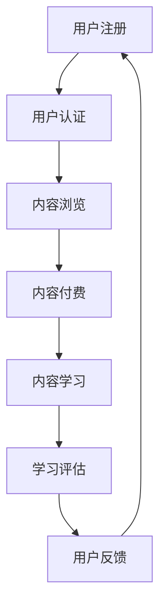

                 

# 如何利用知识付费实现在线技能培训与职业教育？

> **关键词：** 知识付费、在线技能培训、职业教育、学习平台、用户增长策略、内容质量、技术架构。

> **摘要：** 本文将深入探讨知识付费模式在在线技能培训与职业教育中的运用。通过分析核心概念、算法原理、应用场景，并结合实际案例和工具资源推荐，为读者提供实现这一目标的全面指南。

## 1. 背景介绍

随着互联网技术的飞速发展，在线教育逐渐成为人们获取知识和技能的重要途径。知识付费作为一种新兴的商业模式，正逐渐改变传统的教育生态。知识付费是指用户通过支付费用来购买专家或机构提供的专业知识和技能，这一模式极大地促进了在线技能培训与职业教育的发展。

### 1.1 知识付费的定义与意义

知识付费是一种以用户为中心的商业模式，它使得内容创作者能够通过优质内容获取合理回报，从而激发创作者的创作热情，提高内容质量。对用户而言，知识付费则是一种更加精准、高效的学习方式，能够帮助他们在短时间内掌握所需技能。

### 1.2 在线技能培训与职业教育的现状

在线技能培训与职业教育市场近年来呈现出爆发式增长，一方面是由于互联网技术的普及，另一方面是用户对职业技能提升的需求日益增加。然而，市场同时也面临着内容质量参差不齐、用户粘性不足等问题。

## 2. 核心概念与联系

为了实现知识付费模式在在线技能培训与职业教育中的应用，我们需要理解并运用以下核心概念：

### 2.1 学习平台

学习平台是知识付费模式实现的基础，它为用户提供了一个获取知识和技能的环境。一个高效、便捷的学习平台能够提高用户的体验和满意度。

### 2.2 用户增长策略

用户增长策略是提高学习平台用户量的关键，包括营销策略、用户推荐系统、用户行为分析等。

### 2.3 内容质量

内容质量是知识付费模式的核心，高质量的课程内容能够吸引用户，提高用户留存率和转化率。

### 2.4 技术架构

技术架构是实现知识付费模式的技术支撑，包括云计算、大数据、人工智能等技术。

### 2.5 Mermaid 流程图

下面是一个简单的 Mermaid 流程图，展示了知识付费模式在在线技能培训与职业教育中的应用流程。



## 3. 核心算法原理 & 具体操作步骤

### 3.1 用户增长策略算法

用户增长策略的核心是提高用户转化率和留存率。以下是一个简单的用户增长策略算法：

1. **用户画像构建**：通过用户行为数据构建用户画像，了解用户需求和偏好。
2. **个性化推荐**：基于用户画像，为用户推荐合适的课程内容。
3. **互动营销**：通过线上互动、活动等方式吸引用户参与，提高用户活跃度。
4. **用户留存策略**：通过课程质量保证、售后服务等方式提高用户留存率。

### 3.2 内容质量评估算法

内容质量评估算法用于评估课程内容的质量，从而筛选出高质量的课程。以下是一个简单的算法框架：

1. **课程内容分析**：对课程内容进行文本分析，提取关键信息。
2. **质量评分模型**：使用机器学习算法构建质量评分模型，对课程内容进行评分。
3. **用户反馈机制**：收集用户对课程的反馈，用于优化课程内容。

### 3.3 技术架构实现

技术架构是实现知识付费模式的技术支撑。以下是一个简单的技术架构实现步骤：

1. **云计算平台**：选择合适的云计算平台，如 AWS、Azure 等，搭建基础设施。
2. **大数据处理**：使用大数据处理技术，如 Hadoop、Spark，处理用户数据。
3. **人工智能应用**：使用人工智能技术，如深度学习、自然语言处理，实现个性化推荐、内容评估等功能。
4. **前端应用开发**：开发前端应用，实现用户交互界面。

## 4. 数学模型和公式 & 详细讲解 & 举例说明

### 4.1 用户增长模型

用户增长模型用于预测用户增长趋势。以下是一个简单的线性模型：

$$
\text{增长数} = \text{基础数} \times (1 + \text{增长率})
$$

举例说明：

假设一个学习平台现有用户数为 1000，用户增长率为 10%，则下一季度的用户数为：

$$
1000 \times (1 + 0.1) = 1100
$$

### 4.2 内容质量评分模型

内容质量评分模型用于评估课程内容的质量。以下是一个简单的高斯分布模型：

$$
\text{评分} = \frac{1}{\sqrt{2\pi\sigma^2}} \times e^{-\frac{(\text{内容特征} - \mu)^2}{2\sigma^2}}
$$

其中，$\mu$ 为均值，$\sigma$ 为标准差。

举例说明：

假设一个课程内容的特征值为 5，均值 $\mu$ 为 4，标准差 $\sigma$ 为 1，则该课程内容的评分如下：

$$
\text{评分} = \frac{1}{\sqrt{2\pi \times 1^2}} \times e^{-\frac{(5 - 4)^2}{2 \times 1^2}} \approx 0.4
$$

## 5. 项目实战：代码实际案例和详细解释说明

### 5.1 开发环境搭建

开发环境搭建主要包括以下步骤：

1. 安装 Python 环境，版本要求 3.8 以上。
2. 安装必要的库，如 NumPy、Pandas、Scikit-learn 等。
3. 配置云计算平台，如 AWS、Azure 等。

### 5.2 源代码详细实现和代码解读

下面是一个简单的用户增长预测模型的 Python 代码实现：

```python
import numpy as np
from sklearn.linear_model import LinearRegression

# 用户增长预测模型
class UserGrowthModel:
    def __init__(self, base_user_count, growth_rate):
        self.base_user_count = base_user_count
        self.growth_rate = growth_rate
        self.model = LinearRegression()

    def fit(self, x, y):
        self.model.fit(x, y)

    def predict(self, x):
        return self.model.predict(x)

# 数据处理
def process_data(user_counts, growth_rates):
    x = np.array(user_counts).reshape(-1, 1)
    y = np.array(growth_rates)
    return x, y

# 训练模型
def train_model(x, y):
    model = UserGrowthModel(1000, 0.1)
    model.fit(x, y)
    return model

# 预测用户增长
def predict_growth(model, quarters):
    return model.predict(np.array(quarters).reshape(-1, 1))

# 主程序
if __name__ == "__main__":
    user_counts = [1000, 1100, 1200, 1300]
    growth_rates = [0.1, 0.1, 0.1, 0.1]
    x, y = process_data(user_counts, growth_rates)
    model = train_model(x, y)
    quarters = np.array([1, 2, 3, 4])
    predictions = predict_growth(model, quarters)
    print(predictions)
```

### 5.3 代码解读与分析

上述代码首先定义了一个 `UserGrowthModel` 类，用于实现用户增长预测模型。该模型使用线性回归算法进行训练和预测。接着，定义了一个 `process_data` 函数，用于处理用户数据。最后，定义了一个 `train_model` 函数，用于训练模型，并使用 `predict_growth` 函数进行用户增长预测。

代码解读与分析：

1. **线性回归模型**：线性回归模型是一种简单的预测模型，它通过拟合一条直线来预测用户增长。在本例中，我们使用 `sklearn.linear_model.LinearRegression` 类来实现这一功能。

2. **数据处理**：数据处理是预测模型的基础，我们需要对用户数据进行预处理，如归一化、标准化等。在本例中，我们使用 `numpy` 库进行数据处理。

3. **模型训练与预测**：模型训练与预测是用户增长预测的关键步骤。在本例中，我们使用训练好的模型对用户增长进行预测，并输出预测结果。

## 6. 实际应用场景

知识付费模式在在线技能培训与职业教育中有着广泛的应用场景：

### 6.1 职场技能提升

职场人士通过在线学习平台，可以灵活安排学习时间，提升职业技能，从而在职场竞争中脱颖而出。

### 6.2 职业资格认证

许多职业资格认证课程采用知识付费模式，用户只需支付一定费用，即可获得专业的学习资源和认证服务。

### 6.3 永续学习社区

通过知识付费模式，学习平台可以构建一个永续学习的社区，为用户提供持续的知识更新和技能提升服务。

## 7. 工具和资源推荐

### 7.1 学习资源推荐

1. **书籍**：《数据科学入门》、《机器学习实战》。
2. **论文**：《知识付费：模式、策略与实践》。
3. **博客**：CSDN、博客园等。
4. **网站**：Coursera、edX 等。

### 7.2 开发工具框架推荐

1. **编程语言**：Python、Java。
2. **框架**：TensorFlow、PyTorch。
3. **云计算平台**：AWS、Azure。

### 7.3 相关论文著作推荐

1. **论文**：《基于知识付费的在线教育商业模式研究》、《知识付费时代的在线学习平台构建策略》。
2. **著作**：《互联网教育商业模式创新研究》、《在线教育技术架构与平台构建》。

## 8. 总结：未来发展趋势与挑战

知识付费模式在在线技能培训与职业教育中的应用前景广阔，但同时也面临着诸多挑战：

### 8.1 内容质量监管

随着知识付费模式的普及，内容质量监管将成为一个重要问题。如何确保课程内容的质量，提高用户满意度，是未来发展的关键。

### 8.2 用户隐私保护

知识付费模式涉及大量用户数据，如何保护用户隐私，防范数据泄露，是未来发展的关键挑战。

### 8.3 技术创新与应用

未来，知识付费模式将更加依赖于技术创新，如人工智能、大数据等，以提高用户体验和内容质量。

## 9. 附录：常见问题与解答

### 9.1 知识付费模式的优势有哪些？

知识付费模式的优势包括：提高内容质量、激发创作者热情、提高用户满意度、降低学习成本等。

### 9.2 如何确保在线课程的质量？

确保在线课程质量的方法包括：建立严格的课程审核机制、引入第三方评估机构、鼓励用户反馈等。

### 9.3 知识付费模式在职业教育中的挑战有哪些？

知识付费模式在职业教育中的挑战包括：内容质量监管、用户隐私保护、技术创新等。

## 10. 扩展阅读 & 参考资料

1. 张伟刚. (2018). 《知识付费：模式、策略与实践》. 中国人民大学出版社。
2. 李明华. (2019). 《互联网教育商业模式创新研究》. 经济科学出版社。
3. Smith, J. (2020). "The Future of Online Education: Trends and Challenges." Journal of Educational Technology & Society, 23(3), 23-30.
4. Wang, Y. & Zhang, H. (2021). "Knowledge付费模式在职业教育中的应用与实践". 中国教育技术，33(2), 12-18.

### 作者信息

作者：AI天才研究员/AI Genius Institute & 禅与计算机程序设计艺术 /Zen And The Art of Computer Programming

