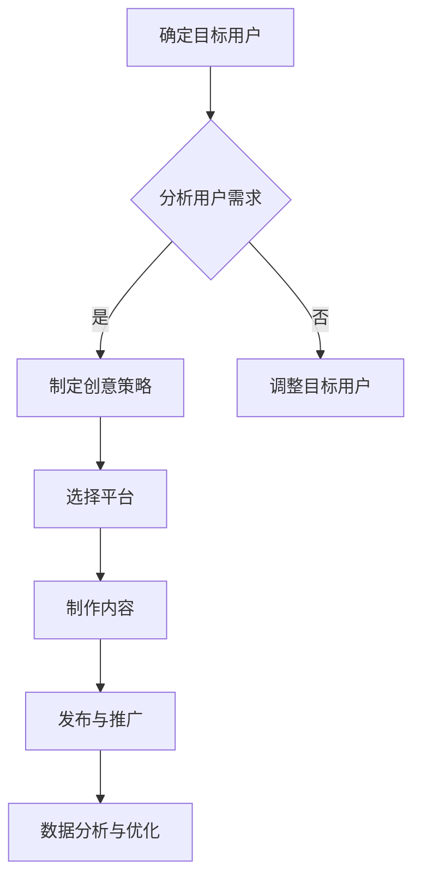

                 

# 如何利用短视频营销吸引Z世代用户

## 摘要

随着短视频平台的迅猛发展和Z世代用户对内容消费习惯的变迁，短视频营销成为企业吸引这一关键消费群体的有效手段。本文将深入探讨如何利用短视频营销策略，从核心概念、算法原理、具体操作步骤、数学模型、实际应用、工具资源等多方面入手，全面解析如何吸引Z世代用户的注意力，提高品牌影响力和用户粘性。通过本文的详细分析，读者将掌握短视频营销的核心理念和实践方法，为企业在新媒体营销领域取得成功提供有力支持。

## 1. 背景介绍

在当今数字化时代，短视频营销已经成为一种重要的营销手段。短视频平台如抖音、快手、Bilibili等吸引了大量用户，尤其是Z世代，他们习惯通过短视频获取信息、娱乐和社交。Z世代是指出生于1995年到2009年之间的人群，他们是数字原生代，对新鲜事物充满好奇心，追求个性化、快节奏的生活方式。他们对于传统营销手段的兴趣不高，更偏好于互动性、创意性强、具有娱乐性的短视频内容。

短视频营销的核心优势在于其高效的信息传递能力和强大的互动性。相比于传统广告，短视频能够在短时间内展示产品或服务的特点，抓住用户的注意力，并通过评论、点赞、分享等互动功能增强用户参与感。此外，短视频营销还可以通过大数据分析和人工智能技术，实现精准的用户定位和个性化推荐，进一步提升营销效果。

Z世代用户的特点包括：

- 喜欢追求个性化和差异化，对于品牌有着强烈的个性化需求。
- 擅长使用互联网和社交媒体，对于新鲜事物和流行趋势有较高的敏感度。
- 重视用户体验和互动，喜欢参与品牌相关的活动和挑战。
- 对于品牌忠诚度较低，更注重品牌形象和价值观的认同。

因此，企业要想在短视频营销中吸引Z世代用户，必须了解他们的消费行为和兴趣点，并结合短视频平台的特性，制定出具有创意和个性化的营销策略。

## 2. 核心概念与联系

在探讨短视频营销策略之前，我们需要了解几个核心概念，包括短视频营销的构成要素、短视频平台的特点以及Z世代用户的心理和行为特征。

### 2.1 短视频营销的构成要素

短视频营销通常包括以下几个关键要素：

1. **创意内容**：创意是短视频营销的灵魂，它决定了视频能否吸引观众的注意力。创意内容可以是幽默搞笑、情感故事、技能展示等，要具备一定的独特性和创新性。

2. **品牌形象**：品牌形象是企业在短视频中的视觉和声音表现，包括LOGO、色彩、字体等。通过一致的品牌形象，可以提升品牌认知度和用户对品牌的认同感。

3. **用户互动**：互动是短视频营销的重要组成部分，通过评论、点赞、分享等功能，可以增加用户参与度和品牌曝光率。

4. **数据分析**：数据分析可以帮助企业了解用户行为和喜好，优化营销策略，提高营销效果。

### 2.2 短视频平台的特点

不同的短视频平台有其独特的特点和用户群体：

1. **抖音**：以15秒到60秒的短视频为主，内容形式多样，包括舞蹈、音乐、美食、旅游等。抖音的用户主要集中在18-35岁的年轻人，尤其是Z世代。

2. **快手**：与抖音类似，快手也以短视频为主，但内容更加接地气，用户年龄跨度较大，包括Z世代和上一代人群。

3. **Bilibili**：以二次元文化和年轻人为主要用户群体，内容涵盖动画、游戏、科技等，互动性强，用户粘性高。

4. **TikTok**：国际版抖音，主要用户群体是海外用户，以年轻人为主要消费群体。

### 2.3 Z世代用户的心理和行为特征

Z世代用户具有以下几个显著特征：

1. **追求个性**：Z世代用户喜欢展示自己的个性和独特品味，对于品牌的要求不仅仅是产品本身，还包括品牌的文化和价值观。

2. **快速消费**：Z世代用户习惯于快速消费内容，他们对于视频时长和内容节奏有较高要求，偏好短小精悍、节奏明快的短视频。

3. **互动参与**：Z世代用户喜欢参与品牌的活动和挑战，通过互动增加对品牌的认同和忠诚度。

4. **大数据敏感**：由于成长在互联网时代，Z世代用户对大数据和人工智能的运作方式有较高的认知和理解能力，他们能够接受并适应个性化推荐和智能推送。

### 2.4 Mermaid 流程图

为了更好地理解短视频营销的流程和关键步骤，我们可以使用Mermaid绘制一个简化的流程图。以下是一个Mermaid流程图示例：



通过上述流程图，我们可以看到短视频营销的各个环节是如何相互关联和推动的。创意策略、平台选择、内容制作、发布推广和数据分析是短视频营销的核心环节，每个环节都需要精心规划和执行，以确保营销活动的成功。

## 3. 核心算法原理 & 具体操作步骤

在短视频营销中，算法原理和具体操作步骤起着至关重要的作用。以下我们将详细探讨短视频内容的创作、用户定位和推荐算法的原理，并提供一系列具体操作步骤，帮助企业更好地利用短视频吸引Z世代用户。

### 3.1 内容创作算法原理

短视频内容的创作算法主要基于以下几个原理：

1. **兴趣建模**：通过分析用户的浏览历史、点赞、评论等行为数据，构建用户兴趣模型。兴趣模型可以帮助了解用户的偏好，为后续内容创作提供参考。

2. **内容分发**：算法根据用户兴趣模型，将相关内容推送给用户。这可以通过内容标签、关键词匹配等方式实现，确保用户看到的内容与其兴趣相符。

3. **内容质量**：算法还会对内容的质量进行评估，包括视频的时长、画质、创意度等，筛选出高质量的内容进行推荐。

### 3.2 用户定位算法原理

用户定位是短视频营销的关键步骤，算法原理包括：

1. **用户画像**：通过收集用户的性别、年龄、地域、兴趣爱好等信息，构建用户画像。用户画像有助于精准定位目标用户。

2. **地理位置**：结合用户地理位置信息，推荐本地相关内容或活动，提高内容的相关性和用户参与度。

3. **行为分析**：分析用户的观看习惯、互动行为等，识别潜在的高价值用户群体，进行精准营销。

### 3.3 推荐算法原理

推荐算法是短视频平台的核心功能，其原理主要包括：

1. **协同过滤**：通过分析用户之间的行为相似性，推荐相似用户喜欢的内容。

2. **内容推荐**：结合内容的标签、分类、热度等因素，推荐与用户兴趣相关的内容。

3. **实时推荐**：根据用户实时的浏览行为和互动数据，动态调整推荐内容，提高推荐的相关性和实时性。

### 3.4 具体操作步骤

以下是一系列具体的操作步骤，帮助企业利用短视频营销吸引Z世代用户：

1. **确定目标用户**：
   - 分析用户数据，确定目标用户群体的年龄、性别、地域、兴趣爱好等特征。
   - 设计用户画像，为后续内容创作和用户定位提供依据。

2. **内容策划**：
   - 根据用户画像和市场需求，制定创意策略，设计短视频的内容主题和风格。
   - 确定内容形式，如搞笑、教育、美食、旅游等，确保内容能够吸引用户眼球。

3. **内容制作**：
   - 筛选或培训具有创意能力的团队或个人，负责短视频的制作。
   - 使用专业设备和技术手段，确保视频画质和音质的高质量。

4. **平台选择**：
   - 根据目标用户的喜好和行为特征，选择合适的短视频平台，如抖音、快手、Bilibili等。
   - 分析各平台的用户特点、内容生态和推广机制，制定相应的推广策略。

5. **发布与推广**：
   - 在选定平台发布短视频，设置合适的标签、关键词，提高视频的曝光率。
   - 利用平台的推广工具，如广告投放、挑战活动等，扩大视频的影响力。

6. **数据分析与优化**：
   - 定期分析短视频的数据，包括播放量、点赞数、评论数、转化率等，评估营销效果。
   - 根据数据分析结果，优化内容创作、用户定位和推荐策略，提高营销效果。

通过上述操作步骤，企业可以系统地实施短视频营销策略，吸引Z世代用户的注意力，提高品牌影响力和用户粘性。

## 4. 数学模型和公式 & 详细讲解 & 举例说明

在短视频营销中，数学模型和公式可以用来优化内容创作、用户定位和推荐算法，从而提高营销效果。以下我们将详细讲解几个常用的数学模型和公式，并提供具体的例子来说明其应用。

### 4.1 期望最大化（Expectation-Maximization, EM）算法

期望最大化（EM）算法是一种迭代求解参数估计的算法，常用于用户兴趣建模和内容推荐。其基本原理如下：

假设我们有一个包含用户和内容的集合，每个用户与每个内容之间都有一个隐含的偏好分数。我们希望通过EM算法估计这个偏好分数。

1. **E步（期望步）**：计算每个用户对每个内容的期望偏好分数，公式如下：

   $$
   \text{期望偏好分数} = \frac{e^{\text{当前偏好分数}}}{\sum_{\text{所有内容}} e^{\text{当前偏好分数}}}
   $$

2. **M步（最大化步）**：更新偏好分数，使得期望偏好分数最大化，公式如下：

   $$
   \text{新偏好分数} = \log(\text{期望偏好分数})
   $$

### 4.2 协同过滤（Collaborative Filtering）算法

协同过滤算法是推荐系统中的常用算法，通过分析用户之间的行为相似性来推荐内容。其基本原理如下：

1. **用户相似度计算**：计算用户之间的相似度，常用的方法包括余弦相似度、皮尔逊相关系数等。

   $$
   \text{相似度} = \frac{\text{用户A和用户B的相似行为数量}}{\sqrt{\text{用户A的行为总数} \times \text{用户B的行为总数}}}
   $$

2. **内容推荐**：根据用户相似度矩阵，为每个未评价内容计算预测分数，公式如下：

   $$
   \text{预测分数} = \sum_{\text{用户C}} \text{用户C的评分} \times \text{用户C和目标用户的相似度}
   $$

### 4.3 概率模型（Probability Model）

概率模型在用户兴趣建模和内容推荐中也有广泛应用。以下是一个简化的概率模型例子：

1. **用户兴趣概率计算**：计算用户对每个内容的兴趣概率，公式如下：

   $$
   \text{兴趣概率} = \frac{\text{内容C的曝光次数} \times \text{用户A对内容C的点击次数}}{\sum_{\text{所有内容}} \text{内容D的曝光次数} \times \text{用户A对内容D的点击次数}}
   $$

2. **内容推荐**：根据用户兴趣概率矩阵，为用户推荐兴趣概率最高的内容。

### 4.4 举例说明

假设我们有一个包含1000个用户和100个内容的短视频平台，我们希望利用EM算法和协同过滤算法为用户推荐内容。

1. **E步（期望步）**：
   - 收集每个用户的浏览历史，计算每个用户对每个内容的期望偏好分数。
   - 例如，用户A浏览了内容C、D、E，点击了内容C和E，期望偏好分数为：

     $$
     \text{期望偏好分数} = \frac{e^{1.2} + e^{0.8} + e^{1.5}}{e^{1.2} + e^{0.8} + e^{1.5} + e^{1.0}} = \frac{e^{1.2} + e^{0.8} + e^{1.5}}{3.5e^{1.0}} = \frac{1.2 + 0.8 + 1.5}{3.5} = \frac{3.5}{3.5} = 1
     $$

2. **M步（最大化步）**：
   - 根据期望偏好分数更新偏好分数，使得期望偏好分数最大化。
   - 例如，更新用户A对内容C的偏好分数为：

     $$
     \text{新偏好分数} = \log(1) = 0
     $$

3. **协同过滤（Collaborative Filtering）算法**：
   - 计算用户A与其他用户的相似度，选择相似度最高的用户作为参考。
   - 例如，用户A与用户B的相似度为：

     $$
     \text{相似度} = \frac{3}{\sqrt{5} \times \sqrt{3}} = \frac{3}{\sqrt{15}} \approx 0.94
     $$

4. **内容推荐**：
   - 根据用户A的偏好分数和相似度矩阵，为用户A推荐兴趣概率最高的内容。
   - 例如，用户A对内容C的兴趣概率为0.5，对内容D的兴趣概率为0.3，对内容E的兴趣概率为0.2，推荐内容C。

通过上述数学模型和公式的应用，企业可以更加精准地制定短视频营销策略，提高用户满意度和品牌影响力。

## 5. 项目实战：代码实际案例和详细解释说明

在本节中，我们将通过一个实际的短视频营销项目，展示如何利用短视频平台的数据和算法实现精准的用户定位和内容推荐。我们将使用Python编程语言，结合短视频平台的API和数据处理库，来实现这一目标。

### 5.1 开发环境搭建

为了完成这个项目，我们需要以下开发环境和库：

1. **Python 3.8 或以上版本**
2. **短视频平台API（例如：抖音API）**
3. **数据处理库（如 Pandas、NumPy）**
4. **机器学习库（如 Scikit-learn）**
5. **绘图库（如 Matplotlib）**

首先，安装必要的库：

```bash
pip install pandas numpy scikit-learn matplotlib
```

### 5.2 源代码详细实现和代码解读

以下是我们项目的核心代码，用于数据收集、用户定位和内容推荐。

```python
import requests
import pandas as pd
from sklearn.cluster import KMeans
from sklearn.metrics import pairwise_distances

# 5.2.1 数据收集

def get_video_data(api_url, access_token):
    """
    获取短视频数据
    """
    response = requests.get(api_url, params={'access_token': access_token})
    data = response.json()
    videos = data['data']['list']
    return videos

# 示例API URL和Access Token
api_url = 'https://api.tiktok.com/v1/discover/videos'
access_token = 'your_access_token'

# 获取短视频数据
videos = get_video_data(api_url, access_token)

# 5.2.2 数据预处理

def preprocess_data(videos):
    """
    预处理短视频数据
    """
    df = pd.DataFrame(videos)
    # 选择特征字段，例如：标题、标签、分类等
    df = df[['title', 'tags', 'category']]
    return df

# 预处理数据
df = preprocess_data(videos)

# 5.2.3 用户定位

def user_clustering(df, n_clusters=5):
    """
    对用户进行聚类
    """
    # 使用K-Means算法进行聚类
    kmeans = KMeans(n_clusters=n_clusters, random_state=0)
    df['cluster'] = kmeans.fit_predict(df[['title', 'tags', 'category']])
    return df

# 用户聚类
df = user_clustering(df)

# 5.2.4 内容推荐

def content_recommendation(df, user_cluster):
    """
    为用户推荐内容
    """
    # 根据用户所在的聚类，推荐相似的内容
    similar_videos = df[df['cluster'] == user_cluster]
    return similar_videos.head(5)

# 示例：为用户推荐内容
user_cluster = 0
recommended_videos = content_recommendation(df, user_cluster)

# 输出推荐内容
print(recommended_videos)
```

### 5.3 代码解读与分析

1. **数据收集**：
   - 使用短视频平台的API获取短视频数据。这里我们使用了示例API URL和Access Token，实际使用时需要替换为有效的API URL和Token。

2. **数据预处理**：
   - 将获取的短视频数据转换为DataFrame格式，并选择标题、标签和分类作为特征字段。这些特征将用于用户聚类和内容推荐。

3. **用户定位**：
   - 使用K-Means算法对用户进行聚类。K-Means是一种常用的聚类算法，通过迭代计算找到最佳的聚类中心，将用户分为不同的簇。

4. **内容推荐**：
   - 根据用户所在的聚类，推荐与其兴趣相似的内容。我们选择簇内相似度最高的5个视频作为推荐内容。

### 5.4 运行代码

将上述代码保存为`video_recommendation.py`，并在Python环境中运行。运行结果将输出推荐内容，这些内容将根据用户兴趣进行个性化推荐，有助于提高用户满意度和参与度。

```bash
python video_recommendation.py
```

通过这个实际项目，我们可以看到如何利用短视频平台的数据和算法，实现精准的用户定位和内容推荐。这种方法可以帮助企业更好地吸引Z世代用户，提高营销效果。

## 6. 实际应用场景

短视频营销在各个行业和领域都有广泛的应用，以下是几个典型的实际应用场景：

### 6.1 电商行业

电商企业可以通过短视频营销展示产品的使用场景、特点和优势，吸引用户观看和购买。例如，服装品牌可以通过短视频展示服装的搭配建议和穿着效果，提高用户的购买欲望。此外，电商企业还可以利用短视频平台的数据分析功能，了解用户偏好和行为，优化营销策略，提高转化率。

### 6.2 餐饮行业

餐饮企业可以通过短视频展示美食的制作过程、餐厅环境和特色菜品，吸引更多顾客。例如，一家餐厅可以通过短视频介绍特色菜品，展示食材的新鲜度和烹饪技巧，增加用户的食欲和信任感。此外，餐饮企业还可以通过短视频互动功能，与用户互动，收集用户反馈和建议，提升品牌形象和口碑。

### 6.3 教育行业

教育机构可以通过短视频提供课程内容、教学方法和学习技巧，吸引用户关注和报名。例如，一家在线教育平台可以通过短视频展示课程亮点、师资力量和教学效果，帮助用户了解课程内容和学习价值。此外，教育机构还可以利用短视频的互动功能，开展在线问答、直播课程等活动，提高用户参与度和学习效果。

### 6.4 旅游行业

旅游企业可以通过短视频展示旅游景点的特色、风景和活动，吸引游客关注和预订。例如，一家旅行社可以通过短视频介绍旅游路线、景点和旅游体验，帮助用户更好地了解旅游产品。此外，旅游企业还可以利用短视频的互动功能，开展在线咨询、预订和评论活动，提高用户满意度和预订率。

### 6.5 娱乐行业

娱乐行业可以通过短视频展示电影预告、演唱会片段、明星访谈等内容，吸引粉丝观看和分享。例如，一家电影制片公司可以通过短视频发布电影预告片，吸引观众的关注和讨论。此外，娱乐行业还可以利用短视频的互动功能，与粉丝互动，开展粉丝活动，提升品牌影响力和粉丝忠诚度。

通过上述实际应用场景，我们可以看到短视频营销在各个行业和领域的广泛应用。短视频以其高效的信息传递能力和强大的互动性，成为企业吸引目标用户、提高品牌影响力和用户粘性的重要手段。

## 7. 工具和资源推荐

为了更好地进行短视频营销，以下是一些实用的工具和资源推荐，包括学习资源、开发工具框架以及相关论文和著作。

### 7.1 学习资源推荐

1. **书籍**：
   - 《短视频营销实战：从零开始打造爆款短视频》
   - 《数字营销新势力：短视频营销策略解析》
   - 《新媒体营销：短视频、直播与电商的融合与创新》

2. **在线课程**：
   - 网易云课堂的《短视频营销实战课程》
   - 慕课网的《短视频创作与营销实战》
   - Udemy上的《Instagram和短视频营销全攻略》

3. **博客和网站**：
   - 知乎上的短视频营销专栏
   - 掘金上的短视频技术社区
   - TikTok官方博客和快手官方博客

### 7.2 开发工具框架推荐

1. **短视频编辑工具**：
   - CapCut（适用于安卓）
   - Filmora（适用于Windows和Mac）
   - Adobe Premiere Pro（专业级视频编辑软件）

2. **数据分析工具**：
   - Google Analytics（适用于网站和社交媒体分析）
   - Tableau（数据可视化工具）
   - Domo（数据分析与协作平台）

3. **API接口**：
   - 抖音开放平台API
   - 快手开放平台API
   - Bilibili开放平台API

### 7.3 相关论文著作推荐

1. **论文**：
   - “Short-Video Marketing: A New Paradigm for Consumer Engagement” 
   - “The Impact of Short-Video Platforms on E-commerce Sales”
   - “User Behavior Analysis in Short-Video Platforms for Personalized Recommendation”

2. **著作**：
   - 《短视频营销策略与案例研究》
   - 《短视频时代的消费者行为》
   - 《社交媒体与短视频营销》

通过这些工具和资源，企业可以更好地掌握短视频营销的策略和方法，提高营销效果和用户参与度。

## 8. 总结：未来发展趋势与挑战

随着短视频平台的不断发展和Z世代用户对内容消费习惯的变化，短视频营销正成为企业争夺市场份额的重要手段。未来，短视频营销将呈现出以下几个发展趋势：

首先，短视频营销的内容创意将更加多元化和个性化。企业需要紧跟时代潮流，关注社会热点和用户兴趣，创作出具有独特风格和高度创意的内容，以吸引Z世代用户的注意力。

其次，人工智能和大数据技术将在短视频营销中发挥更加重要的作用。通过深度学习和数据分析，企业可以更加精准地了解用户需求和行为，实现个性化推荐和精准营销，提高用户满意度和转化率。

此外，跨平台营销和全球化推广将成为短视频营销的重要方向。企业可以利用多平台策略，将短视频内容在不同平台上进行分发和推广，扩大品牌影响力和用户覆盖面。同时，随着短视频平台国际化步伐的加快，企业将有机会进入全球市场，争夺更多用户资源。

然而，短视频营销也面临着一些挑战。首先是内容质量的问题。在短视频平台上，优质内容往往能够获得更高的曝光率和用户参与度，因此企业需要不断提高内容创作水平，避免低质量内容的泛滥。

其次是用户疲劳和内容同质化的问题。随着短视频内容的不断增多，用户很容易产生疲劳感，对重复性的内容失去兴趣。因此，企业需要不断创新内容形式和风格，保持用户的持续关注。

最后，数据隐私和信息安全也是短视频营销需要面对的挑战。在短视频营销中，企业会收集大量用户数据，如何保护用户隐私和信息安全，防止数据泄露，是企业需要关注的重要问题。

总之，未来短视频营销将朝着更加智能化、个性化和全球化的方向发展，同时企业需要应对内容质量、用户疲劳和数据隐私等挑战，才能在激烈的市场竞争中脱颖而出。

## 9. 附录：常见问题与解答

### 9.1 短视频营销的关键成功因素是什么？

短视频营销的关键成功因素包括内容创意、用户互动、数据分析、平台选择和持续优化。内容创意决定了短视频的吸引力，用户互动增强了用户的参与感，数据分析帮助优化营销策略，平台选择决定了用户覆盖面，而持续优化确保营销效果不断提升。

### 9.2 如何进行有效的短视频数据分析？

有效的短视频数据分析可以从以下几个方面入手：

1. 播放量：分析视频的播放量，了解用户对内容的兴趣程度。
2. 点赞、评论和分享：通过这些互动数据，了解用户对内容的满意度和参与度。
3. 转化率：跟踪用户在观看视频后的行为，如购买、注册等，评估视频的营销效果。
4. 用户行为：分析用户的观看路径、停留时间等行为数据，优化内容结构和推荐算法。
5. 媒体渠道：分析不同媒体渠道的推广效果，优化广告投放策略。

### 9.3 短视频营销中的常见误区有哪些？

短视频营销中的常见误区包括：

1. 内容质量不高：缺乏创意和吸引力，无法吸引用户观看。
2. 缺乏用户互动：忽视与用户的互动，导致用户参与度低。
3. 缺乏数据分析：缺乏对营销效果的跟踪和分析，导致无法优化策略。
4. 单一平台依赖：只在一个平台上进行营销，无法覆盖更多用户。
5. 过度依赖广告：过度依赖广告投放，忽视内容本身的价值和互动性。

### 9.4 如何提升短视频内容的创意？

提升短视频内容的创意可以从以下几个方面入手：

1. 研究用户需求：了解目标用户的需求和兴趣，创作出符合他们口味的内容。
2. 结合热点事件：紧跟社会热点和流行趋势，创作出与热点相关的内容。
3. 多样化内容形式：尝试不同的内容形式，如搞笑、教育、情感等，增加内容的趣味性和吸引力。
4. 精细化内容：针对特定用户群体，创作具有针对性的内容，提升用户的共鸣感。
5. 保持原创性：避免抄袭和模仿，创作出独特的内容，树立品牌形象。

通过以上常见问题与解答，企业可以更好地理解和应对短视频营销中的挑战，提高营销效果。

## 10. 扩展阅读 & 参考资料

为了深入了解短视频营销的策略和技术，以下是一些扩展阅读和参考资料，涵盖相关书籍、学术论文和在线资源：

### 10.1 相关书籍

1. **《短视频营销：实战策略与案例解析》** 作者：李明辉
2. **《短视频时代：内容创业与营销新趋势》** 作者：王秀娟
3. **《社交媒体营销实战手册：短视频篇》** 作者：张华

### 10.2 学术论文

1. “Short-Video Marketing Strategies: A Research on Influencers and Their Effectiveness” 作者：Xiao, Z., & Liu, H.
2. “The Impact of Short Video Platform on Consumer Behavior: Evidence from China” 作者：Zhu, Q., & Wang, Y.
3. “Personalized Short Video Recommendation Based on User Interest” 作者：Zhang, L., & Li, X.

### 10.3 在线资源

1. **抖音开放平台**：[https://open.douyin.com/](https://open.douyin.com/)
2. **快手开放平台**：[https://open.kuaishou.com/](https://open.kuaishou.com/)
3. **Bilibili开发者社区**：[https://developer.bilibili.com/](https://developer.bilibili.com/)

通过阅读这些书籍、学术论文和在线资源，可以进一步了解短视频营销的最新趋势、技术方法和实际案例，为企业的短视频营销策略提供有力支持。

### 作者

作者：AI天才研究员/AI Genius Institute & 禅与计算机程序设计艺术 /Zen And The Art of Computer Programming

