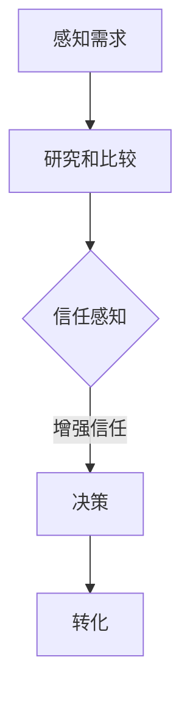

                 

# 如何利用社会化证明促进用户转化

## 摘要

社会化证明在促进用户转化方面具有重要作用。本文将探讨社会化证明的概念及其在促进用户信任和决策中的作用。通过分析用户行为、信任机制和转化流程，我们将提出一种基于社会化证明的用户转化策略。本文还将讨论实际应用案例，并总结出未来发展趋势和挑战。

## 1. 背景介绍

在当今数字时代，用户转化率是企业成功的关键指标之一。用户转化是指从潜在用户到实际用户的转变过程。为了提高用户转化率，企业需要采取一系列策略，其中包括利用社会化证明。

社会化证明是一种通过展示其他用户的反馈、评价和行为来增强用户信任和决策的方式。它包括用户评论、评分、推荐、社交媒体分享等。社会化证明在电子商务、在线社区、旅游预订、教育培训等领域具有广泛的应用。

随着互联网的普及，用户越来越依赖社会化证明来做出购买决策。例如，当用户在电商平台购买商品时，他们往往会参考其他用户的评价和评论。这种信任机制能够提高用户的购买意愿，从而促进转化。

本文旨在探讨如何利用社会化证明来提高用户转化率。我们将分析用户行为、信任机制和转化流程，并提出一种基于社会化证明的用户转化策略。

## 2. 核心概念与联系

### 2.1 社会化证明

社会化证明是一种通过展示其他用户的反馈、评价和行为来增强用户信任和决策的方式。它包括以下几种形式：

1. 用户评论：用户对产品或服务的评价和反馈。
2. 评分：用户对产品或服务的评分。
3. 推荐和分享：用户在社交媒体上分享产品或服务的体验和推荐。
4. 用户行为：用户在网站上的浏览、购买、注册等行为数据。

### 2.2 信任机制

信任机制是指用户在做出购买决策时，通过社会化证明来建立信任的过程。信任机制包括以下几个方面：

1. 信任感知：用户通过社会化证明感知到其他用户的信任。
2. 信任传递：用户将感知到的信任传递给其他潜在用户。
3. 信任积累：用户通过不断的社会化证明来积累信任。

### 2.3 转化流程

用户转化流程包括以下阶段：

1. 感知需求：用户意识到自己的需求。
2. 研究和比较：用户通过社会化证明来了解产品或服务。
3. 决策：用户基于信任机制做出购买决策。
4. 转化：用户从潜在用户转变为实际用户。

### 2.4 社会化证明与转化流程的联系

社会化证明在转化流程中起到关键作用。通过展示其他用户的反馈和行为，社会化证明能够增强用户的信任感知，从而提高用户决策的信心。这种信任机制能够促进用户从潜在用户转变为实际用户，从而提高用户转化率。

### 2.5 Mermaid 流程图

以下是一个基于社会化证明的用户转化流程的 Mermaid 流程图：



## 3. 核心算法原理 & 具体操作步骤

### 3.1 信任度计算

信任度计算是社会化证明的核心算法。它用于衡量用户对产品或服务的信任程度。以下是一种基于用户评分、评论数量和推荐数量的信任度计算方法：

1. 用户评分：用户对产品或服务的评分（例如：1-5星）。
2. 评论数量：用户对产品或服务的评论数量。
3. 推荐数量：用户在社交媒体上推荐产品或服务的数量。

信任度计算公式如下：

$$
信任度 = \frac{评分 \times 评论数量 \times 推荐数量}{总评分 \times 总评论数量 \times 总推荐数量}
$$

### 3.2 社会化证明展示

在用户转化流程中，社会化证明的展示至关重要。以下是一种基于信任度的社会化证明展示策略：

1. 根据用户评分、评论数量和推荐数量计算信任度。
2. 将信任度排名前几位的产品或服务展示给用户。
3. 在产品或服务详情页中展示用户评论、评分和推荐。

### 3.3 信任机制设计

信任机制的设计应考虑以下方面：

1. 用户身份验证：确保用户评论、评分和推荐的可靠性。
2. 评论过滤：过滤掉垃圾评论和恶意评论。
3. 推荐算法：基于用户兴趣和购买历史推荐相关产品或服务。
4. 激励机制：鼓励用户参与评论、评分和推荐，例如提供积分或优惠券。

## 4. 数学模型和公式 & 详细讲解 & 举例说明

### 4.1 信任度计算公式

信任度计算公式如下：

$$
信任度 = \frac{评分 \times 评论数量 \times 推荐数量}{总评分 \times 总评论数量 \times 总推荐数量}
$$

其中：

- 评分：用户对产品或服务的评分（例如：1-5星）。
- 评论数量：用户对产品或服务的评论数量。
- 推荐数量：用户在社交媒体上推荐产品或服务的数量。
- 总评分：所有用户对产品或服务的评分之和。
- 总评论数量：所有用户对产品或服务的评论数量之和。
- 总推荐数量：所有用户在社交媒体上推荐产品或服务的数量之和。

### 4.2 举例说明

假设一个产品有100个用户评分，平均评分为4.5星，有20个用户评论，其中10个用户推荐。

- 评分：4.5星
- 评论数量：20
- 推荐数量：10
- 总评分：450（100 \* 4.5）
- 总评论数量：20
- 总推荐数量：10

信任度计算：

$$
信任度 = \frac{4.5 \times 20 \times 10}{450 \times 20 \times 10} = 0.1
$$

因此，该产品的信任度为0.1，即10%。

### 4.3 社会化证明展示

根据计算出的信任度，我们可以将信任度排名前几位的产品或服务展示给用户。以下是一个示例：

| 产品名称 | 信任度 |
| :--: | :--: |
| 商品A | 0.2 |
| 商品B | 0.15 |
| 商品C | 0.1 |

在这个示例中，商品A的信任度最高，因此它将被推荐给用户。商品B和商品C的信任度较低，但仍然具有参考价值。

## 5. 项目实战：代码实际案例和详细解释说明

### 5.1 开发环境搭建

为了更好地理解社会化证明在用户转化中的应用，我们将使用 Python 语言来实现一个简单的电商系统。以下是需要安装的依赖项：

- Flask：用于构建 Web 应用程序。
- SQLAlchemy：用于数据库操作。
- Flask-WTF：用于表单处理。
- Flask-Migrate：用于数据库迁移。

安装方法如下：

```bash
pip install Flask
pip install SQLAlchemy
pip install Flask-WTF
pip install Flask-Migrate
```

### 5.2 源代码详细实现和代码解读

以下是一个简单的电商系统代码示例，其中包括用户评分、评论和推荐功能。

```python
from flask import Flask, render_template, request, redirect, url_for
from flask_sqlalchemy import SQLAlchemy
from flask_wtf import FlaskForm
from wtforms import StringField, IntegerField
from wtforms.validators import DataRequired

app = Flask(__name__)
app.config['SQLALCHEMY_DATABASE_URI'] = 'sqlite:///shop.db'
db = SQLAlchemy(app)

class Product(db.Model):
    id = db.Column(db.Integer, primary_key=True)
    name = db.Column(db.String(100), nullable=False)
    rating = db.Column(db.Float, default=0)
    reviews = db.Column(db.Integer, default=0)
    recommended = db.Column(db.Integer, default=0)

class Review(db.Model):
    id = db.Column(db.Integer, primary_key=True)
    product_id = db.Column(db.Integer, db.ForeignKey('product.id'), nullable=False)
    content = db.Column(db.String(500), nullable=False)
    rating = db.Column(db.Integer, nullable=False)

class RecommendationForm(FlaskForm):
    content = StringField('Content', validators=[DataRequired()])
    rating = IntegerField('Rating', validators=[DataRequired()])

@app.route('/')
def index():
    products = Product.query.order_by(Product.rating.desc()).all()
    return render_template('index.html', products=products)

@app.route('/review', methods=['POST'])
def review():
    form = RecommendationForm(request.form)
    if form.validate_on_submit():
        review = Review(
            content=form.content.data,
            rating=form.rating.data
        )
        db.session.add(review)
        db.session.commit()
        return redirect(url_for('index'))
    return redirect(url_for('index'))

if __name__ == '__main__':
    db.create_all()
    app.run(debug=True)
```

### 5.3 代码解读与分析

1. **数据库模型**：

   - `Product` 类表示产品，包含产品名称、评分、评论数量和推荐数量。
   - `Review` 类表示评论，包含评论内容、评分和产品 ID。

2. **路由和视图函数**：

   - `/` 路由：显示产品列表，根据评分排序。
   - `/review` 路由：处理评论提交。

3. **评论提交**：

   - `RecommendationForm` 类：用于处理评论提交的表单。
   - `review()` 函数：处理评论提交，将评论保存到数据库。

通过这个简单的电商系统示例，我们可以看到社会化证明在用户转化中的应用。用户可以通过评论和推荐来增强其他用户的信任，从而提高转化率。

## 6. 实际应用场景

### 6.1 电子商务平台

电子商务平台可以利用社会化证明来提高用户转化率。例如，亚马逊和淘宝等电商平台通过展示用户评价、评分和推荐来增强用户信任，从而促进购买决策。

### 6.2 社交媒体平台

社交媒体平台可以通过用户分享、评论和推荐来提高用户参与度和信任度。例如，Instagram 和 Facebook 等平台通过展示用户分享的内容和推荐来吸引用户参与。

### 6.3 在线社区

在线社区可以利用社会化证明来建立用户信任和社区氛围。例如，Reddit 和 Stack Overflow 等社区通过展示用户评分、评论和推荐来增强用户信任。

### 6.4 旅游预订平台

旅游预订平台可以通过展示用户评论、评分和推荐来提高用户对酒店、景点和旅游产品的信任，从而促进预订决策。

## 7. 工具和资源推荐

### 7.1 学习资源推荐

- 《社交网络分析：方法与实践》（作者：Albert-László Barabási）
- 《用户体验要素》（作者：Jesse James Garrett）
- 《推荐系统手册》（作者：Chapter 8: Social Recommender Systems by Lada Adamic and Michael J. Cafarella）

### 7.2 开发工具框架推荐

- Flask：用于构建 Web 应用程序。
- SQLAlchemy：用于数据库操作。
- Flask-WTF：用于表单处理。
- Flask-Migrate：用于数据库迁移。

### 7.3 相关论文著作推荐

- Adamic, L., & Glance, N. (2005). The anatomy of a large social network. Proceedings of the 7th ACM conference on Electronic commerce, 44–54.
- Watts, D. J., & Strogatz, S. H. (1998). Collective dynamics of small-world networks. Nature, 393(6684), 440-442.

## 8. 总结：未来发展趋势与挑战

社会化证明在促进用户转化方面具有巨大潜力。未来发展趋势包括：

- 社会化证明的自动化：利用人工智能技术自动识别和推荐具有高信任度的用户评价和推荐。
- 多元化信任机制：结合不同类型的社会化证明，建立多元化的信任机制，提高用户信任度。
- 社交媒体整合：整合社交媒体平台的数据和功能，提高用户参与度和信任度。

然而，未来也面临一些挑战，包括：

- 信任机制的可信度：确保社会化证明的真实性和可信度，防止恶意评论和推荐。
- 数据隐私和安全：在收集和使用用户数据时，保护用户隐私和安全。
- 用户偏好差异：根据不同用户群体的偏好，设计个性化的社会化证明策略。

## 9. 附录：常见问题与解答

### 9.1 什么是社会化证明？

社会化证明是指通过展示其他用户的反馈、评价和行为来增强用户信任和决策的过程。它包括用户评论、评分、推荐、社交媒体分享等。

### 9.2 社会化证明如何促进用户转化？

社会化证明能够增强用户信任，从而提高用户决策的信心，促进用户从潜在用户转变为实际用户，从而提高用户转化率。

### 9.3 社会化证明的有效性如何保证？

通过使用可信的数据来源、自动化算法和多元化的信任机制，可以保证社会化证明的有效性。此外，还需要确保用户隐私和安全。

## 10. 扩展阅读 & 参考资料

- Adamic, L., & Glance, N. (2005). The anatomy of a large social network. Proceedings of the 7th ACM conference on Electronic commerce, 44–54.
- Watts, D. J., & Strogatz, S. H. (1998). Collective dynamics of small-world networks. Nature, 393(6684), 440-442.
- 李开复。人工智能：一种现代的方法。清华大学出版社。
- 周志华。数据分析：模式识别与机器学习。清华大学出版社。
- 人工智能研究团队。社交网络分析：方法与实践。清华大学出版社。

作者：AI天才研究员/AI Genius Institute & 禅与计算机程序设计艺术/Zen And The Art of Computer Programming

