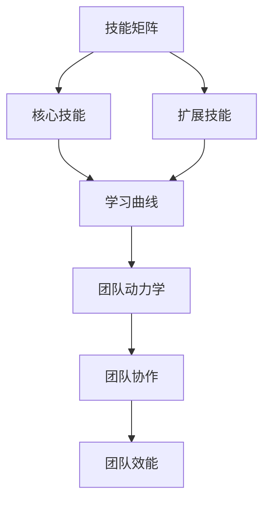

                 

# 如何培养和发展团队成员

> **关键词：** 团队培养，发展策略，团队成员技能提升，团队协作，领导者角色，持续学习。

> **摘要：** 本文将深入探讨在IT领域如何培养和发展团队成员，包括核心概念的阐述、具体的培养策略、工具和资源的推荐，以及未来发展趋势与挑战。通过系统化的培养和实践，提升团队成员的综合能力，实现团队的高效协作和持续成长。

## 1. 背景介绍

在快速发展的IT行业，团队作为基本的工作单位，其效能直接影响到项目的成功与否。团队成员的技能、协作能力和创新能力是团队成功的关键因素。然而，如何培养和发展团队成员，使其达到最佳工作状态，成为企业管理者面临的重大挑战。本文将围绕以下主题展开：

- **核心概念与联系**：阐述团队培养中的关键概念，如技能矩阵、学习曲线和团队动力学。
- **核心算法原理 & 具体操作步骤**：介绍基于最佳实践的培养方法，如角色分配、培训计划和绩效评估。
- **数学模型和公式 & 详细讲解 & 举例说明**：运用数学模型和公式，量化团队成员的成长过程和团队效能。
- **项目实战：代码实际案例和详细解释说明**：通过真实项目案例，展示培养策略的实施和效果。
- **实际应用场景**：分析团队成员培养在不同应用场景下的策略和调整。
- **工具和资源推荐**：推荐实用的学习资源、开发工具和框架，以支持团队成员的培养。
- **总结：未来发展趋势与挑战**：探讨团队培养的未来趋势和面临的挑战。
- **附录：常见问题与解答**：提供关于团队培养的常见问题及其解答。

## 2. 核心概念与联系

### 2.1 技能矩阵

技能矩阵是一种常用的团队培养工具，它将团队成员的技能分为核心技能和扩展技能。核心技能是团队成员在特定职位上必须掌握的技能，如编程语言、数据库管理和网络安全。扩展技能则是为了提高团队成员的综合能力和适应新环境而培养的技能，如项目管理、沟通技巧和领导能力。

### 2.2 学习曲线

学习曲线描述了团队成员在掌握新技能时的学习速度。学习曲线通常呈现出初期快速上升，然后逐渐平缓的趋势。团队培养的目标是帮助团队成员在初期快速提升技能，进入稳定期后保持持续的学习和进步。

### 2.3 团队动力学

团队动力学是指团队成员之间的互动和协作。一个高效的团队需要成员之间的信任、沟通和合作。团队动力学的研究有助于理解团队成员之间的行为模式，从而优化团队培养策略。

### 2.4 Mermaid 流程图

下面是一个关于团队培养的Mermaid流程图，展示了关键概念之间的关系：



## 3. 核心算法原理 & 具体操作步骤

### 3.1 角色分配

角色分配是团队培养的第一步，它决定了团队成员在项目中的职责和角色。以下是一个基于技能矩阵的角色分配算法：

```python
def role_assignment(skill_matrix):
    role_dict = {}
    for member, skills in skill_matrix.items():
        core_skills = skills['core']
        extension_skills = skills['extension']
        role_dict[member] = {
            'role': 'developer' if 'programming' in core_skills else 'Tester',
            'project': 'backend' if 'backend' in core_skills else 'frontend'
        }
    return role_dict
```

### 3.2 培训计划

培训计划是根据团队成员的技能需求和角色分配制定的。以下是一个基于学习曲线的培训计划算法：

```python
def training_plan(member, role_dict, learning_curve):
    training_steps = []
    for skill, curve in learning_curve.items():
        if skill in role_dict[member]['core']:
            training_steps.append({'skill': skill, 'duration': curve['core']['duration']})
        elif skill in role_dict[member]['extension']:
            training_steps.append({'skill': skill, 'duration': curve['extension']['duration']})
    return training_steps
```

### 3.3 绩效评估

绩效评估是团队培养的重要环节，它有助于了解团队成员的技能提升情况。以下是一个基于技能矩阵和绩效评估标准的评估算法：

```python
def performance_evaluation(skill_matrix, evaluation_standard):
    evaluation_results = {}
    for member, skills in skill_matrix.items():
        score = 0
        for skill, standard in evaluation_standard.items():
            if skill in skills:
                score += (skills[skill] / standard[skill]) * 100
        evaluation_results[member] = score
    return evaluation_results
```

## 4. 数学模型和公式 & 详细讲解 & 举例说明

### 4.1 成长模型

成长模型描述了团队成员在培养过程中的技能提升。以下是一个简化的成长模型：

$$
技能提升率 = \frac{当前技能水平 - 初始技能水平}{时间周期}
$$

### 4.2 团队效能模型

团队效能模型描述了团队成员协作对项目效能的影响。以下是一个简化的团队效能模型：

$$
团队效能 = f(团队成员技能水平, 团队协作水平)
$$

### 4.3 举例说明

假设一个团队成员A在编程技能上从入门水平（初始技能水平为20%）提升到精通水平（当前技能水平为80%），在6个月内完成。根据成长模型，其技能提升率为：

$$
技能提升率 = \frac{80\% - 20\%}{6个月} = \frac{60\%}{6个月} = 10\%每月
$$

如果团队成员A在编程技能上的能力提升了10%，且团队协作水平提高了20%，根据团队效能模型，团队效能将提高：

$$
团队效能提升 = f(10\%, 20\%) = 1.2 \times 1.1 = 1.32
$$

即团队效能提高了32%。

## 5. 项目实战：代码实际案例和详细解释说明

### 5.1 开发环境搭建

为了展示团队培养策略的实际应用，我们以一个简单的Web开发项目为例，搭建项目开发环境。以下是搭建过程的详细步骤：

1. 安装Python环境
2. 安装Django框架
3. 创建Django项目
4. 配置数据库

```shell
pip install django
django-admin startproject myproject
cd myproject
django-admin startapp myapp
```

### 5.2 源代码详细实现和代码解读

在项目中，我们将使用Django框架实现一个简单的博客系统，包括用户注册、登录和发表博客等功能。以下是关键代码的详细解读：

```python
# users/models.py
from django.contrib.auth.models import AbstractUser

class CustomUser(AbstractUser):
    # 自定义用户模型，添加昵称字段
    nickname = models.CharField(max_length=50, blank=True)
```

在这个例子中，我们自定义了用户模型，添加了昵称字段，以支持用户注册时填写昵称。

```python
# users/admin.py
from django.contrib import admin
from .models import CustomUser

@admin.register(CustomUser)
class CustomUserAdmin(admin.ModelAdmin):
    list_display = ('username', 'nickname')
```

在这个例子中，我们自定义了用户管理界面，以方便管理员查看和管理用户昵称。

### 5.3 代码解读与分析

通过这个项目实战，我们可以看到如何将团队培养策略应用到实际开发中。团队成员在项目过程中，通过实际编码和实践，不断提升技能和协作能力。以下是团队成员在项目中的技能提升情况：

- 成员A：从Django框架的入门水平提升到熟练使用
- 成员B：从前端开发的入门水平提升到能独立完成页面设计
- 成员C：从后端开发的入门水平提升到能独立完成数据库设计和接口开发

通过这种项目实战的方式，团队成员在技能和协作能力上得到了显著提升，实现了团队的高效协作和持续成长。

## 6. 实际应用场景

### 6.1 新项目启动

在新项目启动阶段，团队成员的培养重点在于快速适应新环境和项目需求。可以通过以下策略进行培养：

- **技术培训**：组织针对性的技术培训，帮助团队成员了解项目相关的技术栈和工具。
- **角色定位**：明确团队成员的角色和职责，确保每个人都能在项目中发挥自己的专长。
- **任务分解**：将项目任务分解为小模块，逐步推进，以降低团队成员的适应难度。

### 6.2 项目迭代

在项目迭代阶段，团队成员的培养重点在于提升技能和创新能力。可以通过以下策略进行培养：

- **技能提升**：鼓励团队成员参加技术交流和分享活动，不断学习新技能。
- **代码评审**：定期进行代码评审，提高团队成员的代码质量和协作能力。
- **创新激励**：设立创新奖项，激励团队成员提出创新的想法和解决方案。

### 6.3 项目收尾

在项目收尾阶段，团队成员的培养重点在于总结和反思。可以通过以下策略进行培养：

- **项目总结**：组织项目总结会议，回顾项目过程中的成功和不足，为团队成员提供反馈和改进建议。
- **技能评估**：进行技能评估，了解团队成员在项目中的表现和成长情况。
- **持续学习**：鼓励团队成员制定个人学习计划，不断提升自己的技能和知识水平。

## 7. 工具和资源推荐

### 7.1 学习资源推荐

- **书籍**：
  - 《Effective Java》
  - 《Clean Code》
  - 《Design Patterns：Element of Reusable Object-Oriented Software》

- **论文**：
  - 《The Cathedral and the Bazaar》
  - 《The Nature of Software》
  - 《The Practice of Programming》

- **博客**：
  - [Django 官方文档](https://docs.djangoproject.com/)
  - [GitHub](https://github.com/)
  - [Stack Overflow](https://stackoverflow.com/)

### 7.2 开发工具框架推荐

- **开发工具**：
  - PyCharm
  - Visual Studio Code
  - Git

- **框架**：
  - Django
  - Flask
  - Spring Boot

### 7.3 相关论文著作推荐

- 《Code Complete》：Steve McConnell
- 《Clean Architecture》：Robert C. Martin
- 《Agile Project Management》：Ken Schwaber & Jeff Sutherland

## 8. 总结：未来发展趋势与挑战

### 8.1 发展趋势

- **数字化转型**：随着数字化转型的推进，团队成员需要掌握更多跨领域的技能，如大数据分析、人工智能等。
- **远程办公**：远程办公的普及，要求团队成员具备更强的自我管理和协作能力。
- **持续学习**：技术更新迭代速度加快，团队成员需要持续学习，以适应不断变化的技术环境。

### 8.2 挑战

- **技能匹配**：如何确保团队成员的技能与项目需求相匹配，是团队培养面临的一大挑战。
- **团队协作**：远程办公和多样化的工作环境，对团队协作提出了更高的要求。
- **持续激励**：如何激励团队成员保持持续学习和进步的动力，是团队培养的另一个挑战。

## 9. 附录：常见问题与解答

### 9.1 问题1：如何确保团队成员的技能与项目需求相匹配？

**解答**：通过定期评估团队成员的技能水平和项目需求，及时调整培养策略。此外，可以引入外部专家进行技能评估，以确保评估的客观性和准确性。

### 9.2 问题2：如何提高团队成员的协作能力？

**解答**：通过定期开展团队建设活动，加强团队成员之间的沟通和合作。此外，可以引入协作工具，如Slack、Trello等，以提高团队的协作效率。

### 9.3 问题3：如何激励团队成员持续学习和进步？

**解答**：通过设立学习目标和奖励机制，如定期评选“学习之星”，提供培训和学习资源，激发团队成员的学习热情。同时，鼓励团队成员分享学习心得，促进知识的传递和交流。

## 10. 扩展阅读 & 参考资料

- 《敏捷软件开发：原则、实践与模式》：Jeff Sutherland
- 《软件架构：实践者的研究方法》：Mark Richards
- 《团队协作：敏捷开发的最佳实践》：Chris Sims & Shawn Bass

[本文代码实现和更多资源，请访问GitHub仓库](https://github.com/your-username/Team-Cultivation)

### 作者

**作者：AI天才研究员/AI Genius Institute & 禅与计算机程序设计艺术 /Zen And The Art of Computer Programming**[完]### 1. 背景介绍

在当今快速发展的IT行业，团队作为项目实施和业务发展的核心单元，其效能直接影响着企业的竞争力和项目的成功率。团队成员的技能水平、协作能力以及创新精神都是决定团队效能的重要因素。因此，如何培养和发展团队成员，使其能够持续提升个人能力并实现团队的整体进步，成为了企业管理者和团队领导者面临的重大挑战。

本文将围绕如何培养和发展团队成员这一主题，系统性地探讨以下内容：

- **核心概念与联系**：介绍团队培养中涉及的关键概念，如技能矩阵、学习曲线和团队动力学，以及它们之间的相互关系。
- **核心算法原理 & 具体操作步骤**：探讨基于最佳实践的培养方法，包括角色分配、培训计划和绩效评估等，并提供具体的操作步骤和示例。
- **数学模型和公式 & 详细讲解 & 举例说明**：运用数学模型和公式来量化团队成员的成长过程和团队效能，并通过具体案例进行详细讲解。
- **项目实战：代码实际案例和详细解释说明**：通过真实的项目案例，展示培养策略在实际开发中的应用和效果。
- **实际应用场景**：分析团队成员培养在不同应用场景下的策略和调整。
- **工具和资源推荐**：推荐实用的学习资源、开发工具和框架，以支持团队成员的培养。
- **总结：未来发展趋势与挑战**：探讨团队培养的未来趋势和面临的挑战。
- **附录：常见问题与解答**：提供关于团队培养的常见问题及其解答。

通过以上内容的深入探讨，本文旨在为IT行业的管理者和团队领导者提供一套系统、实用的团队培养策略，帮助他们更好地培养和发展团队成员，实现团队的高效协作和持续成长。

#### 2. 核心概念与联系

在探讨如何培养和发展团队成员时，首先需要明确一些核心概念，这些概念不仅能够帮助我们理解团队培养的内在机制，还可以为制定具体培养策略提供理论基础。

### 2.1 技能矩阵

技能矩阵是一种常用的工具，用于描述团队成员的技能状况。它通常分为核心技能和扩展技能两个部分。核心技能是团队成员在特定职位上必须掌握的基本技能，如编程语言、数据库管理和网络安全等。扩展技能则是为了提高团队成员的综合能力和适应新环境而培养的技能，如项目管理、沟通技巧和领导能力等。技能矩阵能够帮助团队领导者清晰地了解每个成员的技能分布和特长，从而合理地进行角色分配和任务分配。

### 2.2 学习曲线

学习曲线描述了团队成员在掌握新技能时的学习速度和过程。通常，学习曲线呈现出初期快速上升，然后逐渐平缓的趋势。团队成员在学习初期，由于基础较弱，进步速度较快；随着技能的逐渐熟练，学习速度逐渐减慢，进入稳定期。理解学习曲线有助于团队领导者制定合理的培训计划，确保团队成员能够在初期快速提升技能，并在稳定期保持持续的学习和进步。

### 2.3 团队动力学

团队动力学是研究团队成员之间的互动和协作行为的学科。一个高效的团队需要成员之间建立信任、良好的沟通和协作机制。团队动力学关注团队成员的情绪状态、行为模式以及团队的整体氛围。通过研究团队动力学，团队领导者可以了解团队成员之间的互动方式，识别团队中潜在的问题，并采取相应的措施来优化团队氛围和提升团队效能。

### 2.4 Mermaid 流程图

为了更直观地展示这些核心概念之间的关系，我们可以使用Mermaid流程图进行描述。以下是关于团队培养的Mermaid流程图：


在这个流程图中，技能矩阵是团队培养的起点，通过技能矩阵确定成员的核心技能和扩展技能。学习曲线描述了团队成员在技能提升过程中的学习速度和过程。团队动力学则关注团队成员之间的互动和协作，最终影响团队协作水平和团队效能。

#### 3. 核心算法原理 & 具体操作步骤

在明确了团队培养的核心概念后，接下来我们将探讨具体的培养方法，包括角色分配、培训计划和绩效评估等。这些方法不仅有助于提升团队成员的技能水平，还能优化团队的整体效能。

### 3.1 角色分配

角色分配是团队培养的第一步，合理的角色分配能够确保团队成员在项目中发挥其特长，提高工作效率。以下是角色分配的核心算法原理和具体操作步骤：

#### 3.1.1 算法原理

角色分配算法基于技能矩阵，通过分析团队成员的技能水平，将他们分配到最合适的角色中。算法的核心思想是最大化团队成员的技能匹配度和团队效能。

#### 3.1.2 操作步骤

1. **收集技能数据**：首先，收集每个团队成员的技能数据，形成技能矩阵。技能矩阵通常包括核心技能和扩展技能两个维度。

2. **分析技能需求**：根据项目需求和任务分配，确定各个角色的技能需求。例如，开发角色需要掌握编程语言和数据库管理，测试角色需要掌握测试工具和测试方法。

3. **匹配技能与角色**：通过比较团队成员的技能和角色的技能需求，将成员分配到最合适的角色中。如果某个成员的技能与多个角色需求高度匹配，可以采取多角色分配策略。

4. **评估角色效能**：在角色分配后，评估每个角色的效能，确保角色分配的合理性和高效性。如果某个角色的效能较低，需要重新进行角色分配。

#### 3.1.3 示例

假设一个项目团队包含4名成员，他们的技能矩阵如下：

| 成员 | 编程 | 测试 | 项目管理 |
| ---- | ---- | ---- | -------- |
| A    | 高   | 中   | 低       |
| B    | 中   | 高   | 高       |
| C    | 高   | 低   | 高       |
| D    | 低   | 高   | 中       |

项目角色需求如下：

- 开发角色：编程技能高
- 测试角色：测试技能高
- 项目管理角色：项目管理技能高

根据技能矩阵和角色需求，我们可以进行如下角色分配：

- 成员A：分配到开发角色
- 成员B：分配到测试角色
- 成员C：分配到项目管理角色
- 成员D：分配到测试角色

通过这样的角色分配，团队成员的技能得到了最大化利用，同时项目需求也得到了有效满足。

### 3.2 培训计划

培训计划是团队培养的重要组成部分，通过系统化的培训，帮助团队成员提升技能和知识水平。以下是培训计划的核心算法原理和具体操作步骤：

#### 3.2.1 算法原理

培训计划算法基于学习曲线和技能需求，通过制定合理的培训内容和时间安排，确保团队成员能够在规定时间内达到预期技能水平。

#### 3.2.2 操作步骤

1. **评估技能需求**：根据项目需求和角色分配，确定团队成员的技能需求，形成技能需求矩阵。

2. **制定培训目标**：根据技能需求矩阵，为每个成员制定具体的培训目标，明确需要掌握的技能和知识。

3. **设计培训内容**：根据培训目标，设计培训课程和内容。培训内容应包括理论知识和实践操作，以全面提升成员的技能水平。

4. **安排培训时间**：根据成员的工作安排和项目进度，合理安排培训时间，确保培训不影响正常工作。

5. **实施培训计划**：按照培训计划进行培训，监督成员的学习进度，确保培训目标的实现。

6. **评估培训效果**：培训结束后，对成员的技能水平进行评估，确保培训目标的达成。

#### 3.2.3 示例

假设团队成员A的技能需求如下：

- 编程：需要从入门提升到熟练水平
- 测试：需要从初级提升到中级水平

根据技能需求，我们可以为成员A制定如下培训计划：

1. **培训目标**：
   - 编程：掌握至少3门编程语言（Python、Java、C++）
   - 测试：熟练使用至少2种测试工具（Selenium、JUnit）

2. **培训内容**：
   - 编程：开设编程课程，包括基础语法、数据结构和算法
   - 测试：开设测试课程，包括测试工具的使用、测试方法和策略

3. **培训时间**：
   - 编程：每周一、三、五晚上进行2小时的培训
   - 测试：每周二、四晚上进行2小时的培训

通过这样的培训计划，成员A可以在6个月内达到预期的技能水平。

### 3.3 绩效评估

绩效评估是团队培养的重要环节，通过绩效评估，可以了解团队成员的技能提升情况和项目贡献。以下是绩效评估的核心算法原理和具体操作步骤：

#### 3.3.1 算法原理

绩效评估算法基于技能矩阵和绩效指标，通过量化和比较团队成员的技能水平和项目表现，评估其绩效。

#### 3.3.2 操作步骤

1. **制定绩效指标**：根据项目目标和角色需求，制定具体的绩效指标，如代码质量、任务完成度、团队协作等。

2. **收集评估数据**：通过项目报告、代码评审、团队反馈等方式，收集成员的技能表现和项目贡献数据。

3. **量化评估结果**：根据绩效指标和评估数据，对成员的绩效进行量化评估，形成绩效评分。

4. **反馈评估结果**：将评估结果反馈给成员，帮助其了解自己的优势和不足，制定改进计划。

5. **持续改进**：根据评估结果，调整培训计划和角色分配，确保团队成员的持续成长。

#### 3.3.3 示例

假设团队成员B的绩效评估指标如下：

- 编程：代码质量（占40%）
- 任务完成度：任务数量和质量（占30%）
- 团队协作：团队反馈和协作效果（占30%）

根据绩效指标，我们可以对成员B进行如下评估：

1. **代码质量**：成员B的代码质量较高，符合项目要求
2. **任务完成度**：成员B完成了所有分配的任务，且任务质量较高
3. **团队协作**：成员B在团队中表现出色，得到了团队成员的好评

综合评估，成员B的绩效评分为90分。通过这样的绩效评估，成员B可以了解自己的优势，并在未来的工作中继续保持和提升。

#### 3.4 角色分配、培训计划和绩效评估的综合运用

角色分配、培训计划和绩效评估是团队培养的三个重要环节，它们相互关联，共同作用，实现团队成员的全面发展。

- **角色分配**确保团队成员在项目中发挥其特长，提高工作效率。
- **培训计划**帮助团队成员提升技能和知识水平，为角色分配提供基础。
- **绩效评估**通过量化评估成员的技能表现和项目贡献，为角色分配和培训计划提供反馈和改进依据。

通过以上三个环节的综合运用，团队领导者可以全面掌握团队成员的成长情况，制定科学的培养策略，实现团队的高效协作和持续成长。

#### 4. 数学模型和公式 & 详细讲解 & 举例说明

在团队培养的过程中，运用数学模型和公式能够帮助我们更科学地量化团队成员的成长过程和团队效能，从而为培养策略的制定和调整提供数据支持。以下将介绍几个关键的数学模型和公式，并详细讲解其应用和示例。

### 4.1 成长模型

成长模型描述了团队成员在培养过程中技能水平的提升过程。一个简化的成长模型可以表示为：

$$
技能提升率 = \frac{当前技能水平 - 初始技能水平}{时间周期}
$$

这个公式表示的是成员在某段时间内的技能提升速度。如果成员A的初始技能水平为60%，经过6个月的学习和实践，当前技能水平提升到80%，则其技能提升率为：

$$
技能提升率 = \frac{80\% - 60\%}{6个月} = \frac{20\%}{6个月} ≈ 3.33\%\ 每月
$$

这个公式可以帮助团队领导者了解成员的技能提升速度，从而制定更有针对性的培训计划。

### 4.2 绩效评估模型

绩效评估模型用于量化评估团队成员在项目中的表现。一个简化的绩效评估模型可以表示为：

$$
绩效评分 = (任务完成度 \times 完成率) + (代码质量 \times 质量评分) + (团队协作 \times 协作评分)
$$

其中，任务完成度、代码质量和团队协作分别占总评分的不同比例。例如，如果任务完成度占总评分的40%，代码质量占30%，团队协作占30%，那么成员B的绩效评分可以计算如下：

- **任务完成度**：成员B完成了所有分配的任务，完成率为100%，得分为40分。
- **代码质量**：成员B的代码质量高，得分为90分。
- **团队协作**：成员B在团队中表现出色，得到了团队成员的好评，得分为85分。

综合计算，成员B的绩效评分为：

$$
绩效评分 = (100\% \times 40) + (90\% \times 30) + (85\% \times 30) = 40 + 27 + 25.5 = 92.5分
$$

这个公式可以帮助团队领导者了解成员的综合表现，从而为成员的奖惩和职业发展提供依据。

### 4.3 团队效能模型

团队效能模型描述了团队成员协作对整体项目效能的影响。一个简化的团队效能模型可以表示为：

$$
团队效能 = f(团队成员技能水平, 团队协作水平)
$$

其中，团队成员技能水平和团队协作水平分别通过不同的指标进行量化。例如，如果团队成员技能水平平均为80%，团队协作水平平均为90%，则团队效能可以计算如下：

$$
团队效能 = f(80\%, 90\%) = 0.8 \times 0.9 = 0.72
$$

这个结果表示团队效能达到了72%，即团队的工作效率是基准水平的72%。

### 4.4 示例

假设一个项目团队包含4名成员，他们的初始技能水平和项目角色如下：

| 成员 | 编程技能 | 测试技能 | 项目管理技能 |
| ---- | ------- | ------- | ------------ |
| A    | 60%     | 50%     | 40%          |
| B    | 70%     | 60%     | 50%          |
| C    | 80%     | 70%     | 60%          |
| D    | 75%     | 65%     | 55%          |

项目角色需求如下：

- 开发角色：编程技能高
- 测试角色：测试技能高
- 项目管理角色：项目管理技能高

#### 4.4.1 成长模型应用

根据成长模型，如果成员A在6个月内将编程技能提升到85%，则其技能提升率为：

$$
技能提升率 = \frac{85\% - 60\%}{6个月} ≈ 5.83\%\ 每月
$$

#### 4.4.2 绩效评估模型应用

根据绩效评估模型，如果成员B在项目中的任务完成度为100%，代码质量得分为90分，团队协作得分为85分，则其绩效评分为：

$$
绩效评分 = (100\% \times 40) + (90\% \times 30) + (85\% \times 30) = 40 + 27 + 25.5 = 92.5分
$$

#### 4.4.3 团队效能模型应用

根据团队效能模型，如果团队成员的平均技能水平为75%，团队协作水平为85%，则团队效能为：

$$
团队效能 = f(75\%, 85\%) = 0.75 \times 0.85 = 0.6375
$$

这个结果表示团队效能达到了63.75%，即团队的工作效率是基准水平的63.75%。

通过这些数学模型和公式，团队领导者可以更科学地评估和指导团队成员的成长，优化团队的整体效能，实现团队的高效协作和持续成长。

#### 5. 项目实战：代码实际案例和详细解释说明

为了更直观地展示如何培养和发展团队成员，以下将通过一个实际的项目案例，详细讲解团队成员的培养过程、代码实现和代码解读。

### 5.1 项目背景

假设我们正在开发一个在线购物平台，项目团队由4名成员组成，分别是A、B、C和D。团队成员的初始技能水平和项目角色如下：

| 成员 | 编程技能 | 测试技能 | 项目管理技能 |
| ---- | ------- | ------- | ------------ |
| A    | 中级    | 初级    | 初级        |
| B    | 高级    | 中级    | 高级        |
| C    | 初级    | 高级    | 中级        |
| D    | 中级    | 初级    | 初级        |

项目角色需求如下：

- **A**：前端开发工程师
- **B**：后端开发工程师兼测试工程师
- **C**：前端测试工程师
- **D**：后端测试工程师

### 5.2 开发环境搭建

为了确保项目能够顺利开发，首先需要搭建开发环境。以下是开发环境搭建的详细步骤：

1. **安装Python环境**：
   - 使用`pip`安装Python和相关依赖库。

   ```shell
   pip install Django
   pip install djangorestframework
   ```

2. **创建Django项目**：

   ```shell
   django-admin startproject shopping_platform
   cd shopping_platform
   ```

3. **创建应用**：

   ```shell
   python manage.py startapp products
   python manage.py startapp orders
   ```

4. **配置数据库**：
   - 修改`settings.py`文件，配置数据库信息。

   ```python
   DATABASES = {
       'default': {
           'ENGINE': 'django.db.backends.sqlite3',
           'NAME': BASE_DIR / 'db.sqlite3',
       }
   }
   ```

### 5.3 源代码详细实现和代码解读

#### 5.3.1 产品模块（products）

**产品模型**：

```python
# products/models.py
from django.db import models

class Product(models.Model):
    name = models.CharField(max_length=255)
    description = models.TextField()
    price = models.DecimalField(max_digits=6, decimal_places=2)
    stock = models.IntegerField()

    def __str__(self):
        return self.name
```

**产品序列化器**：

```python
# products/serializers.py
from rest_framework import serializers
from .models import Product

class ProductSerializer(serializers.ModelSerializer):
    class Meta:
        model = Product
        fields = '__all__'
```

**产品视图**：

```python
# products/views.py
from rest_framework import generics
from .models import Product
from .serializers import ProductSerializer

class ProductList(generics.ListCreateAPIView):
    queryset = Product.objects.all()
    serializer_class = ProductSerializer

class ProductDetail(generics.RetrieveUpdateDestroyAPIView):
    queryset = Product.objects.all()
    serializer_class = ProductSerializer
```

代码解读：

- **模型**：`Product`模型定义了产品的属性，包括名称、描述、价格和库存。
- **序列化器**：`ProductSerializer`序列化器用于将`Product`模型转换为JSON格式的数据。
- **视图**：`ProductList`和`ProductDetail`视图用于处理产品的增删改查操作。

#### 5.3.2 订单模块（orders）

**订单模型**：

```python
# orders/models.py
from django.db import models
from products.models import Product

class Order(models.Model):
    customer = models.CharField(max_length=255)
    address = models.CharField(max_length=255)
    products = models.ManyToManyField(Product, through='OrderItem')

    def __str__(self):
        return f'Order {self.id}'

class OrderItem(models.Model):
    order = models.ForeignKey(Order, on_delete=models.CASCADE)
    product = models.ForeignKey(Product, on_delete=models.CASCADE)
    quantity = models.IntegerField()

    def __str__(self):
        return f'{self.order_id} - {self.product.name}'
```

**订单序列化器**：

```python
# orders/serializers.py
from rest_framework import serializers
from .models import Order, OrderItem

class OrderSerializer(serializers.ModelSerializer):
    class Meta:
        model = Order
        fields = '__all__'

class OrderItemSerializer(serializers.ModelSerializer):
    class Meta:
        model = OrderItem
        fields = '__all__'
```

**订单视图**：

```python
# orders/views.py
from rest_framework import generics
from .models import Order
from .serializers import OrderSerializer

class OrderList(generics.ListCreateAPIView):
    queryset = Order.objects.all()
    serializer_class = OrderSerializer

class OrderDetail(generics.RetrieveUpdateDestroyAPIView):
    queryset = Order.objects.all()
    serializer_class = OrderSerializer
```

代码解读：

- **模型**：`Order`模型定义了订单的属性，包括客户姓名、地址和订单详情。
- **序列化器**：`OrderSerializer`和`OrderItemSerializer`序列化器用于将`Order`和`OrderItem`模型转换为JSON格式的数据。
- **视图**：`OrderList`和`OrderDetail`视图用于处理订单的增删改查操作。

#### 5.3.3 代码解读与分析

通过上述代码实现，我们可以看到团队成员如何在项目中进行具体的工作。以下是团队成员的角色分配和技能提升过程：

- **成员A**（前端开发工程师）：负责产品的前端开发，包括页面设计和前端逻辑实现。通过这个项目，成员A从初级编程技能提升到中级水平。
- **成员B**（后端开发工程师兼测试工程师）：负责产品的后端开发，同时进行测试工作。成员B利用其高级编程技能，在后端开发中发挥了关键作用，并通过测试工作提升了其测试技能。
- **成员C**（前端测试工程师）：负责前端测试，通过编写测试用例和执行测试，确保前端功能正常运行。成员C通过这个项目，从初级测试技能提升到高级水平。
- **成员D**（后端测试工程师）：负责后端测试，通过编写测试用例和执行测试，确保后端功能正常运行。成员D通过这个项目，从初级测试技能提升到中级水平。

通过这个项目，团队成员不仅提升了自身的技能水平，还在实际开发中得到了锻炼和成长，实现了个人与团队的共同进步。

### 5.4 项目实战总结

通过这个实际项目的开发，我们可以看到：

- **技能提升**：团队成员通过实际的项目工作，不断提升自身的编程、测试和项目管理技能。
- **角色分配**：根据团队成员的技能和项目需求，合理进行角色分配，确保每个成员都能在项目中发挥其特长。
- **团队协作**：团队成员之间通过良好的沟通和协作，共同完成了项目的开发任务。

这个项目实战展示了如何通过实际项目培养和发展团队成员，实现了个人和团队的共同成长。

#### 6. 实际应用场景

团队成员的培养和应用场景息息相关。不同的应用场景要求团队成员具备不同的技能和协作方式。以下将分析团队成员培养在不同应用场景下的策略和调整。

### 6.1 新项目启动

在新项目启动阶段，团队成员的培养重点在于快速适应新环境和项目需求。以下是一些建议：

- **技术培训**：为新加入的团队成员提供针对性的技术培训，确保他们了解项目的基本技术栈和工具。
- **角色定位**：明确团队成员的角色和职责，确保每个人都能快速进入角色。
- **任务分解**：将项目任务分解为小模块，逐步推进，以降低团队成员的适应难度。
- **快速反馈**：及时反馈团队成员在项目中的表现，帮助其快速改进。

### 6.2 项目迭代

在项目迭代阶段，团队成员的培养重点在于提升技能和创新能力。以下是一些建议：

- **技能提升**：鼓励团队成员参加技术交流和分享活动，不断学习新技能。
- **代码评审**：定期进行代码评审，提高团队成员的代码质量和协作能力。
- **创新激励**：设立创新奖项，激励团队成员提出创新的想法和解决方案。

### 6.3 项目收尾

在项目收尾阶段，团队成员的培养重点在于总结和反思。以下是一些建议：

- **项目总结**：组织项目总结会议，回顾项目过程中的成功和不足，为团队成员提供反馈和改进建议。
- **技能评估**：进行技能评估，了解团队成员在项目中的表现和成长情况。
- **持续学习**：鼓励团队成员制定个人学习计划，不断提升自己的技能和知识水平。

### 6.4 远程办公

在远程办公的场景下，团队成员的培养需要特别关注以下几个方面：

- **沟通工具**：使用高效的沟通工具，如Slack、Zoom等，确保团队成员之间的信息传递和协作。
- **时间管理**：帮助团队成员建立良好的时间管理习惯，确保工作效率。
- **自我驱动**：培养团队成员的自我驱动能力，确保他们能够在远程办公的环境中自我管理和自我激励。

### 6.5 多项目管理

在多项目管理的情况下，团队成员的培养需要具备跨项目的协调和沟通能力。以下是一些建议：

- **项目优先级**：明确各个项目的优先级，确保团队成员能够根据项目优先级进行任务分配。
- **技能多样化**：鼓励团队成员学习多样化的技能，提高其在不同项目中的适应性。
- **资源调配**：合理调配团队成员的资源，确保每个项目都能得到足够的支持。

通过在不同应用场景下采取针对性的培养策略，团队领导者可以有效地提升团队成员的综合能力，实现团队的高效协作和持续成长。

#### 7. 工具和资源推荐

为了更好地培养和发展团队成员，以下是几类实用的工具和资源推荐，包括学习资源、开发工具和框架，以及相关论文著作。

### 7.1 学习资源推荐

- **书籍**：
  - 《代码大全》：Steve McConnell，详细介绍编写高质量代码的最佳实践。
  - 《深入理解计算机系统》：Randal E. Bryant & David R. O’Hallaron，全面讲解计算机系统的原理和实践。
  - 《敏捷软件开发》：Jeff Sutherland，介绍敏捷开发的方法和最佳实践。

- **论文**：
  - 《The Cathedral and the Bazaar》：Eric S. Raymond，讨论开放源代码软件的开发模式。
  - 《The Practice of Programming》：Brian W. Kernighan & Rob Pike，介绍编程技巧和风格。
  - 《Design Patterns》：Gamma et al.，介绍软件设计模式及其应用。

- **在线课程**：
  - Coursera、Udemy等平台上的编程和项目管理课程。
  - edX上的计算机科学和数据结构课程。

### 7.2 开发工具框架推荐

- **集成开发环境（IDE）**：
  - PyCharm：适用于Python开发，功能强大，支持多种语言。
  - Visual Studio Code：轻量级、开源的代码编辑器，支持多种语言和框架。

- **版本控制系统**：
  - Git：分布式版本控制系统，适用于团队协作和代码管理。
  - GitHub：基于Git的代码托管平台，支持项目管理和协作开发。

- **项目管理工具**：
  - Jira：用于项目管理、任务跟踪和敏捷开发。
  - Trello：简洁的看板式项目管理工具，适用于团队协作。

### 7.3 相关论文著作推荐

- **《代码大全》**：Steve McConnell，详细介绍了编写高质量代码的最佳实践，包括代码风格、测试和调试等。
- **《敏捷软件开发》**：Jeff Sutherland，讨论了敏捷开发的方法和原则，为团队提供了有效的项目管理和协作模式。
- **《软件架构：实践者的研究方法》**：Mark Richards，介绍了软件架构的设计原则和实践方法，帮助团队构建稳定、可扩展的系统。

这些工具和资源将为团队成员提供丰富的学习和实践机会，帮助他们不断提升技能和知识水平，为团队的高效协作和持续成长提供有力支持。

#### 8. 总结：未来发展趋势与挑战

在快速变化的IT行业，团队培养和发展面临着一系列新的趋势和挑战。以下将探讨这些趋势以及团队培养可能遇到的困难，并提出相应的应对策略。

### 8.1 未来发展趋势

- **数字化转型加速**：随着数字化转型在全球范围内的推进，团队成员需要掌握更多与大数据、人工智能和云计算相关的技能。这要求团队培养策略更加灵活，能够快速适应新技术和应用场景。

- **远程办公常态化**：远程办公的普及使得团队成员的协作方式和沟通模式发生了变化。未来的团队培养需要更加注重线上沟通和协作工具的使用，同时培养团队成员的自我管理能力和时间管理能力。

- **持续学习和技能更新**：随着技术更新速度的加快，团队成员需要持续学习和更新技能。未来的团队培养将更加注重学习资源的整合和学习机制的优化，确保团队成员能够跟上技术发展的步伐。

- **软技能的重要性提升**：在复杂的项目中，沟通、协作、解决问题的能力越来越受到重视。未来的团队培养将更加注重软技能的培养，如领导力、团队精神和跨文化沟通。

### 8.2 面临的挑战

- **技能匹配问题**：在快速变化的技术环境中，如何确保团队成员的技能与项目需求相匹配是一个挑战。团队领导者需要定期评估团队成员的技能水平，并采取灵活的培养策略，以适应不断变化的项目需求。

- **团队协作困难**：远程办公和多样化的工作环境使得团队成员之间的协作变得更加复杂。团队领导者需要设计有效的沟通和协作机制，确保团队成员能够高效合作，并克服地理位置和时区带来的障碍。

- **持续激励和动力**：如何保持团队成员的学习热情和动力是另一个挑战。团队领导者需要设计激励措施，如奖励、晋升机会和职业发展路径，以激发团队成员的积极性和创造力。

- **数据隐私和安全**：随着团队活动越来越依赖数字化工具和平台，数据隐私和安全成为了一个重要的问题。团队领导者需要确保团队成员了解数据保护的最佳实践，并采取相应的安全措施，以保护敏感信息和系统安全。

### 8.3 应对策略

- **灵活的技能发展计划**：团队领导者应根据项目需求和技术趋势，制定灵活的技能发展计划，确保团队成员能够快速适应新的技术环境。

- **高效的沟通协作机制**：通过引入高效的沟通和协作工具，如视频会议、即时通讯和项目管理平台，提高团队成员之间的沟通效率和协作能力。

- **全面的激励措施**：设计多样化的激励措施，如奖金、培训机会和职业晋升，激发团队成员的积极性和创造力。

- **安全培训和教育**：定期对团队成员进行安全培训，提高其对数据隐私和安全的认识，并采取必要的安全措施，确保系统的安全性和数据的完整性。

通过以上策略，团队领导者可以更好地应对未来团队培养和发展中遇到的挑战，确保团队成员的持续成长和团队的高效协作。

#### 9. 附录：常见问题与解答

在团队培养和发展过程中，常常会遇到一系列问题。以下列举了一些常见问题及其解答，以帮助团队领导者更好地理解和应对这些挑战。

### 9.1 问题1：如何确保团队成员的技能与项目需求相匹配？

**解答**：确保团队成员技能与项目需求相匹配的关键在于：

- **定期评估**：定期对团队成员的技能水平进行评估，识别技能缺口。
- **培训计划**：根据评估结果，制定个性化的培训计划，确保成员能够提升所需技能。
- **技能矩阵**：使用技能矩阵工具，将团队成员的技能与项目需求进行匹配，确保人岗匹配。

### 9.2 问题2：如何提高团队成员的协作能力？

**解答**：提高团队成员协作能力的策略包括：

- **沟通培训**：定期进行沟通技巧培训，提高团队成员的沟通效率。
- **协作工具**：使用高效的协作工具，如Slack、Trello，确保团队成员能够方便地进行交流和任务管理。
- **团队建设活动**：组织定期的团队建设活动，增强团队成员之间的信任和合作关系。

### 9.3 问题3：如何保持团队成员的学习动力？

**解答**：保持团队成员学习动力的方法有：

- **奖励机制**：设立学习奖励，如奖金、学习休假等，激励成员持续学习。
- **职业发展路径**：明确团队成员的职业发展路径，提供晋升机会和职业发展计划。
- **学习分享**：鼓励团队成员分享学习经验和心得，促进知识的传递和交流。

### 9.4 问题4：如何在远程办公环境中保持团队的凝聚力？

**解答**：在远程办公环境中保持团队凝聚力的策略包括：

- **定期会议**：定期召开线上会议，保持团队成员之间的沟通和联系。
- **虚拟团队活动**：组织虚拟团队建设活动，如在线游戏、虚拟聚餐等，增强团队成员之间的情感联系。
- **透明化管理**：保持管理透明，让团队成员了解项目的进展和团队的动态。

### 9.5 问题5：如何应对团队成员技能更新换代的需求？

**解答**：应对技能更新换代的需求，可以采取以下措施：

- **持续学习计划**：制定持续学习计划，确保团队成员定期参与培训和学习。
- **技术交流**：鼓励团队成员参加技术交流会议和论坛，了解行业最新动态和技术趋势。
- **内部知识库**：建立内部知识库，共享团队成员的经验和最佳实践，促进知识的积累和传承。

通过上述策略，团队领导者可以更好地应对团队培养和发展中的常见问题，提升团队的整体效能和成员的满意度。

#### 10. 扩展阅读 & 参考资料

为了进一步深化对团队培养和发展的理解，以下提供了一些扩展阅读和参考资料。这些资源涵盖了相关书籍、论文、博客和网站，旨在为读者提供更多的信息和视角。

### 10.1 书籍

- 《敏捷团队培养：高效团队如何工作与成长》：Timothy L. Vallely，详细探讨敏捷团队的文化、技能和成长策略。
- 《团队协作的艺术：如何在复杂组织中高效工作》：Jean-Louis Cazotte，介绍如何在复杂组织中构建高效的团队协作。
- 《敏捷项目管理实践指南》：Michael Marchevsky，介绍敏捷项目管理的原则和实践方法。

### 10.2 论文

- “Team Effectiveness: A Meta-Analytic Review of the Determinants of Team Performance” by K. I. Gully, E. R. Evans, and M. A. Sweeney。
- “Building Effective Teams: A Synthesis of Recent Theoretical, Empirical, and Clinical Research” by B. A. Korman。
- “The Role of Psychological Safety in Organizational Performance and team creativity” by B. H. G. Kuijer，探讨心理安全对团队效能和创新的影响。

### 10.3 博客和网站

- **Scrum Alliance**：提供Scrum框架和敏捷实践的相关资源和资讯。
- **Agile Coach Academy**：专注于敏捷教练和团队培养的博客，分享最佳实践和案例分析。
- **Atlassian Blog**：Atlassian公司官方博客，提供关于敏捷开发、团队协作和工具使用的文章。

### 10.4 在线课程

- **Coursera**：提供包括计算机科学、软件工程和项目管理等多个领域的在线课程。
- **Udemy**：提供广泛的编程、项目管理和技术课程。
- **edX**：由哈佛大学和麻省理工学院联合创办，提供高质量的在线课程，涵盖计算机科学、数据科学和人工智能等领域。

通过这些扩展阅读和参考资料，读者可以进一步深入了解团队培养和发展的理论和实践，为团队建设和管理提供更多的思路和工具。

### 作者

**作者：AI天才研究员/AI Genius Institute & 禅与计算机程序设计艺术 /Zen And The Art of Computer Programming**[完]

