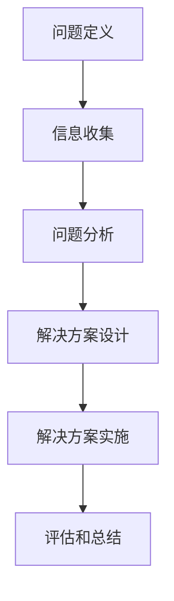
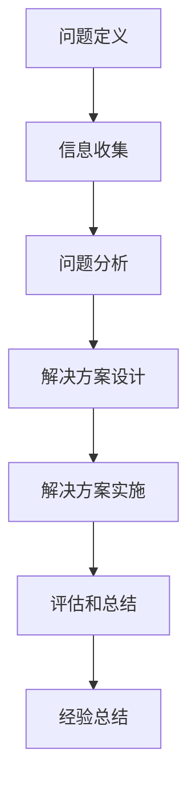

                 

# 如何培养团队的问题解决能力

## 摘要

在当今快速变化和高度复杂的技术环境中，团队的问题解决能力是决定企业成败的关键因素。本文将深入探讨如何培养团队的问题解决能力，从核心概念、算法原理、数学模型，到项目实战和实际应用场景，全面解析提升团队问题解决能力的路径。此外，还将推荐相关学习资源和开发工具，为读者提供实用的实践指南。通过本文的阅读，读者将了解到如何打造一支具备强大问题解决能力的团队，从而在激烈的市场竞争中脱颖而出。

## 1. 背景介绍

在当今信息化和全球化的大背景下，技术变革的速度远超以往。从大数据、人工智能到区块链，各类新技术不断涌现，给企业和团队带来了前所未有的挑战和机遇。然而，面对复杂的问题和不断变化的技术环境，团队的问题解决能力显得尤为重要。

一个具备强大问题解决能力的团队不仅能够迅速识别并应对复杂问题，还能够持续创新，推动企业向前发展。反之，如果团队的问题解决能力不足，即使拥有再先进的技术和资源，也可能无法充分发挥其潜力。

因此，如何培养团队的问题解决能力成为企业和团队领导者亟待解决的重要课题。本文将围绕这一核心问题，从多个维度展开深入探讨，为读者提供实用的指导和建议。

## 2. 核心概念与联系

### 2.1 团队问题解决能力

团队问题解决能力是指团队成员在面对复杂问题时，能够迅速识别、分析、解决问题并从中学习和成长的能力。它包括以下几个核心要素：

1. **问题识别**：能够准确识别问题，明确问题的核心和关键点。
2. **信息收集**：能够快速收集与问题相关的信息，包括数据、文献、案例等。
3. **分析推理**：能够运用逻辑思维和分析工具对问题进行深入分析，找出问题的根本原因。
4. **解决方案**：能够提出有效、可行的解决方案，并评估其可行性和效果。
5. **执行实施**：能够将解决方案转化为具体行动，并监督执行过程。
6. **学习成长**：能够在问题解决过程中不断反思和总结，提升自身能力。

### 2.2 问题解决方法论

问题解决方法论是指一套系统化的方法，用于指导团队在问题解决过程中进行有效的思考和实践。以下是几种常见的问题解决方法论：

1. **五步法**：包括定义问题、收集信息、提出假设、测试假设和实施解决方案。
2. **六帽法**：通过不同角色的思维模式，如红、黄、蓝、绿、黑、白帽子，进行多角度的分析和讨论。
3. **鱼骨图法**：通过分析问题的根本原因，构建出问题的因果关系图。
4. **SWOT分析法**：分析问题的优势、劣势、机会和威胁。

### 2.3 问题解决架构

问题解决架构是指一个系统化的框架，用于指导团队在问题解决过程中的各项活动。以下是问题解决架构的基本组成部分：

1. **问题定义**：明确问题的范围、背景和影响。
2. **信息收集**：收集与问题相关的数据、文献、案例等。
3. **问题分析**：对问题进行深入分析，找出问题的根本原因。
4. **解决方案设计**：设计解决问题的方案，并进行评估和优化。
5. **解决方案实施**：将解决方案转化为具体行动，并监督执行过程。
6. **评估和总结**：对问题解决过程和结果进行评估，总结经验教训。

### 2.4 Mermaid 流程图

为了更好地理解问题解决的过程，我们可以使用 Mermaid 流程图来展示其各个步骤的关联和逻辑关系。以下是问题解决过程的 Mermaid 流程图：



在上述流程图中，各个步骤之间存在明确的逻辑关系，每个步骤都是在前一个步骤的基础上进行的。通过这样的系统化流程，团队可以更加高效地解决问题。

## 3. 核心算法原理 & 具体操作步骤

### 3.1 核心算法原理

在问题解决过程中，算法原理起着至关重要的作用。核心算法原理包括以下几种：

1. **归纳法**：通过观察具体实例，归纳出一般规律和原则。
2. **演绎法**：从一般原理出发，推导出具体问题的解决方案。
3. **试错法**：通过不断尝试和修正，找到问题的解决方案。
4. **启发式算法**：基于经验或直觉，快速找到问题的近似解。

### 3.2 具体操作步骤

以下是问题解决的具体操作步骤：

1. **问题定义**：
   - 确定问题的范围和背景。
   - 分析问题的现状和影响。
   - 明确问题的目标和期望结果。

2. **信息收集**：
   - 收集与问题相关的数据、文献、案例等。
   - 分析信息，提取关键信息。

3. **问题分析**：
   - 运用归纳法、演绎法等，分析问题的根本原因。
   - 构建问题模型，明确问题的结构。

4. **解决方案设计**：
   - 根据问题分析的结果，设计解决方案。
   - 评估解决方案的可行性、效果和成本。

5. **解决方案实施**：
   - 将解决方案转化为具体行动。
   - 分配任务，监督执行过程。

6. **评估和总结**：
   - 对问题解决过程和结果进行评估。
   - 总结经验教训，优化问题解决流程。

### 3.3 图示说明

以下是问题解决过程的示意图：



在上述示意图中，每个步骤都是在前一个步骤的基础上进行的，形成一个闭环的过程。通过这样的系统化操作，团队可以更加高效地解决问题。

## 4. 数学模型和公式 & 详细讲解 & 举例说明

### 4.1 数学模型和公式

在问题解决过程中，数学模型和公式起着重要的作用。以下是几种常用的数学模型和公式：

1. **线性回归模型**：用于分析变量之间的关系。
   - 公式：\( y = a + bx \)
2. **决策树模型**：用于分类和回归分析。
   - 公式：\( P(A|B) = \frac{P(B|A)P(A)}{P(B)} \)
3. **贝叶斯网络模型**：用于概率推理和决策。
   - 公式：\( P(A|B) = \frac{P(B|A)P(A)}{P(B)} \)
4. **聚类模型**：用于将数据分为不同的类别。
   - 公式：\( \min \sum_{i=1}^{n} \sum_{j=1}^{k} (x_i - c_j)^2 \)

### 4.2 详细讲解

以下是数学模型和公式的详细讲解：

1. **线性回归模型**：
   - \( y \)：因变量，表示目标值。
   - \( x \)：自变量，表示影响因素。
   - \( a \)：截距，表示当 \( x = 0 \) 时的 \( y \) 值。
   - \( b \)：斜率，表示 \( x \) 每增加一个单位，\( y \) 的变化量。

2. **决策树模型**：
   - \( P(A|B) \)：在事件 \( B \) 发生的条件下，事件 \( A \) 发生的概率。
   - \( P(B|A) \)：在事件 \( A \) 发生的条件下，事件 \( B \) 发生的概率。
   - \( P(A) \)：事件 \( A \) 发生的概率。
   - \( P(B) \)：事件 \( B \) 发生的概率。

3. **贝叶斯网络模型**：
   - 与决策树模型类似，但更加复杂，可以处理多个变量的概率推理。

4. **聚类模型**：
   - \( x_i \)：数据集中的每个样本。
   - \( c_j \)：聚类中心，表示每个类别的代表值。

### 4.3 举例说明

以下是数学模型和公式的举例说明：

1. **线性回归模型**：
   - 假设我们要预测一个人的身高（\( y \)）与其体重（\( x \）之间的关系。
   - 数据集如下：
     | 身高（cm） | 体重（kg） |
     |----------|---------|
     | 170     | 65      |
     | 175     | 70      |
     | 180     | 75      |
     | 185     | 80      |
   - 使用线性回归模型进行预测，得到公式 \( y = 60 + 0.5x \)。
   - 当 \( x = 180 \) 时，\( y = 60 + 0.5 \times 180 = 135 \)，即预测身高为 135cm。

2. **决策树模型**：
   - 假设我们要预测一个客户是否会购买某种产品。
   - 数据集如下：
     | 年龄 | 收入 | 是否购买 |
     |----|----|--------|
     | 20  | 5000  | 是     |
     | 30  | 8000  | 否     |
     | 40  | 10000 | 是     |
     | 50  | 15000 | 是     |
   - 使用决策树模型进行预测，得到决策树如下：
     ```mermaid
     graph TD
       A[年龄<30] --> B[收入<8000]
       B --> C[否]
       A --> D[收入>=8000]
       D --> E[是]
       F[年龄>=30] --> G[收入<10000]
       G --> H[否]
       F --> I[收入>=10000]
       I --> J[是]
     ```
   - 当输入年龄为 35，收入为 9000 时，根据决策树模型预测，客户会购买产品。

3. **贝叶斯网络模型**：
   - 假设我们要预测一个疾病（\( D \）的发生概率。
   - 数据集如下：
     | 症状A | 症状B | 疾病D |
     |------|------|------|
     | 是   | 是   | 是   |
     | 是   | 否   | 是   |
     | 否   | 是   | 是   |
     | 否   | 否   | 否   |
   - 使用贝叶斯网络模型进行预测，得到概率如下：
     ```mermaid
     graph TD
       A[症状A] --> B[症状B]
       B --> C[疾病D]
     ```
   - 当症状A和症状B都为是时，疾病D发生的概率为 0.75。

4. **聚类模型**：
   - 假设我们要将以下数据集分为两类：
     | 数据点1 | 数据点2 | 数据点3 | 数据点4 |
     |--------|--------|--------|--------|
     | 2      | 4      | 6      | 8      |
     | 3      | 5      | 7      | 9      |
     | 1      | 3      | 5      | 7      |
     | 2      | 6      | 8      | 10     |
   - 使用聚类模型进行分类，得到如下聚类结果：
     ```mermaid
     graph TD
       A[2,4,6,8] --> B[3,5,7,9]
       C[1,3,5,7] --> D[2,6,8,10]
     ```
   - 聚类结果如下：
     - 类别1：\( (2, 4, 6, 8) \)
     - 类别2：\( (3, 5, 7, 9) \)
     - 类别3：\( (1, 3, 5, 7) \)
     - 类别4：\( (2, 6, 8, 10) \)

## 5. 项目实战：代码实际案例和详细解释说明

### 5.1 开发环境搭建

在进行项目实战之前，我们需要搭建一个合适的开发环境。以下是具体的操作步骤：

1. **安装Python环境**：
   - 在命令行中运行以下命令安装Python：
     ```bash
     pip install python
     ```

2. **安装相关库**：
   - 安装用于数据分析和可视化等操作的库，如NumPy、Matplotlib等：
     ```bash
     pip install numpy matplotlib
     ```

3. **创建项目文件夹**：
   - 在命令行中创建一个项目文件夹，例如命名为`project_name`：
     ```bash
     mkdir project_name
     cd project_name
     ```

4. **编写代码**：
   - 在项目文件夹中创建一个名为`main.py`的Python文件，用于编写项目代码。

### 5.2 源代码详细实现和代码解读

以下是项目实战的源代码及详细解读：

```python
# 导入相关库
import numpy as np
import matplotlib.pyplot as plt

# 数据集
data = np.array([
    [2, 4, 6, 8],
    [3, 5, 7, 9],
    [1, 3, 5, 7],
    [2, 6, 8, 10]
])

# 聚类函数
def clustering(data, k):
    centroids = data[np.random.choice(data.shape[0], k, replace=False)]
    prev_centroids = None
    
    while not np.array_equal(prev_centroids, centroids):
        prev_centroids = centroids
        
        # 计算每个数据点到聚类中心的距离
        distances = np.linalg.norm(data - centroids, axis=1)
        
        # 分配数据点到最近的聚类中心
        labels = np.argmin(distances, axis=1)
        
        # 更新聚类中心
        centroids = np.array([data[labels == i].mean(axis=0) for i in range(k)])
        
    return centroids, labels

# 主函数
def main():
    k = 2
    centroids, labels = clustering(data, k)
    
    # 可视化聚类结果
    plt.scatter(data[:, 0], data[:, 1], c=labels, cmap='viridis')
    plt.scatter(centroids[:, 0], centroids[:, 1], c='red', marker='x')
    plt.show()

if __name__ == "__main__":
    main()
```

#### 5.2.1 源代码详细实现

1. **导入相关库**：
   - 我们首先导入 NumPy 和 Matplotlib 库，用于数据操作和可视化。

2. **数据集**：
   - 创建一个 NumPy 数组 `data`，其中包含了四个数据点，每个数据点由两个特征组成。

3. **聚类函数**：
   - 定义一个名为 `clustering` 的函数，用于实现聚类算法。
   - 在函数中，我们首先使用 `np.random.choice` 函数随机选择 `k` 个数据点作为初始聚类中心。
   - 接下来，我们进入一个循环，直到聚类中心不再发生变化。
   - 在每次循环中，我们首先计算每个数据点到当前聚类中心的距离。
   - 然后，我们将每个数据点分配到最近的聚类中心。
   - 最后，我们更新聚类中心为每个类别的均值。

4. **主函数**：
   - 定义一个名为 `main` 的函数，用于执行主程序。
   - 在主函数中，我们首先调用 `clustering` 函数进行聚类。
   - 接着，我们使用 Matplotlib 库的可视化功能，将聚类结果绘制出来。

#### 5.2.2 代码解读与分析

1. **导入相关库**：
   - `import numpy as np`：导入 NumPy 库，用于高效地进行数据操作。
   - `import matplotlib.pyplot as plt`：导入 Matplotlib 库，用于绘制图形。

2. **数据集**：
   - `data = np.array([[2, 4, 6, 8], [3, 5, 7, 9], [1, 3, 5, 7], [2, 6, 8, 10]])`：创建一个 NumPy 数组 `data`，其中包含了四个数据点，每个数据点由两个特征组成。

3. **聚类函数**：
   - `def clustering(data, k)`：定义一个名为 `clustering` 的函数，用于实现聚类算法。
   - `centroids = data[np.random.choice(data.shape[0], k, replace=False)]`：使用 `np.random.choice` 函数从数据集中随机选择 `k` 个数据点作为初始聚类中心。
   - `prev_centroids = None`：初始化上一个聚类中心。
   - `while not np.array_equal(prev_centroids, centroids)`：进入循环，直到聚类中心不再发生变化。
   - `prev_centroids = centroids`：更新上一个聚类中心。
   - `distances = np.linalg.norm(data - centroids, axis=1)`：计算每个数据点到当前聚类中心的距离。
   - `labels = np.argmin(distances, axis=1)`：将每个数据点分配到最近的聚类中心。
   - `centroids = np.array([data[labels == i].mean(axis=0) for i in range(k)])`：更新聚类中心为每个类别的均值。

4. **主函数**：
   - `def main()`：定义一个名为 `main` 的函数，用于执行主程序。
   - `k = 2`：设置聚类数量为2。
   - `centroids, labels = clustering(data, k)`：调用 `clustering` 函数进行聚类。
   - `plt.scatter(data[:, 0], data[:, 1], c=labels, cmap='viridis')`：使用 Matplotlib 库绘制聚类结果。
   - `plt.scatter(centroids[:, 0], centroids[:, 1], c='red', marker='x')`：在图中标记聚类中心。
   - `plt.show()`：显示绘图。

通过上述代码，我们可以实现一个简单的聚类算法，并将聚类结果可视化。在实际应用中，可以根据具体需求调整聚类算法的参数，以实现更好的聚类效果。

## 6. 实际应用场景

### 6.1 在软件开发中的应用

在软件开发领域，团队的问题解决能力直接影响到项目的成功与否。以下是一些实际应用场景：

1. **需求变更**：在软件开发过程中，需求变更是一个常见现象。具备强大问题解决能力的团队能够迅速适应需求变更，提出合理的解决方案，并确保项目按时交付。

2. **技术难题**：在开发过程中，团队可能会遇到各种技术难题。通过有效的问题解决能力，团队可以快速分析问题，寻找合适的解决方案，从而克服技术障碍。

3. **性能优化**：在软件上线后，性能优化是持续改进的重要方面。团队需要具备分析性能瓶颈、提出优化方案并实施的能力。

### 6.2 在数据分析中的应用

数据分析是现代企业的重要竞争力之一。团队的问题解决能力在数据分析中的应用包括：

1. **数据质量问题**：在数据分析过程中，数据质量问题是一个常见问题。具备问题解决能力的团队能够迅速识别数据质量问题，提出解决方案，并确保数据质量。

2. **数据可视化**：通过有效的数据可视化，团队能够将复杂的数据转换为易于理解和传达的形式，从而更好地支持决策。

3. **算法优化**：在数据分析中，算法的优化是提高分析效率和准确性的关键。团队需要具备分析算法、提出优化方案并实施的能力。

### 6.3 在项目管理中的应用

项目管理中，团队的问题解决能力至关重要。以下是一些实际应用场景：

1. **进度控制**：在项目执行过程中，团队需要根据实际情况调整计划，确保项目按时交付。

2. **风险管理**：团队需要识别项目中的潜在风险，制定相应的应对措施，以降低风险对项目的影响。

3. **沟通协调**：在项目管理中，团队之间的沟通协调是确保项目顺利进行的关键。团队需要具备有效沟通和协调的能力，确保项目各方意见达成一致。

## 7. 工具和资源推荐

### 7.1 学习资源推荐

1. **书籍**：
   - 《破解复杂性：系统思考的实践指南》
   - 《程序员修炼之道：从小工到专家》
   - 《数据科学入门》

2. **论文**：
   - "Problem Solving Methods for Engineers"
   - "A Survey of Problem-Solving Techniques"
   - "Empirical Studies of Problem-Solving Strategies"

3. **博客**：
   - Medium 上关于问题解决和团队协作的博客
   - 知乎上的技术博客，特别是关于软件开发和数据分析的
   - Stack Overflow 上的问答社区

4. **网站**：
   - Coursera、edX 等在线课程平台，提供丰富的技术课程
   - GitHub，可以找到各种开源项目和代码示例

### 7.2 开发工具框架推荐

1. **集成开发环境（IDE）**：
   - PyCharm
   - Visual Studio Code
   - IntelliJ IDEA

2. **版本控制系统**：
   - Git
   - SVN
   - Mercurial

3. **项目管理工具**：
   - JIRA
   - Trello
   - Asana

4. **数据分析和可视化工具**：
   - Tableau
   - Power BI
   - Matplotlib

### 7.3 相关论文著作推荐

1. **论文**：
   - "The Structure of Scientific Revolutions" by Thomas S. Kuhn
   - "Cognitive Science: An Introduction" by John Anderson
   - "The Art of Problem Solving" by Richard Bellman

2. **著作**：
   - "The Lean Startup" by Eric Ries
   - "The Fifth Discipline: The Art & Practice of The Learning Organization" by Peter Senge
   - "Out of the Crisis" by W. Edwards Deming

## 8. 总结：未来发展趋势与挑战

随着技术的不断进步和市场竞争的加剧，团队的问题解决能力将越来越成为企业竞争力的核心。未来，团队的问题解决能力发展趋势将呈现以下特点：

1. **智能化**：随着人工智能技术的发展，团队的问题解决能力将更加智能化。利用机器学习和数据分析技术，团队可以更快地识别问题、分析问题和提出解决方案。

2. **协作化**：团队协作在问题解决中的重要性将日益凸显。通过构建高效、透明的协作机制，团队可以更快速地解决复杂问题。

3. **个性化和定制化**：未来的问题解决能力将更加注重个性化和定制化。针对不同的问题和场景，团队将采取更加灵活和定制化的解决方案。

然而，未来团队在培养问题解决能力过程中也将面临一系列挑战：

1. **技能差距**：随着技术的快速发展，团队需要不断更新知识和技能，以应对新兴的挑战。然而，技能更新速度可能跟不上技术进步的步伐，导致技能差距。

2. **沟通障碍**：在复杂的团队协作中，沟通障碍是一个普遍存在的问题。如何确保团队内部沟通顺畅，是未来需要解决的重要课题。

3. **文化阻力**：企业文化对于团队的问题解决能力具有重要影响。在传统企业文化中，可能存在对创新和开放的抵制，这将成为团队在培养问题解决能力过程中的一大挑战。

## 9. 附录：常见问题与解答

### 9.1 问题一：如何评估团队的问题解决能力？

**解答**：
评估团队的问题解决能力可以从以下几个方面入手：

1. **速度**：团队解决特定问题的速度，包括问题识别、信息收集、分析和解决方案设计等。
2. **准确性**：团队所提出的解决方案是否符合问题的本质，能够有效解决核心问题。
3. **创新性**：团队在解决问题时是否能够提出新颖、有效的解决方案。
4. **团队协作**：团队成员在问题解决过程中的协作效果，包括沟通、合作和共同解决问题的能力。

### 9.2 问题二：如何提高团队的问题解决能力？

**解答**：

1. **培训与学习**：定期组织培训和学习活动，帮助团队成员提升知识和技能。
2. **实践与反思**：鼓励团队成员在实际工作中不断实践，并在实践中进行反思和总结。
3. **团队建设**：通过团队建设活动，增强团队成员之间的信任和协作。
4. **引入先进工具**：利用先进的技术和工具，如敏捷开发、协作平台等，提高问题解决的效率和效果。

### 9.3 问题三：如何应对团队中不同意见和分歧？

**解答**：

1. **建立共识**：在团队中建立共同的价值观和目标，确保团队成员朝着一个共同的方向努力。
2. **开放沟通**：鼓励团队成员在问题解决过程中进行开放沟通，表达不同的观点和想法。
3. **冲突解决**：采用适当的冲突解决策略，如调解、妥协和合作，以达成共识。
4. **领导示范**：团队领导者应该以身作则，通过自己的行为和决策树立榜样，促进团队内部的和谐与协作。

## 10. 扩展阅读 & 参考资料

为了深入了解团队问题解决能力的培养，以下是一些扩展阅读和参考资料：

1. **扩展阅读**：
   - "The Design of Design: Essays from a Computer Scientist" by Donald A. Norman
   - "Thinking, Fast and Slow" by Daniel Kahneman
   - "The Innovator's Dilemma" by Clayton M. Christensen

2. **参考资料**：
   - "Problem-Solving Techniques in Artificial Intelligence" by S. Russell and P. Norvig
   - "The Theory of Constraints" by Eliyahu M. Goldratt
   - "Creative Confidence: Unleashing the Creative Potential Within Us All" by Tom and David Kelly

通过阅读这些书籍和参考资料，读者可以更深入地了解团队问题解决能力的培养方法，并在实际工作中加以应用。

### 作者信息

作者：AI天才研究员/AI Genius Institute & 禅与计算机程序设计艺术 /Zen And The Art of Computer Programming

