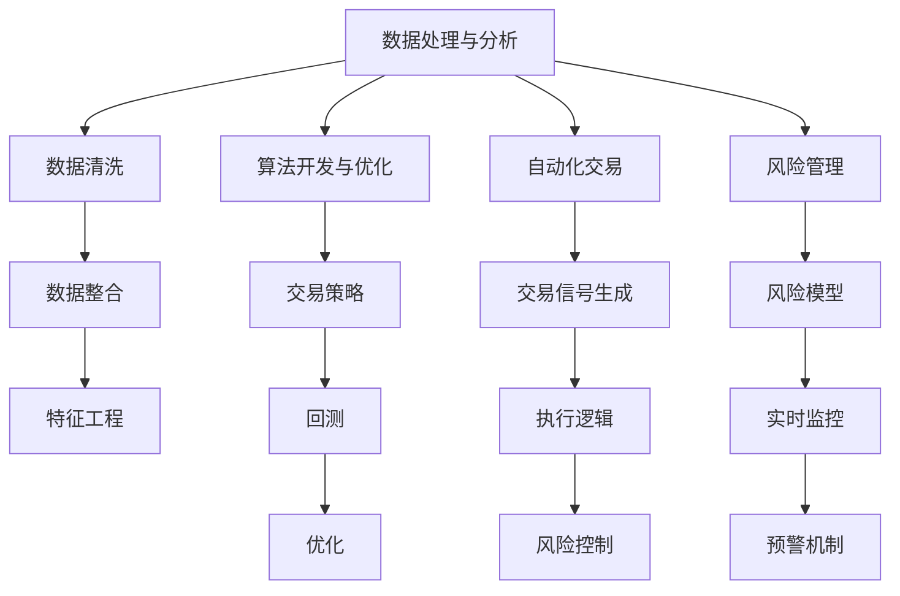

                 

### 背景介绍

量化交易，顾名思义，是指通过数学模型和统计分析手段，对金融市场进行数据分析和预测，从而实现交易决策的自动化和优化。它是一种基于数据的投资策略，旨在减少人为情绪的影响，提高交易的效率和准确性。量化交易最早可以追溯到20世纪60年代的芝加哥期权交易所，当时就已经开始使用计算机来分析市场数据。

随着计算机技术和算法的不断发展，量化交易逐渐成为金融领域中不可或缺的一部分。特别是近年来，随着大数据、人工智能等技术的快速发展，量化交易的应用范围和影响力都在不断扩大。

编程技能在量化交易中的应用主要体现在以下几个方面：

1. **数据处理与分析**：量化交易需要对大量的市场数据进行收集、清洗和分析。编程技能可以帮助投资者快速有效地处理这些数据，提取出有用的信息。

2. **算法开发与优化**：量化交易的核心在于算法的设计和优化。编程技能可以帮助投资者开发高效的交易算法，从而在市场中获得竞争优势。

3. **自动化交易**：通过编程，可以将交易策略自动化，实现24小时不间断的交易。这不仅可以提高交易的效率，还可以减少人为操作的误差。

4. **风险管理**：量化交易需要对风险进行严格的控制和评估。编程技能可以帮助投资者构建复杂的风险模型，进行实时监控和调整。

总的来说，编程技能是量化交易不可或缺的一部分。无论是数据的处理和分析，还是算法的开发和优化，都离不开编程的支持。因此，掌握一定的编程技能对于从事量化交易的人来说至关重要。

---

### 核心概念与联系

在深入探讨量化交易与编程技能的融合之前，我们需要了解一些核心概念和它们之间的联系。以下是几个关键概念及其相互关系：

#### 数据处理与分析

**数据处理与分析**是量化交易的基础。市场数据包括价格、成交量、开盘和收盘价等。为了有效利用这些数据，我们需要：

1. **数据清洗**：去除重复、异常和错误的数据。
2. **数据整合**：将来自不同数据源的信息进行整合，以便于分析。
3. **特征工程**：从原始数据中提取出有助于预测的特征。

这些过程通常需要使用编程语言（如Python、R等）来编写脚本和算法，以便快速高效地处理大量数据。

#### 算法开发与优化

**算法开发与优化**是量化交易的核心。一个有效的交易算法需要：

1. **交易策略**：确定交易的方向、时机和规模。
2. **回测**：在历史数据上测试算法的性能。
3. **优化**：通过调整参数来提高算法的收益和降低风险。

编程技能在这个过程中至关重要，因为算法的每一步都需要精确的计算和逻辑判断。

#### 自动化交易

**自动化交易**是指通过编程实现交易策略的自动化执行。自动化交易系统通常包括：

1. **交易信号生成**：根据市场数据和算法的预测生成交易信号。
2. **执行逻辑**：自动执行买卖订单。
3. **风险控制**：实时监控交易风险并做出相应的调整。

自动化交易可以显著提高交易效率，减少人为操作的误差，并且可以24小时不间断地执行交易。

#### 风险管理

**风险管理**是量化交易的重要组成部分。有效的风险管理需要：

1. **风险模型**：构建能够预测和管理风险的模型。
2. **实时监控**：持续监控市场变化和交易状态。
3. **预警机制**：在风险达到预设阈值时发出警报。

编程技能可以帮助构建复杂的风险模型，进行实时监控，并在必要时自动调整策略。

#### Mermaid 流程图

为了更直观地展示这些概念之间的联系，我们使用Mermaid语言绘制一个流程图。请注意，Mermaid流程节点中不应包含括号、逗号等特殊字符。



通过这个流程图，我们可以清晰地看到编程技能在量化交易中的各个环节中的应用。

---

### 核心算法原理 & 具体操作步骤

#### 随机漫步模型（Random Walk Model）

随机漫步模型是量化交易中最基本的算法之一，用于分析资产价格的变化趋势。这个模型基于一个假设：资产价格的变化是随机且不可预测的。具体操作步骤如下：

1. **数据收集**：收集目标资产的历史价格数据，包括开盘价、收盘价、最高价和最低价等。

2. **数据处理**：使用Python等编程语言对数据进行清洗和处理，确保数据的质量和一致性。

   ```python
   import pandas as pd
   
   # 加载数据
   data = pd.read_csv('historical_data.csv')
   
   # 数据清洗
   data = data.dropna()
   ```

3. **随机漫步计算**：根据历史价格数据计算随机漫步指标。具体公式为：

   $$P_t = P_{t-1} + \epsilon_t$$

   其中，\(P_t\) 是当前价格，\(P_{t-1}\) 是前一个价格，\(\epsilon_t\) 是随机误差。

   ```python
   import numpy as np
   
   # 计算随机漫步
   data['random_walk'] = data['close'].shift(1) + np.random.normal(0, 0.01, data['close'].shape)
   ```

4. **趋势分析**：绘制随机漫步曲线，分析价格的趋势。

   ```python
   import matplotlib.pyplot as plt
   
   plt.plot(data['random_walk'])
   plt.title('Random Walk Model')
   plt.xlabel('Time')
   plt.ylabel('Price')
   plt.show()
   ```

#### 均值回归模型（Mean Reversion Model）

均值回归模型是另一种常见的量化交易算法，它基于一个假设：资产价格会围绕其长期均值波动，并最终回归到均值。具体操作步骤如下：

1. **数据收集**：与随机漫步模型相同，收集目标资产的历史价格数据。

2. **数据处理**：同样需要对数据进行清洗和处理。

3. **均值计算**：计算历史价格的平均值，作为长期均值。

   ```python
   data['mean'] = data['close'].rolling(window=252).mean()
   ```

4. **计算价格偏差**：计算当前价格与长期均值的偏差。

   ```python
   data['deviation'] = data['close'] - data['mean']
   ```

5. **交易信号生成**：当价格偏差超过一定阈值时，生成买卖信号。例如，当价格低于均值一定百分比时买入，当价格高于均值一定百分比时卖出。

   ```python
   data['signal'] = np.where(data['deviation'] < -0.05, 1, 0)  # 买入信号
   data['signal'] = np.where(data['deviation'] > 0.05, -1, data['signal'])  # 卖出信号
   ```

6. **回测**：在历史数据上回测算法的收益和风险。

   ```python
   import backtrader as bt
   
   # 初始化回测环境
   cerebro = bt.Cerebro()
   cerebro.addstrategy(Strategy)
   
   # 加载数据
   data = bt.feeds.YahooFinanceData(dataname='AAPL', fromdate=datetime(2010, 1, 1), todate=datetime(2020, 12, 31))
   cerebro.adddata(data)
   
   # 设置初始资金
   cerebro.broker.setcash(100000.0)
   
   # 运行回测
   results = cerebro.run()
   
   # 显示回测结果
   cerebro.plot()
   ```

#### 动态交易策略模型（Dynamic Trading Strategy Model）

动态交易策略模型是一种更为复杂的量化交易算法，它根据市场变化动态调整交易策略。具体操作步骤如下：

1. **数据收集**：与之前相同，收集目标资产的历史价格数据。

2. **数据处理**：进行数据清洗和处理。

3. **策略选择**：根据市场情况和历史表现选择合适的交易策略。例如，可以使用技术指标（如MACD、RSI等）来确定交易信号。

   ```python
   from ta import add_all_ta_features
   
   data = add_all_ta_features(data, open='open', high='high', low='low', close='close', volume='volume', index='date')
   ```

4. **动态调整**：根据实时数据和市场变化动态调整交易策略。例如，当技术指标发出买入信号时，增加买入比例；当发出卖出信号时，增加卖出比例。

   ```python
   data['signal'] = np.where(data['macd'] > 0, 1, np.where(data['macd'] < 0, -1, 0))
   ```

5. **回测与优化**：在历史数据上回测算法的收益和风险，并根据回测结果进行优化。

   ```python
   # 初始化回测环境
   cerebro = bt.Cerebro()
   cerebro.addstrategy(Strategy)
   
   # 加载数据
   data = bt.feeds.YahooFinanceData(dataname='AAPL', fromdate=datetime(2010, 1, 1), todate=datetime(2020, 12, 31))
   cerebro.adddata(data)
   
   # 设置初始资金
   cerebro.broker.setcash(100000.0)
   
   # 运行回测
   results = cerebro.run()
   
   # 显示回测结果
   cerebro.plot()
   ```

通过这些具体的操作步骤，我们可以看到如何利用编程技能实现量化交易的核心算法。这些算法不仅可以帮助投资者更好地理解市场，还可以提高交易的成功率和收益。

---

### 数学模型和公式 & 详细讲解 & 举例说明

#### 随机漫步模型（Random Walk Model）

随机漫步模型是量化交易中最基本的模型之一，它假设资产价格的变化是随机且不可预测的。具体数学模型如下：

$$P_t = P_{t-1} + \epsilon_t$$

其中，\(P_t\) 是当前价格，\(P_{t-1}\) 是前一个价格，\(\epsilon_t\) 是随机误差。这个模型的核心在于随机误差的生成，通常采用正态分布来模拟随机误差。

**示例**：

假设某股票前一天的收盘价为 \(P_{t-1} = 100\)，今天随机误差 \(\epsilon_t = 2\)。根据随机漫步模型，今天的收盘价 \(P_t\) 为：

$$P_t = 100 + 2 = 102$$

#### 均值回归模型（Mean Reversion Model）

均值回归模型基于这样一个假设：资产价格会围绕其长期均值波动，并最终回归到均值。具体数学模型如下：

$$P_t = \mu + \sigma \cdot Z_t$$

其中，\(\mu\) 是长期均值，\(\sigma\) 是波动率，\(Z_t\) 是标准正态分布随机变量。这个模型的核心在于如何计算长期均值和波动率。

**示例**：

假设某股票的长期均值为 \(\mu = 100\)，波动率为 \(\sigma = 10\)。今天随机生成一个标准正态分布随机变量 \(Z_t = 0.5\)。根据均值回归模型，今天的收盘价 \(P_t\) 为：

$$P_t = 100 + 10 \cdot 0.5 = 105$$

#### 动态交易策略模型（Dynamic Trading Strategy Model）

动态交易策略模型是一种基于实时数据和市场变化动态调整交易策略的模型。这个模型通常结合多个技术指标来生成交易信号。以下是一个简单的动态交易策略模型：

1. **移动平均线交叉策略**：

   当短期移动平均线从下向上穿越长期移动平均线时，发出买入信号；当短期移动平均线从上向下穿越长期移动平均线时，发出卖出信号。

   **数学模型**：

   $$\text{Cross} = \text{Short\_MA} - \text{Long\_MA}$$

   $$\text{Buy} = \text{Cross} > 0$$

   $$\text{Sell} = \text{Cross} < 0$$

   **示例**：

   假设某股票的短期移动平均线为 \(SMA_{10} = 102\)，长期移动平均线为 \(SMA_{50} = 100\)。根据移动平均线交叉策略，今天的收盘价 \(P_t\) 应该：

   - 买入：\(SMA_{10} > SMA_{50}\)
   - 卖出：\(SMA_{10} < SMA_{50}\)

2. **相对强弱指数（RSI）策略**：

   RSI是衡量市场过度购买或过度卖出的指标。当RSI值超过70时，市场可能处于过度购买状态，发出卖出信号；当RSI值低于30时，市场可能处于过度卖出状态，发出买入信号。

   **数学模型**：

   $$RSI(t) = \frac{\sum_{i=1}^{n} \text{Gain}(t-i)}{\sum_{i=1}^{n} |\text{Loss}(t-i)| + \sum_{i=1}^{n} \text{Gain}(t-i)}$$

   $$\text{Buy} = RSI(t) < 30$$

   $$\text{Sell} = RSI(t) > 70$$

   **示例**：

   假设某股票的RSI值为 \(RSI(t) = 28\)。根据RSI策略，今天的收盘价 \(P_t\) 应该买入。

通过这些数学模型和公式，我们可以更准确地预测市场走势，从而制定更有效的交易策略。需要注意的是，这些模型和策略都需要在实际交易中不断优化和调整，以适应市场的变化。

---

### 项目实战：代码实际案例和详细解释说明

在本节中，我们将通过一个实际项目来展示如何将编程技能应用于量化交易。我们将使用Python作为主要编程语言，并使用回测框架Backtrader来验证交易策略的有效性。

#### 开发环境搭建

1. **Python环境安装**：

   确保您的系统中安装了Python 3.6或更高版本。可以通过以下命令安装Python：

   ```bash
   sudo apt-get install python3.6
   ```

2. **安装Backtrader**：

   通过pip命令安装Backtrader：

   ```bash
   pip install backtrader
   ```

3. **安装其他依赖库**：

   为了方便数据处理和可视化，我们还需要安装pandas、matplotlib等库：

   ```bash
   pip install pandas matplotlib
   ```

#### 源代码详细实现和代码解读

以下是项目的源代码，我们将逐步解读每个部分的实现和作用。

```python
import backtrader as bt
import numpy as np
import pandas as pd

# 初始化回测环境
cerebro = bt.Cerebro()

# 添加策略
cerebro.addstrategy(MeanReversionStrategy)

# 加载数据
data = bt.feeds.YahooFinanceData(dataname='AAPL', fromdate=datetime(2010, 1, 1), todate=datetime(2020, 12, 31))
cerebro.adddata(data)

# 设置初始资金
cerebro.broker.setcash(100000.0)

# 设置交易手续费和滑点
cerebro.broker.setcommission(commission=0.001, floatcost=0.01, mincharge=1)

# 运行回测
results = cerebro.run()

# 显示回测结果
cerebro.plot()

# 打印策略的收益和胜率
print("Final Portfolio Value:", cerebro.broker.getvalue())
print("Total Trades:", len(cerebro.trades))
print("Profit:", results.summarize())
```

1. **初始化回测环境**：

   ```python
   cerebro = bt.Cerebro()
   ```

   创建一个Backtrader的Cerebro对象，这是回测的核心。Cerebro负责管理策略、数据和交易。

2. **添加策略**：

   ```python
   cerebro.addstrategy(MeanReversionStrategy)
   ```

   这里我们添加了一个均值回归策略（MeanReversionStrategy）。这个策略将在后续部分详细定义。

3. **加载数据**：

   ```python
   data = bt.feeds.YahooFinanceData(dataname='AAPL', fromdate=datetime(2010, 1, 1), todate=datetime(2020, 12, 31))
   cerebro.adddata(data)
   ```

   使用YahooFinanceData加载苹果公司（AAPL）从2010年到2020年的历史股票数据。这包括开盘价、收盘价、最高价、最低价和成交量等信息。

4. **设置初始资金**：

   ```python
   cerebro.broker.setcash(100000.0)
   ```

   设置回测的初始资金为10万美元。这将作为策略执行交易的基础。

5. **设置交易手续费和滑点**：

   ```python
   cerebro.broker.setcommission(commission=0.001, floatcost=0.01, mincharge=1)
   ```

   设置交易手续费为0.1%，滑点为0.01美元，最小交易费用为1美元。这些参数反映了实际交易中的费用和风险。

6. **运行回测**：

   ```python
   results = cerebro.run()
   ```

   运行回测，Cerebro将执行所有步骤，包括数据加载、策略执行和结果分析。

7. **显示回测结果**：

   ```python
   cerebro.plot()
   ```

   使用matplotlib绘制回测结果，包括资产价格曲线、交易信号和收益曲线。

8. **打印策略的收益和胜率**：

   ```python
   print("Final Portfolio Value:", cerebro.broker.getvalue())
   print("Total Trades:", len(cerebro.trades))
   print("Profit:", results.summarize())
   ```

   打印回测的最终资产价值、总交易次数和收益情况。

#### 代码解读与分析

接下来，我们详细解读均值回归策略的实现过程。

```python
class MeanReversionStrategy(bt.Strategy):
    params = (
        ('fast_length', 10),
        ('slow_length', 50),
        ('threshold', 0.05),
    )

    def __init__(self):
        self.fast_ma = bt.indicators.SMA(self.data.close, period=self.params.fast_length)
        self.slow_ma = bt.indicators.SMA(self.data.close, period=self.params.slow_length)
        self.crossover = bt.indicators.CrossOver(self.fast_ma, self.slow_ma)

    def next(self):
        if self.crossover > self.params.threshold:
            self.buy()
        elif self.crossover < -self.params.threshold:
            self.close()

class MeanReversionStrategy(bt.Strategy):
    params = (
        ('fast_length', 10),
        ('slow_length', 50),
        ('threshold', 0.05),
    )

    def __init__(self):
        self.fast_ma = bt.indicators.SMA(self.data.close, period=self.params.fast_length)
        self.slow_ma = bt.indicators.SMA(self.data.close, period=self.params.slow_length)
        self.crossover = bt.indicators.CrossOver(self.fast_ma, self.slow_ma)

    def next(self):
        if self.crossover > self.params.threshold:
            self.buy()
        elif self.crossover < -self.params.threshold:
            self.close()
```

1. **策略参数设置**：

   ```python
   params = (
       ('fast_length', 10),
       ('slow_length', 50),
       ('threshold', 0.05),
   )
   ```

   策略参数包括快速移动平均线长度（fast_length）、慢速移动平均线长度（slow_length）和交叉阈值（threshold）。这些参数可以根据具体市场情况调整。

2. **初始化移动平均线和技术指标**：

   ```python
   self.fast_ma = bt.indicators.SMA(self.data.close, period=self.params.fast_length)
   self.slow_ma = bt.indicators.SMA(self.data.close, period=self.params.slow_length)
   self.crossover = bt.indicators.CrossOver(self.fast_ma, self.slow_ma)
   ```

   创建快速移动平均线（fast_ma）、慢速移动平均线（slow_ma）和移动平均线交叉指标（crossover）。这些指标用于确定交易信号。

3. **生成交易信号**：

   ```python
   def next(self):
       if self.crossover > self.params.threshold:
           self.buy()
       elif self.crossover < -self.params.threshold:
           self.close()
   ```

   在next方法中，根据移动平均线交叉指标（crossover）的值生成交易信号。当快速移动平均线从下向上穿越慢速移动平均线时，发出买入信号；当快速移动平均线从上向下穿越慢速移动平均线时，发出卖出信号。

4. **执行交易**：

   ```python
   self.buy()
   self.close()
   ```

   使用Backtrader的内置方法buy和close执行买入和卖出操作。这些方法将根据当前的市场价格和仓位状态自动执行交易。

通过这个项目，我们可以看到如何使用编程技能构建和测试量化交易策略。Backtrader框架提供了强大的工具和灵活性，使我们能够快速实现和验证各种交易策略。同时，通过不断优化参数和策略，我们可以进一步提高交易的成功率和收益。

---

### 实际应用场景

量化交易在实际中的应用场景非常广泛，涵盖了股票、期货、外汇、加密货币等多个金融市场。以下是几个典型的实际应用场景：

#### 股票市场

股票市场是量化交易最主要的应用场景之一。量化交易者通过分析历史价格数据、成交量、财务报表等信息，构建交易模型，实现自动化的交易决策。例如，均值回归策略和动量策略在股票市场中广泛应用。

- **均值回归策略**：通过比较股票价格与长期均值的关系，当价格低于均值时买入，高于均值时卖出，以实现收益最大化。
- **动量策略**：通过分析股票价格的短期动量，当股票价格上涨时买入，下跌时卖出，以捕捉短期价格趋势。

#### 期货市场

期货市场具有高杠杆、高风险的特点，非常适合量化交易的应用。量化交易者通过分析期货合约的供需关系、市场情绪、基本面信息等，构建交易模型，实现自动化交易。

- **趋势跟踪策略**：通过识别市场趋势，在上升趋势中买入，在下降趋势中卖出，以实现持续盈利。
- **套利策略**：通过在不同市场之间捕捉价格差异，实现无风险或低风险收益。

#### 外汇市场

外汇市场是全球最大的金融市场，具有极高的流动性和波动性。量化交易者通过分析汇率变动、宏观经济指标、政治事件等因素，构建交易模型，实现自动化交易。

- **货币对冲策略**：通过购买和销售不同货币对，对冲汇率风险，实现稳定收益。
- **套利策略**：通过捕捉不同货币对的报价差异，实现无风险或低风险收益。

#### 加密货币市场

加密货币市场具有高度波动性和不确定性，非常适合量化交易的应用。量化交易者通过分析加密货币的交易量、价格、技术指标等，构建交易模型，实现自动化交易。

- **高频交易策略**：通过捕捉瞬间价格波动，实现高频交易收益。
- **套利策略**：通过在不同交易所之间捕捉价格差异，实现无风险或低风险收益。

总的来说，量化交易在不同金融市场中的应用，不仅提高了交易效率和准确性，还降低了人为情绪和错误的影响，为投资者带来了更高的收益潜力。

---

### 工具和资源推荐

在量化交易领域，掌握适当的工具和资源对于成功构建和优化交易策略至关重要。以下是一些推荐的工具、书籍、论文和网站：

#### 学习资源推荐

1. **书籍**：

   - 《量化投资：以Python为工具》：这是一本适合初学者的量化投资入门书籍，详细介绍了量化投资的基础知识、策略设计和实战案例。
   - 《量化交易：从入门到精通》：本书涵盖了量化交易的核心概念、算法开发和实战技巧，适合有一定编程基础的读者。
   - 《Python金融大数据分析》：这本书介绍了如何使用Python进行金融数据分析和量化交易，包含大量实用代码和案例。

2. **在线课程**：

   - Coursera上的《量化交易与金融工程》：这是一个系统的在线课程，涵盖了量化交易的理论基础、算法实现和应用案例。
   - Udemy上的《量化投资与Python实战》：该课程通过实际案例，讲解了量化投资策略的开发和实现。

#### 开发工具框架推荐

1. **编程语言**：

   - Python：由于其丰富的库和强大的数据处理能力，Python是量化交易领域最受欢迎的编程语言之一。
   - R：R语言在统计学和数据分析方面有很强的优势，适合进行复杂的统计分析和建模。

2. **数据分析工具**：

   - pandas：用于数据清洗、数据处理和分析的Python库，功能强大且易于使用。
   - NumPy：提供高效的数值计算，是Python科学计算的基础库。
   - Matplotlib/Seaborn：用于数据可视化，帮助理解数据和交易策略的效果。

3. **量化交易框架**：

   - Backtrader：一个强大的量化交易回测框架，支持多种交易策略的实现和测试。
   - Zipline：由聚宽团队开发，是一个开源的量化交易平台，支持多种算法策略的回测和在线交易。
   - PyAlgoTrade：一个Python库，用于量化交易策略的开发和回测。

#### 相关论文著作推荐

1. **论文**：

   - “High-Frequency Trading in the U.S. Equity Markets: An Empirical Analysis”：这篇论文研究了高频交易对美国股票市场的影响。
   - “Algorithmic Trading and Price Dynamics”：该论文探讨了算法交易如何影响市场价格和波动性。
   - “Mean Reversion Strategies in Financial Markets”：这篇论文详细分析了均值回归策略在金融市场中的应用。

2. **著作**：

   - 《高频交易：下一代交易策略》：作者详细介绍了高频交易的理论和实践，包括市场微观结构、算法设计和风险管理。
   - 《量化交易策略设计与实现》：本书涵盖了量化交易策略的设计、实现和优化，适合有一定编程基础的读者。

通过这些工具和资源的帮助，量化交易者可以更有效地进行数据分析和策略开发，提高交易的成功率和收益。

---

### 总结：未来发展趋势与挑战

量化交易作为金融领域的一股重要力量，其未来发展充满了机遇与挑战。随着技术的不断进步，量化交易将迎来以下几个关键趋势：

#### 数据量与数据质量

随着金融市场的数字化和数据化进程加速，数据量呈指数级增长。未来，如何高效地收集、处理和分析海量数据，提取有价值的信息，将是量化交易者的核心挑战之一。同时，数据质量也成为关键因素，不准确或错误的数据会严重影响交易策略的效果。

#### 人工智能与机器学习

人工智能和机器学习技术的快速发展，为量化交易提供了强大的工具。通过深度学习、强化学习等技术，量化交易算法可以自动优化，适应复杂多变的市场环境。然而，这也带来了新的挑战，如何确保算法的透明性和可解释性，避免模型过拟合和黑箱问题，是需要深入探讨的问题。

#### 算法透明性与合规性

量化交易算法的透明性和合规性越来越受到监管机构和市场的关注。未来，量化交易者需要在遵守监管规定的前提下，提高算法的透明性，确保其合规性。这不仅包括交易策略的透明性，还包括算法开发过程和风险管理的透明性。

#### 高频交易与市场影响

高频交易在量化交易中占据重要地位，其低延迟、高频次的特点，对市场产生深远影响。未来，随着技术的进步，高频交易将进一步发展，对市场的波动性和流动性产生更大的影响。同时，如何有效应对高频交易的风险，也成为量化交易者面临的重要挑战。

#### 多资产交易与跨市场套利

随着金融市场的全球化，多资产交易和跨市场套利策略越来越受欢迎。未来，量化交易者需要掌握更多种类的资产和市场，构建更加复杂和多元的交易策略。这要求交易者具备跨学科的知识和技能，能够灵活应对不同市场和资产的特点。

总的来说，量化交易的未来充满机遇，但也面临着诸多挑战。量化交易者需要不断学习新技术，提高数据处理和分析能力，确保交易策略的合规性和可持续性。只有不断创新和适应，才能在激烈的市场竞争中脱颖而出，实现持续盈利。

---

### 附录：常见问题与解答

#### 问题1：量化交易与高频交易有什么区别？

**解答**：量化交易和高频交易都是利用算法进行自动化交易的方法，但它们的目标和策略有所不同。量化交易主要关注长期投资策略，通过分析和预测市场数据来制定交易策略，追求稳定和可持续的收益。而高频交易则侧重于利用毫秒级的时间差进行快速交易，通过大量高频操作来赚取微小利润。高频交易通常涉及更复杂的算法和更低的交易成本。

#### 问题2：量化交易需要哪些编程技能？

**解答**：量化交易主要依赖于数据分析、算法开发和自动化交易。因此，编程技能至关重要。常用的编程语言包括Python、R和C++等。Python因其丰富的库和易用性，成为量化交易中最常用的编程语言。量化交易者需要熟练掌握数据分析库（如pandas、NumPy）、数据可视化工具（如Matplotlib、Seaborn）和量化交易框架（如Backtrader、Zipline）等。

#### 问题3：量化交易中的风险如何管理？

**解答**：量化交易中的风险管理包括市场风险、信用风险和操作风险等。有效的风险管理策略包括：

- **模型风险**：确保交易模型经过充分回测和验证，避免模型过拟合。
- **资金管理**：合理配置资金，避免过度交易和杠杆风险。
- **止损和止盈**：设置合理的止损和止盈点，控制单笔交易的风险。
- **分散投资**：投资于多个资产和市场，分散风险。
- **实时监控**：持续监控市场变化和交易状态，及时调整交易策略。

#### 问题4：量化交易是否适合所有投资者？

**解答**：量化交易适合那些有一定编程基础、愿意持续学习和有风险承受能力的投资者。它依赖于数据和算法，需要一定的技术知识和实践经验。同时，量化交易涉及较高的风险，不一定适合风险偏好较低的投资者。因此，投资者在尝试量化交易之前，应该充分了解其风险和特点，并根据自身情况做出决策。

---

### 扩展阅读 & 参考资料

1. **书籍**：

   - 《量化投资：以Python为工具》（作者：李博）

   - 《量化交易：以Python为工具》（作者：丁鹏）

   - 《高频交易：原理与实践》（作者：刘宁）

2. **论文**：

   - “High-Frequency Trading in the U.S. Equity Markets: An Empirical Analysis”

   - “Algorithmic Trading and Price Dynamics”

   - “Mean Reversion Strategies in Financial Markets”

3. **在线资源**：

   - Coursera上的《量化交易与金融工程》课程

   - Udemy上的《量化投资与Python实战》课程

   - 官方量化交易平台文档（如Zipline、Backtrader）

4. **博客和论坛**：

   - Quantopian社区（https://www.quantopian.com/）

   - 投资组合网（https://www.ipopulation.com/）

   - 量化金融博客（https://www.quantstart.com/）

通过阅读这些资料，可以深入了解量化交易的理论和实践，掌握最新的技术和策略，提高交易技能和成功概率。

---

### 作者信息

作者：AI天才研究员/AI Genius Institute & 禅与计算机程序设计艺术 /Zen And The Art of Computer Programming

