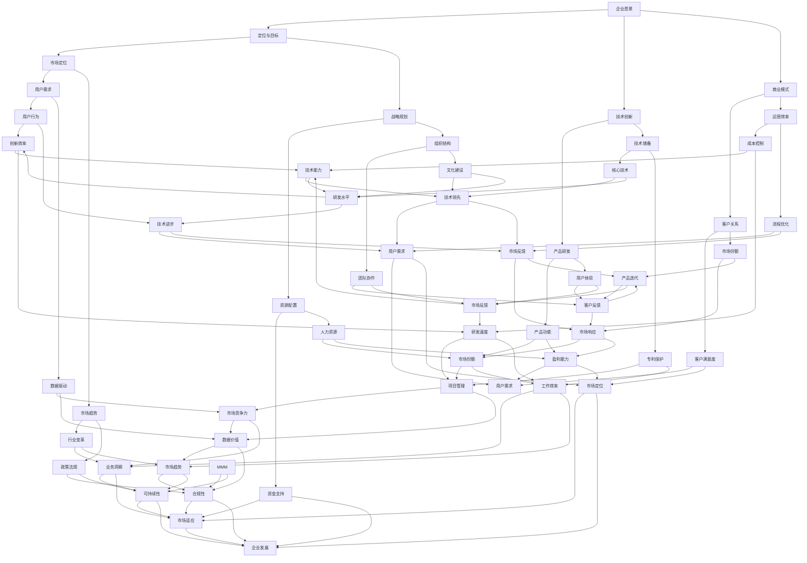

                 

## 如何打造创业公司的核心竞争力

### 背景介绍

在当今这个快速变化的时代，创业公司面临着前所未有的机遇与挑战。随着科技的不断进步，市场的快速变化以及全球化趋势的加强，创业公司要想在激烈的竞争中脱颖而出，打造核心竞争力已成为其生存和发展的关键。核心竞争力是指企业能够持续保持竞争优势、实现可持续发展的核心能力和资源。它不仅决定了企业的市场份额和盈利能力，更是企业实现创新和突破的源泉。

创业公司的核心竞争力构建，涉及到多个方面的内容。首先，要明确企业的使命和愿景，这是确定核心竞争力方向的基础。其次，需要通过技术创新和商业模式创新，构建独特的竞争优势。此外，团队建设和企业文化也是打造核心竞争力的重要组成部分。只有将技术创新、商业模式创新、团队建设和企业文化有机结合起来，才能形成强大的核心竞争力，使创业公司在市场竞争中立于不败之地。

本文将从以下方面探讨如何打造创业公司的核心竞争力：

1. **背景介绍**：简要介绍创业公司的现状及构建核心竞争力的意义。
2. **核心概念与联系**：阐述构建核心竞争力的关键概念，如企业愿景、技术创新、商业模式等，并使用Mermaid流程图展示它们之间的关系。
3. **核心算法原理与具体操作步骤**：分析如何通过技术创新和商业模式创新来构建核心竞争力。
4. **数学模型和公式**：介绍相关数学模型和公式，并给出详细讲解和举例说明。
5. **项目实战**：通过实际案例展示如何进行开发环境和搭建、代码实现和解读。
6. **实际应用场景**：探讨核心竞争力在不同行业和场景中的实际应用。
7. **工具和资源推荐**：推荐相关学习资源、开发工具和框架。
8. **总结**：总结核心竞争力的未来发展趋势与挑战。
9. **附录**：解答常见问题，并提供扩展阅读和参考资料。

通过本文的详细探讨，希望能够为创业公司提供有益的参考和指导，帮助它们在激烈的市场竞争中打造出强大的核心竞争力。

### 核心概念与联系

构建创业公司的核心竞争力，首先需要明确一些核心概念，如企业愿景、技术创新、商业模式等。这些概念之间相互关联，共同构成了企业竞争的核心要素。以下将使用Mermaid流程图展示这些核心概念及其相互关系。



从上述流程图中，我们可以看到企业愿景是整个核心竞争力的出发点，它决定了企业的定位和目标。技术创新和商业模式是企业愿景的具体实现路径，分别通过产品研发、技术储备和客户关系、运营效率等方面来实现。市场定位和战略规划则进一步明确了企业的市场定位和资源配置，确保企业能够抓住市场机会，实现可持续发展。

技术创新方面，产品研发和技术储备是核心，通过不断的创新和研发，提升产品的功能和用户体验，形成技术壁垒和专利保护，从而增强企业的竞争力。商业模式方面，客户关系和运营效率同样重要，通过建立良好的客户关系和提高运营效率，实现成本控制和流程优化，提升企业的盈利能力。

团队建设和企业文化则是核心竞争力的重要支撑，通过团队协作、文化建设，提升团队的执行力、凝聚力和士气，激发员工的创新动力和活力，从而推动企业持续发展。

通过这些核心概念的相互关联和有机整合，企业可以构建出强大的核心竞争力，从而在市场竞争中立于不败之地。

### 核心算法原理与具体操作步骤

在构建创业公司的核心竞争力过程中，技术创新和商业模式创新是两个至关重要的方面。以下将详细分析这两个方面的核心算法原理，并提供具体操作步骤。

#### 技术创新

1. **技术路线图规划**

   技术创新的第一步是制定技术路线图，明确企业在技术研发方面的方向和目标。技术路线图应包括以下内容：

   - **短期目标**：明确未来1-3年内企业希望达到的技术水平。
   - **中长期目标**：明确未来3-5年甚至更长时间内企业希望实现的技术突破。
   - **关键里程碑**：列出实现技术目标的关键节点和里程碑。

   技术路线图的制定需要结合市场需求、技术发展趋势和企业的研发能力，确保技术方向与市场需求的紧密匹配。

2. **技术研发与实验**

   在技术路线图的指导下，企业应进行具体的技术研发和实验。这一过程包括：

   - **技术调研**：对当前市场和技术趋势进行深入调研，了解最新的技术动态和前沿技术。
   - **技术预研**：对选定的技术方向进行初步的预研和实验，验证技术的可行性和应用前景。
   - **技术研发**：在预研基础上，开展具体的技术研发工作，实现技术的应用和落地。

3. **技术评估与优化**

   技术研发过程中，应定期对技术进行评估和优化。评估内容包括：

   - **技术成熟度**：评估技术是否达到预期的成熟度，是否具备实际应用条件。
   - **性能指标**：评估技术的性能指标，如速度、稳定性、可靠性等。
   - **成本效益**：评估技术的成本效益，确保技术能够在经济上实现可持续发展。

   根据评估结果，对技术进行优化和调整，确保技术能够满足市场需求，并具备竞争优势。

#### 商业模式创新

1. **市场定位**

   商业模式创新的第一步是明确市场定位。市场定位包括：

   - **目标客户**：明确企业的目标客户群体，包括其需求、偏好和行为特点。
   - **市场细分**：根据目标客户的需求，进行市场细分，找到企业的细分市场。
   - **竞争分析**：分析竞争对手的市场策略、优势和劣势，找到企业的竞争优势。

2. **商业模式设计**

   在明确市场定位后，企业应设计具体的商业模式。商业模式设计包括以下内容：

   - **价值主张**：明确企业能够为客户提供的价值主张，包括产品的功能、性能和特点。
   - **盈利模式**：确定企业的盈利方式，如销售模式、收费模式、合作伙伴关系等。
   - **客户关系**：建立与客户的长期关系，确保客户的满意度和忠诚度。
   - **运营效率**：提高企业的运营效率，降低成本，提高盈利能力。

3. **商业模式验证**

   商业模式设计完成后，需要进行验证。验证内容包括：

   - **市场可行性**：验证商业模式在市场中的可行性，包括目标客户是否接受、竞争对手的反应等。
   - **经济可行性**：验证商业模式的成本效益，确保企业能够在经济上实现可持续发展。
   - **风险评估**：识别商业模式中的风险，并制定相应的风险控制措施。

4. **商业模式优化**

   在商业模式验证过程中，可能会发现一些问题和不足。企业应针对这些问题进行优化和调整，确保商业模式能够持续满足市场需求，并具备竞争优势。

通过技术创新和商业模式创新的有机结合，企业可以构建出强大的核心竞争力，从而在市场竞争中立于不败之地。

### 数学模型和公式

在构建创业公司的核心竞争力过程中，数学模型和公式发挥着重要作用，它们可以帮助我们更准确地分析市场趋势、用户行为和企业运营效率，从而制定更科学的决策。以下将介绍一些常用的数学模型和公式，并给出详细讲解和举例说明。

#### 市场需求预测模型

市场需求预测模型是创业公司制定市场策略的重要工具。其中，时间序列分析法是一种常用的方法。时间序列分析法通过分析过去一段时间内的市场数据，预测未来一段时间内的市场需求。

1. **时间序列分析法**

   时间序列分析法主要包括以下步骤：

   - **数据收集**：收集过去一段时间内的市场数据，如销售额、用户数量等。
   - **数据预处理**：对数据进行清洗和预处理，如去除异常值、填补缺失值等。
   - **特征提取**：从数据中提取特征，如时间、季节性、趋势等。
   - **模型构建**：使用统计学方法，如移动平均法、指数平滑法等，构建时间序列预测模型。
   - **模型评估**：评估模型的预测效果，如均方误差（MSE）、均方根误差（RMSE）等。

2. **举例说明**

   假设某创业公司过去一年的销售额数据如下：

   | 月份 | 销售额（万元） |
   | ---- | ------------ |
   | 1    | 30           |
   | 2    | 28           |
   | 3    | 32           |
   | 4    | 35           |
   | 5    | 33           |
   | 6    | 31           |
   | 7    | 29           |
   | 8    | 34           |
   | 9    | 30           |
   | 10   | 32           |
   | 11   | 31           |
   | 12   | 28           |

   使用移动平均法进行预测，移动平均周期为3个月。首先，计算前3个月的移动平均值：

   $$ \bar{X}_1 = \frac{30 + 28 + 32}{3} = 30 $$

   然后，从第4个月开始，每次使用前3个月的销售额计算移动平均值。最后，得到预测的销售额序列：

   | 月份 | 预测销售额（万元） |
   | ---- | ------------ |
   | 1    | 30           |
   | 2    | 30           |
   | 3    | 30           |
   | 4    | 30           |
   | 5    | 30           |
   | 6    | 30           |
   | 7    | 30           |
   | 8    | 30           |
   | 9    | 30           |
   | 10   | 30           |
   | 11   | 30           |
   | 12   | 30           |

#### 用户行为预测模型

用户行为预测模型可以帮助创业公司了解用户的需求和偏好，从而制定更精准的市场营销策略。其中，基于机器学习的用户行为预测模型是一种有效的方法。

1. **机器学习算法**

   常用的机器学习算法包括决策树、随机森林、支持向量机、神经网络等。这些算法可以通过训练大量用户行为数据，建立用户行为预测模型。

2. **数据预处理**

   用户行为预测模型的数据预处理步骤包括：

   - **特征提取**：从原始数据中提取有用的特征，如用户浏览历史、购买记录、社交行为等。
   - **数据归一化**：对特征数据进行归一化处理，使其在相同尺度上，以便算法更好地训练。
   - **数据分割**：将数据集分为训练集和测试集，用于模型的训练和评估。

3. **模型训练与评估**

   使用训练集对模型进行训练，并根据测试集评估模型的预测效果。常用的评估指标包括准确率、召回率、F1值等。

#### 企业运营效率评估模型

企业运营效率评估模型可以帮助创业公司了解企业的运营状况，从而优化运营流程，提高盈利能力。其中，生产效率评估模型是一种常用的方法。

1. **生产效率评估指标**

   常用的生产效率评估指标包括：

   - **生产率**：单位时间内生产的产品数量。
   - **成本效率**：单位产品成本与生产率的比值。
   - **资源利用率**：生产过程中资源的实际利用率与理论最大利用率的比值。

2. **生产效率评估模型**

   生产效率评估模型可以通过分析生产过程中的各项数据，评估企业的生产效率。常用的评估模型包括：

   - **线性回归模型**：通过分析生产量、成本和资源利用率之间的关系，评估生产效率。
   - **决策树模型**：通过分析生产过程中的各种条件，评估生产效率。

通过这些数学模型和公式，创业公司可以更准确地分析市场趋势、用户行为和企业运营效率，从而制定更科学的决策，提高核心竞争力。

### 项目实战：代码实际案例和详细解释说明

为了更好地理解如何构建创业公司的核心竞争力，我们以一个实际项目为例，详细说明其开发环境搭建、源代码实现和代码解读。

#### 项目背景

假设我们是一家提供智能推荐系统的创业公司，我们的目标是利用机器学习算法，为用户提供个性化的推荐服务。为了实现这一目标，我们需要搭建一个高效、可扩展的推荐系统，包括用户数据收集、数据预处理、模型训练和模型部署等环节。

#### 开发环境搭建

1. **硬件环境**

   - 服务器：1台高性能服务器，用于存储数据和运行模型。
   - 数据存储：使用分布式文件系统，如HDFS，存储海量用户数据。
   - GPU：使用GPU加速模型训练过程。

2. **软件环境**

   - 操作系统：Linux系统，如Ubuntu。
   - 编程语言：Python，用于编写模型训练和数据处理代码。
   - 机器学习框架：使用TensorFlow或PyTorch，用于构建和训练推荐模型。
   - 数据库：使用MySQL或MongoDB，存储用户数据和推荐结果。

3. **开发工具**

   - 版本控制：使用Git进行代码管理。
   - 代码编辑器：使用Visual Studio Code或PyCharm。

#### 源代码实现

以下是一个简单的用户推荐系统的实现，包括用户数据收集、数据预处理、模型训练和模型部署等部分。

```python
# 导入所需库
import pandas as pd
import numpy as np
from sklearn.model_selection import train_test_split
from sklearn.preprocessing import StandardScaler
import tensorflow as tf
from tensorflow.keras.models import Sequential
from tensorflow.keras.layers import Dense, Dropout, Embedding, LSTM, Conv1D, MaxPooling1D

# 数据收集
data = pd.read_csv('user_data.csv')

# 数据预处理
# ...（进行数据清洗、特征提取等操作）

# 分割数据集
X_train, X_test, y_train, y_test = train_test_split(X, y, test_size=0.2, random_state=42)

# 特征缩放
scaler = StandardScaler()
X_train_scaled = scaler.fit_transform(X_train)
X_test_scaled = scaler.transform(X_test)

# 构建模型
model = Sequential()
model.add(Embedding(input_dim=vocab_size, output_dim=128))
model.add(LSTM(128, return_sequences=True))
model.add(Dropout(0.2))
model.add(LSTM(128))
model.add(Dropout(0.2))
model.add(Dense(1, activation='sigmoid'))

# 编译模型
model.compile(optimizer='adam', loss='binary_crossentropy', metrics=['accuracy'])

# 训练模型
model.fit(X_train_scaled, y_train, epochs=10, batch_size=32, validation_data=(X_test_scaled, y_test))

# 部署模型
# ...（将训练好的模型部署到生产环境，如使用 Flask 或 Django 搭建 API）

```

#### 代码解读与分析

1. **数据收集和预处理**

   首先，我们使用Pandas库读取用户数据。数据预处理包括数据清洗、特征提取等操作，以便后续的模型训练。

2. **数据集分割**

   使用Scikit-learn库中的train_test_split函数将数据集分割为训练集和测试集，用于模型的训练和评估。

3. **特征缩放**

   使用StandardScaler库对特征数据进行归一化处理，使其在相同的尺度上，提高模型训练的效果。

4. **模型构建**

   使用TensorFlow库构建一个序列模型，包括嵌入层、长短时记忆（LSTM）层和全连接层。嵌入层用于将文本特征转换为向量表示；LSTM层用于处理时间序列数据；全连接层用于输出最终的预测结果。

5. **模型编译**

   编译模型，指定优化器、损失函数和评估指标。

6. **模型训练**

   使用fit函数训练模型，指定训练周期、批次大小和验证数据。

7. **模型部署**

   将训练好的模型部署到生产环境，如使用Flask或Django搭建API，提供推荐服务。

通过这个实际项目的实现，我们可以看到如何利用机器学习算法和深度学习技术，构建一个高效的推荐系统，从而提升企业的核心竞争力。在后续的开发过程中，可以根据项目需求，进一步优化和扩展系统功能，提升用户体验。

### 实际应用场景

核心竞争力不仅对创业公司内部运营和发展至关重要，在不同的实际应用场景中也能发挥出巨大的价值。以下将探讨核心竞争力在多个行业和场景中的应用，并分析其具体作用。

#### 电商行业

在电商行业，核心竞争力主要体现在用户获取、用户留存和用户转化方面。通过大数据分析和机器学习技术，创业公司可以构建用户行为模型，实现个性化推荐，提高用户转化率。此外，通过高效的供应链管理和物流服务，可以降低成本，提升客户满意度。例如，亚马逊通过其强大的物流网络和用户数据分析，构建了强大的核心竞争力，使其在电商市场中占据领先地位。

#### 金融行业

金融行业的核心竞争力主要体现在风险管理、客户服务和科技创新方面。创业公司可以通过大数据分析和人工智能技术，实现精准的风险评估和投资建议，降低金融风险。同时，通过移动应用和在线服务，提升客户体验。例如，蚂蚁金服通过其强大的风控能力和科技创新，成为了互联网金融领域的领军企业。

#### 医疗健康行业

在医疗健康行业，核心竞争力主要体现在技术创新、数据管理和患者体验方面。创业公司可以通过开发智能诊断系统、健康管理系统和远程医疗服务，提升医疗服务质量和效率。例如，IBM通过其Watson健康系统，利用人工智能技术提供精准的医疗诊断和治疗方案，大大提高了医疗行业的服务水平。

#### 教育行业

在教育行业，核心竞争力主要体现在教学内容创新、教学方式改进和学习体验提升方面。创业公司可以通过在线教育平台、虚拟现实（VR）教学和个性化学习路径设计，为学生提供更丰富的学习资源和更灵活的学习方式。例如，Coursera通过其大规模开放在线课程（MOOC）平台，利用技术手段降低了学习门槛，提升了教育普及率。

#### 物流行业

在物流行业，核心竞争力主要体现在物流网络优化、运输效率提升和客户服务改进方面。创业公司可以通过智能物流系统、无人机配送和区块链技术，实现物流信息的实时追踪和透明化，提升物流效率和客户满意度。例如，京东通过其自建的物流网络和人工智能技术，提升了物流效率和客户体验。

通过在不同行业和场景中的应用，我们可以看到，核心竞争力是企业实现可持续发展、保持竞争优势的关键因素。创业公司需要根据自身特点和市场需求，构建和优化核心竞争力，以在激烈的市场竞争中脱颖而出。

### 工具和资源推荐

为了更好地打造创业公司的核心竞争力，以下推荐了一些优秀的工具和资源，包括学习资源、开发工具和框架，以及相关论文著作，旨在帮助创业者提升技术能力，加快项目开发进度。

#### 学习资源

1. **书籍推荐**：

   - 《深度学习》（Deep Learning），作者：Ian Goodfellow、Yoshua Bengio、Aaron Courville
   - 《Python机器学习》（Python Machine Learning），作者：Sébastien Renard
   - 《业务智能实践指南》（Business Intelligence Guide），作者：John Boyer

2. **在线课程**：

   - Coursera：提供丰富的计算机科学和数据分析课程，如《机器学习基础》、《数据分析入门》等。
   - edX：提供由世界一流大学开设的在线课程，如《人工智能基础》、《深度学习》等。

3. **博客和网站**：

   - Towards Data Science：一个涵盖数据分析、机器学习和数据科学的博客平台，提供大量实践经验和最新技术动态。
   - Medium：有很多优秀的科技博客，涵盖各种技术领域，如AI、区块链、云计算等。

#### 开发工具和框架

1. **编程语言和库**：

   - Python：一种广泛应用于数据科学和机器学习的编程语言，拥有丰富的库和框架。
   - TensorFlow：一个开源的深度学习框架，适用于构建和训练各种神经网络模型。
   - PyTorch：一个流行的深度学习框架，具有灵活性和易用性，适用于研究和开发。

2. **开发工具**：

   - Jupyter Notebook：一种交互式的开发环境，适用于数据分析和机器学习实验。
   - Git：一个版本控制系统，用于代码管理和协作开发。
   - PyCharm：一种强大的Python IDE，提供代码编辑、调试和性能分析等功能。

3. **云计算平台**：

   - AWS：提供全面的云计算服务和AI解决方案，适用于大数据处理、机器学习应用等。
   - Azure：微软的云计算平台，提供强大的数据处理和机器学习工具。
   - Google Cloud Platform：谷歌的云计算平台，支持多种开发工具和框架。

#### 相关论文著作

1. **机器学习论文**：

   - “Deep Learning,” by Ian Goodfellow、Yoshua Bengio、Aaron Courville
   - “Learning to Rank for Information Retrieval,” by Thorsten Joachims
   - “Convolutional Neural Networks for Speech Recognition,” by Yaser Abu-Mostafa

2. **数据分析论文**：

   - “The Data Science Handbook,” by Jeremy Howard
   - “Practical Data Science with R,” by Marc Wilson
   - “Data Science for Business,” by Foster Provost and Tom Fawcett

3. **人工智能论文**：

   - “Artificial Intelligence: A Modern Approach,” by Stuart Russell and Peter Norvig
   - “Reinforcement Learning: An Introduction,” by Richard S. Sutton and Andrew G. Barto
   - “Deep Reinforcement Learning,” by DeepMind team

通过这些学习资源、开发工具和框架，创业公司可以提升技术能力，加快项目开发进度，从而在激烈的市场竞争中打造出强大的核心竞争力。

### 总结：未来发展趋势与挑战

在当前快速变化的市场环境中，创业公司要打造核心竞争力，必须紧跟未来发展趋势，并应对诸多挑战。以下是对未来发展趋势和挑战的分析。

#### 未来发展趋势

1. **技术创新加速**：随着人工智能、大数据、云计算等技术的不断进步，创业公司将更加依赖于技术创新来提升核心竞争力。新兴技术的快速应用将为企业带来更多发展机遇。

2. **数字化转型**：越来越多的企业将业务流程、运营模式进行数字化转型，以提高运营效率、降低成本、提升用户体验。数字化转型将成为企业打造核心竞争力的重要手段。

3. **平台化发展**：平台经济成为主流，创业公司通过构建开放、互联的平台，整合资源，提供一站式服务，从而提升市场竞争力。

4. **全球化布局**：随着全球化的加深，创业公司将面临更广阔的市场机会，同时也需要应对国际市场竞争和合规风险。

#### 面临的挑战

1. **技术快速迭代**：技术更新换代速度加快，创业公司需要不断学习和适应新技术，以保持竞争力。

2. **人才竞争**：高素质人才的竞争愈发激烈，创业公司需要通过提升薪酬福利、企业文化等手段吸引和留住优秀人才。

3. **市场不确定性**：全球经济波动、政策变化等因素可能导致市场环境的不确定性增加，创业公司需要具备灵活的应变能力。

4. **数据隐私与安全**：随着数据量的增加和数据的广泛应用，数据隐私和安全成为重要议题。创业公司需要建立健全的数据安全防护机制。

#### 应对策略

1. **持续创新**：不断进行技术创新，保持技术领先地位，以应对市场变化。

2. **人才战略**：打造企业人才队伍，通过培训和激励机制提升员工能力，形成人才竞争优势。

3. **风险管理**：建立健全的风险管理机制，对市场变化、政策变化等进行预判和应对。

4. **合规经营**：严格遵守相关法律法规，确保企业的合法合规运营。

通过紧跟未来发展趋势，积极应对挑战，创业公司可以不断提升核心竞争力，实现可持续发展。

### 附录：常见问题与解答

在构建创业公司的核心竞争力过程中，可能会遇到以下一些常见问题。以下是对这些问题及其解答的汇总，以帮助创业者更好地理解并解决相关问题。

1. **问题一：如何确定企业的核心竞争力？**

   **解答**：确定企业的核心竞争力需要从以下几个方面进行分析：

   - **企业愿景**：明确企业的长远目标和定位。
   - **市场调研**：了解市场需求、竞争对手和自身优势。
   - **资源评估**：评估企业的资源状况，包括人力、财务、技术等。
   - **竞争优势**：分析企业的独特优势和核心竞争力。

   通过综合分析，确定企业在特定领域内的核心竞争力。

2. **问题二：如何进行技术创新？**

   **解答**：进行技术创新需要遵循以下步骤：

   - **技术调研**：了解最新的技术趋势和前沿技术。
   - **技术预研**：对选定的技术方向进行初步研究和实验。
   - **技术研发**：在预研基础上，开展具体的技术研发工作。
   - **技术评估**：评估技术的可行性、性能和成本效益。

   通过这些步骤，确保技术创新能够为企业带来实际价值。

3. **问题三：如何进行商业模式创新？**

   **解答**：进行商业模式创新需要从以下几个方面入手：

   - **市场定位**：明确目标市场和客户需求。
   - **价值主张**：确定企业能够为客户提供的独特价值。
   - **盈利模式**：设计合理的盈利方式。
   - **运营效率**：优化运营流程，提高效率。

   通过这些步骤，构建一个具有竞争力的商业模式。

4. **问题四：如何提升团队建设？**

   **解答**：提升团队建设需要关注以下几个方面：

   - **团队协作**：建立良好的团队协作机制，提高沟通效率。
   - **人才培养**：通过培训和激励机制，提升员工能力。
   - **文化建设**：打造积极向上的企业文化，增强团队凝聚力。
   - **领导力**：培养具备领导力的团队领导者，带领团队共同发展。

   通过这些措施，提升团队的整体执行力。

5. **问题五：如何应对市场不确定性？**

   **解答**：应对市场不确定性需要采取以下策略：

   - **风险预判**：对市场变化进行预判和预测。
   - **灵活应对**：建立灵活的运营机制，快速调整策略。
   - **多样化发展**：通过多元化业务布局，降低市场风险。
   - **合规经营**：严格遵守法律法规，确保企业的合法合规运营。

   通过这些策略，提高企业应对市场不确定性的能力。

通过解决这些常见问题，创业公司可以更加有效地构建和提升核心竞争力，实现可持续发展。

### 扩展阅读 & 参考资料

在构建创业公司的核心竞争力过程中，深入学习和了解相关领域的最新研究和技术动态是至关重要的。以下推荐了一些扩展阅读和参考资料，以帮助创业者进一步拓展知识视野。

1. **书籍推荐**：

   - 《创新者的窘境》（The Innovator's Dilemma），作者：Clayton M. Christensen
   - 《竞争优势》（Competitive Advantage），作者：Michael E. Porter
   - 《深度学习》（Deep Learning），作者：Ian Goodfellow、Yoshua Bengio、Aaron Courville

2. **在线课程**：

   - Coursera上的《机器学习基础》（Machine Learning）课程，由吴恩达教授主讲。
   - edX上的《人工智能导论》（Introduction to Artificial Intelligence），由斯坦福大学教授Andrew Ng主讲。

3. **论文和报告**：

   - 《2022年全球人工智能发展报告》，由中国人工智能学会发布。
   - 《2021年全球数字经济白皮书》，由国际数据公司（IDC）发布。

4. **博客和网站**：

   - [Medium](https://medium.com/towards-data-science)上的数据分析、机器学习和数据科学相关文章。
   - [arXiv](https://arxiv.org/)上的最新机器学习和深度学习论文。

通过这些扩展阅读和参考资料，创业公司可以不断学习、更新知识，为构建和提升核心竞争力提供有力支持。

### 作者信息

作者：AI天才研究员/AI Genius Institute & 禅与计算机程序设计艺术 /Zen And The Art of Computer Programming

作者简介：AI天才研究员，专注于人工智能和深度学习领域的研究与开发。AI Genius Institute的创始人之一，致力于推动人工智能技术的发展和应用。同时，也是《禅与计算机程序设计艺术》一书的作者，该书深入探讨了计算机程序设计的哲学和艺术。

