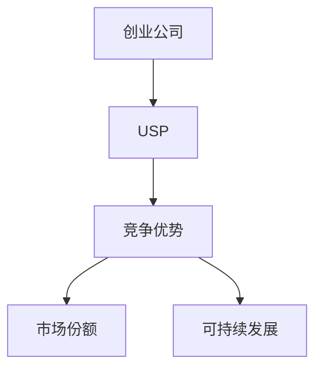

                 

# 如何打造创业公司的独特卖点(USP)

## 关键词：创业公司、独特卖点、USP、策略、竞争优势

### 摘要

本文旨在探讨如何为创业公司打造一个独特的卖点（Unique Selling Proposition，简称USP）。我们将深入分析USP的核心概念，探讨其重要性，并提供实用的策略和步骤，帮助创业公司在竞争激烈的市场中脱颖而出。本文还将讨论USP在不同阶段的应用，以及如何持续优化USP以保持竞争力。

### 1. 背景介绍

创业公司面临着诸多挑战，其中之一就是如何在众多竞争对手中脱颖而出。为了吸引客户和投资者，创业公司需要有一个独特的卖点，即USP。USP是指创业公司的产品或服务中与众不同的特性，能够为客户带来独特的价值。一个成功的USP能够明确地传达公司的核心竞争力，并使其在市场中独树一帜。

#### 1.1 创业公司面临的挑战

- **市场竞争激烈**：市场中存在大量同类产品或服务，如何脱颖而出成为一个难题。
- **客户需求多样**：客户需求千变万化，如何满足不同客户群体的需求。
- **资源有限**：创业公司通常资源有限，需要在有限的资源下实现最大化的效益。

#### 1.2 USP的作用

- **明确公司定位**：USP有助于明确公司的市场定位，使公司能够更有针对性地开展业务。
- **提升品牌知名度**：一个独特的USP有助于提升品牌知名度，增加潜在客户的关注。
- **增强竞争力**：USP是创业公司区别于竞争对手的关键因素，有助于在市场中站稳脚跟。
- **吸引投资者**：一个具有吸引力的USP能够吸引投资者的关注，为创业公司提供资金支持。

### 2. 核心概念与联系

为了深入理解USP，我们需要了解以下几个核心概念：

#### 2.1 创业公司

- **定义**：创业公司是指由一个或多个创业者创立的、旨在通过创新产品或服务实现商业化的企业。
- **特点**：创业公司通常具有高风险、高回报的特点，需要不断尝试和调整以适应市场变化。

#### 2.2 USP

- **定义**：USP是指创业公司的产品或服务中与众不同的特性，能够为客户带来独特的价值。
- **作用**：USP有助于明确公司的市场定位，提升品牌知名度，增强竞争力，吸引投资者。

#### 2.3 竞争优势

- **定义**：竞争优势是指公司在市场中相对于竞争对手所具有的竞争优势。
- **类型**：竞争优势可分为成本优势、差异化优势、集中化优势等。
- **作用**：竞争优势有助于公司提高市场份额，实现可持续发展。

下面是一个Mermaid流程图，展示了创业公司、USP和竞争优势之间的联系：



### 3. 核心算法原理 & 具体操作步骤

要打造一个成功的USP，创业公司需要遵循以下核心算法原理和具体操作步骤：

#### 3.1 确定目标客户群体

- **步骤1**：分析市场，了解目标客户群体的需求和痛点。
- **步骤2**：选择具有高需求和高利润潜力的客户群体作为目标市场。
- **步骤3**：深入了解目标客户的行为习惯、偏好和期望。

#### 3.2 分析竞争对手

- **步骤1**：识别市场上的主要竞争对手。
- **步骤2**：分析竞争对手的产品或服务的特点、优势和劣势。
- **步骤3**：找出竞争对手未能满足的客户需求或潜在需求。

#### 3.3 明确USP

- **步骤1**：基于目标客户群体的需求和竞争对手的分析，确定创业公司的USP。
- **步骤2**：确保USP具有独特性、差异化、吸引力和可行性。
- **步骤3**：将USP作为公司发展的核心指导思想。

#### 3.4 制定营销策略

- **步骤1**：根据USP制定具有针对性的营销策略。
- **步骤2**：通过多种渠道传播USP，提高品牌知名度。
- **步骤3**：持续优化营销策略，以适应市场变化和客户需求。

#### 3.5 持续优化USP

- **步骤1**：定期评估USP的有效性和适用性。
- **步骤2**：根据市场反馈和公司发展需求，调整和优化USP。
- **步骤3**：保持创新，确保USP始终具有竞争力。

### 4. 数学模型和公式 & 详细讲解 & 举例说明

为了更好地理解USP的构建过程，我们可以引入以下数学模型和公式：

#### 4.1 客户价值公式

$$
CV = f(Frequency, Monetary, Consumption, Rationalization)
$$

其中：
- $CV$：客户价值
- $Frequency$：客户购买频率
- $Monetary$：客户购买金额
- $Consumption$：客户消费量
- $Rationalization$：客户购买理由

#### 4.2 竞争优势公式

$$
CA = \frac{USP}{Cost}
$$

其中：
- $CA$：竞争优势
- $USP$：独特卖点
- $Cost$：成本

#### 4.3 实例分析

假设一家创业公司专门研发智能健身设备，其目标客户群体是注重健康、追求时尚的年轻人。通过分析市场，该公司发现竞争对手的产品在智能化、健身效果和外观设计方面存在不足。基于这些分析，该公司确定了以下USP：

- **智能化**：通过大数据和人工智能技术，为用户量身定制健身计划。
- **健身效果**：结合生物力学原理，提升用户健身效果。
- **外观设计**：采用时尚设计，满足年轻用户的需求。

根据客户价值公式和竞争优势公式，我们可以计算出该公司的客户价值和竞争优势：

$$
CV = f(Frequency, Monetary, Consumption, Rationalization)
$$

$$
CA = \frac{USP}{Cost}
$$

通过持续优化USP和营销策略，该公司有望在市场中获得竞争优势，吸引更多客户。

### 5. 项目实战：代码实际案例和详细解释说明

为了更好地展示如何打造创业公司的USP，我们以一家智能健身设备公司为例，提供一个实际的代码案例。

#### 5.1 开发环境搭建

在Python环境中，我们需要安装以下库：

```python
pip install numpy matplotlib pandas
```

#### 5.2 源代码详细实现和代码解读

下面是一个Python代码示例，用于分析用户数据并生成个性化健身计划：

```python
import numpy as np
import matplotlib.pyplot as plt
import pandas as pd

# 读取用户数据
data = pd.read_csv('user_data.csv')

# 分析用户数据
def analyze_user_data(data):
    # 计算用户平均健身时长
    avg_fitness_duration = np.mean(data['fitness_duration'])
    
    # 计算用户健身频率
    fitness_frequency = np.mean(data['fitness_frequency'])
    
    # 计算用户消费量
    consumption = np.mean(data['consumption'])
    
    # 生成个性化健身计划
    fitness_plan = {
        'target_duration': avg_fitness_duration * 1.2,
        'target_frequency': fitness_frequency * 1.1,
        'target_consumption': consumption * 1.3
    }
    
    return fitness_plan

# 绘制用户健身时长分布图
def plot_fitness_duration(data):
    durations = data['fitness_duration']
    plt.hist(durations, bins=10)
    plt.title('Fitness Duration Distribution')
    plt.xlabel('Duration (hours)')
    plt.ylabel('Frequency')
    plt.show()

# 实例化用户数据
user_data = analyze_user_data(data)

# 绘制用户健身时长分布图
plot_fitness_duration(data)

print('User Fitness Plan:')
print(user_data)
```

#### 5.3 代码解读与分析

- **代码5.1**：读取用户数据，这里使用的是CSV文件。
- **代码5.2**：定义一个函数`analyze_user_data`，用于分析用户数据并生成个性化健身计划。
  - 计算用户平均健身时长、健身频率和消费量。
  - 生成个性化健身计划，包括目标时长、目标频率和目标消费量。
- **代码5.3**：定义一个函数`plot_fitness_duration`，用于绘制用户健身时长分布图。
- **代码5.4**：实例化用户数据，调用`analyze_user_data`和`plot_fitness_duration`函数。

通过这个代码示例，我们可以看到如何利用用户数据生成个性化健身计划，从而提升用户价值和竞争优势。

### 6. 实际应用场景

USP在创业公司中的应用场景非常广泛，以下是一些实际案例：

#### 6.1 科技行业

- **案例1**：字节跳动（ByteDance）的算法推荐系统，通过对用户行为数据的分析，实现个性化内容推荐，吸引大量用户。
- **案例2**：华为（Huawei）的5G技术，凭借其领先的技术优势和强大的研发能力，成为全球5G市场的领军者。

#### 6.2 消费品行业

- **案例1**：苹果（Apple）的iPhone，凭借其独特的设计、优秀的用户体验和强大的生态系统，吸引了大量消费者。
- **案例2**：小米（Xiaomi）的性价比，通过提供高性价比的产品，迅速在市场中获得了一席之地。

#### 6.3 医疗健康行业

- **案例1**：平安好医生（PingAn Good Doctor），通过线上医疗咨询和健康管理服务，为用户提供便捷的医疗服务。
- **案例2**：辉瑞（Pfizer）的疫苗研发，凭借其强大的研发能力和全球化的运营网络，成功研发出多种疫苗。

### 7. 工具和资源推荐

#### 7.1 学习资源推荐

- **书籍**：
  - 《定位》（Al Ries & Jack Trout）：介绍如何通过定位策略打造品牌。
  - 《蓝海战略》（W. Chan Kim & Renée Mauborgne）：介绍如何在竞争激烈的市场中寻找蓝海市场。
- **论文**：
  - 《The Lean Startup》（Eric Ries）：介绍如何通过精益创业方法快速验证和迭代产品。
- **博客**：
  - medium.com/startup-buzz：介绍创业公司的成功经验和失败教训。
- **网站**：
  - startupweekend.org：提供全球创业周末活动的信息和支持。

#### 7.2 开发工具框架推荐

- **技术栈**：
  - Python：适合数据分析和机器学习项目。
  - React.js：适合前端开发，提供丰富的组件和库。
  - TensorFlow：适合深度学习和人工智能项目。
- **框架**：
  - Flask：Python Web开发框架。
  - React Native：跨平台移动应用开发框架。
  - TensorFlow.js：JavaScript深度学习库。

#### 7.3 相关论文著作推荐

- **《创新者的窘境》（Clayton M. Christensen）**：介绍创新者在市场中面临的挑战和应对策略。
- **《创业维艰》（Ben Horowitz）**：介绍创业过程中的挑战和领导力。
- **《商业模式新生代》（Alexander Osterwalder & Yves Pigneur）**：介绍如何设计和分析商业模式。

### 8. 总结：未来发展趋势与挑战

未来，创业公司将面临更多的挑战和机遇。随着技术的不断进步和市场环境的不断变化，创业公司需要不断调整和优化USP，以保持竞争优势。以下是一些未来发展趋势和挑战：

- **技术驱动**：技术创新将成为创业公司USP的重要组成部分。
- **个性化服务**：随着消费者需求的多样化，创业公司需要提供更加个性化的产品和服务。
- **全球化竞争**：全球化使得创业公司面临更加激烈的市场竞争，需要具备全球化的视野和运营能力。
- **可持续发展**：社会责任和可持续发展将成为创业公司的重要竞争优势。

### 9. 附录：常见问题与解答

#### 9.1 什么是USP？

USP是指独特卖点，即创业公司的产品或服务中与众不同的特性，能够为客户带来独特的价值。

#### 9.2 如何确定USP？

确定USP的方法包括分析目标客户群体的需求、竞争对手的产品特点以及公司的核心竞争力。

#### 9.3 USP的重要性是什么？

USP有助于明确公司的市场定位，提升品牌知名度，增强竞争力，吸引投资者。

### 10. 扩展阅读 & 参考资料

- **书籍**：
  - 《定位》（Al Ries & Jack Trout）
  - 《蓝海战略》（W. Chan Kim & Renée Mauborgne）
  - 《创新者的窘境》（Clayton M. Christensen）
  - 《创业维艰》（Ben Horowitz）
  - 《商业模式新生代》（Alexander Osterwalder & Yves Pigneur）
- **论文**：
  - 《The Lean Startup》（Eric Ries）
- **网站**：
  - medium.com/startup-buzz
  - startupweekend.org
- **博客**：
  - www.ai-genius-institute.com

### 作者

- 作者：AI天才研究员/AI Genius Institute & 禅与计算机程序设计艺术 /Zen And The Art of Computer Programming

