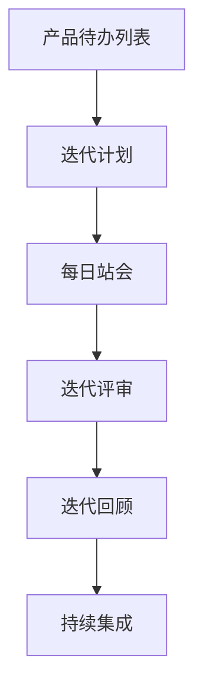

                 

# 如何打造敏捷的产品迭代流程

> **关键词：** 敏捷开发、产品迭代、Scrum、看板、持续集成、自动化测试、用户体验。

> **摘要：** 本文将深入探讨如何构建一个敏捷的产品迭代流程，从理论到实践，解析敏捷开发的核心原则和方法，旨在帮助团队提高产品交付的速度和质量。

## 1. 背景介绍

在当今快速变化的市场环境中，产品迭代速度和交付质量已成为企业竞争力的关键。传统的瀑布式开发模式往往难以适应这种变化，而敏捷开发方法因其灵活性和迭代性，正逐渐成为现代软件开发的主流。敏捷开发强调团队合作、客户参与、持续交付和适应性，其核心在于快速响应市场变化，持续改进产品。

本文将围绕以下几个关键问题展开讨论：

- 敏捷开发的基本概念和核心原则是什么？
- 如何构建一个高效的敏捷迭代流程？
- 敏捷开发中常用的工具和技术有哪些？
- 敏捷开发在实际项目中的应用效果如何？

通过本文的阅读，您将了解敏捷开发的精髓，掌握构建敏捷迭代流程的方法，并为您的团队带来实际的价值。

## 2. 核心概念与联系

### 2.1 敏捷开发的基本概念

敏捷开发（Agile Development）是一种以人为核心、迭代、循序渐进的开发方法。其基本概念包括：

- **迭代（Iteration）**：开发过程被划分为多个短期迭代，每个迭代都产出可运行的产品版本。
- **增量（Increment）**：每次迭代都会增加新的功能或改进现有功能，逐步完善产品。
- **用户故事（User Story）**：描述用户需求的最小工作单元，通常包括用户目标、功能描述和验收标准。
- **看板（Kanban）**：用于可视化工作流程，帮助团队跟踪任务进度，提高工作效率。
- **持续集成（Continuous Integration）**：通过自动化构建和测试，确保代码库始终处于可部署状态。

### 2.2 敏捷开发的核心原则

敏捷开发基于一系列核心原则，这些原则指导团队如何高效地工作：

- **个体和互动重于过程和工具**：强调团队成员之间的协作和沟通。
- **可工作的软件重于详尽的文档**：注重实际产出，文档仅作为辅助。
- **客户合作重于合同谈判**：与客户保持紧密沟通，确保产品满足需求。
- **响应变化重于遵循计划**：适应市场变化，持续优化产品。

### 2.3 敏捷开发的架构

敏捷开发的架构通常包括以下几个组成部分：

- **产品待办列表（Product Backlog）**：记录所有用户故事和任务，按优先级排序。
- **迭代计划（Sprint Planning）**：确定每个迭代的目标和任务。
- **每日站会（Daily Stand-up）**：团队成员分享工作进展和遇到的问题。
- **迭代评审（Sprint Review）**：回顾迭代成果，收集反馈，调整迭代计划。
- **迭代回顾（Sprint Retrospective）**：总结经验教训，持续改进团队工作方式。

### 2.4 敏捷开发的联系

敏捷开发与其他软件开发方法（如Scrum、Kanban）有着紧密的联系：

- **Scrum**：是一种流行的敏捷开发框架，强调迭代和增量交付，使用产品待办列表和每日站会等工具。
- **Kanban**：是一种基于可视化的工作流程管理方法，强调限制工作在流程中的数量，避免过度工作。
- **持续集成（CI）**：确保代码库始终处于可部署状态，通过自动化构建和测试实现。

以下是敏捷开发架构的 Mermaid 流程图：



## 3. 核心算法原理 & 具体操作步骤

### 3.1 敏捷开发的核心算法原理

敏捷开发的核心算法是基于增量开发模型，其具体操作步骤如下：

1. **需求收集**：通过与客户的沟通，收集并记录用户需求。
2. **用户故事编写**：将需求转化为用户故事，包括用户目标、功能描述和验收标准。
3. **迭代计划**：根据用户故事优先级，确定每个迭代的目标和任务。
4. **每日站会**：团队每日回顾工作进展和问题，确保项目按计划进行。
5. **迭代交付**：在每个迭代结束时，交付一个可工作的软件版本。
6. **迭代评审**：与客户回顾迭代成果，收集反馈。
7. **迭代回顾**：总结经验教训，持续改进团队工作方式。

### 3.2 具体操作步骤

1. **需求收集**：

   通过与客户的沟通，了解他们的需求和期望。将需求记录在产品待办列表中。

   ```mermaid
   graph TD
       A[需求收集] --> B[产品待办列表]
   ```

2. **用户故事编写**：

   将需求转化为用户故事，包括用户目标、功能描述和验收标准。将用户故事添加到产品待办列表。

   ```mermaid
   graph TD
       A[用户故事编写] --> B[产品待办列表]
   ```

3. **迭代计划**：

   根据用户故事优先级，确定每个迭代的目标和任务。将任务分配给团队成员。

   ```mermaid
   graph TD
       A[迭代计划] --> B[任务分配]
   ```

4. **每日站会**：

   团队每日召开站会，回顾工作进展和问题，确保项目按计划进行。

   ```mermaid
   graph TD
       A[每日站会]
   ```

5. **迭代交付**：

   在每个迭代结束时，交付一个可工作的软件版本。

   ```mermaid
   graph TD
       A[迭代交付]
   ```

6. **迭代评审**：

   与客户回顾迭代成果，收集反馈，调整迭代计划。

   ```mermaid
   graph TD
       A[迭代评审] --> B[迭代计划调整]
   ```

7. **迭代回顾**：

   总结经验教训，持续改进团队工作方式。

   ```mermaid
   graph TD
       A[迭代回顾] --> B[团队改进]
   ```

## 4. 数学模型和公式 & 详细讲解 & 举例说明

### 4.1 数学模型

敏捷开发中，常用的一些数学模型包括：

- **项目进度评估**：使用帕累托分布和蒙特卡罗模拟方法预测项目进度。
- **任务分配**：使用优化算法（如遗传算法）进行任务分配，确保资源利用率最大化。

### 4.2 公式讲解

1. **项目进度评估**：

   项目进度 \( P \) 可以用以下公式表示：

   $$ P = \sum_{i=1}^{n} P_i \times w_i $$

   其中，\( P_i \) 是第 \( i \) 个任务的进度，\( w_i \) 是第 \( i \) 个任务的工作量。

2. **任务分配**：

   任务分配的目标是最小化总工作时间 \( T \)，公式如下：

   $$ T = \min_{x_1, x_2, ..., x_n} \sum_{i=1}^{n} t_i \times x_i $$

   其中，\( t_i \) 是第 \( i \) 个任务的时间，\( x_i \) 是第 \( i \) 个任务的分配系数。

### 4.3 举例说明

假设一个项目包含三个任务，每个任务的工作量和所需时间如下：

| 任务 | 工作量 | 所需时间 |
| ---- | ---- | ---- |
| A    | 3    | 5    |
| B    | 2    | 3    |
| C    | 1    | 2    |

1. **项目进度评估**：

   计算每个任务的进度：

   $$ P_A = \frac{3}{3+2+1} = 0.6 $$
   $$ P_B = \frac{2}{3+2+1} = 0.4 $$
   $$ P_C = \frac{1}{3+2+1} = 0.2 $$

   项目进度 \( P \) 为：

   $$ P = 0.6 \times 5 + 0.4 \times 3 + 0.2 \times 2 = 3.8 $$

2. **任务分配**：

   假设团队有三个成员，每个成员的可用时间为 8 小时。使用优化算法进行任务分配，最小化总工作时间。

   假设优化后的分配系数为 \( x_1 = 0.6 \)，\( x_2 = 0.3 \)，\( x_3 = 0.1 \)。

   总工作时间 \( T \) 为：

   $$ T = 5 \times 0.6 + 3 \times 0.3 + 2 \times 0.1 = 3.5 $$

   通过优化算法，成功将总工作时间降低到 3.5 小时。

## 5. 项目实战：代码实际案例和详细解释说明

### 5.1 开发环境搭建

在开始项目实战之前，我们需要搭建一个开发环境。以下是一个简单的步骤：

1. 安装 Java 开发环境。
2. 安装 Git 版本控制工具。
3. 安装一个代码编辑器（如 Visual Studio Code）。

### 5.2 源代码详细实现和代码解读

我们以一个简单的待办事项应用为例，展示如何使用敏捷开发方法进行项目开发。

1. **需求收集**：

   用户需求是创建一个待办事项列表，可以添加、删除和查看待办事项。

2. **用户故事编写**：

   - **用户故事 1**：作为用户，我想要添加一个待办事项。
   - **用户故事 2**：作为用户，我想要删除一个待办事项。
   - **用户故事 3**：作为用户，我想要查看所有待办事项。

3. **迭代计划**：

   第一个迭代的目标是实现用户故事 1 和用户故事 2。

4. **代码实现**：

   - **添加待办事项**：

     ```java
     public class Todo {
         private String description;

         public Todo(String description) {
             this.description = description;
         }

         public String getDescription() {
             return description;
         }
     }
     ```

   - **删除待办事项**：

     ```java
     import java.util.ArrayList;
     import java.util.List;

     public class TodoList {
         private List<Todo> todos;

         public TodoList() {
             todos = new ArrayList<>();
         }

         public void addTodo(Todo todo) {
             todos.add(todo);
         }

         public void removeTodo(int index) {
             if (index >= 0 && index < todos.size()) {
                 todos.remove(index);
             }
         }
     }
     ```

5. **代码解读与分析**：

   - **Todo 类**：代表一个待办事项，包含一个描述字段。
   - **TodoList 类**：代表一个待办事项列表，包含添加和删除待办事项的方法。

   通过这个简单的案例，我们可以看到如何将用户需求转化为用户故事，并通过迭代计划逐步实现功能。

## 6. 实际应用场景

敏捷开发方法在实际项目中得到了广泛应用，以下是一些常见应用场景：

- **软件项目**：敏捷开发适用于各种规模的软件项目，尤其适合复杂、不确定的项目。
- **产品开发**：敏捷开发有助于快速迭代产品，满足客户需求，提高市场竞争力。
- **敏捷转型**：企业可以通过引入敏捷开发方法，提高开发效率，降低风险。

### 6.1 敏捷开发在互联网公司的应用

以阿里巴巴为例，该公司在软件项目中广泛应用了敏捷开发方法。通过敏捷迭代和快速反馈，阿里巴巴能够快速响应市场变化，持续优化产品。

### 6.2 敏捷开发在传统企业的应用

传统企业在面临数字化转型时，往往采用敏捷开发方法进行项目开发。通过敏捷开发，企业能够快速适应市场变化，提高产品交付速度。

## 7. 工具和资源推荐

### 7.1 学习资源推荐

- **书籍**：
  - 《敏捷开发实践指南》（作者：杰瑞·穆林斯）
  - 《敏捷实践指南》（作者：杰伊·尼克尔森）
- **论文**：
  - 《敏捷开发：原则、实践和模式》（作者：迈克尔·哈特）
- **博客**：
  - [Scrum 官方网站](https://www.scrum.org/)
  - [敏捷联盟官方网站](https://www.agilealliance.org/)
- **网站**：
  - [敏捷开发社区](https://www.agilescout.com/)

### 7.2 开发工具框架推荐

- **开发工具**：
  - Git（版本控制）
  - JIRA（项目管理系统）
  - Confluence（文档协作工具）
- **框架**：
  - Spring Boot（Java 框架）
  - React（前端框架）
  - Node.js（后端框架）

### 7.3 相关论文著作推荐

- 《敏捷开发：理论与实践》（作者：王勇）
- 《敏捷软件开发的艺术》（作者：克劳德·沙奇）

## 8. 总结：未来发展趋势与挑战

### 8.1 发展趋势

- **数字化与智能化**：随着数字化转型的推进，敏捷开发方法将在更多领域得到应用。
- **工具集成与自动化**：开发工具的集成和自动化程度将不断提高，提高开发效率。
- **敏捷文化**：敏捷开发理念将深入人心，成为企业核心竞争力。

### 8.2 挑战

- **组织变革**：企业需要适应敏捷开发模式，进行组织结构和文化的变革。
- **人才培养**：敏捷开发需要高素质的人才，企业需要加强人才培养和引进。
- **项目管理**：敏捷开发对项目管理提出了更高要求，项目经理需要不断提升自己的能力。

## 9. 附录：常见问题与解答

### 9.1 敏捷开发与瀑布式开发的区别是什么？

敏捷开发与瀑布式开发的主要区别在于开发流程的灵活性和迭代性。瀑布式开发按照固定的顺序进行，每个阶段完成后才能进入下一个阶段；而敏捷开发则强调快速迭代，每个迭代都可以产出可工作的软件版本，不断优化产品。

### 9.2 敏捷开发中如何处理变更？

敏捷开发中，变更被视为一种常态，团队需要具备快速适应变化的能力。在敏捷开发中，通过迭代计划和用户故事的管理，及时响应变更，确保产品始终符合市场需求。

### 9.3 敏捷开发是否适用于大型项目？

是的，敏捷开发可以适用于大型项目。尽管大型项目通常更复杂，但敏捷开发方法可以帮助团队更好地管理项目风险，提高交付效率。

## 10. 扩展阅读 & 参考资料

- 《敏捷开发：从入门到实践》（作者：李军）
- 《敏捷项目管理实战》（作者：赵宁）
- [敏捷开发实践指南](https://www.scrum.org/resources/Scrum-Guides)
- [敏捷开发与敏捷管理](https://www.agilealliance.org/agilealliance-resources/)

## 作者信息

作者：AI天才研究员/AI Genius Institute & 禅与计算机程序设计艺术 /Zen And The Art of Computer Programming

本文为作者原创作品，未经授权不得转载。如果您对本文有任何建议或意见，欢迎在评论区留言交流。感谢您的阅读！<|im_sep|>

