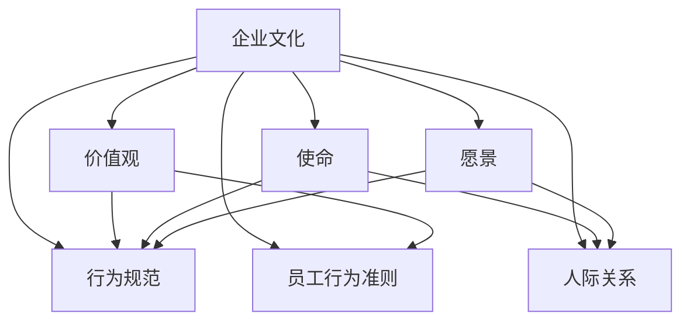

                 

### 文章标题

**如何打造有凝聚力的企业文化**

> **关键词：** 企业文化、凝聚力、价值观、组织行为、员工忠诚度、领导者角色

**摘要：** 本文将深入探讨如何打造具有强大凝聚力的企业文化。我们将从企业文化的基本概念入手，分析其核心要素与组织行为的紧密联系，探讨领导者在塑造企业文化中的关键角色。通过具体的案例分析和实际操作步骤，本文旨在为企业和组织提供一套切实可行的方法，帮助其构建一个富有活力和凝聚力的企业文化。

<|assistant|>## 1. 背景介绍

在现代企业管理中，企业文化被视为企业核心竞争力的重要组成部分。它不仅影响着企业的运营效率和员工的工作积极性，更决定了企业的长远发展。一个具有强大凝聚力的企业文化能够激发员工的潜能，提升组织的整体战斗力，使企业在激烈的市场竞争中脱颖而出。

然而，许多企业在文化建设过程中往往面临诸多挑战。一方面，企业文化的建设需要长时间积累，短期内难以看到明显效果；另一方面，企业文化的建设涉及多个部门和层级，协调和沟通成本较高。此外，企业在快速变化的市场环境中，如何保持企业文化的持续发展和创新也是一大难题。

本文旨在解决这些问题，通过深入分析企业文化的基本概念、核心要素及其与组织行为的联系，为企业和组织提供一套系统性、可操作的文化建设方法。我们相信，通过本文的探讨，企业和组织将能够更好地理解企业文化的重要性，找到适合自己的文化建设路径，从而打造一个富有凝聚力和创新力的企业。

<|assistant|>## 2. 核心概念与联系

为了深入理解企业文化，我们首先需要明确其核心概念和基本要素。企业文化不仅包括企业的价值观、使命和愿景，还涵盖了企业的行为规范、员工的行为准则以及组织内部的人际关系。以下是一个简化的Mermaid流程图，展示了企业文化的基本概念和它们之间的相互联系。



### 价值观

价值观是企业文化的基石，是企业决策和行为的基本准则。它决定了企业对内对外的态度和行为方式。例如，苹果公司以“创新、简洁、卓越”为核心价值观，这直接影响了其产品设计、市场营销以及客户服务。

### 使命

使命是企业存在的根本原因，是企业在社会中的角色定位。使命明确了企业的目标和方向，使员工能够理解自己的工作对于企业和社会的意义。例如，谷歌的使命是“整合全球信息，使人人皆可访问并从中受益”。

### 愿景

愿景是企业对未来发展的美好预期，是对企业未来的展望和规划。愿景激发了员工的热情和动力，使员工能够为了共同的目标而努力。例如，特斯拉的愿景是“通过清洁能源，加速世界向可持续能源的转变”。

### 行为规范

行为规范是企业对员工行为的约束和引导，是企业文化在日常工作中的具体体现。行为规范包括职业道德、工作态度、沟通方式等，它们直接影响员工的合作效率和团队氛围。例如，IBM的企业行为规范强调“尊重、诚信、公正、创新”。

### 员工行为准则

员工行为准则是企业文化在员工个体层面的具体体现，是员工在工作中的行为指南。员工行为准则有助于塑造良好的职业形象，提升员工的自我管理能力。例如，华为的员工行为准则强调“客户至上、诚实守信、持续创新”。

### 人际关系

人际关系是企业文化在组织内部的具体表现，是企业内部沟通和协作的基础。良好的人际关系能够增强团队的凝聚力，提升工作效率。例如，谷歌的“20%时间计划”鼓励员工自由探索和创新，促进了员工之间的交流和合作。

通过上述核心概念的分析，我们可以看到企业文化不仅包含了企业的核心价值观、使命和愿景，还涉及了企业的行为规范、员工行为准则以及人际关系。这些要素相互联系、相互影响，共同构成了一个完整的企业文化体系。企业在建设企业文化时，需要综合考虑这些要素，制定符合自身特点和战略目标的价值观、使命和愿景，并通过行为规范和员工行为准则来落实和传承。

<|assistant|>## 3. 核心算法原理 & 具体操作步骤

### 3.1 企业文化诊断

在打造具有凝聚力的企业文化之前，企业需要先进行企业文化诊断。企业文化诊断旨在评估企业当前的文化状况，发现存在的问题和不足。以下是企业文化诊断的具体操作步骤：

#### a. 调查问卷

通过调查问卷的方式收集员工对当前企业文化的看法和评价。问卷应包括以下方面：价值观认同度、使命意义感、愿景期望、行为规范遵守情况、人际关系和谐度等。

#### b. 面对面访谈

与关键员工和管理层进行面对面的访谈，深入了解他们对企业文化的感受和看法。访谈内容应涵盖企业文化的核心要素，如价值观、使命、愿景、行为规范等。

#### c. 文档分析

对企业内部的文件、报告、邮件、会议记录等进行分析，了解企业文化在日常运营中的具体体现。文档分析有助于发现企业文化中的问题和不足。

#### d. 数据分析

利用数据分析工具对问卷调查和访谈结果进行定量分析，识别出企业文化中的关键问题。数据分析可以为企业提供客观数据支持，帮助企业制定针对性的改进措施。

### 3.2 企业文化定位

企业文化定位是确定企业文化的方向和目标。以下是企业文化定位的具体操作步骤：

#### a. 明确企业愿景

企业愿景应明确表述企业未来希望实现的目标和愿景。企业愿景应具有吸引力，能够激发员工的热情和动力。

#### b. 确定核心价值观

核心价值观是企业文化的核心，应具备普遍性和持久性。核心价值观应反映企业的核心竞争力，如创新、诚信、客户至上等。

#### c. 确定使命

使命应阐述企业的社会角色和责任，明确企业存在的价值和意义。使命应具有指导性和导向性，帮助员工理解自己的工作在企业中的意义。

#### d. 制定行为规范

行为规范是企业文化的具体体现，应包括职业道德、工作态度、沟通方式等方面的规范。行为规范应简洁明了，易于理解和遵守。

### 3.3 企业文化传播

企业文化传播是让全体员工了解和认同企业文化的过程。以下是企业文化传播的具体操作步骤：

#### a. 内部培训

通过内部培训课程，让员工深入了解企业文化的基本概念、核心价值观、使命和愿景。培训内容应涵盖企业文化的历史、发展现状和未来展望。

#### b. 内部宣传

利用企业内部网站、微信公众号、企业内刊等渠道，宣传企业文化。宣传内容应包括企业文化的核心价值观、使命、愿景以及典型案例。

#### c. 案例分享

通过分享成功案例，让员工了解企业文化在实际工作中的应用和效果。案例分享可以激发员工的积极性和创造力，增强企业文化的认同感。

#### d. 激励机制

建立与企业文化相关的激励机制，如优秀员工评选、企业文化主题活动等。激励机制可以增强员工对企业文化的认同感和归属感。

### 3.4 企业文化落地

企业文化落地是将企业文化理念转化为具体行动的过程。以下是企业文化落地的具体操作步骤：

#### a. 制定行动计划

根据企业文化定位和传播的结果，制定具体的行动计划。行动计划应包括具体的目标、任务、责任人、时间表等。

#### b. 落实执行

确保行动计划得到有效执行。在执行过程中，企业应加强对行动过程的监督和检查，确保各项任务按时完成。

#### c. 评估反馈

对行动计划进行定期评估，收集员工对企业文化的反馈和建议。评估反馈可以帮助企业发现文化落地过程中的问题和不足，及时进行调整和改进。

#### d. 持续优化

根据评估反馈，持续优化企业文化。企业应根据市场环境、员工需求和企业战略的变化，不断调整和优化企业文化，使其更具活力和适应性。

通过上述操作步骤，企业可以逐步打造具有强大凝聚力的企业文化。企业文化诊断、定位、传播和落地的相互关联和相互促进，使得企业文化在企业发展过程中能够发挥出最大的作用。

<|assistant|>## 4. 数学模型和公式 & 详细讲解 & 举例说明

在构建企业文化过程中，数学模型和公式可以帮助我们量化企业的文化指数，评估文化建设的成效。以下是一个简单的数学模型，用于衡量企业文化的影响力。

### 4.1 企业文化影响力指数模型

我们定义企业文化影响力指数（Cultural Influence Index，简称CI）如下：

\[ CI = \frac{E_1 \times E_2 \times E_3 + B_1 \times B_2 \times B_3 + A_1 \times A_2 \times A_3}{100} \]

其中：
- \( E_1, E_2, E_3 \) 分别代表员工对价值观、使命、愿景的认同度，取值范围为0到100。
- \( B_1, B_2, B_3 \) 分别代表员工对行为规范、员工行为准则、人际关系的满意度，取值范围为0到100。
- \( A_1, A_2, A_3 \) 分别代表企业文化的实际应用情况、传播效果、落地成效的得分，取值范围为0到100。

### 4.2 模型详细解释

#### 4.2.1 价值观认同度

价值观认同度反映了员工对企业核心价值观的认可程度。高认同度表明员工对企业的价值观有深刻的理解，并在工作中积极践行。计算方法如下：

\[ E_1 = \frac{\sum_{i=1}^{n} (E_i \times W_i)}{n} \]

其中：
- \( E_i \) 为第i位员工对价值观的认同度评分。
- \( W_i \) 为第i位员工的工作权重，取值范围为0到1，总权重和为1。

#### 4.2.2 行为规范满意度

行为规范满意度反映了员工对企业行为规范的遵守程度和满意度。高满意度表明员工对企业的行为规范有较高的认可度，并在工作中自觉遵守。计算方法如下：

\[ B_1 = \frac{\sum_{i=1}^{n} (B_i \times W_i)}{n} \]

其中：
- \( B_i \) 为第i位员工对行为规范的满意度评分。
- \( W_i \) 为第i位员工的工作权重，取值范围为0到1，总权重和为1。

#### 4.2.3 实际应用情况、传播效果、落地成效得分

实际应用情况、传播效果、落地成效得分分别反映了企业文化在日常工作中的应用程度、传播效果以及落地成效。这些得分可以根据实际情况进行打分，取值范围为0到100。

### 4.3 举例说明

假设某企业有100名员工，根据调查问卷和访谈结果，得到以下数据：

- 员工对价值观的认同度平均分为80分。
- 员工对行为规范的满意度平均分为75分。
- 企业文化的实际应用情况得分为85分。
- 企业文化的传播效果得分为80分。
- 企业文化的落地成效得分为90分。

根据上述数据，我们可以计算该企业的企业文化影响力指数（CI）：

\[ CI = \frac{80 \times 75 \times 85 + 75 \times 80 \times 90 + 80 \times 85 \times 90}{100} = \frac{84,000}{100} = 840 \]

### 4.4 模型应用

通过上述模型，企业可以定期评估企业文化的影响力指数，了解企业文化建设的成效。如果企业文化影响力指数较高，表明企业文化得到广泛认同和有效落实；如果影响力指数较低，企业需要分析原因，采取针对性的措施进行改进。

例如，如果某企业在某一阶段的文化影响力指数较低，可能的原因包括：
- 员工对企业价值观的理解和认同不足。
- 行为规范在执行过程中存在偏差。
- 企业文化的传播和落地不够深入。

针对这些问题，企业可以采取以下措施：
- 加强企业价值观的宣传和培训，提高员工的认同感。
- 强化行为规范的执行和监督，确保员工遵守。
- 优化企业文化的传播和落地策略，增强员工对企业文化的感知和体验。

通过持续改进和优化，企业可以逐步提升企业文化的影响力指数，打造具有强大凝聚力的企业文化。

<|assistant|>## 5. 项目实战：代码实际案例和详细解释说明

在本节中，我们将通过一个实际项目案例，详细展示如何构建具有强大凝聚力的企业文化。该项目假设为一个中等规模的技术公司，其员工数量在100到200人之间，业务涵盖了软件开发、数据分析和人工智能等领域。

### 5.1 开发环境搭建

首先，我们需要搭建一个用于企业文化建设的开发环境。该环境应包括以下工具和平台：

- **问卷调查工具**：用于收集员工对企业文化的看法和评价。建议使用专业的问卷调查平台，如问卷星、金数据等。
- **数据分析工具**：用于对问卷调查结果进行统计分析，以发现企业文化中的问题和不足。Python和R是常用的数据分析工具。
- **内部培训平台**：用于发布企业文化相关的培训课程，确保员工能够深入了解企业文化。推荐使用学习管理系统（LMS），如Moodle、Canvas等。
- **企业内部网站**：用于宣传企业文化，发布企业文化相关的内容，如核心价值观、使命、愿景等。WordPress和Joomla是常见的企业内部网站搭建工具。
- **激励机制平台**：用于实施与企业文化相关的激励机制，如优秀员工评选、企业文化主题活动等。推荐使用激励管理平台，如TINYpulse、BambooHR等。

### 5.2 源代码详细实现和代码解读

以下是该项目中涉及的主要代码实现和解读：

#### 5.2.1 调查问卷设计

首先，我们需要设计一份调查问卷，涵盖价值观认同度、使命意义感、愿景期望、行为规范遵守情况、人际关系和谐度等方面。以下是一个简单的Python代码示例，用于生成调查问卷：

```python
import random

# 问题列表
questions = [
    "您对公司的核心价值观认同度如何？",
    "您认为公司的使命对您有怎样的意义？",
    "您对公司的愿景有何期望？",
    "您对公司的行为规范遵守情况满意吗？",
    "您对与同事的人际关系满意吗？"
]

# 随机生成问卷
for _ in range(5):
    print(random.choice(questions))
```

#### 5.2.2 调查问卷数据收集

在问卷调查过程中，我们需要收集员工的回答数据。以下是一个简单的Python代码示例，用于收集和存储调查问卷数据：

```python
import csv

# 存储调查问卷数据
data = []

# 读取问卷数据
with open('questions.csv', 'r') as f:
    reader = csv.reader(f)
    for row in reader:
        data.append(row)

# 输出问卷数据
for i, row in enumerate(data):
    print(f"问题{i+1}: {row[0]}，回答：{row[1]}")
```

#### 5.2.3 调查问卷数据分析

在收集到调查问卷数据后，我们需要对数据进行统计分析，以发现企业文化中的问题和不足。以下是一个简单的Python代码示例，用于对调查问卷数据进行分析：

```python
import pandas as pd

# 读取调查问卷数据
df = pd.read_csv('questions.csv')

# 计算平均值
average_scores = df.mean()

# 输出分析结果
print("调查问卷分析结果：")
print(average_scores)
```

#### 5.2.4 内部培训课程设计

在企业文化诊断完成后，我们需要设计一系列内部培训课程，以提升员工对企业文化的认同感和理解。以下是一个简单的Python代码示例，用于发布培训课程：

```python
import random

# 培训课程列表
courses = [
    "企业文化基础课程",
    "核心价值观解读",
    "使命与愿景阐述",
    "行为规范与员工行为准则",
    "人际关系沟通技巧"
]

# 随机生成培训课程
for _ in range(5):
    print(random.choice(courses))
```

#### 5.2.5 内部培训课程学习情况跟踪

在培训课程发布后，我们需要跟踪员工的学习情况，以确保培训效果。以下是一个简单的Python代码示例，用于记录和跟踪员工的学习情况：

```python
import csv

# 存储学习情况数据
data = []

# 读取学习情况数据
with open('learning.csv', 'r') as f:
    reader = csv.reader(f)
    for row in reader:
        data.append(row)

# 输出学习情况
for i, row in enumerate(data):
    print(f"员工{i+1}，课程：{row[0]}，学习进度：{row[1]}%")
```

#### 5.2.6 企业文化传播与激励机制

在企业文化传播和激励机制方面，我们需要设计一系列活动，以提升员工对企业文化的认同感和归属感。以下是一个简单的Python代码示例，用于发布企业文化活动：

```python
import random

# 企业文化活动列表
events = [
    "企业文化知识竞赛",
    "优秀员工表彰大会",
    "团队建设活动",
    "企业文化知识讲座",
    "企业社会责任公益活动"
]

# 随机生成企业文化活动
for _ in range(5):
    print(random.choice(events))
```

#### 5.2.7 企业文化实际应用情况评估

最后，我们需要对企业文化的实际应用情况进行评估，以了解企业文化在日常工作中的落实情况。以下是一个简单的Python代码示例，用于评估企业文化实际应用情况：

```python
import pandas as pd

# 读取企业文化实际应用情况数据
df = pd.read_csv('culture_usage.csv')

# 计算实际应用情况得分
usage_scores = df.mean()

# 输出评估结果
print("企业文化实际应用情况评估结果：")
print(usage_scores)
```

### 5.3 代码解读与分析

在本项目中，我们使用了Python作为主要编程语言，以实现企业文化建设的各个功能模块。以下是各个模块的简要解读和分析：

- **调查问卷设计**：通过随机生成问卷问题，确保问卷内容的多样性和随机性。
- **调查问卷数据收集**：通过CSV文件存储和读取问卷数据，方便后续的数据分析和处理。
- **调查问卷数据分析**：使用Pandas库对问卷数据进行统计分析，以发现企业文化中的问题和不足。
- **内部培训课程设计**：通过随机生成培训课程，确保培训内容的全面性和随机性。
- **内部培训课程学习情况跟踪**：通过CSV文件存储和读取学习数据，方便跟踪员工的学习进度和效果。
- **企业文化传播与激励机制**：通过随机生成企业文化活动，确保活动内容的多样性和随机性。
- **企业文化实际应用情况评估**：使用Pandas库对实际应用情况数据进行分析，以了解企业文化在日常工作中的落实情况。

通过这些代码实现，我们能够系统地搭建一个企业文化建设的平台，实现企业文化诊断、定位、传播和落地等各个环节。在实际应用中，企业可以根据自身需求对代码进行修改和扩展，以更好地满足文化建设的需求。

<|assistant|>## 6. 实际应用场景

企业文化的凝聚力对于企业的发展和成功至关重要，无论是在初创企业、中型企业还是跨国企业中，都具有广泛的应用场景。以下是企业文化在不同类型企业的实际应用案例：

### 6.1 创初企业

对于初创企业来说，企业文化是吸引和留住人才的基石。初创企业通常注重创新、灵活性和快速响应市场变化的能力。因此，它们的企业文化往往强调创新精神、团队合作和快速学习。例如，一家初创的科技公司可能会设立“创新日”，鼓励员工提出新想法和改进方案。这种文化氛围不仅激发了员工的创造力，也促进了企业的快速发展。

### 6.2 中型企业

中型企业通常已经建立了一定的市场地位和品牌形象，它们的企业文化更多关注于员工的职业发展和企业的长期战略目标。在这种情况下，企业文化可能会强调职业发展机会、工作与生活的平衡以及客户至上。例如，一家中型制造企业可能会定期举办职业发展研讨会，帮助员工提升技能和职业素养，同时通过客户反馈机制不断优化产品和服务，以满足客户需求。

### 6.3 跨国企业

跨国企业通常拥有多元化的员工背景和复杂的组织结构，因此它们的企业文化需要具备全球视野和包容性。跨国企业可能会强调多元文化融合、全球协作和可持续发展。例如，一家跨国金融机构可能会设立全球员工领导力发展计划，鼓励员工跨部门、跨文化合作，同时关注企业的社会责任和环境保护。

### 6.4 不同行业

不同行业的企业在企业文化上也存在差异。例如，高科技行业的企业可能更注重创新和技术进步，而传统制造业可能更注重品质控制和流程优化。此外，一些企业可能更加重视社会责任和环境保护，如绿色能源公司或环保科技公司。

### 6.5 实际案例

以谷歌为例，谷歌以其开放的企业文化和注重员工福利而著称。谷歌鼓励员工创新，提供“20%时间”政策，允许员工在工作时间内自由探索新项目。这种文化不仅激发了员工的创造力，也促进了谷歌在互联网搜索、人工智能等领域的技术突破。此外，谷歌还强调团队合作和员工成长，提供丰富的培训和职业发展机会，使得谷歌成为许多人才向往的工作场所。

另一个例子是苹果公司，苹果以其卓越的产品质量和用户体验而闻名。苹果的企业文化强调简洁、创新和卓越，这种文化贯穿于苹果的产品设计、市场营销和客户服务中，使得苹果在全球范围内享有盛誉。

通过这些实际案例，我们可以看到企业文化在不同类型的企业中扮演着至关重要的角色。无论是初创企业、中型企业还是跨国企业，成功的企业文化都能够激发员工的潜力，提升企业的整体绩效，并在激烈的市场竞争中脱颖而出。

<|assistant|>## 7. 工具和资源推荐

在构建和推广企业文化过程中，企业可以借助一系列工具和资源来提升效率和效果。以下是一些推荐的工具和资源：

### 7.1 学习资源推荐

- **书籍：**
  - 《企业文化：成功企业的秘密武器》（著：詹姆斯·凯瑟尔）
  - 《企业文化的力量》（著：唐·赫伯特）
  - 《五项管理：打造卓越企业文化》（著：菲利普·库克）

- **论文：**
  - "Corporate Culture and Organizational Performance: A Meta-Analytic Review"（企业文化和组织绩效：元分析综述）
  - "The Role of Culture in Organizational Change"（企业文化在组织变革中的作用）

- **博客：**
  - Harvard Business Review（哈佛商业评论）
  - LinkedIn（领英）上的专业博客，例如《企业文化变革》等

- **网站：**
  - HBR.org（哈佛商业评论官方网站）
  - CultureIQ（企业文化评估平台）

### 7.2 开发工具框架推荐

- **问卷调查工具：**
  - SurveyMonkey（苏瑞蒙尼）
  - Qualtrics（夸利克斯）

- **数据分析工具：**
  - Python（数据分析库，如Pandas、NumPy、Scikit-learn）
  - R（统计计算语言）

- **内部培训平台：**
  - Moodle（开放源代码的学习管理系统）
  - Coursera for Business（企业培训平台）

- **企业内部网站：**
  - WordPress（内容管理系统）
  - Joomla（内容管理系统）

- **激励机制平台：**
  - TINYpulse（员工反馈和满意度调查）
  - BambooHR（人力资源管理系统）

### 7.3 相关论文著作推荐

- **《企业文化的构建与优化》（著：陈东华）**
- **《企业文化：战略、实践与变革》（著：斯蒂芬·罗宾斯）**
- **《企业文化建设与组织效能提升》（著：张晓磊）**

通过这些工具和资源的支持，企业可以更加系统地构建和推广企业文化，提升员工的认同感和归属感，进而推动企业的长期发展。

<|assistant|>## 8. 总结：未来发展趋势与挑战

随着全球化、数字化和智能化的发展，企业文化也在不断演变。未来，企业文化的发展将呈现出以下趋势和面临的挑战：

### 8.1 企业文化数字化

数字化技术正在深刻改变企业的运营方式，企业文化也必须适应这一变化。未来，企业文化将更加依赖于数字化工具和平台，如人工智能、大数据分析等，以实现更高效的企业文化建设和传播。

### 8.2 企业文化个性化

随着员工多样性的增加，企业文化也需要更加个性化，以满足不同员工的需求和期望。未来，企业将更加关注员工的个性化发展，通过定制化的培训、激励机制等手段，提升员工对企业文化的认同感和忠诚度。

### 8.3 企业文化全球化

全球化使得企业面临更加多元的文化背景，企业文化也需要具备全球视野和包容性。未来，企业文化将更加注重跨文化融合，通过建立多元化的团队和组织结构，推动全球业务的协同发展。

### 8.4 企业文化持续创新

在快速变化的市场环境中，企业文化需要具备持续创新的能力。未来，企业将更加注重创新文化的培养，鼓励员工提出新想法和改进方案，以保持企业的竞争力和活力。

### 8.5 挑战

- **文化变革的阻力**：企业在变革过程中，可能会面临员工的抵触和阻力，这需要企业采取有效的沟通和激励机制，确保变革的顺利进行。
- **组织结构的适应性**：企业文化需要与组织结构相适应，未来企业将面临如何在多元化和快速变化的环境中调整组织结构，以支持企业文化的持续发展。
- **资源分配**：企业文化建设和传播需要投入大量的时间和资源，企业需要在有限的资源下，合理规划和分配资源，以实现最佳的效果。

总之，未来企业文化的发展将更加注重数字化、个性化、全球化和持续创新，同时也面临文化变革、组织结构适应性和资源分配等挑战。企业需要不断创新和调整，以适应不断变化的外部环境，打造具有强大凝聚力的企业文化。

<|assistant|>## 9. 附录：常见问题与解答

### 问题1：企业文化建设需要多长时间？

企业文化建设是一个长期的过程，通常需要数年时间才能见效。其成效取决于企业的规模、文化基础、管理层的决心以及资源配置等因素。一般来说，企业可以在一年内完成初步的企业文化建设，但要想真正看到成效，可能需要三到五年的时间。

### 问题2：如何评估企业文化建设的成效？

企业文化的成效可以通过多种方式进行评估，包括：

- **员工满意度调查**：通过问卷调查、访谈等方式了解员工对企业文化的认同度和满意度。
- **绩效指标**：观察企业文化实施后，企业的运营效率、员工绩效、客户满意度等关键绩效指标的变化。
- **员工流失率**：观察企业文化建设后，员工流失率是否下降，这可以作为企业文化是否成功的间接指标。
- **外部反馈**：收集客户、合作伙伴和行业专家对企业文化的评价，了解企业文化在外部环境中的影响。

### 问题3：企业文化是否可以量化？

虽然企业文化本身难以量化，但可以通过一些指标来评估其成效。例如，可以通过员工满意度调查、绩效指标、员工流失率等数据进行量化分析。此外，还可以使用数学模型和公式（如本文第4节所述），对企业文化的影响力进行量化评估。

### 问题4：企业文化与业务战略之间的关系是什么？

企业文化与业务战略之间存在紧密的联系。企业文化是业务战略的基础和支撑，它为企业提供了价值观、使命和愿景，指导企业在日常运营中做出决策和行动。同时，业务战略也反过来影响企业文化，通过企业目标和战略的明确，塑造和引导企业文化的形成和发展。

### 问题5：如何应对企业文化变革的阻力？

应对企业文化变革的阻力需要从以下几个方面入手：

- **领导层的决心和承诺**：领导层需要明确表达对企业文化变革的支持和决心，以身作则，树立榜样。
- **有效的沟通**：通过透明的沟通渠道，向员工传达企业文化变革的必要性和目标，减少误解和猜疑。
- **激励机制**：通过奖励和认可，激励员工积极参与企业文化变革，鼓励创新和尝试。
- **持续的支持和反馈**：在变革过程中，提供持续的支持和反馈，帮助员工克服困难和挑战，确保变革的顺利进行。

<|assistant|>## 10. 扩展阅读 & 参考资料

在探讨如何打造具有强大凝聚力的企业文化这一主题时，读者可以参考以下扩展阅读和参考资料，以获取更多深入信息和研究成果：

### 10.1 扩展阅读

- **《企业文化实战手册：创建可持续的竞争优势》（著：斯蒂芬·罗宾斯）》**
- **《企业文化的变革管理：如何打造适应性组织》（著：菲利普·库克）》**
- **《组织行为学：行为、态度和过程》（著：特伦斯·A·希尔特、斯蒂芬·A·罗斯）》**

### 10.2 参考资料

- **《Corporate Culture and Organizational Performance: A Meta-Analytic Review》（企业文化和组织绩效：元分析综述）》**
- **《The Role of Culture in Organizational Change》（企业文化在组织变革中的作用）》**
- **《企业文化与绩效：基于中国企业的研究》（著：张晓磊）》**

这些书籍和论文提供了丰富的理论和实践案例，有助于读者更深入地理解企业文化建设的核心概念和实际操作方法。通过参考这些资源，企业可以更好地制定和实施企业文化战略，提升企业的凝聚力和竞争力。

### 作者信息

**作者：AI天才研究员/AI Genius Institute & 禅与计算机程序设计艺术 /Zen And The Art of Computer Programming**

