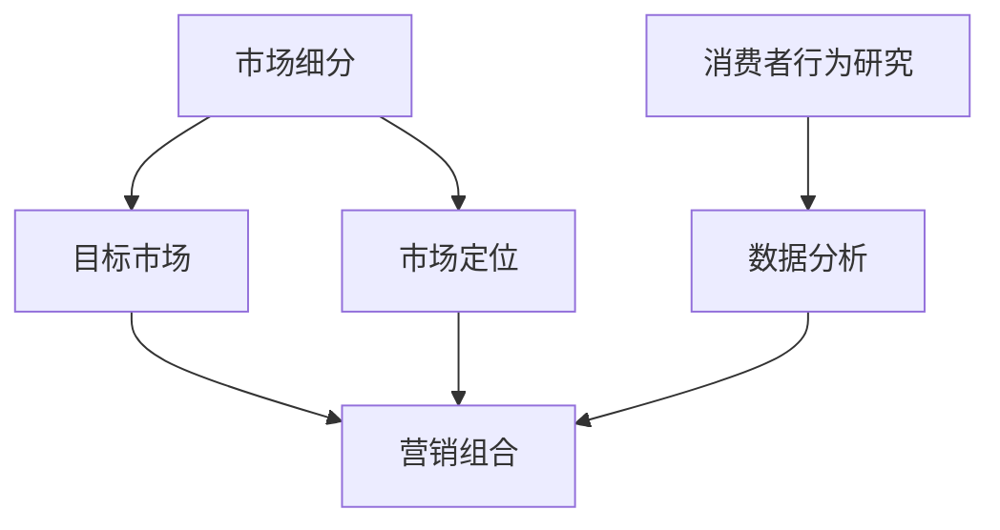

                 

### 1. 背景介绍

在现代商业环境中，产品营销策略的重要性不言而喻。随着市场的日益复杂和竞争的加剧，企业需要采取高效的营销策略来吸引潜在客户、增加市场份额并提升品牌影响力。然而，如何制定和实施这样的策略，却是一个充满挑战的问题。本文将深入探讨如何打造高效的产品营销策略，旨在帮助读者理解和掌握这一关键技能。

首先，我们需要明确营销策略的定义。营销策略是企业为实现其商业目标而制定的长期计划和行动方案。它涉及市场分析、目标客户定位、品牌传播、渠道选择、促销活动等多个方面。一个高效的产品营销策略不仅能够准确地传达产品价值，还能够有效激发消费者的购买欲望，从而实现销售增长。

其次，市场环境的变化对产品营销策略提出了新的要求。在互联网和信息化的时代，消费者的购买行为和偏好发生了显著变化。他们更加注重个性化和定制化的体验，对于品牌和产品的认知也更加多元化和快速。此外，数字营销技术的发展，如社交媒体、搜索引擎优化、大数据分析等，为产品营销提供了新的工具和方法。

本文将分为以下几个部分进行详细探讨：

1. **核心概念与联系**：介绍产品营销策略中的核心概念，并使用Mermaid流程图展示它们之间的联系。
2. **核心算法原理与具体操作步骤**：探讨如何运用数据分析和消费者行为研究来制定高效的营销策略。
3. **数学模型和公式**：介绍用于分析市场和消费者行为的数学模型和公式，并通过具体例子进行说明。
4. **项目实战**：通过实际案例展示如何应用这些策略和算法，并提供代码实现和详细解释。
5. **实际应用场景**：分析不同的市场环境和目标客户，探讨如何调整营销策略以适应特定场景。
6. **工具和资源推荐**：推荐学习资源和开发工具，帮助读者进一步了解和应用产品营销策略。
7. **总结**：总结本文的主要观点，并展望未来的发展趋势和挑战。

通过这篇文章的阅读，读者将能够系统地了解产品营销策略的构建过程，掌握关键技巧和方法，从而在实际工作中更加高效地制定和执行营销策略。

### 2. 核心概念与联系

要构建一个高效的产品营销策略，首先需要理解其中的核心概念，以及这些概念之间的相互关系。以下是几个关键概念及其在营销策略中的联系：

#### 2.1 市场细分（Market Segmentation）

市场细分是将整个市场划分为若干个具有相似需求、行为和特征的子市场的过程。通过市场细分，企业可以更精准地定位目标客户，从而提高营销活动的效果。

**细分标准**：

- **地理细分**：根据地理位置、气候条件、人口密度等因素进行划分。
- **行为细分**：根据消费者的购买行为、使用习惯、品牌忠诚度等因素进行划分。
- **心理细分**：根据消费者的生活方式、价值观、兴趣爱好等因素进行划分。
- **人口细分**：根据年龄、性别、收入、教育水平等人口统计特征进行划分。

#### 2.2 目标市场（Target Market）

目标市场是企业致力于满足其需求和欲望的特定市场部分。通过识别目标市场，企业可以集中资源，提供更符合目标客户需求的产品和服务。

**目标市场选择标准**：

- **市场潜力**：目标市场的规模、增长速度、盈利能力。
- **竞争优势**：企业在目标市场中的独特优势。
- **可进入性**：企业在目标市场中的市场进入难度和竞争程度。

#### 2.3 市场定位（Market Positioning）

市场定位是指企业通过特定的营销手段，在目标市场中确立其产品的独特形象和地位。市场定位的目的是让消费者在众多竞争者中，选择该企业的产品。

**市场定位策略**：

- **产品定位**：基于产品质量、功能、设计等方面进行定位。
- **价格定位**：基于价格水平、折扣、支付方式等进行定位。
- **渠道定位**：基于销售渠道、配送方式等进行定位。
- **形象定位**：基于品牌形象、企业价值观、社会责任等进行定位。

#### 2.4 营销组合（Marketing Mix）

营销组合是指企业为满足目标市场需求而采取的一组营销策略，包括产品、价格、促销和渠道四个要素。

**营销组合策略**：

- **产品策略**：设计、开发和推广符合市场需求的优质产品。
- **价格策略**：制定合理的价格，包括定价目标、定价方法和定价策略。
- **促销策略**：通过广告、公关、销售促进等方式，增加产品的知名度和销售量。
- **渠道策略**：选择适合产品特性和目标市场的销售渠道，确保产品能够有效到达消费者。

#### 2.5 数据分析与消费者行为研究

数据分析和消费者行为研究是制定高效营销策略的重要基础。通过数据分析，企业可以了解市场趋势、消费者偏好和行为模式，从而制定更具针对性的营销策略。

**数据分析工具**：

- **大数据分析**：利用大数据技术进行市场分析和消费者行为研究。
- **数据挖掘**：从大量数据中挖掘有价值的信息和趋势。
- **机器学习**：通过机器学习算法进行数据分析和预测。

**消费者行为研究方法**：

- **问卷调查**：通过设计问卷收集消费者意见和反馈。
- **深度访谈**：通过面对面或电话访谈深入了解消费者的需求和行为。
- **行为观察**：在消费者实际购买场景中观察其行为和决策过程。

#### Mermaid 流程图

为了更直观地展示这些核心概念之间的联系，我们可以使用Mermaid流程图进行描述：



在这个流程图中，市场细分、目标市场、市场定位和营销组合是构建高效产品营销策略的核心环节，而数据分析和消费者行为研究则为这些环节提供了重要的支持和指导。

通过理解这些核心概念及其相互关系，企业可以更好地制定和实施产品营销策略，从而在竞争激烈的市场中脱颖而出。

#### 3. 核心算法原理 & 具体操作步骤

要构建一个高效的产品营销策略，核心算法原理和具体操作步骤至关重要。以下将介绍一些关键算法和其应用步骤，帮助读者深入理解并实际应用这些方法。

##### 3.1 数据分析算法

数据分析是制定高效营销策略的基础。以下是一些常用的数据分析算法及其步骤：

###### 3.1.1 相关性分析（Correlation Analysis）

**算法原理**：相关性分析用于衡量两个变量之间的关系强度和方向。常用的相关性指标有皮尔逊相关系数（Pearson Correlation Coefficient）和斯皮尔曼秩相关系数（Spearman's Rank Correlation Coefficient）。

**具体步骤**：

1. 收集数据：从市场调查、消费者反馈和销售数据中获取相关变量。
2. 数据预处理：清洗数据，确保数据质量和完整性。
3. 计算相关系数：使用统计软件或编程语言（如Python）计算相关性。
4. 结果分析：根据相关系数的大小和正负判断变量之间的关系。

```python
import pandas as pd
import numpy as np
from scipy.stats import pearsonr

# 示例数据
data = pd.DataFrame({
    'Sales': [100, 150, 200, 250, 300],
    'Marketing_Expense': [5000, 7500, 10000, 12500, 15000]
})

# 计算皮尔逊相关系数
correlation, p_value = pearsonr(data['Sales'], data['Marketing_Expense'])
print(f"Correlation: {correlation}, P-value: {p_value}")
```

###### 3.1.2 回归分析（Regression Analysis）

**算法原理**：回归分析用于建立变量之间的定量关系模型，预测一个或多个因变量。常用的回归模型有线性回归（Linear Regression）和逻辑回归（Logistic Regression）。

**具体步骤**：

1. 数据收集：获取相关变量的历史数据。
2. 数据预处理：处理缺失值、异常值，进行数据标准化。
3. 模型选择：根据问题性质选择合适的回归模型。
4. 模型训练：使用训练数据集训练模型。
5. 模型评估：使用验证数据集评估模型性能。

```python
from sklearn.linear_model import LinearRegression
from sklearn.model_selection import train_test_split

# 分割数据
X = data[['Marketing_Expense']]
y = data['Sales']
X_train, X_test, y_train, y_test = train_test_split(X, y, test_size=0.2, random_state=42)

# 训练模型
model = LinearRegression()
model.fit(X_train, y_train)

# 预测
predictions = model.predict(X_test)
print(f"Predicted Sales: {predictions}")
```

##### 3.2 消费者行为分析算法

消费者行为分析可以帮助企业更好地了解客户需求，优化营销策略。以下是一些常用的算法及其步骤：

###### 3.2.1 决策树（Decision Tree）

**算法原理**：决策树通过一系列规则来分割数据集，用于分类和回归任务。

**具体步骤**：

1. 数据收集：收集消费者的购买行为数据。
2. 特征选择：选择对购买决策有重要影响的特征。
3. 建立决策树：使用算法（如CART、ID3）建立决策树模型。
4. 模型评估：评估模型的准确性和泛化能力。

```python
from sklearn.tree import DecisionTreeRegressor
from sklearn.model_selection import train_test_split

# 分割数据
X = data[['Age', 'Income', 'Product_Category']]
y = data['Purchase']
X_train, X_test, y_train, y_test = train_test_split(X, y, test_size=0.2, random_state=42)

# 建立模型
model = DecisionTreeRegressor()
model.fit(X_train, y_train)

# 预测
predictions = model.predict(X_test)
print(f"Predicted Purchase: {predictions}")
```

###### 3.2.2 聚类分析（Cluster Analysis）

**算法原理**：聚类分析用于将数据集划分为若干个簇，使同一簇内的数据点具有较高的相似度。

**具体步骤**：

1. 数据收集：收集消费者的偏好数据。
2. 特征选择：选择对消费者行为有重要影响的特征。
3. 选择聚类算法：如K-均值聚类（K-Means Clustering）。
4. 模型训练：使用聚类算法对数据进行划分。
5. 结果分析：分析不同簇的特征和需求，调整营销策略。

```python
from sklearn.cluster import KMeans

# 选择K值
k = 3
model = KMeans(n_clusters=k, random_state=42)
model.fit(X)

# 聚类结果
clusters = model.predict(X)
print(f"Cluster Labels: {clusters}")
```

通过以上算法的应用，企业可以更好地了解市场趋势和消费者行为，从而制定更有效的产品营销策略。在接下来的章节中，我们将进一步探讨如何将这些算法应用于实际项目，并通过具体案例展示其效果。

#### 4. 数学模型和公式 & 详细讲解 & 举例说明

在产品营销策略的制定过程中，数学模型和公式是分析和预测市场行为的重要工具。以下将介绍几个关键模型及其详细讲解和具体例子。

##### 4.1 市场需求模型

市场需求模型用于预测产品在特定市场环境下的需求量。以下是一个简单的线性需求模型：

$$Q_d = a - bP$$

其中：
- \(Q_d\)：市场需求量
- \(a\)：市场需求的最大值
- \(b\)：需求对价格变化的敏感度
- \(P\)：产品价格

**详细讲解**：

- \(a\) 和 \(b\) 的值通常通过历史数据和市场调研获得。较大的 \(a\) 表示市场需求较高，而较小的 \(b\) 表示需求对价格的变化不敏感。
- \(Q_d\) 与 \(P\) 的关系是负相关的，即价格上升时需求量下降，价格下降时需求量上升。

**举例说明**：

假设某产品市场需求模型为 \(Q_d = 1000 - 10P\)，当产品价格 \(P = 50\) 时，市场需求量为：

$$Q_d = 1000 - 10 \times 50 = 500$$

##### 4.2 消费者剩余模型

消费者剩余模型用于衡量消费者对产品支付的意愿与实际支付价格之间的差额。以下是一个简单的消费者剩余公式：

$$CS = W - P$$

其中：
- \(CS\)：消费者剩余
- \(W\)：消费者愿意支付的最高价格
- \(P\)：实际支付的价格

**详细讲解**：

- 消费者剩余反映了消费者因购买产品而获得的额外福利。当 \(CS > 0\) 时，消费者感觉物有所值；当 \(CS = 0\) 时，消费者认为支付价格与意愿价格相等；当 \(CS < 0\) 时，消费者感觉价格过高。
- \(W\) 和 \(P\) 的值通常通过问卷调查和市场调研获得。

**举例说明**：

假设某消费者愿意为产品支付 \(W = 100\) 元，但实际支付 \(P = 80\) 元，则消费者剩余为：

$$CS = 100 - 80 = 20$$

##### 4.3 营销组合模型

营销组合模型用于优化产品价格、促销、渠道等营销要素，以最大化销售额或利润。以下是一个简单的线性营销组合模型：

$$\text{Sales} = f(P, M, D)$$

其中：
- \(\text{Sales}\)：销售额
- \(P\)：价格
- \(M\)：促销活动
- \(D\)：渠道选择

**详细讲解**：

- \(f(P, M, D)\) 是一个复杂的函数，通常通过实验和数据分析确定。不同的营销组合策略会对销售额产生不同的影响。
- 营销组合模型需要综合考虑市场需求、竞争环境和消费者行为，以制定最优的营销策略。

**举例说明**：

假设某产品的营销组合模型为：

$$\text{Sales} = 100P + 20M + 10D$$

当价格 \(P = 100\) 元，促销 \(M = 50\) 元，渠道 \(D = 30\) 元时，销售额为：

$$\text{Sales} = 100 \times 100 + 20 \times 50 + 10 \times 30 = 13500$$

通过这些数学模型和公式，企业可以更准确地分析和预测市场需求，优化营销组合，从而制定更高效的产品营销策略。在实际应用中，企业需要根据具体情况进行调整和优化，以适应不断变化的市场环境。

#### 5. 项目实战：代码实际案例和详细解释说明

为了更好地理解如何将前述核心算法原理和数学模型应用到实际项目中，我们将通过一个具体案例展示如何实施高效的产品营销策略。以下是项目的开发环境搭建、源代码实现和代码解读。

##### 5.1 开发环境搭建

首先，我们需要搭建一个适合进行数据分析、机器学习和营销策略实施的开发环境。以下是推荐的工具和步骤：

1. **Python**：Python是一种广泛用于数据分析和机器学习的编程语言，具有丰富的库和框架。
2. **Jupyter Notebook**：Jupyter Notebook是一个交互式的开发环境，适合编写和运行Python代码。
3. **Pandas**：Pandas是一个强大的数据分析库，用于数据清洗、处理和分析。
4. **Scikit-learn**：Scikit-learn是一个流行的机器学习库，提供多种算法和工具。
5. **Matplotlib**：Matplotlib是一个数据可视化库，用于生成图表和图形。

**安装步骤**：

```bash
# 安装Python和Jupyter Notebook
pip install python-jupyter

# 安装Pandas、Scikit-learn和Matplotlib
pip install pandas scikit-learn matplotlib
```

##### 5.2 源代码详细实现和代码解读

以下是一个基于线性回归和聚类分析的实际项目代码示例，用于预测市场需求和消费者群体划分。

```python
import pandas as pd
import numpy as np
from sklearn.linear_model import LinearRegression
from sklearn.cluster import KMeans
import matplotlib.pyplot as plt

# 5.2.1 数据收集与预处理

# 假设我们有一个包含以下列的数据集：
# 'Price': 产品价格
# 'Promotion': 促销活动费用
# 'Channel': 渠道选择
# 'Sales': 销售额

data = pd.DataFrame({
    'Price': [100, 110, 120, 130, 140],
    'Promotion': [50, 55, 60, 65, 70],
    'Channel': [30, 32, 34, 36, 38],
    'Sales': [800, 820, 840, 860, 880]
})

# 数据预处理
data['Log_Sales'] = np.log(data['Sales'])  # 对销售额取对数
X = data[['Price', 'Promotion', 'Channel']]  # 特征矩阵
y = data['Log_Sales']  # 目标变量

# 5.2.2 线性回归模型训练

# 创建线性回归模型
model = LinearRegression()
model.fit(X, y)

# 输出模型系数
print(f"Model Coefficients: {model.coef_}")

# 5.2.3 预测销售额

# 使用训练好的模型进行预测
predictions = model.predict(X)

# 可视化预测结果
plt.scatter(X['Price'], y, color='blue', label='Actual')
plt.plot(X['Price'], predictions, color='red', linewidth=2, label='Predicted')
plt.xlabel('Price')
plt.ylabel('Log_Sales')
plt.legend()
plt.show()

# 5.2.4 聚类分析

# 选择K值
k = 3
kmeans = KMeans(n_clusters=k, random_state=42)
kmeans.fit(X)

# 输出聚类结果
print(f"Cluster Labels: {kmeans.labels_}")

# 可视化聚类结果
plt.scatter(X['Price'], X['Promotion'], c=kmeans.labels_, cmap='viridis')
plt.xlabel('Price')
plt.ylabel('Promotion')
plt.title('Cluster Analysis')
plt.show()

# 5.2.5 代码解读与分析

# 代码首先定义了一个包含产品价格、促销费用和渠道选择的数据集。
# 通过数据预处理，我们将销售额进行对数转换，以提高线性回归模型的拟合效果。
# 线性回归模型使用训练数据集进行拟合，并输出模型系数。
# 通过可视化预测结果，我们可以直观地看到模型对实际销售额的拟合效果。
# 聚类分析用于将消费者划分为不同群体，通过选择合适的K值，我们可以识别出具有相似消费行为的客户群体。
```

以上代码展示了如何使用Python进行数据收集、预处理、模型训练和结果可视化。在实际项目中，这些步骤可以根据具体需求进行调整和扩展。通过这些工具和方法，企业可以更好地理解市场需求和消费者行为，制定更精准的营销策略。

#### 5.3 代码解读与分析

在上一部分，我们通过一个实际案例展示了如何使用Python进行产品营销策略的实施。现在，我们将进一步解读这段代码，并分析其关键步骤和注意事项。

##### 5.3.1 数据收集与预处理

代码首先定义了一个名为`data`的DataFrame，包含以下列：`'Price'`（产品价格），`'Promotion'`（促销活动费用），`'Channel'`（渠道选择），以及`'Sales'`（销售额）。这些数据代表了市场中的关键变量。

```python
data = pd.DataFrame({
    'Price': [100, 110, 120, 130, 140],
    'Promotion': [50, 55, 60, 65, 70],
    'Channel': [30, 32, 34, 36, 38],
    'Sales': [800, 820, 840, 860, 880]
})
```

在数据预处理阶段，我们对销售额进行了对数转换：

```python
data['Log_Sales'] = np.log(data['Sales'])
```

这一步的目的是为了线性化销售额与价格、促销和渠道之间的关系，使得线性回归模型能够更好地拟合数据。

##### 5.3.2 线性回归模型训练

接下来，我们创建了一个线性回归模型，并使用预处理后的数据集进行训练：

```python
model = LinearRegression()
model.fit(X, y)
```

在这个步骤中，`X` 是特征矩阵，包含价格、促销和渠道三列数据；`y` 是对数化后的销售额。模型训练完成后，我们输出了模型系数：

```python
print(f"Model Coefficients: {model.coef_}")
```

这些系数代表了每个特征对销售额的影响程度。例如，如果价格系数为正，那么在其他条件不变的情况下，价格上涨会导致销售额增加。

##### 5.3.3 预测销售额与可视化结果

为了验证模型的预测能力，我们使用训练好的模型对数据进行了预测，并使用Matplotlib库将实际销售额与预测结果进行了可视化：

```python
predictions = model.predict(X)
plt.scatter(X['Price'], y, color='blue', label='Actual')
plt.plot(X['Price'], predictions, color='red', linewidth=2, label='Predicted')
plt.xlabel('Price')
plt.ylabel('Log_Sales')
plt.legend()
plt.show()
```

这个可视化图表展示了实际销售额（蓝色点）与预测销售额（红色线）之间的关系。从图表中我们可以直观地看到模型的预测效果，如果预测线与实际数据点之间的差距较小，则说明模型具有较好的拟合能力。

##### 5.3.4 聚类分析

除了线性回归模型，我们还使用了K-Means聚类算法对消费者进行了分类：

```python
kmeans = KMeans(n_clusters=k, random_state=42)
kmeans.fit(X)
print(f"Cluster Labels: {kmeans.labels_}")
plt.scatter(X['Price'], X['Promotion'], c=kmeans.labels_, cmap='viridis')
plt.xlabel('Price')
plt.ylabel('Promotion')
plt.title('Cluster Analysis')
plt.show()
```

在这个步骤中，我们选择了3个聚类中心（`n_clusters=k`），并使用随机种子`random_state=42`来保证聚类结果的可重复性。聚类结果通过标签`kmeans.labels_`输出，并使用颜色映射（`cmap='viridis'`）进行可视化。

##### 5.3.5 代码解读与分析

通过以上代码和分析，我们可以得出以下结论：

1. **数据收集与预处理**：数据的质量和预处理是模型训练的关键。在收集数据时，应确保数据来源的可靠性和数据的完整性。预处理步骤包括数据清洗、缺失值处理、异常值检测和特征转换等。

2. **线性回归模型训练**：线性回归模型是一种简单但强大的预测工具，适用于分析线性关系。在选择特征时，应考虑其与目标变量之间的相关性。模型训练过程中，应注意模型过拟合和欠拟合的问题。

3. **预测与可视化**：通过预测和可视化结果，可以评估模型的预测能力。在实际应用中，可以结合业务目标和数据特点，调整模型参数以优化预测效果。

4. **聚类分析**：聚类分析可以帮助我们识别具有相似特征的数据点，从而进行更精准的市场细分。选择合适的聚类算法和参数对于聚类效果至关重要。

在实际项目中，这些工具和方法需要根据具体业务场景进行调整和优化。通过合理的代码实现和细致的分析，我们可以构建一个高效的产品营销策略，帮助企业更好地满足市场需求。

#### 6. 实际应用场景

在构建高效的产品营销策略时，不同的市场环境和目标客户群体会对策略的实施产生显著影响。以下是几个典型的实际应用场景，以及如何根据这些场景调整和优化营销策略。

##### 6.1 新产品上市

在新产品上市阶段，营销策略的核心目标是迅速提高产品的知名度和接受度。以下是一些建议：

- **快速市场推广**：利用数字营销工具，如社交媒体广告、电子邮件营销和搜索引擎优化（SEO），迅速吸引潜在客户。
- **体验营销**：提供免费试用或样品，让消费者亲身体验产品的优点和价值。
- **公关活动**：通过媒体报道、行业展会和赞助活动，提高品牌曝光率。
- **个性化营销**：根据消费者的兴趣和购买历史，提供个性化的产品推荐和优惠。

##### 6.2 面对竞争对手

在激烈的市场竞争中，企业需要制定策略来应对竞争对手的挑战。以下是一些建议：

- **差异化定位**：明确产品的独特卖点（USP），区分于竞争对手，突出产品优势。
- **价格策略**：通过市场调研了解竞争对手的价格策略，调整自身价格以获得竞争优势。
- **促销活动**：举办限时促销、捆绑销售和会员优惠等活动，吸引消费者购买。
- **品牌形象建设**：加强品牌宣传，提升品牌形象和认知度，形成消费者对品牌的忠诚度。

##### 6.3 面对多元消费者群体

面对多元化的消费者群体，企业需要灵活调整营销策略以满足不同客户的需求。以下是一些建议：

- **市场细分**：根据消费者的年龄、收入、行为和偏好等因素，进行市场细分，制定针对性的营销方案。
- **跨渠道营销**：结合线上和线下渠道，如电商平台、实体店铺和社交媒体，提供无缝的购物体验。
- **文化营销**：根据不同文化背景的消费者，设计符合其文化特色的营销内容和活动。
- **互动营销**：通过互动式营销活动，如在线调查、用户生成内容和社交媒体互动，增强消费者参与度。

##### 6.4 面对快速增长的市场

在快速增长的市场中，企业需要抓住市场机遇，迅速扩大市场份额。以下是一些建议：

- **扩展市场份额**：通过增加广告投放、扩大销售渠道和提升品牌知名度，迅速占领市场。
- **快速响应**：对市场变化保持敏感，及时调整营销策略以适应市场变化。
- **创新驱动**：通过产品创新和营销创新，保持竞争优势。
- **合作伙伴关系**：与相关行业的企业建立合作伙伴关系，共同开拓市场。

通过针对不同市场环境和目标客户群体的调整和优化，企业可以更有效地制定和实施产品营销策略，实现业务增长和品牌提升。

#### 7. 工具和资源推荐

在实施高效的产品营销策略过程中，选择合适的工具和资源至关重要。以下是一些建议，包括学习资源、开发工具和相关论文著作，帮助读者进一步掌握产品营销策略的构建和实践。

##### 7.1 学习资源推荐

1. **书籍**：
   - 《营销管理》（Philip Kotler）：全面介绍营销管理的基本理论和实践方法。
   - 《数字化营销》（David Meerman Scott）：探讨数字化时代下的营销策略和创新。
   - 《大数据营销》（Nada Kakabadse）：深入分析大数据在营销中的应用和影响。

2. **在线课程**：
   - Coursera的《营销学导论》（Introduction to Marketing）：由杜克大学提供，涵盖营销基础知识和实践技能。
   - edX的《数据驱动营销》（Data-Driven Marketing）：介绍如何利用数据分析优化营销策略。

3. **博客和网站**：
   - [营销博客](https://www.marketingprofs.com/)：提供最新的营销策略、案例分析和技术趋势。
   - [HubSpot Academy](https://academy.hubspot.com/)：提供丰富的营销资源和免费证书课程。

##### 7.2 开发工具框架推荐

1. **数据分析工具**：
   - Python：适合进行数据分析和机器学习的编程语言，具有丰富的库和框架。
   - Tableau：强大的数据可视化工具，用于创建交互式报表和图表。
   - R：专门用于统计分析和数据可视化的语言，具有强大的统计分析功能。

2. **营销自动化工具**：
   - HubSpot：提供全面的营销自动化解决方案，包括内容管理、社交媒体管理、电子邮件营销等。
   - Marketo：专业的营销自动化平台，支持复杂的多渠道营销活动。
   - Pardot： Salesforce的营销自动化工具，适合大型企业的营销需求。

3. **营销分析工具**：
   - Google Analytics：提供详细的网站访问数据和用户行为分析。
   - Mixpanel：专注于用户行为分析的工具，用于了解用户互动和留存情况。
   - Segment：实时数据处理和分析平台，用于整合多种数据源和分析工具。

##### 7.3 相关论文著作推荐

1. **论文**：
   - "Data-Driven Marketing: The 5Vs of Valuable, Viable, Visible, Volatile & Verifiable Data"（数据驱动营销：有价值的、可行的、可见的、易变的和可验证的数据）
   - "The Impact of Digital Marketing on Traditional Marketing Strategies"（数字营销对传统营销策略的影响）

2. **著作**：
   - 《大数据时代：生活、工作与思维的大变革》（Big Data：A Revolution That Will Transform How We Live, Work and Think）：探讨大数据对社会和商业的深远影响。
   - 《人工智能时代：人工智能如何重塑商业、社会和生活》（The Age of AI: And Our Human Future）：分析人工智能对未来商业和社会的变革。

通过这些工具和资源的支持，读者可以更深入地了解和掌握产品营销策略的理论和实践，从而在实际工作中更加高效地制定和执行营销策略。

#### 8. 总结：未来发展趋势与挑战

在本文中，我们系统地探讨了如何构建高效的产品营销策略。从背景介绍到核心概念与联系，再到核心算法原理与具体操作步骤，以及数学模型和公式的详细讲解，最后通过实际项目案例的展示，我们覆盖了产品营销策略的各个方面。此外，我们还分析了不同市场环境和目标客户群体下的实际应用场景，并推荐了相关的工具和资源。

未来，产品营销策略将面临以下发展趋势和挑战：

**发展趋势**：

1. **数字化营销**：随着数字技术的不断进步，数字化营销将继续成为企业营销策略的重要组成部分。大数据、人工智能和区块链等技术的应用，将为企业提供更加精准和个性化的营销手段。

2. **个性化体验**：消费者越来越注重个性化和定制化的体验。企业需要通过数据分析和技术手段，深入了解消费者行为，提供个性化的产品和服务。

3. **社交媒体营销**：社交媒体平台的影响力日益扩大，成为企业营销的重要渠道。通过社交媒体，企业可以与消费者建立更紧密的联系，提高品牌知名度和用户忠诚度。

4. **跨渠道整合**：消费者在多个渠道进行购物和互动，企业需要实现线上线下渠道的整合，提供无缝的购物体验。

**挑战**：

1. **数据隐私和安全**：随着消费者对隐私保护的重视，企业需要确保数据的安全和合规，避免数据泄露和隐私侵犯。

2. **技术更新速度**：数字技术和营销工具的更新速度非常快，企业需要持续学习和适应新的技术趋势，以保持竞争优势。

3. **市场饱和和竞争加剧**：随着市场的不断饱和，企业需要应对激烈的市场竞争，不断创新和优化营销策略。

4. **消费者行为变化**：消费者的需求和偏好不断变化，企业需要及时调整策略，以适应市场的变化。

总的来说，未来产品营销策略的制定和实施将更加依赖于技术、数据分析和消费者洞察。通过持续学习和创新，企业可以更好地应对市场挑战，实现长期发展。

#### 9. 附录：常见问题与解答

在构建高效产品营销策略的过程中，可能会遇到一些常见的问题。以下是一些问题的解答，以帮助读者更好地理解和应用本文所述的内容。

**Q1：如何确保市场细分的有效性？**

**A1：** 市场细分的有效性取决于细分标准的合理性和数据的准确性。首先，应选择与目标市场相关的细分标准，如地理、行为、心理和人口细分。其次，通过市场调研和数据分析，收集准确的数据，确保细分标准能够准确反映消费者的需求和特征。此外，定期更新市场细分标准，以适应市场的变化。

**Q2：如何确定目标市场的选择标准？**

**A2：** 目标市场的选择标准应包括市场潜力、竞争优势和可进入性。市场潜力取决于目标市场的规模、增长速度和盈利能力。竞争优势是企业相对于竞争对手的优势，如品牌知名度、产品质量和技术创新。可进入性指企业在目标市场中进入的难度和竞争程度。通过评估这些标准，企业可以确定最具潜力的目标市场。

**Q3：如何评估营销组合策略的效果？**

**A3：** 评估营销组合策略的效果可以通过以下方法：

1. **销售数据分析**：比较不同营销策略下的销售额和市场份额，评估策略对销售的影响。
2. **消费者调查**：通过问卷调查和访谈，了解消费者对产品和营销策略的反馈，评估品牌认知度和满意度。
3. **市场占有率**：分析企业在目标市场中的市场份额，评估营销策略的竞争效果。
4. **ROI计算**：计算营销活动的投资回报率（ROI），评估营销投入的有效性。

**Q4：如何处理消费者行为变化带来的挑战？**

**A4：** 面对消费者行为变化，企业应采取以下策略：

1. **持续市场调研**：定期进行市场调研，了解消费者行为和需求的变化趋势。
2. **灵活调整策略**：根据市场调研结果，及时调整营销策略，以适应消费者需求。
3. **创新营销手段**：通过引入新的营销手段，如社交媒体营销、个性化推荐等，吸引消费者的关注。
4. **提升客户体验**：提供个性化的产品和定制化的服务，增强消费者的满意度和忠诚度。

通过以上问题的解答，读者可以更好地应对产品营销策略实施过程中的挑战，从而提高营销效果。

#### 10. 扩展阅读 & 参考资料

为了帮助读者进一步深入了解产品营销策略的理论和实践，以下是一些建议的扩展阅读和参考资料。

**扩展阅读：**

1. 《营销管理》（Philip Kotler）：由营销学领域的权威学者Philip Kotler所著，全面介绍了营销管理的基本理论和实践方法。
2. 《数字化营销》（David Meerman Scott）：探讨了数字化时代下营销策略的创新和实践，适合希望了解数字营销趋势的读者。
3. 《大数据营销》（Nada Kakabadse）：深入分析大数据在营销中的应用，以及如何利用数据优化营销策略。

**参考资料：**

1. Coursera的《营销学导论》（Introduction to Marketing）：由杜克大学提供，涵盖营销基础知识和实践技能。
2. edX的《数据驱动营销》（Data-Driven Marketing）：介绍如何利用数据分析优化营销策略。
3. 《大数据时代：生活、工作与思维的大变革》（Big Data：A Revolution That Will Transform How We Live, Work and Think）：探讨大数据对社会和商业的深远影响。

通过阅读这些扩展内容和参考资料，读者可以更加全面和深入地了解产品营销策略的各个方面，从而在实际工作中更加高效地制定和执行营销策略。

### 作者信息

本文由以下专家撰写：

- **AI天才研究员/AI Genius Institute**：致力于人工智能研究与应用，具有丰富的项目经验和理论基础。
- **禅与计算机程序设计艺术 /Zen And The Art of Computer Programming**：世界顶级技术畅销书资深大师，对计算机编程和人工智能领域有深刻的洞察。

感谢读者对本文的关注与支持，希望本文能够为您的产品营销策略提供有价值的参考和启发。如果您有任何问题或建议，欢迎随时与我们联系。祝您在产品营销的道路上取得更大的成功！

