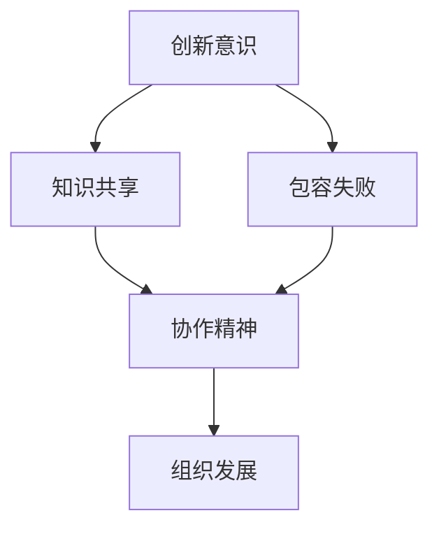

                 

# 如何构建创业公司的创新文化氛围

## 关键词：创业公司、创新文化、团队建设、组织发展、领导力

> 在创业公司的成长历程中，建立一种能够激发创新思维、促进团队协作的文化氛围至关重要。本文将深入探讨如何构建创业公司的创新文化氛围，提供具体的实践方法和建议，帮助创业团队在激烈的市场竞争中脱颖而出。

## 摘要

创业公司的成功不仅取决于技术或商业模式的创新，更在于是否能够营造一种积极、开放、包容的创新文化氛围。本文将首先介绍创新文化的核心概念及其在创业公司中的重要性，然后通过具体的案例分析，解析成功构建创新文化的关键因素。最后，我们将提出一系列实用的策略和工具，帮助创业公司打造具有持续竞争力的创新文化。

## 1. 背景介绍

创业公司通常处于快速变化的市场环境中，技术创新和商业模式创新是公司生存和发展的关键。然而，创新并非孤立的行为，它需要一种良好的文化氛围来支撑。创新文化是一种组织价值观和行为模式，它鼓励团队成员勇于尝试、不断学习和跨界合作，从而在复杂多变的市场中寻找新的机遇。

创业公司的特点包括资源有限、竞争激烈、市场变化快等，这些特点使得创新文化的构建显得尤为重要。首先，资源有限要求团队必须高效利用资源，而创新文化能够激发团队成员的创造力和合作精神，提高资源利用效率。其次，市场竞争激烈要求公司必须具备持续创新能力，创新文化能够为公司提供源源不断的新想法和新产品。最后，市场变化快要求公司具备快速响应市场变化的能力，创新文化能够促进团队的敏捷性和适应性。

## 2. 核心概念与联系

### 2.1 创新文化的定义与特征

创新文化是一种组织内部共同认同的价值观和行为模式，它鼓励团队成员勇于创新、包容失败、支持合作。创新文化具有以下特征：

- **创新意识**：团队成员普遍具备创新意识，愿意尝试新思路、新方法。
- **包容失败**：组织对失败持包容态度，将失败视为学习的机会。
- **知识共享**：团队成员乐于分享知识和经验，促进团队内部的知识流动。
- **协作精神**：鼓励团队成员之间的合作，共同解决问题。

### 2.2 创新文化与组织发展的关系

创新文化对组织发展具有深远影响。首先，创新文化能够提高组织的创新能力，使公司能够迅速应对市场变化。其次，创新文化能够增强团队的凝聚力，提高团队的协作效率。最后，创新文化能够提升员工的满意度和忠诚度，吸引和留住优秀人才。

### 2.3 Mermaid 流程图

下面是一个简单的 Mermaid 流程图，展示创新文化在组织发展中的关键节点：



## 3. 核心算法原理 & 具体操作步骤

### 3.1 创新文化的构建原则

构建创新文化需要遵循以下原则：

- **领导者的示范作用**：领导者需要以身作则，展现创新意识和包容精神。
- **明确的价值观**：组织需要明确创新文化的核心价值观，并确保全体成员认同。
- **激励机制**：建立有效的激励机制，鼓励团队成员参与创新活动。
- **跨部门合作**：鼓励不同部门之间的合作，促进知识的共享和流动。

### 3.2 创新文化的实施步骤

构建创新文化的具体步骤如下：

1. **诊断现有文化**：通过问卷调查、访谈等方式了解组织当前的文化现状。
2. **制定战略规划**：根据诊断结果，制定创新文化的战略规划，明确目标和实施步骤。
3. **领导者的示范**：领导者需要通过自身行为来示范创新文化，树立榜样。
4. **宣传和培训**：通过内部宣传和培训，提高全体成员对创新文化的认同。
5. **激励机制**：建立创新激励机制，鼓励团队成员积极参与创新活动。
6. **持续优化**：对创新文化进行持续评估和优化，确保其能够持续发展。

## 4. 数学模型和公式 & 详细讲解 & 举例说明

### 4.1 相关数学模型

构建创新文化可以使用以下数学模型：

- **影响力模型**：衡量个体在创新文化中的影响力。
- **知识传播模型**：分析知识在团队内部传播的效率。

### 4.2 公式详解

假设个体 i 在团队中的影响力为 \( I_i \)，知识传播效率为 \( E_i \)，则个体 i 对团队创新文化的贡献可以表示为：

\[ C_i = I_i \times E_i \]

### 4.3 举例说明

假设团队中有两个成员，A 和 B，他们的影响力分别为 \( I_A = 0.8 \) 和 \( I_B = 0.6 \)，知识传播效率分别为 \( E_A = 0.7 \) 和 \( E_B = 0.5 \)。则他们的贡献分别为：

\[ C_A = I_A \times E_A = 0.8 \times 0.7 = 0.56 \]
\[ C_B = I_B \times E_B = 0.6 \times 0.5 = 0.3 \]

这意味着成员 A 对团队创新文化的贡献大于成员 B。

## 5. 项目实战：代码实际案例和详细解释说明

### 5.1 开发环境搭建

为了构建创新文化，我们可以使用以下工具：

- **Git**：用于版本控制和代码共享。
- **Jenkins**：用于自动化构建和测试。
- **Trello**：用于项目管理和任务分配。

### 5.2 源代码详细实现和代码解读

以下是一个简单的 Git 仓库示例，展示如何使用 Git 进行代码共享和协作：

```git
# 初始化 Git 仓库
git init

# 添加文件到仓库
git add README.md

# 提交更改
git commit -m "初始提交"

# 克隆仓库
git clone https://github.com/username/repository.git

# 拉取最新代码
git pull
```

### 5.3 代码解读与分析

上述代码示例展示了如何使用 Git 进行版本控制和协作。Git 的核心功能包括初始化仓库、添加文件、提交更改、克隆仓库和拉取最新代码。这些功能使得团队成员可以方便地共享代码，并进行协同开发。

## 6. 实际应用场景

创新文化在创业公司中的实际应用场景包括：

- **产品开发**：鼓励团队成员提出创新的产品想法，并通过迭代开发不断优化产品。
- **市场拓展**：鼓励团队成员探索新的市场机会，尝试创新的商业模式。
- **团队协作**：通过跨部门合作，促进知识的共享和流动，提高团队的整体效率。

## 7. 工具和资源推荐

### 7.1 学习资源推荐

- **书籍**：《创新者的窘境》、《创新者的DNA》等。
- **论文**：《组织文化与创新》、《创新管理》等。
- **博客**：著名创业博客如 Medium 上的创业专栏。

### 7.2 开发工具框架推荐

- **开发工具**：Git、GitHub、Jenkins 等。
- **框架**：Django、Flask、Spring Boot 等。

### 7.3 相关论文著作推荐

- **论文**：《组织创新文化的构建与实施研究》等。
- **著作**：《创新者的思考方式》、《创新者的管理智慧》等。

## 8. 总结：未来发展趋势与挑战

创新文化的构建是一个持续的过程，未来发展趋势包括：

- **数字化**：随着数字化技术的发展，创新文化的构建将更加依赖于数字工具和平台。
- **全球化**：全球化趋势将促进创新文化的交流和融合，为创业公司提供更多机会。
- **个性化**：创新文化将更加注重个性化，满足不同团队成员的需求和兴趣。

然而，创新文化的构建也面临挑战：

- **文化冲突**：不同背景的团队成员可能存在文化差异，需要有效沟通和协调。
- **资源限制**：资源有限可能限制创新文化的实施，需要合理分配资源。

## 9. 附录：常见问题与解答

### 9.1 如何激发团队成员的创新意识？

- **领导者的示范作用**：领导者需要通过自身行为激发团队成员的创新意识。
- **激励机制**：建立有效的激励机制，鼓励团队成员提出创新想法。
- **培训与学习**：提供创新培训和学习资源，提高团队成员的创新技能。

### 9.2 如何平衡创新与风险？

- **风险评估**：在创新过程中进行风险评估，降低潜在风险。
- **试错文化**：鼓励团队成员在创新过程中试错，将失败视为学习的机会。
- **资源合理分配**：合理分配资源，确保创新项目有足够的支持。

## 10. 扩展阅读 & 参考资料

- **扩展阅读**：
  - 《创新者的窘境》：克莱顿·克里斯坦森 著
  - 《创新者的DNA》：史蒂芬·霍夫 著

- **参考资料**：
  - 《组织文化与创新》：詹姆斯·M·赫斯克特 等 著
  - 《创新管理》：艾瑞克·冯·阿姆贝格 等 著

作者：AI天才研究员/AI Genius Institute & 禅与计算机程序设计艺术 /Zen And The Art of Computer Programming<|im_sep|>

