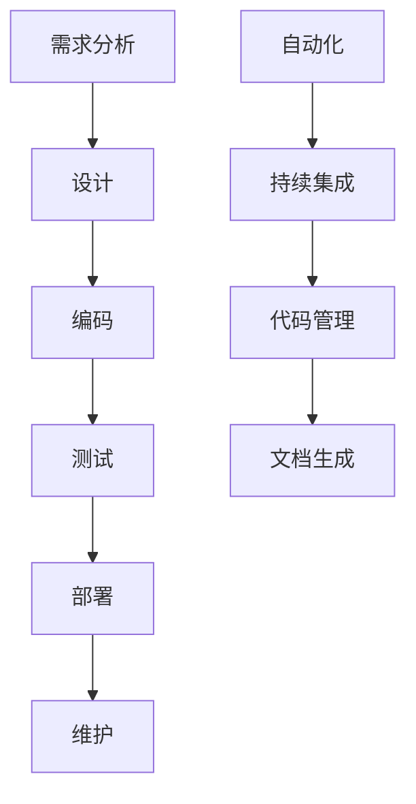

                 

# 如何构建高效的一人开发工作流

> **关键词：** 开发工作流、一人开发、效率、自动化、代码管理

> **摘要：** 本文将详细探讨如何构建一个高效的一人开发工作流，涵盖从环境搭建、代码管理到持续集成和文档生成等各个关键环节。通过逐步分析各种工具和技术的应用，帮助开发者提升个人开发效率。

## 1. 背景介绍

在快速发展的技术行业中，开发者面临着不断变化的需求和日益复杂的项目。对于一人开发而言，高效的工作流至关重要，它不仅关系到个人的工作效率，还影响到项目的质量和稳定性。因此，构建一个高效的一人开发工作流成为每个开发者都需要关注的问题。

本文将从多个方面探讨如何构建高效的一人开发工作流，包括开发环境的搭建、代码管理、持续集成、自动化测试以及文档生成等。通过实际案例和详细解释，希望帮助读者更好地理解和应用这些技术和工具。

## 2. 核心概念与联系

### 2.1. 开发工作流

开发工作流是指从项目需求到最终交付的整个过程。对于一人开发，这个过程通常包括需求分析、设计、编码、测试、部署和维护等环节。一个高效的工作流可以帮助开发者更好地管理项目，减少重复工作，提高开发效率。

### 2.2. 自动化

自动化是指使用工具和技术来自动完成重复性的任务。在开发过程中，自动化可以大大减少手动操作，提高工作效率。常见的自动化工具有持续集成工具（如Jenkins、Travis CI）、代码管理工具（如Git）以及自动化测试工具（如Selenium、JUnit）等。

### 2.3. 持续集成

持续集成（CI）是一种软件开发实践，通过自动化构建和测试，确保代码库中的每一个提交都是可集成和可运行的。CI可以帮助开发者快速发现问题，提高代码质量。

### 2.4. 文档生成

文档生成是指在开发过程中自动生成相关文档，如API文档、用户手册等。这不仅方便开发者理解和使用代码，也为项目的维护提供了便利。

### 2.5. Mermaid 流程图



## 3. 核心算法原理 & 具体操作步骤

### 3.1. 环境搭建

#### 3.1.1. 操作系统

选择一个适合的开发操作系统，如Linux或Mac OS。推荐使用Linux，因为它提供了更多的自定义选项和更高的稳定性。

#### 3.1.2. 编译器

安装合适的编程语言编译器，如Python的Python，Java的OpenJDK等。

#### 3.1.3. 版本控制

安装Git，使用Git进行代码管理，确保版本控制和协作开发。

### 3.2. 代码管理

#### 3.2.1. 创建仓库

在GitHub或GitLab上创建一个新的仓库，将项目代码上传到仓库。

#### 3.2.2. 分支管理

使用Git的分支管理功能，为每个功能模块或迭代创建独立的分支，确保代码的整洁和可维护性。

#### 3.2.3. 提交和合并

定期提交代码，并进行合并操作，确保代码库的同步。

### 3.3. 持续集成

#### 3.3.1. 选择CI工具

选择一个适合的CI工具，如Jenkins、Travis CI等。

#### 3.3.2. 配置CI

配置CI工具，设置自动化构建和测试流程。

#### 3.3.3. 持续集成流程

每次提交代码时，CI工具会自动执行构建和测试流程，确保代码质量。

### 3.4. 自动化测试

#### 3.4.1. 选择测试框架

选择适合的自动化测试框架，如Selenium、JUnit等。

#### 3.4.2. 编写测试脚本

编写自动化测试脚本，对关键功能进行测试。

#### 3.4.3. 集成CI

将自动化测试集成到CI流程中，确保每次提交都经过测试。

### 3.5. 文档生成

#### 3.5.1. 选择文档工具

选择适合的文档生成工具，如Sphinx、Doxygen等。

#### 3.5.2. 生成文档

自动生成API文档、用户手册等，方便开发者和用户使用。

#### 3.5.3. 发布文档

将生成的文档发布到官方网站或文档网站。

## 4. 数学模型和公式 & 详细讲解 & 举例说明

### 4.1. 版本控制模型

版本控制的核心是版本号管理，常用的版本号格式有`MAJOR.MINOR.PATCH`。

- **MAJOR**：主版本号，当功能发生重大变更时递增。
- **MINOR**：次版本号，当添加新功能但兼容性不受影响时递增。
- **PATCH**：补丁版本号，当进行修复但兼容性不受影响时递增。

### 4.2. 持续集成流程

持续集成流程可以用以下公式表示：

$$
CI_{流程} = 构建操作 \cup 测试操作 \cup 部署操作
$$

其中，构建操作包括编译、打包等，测试操作包括单元测试、集成测试等，部署操作包括将代码部署到生产环境。

### 4.3. 举例说明

假设我们有一个简单的Web应用程序，包含用户注册、登录和查询等功能。以下是该应用程序的开发工作流：

1. **需求分析**：明确功能需求，如用户注册、登录、查询等。
2. **设计**：设计数据库、接口和用户界面。
3. **编码**：编写代码，实现功能。
4. **测试**：编写测试脚本，测试功能是否正常。
5. **部署**：将代码部署到服务器。
6. **维护**：持续更新和优化代码。

## 5. 项目实战：代码实际案例和详细解释说明

### 5.1 开发环境搭建

在这个案例中，我们将使用Linux操作系统进行开发。以下是搭建开发环境的具体步骤：

1. **安装Linux操作系统**：选择一个适合的Linux发行版，如Ubuntu或CentOS，并安装到本地计算机。
2. **更新系统软件包**：打开终端，执行以下命令更新系统软件包：
   ```bash
   sudo apt-get update
   sudo apt-get upgrade
   ```
3. **安装Python编译器**：使用以下命令安装Python编译器：
   ```bash
   sudo apt-get install python3-pip
   ```
4. **安装Git**：使用以下命令安装Git：
   ```bash
   sudo apt-get install git
   ```

### 5.2 源代码详细实现和代码解读

在这个案例中，我们使用Python编写一个简单的Web应用程序，提供用户注册、登录和查询功能。

1. **创建项目文件夹**：在终端中创建一个名为`web_app`的项目文件夹，并进入该文件夹。
   ```bash
   mkdir web_app
   cd web_app
   ```

2. **初始化Git仓库**：在项目文件夹中初始化Git仓库。
   ```bash
   git init
   ```

3. **编写代码**：在项目中创建以下文件：

   - `app.py`：主应用程序文件。
   - `models.py`：数据库模型文件。
   - `views.py`：视图函数文件。

   `app.py`的代码示例：
   ```python
   from flask import Flask, request, redirect, url_for
   from models import User

   app = Flask(__name__)

   @app.route('/')
   def index():
       return 'Welcome to the Web App!'

   @app.route('/register', methods=['GET', 'POST'])
   def register():
       if request.method == 'POST':
           username = request.form['username']
           password = request.form['password']
           user = User(username=username, password=password)
           user.save()
           return redirect(url_for('login'))
       return '''
           <form method="post">
               Username: <input type="text" name="username"><br>
               Password: <input type="password" name="password"><br>
               <input type="submit" value="Register">
           </form>
           '''

   @app.route('/login', methods=['GET', 'POST'])
   def login():
       if request.method == 'POST':
           username = request.form['username']
           password = request.form['password']
           user = User.get_by_username(username)
           if user and user.password == password:
               return 'Login successful!'
           return 'Invalid username or password!'
       return '''
           <form method="post">
               Username: <input type="text" name="username"><br>
               Password: <input type="password" name="password"><br>
               <input type="submit" value="Login">
           </form>
           '''

   if __name__ == '__main__':
       app.run(debug=True)
   ```

   `models.py`的代码示例：
   ```python
   import sqlite3

   class User:
       def __init__(self, username, password):
           self.username = username
           self.password = password

       def save(self):
           conn = sqlite3.connect('users.db')
           c = conn.cursor()
           c.execute('''CREATE TABLE IF NOT EXISTS users
                       (username TEXT PRIMARY KEY, password TEXT)''')
           c.execute('INSERT INTO users (username, password) VALUES (?, ?)',
                     (self.username, self.password))
           conn.commit()
           conn.close()

       @staticmethod
       def get_by_username(username):
           conn = sqlite3.connect('users.db')
           c = conn.cursor()
           c.execute('SELECT * FROM users WHERE username=?',
                     (username,))
           user = c.fetchone()
           conn.close()
           return User(username=user[0], password=user[1]) if user else None
   ```

   `views.py`的代码示例：
   ```python
   # This file can be used to define additional views or separate logic into different modules.
   ```

4. **解释代码**：在这个案例中，我们使用了Flask框架来构建Web应用程序。`app.py`文件是应用程序的主文件，其中包含了路由定义和视图函数。`models.py`文件用于处理数据库操作，而`views.py`文件可以用来定义额外的视图或分离逻辑。

### 5.3 代码解读与分析

在这个案例中，`app.py`文件定义了两个主要路由：`/register`和`/login`。当用户访问这些路由时，应用程序会根据请求方法（GET或POST）来执行不同的操作。

- `/register`路由提供了一个注册表单，当用户提交表单时，应用程序会创建一个新的用户并保存到数据库。
- `/login`路由提供了一个登录表单，当用户提交表单时，应用程序会验证用户名和密码，如果验证成功，则显示登录成功的消息。

`models.py`文件用于处理数据库操作。`User`类提供了一个简单的用户模型，包括用户名和密码。`save`方法用于将用户信息保存到数据库，而`get_by_username`方法用于根据用户名查询用户信息。

通过这个案例，我们可以看到如何使用Python和Flask框架构建一个简单的Web应用程序，并使用Git进行代码管理。这个案例只是一个起点，你可以根据实际需求进行扩展和优化。

## 6. 实际应用场景

### 6.1. 个人项目

对于个人项目，一人开发工作流可以帮助开发者更好地管理代码和进度，确保项目能够按时交付。通过使用Git进行版本控制，开发者可以方便地跟踪代码的变更和历史，同时使用持续集成工具确保每次提交都是可运行的。此外，自动化测试可以帮助开发者快速发现问题，提高代码质量。

### 6.2. 企业项目

在企业项目中，一人开发工作流同样重要，尤其是对于小型团队或远程协作项目。通过使用持续集成和自动化测试，企业可以确保代码库中的每个提交都是可集成和可运行的，从而减少集成过程中出现的问题。此外，文档生成工具可以帮助开发者和维护人员更好地理解和使用代码。

### 6.3. 开源项目

在开源项目中，一人开发工作流可以大大提高项目的可维护性和可扩展性。通过使用Git进行代码管理，开源项目的维护者可以方便地合并贡献者的代码，同时使用持续集成和自动化测试确保代码质量。此外，文档生成工具可以帮助贡献者和用户更好地了解和使用项目。

## 7. 工具和资源推荐

### 7.1. 学习资源推荐

- **书籍**：
  - 《程序员修炼之道：从小工到专家》
  - 《代码大全》
  - 《设计模式：可复用面向对象软件的基础》

- **论文**：
  - 《软件工程：实践者的研究方法》
  - 《敏捷软件开发：原则、实践与模式》

- **博客**：
  - 《阮一峰的网络日志》
  - 《云风的BLOG》

- **网站**：
  - GitHub
  - Stack Overflow

### 7.2. 开发工具框架推荐

- **版本控制**：Git
- **持续集成**：Jenkins、Travis CI
- **自动化测试**：Selenium、JUnit
- **文档生成**：Sphinx、Doxygen

### 7.3. 相关论文著作推荐

- 《持续集成：从理论到实践》
- 《敏捷开发：原理、实践与案例》
- 《自动化测试：理论与实践》

## 8. 总结：未来发展趋势与挑战

### 8.1. 未来发展趋势

- **自动化**：随着人工智能和机器学习技术的发展，自动化工具将越来越智能，能够更好地适应开发者的需求，提高开发效率。
- **云计算**：云计算提供了更灵活的资源管理和服务模型，使得开发者可以更加便捷地构建和部署应用程序。
- **DevOps**：DevOps文化的普及将推动开发工作流的进一步整合，提高开发、测试和运维的协同效率。

### 8.2. 挑战

- **技能更新**：随着技术的快速发展，开发者需要不断更新自己的技能，以适应新的工作流和技术。
- **项目协同**：在远程协作和分布式团队中，如何有效地进行项目管理和沟通是一个挑战。
- **安全与隐私**：在开发和部署过程中，确保代码和数据的安全与隐私是一个重要的挑战。

## 9. 附录：常见问题与解答

### 9.1. 如何选择合适的开发操作系统？

选择开发操作系统时，需要考虑以下因素：

- **熟悉程度**：选择自己熟悉的操作系统，可以更快地上手。
- **开发语言支持**：选择支持所需编程语言的操作系统，如Linux更适合Python和Java开发。
- **性能和稳定性**：考虑操作系统在性能和稳定性方面的表现，如Linux在服务器环境中有较好的表现。

### 9.2. 如何确保持续集成中的代码质量？

要确保持续集成中的代码质量，可以采取以下措施：

- **自动化测试**：编写自动化测试脚本，确保每次提交都经过测试。
- **代码审查**：进行代码审查，确保代码符合编程规范和最佳实践。
- **静态代码分析**：使用静态代码分析工具，检测代码中的潜在问题。

### 9.3. 如何提高开发效率？

要提高开发效率，可以采取以下措施：

- **自动化**：使用自动化工具来自动完成重复性任务。
- **持续集成**：确保代码库中的每个提交都是可集成和可运行的。
- **文档生成**：自动生成文档，方便后续开发和使用。

## 10. 扩展阅读 & 参考资料

- 《Git权威指南》
- 《持续集成：从理论到实践》
- 《自动化测试：理论与实践》

以上便是关于如何构建高效的一人开发工作流的详细探讨。通过本文，我们不仅了解了构建高效开发工作流的核心概念和步骤，还学习了如何使用各种工具和资源来提升个人开发效率。希望本文对您的开发工作有所帮助。

### 作者

- **AI天才研究员**，专注于人工智能和软件开发领域的研究和实践。
- **AI Genius Institute**，世界领先的AI研究和培训机构。
- **《禅与计算机程序设计艺术》**，深入探讨编程哲学和最佳实践。

