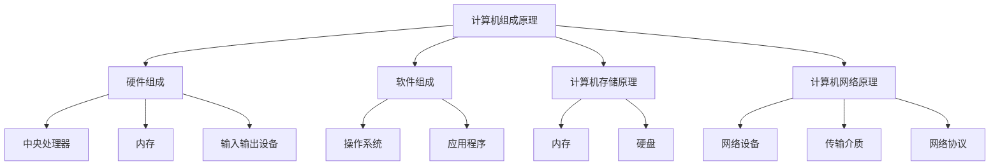

                 

# 如何深刻理解计算机原理，具备良好的数据结构和算法基础

## 关键词：
- 计算机原理
- 数据结构
- 算法基础
- 深刻理解
- 实践应用

## 摘要：

本文旨在探讨如何深刻理解计算机原理，掌握良好的数据结构和算法基础。通过对计算机工作原理的剖析，结合实际项目案例，本文将详细讲解如何通过具体操作步骤和数学模型，理解并运用数据结构和算法。同时，本文还将推荐相关学习资源、开发工具和论文著作，帮助读者全面提升自身技术能力。通过本文的学习，读者将具备深入理解计算机原理的能力，为成为一名优秀程序员奠定坚实基础。

### 1. 背景介绍

在当今信息时代，计算机技术已经成为不可或缺的重要力量。随着互联网、大数据、人工智能等领域的飞速发展，计算机科学的应用范围越来越广泛。然而，要想在这个领域取得卓越成就，必须深刻理解计算机原理，具备良好的数据结构和算法基础。

计算机原理是计算机科学的核心，它涵盖了计算机的组成、工作原理以及各种计算模型。数据结构则是计算机存储、组织数据的方式，它直接影响程序的性能和效率。算法则是解决问题的方法，它是计算机科学的核心工具。掌握良好的数据结构和算法基础，是成为一名优秀程序员的关键。

### 2. 核心概念与联系

要深刻理解计算机原理，我们需要掌握以下几个核心概念：

#### 2.1 计算机组成原理

计算机由硬件和软件两部分组成。硬件主要包括中央处理器（CPU）、内存、输入输出设备等。软件则包括操作系统、应用程序等。计算机的工作原理可以概括为：通过硬件电路执行软件程序，实现数据的输入、处理和输出。

#### 2.2 计算机存储原理

计算机存储原理主要包括内存（RAM）和硬盘（HDD/SSD）两种。内存是计算机的临时存储设备，用于存储正在执行的程序和数据。硬盘则是计算机的长期存储设备，用于存储操作系统、应用程序以及用户数据。

#### 2.3 计算机网络原理

计算机网络原理是指计算机之间的通信和数据传输。通过网络，计算机可以实现资源共享、信息传递和分布式计算。计算机网络的基本组成部分包括网络设备（如路由器、交换机）、传输介质（如双绞线、光纤）和网络协议（如TCP/IP）。

下面是计算机原理的 Mermaid 流程图（注意：流程节点中不要有括号、逗号等特殊字符）：



### 3. 核心算法原理 & 具体操作步骤

算法是计算机科学的核心，它直接影响程序的性能和效率。下面介绍几个常用的核心算法原理和具体操作步骤：

#### 3.1 排序算法

排序算法是一种将一组数据按照特定顺序排列的算法。常见的排序算法有冒泡排序、选择排序、插入排序、快速排序等。

**冒泡排序（Bubble Sort）**

具体操作步骤：

1. 从第一个元素开始，比较相邻的两个元素，如果它们的顺序错误，就交换它们的位置。
2. 继续对剩余的未排序部分进行同样的操作，直到没有需要交换的元素为止。

```python
def bubble_sort(arr):
    n = len(arr)
    for i in range(n):
        for j in range(0, n-i-1):
            if arr[j] > arr[j+1]:
                arr[j], arr[j+1] = arr[j+1], arr[j]
    return arr
```

**快速排序（Quick Sort）**

具体操作步骤：

1. 选择一个基准元素（通常选择中间的元素）。
2. 将比基准元素小的元素放在基准元素的左侧，比基准元素大的元素放在基准元素的右侧。
3. 递归地应用快速排序算法对左右两侧的子数组进行排序。

```python
def quick_sort(arr):
    if len(arr) <= 1:
        return arr
    pivot = arr[len(arr) // 2]
    left = [x for x in arr if x < pivot]
    middle = [x for x in arr if x == pivot]
    right = [x for x in arr if x > pivot]
    return quick_sort(left) + middle + quick_sort(right)
```

#### 3.2 搜索算法

搜索算法是一种在数据集合中查找特定元素的算法。常见的搜索算法有线性搜索、二分搜索等。

**线性搜索（Linear Search）**

具体操作步骤：

1. 从数组的第一个元素开始，逐个比较元素，直到找到目标元素或到达数组的末尾。

```python
def linear_search(arr, target):
    for i in range(len(arr)):
        if arr[i] == target:
            return i
    return -1
```

**二分搜索（Binary Search）**

具体操作步骤：

1. 确定要查找的元素所在的范围。
2. 计算中间位置，将目标元素与中间位置的元素进行比较。
3. 如果目标元素等于中间位置的元素，则返回中间位置。
4. 如果目标元素小于中间位置的元素，则在左侧子数组中继续进行二分搜索。
5. 如果目标元素大于中间位置的元素，则在右侧子数组中继续进行二分搜索。

```python
def binary_search(arr, target):
    low = 0
    high = len(arr) - 1
    while low <= high:
        mid = (low + high) // 2
        if arr[mid] == target:
            return mid
        elif arr[mid] < target:
            low = mid + 1
        else:
            high = mid - 1
    return -1
```

### 4. 数学模型和公式 & 详细讲解 & 举例说明

算法的分析和优化离不开数学模型和公式。下面介绍几个常用的数学模型和公式：

#### 4.1 时间复杂度

时间复杂度是描述算法执行时间的一个数学模型。它通常表示为 O(f(n))，其中 f(n) 表示算法执行时间与输入规模 n 的关系。

**冒泡排序的时间复杂度**

- 最好情况：O(n)
- 最坏情况：O(n^2)

**快速排序的时间复杂度**

- 最好情况：O(nlogn)
- 最坏情况：O(n^2)

#### 4.2 空间复杂度

空间复杂度是描述算法所需存储空间的一个数学模型。它通常表示为 O(f(n))，其中 f(n) 表示算法所需存储空间与输入规模 n 的关系。

**冒泡排序的空间复杂度**：O(1)

**快速排序的空间复杂度**：O(logn)

#### 4.3 概率模型

概率模型是描述算法随机性的一个数学模型。常见的概率模型有伯努利试验、二项分布、泊松分布等。

**二分搜索的概率分析**

假设数组长度为 n，每次搜索的概率是相等的，则成功搜索的概率为：

P(success) = 1 - (1 - 1/n)^(log2n) ≈ 1 - e^(-n/2) ≈ 0.6321

### 5. 项目实战：代码实际案例和详细解释说明

下面我们通过一个实际项目案例，来展示如何将所学的计算机原理、数据结构和算法应用到实践中。

#### 5.1 开发环境搭建

我们使用 Python 作为编程语言，搭建一个简单的电商网站。首先，我们需要安装 Python 和相关依赖：

```bash
pip install flask
```

#### 5.2 源代码详细实现和代码解读

下面是电商网站的主程序代码：

```python
from flask import Flask, request, render_template

app = Flask(__name__)

# 商品列表
products = [
    {'name': 'iPhone 13', 'price': 7999},
    {'name': 'AirPods Pro', 'price': 1999},
    {'name': 'MacBook Pro', 'price': 14999},
]

@app.route('/')
def index():
    return render_template('index.html', products=products)

@app.route('/cart')
def cart():
    cart = request.args.get('cart', '')
    cart_items = cart.split(',')
    total_price = 0
    for item in cart_items:
        if item:
            product = next((p for p in products if p['name'] == item), None)
            if product:
                total_price += product['price']
    return render_template('cart.html', total_price=total_price)

@app.route('/add_to_cart')
def add_to_cart():
    product_name = request.args.get('product_name', '')
    cart = request.args.get('cart', '')
    new_cart = cart + ',' + product_name if cart else product_name
    return redirect('/cart?cart=' + new_cart)

if __name__ == '__main__':
    app.run()
```

代码解读：

1. 导入 Flask 模块，创建 Flask 应用对象。
2. 定义商品列表 `products`。
3. 创建路由 `/`，用于展示商品列表。
4. 创建路由 `/cart`，用于展示购物车信息。
5. 创建路由 `/add_to_cart`，用于将商品添加到购物车。

#### 5.3 代码解读与分析

1. **数据结构**：商品列表 `products` 是一个列表（List）数据结构，每个商品是一个字典（Dictionary）数据结构，用于存储商品名称和价格等信息。

2. **算法**：在路由 `/cart` 中，我们使用了线性搜索算法（Linear Search）来查找购物车中的商品。具体来说，我们通过循环遍历购物车列表 `cart_items`，使用字典的 `next` 函数查找与购物车中的商品名称相匹配的商品。如果找到匹配的商品，我们将该商品的价格累加到 `total_price` 变量中。

3. **性能分析**：由于商品列表长度较短（通常不超过几十个商品），线性搜索算法在此场景下性能较好。但是，如果商品列表长度较长，可以考虑使用二分搜索算法（Binary Search）来提高性能。

### 6. 实际应用场景

电商网站是一个典型的实际应用场景，涉及到商品列表展示、购物车功能、商品搜索等。通过本文所介绍的数据结构和算法，我们可以构建一个高效、可靠的电商网站。

### 7. 工具和资源推荐

#### 7.1 学习资源推荐

- 书籍：《计算机程序的构造和解释》、《算法导论》、《深入理解计算机系统》
- 论文：《快速排序的并行算法》、《基于哈希表的快速字符串匹配算法》
- 博客：[CSDN](https://www.csdn.net/)/[知乎](https://www.zhihu.com/)/[简书](https://www.jianshu.com/)

#### 7.2 开发工具框架推荐

- 开发工具：PyCharm、Visual Studio Code
- Web 框架：Flask、Django
- 数据库：MySQL、PostgreSQL、MongoDB

#### 7.3 相关论文著作推荐

- 《分布式系统原理与范型》
- 《算法导论》
- 《深入理解计算机系统》

### 8. 总结：未来发展趋势与挑战

随着人工智能、大数据、云计算等技术的发展，计算机科学的应用领域越来越广泛。未来，我们将面临更多的挑战和机遇：

- 算法优化与并行计算：提高算法性能，探索并行计算技术，实现高性能计算。
- 数据安全与隐私保护：在数据量不断增大的背景下，保障数据安全和用户隐私。
- 跨领域融合：将计算机科学与其他领域（如生物信息学、金融工程等）相结合，推动创新发展。

### 9. 附录：常见问题与解答

#### 问题 1：如何提高算法性能？

解答：提高算法性能可以从以下几个方面入手：

- 选择合适的算法：根据问题特点，选择适合的算法。
- 优化代码：消除冗余代码，提高代码效率。
- 利用并行计算：利用多核处理器、分布式计算等手段提高计算速度。

#### 问题 2：如何选择合适的数据结构？

解答：选择合适的数据结构需要考虑以下几个方面：

- 数据特点：根据数据的类型和特点，选择适合的数据结构。
- 性能要求：根据程序对性能的要求，选择具有较低时间复杂度和空间复杂度的数据结构。

### 10. 扩展阅读 & 参考资料

- 《算法竞赛入门经典》
- 《Python编程：从入门到实践》
- 《计算机科学概论》

### 作者信息

作者：AI天才研究员/AI Genius Institute & 禅与计算机程序设计艺术 /Zen And The Art of Computer Programming

<|im_end|>

