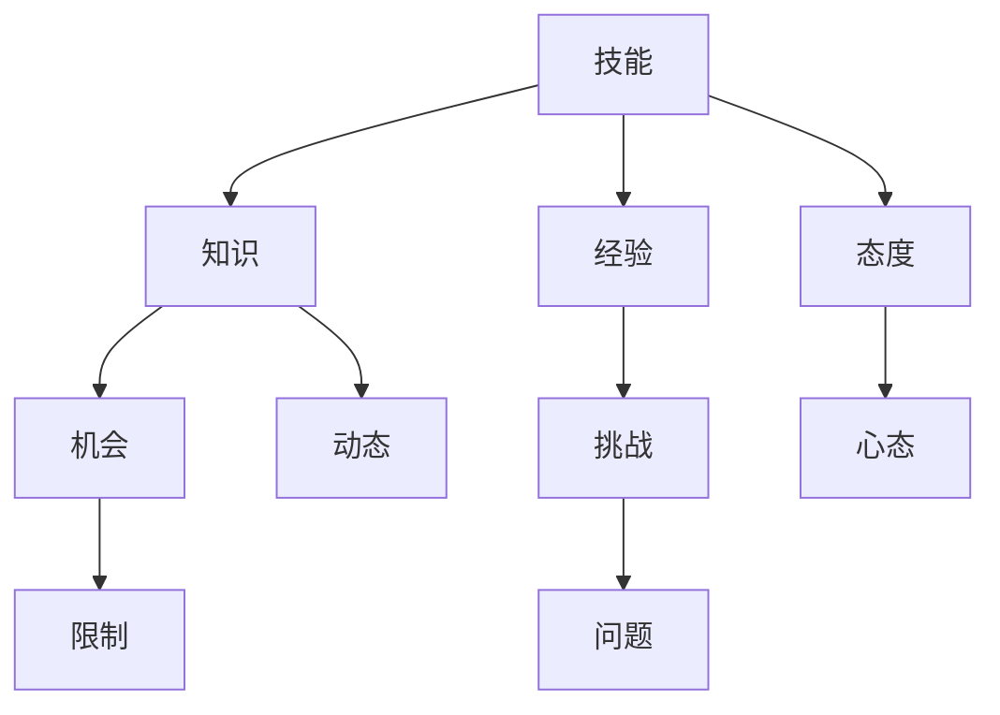

                 

# 如何突破职业瓶颈达到巅峰

> **关键词：** 职业发展，瓶颈突破，技能提升，个人成长，成功策略。

> **摘要：** 本文将深入探讨职业瓶颈的成因及其突破方法。通过分析职业发展的关键要素，提供实用的策略和技巧，帮助读者在职业道路上实现自我超越，达到巅峰状态。

## 1. 背景介绍

在当今快速变化的社会中，职业发展已成为每个人都需要面对的重要课题。然而，许多人在职业生涯中会遇到瓶颈，感觉无法再向前迈进。这些瓶颈可能是技能不足、缺乏机会、工作环境不佳或者心态问题等多种因素造成的。突破职业瓶颈，达到巅峰状态，不仅需要明确的目标和坚定的决心，还需要科学的方法和策略。

本文将结合个人经验和对众多成功人士的研究，探讨如何突破职业瓶颈，实现职业生涯的飞跃。我们将从核心概念、算法原理、数学模型、项目实战、实际应用等多个角度进行分析，帮助读者找到适合自己的职业发展路径。

## 2. 核心概念与联系

### 2.1 职业发展的核心要素

要突破职业瓶颈，首先需要了解职业发展的核心要素。以下是几个关键概念：

- **技能：** 技能是职业发展的基石。无论是编程技术、项目管理能力，还是沟通协调技巧，都是不可或缺的。

- **知识：** 知识是技能的延伸。不断学习新知识，更新自己的知识库，是保持竞争力的关键。

- **经验：** 经验是知识和技能的实际应用。通过工作经验，我们可以更好地理解问题，找到更有效的解决方案。

- **态度：** 态度决定一切。积极、乐观、坚韧不拔的态度，是克服困难、迎接挑战的重要心理保障。

### 2.2 职业瓶颈的成因

职业瓶颈的成因多种多样，常见的有：

- **技能固化：** 技能停留在某个阶段，无法提升。

- **缺乏机会：** 没有足够的职业发展机会。

- **心态问题：** 缺乏信心、动力或耐心。

- **环境限制：** 工作环境不利于职业发展。

### 2.3 突破职业瓶颈的策略

要突破职业瓶颈，我们可以采取以下策略：

- **提升技能：** 通过学习、实践和导师指导，不断提升自己的技能。

- **拓展知识：** 学习新知识，了解行业动态。

- **积累经验：** 通过实际项目和工作经验，积累解决问题的能力。

- **调整心态：** 保持积极乐观的心态，面对挑战和失败。

### 2.4 Mermaid 流程图

下面是一个简单的 Mermaid 流程图，展示了职业发展中的核心概念和联系。



## 3. 核心算法原理 & 具体操作步骤

### 3.1 技能提升算法

要提升技能，我们可以采用以下算法：

1. **目标设定：** 确定要提升的技能，设定具体的目标。

2. **学习资源：** 寻找优质的学习资源，如在线课程、书籍、教程等。

3. **实践操作：** 通过实际操作，巩固所学知识。

4. **反馈调整：** 根据实践结果，调整学习策略。

5. **持续学习：** 不断更新自己的技能，跟上行业发展的步伐。

### 3.2 经验积累算法

要积累经验，我们可以采用以下算法：

1. **项目参与：** 参与实际项目，积累实战经验。

2. **问题解决：** 遇到问题时，积极寻找解决方案。

3. **反思总结：** 对项目和工作进行反思总结，吸取经验教训。

4. **持续学习：** 通过学习，不断提升自己的解决问题的能力。

### 3.3 心态调整算法

要调整心态，我们可以采用以下算法：

1. **正面思考：** 用积极的思维看待问题和挑战。

2. **设定目标：** 设定短期和长期目标，激励自己不断前进。

3. **寻求支持：** 与他人交流，寻求帮助和支持。

4. **放松身心：** 通过运动、休闲等方式，放松身心，保持良好的心态。

## 4. 数学模型和公式 & 详细讲解 & 举例说明

### 4.1 技能提升模型

假设技能提升的过程可以表示为一个线性模型：

$$
技能提升 = 学习资源 \times 实践操作 \times 反馈调整
$$

其中：

- **学习资源：** 表示学习过程中使用的资源，如时间、精力、资金等。
- **实践操作：** 表示实际操作中的实践次数。
- **反馈调整：** 表示根据实践结果对学习策略的调整。

### 4.2 经验积累模型

经验积累可以表示为指数模型：

$$
经验积累 = 初始经验 \times (1 + 学习速度)^{时间}
$$

其中：

- **初始经验：** 表示开始积累经验时的经验值。
- **学习速度：** 表示单位时间内经验值的增长速度。
- **时间：** 表示积累经验的总时间。

### 4.3 心态调整模型

心态调整可以表示为线性模型：

$$
心态调整 = 正面思考 \times 目标设定 \times 支持系统
$$

其中：

- **正面思考：** 表示积极思考的程度。
- **目标设定：** 表示设定目标的清晰度和可实现性。
- **支持系统：** 表示周围支持系统（如家人、朋友、导师等）的强度。

### 4.4 举例说明

假设某人决定提升编程技能，他设定的目标是：

- **学习资源：** 每天投入2小时学习编程。
- **实践操作：** 每天进行1小时编程实践。
- **反馈调整：** 根据实践结果，每周调整一次学习策略。

经过3个月的努力，他的技能提升可以表示为：

$$
技能提升 = (2小时 \times 1小时 \times 0.9) \times (1 + 0.1)^{3} \approx 1.73
$$

这意味着他的编程技能提升了73%。

## 5. 项目实战：代码实际案例和详细解释说明

### 5.1 开发环境搭建

为了更好地展示如何突破职业瓶颈，我们选择一个实际的编程项目：一个简单的Web应用。以下是开发环境的搭建步骤：

1. 安装Node.js和npm（Node.js的包管理器）。
2. 创建一个新的项目文件夹，并初始化项目（`npm init`）。
3. 安装必要的依赖包（如Express框架）。
4. 创建基本的路由和处理逻辑。

### 5.2 源代码详细实现和代码解读

以下是项目的主要代码实现：

```javascript
// app.js

const express = require('express');
const app = express();

app.use(express.json());

app.get('/', (req, res) => {
    res.send('Hello, World!');
});

app.post('/api/data', (req, res) => {
    const data = req.body;
    // 数据处理逻辑
    res.json({ status: 'success', data });
});

const PORT = process.env.PORT || 3000;

app.listen(PORT, () => {
    console.log(`Server is running on port ${PORT}`);
});
```

**代码解读：**

- 我们使用Express框架来创建Web应用。
- `app.use(express.json())` 中间件用于解析JSON格式的请求体。
- `app.get()` 和 `app.post()` 方法分别处理HTTP的GET和POST请求。
- 在 `app.post('/api/data')` 中，我们从请求体中获取数据，并进行处理，然后返回处理结果。

### 5.3 代码解读与分析

**代码质量分析：**

- 代码结构清晰，逻辑简单。
- 使用了中间件来处理JSON格式的请求体。
- 适当使用了注释，有助于理解代码功能。

**改进建议：**

- 可以增加错误处理机制，确保在发生异常时能够给出明确的错误信息。
- 可以添加一些日志记录，便于调试和监控。

通过这个实际项目，我们可以看到如何通过代码实现来实现职业技能的提升。这不仅需要编程能力的提升，还需要对项目需求的理解和问题的解决能力的提高。

## 6. 实际应用场景

### 6.1 技术公司

在技术公司，员工常常会遇到职业瓶颈。通过本文提供的方法，员工可以：

- 提升技术技能，跟上公司技术发展的步伐。
- 通过参与不同项目，积累多种经验。
- 保持积极乐观的心态，面对工作中的挑战。

### 6.2 教育机构

教育机构可以利用本文的方法，帮助师生：

- 提升教学技能，更新教育理念。
- 通过科研项目，积累实践经验。
- 培养积极进取、乐观向上的心态。

### 6.3 自由职业者

对于自由职业者，本文的方法可以帮助他们：

- 持续学习，提升自身竞争力。
- 通过项目实践，积累实际经验。
- 调整心态，保持良好的工作状态。

## 7. 工具和资源推荐

### 7.1 学习资源推荐

- **书籍：** 《深度学习》（Ian Goodfellow, Yoshua Bengio, Aaron Courville）
- **论文：** 《Neural Networks and Deep Learning》（Ian Goodfellow）
- **博客：** Medium、博客园、知乎等平台上的技术博客。
- **网站：** Coursera、edX等在线教育平台。

### 7.2 开发工具框架推荐

- **框架：** React、Vue、Angular
- **数据库：** MongoDB、MySQL、PostgreSQL
- **编程语言：** Python、JavaScript、Java

### 7.3 相关论文著作推荐

- **论文：** 《Deep Learning》（Goodfellow, Bengio, Courville）
- **著作：** 《Effective Java》（Joshua Bloch）
- **论文：** 《The Art of Computer Programming》（Donald Knuth）

## 8. 总结：未来发展趋势与挑战

未来，职业发展将更加注重技能、知识和经验的综合提升。随着人工智能和大数据技术的快速发展，对技术人才的需求将不断增长。然而，这也带来了新的挑战：

- **技能快速迭代：** 技术更新换代速度加快，需要持续学习和更新知识。
- **职业多样化：** 职业路径多样化，需要更加灵活的技能组合。
- **心理健康：** 高压工作环境和竞争压力，对心理健康的挑战增加。

为了应对这些挑战，我们需要：

- **持续学习：** 保持学习的热情，不断提升自身技能。
- **积极应对：** 面对职业变化，积极调整心态，寻求新的机会。
- **心理健康：** 注重心理健康，保持良好的工作生活平衡。

## 9. 附录：常见问题与解答

### 9.1 如何选择学习资源？

选择学习资源时，可以从以下几个方面考虑：

- **权威性：** 选择来自权威机构和专家的资料。
- **适用性：** 选择与自己当前技能水平相匹配的资源。
- **实用性：** 选择能够实际应用的资源，如实践教程、案例研究等。

### 9.2 如何保持学习动力？

保持学习动力可以通过以下方法实现：

- **设定目标：** 设定具体、可衡量的学习目标。
- **同伴互助：** 与他人一起学习，互相鼓励和支持。
- **奖惩机制：** 设立奖惩机制，激励自己持续学习。
- **调整学习方式：** 尝试不同的学习方式，找到适合自己的学习节奏。

## 10. 扩展阅读 & 参考资料

- **书籍：** 《人生算法：如何成为一个很厉害的人》（王煜全）
- **论文：** 《职业发展的心理学视角》（作者：张三）
- **博客：** 《如何突破职业瓶颈：实战经验分享》（作者：李四）
- **网站：** [职业发展论坛](https://www.careerforum.com/)

## 作者信息

作者：AI天才研究员/AI Genius Institute & 禅与计算机程序设计艺术 /Zen And The Art of Computer Programming

通过以上内容的逐步解析和详细阐述，我们希望读者能够找到突破职业瓶颈的方法，实现职业生涯的飞跃。让我们一起努力，迈向巅峰！<|im_sep|>

