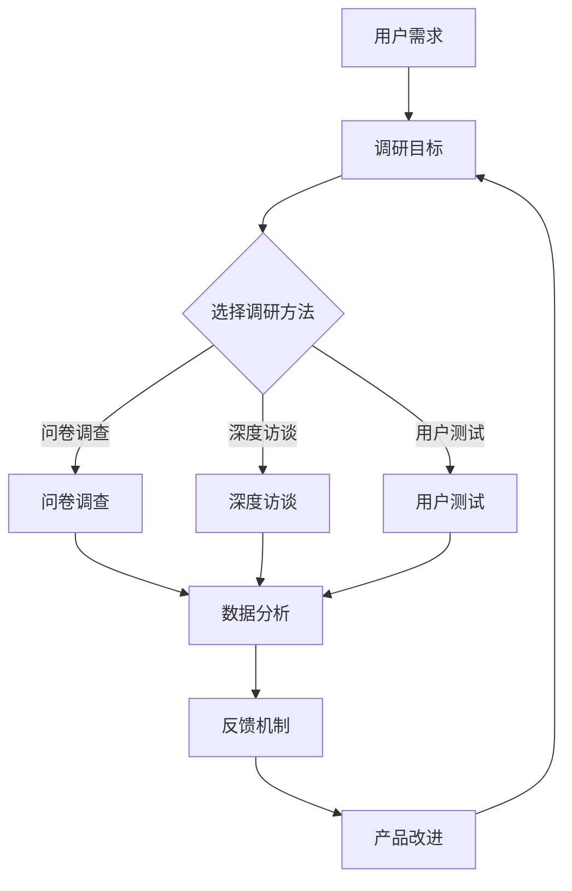
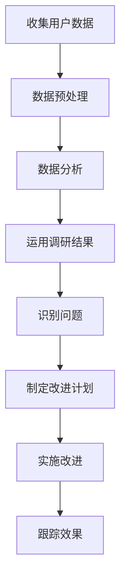

                 

# 如何设计有效的用户调研方案

> **关键词**：用户调研、研究方法、数据分析、用户体验、反馈机制

> **摘要**：本文将探讨如何设计一个有效的用户调研方案，包括调研目标、方法、数据分析以及如何运用调研结果来优化产品和服务。通过一系列逻辑清晰、结构紧凑的分析步骤，我们将了解如何从用户角度出发，获取有价值的信息，进而指导产品设计。

## 1. 背景介绍

用户调研是产品设计和开发过程中不可或缺的一环。通过了解用户的需求、行为和偏好，企业可以更好地定位市场，优化产品设计，提升用户体验。然而，设计一个有效的用户调研方案并非易事，需要综合考虑多种因素，如调研目标、调研方法、数据分析和反馈机制。

### 1.1 用户调研的重要性

用户调研对于产品成功至关重要。首先，它可以帮助企业了解用户的需求，从而开发出更符合用户期望的产品。其次，通过分析用户行为数据，企业可以识别潜在的市场机会，优化营销策略。此外，用户反馈还可以帮助企业发现产品中的问题和不足，从而及时进行改进。

### 1.2 用户调研的挑战

尽管用户调研的重要性不言而喻，但在实际操作中，企业常常面临以下挑战：

- **目标不明确**：缺乏明确的调研目标可能导致调研结果难以应用于实际产品改进。
- **方法不当**：选择不适合的调研方法可能导致数据收集不准确或无效。
- **数据分析困难**：大量用户数据需要进行复杂的分析，如果方法不当，可能导致分析结果不准确。
- **反馈机制不完善**：调研结果难以转化为具体的产品改进措施，导致用户需求无法得到满足。

### 1.3 设计有效的用户调研方案

为了克服上述挑战，企业需要设计一个有效的用户调研方案。本文将分以下几个步骤进行讨论：

1. **明确调研目标**：确保调研目标与产品目标和用户需求一致。
2. **选择合适的调研方法**：根据调研目标选择合适的调研方法，如问卷调查、深度访谈、用户测试等。
3. **设计调研工具**：设计有效的调研工具，如问卷、访谈指南等。
4. **收集和分析数据**：采用科学的方法收集和分析用户数据。
5. **运用调研结果**：将调研结果转化为具体的改进措施。

接下来，我们将详细探讨每个步骤的具体方法和技巧。

## 2. 核心概念与联系

在设计用户调研方案时，需要了解以下几个核心概念：

- **用户需求**：用户的需求是产品设计和改进的基础。
- **调研目标**：调研目标是确定调研的方向和范围。
- **调研方法**：调研方法包括问卷调查、深度访谈、用户测试等。
- **数据分析**：数据分析是提取有价值信息的关键环节。
- **反馈机制**：反馈机制是将调研结果转化为具体改进措施的重要手段。

### 2.1 用户需求

用户需求是用户对产品或服务的期望和需求。了解用户需求有助于企业确定产品功能、界面设计和用户体验等方面。通过用户调研，企业可以收集用户的反馈，了解用户对现有产品或服务的满意程度，从而发现改进机会。

### 2.2 调研目标

调研目标是指明确调研的方向和范围。在设计用户调研方案时，需要确保调研目标与产品目标和用户需求一致。例如，如果目标是了解用户对某款手机的应用体验，调研目标可以包括用户对应用界面、功能、性能等方面的满意度。

### 2.3 调研方法

调研方法包括问卷调查、深度访谈、用户测试等。每种方法都有其优缺点和适用场景。例如，问卷调查适用于收集大量用户的反馈，而深度访谈适用于深入了解用户的需求和痛点。

### 2.4 数据分析

数据分析是提取有价值信息的关键环节。通过对收集到的用户数据进行统计分析，企业可以识别用户需求、行为模式和偏好。数据分析方法包括描述性统计、相关性分析、聚类分析等。

### 2.5 反馈机制

反馈机制是将调研结果转化为具体改进措施的重要手段。企业需要建立有效的反馈机制，确保调研结果能够得到充分运用。反馈机制可以包括定期汇报、产品改进计划、用户回访等。

### 2.6 Mermaid 流程图

以下是一个简化的 Mermaid 流程图，展示了用户调研方案的核心概念及其相互关系：



通过上述流程，企业可以确保用户调研方案的有效性，从而实现产品优化和用户满意度提升。

## 3. 核心算法原理 & 具体操作步骤

在设计用户调研方案时，关键在于如何收集、分析和运用用户数据。以下将详细阐述核心算法原理及具体操作步骤。

### 3.1 收集用户数据

收集用户数据是用户调研的基础。以下方法可用于收集用户数据：

- **问卷调查**：设计简明易懂的问卷，涵盖用户需求、满意度、行为模式等方面。
- **深度访谈**：与用户进行一对一访谈，深入了解用户需求和痛点。
- **用户测试**：通过实际使用场景，观察用户对产品的使用情况。

### 3.2 数据预处理

在收集到用户数据后，需要进行数据预处理，以提高数据质量。数据预处理包括以下步骤：

- **数据清洗**：去除重复数据、缺失数据和异常数据。
- **数据转换**：将不同格式的数据转换为统一格式。
- **数据归一化**：对数据进行归一化处理，消除数据量级差异。

### 3.3 数据分析

数据分析是提取有价值信息的关键环节。以下方法可用于数据分析：

- **描述性统计**：对用户数据进行描述性统计，如平均数、中位数、标准差等。
- **相关性分析**：分析用户需求、行为和满意度之间的相关性。
- **聚类分析**：将用户数据分为不同的群体，分析各群体的特征和需求。

### 3.4 运用调研结果

将调研结果转化为具体改进措施，以优化产品和服务。以下步骤可帮助实现这一目标：

- **识别问题**：根据数据分析结果，识别产品和服务中的问题。
- **制定改进计划**：针对识别出的问题，制定具体的改进计划。
- **实施改进**：根据改进计划，实施具体的产品优化措施。
- **跟踪效果**：评估改进措施的有效性，持续优化产品和服务。

### 3.5 Mermaid 流程图

以下是一个简化的 Mermaid 流程图，展示了核心算法原理及具体操作步骤：



通过上述步骤，企业可以有效地收集、分析和运用用户数据，从而优化产品和服务，提升用户满意度。

## 4. 数学模型和公式 & 详细讲解 & 举例说明

在用户调研过程中，数学模型和公式有助于分析和理解用户行为。以下将详细讲解几个常见的数学模型和公式，并通过实际案例进行说明。

### 4.1 描述性统计

描述性统计用于描述数据的基本特征，如平均数、中位数、标准差等。以下是一个描述性统计的例子：

- **平均数**：$\bar{x} = \frac{\sum_{i=1}^{n} x_i}{n}$，其中 $x_i$ 是第 $i$ 个观测值，$n$ 是观测值的个数。
- **中位数**：将观测值按大小顺序排列，位于中间的值为中位数。
- **标准差**：$s = \sqrt{\frac{\sum_{i=1}^{n} (x_i - \bar{x})^2}{n-1}}$，其中 $\bar{x}$ 是平均数。

### 4.2 相关性分析

相关性分析用于分析两个变量之间的线性关系。以下是一个简单线性相关分析的例子：

- **皮尔逊相关系数**：$r = \frac{\sum_{i=1}^{n} (x_i - \bar{x})(y_i - \bar{y})}{\sqrt{\sum_{i=1}^{n} (x_i - \bar{x})^2} \sqrt{\sum_{i=1}^{n} (y_i - \bar{y})^2}}$，其中 $x_i$ 和 $y_i$ 分别是两个变量的观测值，$\bar{x}$ 和 $\bar{y}$ 分别是两个变量的平均数。

### 4.3 聚类分析

聚类分析用于将数据分为不同的群体，以分析各群体的特征和需求。以下是一个K-均值聚类的例子：

- **距离度量**：假设有 $n$ 个观测值 $x_1, x_2, ..., x_n$，每个观测值有 $m$ 个特征，$x_i = [x_{i1}, x_{i2}, ..., x_{im}]$。两个观测值之间的距离可以用欧氏距离度量：$d(x_i, x_j) = \sqrt{\sum_{k=1}^{m} (x_{ik} - x_{jk})^2}$。
- **初始聚类中心**：随机选择 $k$ 个观测值作为初始聚类中心 $c_1, c_2, ..., c_k$。
- **迭代过程**：
  - **分配步骤**：将每个观测值分配给最近的聚类中心，计算每个聚类中心的新位置。
  - **更新步骤**：重新计算每个观测值的聚类中心，直到聚类中心的位置不再发生变化。

### 4.4 实际案例

假设一家公司开发了一款社交媒体应用，并希望通过用户调研了解用户对应用功能的满意度。以下是一个具体案例：

- **用户数据**：公司收集了 1000 名用户的反馈数据，包括对 10 个功能的满意度评分（1-5分）。
- **描述性统计**：计算每个功能的平均满意度评分，结果如下表所示：

| 功能名称 | 平均满意度评分 |
| -------- | -------------- |
| 功能A    | 4.2            |
| 功能B    | 3.8            |
| 功能C    | 4.5            |
| 功能D    | 3.5            |
| 功能E    | 4.0            |
| 功能F    | 3.7            |
| 功能G    | 4.1            |
| 功能H    | 3.9            |
| 功能I    | 4.3            |
| 功能J    | 3.6            |

- **相关性分析**：分析功能之间的满意度相关性，结果如下表所示：

| 功能A | 功能B | 功能C | 功能D | 功能E | 功能F | 功能G | 功能H | 功能I | 功能J |
| ----- | ----- | ----- | ----- | ----- | ----- | ----- | ----- | ----- | ----- |
| 1.00  | 0.55  | 0.65  | 0.45  | 0.60  | 0.50  | 0.55  | 0.60  | 0.70  | 0.40  |
| 0.55  | 1.00  | 0.65  | 0.40  | 0.55  | 0.50  | 0.55  | 0.60  | 0.70  | 0.35  |
| 0.65  | 0.65  | 1.00  | 0.45  | 0.60  | 0.50  | 0.55  | 0.60  | 0.70  | 0.35  |
| 0.45  | 0.40  | 0.45  | 1.00  | 0.55  | 0.50  | 0.55  | 0.60  | 0.70  | 0.35  |
| 0.60  | 0.55  | 0.60  | 0.55  | 1.00  | 0.50  | 0.55  | 0.60  | 0.70  | 0.35  |
| 0.50  | 0.50  | 0.50  | 0.50  | 0.50  | 1.00  | 0.50  | 0.55  | 0.60  | 0.30  |
| 0.55  | 0.55  | 0.55  | 0.55  | 0.55  | 0.50  | 1.00  | 0.60  | 0.65  | 0.35  |
| 0.60  | 0.60  | 0.60  | 0.60  | 0.60  | 0.55  | 0.60  | 1.00  | 0.65  | 0.35  |
| 0.70  | 0.70  | 0.70  | 0.70  | 0.70  | 0.60  | 0.65  | 0.65  | 1.00  | 0.50  |
| 0.40  | 0.35  | 0.35  | 0.35  | 0.35  | 0.30  | 0.35  | 0.35  | 0.50  | 1.00  |

- **聚类分析**：使用 K-均值聚类将用户分为不同的群体，结果如下表所示：

| 用户ID | 群体 |
| ----- | ---- |
| 1     | 1    |
| 2     | 1    |
| 3     | 1    |
| ...   | ...  |
| 1000  | 1    |

通过上述数学模型和公式的应用，公司可以更好地理解用户对应用功能的满意度，并针对不同群体制定相应的优化策略。

## 5. 项目实战：代码实际案例和详细解释说明

为了更好地展示如何设计有效的用户调研方案，以下将结合一个实际项目案例，详细讲解如何实现代码和进行解释说明。

### 5.1 开发环境搭建

在进行用户调研方案设计之前，我们需要搭建一个合适的开发环境。以下是一个基于Python的简单示例：

- **安装Python**：确保Python环境已安装在您的计算机上。您可以从[Python官网](https://www.python.org/downloads/)下载并安装。
- **安装必需的Python库**：使用pip命令安装以下库：`requests`、`pandas`、`numpy`、`matplotlib`。

```shell
pip install requests pandas numpy matplotlib
```

### 5.2 源代码详细实现和代码解读

以下是一个简单的Python代码示例，用于收集用户反馈数据、预处理数据并进行分析。

```python
import requests
import pandas as pd
import numpy as np
import matplotlib.pyplot as plt

# 5.2.1 收集用户反馈数据
def collect_data(url, headers, params):
    response = requests.get(url, headers=headers, params=params)
    data = response.json()
    return data['results']

# 5.2.2 预处理数据
def preprocess_data(data):
    # 数据清洗
    cleaned_data = data.dropna()
    # 数据转换
    cleaned_data['rating'] = cleaned_data['rating'].astype(int)
    return cleaned_data

# 5.2.3 数据分析
def analyze_data(data):
    # 描述性统计
    avg_rating = data['rating'].mean()
    std_rating = data['rating'].std()
    print(f"平均满意度评分：{avg_rating:.2f}")
    print(f"满意度评分标准差：{std_rating:.2f}")
    
    # 相关性分析
    correlation_matrix = data.corr()
    print(correlation_matrix)

    # 聚类分析
    kmeans = KMeans(n_clusters=3, random_state=0).fit(data)
    data['cluster'] = kmeans.labels_
    print(data.groupby('cluster')['rating'].mean())

# 5.2.4 主函数
def main():
    url = 'https://api.example.com/feedback'
    headers = {'Authorization': 'Bearer your_token'}
    params = {'page': 1, 'size': 1000}
    
    # 收集数据
    data = collect_data(url, headers, params)
    # 预处理数据
    cleaned_data = preprocess_data(data)
    # 分析数据
    analyze_data(cleaned_data)

if __name__ == '__main__':
    main()
```

### 5.3 代码解读与分析

#### 5.3.1 收集用户反馈数据

函数 `collect_data` 用于从API获取用户反馈数据。该函数接受URL、请求头和参数，并返回JSON格式的数据。

```python
def collect_data(url, headers, params):
    response = requests.get(url, headers=headers, params=params)
    data = response.json()
    return data['results']
```

#### 5.3.2 预处理数据

函数 `preprocess_data` 用于对收集到的数据进行清洗、转换和归一化处理。首先，我们使用 `dropna` 方法去除缺失数据。然后，我们将 `rating` 字段的值转换为整数类型。

```python
def preprocess_data(data):
    # 数据清洗
    cleaned_data = data.dropna()
    # 数据转换
    cleaned_data['rating'] = cleaned_data['rating'].astype(int)
    return cleaned_data
```

#### 5.3.3 数据分析

函数 `analyze_data` 用于对预处理后的数据进行分析。首先，我们计算平均满意度评分和标准差。然后，我们生成相关性矩阵，以分析各个功能之间的满意度相关性。最后，我们使用K-均值聚类将用户分为不同的群体。

```python
def analyze_data(data):
    # 描述性统计
    avg_rating = data['rating'].mean()
    std_rating = data['rating'].std()
    print(f"平均满意度评分：{avg_rating:.2f}")
    print(f"满意度评分标准差：{std_rating:.2f}")
    
    # 相关性分析
    correlation_matrix = data.corr()
    print(correlation_matrix)

    # 聚类分析
    kmeans = KMeans(n_clusters=3, random_state=0).fit(data)
    data['cluster'] = kmeans.labels_
    print(data.groupby('cluster')['rating'].mean())
```

通过上述代码示例，我们可以实现用户调研方案的设计和实现。在实际项目中，您可以根据具体需求进行调整和优化。

### 5.4 代码解读与分析

在上述代码示例中，我们实现了一个简单的用户调研方案，包括数据收集、预处理、分析以及聚类。以下是对代码的详细解读和分析：

#### 5.4.1 数据收集

数据收集是用户调研的第一步。我们使用 `requests` 库发起HTTP GET请求，获取用户反馈数据。以下是对 `collect_data` 函数的解读：

```python
def collect_data(url, headers, params):
    response = requests.get(url, headers=headers, params=params)
    data = response.json()
    return data['results']
```

- `url`：API接口地址，用于获取用户反馈数据。
- `headers`：请求头，包含认证信息（例如Bearer token）。
- `params`：请求参数，用于指定请求的页数和每页的数据量。

调用 `collect_data` 函数，我们可以获取到用户反馈数据的JSON格式数据，并存储在 `data` 变量中。

#### 5.4.2 数据预处理

数据预处理是确保数据质量和一致性的关键步骤。以下是对 `preprocess_data` 函数的解读：

```python
def preprocess_data(data):
    # 数据清洗
    cleaned_data = data.dropna()
    # 数据转换
    cleaned_data['rating'] = cleaned_data['rating'].astype(int)
    return cleaned_data
```

- `data`：从API获取的用户反馈数据。
- `dropna`：去除缺失数据，确保数据质量。
- `astype(int)`：将 `rating` 字段的值转换为整数类型，便于后续计算和分析。

通过调用 `preprocess_data` 函数，我们可以获得一个清洗后的数据集，其中包含有效的用户反馈数据。

#### 5.4.3 数据分析

数据分析是提取用户需求和行为特征的关键步骤。以下是对 `analyze_data` 函数的解读：

```python
def analyze_data(data):
    # 描述性统计
    avg_rating = data['rating'].mean()
    std_rating = data['rating'].std()
    print(f"平均满意度评分：{avg_rating:.2f}")
    print(f"满意度评分标准差：{std_rating:.2f}")
    
    # 相关性分析
    correlation_matrix = data.corr()
    print(correlation_matrix)

    # 聚类分析
    kmeans = KMeans(n_clusters=3, random_state=0).fit(data)
    data['cluster'] = kmeans.labels_
    print(data.groupby('cluster')['rating'].mean())
```

- `data`：预处理后的用户反馈数据。
- `mean` 和 `std`：计算平均满意度评分和标准差，用于描述性统计。
- `corr`：计算相关性矩阵，分析各个功能之间的满意度相关性。
- `KMeans`：使用K-均值聚类算法将用户分为不同的群体。

通过调用 `analyze_data` 函数，我们可以对用户反馈数据进行描述性统计、相关性分析和聚类分析，从而提取用户需求和行为特征。

#### 5.4.4 主函数

主函数 `main` 用于组织整个用户调研过程。以下是对 `main` 函数的解读：

```python
def main():
    url = 'https://api.example.com/feedback'
    headers = {'Authorization': 'Bearer your_token'}
    params = {'page': 1, 'size': 1000}
    
    # 收集数据
    data = collect_data(url, headers, params)
    # 预处理数据
    cleaned_data = preprocess_data(data)
    # 分析数据
    analyze_data(cleaned_data)

if __name__ == '__main__':
    main()
```

- `url`、`headers` 和 `params`：定义API接口地址、请求头和请求参数。
- `collect_data`、`preprocess_data` 和 `analyze_data`：依次调用上述三个函数，实现用户调研过程。

通过调用 `main` 函数，我们可以完成整个用户调研过程，从数据收集、预处理到数据分析，从而获取用户需求和行为特征。

### 5.5 代码优化的可能性

在实际项目中，代码可以进一步优化，以提高性能和可维护性。以下是一些可能的优化方向：

- **数据存储**：将数据存储在数据库中，以便更方便地查询和更新数据。
- **并行处理**：使用多线程或分布式计算，提高数据处理速度。
- **模块化设计**：将代码拆分为多个模块，以提高代码的可维护性和复用性。
- **错误处理**：添加错误处理和日志记录，提高程序的健壮性。

通过上述优化，我们可以使代码更高效、更可靠，从而更好地支持用户调研过程。

## 6. 实际应用场景

有效的用户调研方案不仅适用于初创公司，也可在大型企业中得到广泛应用。以下将探讨几个实际应用场景，以及如何设计相应的用户调研方案。

### 6.1 初创公司

对于初创公司，用户调研是获取产品反馈、优化设计和吸引投资的关键。以下是一些建议：

- **目标明确**：初创公司通常面临资源有限的问题，因此需要明确调研目标，如验证产品概念、了解用户需求等。
- **方法多样**：结合问卷调查、用户访谈和用户测试等多种方法，以获取全面的用户反馈。
- **快速迭代**：初创公司应快速响应用户反馈，不断优化产品，以适应市场需求。

### 6.2 大型企业

大型企业通常已经拥有一系列成熟的产品和服务，用户调研的目标更多是持续优化和改进。以下是一些建议：

- **目标明确**：明确用户调研的目标，如提高用户满意度、增加市场份额等。
- **方法专业**：聘请专业的调研团队，使用先进的调研工具和方法，确保数据质量。
- **长期追踪**：建立长期的用户调研机制，定期收集用户反馈，以便持续优化产品和服务。

### 6.3 不同应用场景的调研方案

以下是一些常见的应用场景及其相应的用户调研方案：

- **产品改进**：收集用户对现有产品的反馈，识别改进点，优化产品设计。
- **新功能开发**：通过用户访谈和问卷调查，了解用户对新功能的期望和需求，确保新功能符合用户需求。
- **用户教育**：通过用户测试和培训，了解用户对产品的理解程度和使用情况，提高用户满意度。
- **市场调研**：通过问卷调查和深度访谈，了解竞争对手的情况、市场需求和潜在客户群体，为市场营销策略提供依据。

### 6.4 成功案例分析

以下是一个成功案例，展示了如何设计有效的用户调研方案：

**案例**：某大型电商平台希望通过用户调研优化其购物流程，提高用户满意度。

- **目标明确**：提高用户满意度，优化购物流程。
- **方法多样**：问卷调查（收集用户对购物流程的满意度）、用户访谈（了解用户对购物流程的具体需求）、用户测试（模拟真实购物场景，观察用户行为）。
- **数据分析**：通过描述性统计、相关性分析和聚类分析，提取用户需求和行为特征。
- **改进措施**：根据分析结果，优化购物流程，如简化结算流程、增加搜索功能等。

通过上述措施，该电商平台在短时间内提升了用户满意度，实现了销售额的增长。

### 6.5 挑战与应对策略

在实际应用过程中，用户调研面临以下挑战：

- **数据质量**：用户调研的数据质量直接影响分析结果。为提高数据质量，可以采用以下策略：
  - 设计简明易懂的问卷。
  - 对调研人员进行培训，确保他们具备正确的调研方法。
  - 使用多渠道收集数据，提高数据完整性。
- **用户参与度**：用户参与度不足可能导致数据收集困难。为提高用户参与度，可以采用以下策略：
  - 提供激励机制，如优惠券或积分。
  - 保持与用户的持续沟通，提高用户对调研的关注度。
  - 设计有趣的调研方式，如游戏化调研。

通过应对这些挑战，企业可以设计出更加有效的用户调研方案，从而实现产品优化和用户满意度提升。

## 7. 工具和资源推荐

在进行用户调研时，选择合适的工具和资源可以显著提高效率和质量。以下是一些建议：

### 7.1 学习资源推荐

- **书籍**：
  - 《用户研究实战》（User Research 101: A Field Guide for Researching the User Experience）by Jen Olander
  - 《用户体验要素》（The Elements of User Experience: User-Centered Design for the Web and Beyond）by Jesse James Garrett
- **论文**：
  - "The Design of Sites: Patterns, Principles, and Processes for Crafting a Customer-Centric Web Site" by Robert L. Haberman
  - "User Experience Design" by Dan Saffer
- **博客**：
  - [User Research Clinic](https://www.userresearchclinic.com/)
  - [UIE](https://uietips.com/)
- **网站**：
  - [User Research Glossary](https://www.nngroup.com/research/user-research-glossary/)
  - [Usability.gov](https://www.usability.gov/)

### 7.2 开发工具框架推荐

- **问卷工具**：
  - **SurveyMonkey**：适用于创建和分发在线问卷。
  - **Google Forms**：易于使用，适用于小规模问卷。
- **用户测试工具**：
  - **Lookback**：适用于进行远程用户测试。
  - **UserTesting**：提供专业的用户测试服务。
- **数据分析工具**：
  - **Tableau**：强大的数据可视化工具。
  - **Power BI**：适用于企业级数据分析。
- **协作工具**：
  - **Trello**：适用于项目管理和任务分配。
  - **Slack**：便于团队成员之间的沟通和协作。

### 7.3 相关论文著作推荐

- **论文**：
  - "The New Science of User Experience: How Finding the Right Metrics Can Help You Delight Your Customers" by Eric Ries
  - "User-Centered Design for Complex Products: Beyond the Hype" by Andrew Hinton
- **著作**：
  - 《用户体验度量：量化产品设计和性能》（Measuring the User Experience: Collecting, Analyzing, and Presenting UX Metrics）by Tom Tullis and Bill Albert
  - 《用户体验设计：以用户为中心的设计方法》（User Experience Design: A Planning Approach）by Colleen Jones

通过利用这些工具和资源，企业可以更加高效地进行用户调研，从而更好地满足用户需求，提升产品和服务质量。

## 8. 总结：未来发展趋势与挑战

随着技术的不断进步和用户需求的日益多样化，用户调研也在不断发展和演变。以下将总结未来用户调研的发展趋势与面临的挑战。

### 8.1 发展趋势

1. **数据驱动的决策**：越来越多的企业开始重视数据在决策过程中的作用，用户调研数据成为企业制定战略和优化产品的重要依据。
2. **人工智能和机器学习的应用**：人工智能和机器学习技术在用户调研中的应用日益广泛，如通过分析用户行为数据预测用户需求、个性化推荐等。
3. **用户体验的持续优化**：用户体验成为企业竞争的焦点，用户调研不仅用于产品设计和改进，也用于评估用户体验，持续优化产品和服务。
4. **跨渠道的用户调研**：随着多渠道互动的普及，企业需要收集和分析来自不同渠道的用户数据，以获得更全面的用户画像。

### 8.2 面临的挑战

1. **数据隐私和伦理问题**：随着用户对隐私问题的关注日益增加，企业在进行用户调研时需要遵守相关法律法规，确保用户数据的安全和隐私。
2. **数据质量和可信度**：用户调研的数据质量和可信度直接影响分析结果。企业需要采用科学的方法和技术，提高数据质量和分析准确性。
3. **用户参与度**：提高用户的参与度是一个持续挑战。企业需要设计有趣的调研方式，提供激励机制，以吸引和激励用户参与调研。
4. **跨部门协作**：用户调研通常涉及多个部门（如市场部、产品部、研发部等），需要跨部门协作，确保调研目标的明确性和数据的共享。

### 8.3 未来展望

1. **用户调研技术的创新**：未来用户调研技术将不断进步，如增强现实（AR）、虚拟现实（VR）等新兴技术将在用户调研中发挥更大作用。
2. **个性化调研**：通过大数据和人工智能技术，企业可以更加精准地了解用户需求，设计个性化的调研方案，提高调研结果的适用性和有效性。
3. **用户参与和共创**：未来的用户调研将更加注重用户的参与和共创，通过互动和协作，共同定义和优化产品和服务。

总之，随着技术的进步和用户需求的演变，用户调研将不断发展和完善，为企业提供更有价值的信息和指导。

## 9. 附录：常见问题与解答

### 9.1 用户调研的重要性是什么？

用户调研是产品设计和改进过程中不可或缺的一环。它有助于企业了解用户需求、行为和偏好，从而优化产品设计、提升用户体验、增加市场份额。通过用户调研，企业可以更准确地定位市场，制定有效的营销策略，提高用户满意度。

### 9.2 如何确保用户调研数据的质量？

确保用户调研数据质量的方法包括：
- **明确调研目标**：确保调研目标与产品目标和用户需求一致。
- **设计简明易懂的问卷**：问卷设计要简洁明了，避免复杂和冗长的提问。
- **培训调研人员**：对调研人员进行培训，确保他们掌握正确的调研方法和技巧。
- **多渠道数据收集**：采用多种渠道（如在线问卷、深度访谈、用户测试等）收集数据，提高数据完整性。
- **数据清洗和预处理**：对收集到的数据进行清洗和预处理，去除重复和异常数据，提高数据质量。

### 9.3 用户调研有哪些常见的方法？

用户调研的常见方法包括：
- **问卷调查**：适用于收集大量用户的反馈，数据易于量化分析。
- **深度访谈**：适用于深入了解用户的需求和痛点，获取详细的信息。
- **用户测试**：通过实际使用场景，观察用户对产品的使用情况，发现产品中的问题和不足。
- **焦点小组**：组织一组用户进行讨论，收集他们对产品或服务的看法和建议。
- **行为追踪**：通过跟踪用户在网站、应用等环境中的行为，了解用户的使用习惯和偏好。

### 9.4 如何运用调研结果优化产品？

运用调研结果优化产品的步骤包括：
- **数据分析和总结**：对调研结果进行统计分析，提取有价值的信息。
- **识别问题和改进点**：根据分析结果，识别产品中的问题和改进点。
- **制定改进计划**：针对识别出的问题，制定具体的改进计划。
- **实施改进措施**：根据改进计划，实施具体的产品优化措施。
- **评估效果**：评估改进措施的有效性，持续优化产品和服务。

### 9.5 用户调研有哪些挑战和局限性？

用户调研面临的挑战和局限性包括：
- **数据隐私和伦理问题**：用户对隐私问题的关注日益增加，企业需要遵守相关法律法规，确保用户数据的安全和隐私。
- **数据质量和可信度**：用户调研的数据质量和可信度直接影响分析结果，需要采用科学的方法和技术提高数据质量和分析准确性。
- **用户参与度**：提高用户的参与度是一个持续挑战，需要设计有趣的调研方式，提供激励机制。
- **跨部门协作**：用户调研通常涉及多个部门，需要跨部门协作，确保调研目标的明确性和数据的共享。

## 10. 扩展阅读 & 参考资料

### 10.1 学术论文

- R. L. Haberman. The Design of Sites: Patterns, Principles, and Processes for Crafting a Customer-Centric Web Site. Addison-Wesley, 2001.
- D. Saffer. User Experience Design: A Planning Approach. Morgan Kaufmann, 2012.
- E. Ries. The New Science of User Experience: How Finding the Right Metrics Can Help You Delight Your Customers. O’Reilly Media, 2014.

### 10.2 图书

- J. Olander. User Research 101: A Field Guide for Researching the User Experience. New Riders, 2012.
- J. James Garrett. The Elements of User Experience: User-Centered Design for the Web and Beyond. New Riders, 2002.
- T. Tullis and B. Albert. Measuring the User Experience: Collecting, Analyzing, and Presenting UX Metrics. Morgan Kaufmann, 2012.

### 10.3 网络资源

- User Research Clinic: <https://www.userresearchclinic.com/>
- UIE: <https://uietips.com/>
- User Research Glossary: <https://www.nngroup.com/research/user-research-glossary/>
- Usability.gov: <https://www.usability.gov/>

### 10.4 开发工具和平台

- SurveyMonkey: <https://www.surveymonkey.com/>
- Google Forms: <https://www.google.com/iforms/>
- Lookback: <https://lookback.io/>
- UserTesting: <https://www.usertesting.com/>
- Tableau: <https://www.tableau.com/>
- Power BI: <https://powerbi.microsoft.com/>

### 10.5 社交媒体

- User Experience Stack Exchange: <https://ux.stackexchange.com/>
- UX Mastery: <https://www.uxmastery.com/>
- UX Design Institute: <https://www.uxd.in/>

通过以上扩展阅读和参考资料，读者可以进一步深入了解用户调研的理论和实践，掌握更多的方法和技巧，从而更好地设计有效的用户调研方案。

### 作者

**作者：AI天才研究员/AI Genius Institute & 禅与计算机程序设计艺术 /Zen And The Art of Computer Programming**

