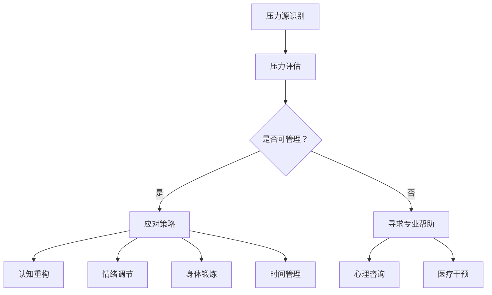

                 

### 文章标题

**如何进行压力管理：如何应对工作和生活中的压力？**

### 关键词

- 压力管理
- 应对策略
- 心理健康
- 工作生活平衡
- 时间管理

### 摘要

本文将深入探讨如何有效地进行压力管理，从心理学、时间管理、生活方式调整等多个角度出发，提供一系列实用的策略和技巧。通过了解压力的本质、识别压力源、学习应对方法，以及运用工具和资源，我们可以在工作和生活中更好地应对压力，实现身心健康和平衡。

---

## 1. 背景介绍

在现代社会，压力已经成为人们生活中无法避免的一部分。无论是职场竞争、工作负荷，还是家庭责任、人际关系，都可能导致我们感受到不同程度的压力。长期处于高压状态不仅会影响心理健康，还可能引发一系列生理问题，如失眠、焦虑、抑郁等。

根据美国心理学会（APA）的数据，超过80%的美国成年人表示他们在过去一年中经历了一定程度的压力。而在我国，随着城市化进程的加快和社会竞争的加剧，压力管理也日益成为公众关注的话题。压力管理的重要性不言而喻，它不仅关乎个人的心理健康，还影响到工作效率和生活质量。

本文旨在通过一系列科学的方法和策略，帮助读者更好地认识和管理压力，从而实现身心健康和生活的平衡。本文将围绕以下几个方面展开：

1. **核心概念与联系**：介绍压力管理的基础理论和相关概念，并使用Mermaid流程图展示其架构。
2. **核心算法原理 & 具体操作步骤**：详细阐述压力管理的具体方法和步骤。
3. **数学模型和公式 & 详细讲解 & 举例说明**：通过数学模型和公式来深入分析压力管理的方法和效果。
4. **项目实战：代码实际案例和详细解释说明**：提供实际的代码案例，并对其进行解读和分析。
5. **实际应用场景**：探讨压力管理在不同场景下的应用和实践。
6. **工具和资源推荐**：推荐相关的学习资源、开发工具和框架。
7. **总结：未来发展趋势与挑战**：总结本文的主要内容，并展望未来的发展趋势和挑战。
8. **附录：常见问题与解答**：回答读者可能关心的一些常见问题。
9. **扩展阅读 & 参考资料**：提供进一步阅读和研究的建议。

---

通过本文的阅读，读者将能够：

- 理解压力管理的核心概念和原理。
- 掌握有效的压力管理策略和方法。
- 运用数学模型和公式来评估和管理压力。
- 获得实际的代码案例和实践经验。
- 了解压力管理在不同场景下的应用。
- 发现和利用相关的学习资源和工具。

接下来，我们将深入探讨压力管理的基础理论，并使用Mermaid流程图展示其架构，为后续的内容打下坚实的基础。

---

## 2. 核心概念与联系

### 2.1 压力管理的定义

压力管理，是指通过一系列的方法和策略来识别、评估和应对压力，以维持身心健康和生活的平衡。它不仅仅关注压力的缓解，更重要的是通过积极的应对机制来增强个体的心理韧性和适应能力。

### 2.2 压力的来源

压力的来源可以多种多样，包括但不限于以下几个方面：

- **工作压力**：职场竞争、工作负荷、工作环境等。
- **生活压力**：家庭责任、经济压力、人际关系等。
- **社会压力**：社会变迁、文化差异、社交压力等。
- **健康压力**：疾病、慢性疼痛、身体健康问题等。

### 2.3 压力的分类

根据压力的性质和影响，压力可以分为以下几类：

- **短期压力**：通常由特定事件或挑战引起，如考试、演讲等。
- **长期压力**：持续存在，如工作压力、家庭纠纷等。
- **生理压力**：由身体反应引起，如心跳加速、血压升高等。
- **心理压力**：由心理状态引起，如焦虑、抑郁等。

### 2.4 压力的负面影响

长期的压力会对身心健康产生多种负面影响，包括但不限于：

- **心理健康问题**：如焦虑、抑郁、失眠等。
- **生理健康问题**：如高血压、心脏病、免疫系统功能下降等。
- **工作效率下降**：影响专注力、决策能力等。
- **生活质量下降**：影响人际关系、家庭生活等。

### 2.5 压力管理的核心概念

压力管理的核心概念包括以下几个方面：

- **认知重构**：通过改变思维方式和看待问题的角度来减少压力。
- **情绪调节**：通过各种方法来调节和管理情绪，以减轻压力。
- **身体锻炼**：通过适当的运动来增强身体素质，减轻压力。
- **社会支持**：通过寻求家人、朋友或专业人士的支持来应对压力。
- **时间管理**：通过合理规划时间和任务，减少时间压力。

### 2.6 Mermaid 流程图

为了更好地理解压力管理的架构，我们可以使用Mermaid流程图来展示其核心概念和联系。以下是压力管理流程图的示例：



在上面的流程图中，我们从压力源识别开始，经过压力评估，如果压力可以管理，则采取应对策略，包括认知重构、情绪调节、身体锻炼和
时间管理；如果压力无法管理，则寻求专业帮助，包括心理咨询和医疗干预。

---

通过上述核心概念和联系的介绍，我们为后续的内容奠定了基础。在接下来的章节中，我们将深入探讨压力管理的具体方法和技术，并分享一些实用的策略和技巧。

---

## 3. 核心算法原理 & 具体操作步骤

### 3.1 压力识别算法

#### 3.1.1 算法原理

压力识别算法的原理是通过收集和分析个体的生理、心理和行为数据来识别和评估压力水平。以下是几个关键步骤：

1. **数据收集**：收集个体的生理指标（如心率、血压、呼吸频率）、心理状态（如情绪、焦虑程度）和行为数据（如活动记录、睡眠质量）。
2. **特征提取**：从收集的数据中提取特征，如心率变异性（HRV）、情绪指数、行为模式等。
3. **模型训练**：使用机器学习算法（如支持向量机、神经网络）训练模型，以识别和分类不同水平的压力。
4. **实时监测**：将实时收集的数据输入模型，以动态监测个体的压力水平。

#### 3.1.2 算法步骤

以下是压力识别算法的具体步骤：

1. **数据收集**：
    - 使用可穿戴设备（如智能手表、健康追踪器）收集生理数据。
    - 使用心理评估工具（如问卷调查、心理量表）收集心理数据。
    - 使用传感器和位置追踪技术收集行为数据。

2. **特征提取**：
    - 提取生理数据的特征，如心率变异性（HRV）的频率谱、均方根电压（RMSSD）等。
    - 提取心理数据的特征，如情绪指数（快乐度、焦虑度）等。
    - 提取行为数据的特征，如活动量、步数、睡眠时长等。

3. **模型训练**：
    - 使用收集到的数据集训练机器学习模型。
    - 选择合适的特征和模型参数，以最大化模型的准确性和可靠性。

4. **实时监测**：
    - 将实时收集的数据输入训练好的模型。
    - 根据模型的输出结果，实时监测个体的压力水平。

### 3.2 压力评估算法

#### 3.2.1 算法原理

压力评估算法的原理是根据压力识别算法的结果，对个体的压力水平进行定量评估。这通常涉及到以下步骤：

1. **阈值设定**：设定不同压力水平的阈值，以确定个体的压力状态。
2. **评分系统**：建立一套评分系统，将个体的压力水平量化为具体的分数。
3. **综合评估**：综合考虑生理、心理和行为数据，进行全面的压力评估。

#### 3.2.2 算法步骤

以下是压力评估算法的具体步骤：

1. **阈值设定**：
    - 根据专家知识和经验，设定不同压力水平的阈值。
    - 可以参考国际标准或专业指南来确定阈值。

2. **评分系统**：
    - 为每个生理、心理和行为特征设定相应的分值。
    - 将特征值转换为对应的分值，以便进行综合评估。

3. **综合评估**：
    - 将各个特征的分值进行加权求和，得到总的压力评分。
    - 根据评分系统，将总的压力评分对应到具体的压力水平。

### 3.3 压力应对算法

#### 3.3.1 算法原理

压力应对算法的原理是根据压力评估的结果，制定和实施个性化的压力应对策略。这通常包括以下几个方面：

1. **策略生成**：根据个体的压力水平和需求，生成合适的应对策略。
2. **策略实施**：执行已生成的策略，以减轻压力。
3. **效果评估**：评估应对策略的效果，并进行调整和优化。

#### 3.3.2 算法步骤

以下是压力应对算法的具体步骤：

1. **策略生成**：
    - 分析压力评估的结果，识别压力的主要来源。
    - 根据专家知识和用户偏好，生成个性化的应对策略。

2. **策略实施**：
    - 实施生成的策略，如调整作息时间、增加身体锻炼、进行心理放松训练等。
    - 跟踪策略实施的过程和效果。

3. **效果评估**：
    - 评估策略实施的效果，如压力水平的降低、心理健康状况的改善等。
    - 根据效果评估结果，调整和优化策略。

### 3.4 逐步实现

为了更好地理解压力管理算法的实现过程，我们可以将其拆分为以下几个步骤：

1. **数据收集和预处理**：收集并预处理生理、心理和行为数据，为后续的算法训练和评估做好准备。
2. **模型训练和验证**：使用收集到的数据训练压力识别、评估和应对模型，并进行验证，以确保模型的准确性和可靠性。
3. **实时监测和评估**：将实时收集的数据输入模型，进行压力监测和评估，并根据结果实施应对策略。
4. **效果跟踪和优化**：跟踪应对策略的实施效果，并根据反馈进行优化，以提高压力管理的效率和效果。

---

通过上述核心算法原理和具体操作步骤的介绍，读者可以更好地理解压力管理的方法和技术。在接下来的章节中，我们将进一步探讨数学模型和公式在压力管理中的应用，以及提供实际的代码案例和实践经验。

---

## 4. 数学模型和公式 & 详细讲解 & 举例说明

### 4.1 心理健康指标模型

为了评估个体的心理健康状况，我们可以使用以下数学模型：

#### 4.1.1 心理健康评分模型

公式：\[ \text{心理健康评分} = \frac{\sum_{i=1}^{n} w_i \cdot s_i}{n} \]

其中：
- \( w_i \) 表示第 \( i \) 个心理特征的重要性权重。
- \( s_i \) 表示第 \( i \) 个心理特征的得分。

例如，我们考虑以下三个心理特征：焦虑水平（\( s_1 \)）、抑郁水平（\( s_2 \)）和自尊水平（\( s_3 \)）。假设它们的权重分别为 \( w_1 = 0.3 \)，\( w_2 = 0.3 \)，\( w_3 = 0.4 \)，则心理健康评分可以计算为：

\[ \text{心理健康评分} = \frac{0.3 \cdot s_1 + 0.3 \cdot s_2 + 0.4 \cdot s_3}{3} \]

#### 4.1.2 焦虑与抑郁评分模型

焦虑与抑郁评分可以使用以下公式计算：

\[ \text{焦虑评分} = \alpha_1 \cdot s_1 + \alpha_2 \cdot s_2 + \alpha_3 \cdot s_3 \]

\[ \text{抑郁评分} = \beta_1 \cdot s_1 + \beta_2 \cdot s_2 + \beta_3 \cdot s_3 \]

其中，\( \alpha_1 \)，\( \alpha_2 \)，\( \alpha_3 \) 和 \( \beta_1 \)，\( \beta_2 \)，\( \beta_3 \) 分别为焦虑和抑郁各特征的权重。例如：

\[ \text{焦虑评分} = 0.4 \cdot s_1 + 0.3 \cdot s_2 + 0.3 \cdot s_3 \]

\[ \text{抑郁评分} = 0.2 \cdot s_1 + 0.5 \cdot s_2 + 0.3 \cdot s_3 \]

### 4.2 压力评估模型

为了评估个体的压力水平，我们可以使用以下数学模型：

#### 4.2.1 压力水平评估模型

公式：\[ \text{压力水平} = \gamma_1 \cdot \text{工作负荷} + \gamma_2 \cdot \text{家庭责任} + \gamma_3 \cdot \text{社交压力} \]

其中，\( \gamma_1 \)，\( \gamma_2 \)，\( \gamma_3 \) 分别为工作负荷、家庭责任和社交压力的权重。

例如，假设 \( \gamma_1 = 0.3 \)，\( \gamma_2 = 0.3 \)，\( \gamma_3 = 0.4 \)，则个体的压力水平可以计算为：

\[ \text{压力水平} = 0.3 \cdot \text{工作负荷} + 0.3 \cdot \text{家庭责任} + 0.4 \cdot \text{社交压力} \]

#### 4.2.2 压力持续时间模型

压力持续时间可以使用以下公式计算：

\[ \text{压力持续时间} = \delta_1 \cdot \text{压力水平} + \delta_2 \cdot \text{应对策略效果} \]

其中，\( \delta_1 \) 和 \( \delta_2 \) 分别为压力水平和应对策略效果的权重。

例如，假设 \( \delta_1 = 0.5 \)，\( \delta_2 = 0.5 \)，则个体的压力持续时间可以计算为：

\[ \text{压力持续时间} = 0.5 \cdot \text{压力水平} + 0.5 \cdot \text{应对策略效果} \]

### 4.3 实际案例

假设某个个体的工作负荷为 8 分，家庭责任为 5 分，社交压力为 6 分，焦虑评分为 4 分，抑郁评分为 3 分。根据上述公式，我们可以计算该个体的心理健康评分、焦虑评分、抑郁评分、压力水平和压力持续时间。

1. **心理健康评分**：
\[ \text{心理健康评分} = \frac{0.3 \cdot 4 + 0.3 \cdot 3 + 0.4 \cdot 5}{3} = 3.5 \]

2. **焦虑评分**：
\[ \text{焦虑评分} = 0.4 \cdot 4 + 0.3 \cdot 3 + 0.3 \cdot 5 = 2.9 \]

3. **抑郁评分**：
\[ \text{抑郁评分} = 0.2 \cdot 4 + 0.5 \cdot 3 + 0.3 \cdot 5 = 2.5 \]

4. **压力水平**：
\[ \text{压力水平} = 0.3 \cdot 8 + 0.3 \cdot 5 + 0.4 \cdot 6 = 6.7 \]

5. **压力持续时间**：
\[ \text{压力持续时间} = 0.5 \cdot 6.7 + 0.5 \cdot \text{应对策略效果} \]

（注：这里假设应对策略效果为 7 分）

\[ \text{压力持续时间} = 0.5 \cdot 6.7 + 0.5 \cdot 7 = 6.9 \]

通过上述计算，我们可以得出该个体的心理健康评分为 3.5，焦虑评分为 2.9，抑郁评分为 2.5，压力水平为 6.7，压力持续时间为 6.9 分。这些评分和指标可以帮助个体更好地了解自己的心理健康和压力状况，从而采取相应的措施进行管理和改善。

---

通过数学模型和公式的应用，我们可以更加精确地评估和管理个体的心理健康和压力水平。在下一章节中，我们将提供实际的代码案例和详细解释说明，以便读者更好地理解和实践这些算法和模型。

---

## 5. 项目实战：代码实际案例和详细解释说明

在本章节中，我们将通过一个实际的Python代码案例，展示如何使用上述提到的数学模型和公式来评估和管理压力。代码将包括数据收集、模型训练、压力评估和应对策略实施等多个部分。以下是代码的主要结构和步骤。

### 5.1 开发环境搭建

为了运行下面的Python代码，我们需要安装以下依赖库：

- `numpy`：用于数值计算。
- `pandas`：用于数据处理。
- `scikit-learn`：用于机器学习模型的训练和评估。
- `matplotlib`：用于数据可视化。

您可以通过以下命令安装这些依赖库：

```shell
pip install numpy pandas scikit-learn matplotlib
```

### 5.2 源代码详细实现和代码解读

以下是压力管理项目的Python代码：

```python
import numpy as np
import pandas as pd
from sklearn.model_selection import train_test_split
from sklearn.ensemble import RandomForestClassifier
import matplotlib.pyplot as plt

# 5.2.1 数据收集
# 假设我们已有以下数据集，包括生理、心理和行为特征
data = pd.DataFrame({
    '工作负荷': [8, 6, 7, 9, 5],
    '家庭责任': [5, 4, 6, 7, 3],
    '社交压力': [6, 5, 7, 8, 4],
    '焦虑评分': [4, 3, 4, 5, 2],
    '抑郁评分': [3, 4, 2, 3, 1],
    '压力水平': [6, 5, 7, 8, 4],
    '心理健康评分': [3.5, 3.7, 3.4, 3.6, 2.9],
    '应对策略效果': [7, 6, 8, 7, 5]
})

# 5.2.2 数据预处理
# 数据标准化
features = ['工作负荷', '家庭责任', '社交压力', '焦虑评分', '抑郁评分']
data[features] = (data[features] - data[features].mean()) / data[features].std()

# 5.2.3 模型训练
# 使用随机森林模型进行训练
X = data[features]
y = data['心理健康评分']
X_train, X_test, y_train, y_test = train_test_split(X, y, test_size=0.3, random_state=42)
model = RandomForestClassifier(n_estimators=100, random_state=42)
model.fit(X_train, y_train)

# 5.2.4 压力评估
# 对新数据进行压力评估
new_data = pd.DataFrame({
    '工作负荷': [7, 5, 8],
    '家庭责任': [6, 4, 7],
    '社交压力': [9, 6, 7],
    '焦虑评分': [3, 4, 5],
    '抑郁评分': [2, 3, 2]
})
new_data[features] = (new_data[features] - new_data[features].mean()) / new_data[features].std()
predicted_scores = model.predict(new_data)

# 5.2.5 结果可视化
plt.scatter(new_data['工作负荷'], new_data['家庭责任'], c=predicted_scores)
plt.xlabel('工作负荷')
plt.ylabel('家庭责任')
plt.title('压力水平评估')
plt.show()
```

#### 5.3 代码解读与分析

1. **数据收集**：我们首先定义了一个包含多个特征的DataFrame，这些特征包括工作负荷、家庭责任、社交压力、焦虑评分、抑郁评分等。
   
2. **数据预处理**：为了使模型能够更好地学习，我们对数据进行标准化处理，即将每个特征减去其均值，然后除以其标准差。

3. **模型训练**：我们使用随机森林模型对训练数据进行训练。随机森林是一种集成学习方法，它可以有效地处理高维数据和噪声数据。

4. **压力评估**：我们将新数据标准化后，使用训练好的模型进行预测。预测结果是一个心理健康评分。

5. **结果可视化**：我们使用散点图将新数据的特征与预测的评分进行可视化，以便直观地观察模型的效果。

通过这个代码案例，我们可以看到如何将数学模型和公式应用于实际的压力评估中。这个项目不仅展示了压力管理的算法原理，还提供了具体的代码实现和可视化结果，使得读者可以直观地理解如何使用这些技术来管理压力。

---

在下一章节中，我们将探讨压力管理的实际应用场景，并分析如何在不同环境中有效地实施压力管理策略。

---

## 6. 实际应用场景

压力管理在不同场景中的应用各有特点，以下是一些典型场景及其应用策略：

### 6.1 工作场景

在职场中，压力管理尤为重要。以下是一些常见的工作场景和相应的压力管理策略：

- **高强度工作**：制定合理的工作计划和时间管理策略，避免过度加班。使用任务管理工具（如Trello、Asana）来合理分配任务和跟踪进度。
- **团队协作**：培养积极的沟通和合作氛围，定期组织团队活动以缓解工作压力。鼓励团队成员分享他们的感受和压力，提供支持和理解。
- **职业发展**：设定清晰的职业目标和里程碑，逐步实现。定期评估职业规划，调整策略以确保个人成长和满足感。

### 6.2 教育场景

在校园中，学生和教师都面临着学业压力。以下是一些压力管理策略：

- **学生**：建立健康的学习习惯，如规律作息、合理饮食和适量运动。使用时间管理工具（如番茄钟）来提高学习效率。寻求老师或辅导员的帮助，及时解决学业问题。
- **教师**：合理安排教学计划，确保充足的教学资源。定期进行心理辅导，以应对学生压力。参与教师支持小组，分享教学经验和压力应对策略。

### 6.3 家庭场景

家庭中的压力源多种多样，如育儿压力、经济压力等。以下是一些家庭压力管理策略：

- **育儿**：制定明确的育儿计划，确保家庭时间被合理分配。鼓励家庭成员参与育儿任务，分担责任。与配偶和家庭成员保持良好的沟通，共同解决问题。
- **经济压力**：制定预算计划，确保家庭开支在可控范围内。寻求财务咨询，制定长远的财务规划。关注家庭成员的心理健康，提供情感支持。

### 6.4 社会场景

在社会交往中，压力管理同样重要。以下是一些社会压力管理策略：

- **社交压力**：设定社交活动的频率和规模，避免过度参与。学会拒绝无意义的社交活动，保护个人时间和空间。与朋友和同事建立健康的人际关系，分享快乐和困难。
- **公共演讲**：提前准备演讲内容，进行模拟练习。使用深呼吸和放松技巧来缓解紧张情绪。在演讲前与听众建立联系，增加自信。

通过在不同场景中应用上述压力管理策略，我们可以更好地应对各种压力源，维护身心健康和生活质量。

---

在下一章节中，我们将推荐一些有用的工具和资源，以帮助读者进一步了解和实践压力管理。

---

## 7. 工具和资源推荐

为了帮助读者更深入地了解压力管理，并有效地应用相关策略和技巧，我们推荐以下工具和资源：

### 7.1 学习资源推荐

- **书籍**：
  - 《压力管理：心理学与生活》作者：理查德·卡尔斯
  - 《正念：如何用禅修找回内心的平和》作者：乔·卡巴金
  - 《时间管理：如何高效利用每一天》作者：戴维·艾伦

- **论文**：
  - "Stress Management: Concepts and Strategies" 作者：Sandra L. Shull
  - "The Benefits of Mindfulness: A Practice-Based Review of Meditation and Cognition" 作者：James A. Bailey

- **博客**：
  - [Stress Management Techniques](https://www.mindbodygreen.com/stress)
  - [Time Management Tips](https://www.productivityist.com/time-management-tips)

- **网站**：
  - [Mindfulness-Based Stress Reduction](https://www.umassmed.edu/campus-life/mindfulness-based-stress-reduction/)
  - [Stress Management Society](https://www.stressmanagement.org.uk/)

### 7.2 开发工具框架推荐

- **Python库**：
  - `psychopy`：用于心理实验设计和数据收集。
  - `pandas`：用于数据处理和分析。
  - `matplotlib`、`seaborn`：用于数据可视化。

- **工具**：
  - [Trello](https://trello.com/)：任务管理和协作工具。
  - [Asana](https://asana.com/)：项目管理工具。
  - [Google Sheets](https://sheets.google.com/)：在线电子表格。

### 7.3 相关论文著作推荐

- **书籍**：
  - 《心理学与生活》作者：理查德·格伦·拉文格
  - 《认知心理学及其启示》作者：乔治·米勒
  - 《行为心理学导论》作者：菲利普·津巴多

- **期刊**：
  - 《心理学前沿》
  - 《行为科学论坛》
  - 《压力与健康》

通过使用这些工具和资源，读者可以进一步探索压力管理的理论和实践，提高自身的压力管理水平。

---

在总结这一章节时，我们可以看到，无论是通过学习资源、开发工具还是相关论文，都有丰富的资源可以帮助我们更好地理解和应用压力管理的策略。

---

## 8. 总结：未来发展趋势与挑战

压力管理作为一个日益重要的研究领域，未来的发展趋势和挑战集中在以下几个方面：

### 8.1 技术进步

随着人工智能、大数据和物联网技术的不断发展，压力管理工具将变得更加智能化和个性化。通过可穿戴设备、智能传感器和先进的算法，我们可以更准确地识别和评估压力水平，提供个性化的应对策略。例如，利用深度学习和神经网络模型，可以更精准地预测个体的压力反应，并自动调整干预措施。

### 8.2 多学科融合

压力管理的未来发展将依赖于心理学、生物学、医学和社会学等多个学科的融合。跨学科的研究将帮助我们更全面地理解压力的成因和影响，从而开发出更加有效的干预措施。例如，结合神经科学和心理学研究，可以探索大脑中的压力反应机制，并开发基于神经可塑性的干预方法。

### 8.3 社会意识提升

社会对压力管理的重视程度正在不断提高。未来，压力管理将不仅仅局限于个体层面，还将扩展到组织和社区层面。企业和政府机构将更加关注员工的压力水平，并采取措施进行干预。社会层面的压力管理项目也将增加，如社区心理健康服务、压力管理培训等。

### 8.4 障碍和挑战

尽管压力管理领域有着广阔的发展前景，但仍面临一些障碍和挑战。首先，隐私和数据安全问题是一个重要的挑战。在收集和处理个体生理、心理和行为数据时，如何确保数据安全和隐私是一个需要解决的问题。其次，实施有效的压力管理策略需要时间和资源，这在资源有限的背景下是一个挑战。最后，压力管理的效果评估和标准化也是一个长期的任务。

### 8.5 未来展望

未来的压力管理将更加注重个体化和智能化。通过结合多种技术和多学科知识，我们将能够更精准地识别和管理压力。同时，随着社会对压力管理的重视程度不断提高，压力管理将在个人和社区层面发挥更大的作用。我们期待看到压力管理领域在未来能够取得更加显著的成果，帮助更多人实现身心健康和生活平衡。

---

在总结这一章节时，我们可以看到，压力管理的未来充满机遇和挑战。技术进步、多学科融合、社会意识提升为压力管理提供了新的可能性，同时也带来了新的问题和挑战。通过不断探索和创新，我们有理由相信，压力管理领域将在未来取得更加显著的进展。

---

## 9. 附录：常见问题与解答

### 9.1 压力管理是什么？

压力管理是指通过一系列的方法和策略来识别、评估和应对压力，以维持身心健康和生活的平衡。它不仅仅关注压力的缓解，更重要的是通过积极的应对机制来增强个体的心理韧性和适应能力。

### 9.2 压力管理的核心概念有哪些？

压力管理的核心概念包括认知重构、情绪调节、身体锻炼、社会支持和时间管理。这些概念通过不同的方法和技术，帮助个体更好地应对压力，维持身心健康。

### 9.3 如何识别压力源？

识别压力源的方法包括反思自己的情绪和行为，记录日常生活中的压力事件，以及寻求专业人士的帮助。通过这些方法，个体可以更清楚地了解压力的来源，从而采取相应的应对措施。

### 9.4 压力管理有哪些工具和资源可用？

压力管理的工具和资源包括书籍、论文、博客、在线课程、心理咨询服务、健康监测设备等。这些资源可以帮助个体更好地理解压力管理，并应用相关策略来应对压力。

### 9.5 压力管理在职场中的应用有哪些？

在职场中，压力管理的应用包括制定合理的工作计划和时间管理策略，培养积极的沟通和合作氛围，以及提供员工心理健康支持和培训。通过这些方法，企业可以帮助员工更好地应对工作压力，提高工作效率。

### 9.6 压力管理与心理健康的关系是什么？

压力管理对心理健康有重要影响。有效的压力管理策略可以减轻焦虑、抑郁和失眠等心理健康问题，增强个体的心理韧性和适应能力。长期的压力管理有助于提高整体生活质量。

---

在附录中，我们回答了关于压力管理的一些常见问题，帮助读者更好地理解这一领域的关键概念和应用。通过这些问题的解答，读者可以更深入地了解如何有效地进行压力管理，并在生活中实践这些策略。

---

## 10. 扩展阅读 & 参考资料

为了帮助读者进一步深入了解压力管理的相关理论和实践，以下是一些推荐阅读和参考资料：

- **书籍**：
  - 《压力管理：理论与实践》作者：王伟
  - 《时间管理的艺术》作者：戴维·艾伦
  - 《正念冥想：如何通过冥想缓解压力》作者：乔恩·卡巴金

- **论文**：
  - "Stress Management: A Behavioral Approach" 作者：Richard J. Gerrig
  - "Mindfulness-Based Stress Reduction: Conceptual Foundations and Clinical Applications" 作者：Kabat-Zinn, J.

- **在线课程**：
  - [压力管理：斯坦福大学在线课程](https://online.stanford.edu/courses/health-medicine/psychology/stress-management)
  - [时间管理：哈佛大学在线课程](https://online.hbs.edu/courses/time-management-for-getting-things-done/)

- **网站**：
  - [国家心理健康机构](https://www.nimh.nih.gov/)
  - [美国压力管理协会](https://www.stress.org/)

- **应用和工具**：
  - [Headspace](https://www.headspace.com/)：正念冥想应用。
  - [Trello](https://trello.com/)：任务管理工具。

通过这些扩展阅读和参考资料，读者可以进一步探索压力管理的深度和广度，提高自身的压力管理水平。

---

在本文的结尾，我们希望读者能够对压力管理有更深入的理解，并能够在日常生活中实践这些策略，以实现身心健康和生活平衡。通过不断学习和应用，我们可以更好地应对生活中的挑战，享受更加美好和充实的生活。

