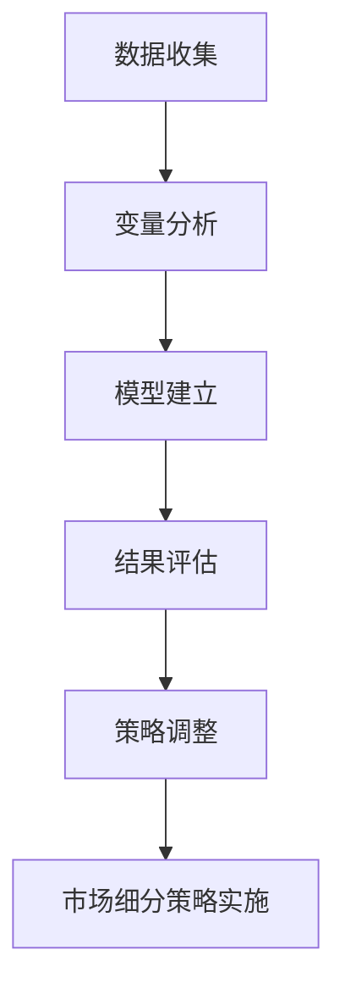
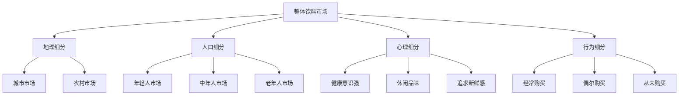

                 

# 如何进行有效的创业市场细分

## 摘要

在竞争激烈的市场环境中，成功的创业企业往往能够通过有效的市场细分策略，精准定位目标客户群体，从而在激烈的市场竞争中脱颖而出。本文将深入探讨创业市场细分的方法和策略，通过逻辑清晰、结构紧凑的分析，帮助创业者更好地理解市场细分的重要性，掌握有效的市场细分方法，实现创业企业的快速发展。

本文将从以下几个方面展开：

1. **背景介绍**：简要介绍市场细分的重要性及其在创业中的应用。
2. **核心概念与联系**：阐述市场细分的核心概念，并利用 Mermaid 流程图展示市场细分的原理和架构。
3. **核心算法原理 & 具体操作步骤**：介绍市场细分的关键算法原理，并提供具体的操作步骤。
4. **数学模型和公式 & 详细讲解 & 举例说明**：运用数学模型和公式，详细讲解市场细分的方法，并通过实例进行说明。
5. **项目实战：代码实际案例和详细解释说明**：提供市场细分在实际项目中的应用案例，并详细解释代码实现。
6. **实际应用场景**：分析市场细分在不同行业和场景中的应用。
7. **工具和资源推荐**：推荐学习资源、开发工具和框架。
8. **总结：未来发展趋势与挑战**：总结市场细分的发展趋势和面临的挑战。
9. **附录：常见问题与解答**：解答市场细分过程中常见的问题。
10. **扩展阅读 & 参考资料**：提供相关扩展阅读和参考资料。

通过本文的深入分析，希望读者能够掌握市场细分的方法，为创业企业的成功奠定坚实的基础。

## 1. 背景介绍

市场细分是市场营销学中的一个核心概念，其重要性在商业世界中不言而喻。市场细分是指将一个广泛的市场划分为若干个具有相似需求和特征的子市场，以便企业能够更精准地定位目标客户，制定更加有效的营销策略。在创业领域，市场细分具有以下几个重要意义：

### 1.1 提高市场竞争力

通过市场细分，企业可以更好地了解目标客户的需求，提供更加个性化和差异化的产品或服务，从而在竞争激烈的市场中脱颖而出。市场细分使企业能够集中资源，专注于最有潜力的客户群体，提高市场竞争力。

### 1.2 降低营销成本

市场细分有助于企业针对不同的子市场制定不同的营销策略，减少不必要的广告和促销费用，降低营销成本。同时，精准定位的目标客户更容易对营销信息产生共鸣，提高营销效果。

### 1.3 提高客户满意度

市场细分使企业能够更深入地了解不同客户群体的需求和偏好，提供更符合他们期望的产品和服务，从而提高客户满意度和忠诚度。

### 1.4 拓展市场机会

通过市场细分，企业可以发现新的市场机会，开发新的产品线或服务，从而实现业务的持续增长。

在创业过程中，市场细分策略的正确应用可以帮助企业：

- **识别目标客户**：明确目标客户群体，避免资源浪费。
- **制定营销策略**：根据不同客户群体的特性，制定有针对性的营销策略。
- **优化产品和服务**：根据客户需求进行产品或服务的调整和优化。
- **提高市场占有率**：通过精准的市场细分，提高企业的市场占有率。

总之，市场细分是创业成功的关键之一，它能够为企业提供明确的客户画像，帮助企业在竞争激烈的市场中找到定位，从而实现快速发展。

## 2. 核心概念与联系

市场细分不仅仅是将市场划分成几个部分，它涉及到一系列的核心概念和原理，这些概念和原理构成了市场细分的基础框架。在本节中，我们将详细阐述市场细分的关键概念，并利用 Mermaid 流程图展示市场细分的过程和架构。

### 2.1 市场细分的关键概念

**1. 市场细分变量（Segmentation Variables）**

市场细分变量是进行市场细分的基础，通常包括地理变量、人口变量、心理变量和行为变量。

- **地理变量**：包括地理位置、气候、城市规模等。
- **人口变量**：包括年龄、性别、收入、职业、教育水平等。
- **心理变量**：包括生活方式、个性、价值观、兴趣爱好等。
- **行为变量**：包括购买频率、购买渠道、忠诚度等。

**2. 目标市场（Target Market）**

目标市场是指企业选择进行营销活动的特定市场部分，通常是市场细分后的子市场。

**3. 营销组合（Marketing Mix）**

营销组合是指企业在市场细分后的子市场中，为实现目标市场所采取的营销策略，包括产品、价格、促销和渠道等四个方面。

**4. 市场定位（Market Positioning）**

市场定位是指企业在目标市场中的独特位置，通过差异化策略来区分自身与其他竞争对手。

### 2.2 市场细分原理与架构

市场细分的过程可以视为一个系统化的流程，涉及数据收集、变量分析、模型建立和结果评估等步骤。以下是市场细分的基本原理和架构：

**2.2.1 数据收集**

企业需要通过调查、数据分析等方式收集有关市场信息的详细数据，包括客户购买行为、偏好、需求等。

**2.2.2 变量分析**

根据收集到的数据，分析不同的细分变量，确定哪些变量对市场细分最为重要。

**2.2.3 模型建立**

利用统计分析和数据挖掘技术，建立市场细分模型，将市场划分为不同的子市场。

**2.2.4 结果评估**

评估市场细分模型的有效性，通过实验或市场反馈，调整和优化市场细分策略。

### 2.3 Mermaid 流程图展示

以下是一个简化的 Mermaid 流程图，用于展示市场细分的基本流程：



通过这个流程图，我们可以清晰地看到市场细分从数据收集到策略实施的整个过程。每个步骤都是相互关联的，需要细致的分析和合理的规划。

### 2.4 市场细分架构示例

假设我们以饮料市场为例，展示市场细分的具体架构：



在这个示例中，我们通过地理、人口、心理和行为四个维度对饮料市场进行了细分，从而形成了多个具有相似需求和特征的子市场。这些子市场将成为企业制定具体营销策略的基础。

### 2.5 市场细分的重要性

市场细分的重要性在于，它能够帮助企业：

- **更好地了解客户**：通过细分变量，企业可以更深入地了解不同客户群体的需求和偏好。
- **优化资源配置**：企业可以根据不同子市场的特性，有针对性地分配资源，提高营销效果。
- **实现差异化竞争**：通过市场细分，企业可以提供差异化的产品或服务，满足不同客户群体的需求。
- **提高市场响应速度**：市场细分使企业能够快速应对市场变化，调整营销策略。

总之，市场细分是创业企业成功的重要保障，它能够帮助企业找到目标客户，制定有效的营销策略，从而在竞争激烈的市场中脱颖而出。

## 3. 核心算法原理 & 具体操作步骤

在了解了市场细分的基本概念和重要性后，我们需要探讨市场细分的核心算法原理和具体的操作步骤。市场细分通常依赖于多种统计和数据分析技术，这些技术能够帮助企业有效地将市场划分为不同的子市场。在本节中，我们将详细讨论市场细分的关键算法原理，并提供具体的操作步骤。

### 3.1 市场细分算法原理

市场细分算法的核心在于如何根据特定的细分变量，将市场数据划分为具有相似特征的子市场。以下是一些常用的市场细分算法原理：

**1. 聚类分析（Clustering Analysis）**

聚类分析是一种无监督学习方法，它通过将数据点划分为不同的簇，使同一簇内的数据点之间相似度较高，而不同簇之间的数据点相似度较低。常用的聚类算法包括 K-Means 算法、层次聚类（Hierarchical Clustering）和 DBSCAN 算法等。

**2. 分层分析（Stratified Sampling）**

分层分析是一种有监督学习方法，它将市场按照某些特征划分为多个层次，然后从每个层次中随机抽取样本进行分析。这种方法适用于目标市场特征较为明显的情况。

**3. 主成分分析（Principal Component Analysis, PCA）**

主成分分析是一种降维技术，它通过提取数据的主要成分，降低数据维度，使数据更加易于分析和理解。PCA 可以用于识别市场细分的关键变量，并减少数据冗余。

**4. 决策树（Decision Trees）**

决策树是一种常用的分类和回归方法，它通过一系列规则来划分数据，生成一个树状结构，每个节点代表一个决策点。决策树可以用于市场细分，帮助识别关键变量并划分子市场。

### 3.2 市场细分操作步骤

以下是市场细分操作的基本步骤：

**步骤 1：数据收集**

首先，需要收集与市场相关的各种数据，包括客户购买行为、人口统计信息、心理偏好和行为特征等。数据可以从市场调查、销售记录、社交媒体等渠道获取。

**步骤 2：数据预处理**

对收集到的数据进行预处理，包括数据清洗、数据整合和特征选择。这一步骤的目的是确保数据的质量和一致性，为后续分析提供可靠的基础。

**步骤 3：变量分析**

根据市场细分的需要，选择合适的细分变量。常用的变量包括地理变量、人口变量、心理变量和行为变量。通过分析这些变量，可以初步了解市场的结构和特征。

**步骤 4：算法选择**

根据数据的特点和需求，选择合适的市场细分算法。例如，对于大规模的数据集，K-Means 算法是一个不错的选择；对于需要分层分析的情况，决策树或分层分析可能更为合适。

**步骤 5：模型训练与验证**

利用选定的算法，对数据集进行训练，生成市场细分模型。通过交叉验证等技术，评估模型的性能和准确性。

**步骤 6：结果解读与策略制定**

根据市场细分模型的结果，对市场进行解读，识别出具有相似需求和特征的子市场。根据这些子市场的特征，制定相应的营销策略。

**步骤 7：策略实施与调整**

根据制定的营销策略，实施具体的营销活动。在实施过程中，需要不断收集数据，评估策略的效果，并根据市场反馈进行策略调整。

### 3.3 案例分析

为了更好地理解市场细分的具体操作，我们来看一个实际案例。

**案例：饮料市场细分**

假设某饮料公司希望通过市场细分策略，更好地定位目标客户。以下是该公司的市场细分过程：

1. **数据收集**：公司收集了客户购买记录、人口统计信息、心理偏好和行为特征等数据。

2. **数据预处理**：对数据进行清洗和整合，确保数据质量。

3. **变量分析**：选择地理变量（城市/农村）、人口变量（年龄、收入）、心理变量（健康意识、休闲需求）和行为变量（购买频率、购买渠道）。

4. **算法选择**：选择 K-Means 算法进行聚类分析，将客户划分为不同子市场。

5. **模型训练与验证**：利用 K-Means 算法对数据集进行训练，生成细分模型，并通过交叉验证评估模型性能。

6. **结果解读**：根据细分模型，将客户划分为健康意识强、休闲需求高、购买频率高等不同子市场。

7. **策略制定**：根据不同子市场的特征，制定相应的营销策略。例如，针对健康意识强的客户群体，推出低糖、低咖啡因的健康饮料。

8. **策略实施与调整**：实施营销策略，并根据市场反馈调整策略。例如，通过调查了解客户对健康饮料的接受程度，优化产品配方。

通过这个案例，我们可以看到市场细分在实际应用中的具体操作步骤和效果。市场细分不仅帮助企业更好地了解客户，还能够提高营销效果，从而实现业务的持续增长。

## 4. 数学模型和公式 & 详细讲解 & 举例说明

在市场细分过程中，数学模型和公式扮演着至关重要的角色，它们能够帮助我们从数据中提取有价值的信息，并进行科学的分析和决策。本节将详细介绍市场细分过程中常用的数学模型和公式，并通过实际例子进行说明，帮助读者更好地理解和应用这些模型。

### 4.1 市场细分相关数学模型

市场细分涉及多个数学模型，以下是一些常用的模型：

**1. K-Means 聚类模型**

K-Means 是一种基于距离的聚类算法，它通过将数据点划分到 K 个簇中，使得每个簇内的数据点之间的相似度较高，而簇与簇之间的相似度较低。

- **目标函数**：最小化簇内距离平方和。
- **公式**：
  $$
  J = \sum_{i=1}^{k} \sum_{x \in S_i} \|x - \mu_i\|^2
  $$
  其中，$J$ 是目标函数，$k$ 是簇的数量，$S_i$ 是第 $i$ 个簇，$\mu_i$ 是第 $i$ 个簇的中心。

**2. 决策树模型**

决策树是一种分类和回归方法，它通过一系列决策规则将数据点划分到不同的类别或值。

- **目标函数**：最小化分类错误率或回归误差。
- **公式**：
  $$
  L(\theta) = \sum_{i=1}^{n} l(y_i, \hat{y}_i)
  $$
  其中，$L(\theta)$ 是损失函数，$n$ 是数据点数量，$y_i$ 是真实标签，$\hat{y}_i$ 是预测标签。

**3. 主成分分析模型**

主成分分析是一种降维技术，它通过提取数据的主要成分，降低数据维度，使数据更加易于分析和理解。

- **目标函数**：最大化数据的方差。
- **公式**：
  $$
  \max_{Z} \sum_{i=1}^{n} \sum_{j=1}^{p} z_{ij}^2
  $$
  其中，$Z$ 是主成分矩阵，$n$ 是数据点数量，$p$ 是特征数量。

### 4.2 市场细分数学公式的详细讲解

以下是对市场细分中常用的数学公式进行详细讲解。

#### 4.2.1 K-Means 聚类模型

K-Means 聚类模型的核心目标是找到 K 个簇的中心，使得每个簇内的数据点与中心的距离之和最小。具体步骤如下：

1. **初始化中心**：随机选择 K 个数据点作为初始中心。
2. **分配数据点**：计算每个数据点与各个中心的距离，将数据点分配到距离最近的中心。
3. **更新中心**：计算每个簇的平均值，作为新的中心。
4. **迭代**：重复步骤 2 和步骤 3，直到满足收敛条件（例如，中心变化很小或达到预设的迭代次数）。

K-Means 聚类模型的目标函数是簇内距离平方和，即：
$$
J = \sum_{i=1}^{k} \sum_{x \in S_i} \|x - \mu_i\|^2
$$
其中，$J$ 是目标函数，$k$ 是簇的数量，$S_i$ 是第 $i$ 个簇，$\mu_i$ 是第 $i$ 个簇的中心。

#### 4.2.2 决策树模型

决策树模型通过一系列规则将数据点划分到不同的类别或值。决策树的构建过程涉及多个步骤，包括特征选择、节点划分和模型评估。

1. **特征选择**：选择最优特征进行划分，通常使用信息增益（Information Gain）或基尼不纯度（Gini Impurity）作为评估指标。
2. **节点划分**：根据最优特征，将数据点划分为不同的子集。
3. **递归构建**：对每个子集，重复上述步骤，直到满足停止条件（例如，节点中的数据点全部属于同一类别或达到最大深度）。

决策树的目标函数是损失函数，通常包括分类错误率或回归误差。以下是一个分类错误率的公式：
$$
L(\theta) = \sum_{i=1}^{n} l(y_i, \hat{y}_i)
$$
其中，$L(\theta)$ 是损失函数，$n$ 是数据点数量，$y_i$ 是真实标签，$\hat{y}_i$ 是预测标签。

#### 4.2.3 主成分分析模型

主成分分析是一种降维技术，它通过提取数据的主要成分，降低数据维度，使数据更加易于分析和理解。主成分分析的目标是最大化数据的方差。

1. **协方差矩阵**：计算数据点的协方差矩阵。
2. **特征值和特征向量**：计算协方差矩阵的特征值和特征向量，特征值对应特征向量的平方根是主成分。
3. **数据转换**：将数据点转换到新的坐标系，即主成分空间。

主成分分析的目标函数是最大化数据的方差，即：
$$
\max_{Z} \sum_{i=1}^{n} \sum_{j=1}^{p} z_{ij}^2
$$
其中，$Z$ 是主成分矩阵，$n$ 是数据点数量，$p$ 是特征数量。

### 4.3 举例说明

为了更好地理解市场细分中的数学模型和公式，我们来看一个实际例子。

**例子：饮料市场细分**

假设某饮料公司希望通过 K-Means 聚类模型对客户进行细分，以下是具体的操作步骤：

1. **数据收集**：收集了客户的购买记录，包括购买频率、购买金额、购买渠道等信息。

2. **数据预处理**：对数据进行清洗和标准化处理，确保数据的一致性和可操作性。

3. **变量选择**：选择购买频率、购买金额和购买渠道作为细分变量。

4. **模型训练**：使用 K-Means 算法，选择 K=3，初始化三个中心点，并进行迭代计算。

5. **结果分析**：通过迭代计算，得到三个簇，每个簇代表一个子市场。簇 1 的客户购买频率高、购买金额高、喜欢在线购买；簇 2 的客户购买频率中等、购买金额中等、喜欢实体店购买；簇 3 的客户购买频率低、购买金额低、喜欢团购购买。

6. **策略制定**：根据不同子市场的特征，制定相应的营销策略。例如，针对簇 1 的客户，推出高端产品，并通过在线渠道进行推广；针对簇 2 的客户，提供优惠券和积分奖励，鼓励实体店购买；针对簇 3 的客户，推出团购套餐，提供价格优惠。

通过这个例子，我们可以看到市场细分过程中数学模型和公式的重要性。数学模型和公式不仅帮助我们从大量数据中提取有价值的信息，还为制定有效的营销策略提供了科学依据。

## 5. 项目实战：代码实际案例和详细解释说明

在了解了市场细分的基本原理和操作步骤后，我们需要通过实际项目来加深对市场细分方法的理解。本节将提供一个完整的代码实战案例，详细解释代码的实现过程，并分析其结果。

### 5.1 开发环境搭建

为了进行市场细分，我们需要搭建一个开发环境，主要包含以下几个部分：

- **Python**：作为主要编程语言。
- **NumPy**：用于数值计算。
- **Pandas**：用于数据操作和分析。
- **Scikit-learn**：用于机器学习和数据分析。

首先，确保已经安装了上述依赖库。如果没有安装，可以通过以下命令进行安装：

```bash
pip install numpy pandas scikit-learn
```

### 5.2 源代码详细实现和代码解读

下面是一个简单的市场细分项目，我们将使用 K-Means 聚类算法对客户数据进行细分。

```python
import numpy as np
import pandas as pd
from sklearn.cluster import KMeans
from sklearn.preprocessing import StandardScaler

# 5.2.1 数据收集与预处理

# 假设我们有一个 CSV 文件，包含客户的购买频率、购买金额和购买渠道等信息。
# 数据格式如下：
# 顾客ID，购买频率，购买金额，购买渠道
data = pd.read_csv('customer_data.csv')

# 对购买频率和购买金额进行标准化处理，以提高聚类效果。
scaler = StandardScaler()
data[['购买频率', '购买金额']] = scaler.fit_transform(data[['购买频率', '购买金额']])

# 5.2.2 模型训练

# 使用 K-Means 算法，选择 K=3，初始化三个中心点。
kmeans = KMeans(n_clusters=3, init='k-means++', max_iter=300, n_init=10, random_state=0)
kmeans.fit(data[['购买频率', '购买金额']])

# 5.2.3 结果解读

# 输出每个簇的中心点。
print("簇中心点：\n", kmeans.cluster_centers_)

# 将每个客户的簇标签添加到原始数据中。
data['簇标签'] = kmeans.labels_

# 分析不同簇的特征。
for i in range(3):
    print(f"簇 {i} 的特征：")
    print(data[data['簇标签'] == i][['购买频率', '购买金额']].describe())

# 5.2.4 可视化

import matplotlib.pyplot as plt

# 将聚类结果可视化为散点图。
plt.scatter(data['购买频率'], data['购买金额'], c=kmeans.labels_, cmap='viridis')
plt.scatter(kmeans.cluster_centers_[:, 0], kmeans.cluster_centers_[:, 1], s=300, c='red', label='Cluster center')
plt.title('K-Means 聚类结果')
plt.xlabel('购买频率')
plt.ylabel('购买金额')
plt.show()
```

#### 5.2.1 数据收集与预处理

在代码的第一部分，我们从 CSV 文件中读取客户数据。这里，我们假设文件名为 `customer_data.csv`，包含顾客ID、购买频率、购买金额和购买渠道四个字段。为了提高 K-Means 算法的聚类效果，我们对购买频率和购买金额进行了标准化处理。

```python
data = pd.read_csv('customer_data.csv')
scaler = StandardScaler()
data[['购买频率', '购买金额']] = scaler.fit_transform(data[['购买频率', '购买金额']])
```

#### 5.2.2 模型训练

接下来，我们使用 K-Means 算法进行聚类分析。在这里，我们选择了 K=3，并使用 `'k-means++'` 初始化方法来初始化中心点。`max_iter` 参数设置了最大迭代次数，`n_init` 参数设置了初始化次数，`random_state` 参数确保了结果的重复性。

```python
kmeans = KMeans(n_clusters=3, init='k-means++', max_iter=300, n_init=10, random_state=0)
kmeans.fit(data[['购买频率', '购买金额']])
```

#### 5.2.3 结果解读

在模型训练完成后，我们首先输出每个簇的中心点，这些中心点代表了每个簇的特征。然后，我们将每个客户的簇标签添加到原始数据中，并分析不同簇的特征，这有助于我们理解每个簇的顾客群体。

```python
print("簇中心点：\n", kmeans.cluster_centers_)
data['簇标签'] = kmeans.labels_
for i in range(3):
    print(f"簇 {i} 的特征：")
    print(data[data['簇标签'] == i][['购买频率', '购买金额']].describe())
```

#### 5.2.4 可视化

为了更直观地理解聚类结果，我们使用散点图将聚类结果可视化。在散点图中，不同的颜色代表不同的簇，红色的星形标记表示簇的中心点。

```python
plt.scatter(data['购买频率'], data['购买金额'], c=kmeans.labels_, cmap='viridis')
plt.scatter(kmeans.cluster_centers_[:, 0], kmeans.cluster_centers_[:, 1], s=300, c='red', label='Cluster center')
plt.title('K-Means 聚类结果')
plt.xlabel('购买频率')
plt.ylabel('购买金额')
plt.show()
```

通过以上步骤，我们完成了一个简单的市场细分项目。在实际应用中，我们可以根据业务需求和数据特点，选择不同的算法和参数，优化市场细分结果。

### 5.3 代码解读与分析

在这一部分，我们将对上述代码进行详细解读和分析，以便更好地理解市场细分的过程和实现。

#### 5.3.1 数据收集与预处理

首先，我们从 CSV 文件中读取客户数据，并进行标准化处理。标准化处理是将数据缩放到一个特定的范围，以消除不同特征之间的量纲差异。在 K-Means 算法中，标准化处理是非常重要的，因为算法的性能对数据的不同特征尺度非常敏感。

```python
data = pd.read_csv('customer_data.csv')
scaler = StandardScaler()
data[['购买频率', '购买金额']] = scaler.fit_transform(data[['购买频率', '购买金额']])
```

#### 5.3.2 模型训练

接下来，我们使用 K-Means 算法进行聚类分析。`KMeans` 类的构造函数接收多个参数，包括簇的数量（`n_clusters`）、初始化方法（`init`）、最大迭代次数（`max_iter`）、初始化次数（`n_init`）和随机种子（`random_state`）。

- `n_clusters=3`：表示我们将数据划分为三个簇。
- `init='k-means++'`：使用 K-Means++ 初始化方法，这是一种高效的初始化方法，可以加速聚类过程。
- `max_iter=300`：设置最大迭代次数，防止算法无限循环。
- `n_init=10`：初始化算法运行 10 次，选择最优的结果。
- `random_state=0`：确保每次运行结果一致。

```python
kmeans = KMeans(n_clusters=3, init='k-means++', max_iter=300, n_init=10, random_state=0)
kmeans.fit(data[['购买频率', '购买金额']])
```

#### 5.3.3 结果解读

模型训练完成后，我们首先输出每个簇的中心点。这些中心点代表了每个簇的特征，是后续分析的基础。

```python
print("簇中心点：\n", kmeans.cluster_centers_)
```

然后，我们将每个客户的簇标签添加到原始数据中，并分析不同簇的特征。这有助于我们理解每个簇的顾客群体。

```python
data['簇标签'] = kmeans.labels_
for i in range(3):
    print(f"簇 {i} 的特征：")
    print(data[data['簇标签'] == i][['购买频率', '购买金额']].describe())
```

#### 5.3.4 可视化

最后，我们使用散点图将聚类结果可视化。这有助于我们直观地理解聚类效果。不同颜色的点代表不同的簇，红色的星形标记表示簇的中心点。

```python
plt.scatter(data['购买频率'], data['购买金额'], c=kmeans.labels_, cmap='viridis')
plt.scatter(kmeans.cluster_centers_[:, 0], kmeans.cluster_centers_[:, 1], s=300, c='red', label='Cluster center')
plt.title('K-Means 聚类结果')
plt.xlabel('购买频率')
plt.ylabel('购买金额')
plt.show()
```

通过这个实战案例，我们不仅了解了市场细分的基本原理和操作步骤，还通过具体的代码实现，加深了对市场细分方法的理解。在实际应用中，我们可以根据业务需求和数据特点，选择不同的算法和参数，优化市场细分结果。

## 6. 实际应用场景

市场细分在多个行业和领域中具有广泛的应用，不同行业和企业根据自身特点，采取不同的市场细分策略，以实现最佳的市场效果。以下是一些典型的实际应用场景：

### 6.1 电子商务行业

电子商务行业通常通过用户行为数据和市场调研，对消费者进行细分。例如：

- **按购物行为细分**：根据购买频率、购买金额和购买渠道，将客户分为高频高消费用户、中频中消费用户和低频低消费用户。
- **按兴趣爱好细分**：根据用户的浏览历史和购买记录，分析用户的兴趣爱好，如时尚、科技、运动等，针对不同兴趣群体提供个性化推荐。
- **按消费能力细分**：根据用户的消费能力，分为高消费群体、中消费群体和低消费群体，提供不同的价格策略和促销活动。

### 6.2 金融行业

金融行业通过客户财务状况、投资偏好和风险承受能力等数据进行市场细分：

- **按风险承受能力细分**：将客户分为高风险承受群体、中等风险承受群体和低风险承受群体，提供不同的投资产品和服务。
- **按收入水平细分**：根据客户的收入水平，提供相应的理财产品和服务。
- **按投资偏好细分**：分析客户的投资历史和偏好，提供个性化投资建议和产品推荐。

### 6.3 旅游行业

旅游行业通过客户出行习惯、预算和兴趣爱好等数据进行市场细分：

- **按出行频率细分**：将客户分为高频出行用户、中频出行用户和低频出行用户，提供不同的会员服务和优惠。
- **按兴趣爱好细分**：根据客户喜欢的旅游类型，如海滨度假、文化历史游、户外探险等，提供相应的旅游产品。
- **按预算细分**：根据客户的旅游预算，提供不同的旅游线路和住宿选择。

### 6.4 餐饮行业

餐饮行业通过消费者就餐习惯、口味偏好和消费能力等数据进行市场细分：

- **按就餐习惯细分**：根据消费者的就餐时间、就餐频率和就餐方式，提供不同的营销策略。
- **按口味偏好细分**：根据消费者的口味偏好，如清淡、麻辣、甜味等，提供不同的菜品推荐。
- **按消费能力细分**：根据消费者的消费能力，提供不同的菜品组合和价格策略。

### 6.5 健康保健行业

健康保健行业通过客户的健康状况、医疗需求和消费习惯等数据进行市场细分：

- **按健康状况细分**：根据客户的健康状况，提供不同的健康管理和保健服务。
- **按医疗需求细分**：根据客户的医疗需求，提供相应的医疗咨询和产品推荐。
- **按消费习惯细分**：根据客户的消费习惯，提供定期健康检查、会员优惠等。

### 6.6 教育行业

教育行业通过学员的学习目标、学习习惯和学习能力等数据进行市场细分：

- **按学习目标细分**：根据学员的学习目标，提供不同的课程设计和学习路径。
- **按学习习惯细分**：根据学员的学习习惯，提供灵活的学习时间和方式。
- **按学习能力细分**：根据学员的学习能力，提供个性化的教学方案和辅导服务。

通过市场细分，企业能够更好地了解客户需求，提供精准的产品和服务，从而提高客户满意度和市场占有率。不同的行业和企业在市场细分策略上可以根据自身特点和业务需求进行灵活调整，以实现最佳的市场效果。

## 7. 工具和资源推荐

在进行市场细分的过程中，选择合适的工具和资源是非常重要的。以下是一些推荐的学习资源、开发工具和相关的论文著作，它们将帮助您深入了解市场细分的方法和实践。

### 7.1 学习资源推荐

**1. 书籍**

- 《市场细分与定位》（Marketing Segmentation and Positioning）作者：菲利普·科特勒（Philip Kotler）
- 《市场细分战略》（Segmentation, Positioning, and Image Management）作者：阿尔·里斯（Al Ries）和杰克·特劳特（Jack Trout）
- 《数据挖掘：概念与技术》（Data Mining: Concepts and Techniques）作者：吴莉莉（Jiawei Han）、迈克尔·凯斯（Micheline Kamber）和约瑟夫·汉（Jian Pei）

**2. 在线课程**

- Coursera 上的《市场细分与市场定位》
- edX 上的《数据挖掘：市场细分、关联规则与聚类》
- Udemy 上的《市场细分与客户数据分析：从零开始》

**3. 博客和网站**

- HubSpot 的《市场细分指南》（Market Segmentation Guide）
- Marketo 的《市场细分策略：实战技巧和案例分析》（Segmentation Strategies: Best Practices and Case Studies）

### 7.2 开发工具框架推荐

**1. 数据分析工具**

- **Pandas**：Python 的数据分析库，适用于数据清洗、数据操作和数据分析。
- **NumPy**：Python 的科学计算库，提供高效且灵活的数组操作。
- **Scikit-learn**：Python 的机器学习库，提供多种聚类算法和数据分析方法。

**2. 数据可视化工具**

- **Matplotlib**：Python 的绘图库，用于创建高质量的图表和图形。
- **Seaborn**：基于 Matplotlib 的可视化库，提供丰富的统计图形和可视化模板。
- **Plotly**：交互式数据可视化库，支持多种图表类型和交互功能。

**3. 大数据工具**

- **Hadoop**：分布式数据处理框架，适用于大规模数据处理和分析。
- **Spark**：快速分布式计算引擎，支持多种数据处理和分析任务。
- **Elasticsearch**：搜索引擎，适用于大规模数据索引和搜索。

### 7.3 相关论文著作推荐

**1. 论文**

- "Market Segmentation: Conceptual Issues and Marketing Applications" 作者：David A. Aaker
- "A Theoretical Extension of the K-means Algorithm for Categorizing Multidimensional Data" 作者：Joseph B. Keller 和 George B. LaPointe
- "Segmentation and Positioning: Are We Gathering More Data than We Need?" 作者：John E. Gaffney 和 Michael A. Garry

**2. 著作**

- 《市场细分：理论、方法与应用》（Market Segmentation: Theory, Methods, and Applications）作者：David A. Aaker 和 Erich Joachimsthaler
- 《市场细分策略与实施：企业如何创造竞争优势》（Segmentation Strategy and Implementation: How to Create Competitive Advantage）作者：Ravichandra K. Gopalakrishnan

通过这些工具和资源，您将能够更好地理解市场细分的方法和应用，为您的创业项目提供坚实的理论基础和实用的技术支持。

## 8. 总结：未来发展趋势与挑战

市场细分作为企业战略规划中的重要环节，其重要性日益凸显。随着大数据、人工智能和云计算等技术的快速发展，市场细分的方法和工具也在不断创新和优化，为创业企业提供了更多可能性。以下是市场细分在未来发展趋势和面临的挑战：

### 8.1 发展趋势

**1. 数据驱动的市场细分**

未来市场细分将更加依赖数据驱动，通过收集和分析大量客户数据，企业能够更精准地识别客户需求和行为模式，从而实现更加个性化的市场细分。

**2. 人工智能的融合应用**

人工智能技术的发展，如机器学习和深度学习，将使市场细分算法更加智能化和自动化，提高市场细分的效果和效率。

**3. 实时数据分析和决策**

随着实时数据分析技术的成熟，企业能够在市场变化的第一时间做出反应，调整市场细分策略，提高市场响应速度。

**4. 跨渠道整合的市场细分**

企业将更加注重跨渠道的市场细分，整合线上和线下数据，提供一致的客户体验，从而提高客户满意度和忠诚度。

### 8.2 面临的挑战

**1. 数据隐私和安全问题**

随着数据收集和分析的深入，数据隐私和安全问题日益突出。企业需要确保数据的安全和合规性，避免数据泄露带来的风险。

**2. 复杂性和多样化**

随着市场细分变量的增多和数据量的增大，市场细分变得更加复杂。企业需要处理海量数据，并从中提取有价值的信息，这要求企业具备强大的数据处理和分析能力。

**3. 技术和人才的不足**

市场细分技术的发展对企业的技术和人才要求越来越高。企业需要不断更新技术知识和技能，吸引和培养具备数据分析能力的人才。

**4. 实施和策略调整的难度**

市场细分策略的实施和调整需要大量的资源投入和精确的时间规划。企业需要在市场细分策略的实施过程中，不断监控市场变化，及时进行调整，这增加了实施难度。

总之，市场细分在未来将继续发展和优化，为企业提供更强大的竞争力。但同时，企业也需要应对数据隐私、技术挑战和实施难度等挑战，以确保市场细分策略的有效性和可持续性。

## 9. 附录：常见问题与解答

在市场细分过程中，许多创业者可能会遇到一些常见问题。以下是对一些常见问题的解答：

### 9.1 市场细分与市场定位的区别是什么？

市场细分是指将广泛的市场划分为若干具有相似特征的子市场，以便企业能够更精准地定位目标客户。而市场定位则是企业在目标市场中的独特位置，通过差异化策略来区分自身与其他竞争对手。市场细分是市场定位的前提，而市场定位则是市场细分的目的。

### 9.2 如何选择合适的市场细分变量？

选择合适的市场细分变量是市场细分成功的关键。通常，企业可以根据以下几个原则选择细分变量：

- **客户需求**：分析客户的需求和行为模式，选择与客户需求密切相关的变量。
- **市场特征**：根据市场的特征和行业特点，选择具有代表性的变量。
- **资源能力**：考虑企业自身的资源和技术能力，选择易于获取和处理的变量。
- **数据可用性**：选择数据易于获取且可靠的变量。

### 9.3 市场细分是否适用于所有企业？

市场细分策略适用于大多数企业，尤其是竞争激烈和客户需求多元化的市场。然而，小型企业和初创企业由于资源有限，可能需要优先关注最关键的目标市场，逐步扩大市场范围。

### 9.4 如何评估市场细分策略的效果？

评估市场细分策略的效果可以从以下几个方面进行：

- **市场占有率**：观察企业在细分市场中的占有率，是否有所提高。
- **客户满意度**：通过客户调查和反馈，了解客户对企业产品和服务的满意度。
- **销售业绩**：分析细分市场带来的销售业绩变化，是否实现预期的增长。
- **资源利用率**：评估企业在细分市场中的资源投入和产出比，是否优化了资源配置。

### 9.5 市场细分策略是否需要持续调整？

是的，市场细分策略需要根据市场环境和客户需求的变化进行持续调整。企业应定期评估市场细分策略的有效性，并根据市场反馈进行调整，以确保市场细分策略始终符合市场需求。

## 10. 扩展阅读 & 参考资料

市场细分是一个复杂的领域，涉及多个学科和理论知识。以下是一些建议的扩展阅读和参考资料，帮助读者进一步深入了解市场细分的相关知识：

### 10.1 市场细分基础理论

- 《市场细分与定位》作者：菲利普·科特勒
- 《市场细分：理论、方法与应用》作者：David A. Aaker 和 Erich Joachimsthaler

### 10.2 数据分析和机器学习

- 《数据挖掘：概念与技术》作者：吴莉莉、迈克尔·凯斯和约瑟夫·汉
- 《Python 数据科学 Handbook》作者：Eugene Mirsky

### 10.3 市场细分实战案例

- 《实战市场细分：案例与实践》作者：斯蒂芬·平克
- 《市场细分实战：如何找到你的客户并赢得他们》作者：唐·舒勒

### 10.4 开源工具和库

- Pandas：https://pandas.pydata.org/
- Scikit-learn：https://scikit-learn.org/
- Matplotlib：https://matplotlib.org/
- Seaborn：https://seaborn.pydata.org/

### 10.5 学术论文和期刊

- 《Journal of Marketing Research》
- 《International Journal of Market Research》
- 《Journal of Business Research》

通过阅读这些资料，读者可以更全面地了解市场细分的方法、理论和实践，为自己的创业项目提供有力的支持。

