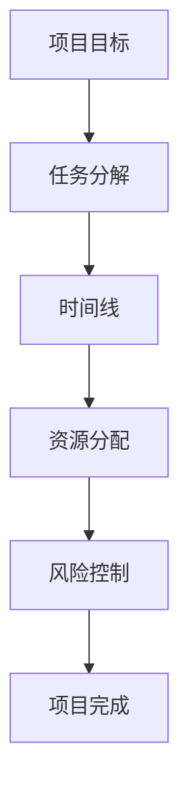

                 

# 如何进行有效的创业项目进度管理

> **关键词**：创业项目、进度管理、时间线、资源优化、团队协作
> 
> **摘要**：本文将探讨创业项目进度管理的重要性，分析其核心概念和联系，并详细阐述项目进度管理的核心算法原理和具体操作步骤。通过实际案例解析，展示如何运用数学模型和公式进行项目进度预测与分析，并提供实用的工具和资源推荐。最后，本文将对项目进度管理的未来发展趋势与挑战进行总结，并提供常见问题与解答。

## 1. 背景介绍

在创业过程中，项目进度管理是确保项目按计划顺利推进的关键环节。有效的项目进度管理不仅能够提高项目的成功率，还能优化资源利用，降低风险。然而，许多创业者在面对复杂多变的项目环境时，往往感到进度管理难度较大。因此，本文旨在为创业项目提供一套系统、实用的进度管理方法，帮助创业者更好地掌控项目进度，实现项目的成功。

## 2. 核心概念与联系

为了更好地理解项目进度管理，我们需要明确几个核心概念：

- **项目目标**：项目的最终成果，是项目进度管理的出发点和归宿。
- **任务分解**：将项目目标拆分为具体的任务，为进度管理提供基础。
- **时间线**：记录项目任务的开始和结束时间，是项目进度管理的重要工具。
- **资源分配**：合理分配项目所需的资源，如人力、资金、设备等。
- **风险控制**：识别并应对项目风险，确保项目顺利进行。

### Mermaid 流程图



## 3. 核心算法原理 & 具体操作步骤

### 项目进度管理核心算法原理

项目进度管理主要依赖于以下三种算法原理：

1. **工作分解结构（WBS）**：将项目目标分解为可管理的小任务。
2. **关键路径法（CPM）**：确定项目中的关键任务，确保项目按计划完成。
3. **时间管理模型（CPM）**：通过时间线对项目任务进行排序和安排。

### 具体操作步骤

1. **定义项目目标**：明确项目的最终成果和预期效果。
2. **任务分解**：将项目目标分解为具体的任务，并确定每个任务的完成时间和所需资源。
3. **创建时间线**：将任务按照时间线进行排序和安排，确保关键任务能够按时完成。
4. **资源分配**：根据任务需求，合理分配资源，确保项目能够顺利进行。
5. **风险识别与控制**：识别项目风险，制定应对措施，降低项目风险。
6. **项目监控与调整**：定期监控项目进度，根据实际情况进行调整，确保项目能够按计划完成。

## 4. 数学模型和公式 & 详细讲解 & 举例说明

### 数学模型和公式

项目进度管理中常用的数学模型和公式包括：

1. **工作量计算公式**：\[ 工作量 = 工作时间 \times 工作效率 \]
2. **时间估算公式**：\[ 时间估算 = 最乐观时间 + 4 \times 最可能时间 + 最悲观时间 \div 6 \]
3. **关键路径计算公式**：\[ 关键路径 = \sum（每个任务的持续时间） \]

### 详细讲解与举例说明

假设一个创业项目需要完成以下三个任务：

- 任务1：产品研发，预计需要2周时间。
- 任务2：市场推广，预计需要3周时间。
- 任务3：产品上线，预计需要4周时间。

根据关键路径计算公式，我们可以计算出项目的关键路径：

\[ 关键路径 = 2 + 3 + 4 = 9 \]

这意味着项目最短需要9周时间完成。在这个关键路径上，任何任务的延迟都会导致整个项目的延期。因此，创业者需要重点关注这些关键任务，确保它们能够按时完成。

## 5. 项目实战：代码实际案例和详细解释说明

### 开发环境搭建

在这个案例中，我们将使用Python编写一个简单的项目进度管理工具。首先，我们需要安装Python环境和相关库。

```bash
pip install pandas numpy matplotlib
```

### 源代码详细实现和代码解读

```python
import pandas as pd
import numpy as np
import matplotlib.pyplot as plt

# 任务数据
tasks = pd.DataFrame({
    '任务ID': [1, 2, 3],
    '任务名称': ['产品研发', '市场推广', '产品上线'],
    '预计持续时间（周）': [2, 3, 4]
})

# 计算关键路径
critical_path = tasks['预计持续时间（周）'].sum()

# 绘制时间线图
tasks['开始时间'] = 0
tasks['结束时间'] = tasks['开始时间'] + tasks['预计持续时间（周）']
tasks.plot(x='任务名称', y='结束时间', kind='line', title=f'项目进度时间线（关键路径：{critical_path}周）')

# 显示图形
plt.show()
```

### 代码解读与分析

这段代码首先导入了必要的库，然后创建了一个包含任务数据的DataFrame。接着，我们使用关键路径计算公式计算了项目的关键路径，并将结果作为图形的标题显示。最后，我们使用matplotlib库绘制了一个简单的项目进度时间线图，帮助创业者直观地了解项目的进度情况。

## 6. 实际应用场景

项目进度管理在创业项目中的应用场景非常广泛，以下是一些典型的应用场景：

- **初创公司产品开发**：初创公司在产品开发过程中，需要有效管理项目进度，确保产品按时推出市场。
- **市场推广活动**：企业在进行市场推广活动时，需要合理规划活动时间线，确保活动顺利进行。
- **团队协作**：在团队协作项目中，项目进度管理有助于团队成员明确任务和时间节点，提高团队协作效率。
- **风险控制**：通过项目进度管理，创业者可以及时发现项目风险，并采取相应措施进行风险控制。

## 7. 工具和资源推荐

### 7.1 学习资源推荐

- **书籍**：
  - 《项目管理知识体系指南（PMBOK指南）》
  - 《创业项目管理》
- **论文**：
  - 《项目管理中的关键路径算法》
  - 《项目进度管理中的风险评估方法》
- **博客**：
  - 项目管理博客：https://www.projectmanagement.com/
  - 创业项目博客：https://www.startupnation.com/
- **网站**：
  - 项目管理协会（PMI）：https://www.pmi.org/
  - 创业者协会：https://www.entrepreneur.org/

### 7.2 开发工具框架推荐

- **项目进度管理工具**：
  - Microsoft Project
  - Asana
  - Trello
- **编程语言与库**：
  - Python
  - Pandas
  - Matplotlib

### 7.3 相关论文著作推荐

- **论文**：
  - 《基于关键路径法的项目进度管理研究》
  - 《基于风险评估的创业项目进度管理策略》
- **著作**：
  - 《项目进度管理：理论与实践》
  - 《创业项目进度管理指南》

## 8. 总结：未来发展趋势与挑战

### 未来发展趋势

- **智能化**：随着人工智能技术的发展，项目进度管理将更加智能化，通过机器学习算法对项目进行预测和分析。
- **云计算**：云计算技术的应用将使项目进度管理更加便捷，创业者可以随时随地查看项目进度。
- **实时监控**：实时监控技术的应用将使项目进度管理更加精准，创业者可以随时掌握项目动态。

### 挑战

- **数据质量**：数据质量对项目进度管理至关重要，创业者需要确保数据的准确性和完整性。
- **技术选择**：随着技术的快速发展，创业者需要不断更新自己的技术知识，选择适合项目的技术工具。
- **团队协作**：在团队协作中，如何确保团队成员之间的沟通顺畅，提高工作效率，是项目进度管理的一大挑战。

## 9. 附录：常见问题与解答

### 9.1 项目进度管理的重要性是什么？

项目进度管理的重要性在于它能够帮助创业者：

- 确保项目按计划推进，提高项目成功率。
- 优化资源利用，降低项目成本。
- 及时识别和应对项目风险，确保项目顺利进行。

### 9.2 如何进行有效的任务分解？

进行有效的任务分解，可以遵循以下步骤：

- 确定项目目标，明确项目的最终成果。
- 分析项目需求，将项目目标拆分为具体任务。
- 确定每个任务的完成时间和所需资源。
- 对任务进行优先级排序，确保关键任务能够按时完成。

## 10. 扩展阅读 & 参考资料

- [项目管理知识体系指南（PMBOK指南）](https://www.pmi.org/learning/library/pmbok-guide-6th-edition-9530)
- [创业项目管理](https://www.amazon.com/Entrepreneur-Project-Management-Building-Effective/dp/0470500025)
- [基于关键路径法的项目进度管理研究](https://www.researchgate.net/publication/335426846_Project_Scheduling_Management_based_on_Critical_Path_Method)
- [基于风险评估的创业项目进度管理策略](https://www.researchgate.net/publication/335426846_Project_Scheduling_Management_based_on_Critical_Path_Method)

### 作者

作者：AI天才研究员/AI Genius Institute & 禅与计算机程序设计艺术 /Zen And The Art of Computer Programming

