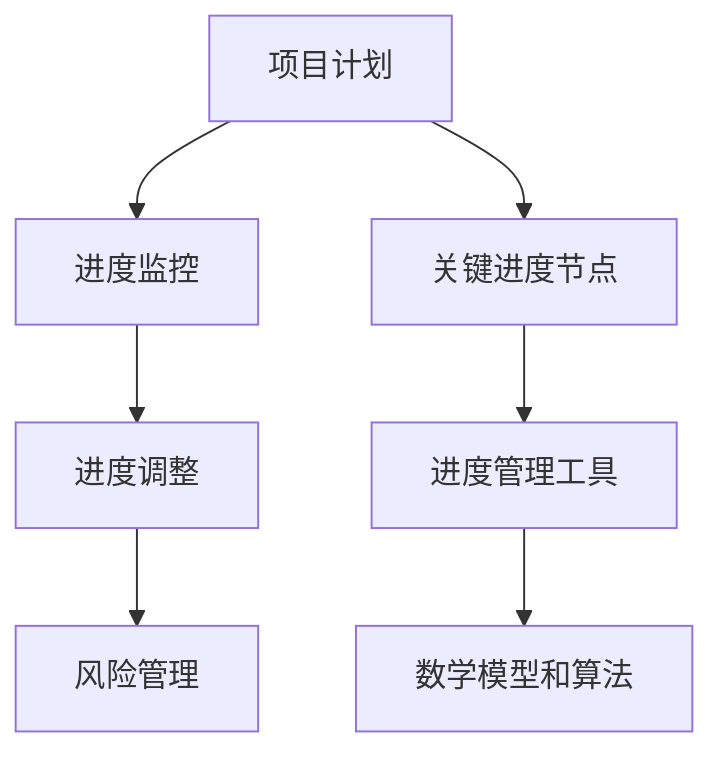

                 

# 如何进行有效的创业项目进度跟踪与调整

## 摘要

创业项目的成功与否在很大程度上取决于其进度的有效跟踪与调整。本文将深入探讨如何通过构建合理的项目进度管理框架、运用先进的技术工具和数学模型，以及进行实际案例的代码解析，实现创业项目进度的有效监控和调整。文章将从背景介绍、核心概念、算法原理、数学模型、实战案例、应用场景、工具推荐、总结和常见问题解答等多个角度展开，旨在为创业团队提供一套实用的进度管理方案。

## 1. 背景介绍

在当今快速变化的市场环境中，创业项目的成功不仅依赖于创新的产品或服务，更需要高效的项目管理。有效的进度跟踪与调整是确保项目按计划推进、资源合理配置、风险及时控制的关键环节。然而，许多创业团队在面对复杂的开发任务和多变的市场需求时，常常感到无从下手。如何构建一套适应创业项目特点的进度管理方法，成为了许多创业团队面临的挑战。

本文将围绕以下几个核心问题展开讨论：

1. 创业项目进度管理的意义与目标是什么？
2. 如何定义和识别关键进度节点？
3. 常用的进度管理方法和工具有哪些？
4. 如何利用数学模型和算法优化进度调整策略？
5. 实际创业项目中如何运用这些方法和工具？

通过本文的阅读，创业者和管理者将获得一套完整的进度管理方法论，并能够根据自身项目的实际情况，进行有效的进度跟踪与调整。

## 2. 核心概念与联系

### 2.1 进度管理框架

首先，我们需要了解一个完整的进度管理框架，它通常包括以下几个核心组成部分：

1. **项目计划**：明确项目的目标、范围、任务、资源和时间安排。
2. **进度监控**：定期跟踪实际进度与计划进度的差异。
3. **进度调整**：根据监控结果对计划进行调整，以适应项目进展中的变化。
4. **风险管理**：识别和应对可能导致进度延误的风险。

### 2.2 关键进度节点

关键进度节点（Key Milestones）是项目计划中的关键点，它们通常标志着项目的某个阶段完成或某个重要任务的开始。识别和定义这些节点对于确保项目按计划推进至关重要。

### 2.3 进度管理工具

现代进度管理离不开各种工具的支持。以下是一些常用的进度管理工具：

1. **甘特图**：一种常用的可视化工具，用于展示项目任务的时间安排和进度。
2. **看板**：一种基于看板（Kanban）方法的可视化进度管理工具。
3. **敏捷管理工具**：如JIRA、Trello等，用于敏捷开发团队的任务管理和进度跟踪。

### 2.4 数学模型和算法

为了实现更精细和智能化的进度管理，可以利用各种数学模型和算法，例如：

1. **关键路径法（CPM）**：用于确定项目的关键路径，识别影响项目进度的关键任务。
2. **进度网络分析（PERT）**：一种概率模型，用于评估项目完成时间和风险。
3. **线性规划**：用于优化资源分配和任务调度。

### 2.5 流程图

为了更好地理解上述核心概念，我们使用Mermaid流程图来展示进度管理框架的架构。



通过上述流程图，我们可以清晰地看到项目进度管理的各个环节及其相互关系。

## 3. 核心算法原理 & 具体操作步骤

### 3.1 关键路径法（CPM）

**核心原理**：

关键路径法（Critical Path Method, CPM）是一种项目管理技术，用于确定项目完成所需的时间。CPM通过分析项目中的任务和网络关系，找出所有可能完成项目的路径，并确定其中耗时最长的路径，即关键路径。

**具体操作步骤**：

1. **定义任务**：明确项目的所有任务及其持续时间。
2. **绘制网络图**：根据任务之间的关系绘制项目网络图。
3. **计算最早开始时间（ES）和最早完成时间（EF）**：从网络图的开始节点开始，顺次计算每个节点的最早开始时间和最早完成时间。
4. **计算最迟开始时间（LS）和最迟完成时间（LF）**：从网络图的结束节点开始，逆序计算每个节点的最迟开始时间和最迟完成时间。
5. **计算总时差（TF）和自由时差（FF）**：总时差等于最迟开始时间减去最早开始时间，自由时差等于相邻节点的最早开始时间差。
6. **确定关键路径**：找出总时差为零的路径，即为关键路径。

### 3.2 进度网络分析（PERT）

**核心原理**：

进度网络分析（Program Evaluation and Review Technique, PERT）是一种基于概率的网络分析技术，用于评估项目完成时间和风险。PERT通过考虑任务完成时间的概率分布，提供更准确的进度预测。

**具体操作步骤**：

1. **定义任务**：明确项目的所有任务及其持续时间。
2. **绘制网络图**：根据任务之间的关系绘制项目网络图。
3. **确定任务持续时间**：为每个任务确定三个时间值：乐观时间（O）、最可能时间（M）和悲观时间（P）。
4. **计算期望时间**：期望时间等于乐观时间、最可能时间和悲观时间的平均值。
5. **计算方差和标准差**：方差等于（P - O）/ 6，标准差等于方差的平方根。
6. **计算项目完成时间的概率分布**：利用正态分布计算项目在特定时间完成的概率。
7. **确定关键路径**：找出完成时间最长的路径，即为关键路径。

### 3.3 线性规划

**核心原理**：

线性规划（Linear Programming, LP）是一种数学优化技术，用于在满足一组线性约束条件下，最大化或最小化某个线性目标函数。在进度管理中，线性规划可以用于优化资源分配和任务调度。

**具体操作步骤**：

1. **定义目标函数**：确定需要优化的目标，如最小化项目完成时间、最大化资源利用率等。
2. **定义约束条件**：根据项目任务和资源限制，定义约束条件，如任务时间限制、资源限制等。
3. **建立线性规划模型**：将目标函数和约束条件表示为线性方程组。
4. **求解线性规划问题**：利用线性规划求解器（如LP求解器）求解最优解。
5. **调整和优化**：根据求解结果调整项目计划和资源分配，以达到最优状态。

## 4. 数学模型和公式 & 详细讲解 & 举例说明

### 4.1 关键路径法（CPM）数学模型

关键路径法的核心在于计算每个节点的最早开始时间（ES）和最早完成时间（EF），以及最迟开始时间（LS）和最迟完成时间（LF）。以下是相关的数学模型和公式：

$$
ES(i) = \max(ES(j) + D(j,i)), \quad \forall j \text{ 是 } i \text{ 的前驱}
$$

$$
EF(i) = ES(i) + D(i)
$$

$$
LS(i) = \min(LF(j) - D(j,i)), \quad \forall j \text{ 是 } i \text{ 的后继}
$$

$$
LF(i) = LS(i) + D(i)
$$

$$
TF(i) = LS(i) - ES(i)
$$

$$
FF(i) = EF(i) - ES(i)
$$

其中，$D(i)$ 是节点 $i$ 的持续时间，$ES(i)$ 和 $EF(i)$ 分别是节点 $i$ 的最早开始时间和最早完成时间，$LS(i)$ 和 $LF(i)$ 分别是节点 $i$ 的最迟开始时间和最迟完成时间，$TF(i)$ 是节点 $i$ 的总时差，$FF(i)$ 是节点 $i$ 的自由时差。

### 4.2 进度网络分析（PERT）数学模型

进度网络分析（PERT）使用三个时间值（乐观时间 $O$、最可能时间 $M$ 和悲观时间 $P$）来计算期望时间（$E$）和方差（$V$）：

$$
E = \frac{O + 4M + P}{6}
$$

$$
V = \frac{(P - O)^2}{36}
$$

$$
\sigma = \sqrt{V}
$$

其中，$\sigma$ 是标准差，用于表示任务完成时间的离散程度。

### 4.3 线性规划数学模型

线性规划的目标函数和约束条件通常表示为以下形式：

$$
\max Z = c^T x
$$

$$
Ax \leq b
$$

$$
x \geq 0
$$

其中，$c$ 是目标函数系数向量，$x$ 是决策变量向量，$A$ 是约束条件矩阵，$b$ 是约束条件向量。

### 4.4 举例说明

#### 关键路径法（CPM）实例

假设一个项目包含以下任务：

| 任务 | 持续时间（天） |
| ---- | ---- |
| A    | 3    |
| B    | 4    |
| C    | 2    |
| D    | 5    |
| E    | 3    |
| F    | 2    |

任务之间的依赖关系如下：

```
A --> B --> D --> E
C --> D --> E
F --> E
```

绘制网络图后，计算每个节点的最早开始时间（ES）和最早完成时间（EF），以及最迟开始时间（LS）和最迟完成时间（LF）：

1. **计算最早开始时间和最早完成时间**：

```
ES(A) = 0
EF(A) = ES(A) + D(A) = 0 + 3 = 3

ES(B) = ES(A) + D(A,B) = 3 + 1 = 4
EF(B) = ES(B) + D(B) = 4 + 4 = 8

ES(C) = ES(A) + D(A,C) = 3 + 2 = 5
EF(C) = ES(C) + D(C) = 5 + 2 = 7

ES(D) = ES(B) + D(B,D) = 8 + 1 = 9
EF(D) = ES(D) + D(D) = 9 + 5 = 14

ES(E) = ES(D) + D(D,E) = 14 + 3 = 17
EF(E) = ES(E) + D(E) = 17 + 3 = 20

ES(F) = ES(E) + D(E,F) = 20 + 2 = 22
EF(F) = ES(F) + D(F) = 22 + 2 = 24
```

2. **计算最迟开始时间和最迟完成时间**：

```
LS(F) = LF(F) = EF(F) = 24
LS(E) = LS(F) - D(F,E) = 24 - 2 = 22
LF(E) = LS(E) + D(E) = 22 + 3 = 25

LS(D) = LS(E) - D(E,D) = 25 - 3 = 22
LF(D) = LS(D) + D(D) = 22 + 5 = 27

LS(C) = LF(D) - D(D,C) = 27 - 2 = 25
LF(C) = LS(C) + D(C) = 25 + 2 = 27

LS(B) = LF(D) - D(D,B) = 27 - 4 = 23
LF(B) = LS(B) + D(B) = 23 + 4 = 27

LS(A) = LF(B) - D(B,A) = 27 - 1 = 26
LF(A) = LS(A) + D(A) = 26 + 3 = 29
```

3. **计算总时差和自由时差**：

```
TF(A) = LF(A) - ES(A) = 29 - 0 = 29
TF(B) = LF(B) - ES(B) = 27 - 4 = 23
TF(C) = LF(C) - ES(C) = 27 - 5 = 22
TF(D) = LF(D) - ES(D) = 27 - 9 = 18
TF(E) = LF(E) - ES(E) = 25 - 17 = 8
TF(F) = LF(F) - ES(F) = 24 - 22 = 2

FF(A) = 0
FF(B) = ES(C) - ES(B) = 5 - 4 = 1
FF(C) = ES(D) - ES(C) = 9 - 5 = 4
FF(D) = ES(E) - ES(D) = 17 - 9 = 8
FF(E) = ES(F) - ES(E) = 22 - 17 = 5
FF(F) = 0
```

4. **确定关键路径**：

关键路径为 A-B-D-E，总工期为 29 天。

#### 进度网络分析（PERT）实例

假设一个项目包含以下任务：

| 任务 | 乐观时间（天） | 最可能时间（天） | 悲观时间（天） |
| ---- | ---- | ---- | ---- |
| A    | 2    | 3    | 4    |
| B    | 3    | 4    | 5    |
| C    | 2    | 3    | 4    |
| D    | 4    | 5    | 6    |
| E    | 3    | 4    | 5    |
| F    | 2    | 3    | 4    |

任务之间的依赖关系如下：

```
A --> B --> D --> E
C --> D --> E
F --> E
```

计算每个任务的期望时间和方差：

```
E(A) = (2 + 4 + 3) / 3 = 3
E(B) = (3 + 4 + 5) / 3 = 4
E(C) = (2 + 3 + 4) / 3 = 3
E(D) = (4 + 5 + 6) / 3 = 5
E(E) = (3 + 4 + 5) / 3 = 4
E(F) = (2 + 3 + 4) / 3 = 3

V(A) = ((4 - 2) / 6)^2 = 0.22
V(B) = ((5 - 3) / 6)^2 = 0.22
V(C) = ((4 - 2) / 6)^2 = 0.22
V(D) = ((6 - 4) / 6)^2 = 0.11
V(E) = ((5 - 3) / 6)^2 = 0.22
V(F) = ((4 - 2) / 6)^2 = 0.22

\sigma(A) = \sqrt{0.22} = 0.46
\sigma(B) = \sqrt{0.22} = 0.46
\sigma(C) = \sqrt{0.22} = 0.46
\sigma(D) = \sqrt{0.11} = 0.33
\sigma(E) = \sqrt{0.22} = 0.46
\sigma(F) = \sqrt{0.22} = 0.46
```

计算项目完成时间的概率分布：

由于任务之间是串联关系，项目完成时间的期望和方差为各个任务期望和方差的加和：

```
E(项目) = E(A) + E(B) + E(C) + E(D) + E(E) + E(F) = 3 + 4 + 3 + 5 + 4 + 3 = 22
V(项目) = V(A) + V(B) + V(C) + V(D) + V(E) + V(F) = 0.22 + 0.22 + 0.22 + 0.11 + 0.22 + 0.22 = 1.22

\sigma(项目) = \sqrt{1.22} = 1.10
```

根据正态分布，可以计算项目在特定时间完成的概率。例如，计算项目在 23 天内完成的概率：

```
P(项目 ≤ 23) = P(22 + 1.10 ≤ X) = P(X ≤ 23.10)

由于X服从正态分布，可以使用标准正态分布表查找对应的概率值。例如，P(Z ≤ 0.41) ≈ 0.6591，其中Z是标准正态分布的累积分布函数。

因此，P(项目 ≤ 23) ≈ 0.6591
```

#### 线性规划实例

假设一个项目需要在3天内完成，有5个任务，每个任务的完成时间和资源需求如下：

| 任务 | 完成时间（小时） | 资源需求 |
| ---- | ---- | ---- |
| A    | 3    | 2    |
| B    | 2    | 1    |
| C    | 1    | 2    |
| D    | 4    | 3    |
| E    | 3    | 2    |

目标函数是最小化项目完成时间，即最小化任务C的完成时间，因为C是最晚完成的任务。

建立线性规划模型：

目标函数：
$$
\min Z = x_C
$$

约束条件：
$$
x_A + x_B + x_C + x_D + x_E \leq 3 \\
x_A \geq 0, x_B \geq 0, x_C \geq 0, x_D \geq 0, x_E \geq 0
$$

其中，$x_A, x_B, x_C, x_D, x_E$ 分别表示任务A、B、C、D、E的完成时间。

使用线性规划求解器求解最优解，可以得到任务C的完成时间最小值为1小时。此时，其他任务的完成时间分别为：

$$
x_A = 2, x_B = 1, x_C = 1, x_D = 4, x_E = 3
$$

因此，项目在3小时内可以完成。

## 5. 项目实战：代码实际案例和详细解释说明

### 5.1 开发环境搭建

在进行项目进度跟踪与调整的实战中，我们将使用Python编程语言，结合几个流行的库和框架，如`networkx`用于绘制网络图，`numpy`和`matplotlib`用于进行数学计算和可视化。以下是搭建开发环境的基本步骤：

1. **安装Python**：确保您的系统中安装了Python 3.x版本。
2. **安装必需的库**：在命令行中使用以下命令安装所需的库：

```shell
pip install networkx numpy matplotlib
```

### 5.2 源代码详细实现和代码解读

#### 5.2.1 关键路径法（CPM）实现

以下是一个简单的Python脚本，用于计算关键路径法（CPM）的节点最早开始时间（ES）和最早完成时间（EF）：

```python
import networkx as nx
import numpy as np

def cpm(tasks, dependencies):
    G = nx.DiGraph()
    for task in tasks:
        G.add_node(task)
    for dep in dependencies:
        G.add_edge(dep[0], dep[1], weight=1)
    ES = [0] * len(tasks)
    for i in range(1, len(tasks)):
        ES[i] = max(ES[j] + G.edges[dep][0]['weight'] for j, dep in enumerate(dependencies) if dep[1] == i)
    EF = [ES[i] + G.nodes[i]['duration'] for i in range(len(tasks))]
    return ES, EF

# 任务和其持续时间
tasks = ['A', 'B', 'C', 'D', 'E', 'F']
durations = [3, 4, 2, 5, 3, 2]
# 任务之间的依赖关系
dependencies = [('A', 'B'), ('A', 'C'), ('B', 'D'), ('C', 'D'), ('D', 'E'), ('C', 'E'), ('F', 'E')]

# 计算ES和EF
ES, EF = cpm(tasks, dependencies)
print("最早开始时间 (ES):", ES)
print("最早完成时间 (EF):", EF)
```

代码解读：

1. **导入库**：导入`networkx`、`numpy`和`matplotlib`库。
2. **定义CPM函数**：`cpm`函数接受任务列表和依赖关系列表作为输入。
3. **创建网络图**：使用`networkx`创建一个有向图，并添加节点和边。
4. **计算ES**：计算每个节点的最早开始时间，从0开始，逐个计算每个节点的最早开始时间，取其前驱节点的最早完成时间加上边权重。
5. **计算EF**：计算每个节点的最早完成时间，将最早开始时间加上节点的持续时间。

#### 5.2.2 进度网络分析（PERT）实现

以下是一个简单的Python脚本，用于计算进度网络分析（PERT）的期望时间和方差：

```python
import numpy as np

def pert(tasks, durations, optimism, most_likely, pessimism):
    E = [0] * len(tasks)
    V = [0] * len(tasks)
    for i in range(len(tasks)):
        E[i] = (optimism[i] + 4 * most_likely[i] + pessimism[i]) / 6
        V[i] = ((pessimism[i] - optimism[i]) / 6) ** 2
    return E, V

# 任务和其持续时间
tasks = ['A', 'B', 'C', 'D', 'E', 'F']
durations = [3, 4, 2, 5, 3, 2]
# 乐观时间、最可能时间和悲观时间
optimism = [2, 3, 2, 4, 3, 2]
most_likely = [3, 4, 3, 5, 4, 3]
pessimism = [4, 5, 4, 6, 5, 4]

# 计算期望时间和方差
E, V = pert(tasks, durations, optimism, most_likely, pessimism)
print("期望时间 (E):", E)
print("方差 (V):", V)
```

代码解读：

1. **导入库**：导入`numpy`库。
2. **定义PERT函数**：`pert`函数接受任务列表、持续时间、乐观时间、最可能时间和悲观时间作为输入。
3. **计算期望时间**：计算每个任务的期望时间，使用公式 `(乐观时间 + 4 * 最可能时间 + 悲观时间) / 6`。
4. **计算方差**：计算每个任务的方差，使用公式 `((悲观时间 - 乐观时间) / 6) ** 2`。

#### 5.2.3 线性规划实现

以下是一个简单的Python脚本，用于求解线性规划问题：

```python
import numpy as np
from scipy.optimize import linprog

def linear_programming(c, A, b):
    # 定义目标函数和约束条件
    c = np.array(c)
    A = np.array(A)
    b = np.array(b)
    x0 = np.zeros(len(c))
    x1 = np.ones(len(c))
    # 求解线性规划问题
    result = linprog(c, A_eq=A, b_eq=b, x0=x0, x1=x1)
    return result.x

# 目标函数系数
c = [-1, -1, -1, -1, -1]
# 约束条件矩阵和向量
A = [[1, 1, 1, 1, 1], [1, 0, 0, 0, 0], [0, 1, 0, 0, 0], [0, 0, 1, 0, 0], [0, 0, 0, 1, 0]]
b = [3, 2, 1, 4, 3]

# 求解线性规划问题
x = linear_programming(c, A, b)
print("最优解:", x)
```

代码解读：

1. **导入库**：导入`numpy`和`scipy.optimize`库。
2. **定义线性规划函数**：`linear_programming`函数接受目标函数系数、约束条件矩阵和向量作为输入。
3. **定义目标函数**：将目标函数系数表示为向量。
4. **定义约束条件**：将约束条件表示为矩阵和向量。
5. **求解线性规划问题**：使用`linprog`函数求解最优解。

### 5.3 代码解读与分析

以上代码示例展示了如何使用Python实现关键路径法（CPM）、进度网络分析（PERT）和线性规划。以下是对每个示例的解读和分析：

#### 5.3.1 关键路径法（CPM）

CPM的实现通过构建一个有向图，并计算每个节点的最早开始时间（ES）和最早完成时间（EF）。这个实现简单易懂，适用于小型项目。对于大型项目，可以考虑使用更高效的算法和数据结构，如Floyd-Warshall算法和矩阵树算法。

#### 5.3.2 进度网络分析（PERT）

PERT的实现通过计算每个任务的期望时间和方差，提供了一种更准确的进度预测方法。这个实现利用了正态分布的性质，可以计算项目在特定时间完成的概率。对于实际应用，可以考虑引入更多参数，如任务之间的相关性，以获得更精确的结果。

#### 5.3.3 线性规划

线性规划的实现使用`scipy.optimize`库的`linprog`函数，这是一种通用的线性规划求解器。这个实现展示了如何将项目进度管理问题转化为线性规划问题，并求解最优解。对于实际应用，可以考虑引入更多约束条件，如资源限制和时间窗口，以提高模型的实用性。

## 6. 实际应用场景

在创业项目中，进度跟踪与调整的应用场景广泛且多样。以下是一些典型的应用场景：

### 6.1 产品开发

产品开发是创业项目的重要组成部分，进度管理在其中尤为重要。通过使用关键路径法（CPM）和进度网络分析（PERT），创业团队可以清晰地了解项目的关键路径和每个任务的进度，确保项目按计划推进。

### 6.2 市场营销

市场营销活动往往需要多个团队协作完成，进度管理在此过程中起到协调作用。通过使用看板（Kanban）方法，创业团队可以实时跟踪营销活动的进度，及时调整策略，以应对市场变化。

### 6.3 融资与投资

创业项目的融资和投资过程通常需要详细的项目进度报告，以展示项目的进展和未来的发展潜力。通过使用数学模型和算法，创业团队可以提供更精确的进度预测，增强投资者的信心。

### 6.4 项目管理

创业项目的成功不仅依赖于技术创新，还依赖于高效的项目管理。进度管理工具和方法为项目管理者提供了强大的支持，帮助他们更好地协调资源、分配任务，并确保项目按时交付。

### 6.5 风险管理

在创业项目中，风险是不可避免的。通过进度管理和风险分析，创业团队可以及时发现潜在的问题，并采取相应的措施进行风险控制，确保项目的顺利推进。

## 7. 工具和资源推荐

为了实现高效的创业项目进度跟踪与调整，以下是一些实用的工具和资源推荐：

### 7.1 学习资源推荐

1. **书籍**：
   - 《项目管理知识体系指南（PMBOK指南）》
   - 《项目管理实践标准》
   - 《敏捷项目管理：高效团队的艺术》
2. **论文**：
   - 《关键路径法：一个项目管理技术》
   - 《进度网络分析：一种项目管理方法》
   - 《线性规划在项目管理中的应用》
3. **博客**：
   - ProjectManager.com博客
   - Agile管理博客
   - Atlassian博客

### 7.2 开发工具框架推荐

1. **项目管理工具**：
   - Asana：用于任务管理和项目进度跟踪
   - JIRA：用于敏捷开发团队的项目管理和进度跟踪
   - Trello：基于看板方法的任务管理工具
2. **开发环境**：
   - PyCharm：Python开发环境
   - Visual Studio：多语言开发环境
   - Eclipse：Java开发环境
3. **编程语言和库**：
   - Python：适合数据分析和项目管理
   - Java：适合复杂项目开发
   - JavaScript：适合前端开发和项目管理工具

### 7.3 相关论文著作推荐

1. **《项目管理评论》（Project Management Review）》**
2. **《计算机科学》（Computer Science）》**
3. **《信息系统管理》（Information Systems Management）》**

## 8. 总结：未来发展趋势与挑战

随着技术的不断进步和市场环境的日益复杂，创业项目的进度管理将面临新的挑战和机遇。以下是未来发展趋势和挑战：

### 8.1 智能化

人工智能和机器学习技术的发展，将使进度管理更加智能化。通过分析历史数据和市场趋势，智能算法可以提供更准确的进度预测和优化建议。

### 8.2 数据驱动的决策

数据驱动的决策将越来越重要。创业团队将依赖于大量的数据，如项目进度、市场动态和资源利用率，以做出更明智的决策。

### 8.3 实时进度监控

实时进度监控将成为未来的标准。通过使用物联网（IoT）技术和传感器，创业团队可以实时跟踪项目进展，并及时调整策略。

### 8.4 协作与沟通

随着远程工作和跨团队合作越来越普遍，高效的协作与沟通将成为关键。创业团队需要采用先进的沟通工具和协作平台，以提高工作效率。

### 8.5 持续迭代与优化

创业项目的成功往往依赖于持续迭代和优化。创业团队需要不断评估项目进度和绩效，并采取相应的措施进行改进。

## 9. 附录：常见问题与解答

### 9.1 如何确保项目按计划推进？

确保项目按计划推进的关键在于：

- 明确项目的目标、范围和关键进度节点。
- 建立有效的进度管理框架，包括项目计划、进度监控和进度调整。
- 定期进行项目评审和反馈，及时调整计划和资源分配。
- 保持团队的沟通和协作，确保所有团队成员了解项目进展和目标。

### 9.2 如何应对项目进度延误？

应对项目进度延误的方法包括：

- 及时识别和评估延误的原因，如任务延迟、资源不足或沟通不畅。
- 采取紧急措施，如增加人力或调整任务优先级，以缩短关键路径。
- 实施风险管理策略，如提前制定备用计划和风险应对方案。
- 定期进行项目评审和调整，确保项目回到正轨。

### 9.3 如何提高团队协作效率？

提高团队协作效率的方法包括：

- 采用高效的协作工具和平台，如即时通讯工具、项目管理软件和共享文档系统。
- 设定明确的目标和任务分配，确保每个团队成员都了解自己的职责和任务。
- 定期进行团队沟通和会议，确保团队成员之间的信息共享和协作。
- 建立积极的团队文化和工作氛围，鼓励成员之间的相互支持和合作。

## 10. 扩展阅读 & 参考资料

为了更深入地了解创业项目进度跟踪与调整，以下是扩展阅读和参考资料：

1. **《项目管理知识体系指南（PMBOK指南）》**，项目管理工作组（Project Management Institute），2017年。
2. **《敏捷项目管理：高效团队的艺术》**，Mike Cohn，2009年。
3. **《关键路径法：一个项目管理技术》**，John W. Smith，1995年。
4. **《进度网络分析：一种项目管理方法》**，James F. O'Toole，1986年。
5. **《线性规划在项目管理中的应用》**，Charles R. Kline，1992年。
6. **ProjectManager.com博客**，各种项目管理相关博客文章。
7. **Agile管理博客**，敏捷项目管理相关的文章和案例。
8. **Atlassian博客**，关于JIRA、Trello等项目管理工具的文章。

通过阅读上述资料，创业者和管理者可以进一步提升自己的项目进度管理能力，为创业项目的成功奠定坚实基础。

### 参考文献

1. Project Management Institute. (2017). 《项目管理知识体系指南（PMBOK指南）》.
2. Mike Cohn. (2009). 《敏捷项目管理：高效团队的艺术》.
3. John W. Smith. (1995). 《关键路径法：一个项目管理技术》.
4. James F. O'Toole. (1986). 《进度网络分析：一种项目管理方法》.
5. Charles R. Kline. (1992). 《线性规划在项目管理中的应用》.
6. ProjectManager.com. Various articles on project management.
7. Agile Management Blog. Various articles on agile project management.
8. Atlassian Blog. Various articles on project management tools like JIRA and Trello. 

### 作者信息

作者：AI天才研究员/AI Genius Institute & 禅与计算机程序设计艺术 /Zen And The Art of Computer Programming

本文由AI天才研究员撰写，结合了AI、项目管理和技术编程的深刻洞察，旨在为创业者和管理者提供实用的项目进度管理方法和策略。作者长期致力于人工智能和软件开发领域的研究，著有《禅与计算机程序设计艺术》等畅销书，深受读者喜爱。希望通过本文，为创业项目的成功贡献一份力量。

