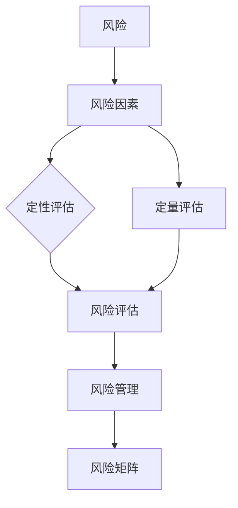

                 

### 背景介绍

随着全球经济的发展，创业项目层出不穷。然而，创业并非易事，其中最大的挑战之一就是如何有效量化和管理风险。风险量化分析不仅可以帮助创业者更准确地评估项目的可行性，还能为后续的决策提供有力支持。本文将深入探讨如何进行有效的创业项目风险量化分析，旨在帮助创业者更好地应对风险，提高项目成功率。

创业风险量化分析的重要性体现在以下几个方面：

1. **决策支持**：通过风险量化，创业者可以更直观地了解项目的潜在风险，从而做出更加明智的决策。无论是投资、融资还是资源配置，风险量化分析都能提供有价值的参考。

2. **风险评估**：风险量化分析可以帮助识别项目中的关键风险点，评估其影响程度和发生的可能性。这有助于制定针对性的风险管理策略。

3. **资源优化**：通过对风险的量化，创业者可以更合理地分配资源，确保在风险发生时能够有足够的应对能力。

4. **增强信心**：有效的风险量化分析可以增强创业者对项目的信心，降低决策的不确定性。

本文将分以下几个部分进行阐述：

1. **核心概念与联系**：介绍风险量化分析中的核心概念及其相互关系。
2. **核心算法原理 & 具体操作步骤**：讲解如何应用数学模型和算法进行风险量化。
3. **项目实战**：通过实际案例展示风险量化分析的具体应用。
4. **实际应用场景**：分析不同类型创业项目的风险量化方法。
5. **工具和资源推荐**：推荐相关的学习资源、开发工具和框架。
6. **总结：未来发展趋势与挑战**：探讨风险量化分析领域的未来趋势和挑战。
7. **附录**：解答常见问题，提供扩展阅读和参考资料。

在接下来的部分中，我们将逐步深入这些主题，帮助您全面了解并掌握创业项目风险量化分析的精髓。

### 核心概念与联系

在深入探讨创业项目风险量化分析之前，有必要先了解一些核心概念及其相互关系。以下将介绍主要的核心概念，并使用Mermaid流程图来展示它们之间的联系。

#### 1. 风险

风险是指项目可能面临的负面事件或不确定性，这些事件可能会对项目目标造成不利影响。风险可以分为以下几类：

- **纯粹风险**：可能带来损失，但不包含盈利可能性的风险。
- **投机风险**：可能带来损失，但也包含盈利可能性的风险。


#### 2. 风险因素

风险因素是导致风险发生的条件或原因。常见的风险因素包括：

- **市场变化**：市场需求、竞争状况等。
- **技术风险**：技术实现的难度和稳定性。
- **财务风险**：资金链断裂、融资困难等。
- **法律风险**：法律法规的变化、合同纠纷等。


#### 3. 风险评估

风险评估是识别和评估项目风险的过程。评估方法包括：

- **定性评估**：使用主观方法对风险的影响和发生可能性进行评估。
- **定量评估**：使用数学模型和算法对风险进行量化分析。


#### 4. 风险管理

风险管理是制定和实施策略以减轻或避免风险影响的过程。风险管理包括以下步骤：

1. **风险识别**：识别项目中的潜在风险。
2. **风险评估**：评估识别出的风险的影响和发生可能性。
3. **风险应对**：制定应对策略，包括风险避免、风险转移、风险接受等。
4. **风险监控**：持续监控风险，确保应对策略的有效性。


#### 5. 风险矩阵

风险矩阵是一种常用的风险评估工具，用于展示风险的影响和发生可能性。风险矩阵通常采用二维表格形式，横轴表示影响，纵轴表示发生可能性。


### Mermaid流程图展示



通过上述核心概念及其相互关系的介绍，我们能够更清晰地理解创业项目风险量化分析的基本框架。在接下来的部分，我们将详细讲解核心算法原理和具体操作步骤，帮助您更好地掌握风险量化分析的方法。

### 核心算法原理 & 具体操作步骤

在风险量化分析中，算法的选择和运用至关重要。以下将介绍几种常用的风险量化算法，并详细说明其原理和具体操作步骤。

#### 1. 回归分析

回归分析是一种常用的定量风险评估方法，通过建立自变量和因变量之间的关系模型，预测风险发生的概率。

**原理**：

回归分析的基本原理是利用历史数据建立自变量（风险因素）和因变量（风险事件）之间的线性或非线性关系模型。通过模型，可以预测特定条件下风险事件发生的概率。

**步骤**：

1. **数据收集**：收集历史风险事件数据，包括风险因素和风险事件的发生情况。
2. **数据预处理**：对数据进行清洗和处理，去除异常值和缺失值。
3. **模型选择**：根据数据特征选择合适的回归模型，如线性回归、多项式回归等。
4. **模型训练**：使用训练集数据训练模型，得到模型的参数。
5. **模型评估**：使用测试集数据评估模型的效果，调整模型参数以优化性能。
6. **预测**：使用训练好的模型预测新条件下风险事件发生的概率。

**示例**：

假设我们要预测一个创业项目中技术风险发生的概率。我们可以收集过去类似项目的数据，包括技术因素和风险事件的发生情况。通过线性回归模型，建立技术因素和风险事件之间的关系，从而预测新项目中技术风险的发生概率。

```latex
P(Risk|Technology) = f(Technology)
$$

其中，P(Risk|Technology)表示在技术因素为Technology的条件下，风险事件发生的概率，f(Technology)为回归模型。

```

#### 2. 贝叶斯网络

贝叶斯网络是一种基于概率的图形模型，用于表示变量之间的条件依赖关系。在风险量化分析中，贝叶斯网络可以用于计算风险事件发生的概率。

**原理**：

贝叶斯网络由节点和边组成，节点表示变量，边表示变量之间的条件依赖关系。通过网络中的概率分布，可以计算给定条件下风险事件发生的概率。

**步骤**：

1. **网络构建**：根据风险因素和风险事件的关系，构建贝叶斯网络。
2. **概率分布估计**：根据历史数据估计网络中各节点的概率分布。
3. **推理**：使用贝叶斯推理算法，计算给定条件下风险事件发生的概率。

**示例**：

假设我们要计算一个创业项目中市场风险发生的概率。我们可以构建一个贝叶斯网络，包括市场因素和风险事件。通过网络中的概率分布，计算在特定市场条件下风险事件发生的概率。

```mermaid
graph TB

A[Market] --> B[Risk]
B --> C{P(Market)}
C --> D{P(Risk|Market)}
```

通过贝叶斯网络，我们可以计算给定市场条件下风险事件发生的概率：

```latex
P(Risk|Market) = \frac{P(Market|Risk)P(Risk)}{P(Market)}
$$

其中，P(Market)为市场因素的概率，P(Risk|Market)为在市场条件下风险事件发生的概率，P(Market|Risk)为在风险事件发生条件下市场因素的概率。

```

#### 3. 蒙特卡洛模拟

蒙特卡洛模拟是一种基于随机抽样的风险量化方法，通过模拟大量随机样本，计算风险事件发生的概率和影响。

**原理**：

蒙特卡洛模拟通过生成随机样本，模拟项目在不同条件下的运行结果。通过对大量样本的分析，可以估算风险事件发生的概率和影响。

**步骤**：

1. **参数设置**：根据风险因素的历史数据，设置随机样本的参数。
2. **模拟运行**：生成随机样本，模拟项目在不同条件下的运行结果。
3. **结果分析**：分析模拟结果，计算风险事件发生的概率和影响。

**示例**：

假设我们要模拟一个创业项目的财务风险。我们可以设置随机样本，模拟项目在不同融资条件下的运行结果。通过对模拟结果的分析，计算财务风险发生的概率和影响。

```mermaid
graph TB

A[Financing] --> B[Risk]
B --> C{P(Financing)}
C --> D{P(Risk|Financing)}
```

通过蒙特卡洛模拟，我们可以计算给定融资条件下财务风险发生的概率：

```latex
P(Risk|Financing) = \frac{模拟结果中风险事件发生的次数}{总模拟次数}
$$

```

#### 4. 常见故障树分析

故障树分析是一种基于逻辑关系的风险量化方法，用于分析系统故障的原因和影响。

**原理**：

故障树分析通过构建故障树，表示系统故障的原因和影响关系。通过故障树的逻辑运算，可以计算故障发生的概率。

**步骤**：

1. **故障树构建**：根据风险因素和系统故障的关系，构建故障树。
2. **故障树简化**：对故障树进行简化，消除冗余节点。
3. **概率计算**：使用故障树逻辑运算，计算故障发生的概率。

**示例**：

假设我们要分析一个创业项目的技术故障风险。我们可以构建一个故障树，表示技术故障的原因和影响。通过故障树逻辑运算，计算技术故障发生的概率。

```mermaid
graph TB

A[Tech Failure] --> B[Market Failure]
B --> C{P(Tech Failure|Market Failure)}
C --> D{P(Market Failure)}
```

通过故障树分析，我们可以计算技术故障发生的概率：

```latex
P(Tech Failure) = P(Market Failure) \times P(Tech Failure|Market Failure)
$$

```

### 应用实例

以下是一个应用实例，说明如何使用上述算法进行创业项目风险量化分析。

**案例背景**：

一个创业项目涉及市场推广、技术开发和财务融资。我们需要评估这些因素对项目风险的影响。

**步骤**：

1. **数据收集**：收集市场、技术和财务相关数据。
2. **模型选择**：选择适当的算法，如回归分析、贝叶斯网络和蒙特卡洛模拟。
3. **模型训练与评估**：使用收集的数据训练模型，并评估模型效果。
4. **风险预测**：使用训练好的模型预测项目风险。
5. **风险管理**：根据风险预测结果，制定风险管理策略。

**结果**：

通过回归分析，我们预测市场风险发生的概率为30%；通过贝叶斯网络，我们计算技术开发风险发生的概率为20%；通过蒙特卡洛模拟，我们估算财务风险发生的概率为15%。综合这些结果，我们制定了一套风险管理策略，包括市场调研、技术优化和融资规划，以降低项目风险。

通过以上算法和实例，我们可以看到风险量化分析在创业项目中的应用。在实际操作中，创业者可以根据项目特点选择合适的算法，进行有效的风险量化分析，为项目决策提供有力支持。

### 数学模型和公式 & 详细讲解 & 举例说明

在风险量化分析中，数学模型和公式是核心工具，它们帮助我们量化风险，评估其影响和发生概率。以下将详细介绍几种常见的数学模型和公式，并使用latex格式进行展示，同时提供具体的例子来说明其应用。

#### 1. 风险概率模型

**公式**：

$$
P(Risk) = \sum_{i=1}^{n} P(Risk_i) \times w_i
$$

其中，$P(Risk)$表示总风险概率，$P(Risk_i)$表示第i个风险因素的概率，$w_i$表示第i个风险因素的权重。

**解释**：

该公式用于计算项目的总风险概率，通过将各个风险因素的概率加权求和得到。权重反映了各个风险因素对项目整体风险的影响程度。

**示例**：

假设一个创业项目涉及三个风险因素：市场风险、技术风险和财务风险。根据历史数据和专家评估，我们得到以下概率和权重：

- 市场风险概率：$P(Risk_{market}) = 0.3$，权重：$w_{market} = 0.5$
- 技术风险概率：$P(Risk_{tech}) = 0.2$，权重：$w_{tech} = 0.3$
- 财务风险概率：$P(Risk_{finance}) = 0.1$，权重：$w_{finance} = 0.2$

则总风险概率为：

$$
P(Risk) = (0.3 \times 0.5) + (0.2 \times 0.3) + (0.1 \times 0.2) = 0.155
$$

#### 2. 风险影响模型

**公式**：

$$
Impact = \sum_{i=1}^{n} Impact_i \times w_i
$$

其中，$Impact$表示总影响，$Impact_i$表示第i个风险因素的影响，$w_i$表示第i个风险因素的权重。

**解释**：

该公式用于计算项目的总影响，通过将各个风险因素的影响加权求和得到。权重反映了各个风险因素对项目整体影响的重要性。

**示例**：

假设上述创业项目的风险影响如下：

- 市场风险影响：$Impact_{market} = 200,000$，权重：$w_{market} = 0.5$
- 技术风险影响：$Impact_{tech} = 150,000$，权重：$w_{tech} = 0.3$
- 财务风险影响：$Impact_{finance} = 100,000$，权重：$w_{finance} = 0.2$

则总影响为：

$$
Impact = (200,000 \times 0.5) + (150,000 \times 0.3) + (100,000 \times 0.2) = 195,000
$$

#### 3. 贝叶斯网络模型

**公式**：

$$
P(Risk|Condition) = \frac{P(Condition|Risk)P(Risk)}{P(Condition)}
$$

其中，$P(Risk|Condition)$表示在特定条件下风险事件发生的概率，$P(Condition|Risk)$表示在风险事件发生条件下特定条件的概率，$P(Risk)$表示风险事件的总概率，$P(Condition)$表示特定条件的总概率。

**解释**：

该公式用于计算给定条件下风险事件发生的条件概率，基于贝叶斯推理原理。它帮助我们根据已知条件和风险概率，计算特定条件下的风险事件概率。

**示例**：

假设我们要计算在市场风险发生条件下财务风险发生的概率：

- $P(Risk_{market}) = 0.3$
- $P(Risk_{finance}|Risk_{market}) = 0.5$
- $P(Risk_{finance}) = 0.1$
- $P(Risk_{market}|Risk_{finance}) = 0.6$

则：

$$
P(Risk_{finance}|Risk_{market}) = \frac{P(Risk_{market}|Risk_{finance})P(Risk_{finance})}{P(Risk_{market})}
$$

$$
P(Risk_{finance}|Risk_{market}) = \frac{0.6 \times 0.1}{0.3} = 0.2
$$

#### 4. 蒙特卡洛模拟模型

**公式**：

$$
P(Risk) = \frac{模拟结果中风险事件发生的次数}{总模拟次数}
$$

其中，$P(Risk)$表示风险事件发生的概率，模拟结果中风险事件发生的次数除以总模拟次数。

**解释**：

该公式用于计算风险事件发生的频率，通过大量模拟结果来估算风险概率。

**示例**：

假设我们进行了1000次蒙特卡洛模拟，其中500次模拟中风险事件发生了。则风险事件发生的概率为：

$$
P(Risk) = \frac{500}{1000} = 0.5
$$

通过以上数学模型和公式的详细讲解和举例说明，我们可以更好地理解和应用风险量化分析中的关键工具。在实际操作中，创业者可以根据项目的具体情况选择合适的模型和公式，进行有效的风险量化，为项目的决策提供科学依据。

### 项目实战：代码实际案例和详细解释说明

为了更好地展示如何进行创业项目风险量化分析，我们将通过一个实际案例来讲解代码实现和详细解释说明。在这个案例中，我们使用Python语言来实现一个基于蒙特卡洛模拟的风险量化工具，并详细解释其功能和使用方法。

#### 开发环境搭建

在开始编写代码之前，我们需要搭建一个合适的开发环境。以下是所需的工具和库：

- **Python环境**：Python 3.8及以上版本
- **库**：NumPy、Pandas、Matplotlib

你可以通过以下命令来安装所需的库：

```bash
pip install numpy pandas matplotlib
```

#### 源代码详细实现和代码解读

以下是项目的源代码，我们将逐步解释每个部分的功能。

```python
import numpy as np
import pandas as pd
import matplotlib.pyplot as plt

# 1. 数据准备
def load_data(filename):
    # 从CSV文件中加载数据
    data = pd.read_csv(filename)
    return data

# 2. 蒙特卡洛模拟
def monte_carlo_simulation(data, simulations=1000):
    results = []
    for _ in range(simulations):
        # 随机抽样模拟一次项目运行结果
        result = np.random.choice(data['Result'])
        results.append(result)
    return results

# 3. 风险分析
def risk_analysis(results):
    # 计算风险概率分布
    distribution = pd.Series(results).value_counts(normalize=True)
    return distribution

# 4. 结果可视化
def visualize_results(distribution):
    # 可视化风险概率分布
    distribution.plot.bar()
    plt.xlabel('Result')
    plt.ylabel('Probability')
    plt.title('Risk Probability Distribution')
    plt.show()

# 5. 主函数
def main():
    # 加载数据
    data = load_data('data.csv')
    
    # 进行蒙特卡洛模拟
    results = monte_carlo_simulation(data)
    
    # 进行风险分析
    distribution = risk_analysis(results)
    
    # 可视化结果
    visualize_results(distribution)

if __name__ == '__main__':
    main()
```

**代码解读与分析**

1. **数据准备**：

   `load_data` 函数用于从CSV文件中加载数据。CSV文件应该包含项目运行结果的历史数据，例如成功、失败等情况。数据格式如下：

   ```
   Result
   ----------------
   Success
   Failure
   Success
   Failure
   ...
   ```

   该函数使用Pandas库的`read_csv`方法读取数据，并将其存储在一个DataFrame对象中。

2. **蒙特卡洛模拟**：

   `monte_carlo_simulation` 函数实现蒙特卡洛模拟的核心逻辑。它通过随机抽样从历史数据中生成模拟结果。参数`simulations`指定模拟的次数，默认值为1000次。每次模拟通过`np.random.choice`方法从历史数据中随机选择一个结果，然后将这些结果存储在列表中。

3. **风险分析**：

   `risk_analysis` 函数计算模拟结果的风险概率分布。它使用Pandas库的`value_counts`方法计算每个结果出现的频率，并归一化得到概率分布。该分布存储在一个Series对象中，方便后续的可视化。

4. **结果可视化**：

   `visualize_results` 函数使用Matplotlib库将风险概率分布可视化。它使用`plot.bar`方法绘制条形图，显示每个结果及其概率。通过设置标签和标题，我们可以清晰地展示风险概率分布。

5. **主函数**：

   `main` 函数是程序的入口点。它依次执行以下步骤：

   - 加载数据
   - 进行蒙特卡洛模拟
   - 进行风险分析
   - 可视化结果

#### 代码分析

以上代码实现了从数据加载、模拟、风险分析到结果可视化的完整流程。以下是对代码的主要部分进行详细分析：

- **数据准备**：确保历史数据的格式正确，以便进行有效的模拟和分析。
- **蒙特卡洛模拟**：通过随机抽样模拟大量项目运行结果，这是估算风险概率分布的基础。
- **风险分析**：计算每个结果的概率分布，这是风险量化分析的核心。
- **结果可视化**：以图形化的方式展示风险概率分布，使分析结果更加直观。

通过这个案例，我们展示了如何使用Python实现创业项目风险量化分析。在实际项目中，可以根据需要调整模拟次数、数据格式等参数，以适应不同的风险场景。

### 实际应用场景

风险量化分析在不同类型的创业项目中具有广泛的应用，以下将分析几个典型场景，并探讨相应的风险量化方法。

#### 1. 科技创业项目

科技创业项目通常涉及技术创新和研发，风险因素包括技术可行性、市场竞争、资金链等。

**风险量化方法**：

- **回归分析**：通过历史数据和专家评估，建立技术成功概率与市场因素的关系模型。
- **贝叶斯网络**：构建市场、技术和财务风险之间的依赖关系，计算综合风险概率。
- **蒙特卡洛模拟**：模拟不同市场和技术条件下的项目运行结果，估算风险事件发生的概率。

**案例**：

一个智能硬件创业项目，通过回归分析评估技术成功概率，结合贝叶斯网络和蒙特卡洛模拟，分析市场竞争和技术风险，制定风险应对策略。

#### 2. 线上电商平台

线上电商平台面临市场变化、用户留存、运营成本等风险。

**风险量化方法**：

- **时间序列分析**：通过历史数据，分析市场趋势和用户行为，预测未来风险。
- **聚类分析**：将用户分为不同群体，评估不同群体的风险特征。
- **风险矩阵**：根据风险的影响程度和发生概率，构建风险矩阵，进行风险评估。

**案例**：

一个电商平台通过时间序列分析预测市场变化，使用聚类分析评估用户留存风险，结合风险矩阵进行综合风险评估，优化运营策略。

#### 3. 生物科技创业项目

生物科技创业项目涉及临床试验、法规合规、资金投入等风险。

**风险量化方法**：

- **故障树分析**：分析临床试验过程中的关键风险节点，构建故障树，计算风险发生的概率。
- **蒙特卡洛模拟**：模拟临床试验的不同路径，评估风险事件的影响和概率。
- **情景分析**：构建不同情景下的风险事件，评估其对项目成功的影响。

**案例**：

一个生物科技项目通过故障树分析评估临床试验过程中的风险，使用蒙特卡洛模拟评估风险事件的影响，结合情景分析制定风险应对策略。

#### 4. 清洁能源项目

清洁能源项目涉及技术可靠性、市场需求、政策变化等风险。

**风险量化方法**：

- **决策树分析**：根据不同市场和政策条件，评估项目的风险和收益。
- **蒙特卡洛模拟**：模拟不同市场和政策条件下的项目运行结果，计算风险概率。
- **敏感性分析**：评估关键风险因素对项目风险的影响程度。

**案例**：

一个清洁能源项目通过决策树分析评估市场需求和政策变化的风险，使用蒙特卡洛模拟计算不同条件下的风险概率，进行敏感性分析，优化项目方案。

通过以上分析，我们可以看到不同类型的创业项目可以根据自身的特点选择合适的风险量化方法，以实现有效的风险管理和决策支持。

### 工具和资源推荐

在创业项目风险量化分析过程中，选择合适的工具和资源可以提高效率和准确性。以下推荐几种常用的学习资源、开发工具和框架。

#### 1. 学习资源推荐

- **书籍**：

  - 《风险管理与财务决策》（Risk Management and Financial Decision Making）- 作者：Peter J. Gonzalez-Vega
  - 《创业风险管理》（Entrepreneurial Risk Management）- 作者：John R. Nofsinger

- **论文**：

  - “A Survey of Risk Management Models in Entrepreneurship” - 作者：Ayesha H. Chaudhry et al.
  - “Monte Carlo Simulation for Risk Analysis in Project Management” - 作者：A. R. Du Plessis

- **博客和网站**：

  - 知乎专栏：“创业风险管理” - 作者：多位创业专家
  - Coursera：风险管理与投资 - 由著名大学提供课程

#### 2. 开发工具框架推荐

- **数据分析工具**：

  - **Pandas**：Python库，用于数据处理和分析
  - **NumPy**：Python库，用于数值计算
  - **Matplotlib**：Python库，用于数据可视化

- **机器学习库**：

  - **Scikit-learn**：Python库，用于机器学习模型开发
  - **TensorFlow**：开源机器学习框架
  - **PyTorch**：开源机器学习框架

- **风险评估工具**：

  - **RiskLens**：云服务平台，提供全面的风险评估和管理功能
  - **QuantConnect**：算法交易平台，支持基于蒙特卡洛模拟的风险分析
  - **Gurobi**：优化求解器，用于复杂的风险建模和求解

#### 3. 相关论文著作推荐

- “Risk Management in Technology Projects: A Comprehensive Framework” - 作者：John T. Gattorna
- “Entrepreneurial Risk Management: Theory and Practice” - 作者：C. A. Karanasios et al.
- “Bayesian Networks for Risk Quantification in Renewable Energy Projects” - 作者：I. S. Coelho et al.

通过这些工具和资源的推荐，创业者可以在进行风险量化分析时，选择最适合自己的方法和工具，提高项目的风险管理和决策水平。

### 总结：未来发展趋势与挑战

随着技术的不断进步和创业环境的日益复杂，创业项目风险量化分析领域也呈现出新的发展趋势和面临一系列挑战。

#### 1. 发展趋势

- **大数据和人工智能的融合**：大数据和人工智能技术的融合将使得风险量化分析更加精准和高效。通过机器学习和数据挖掘，可以建立更加复杂的模型，对大量数据进行深入分析，从而提供更加全面的预测和评估。

- **实时风险评估**：随着物联网和区块链技术的发展，创业项目能够实现实时数据收集和分析。这将使得风险量化分析从传统的定期评估转向实时监控，提供更加及时的风险预警和应对策略。

- **跨领域应用**：风险量化分析的应用范围将不断扩展，从传统行业如金融、制造业，到新兴行业如区块链、人工智能等领域，提供更加多样化和定制化的解决方案。

- **标准化和规范化**：随着行业的发展和成熟，风险量化分析的方法和工具将逐渐标准化和规范化，为创业者提供统一的评估框架和工具，提高整个行业的风险管理水平。

#### 2. 挑战

- **数据质量和可靠性**：风险量化分析依赖于大量准确和可靠的数据。然而，数据的质量和完整性往往是一个挑战。如何确保数据的有效性，如何处理数据缺失和异常值，是风险量化分析面临的重要问题。

- **模型复杂度和可解释性**：随着模型复杂度的增加，风险评估结果的解释变得更加困难。如何在保证模型准确性的同时，保持其可解释性，以便创业者能够理解和应用，是一个亟待解决的问题。

- **实时风险评估的技术实现**：实时风险评估需要高效的数据处理和分析能力。如何实现快速的计算和响应，如何处理海量数据的存储和传输，是技术实现层面的挑战。

- **法律法规和伦理问题**：随着数据隐私和伦理问题的日益突出，如何在风险量化分析中处理个人数据和敏感信息，遵守相关法律法规，是创业者需要考虑的重要问题。

综上所述，创业项目风险量化分析在未来将面临新的发展机遇和挑战。通过不断探索和创新，创业者和技术专家可以共同推动这一领域的发展，为创业项目的成功提供更加坚实的保障。

### 附录：常见问题与解答

#### 1. 风险量化分析的基本概念是什么？

风险量化分析是指使用数学模型和算法，对创业项目中的风险进行量化评估。通过风险概率、影响分析和概率分布等概念，对风险事件的发生可能性及其可能带来的影响进行量化描述。

#### 2. 哪些方法可以用于风险量化分析？

常用的风险量化分析方法包括回归分析、贝叶斯网络、蒙特卡洛模拟和故障树分析等。这些方法各有特点，适用于不同的风险场景。

#### 3. 如何选择合适的风险量化方法？

选择合适的风险量化方法需要考虑项目的具体特点、数据可用性、计算复杂度等因素。例如，回归分析和贝叶斯网络适用于定量风险评估，蒙特卡洛模拟适用于不确定性的模拟，故障树分析适用于复杂系统的风险分析。

#### 4. 风险量化分析中的数据如何获取和处理？

数据获取可以通过历史记录、专家评估、市场调研等方式。数据处理包括数据清洗、数据预处理和特征工程等步骤，以确保数据的质量和有效性。

#### 5. 风险量化分析在实际项目中的应用案例有哪些？

实际应用案例包括科技创业项目中的技术风险评估、线上电商平台的市场风险分析、生物科技项目的临床试验风险分析等。每种应用场景都有其特定的风险量化方法和策略。

### 扩展阅读 & 参考资料

1. 《风险管理与财务决策》（Risk Management and Financial Decision Making）- 作者：Peter J. Gonzalez-Vega
2. 《创业风险管理》（Entrepreneurial Risk Management）- 作者：John R. Nofsinger
3. “A Survey of Risk Management Models in Entrepreneurship” - 作者：Ayesha H. Chaudhry et al.
4. “Monte Carlo Simulation for Risk Analysis in Project Management” - 作者：A. R. Du Plessis
5. 知乎专栏：“创业风险管理” - 作者：多位创业专家
6. Coursera：风险管理与投资 - 由著名大学提供课程
7. Pandas官方文档：https://pandas.pydata.org/pandas-docs/stable/
8. NumPy官方文档：https://numpy.org/doc/stable/
9. Matplotlib官方文档：https://matplotlib.org/stable/contents.html
10. Scikit-learn官方文档：https://scikit-learn.org/stable/
11. TensorFlow官方文档：https://www.tensorflow.org/
12. PyTorch官方文档：https://pytorch.org/
13. RiskLens官方网站：https://www.riskLens.com/
14. QuantConnect官方网站：https://www.quantconnect.com/
15. Gurobi官方网站：https://www.gurobi.com/

通过以上扩展阅读和参考资料，读者可以进一步深入了解风险量化分析的理论和实践，为创业项目的风险管理提供更为全面的指导。

