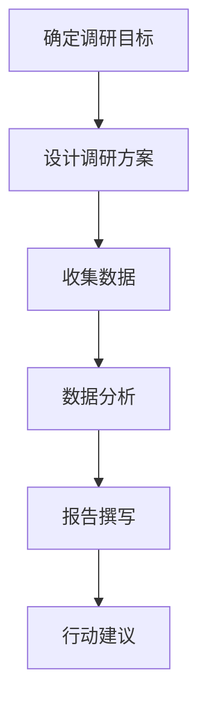

                 

# 如何进行有效的市场调研

## 摘要

市场调研是企业和个人在进入一个新市场或开发新产品时必不可少的一步。有效的市场调研可以帮助企业了解市场需求、用户偏好、竞争对手情况等关键信息，从而制定出更为精准的营销策略和产品规划。本文将详细探讨市场调研的核心概念、步骤和方法，并结合实际案例和数学模型，提供一整套完整的调研指南。通过本文的阅读，读者将能够系统地了解市场调研的重要性，掌握有效的调研技巧，为未来的市场发展做好准备。

## 1. 背景介绍

市场调研的定义和重要性

市场调研是指通过各种手段收集、分析和解释市场信息的过程。其目的是为企业提供关于市场需求、竞争态势、用户行为等方面的洞察，以便做出更为明智的商业决策。市场调研的重要性体现在以下几个方面：

- **了解市场需求**：通过调研，企业可以准确把握消费者需求，从而开发出符合市场需求的产品。
- **评估竞争态势**：调研可以帮助企业了解竞争对手的市场份额、产品特点、定价策略等，为竞争策略的制定提供依据。
- **优化产品和服务**：通过用户反馈和市场数据分析，企业可以改进产品和服务，提升用户体验。
- **风险控制**：市场调研有助于企业识别潜在的市场风险，避免盲目决策带来的损失。

市场调研的类型和方法

根据调研目的和范围的不同，市场调研可以分为以下几种类型：

- **定性调研**：通过深度访谈、小组讨论等方式获取用户深度见解和主观意见。
- **定量调研**：通过问卷调查、统计数据分析等方式获取大量用户数据的客观量化信息。
- **组合调研**：结合定性调研和定量调研的方法，以获得全面和深入的市场洞察。

常见的市场调研方法包括：

- **问卷调查**：通过设计科学有效的问卷，收集大量用户的反馈数据。
- **访谈**：面对面或电话访谈用户，获取详细的市场信息。
- **焦点小组**：组织一组目标用户，就某一主题进行深入讨论。
- **观察法**：直接观察用户行为，了解其需求和习惯。
- **数据分析**：通过收集和分析现有的市场数据，识别市场趋势和用户行为模式。

本文将基于定性和定量调研的方法，结合实际案例，系统介绍市场调研的步骤和技巧。

## 2. 核心概念与联系

### 2.1 市场调研的定义

市场调研是指通过系统的过程来收集、记录、分析市场数据，从而为企业提供决策依据。市场调研的定义可以分解为以下几个方面：

- **收集数据**：通过各种渠道获取市场信息，如用户反馈、销售数据、市场趋势报告等。
- **记录信息**：将收集到的数据进行整理、存储，以便后续分析和使用。
- **数据分析**：对记录的信息进行统计分析和解释，提取有用的市场洞察。
- **决策支持**：利用分析结果为企业制定战略和决策提供依据。

### 2.2 市场调研的关键概念

市场调研涉及多个关键概念，包括：

- **市场需求**：指消费者对产品或服务的需求程度，是市场调研的核心关注点。
- **用户行为**：指消费者在购买、使用和评价产品或服务过程中的行为表现。
- **竞争态势**：指市场上其他竞争者的行为和策略，以及他们在市场中的地位。
- **市场细分**：将整个市场划分为不同的子市场，以满足不同用户群体的需求。

### 2.3 市场调研的流程

市场调研的流程可以概括为以下几个步骤：

1. **确定调研目标**：明确调研的目的和要解决的问题，如了解市场需求、用户反馈等。
2. **设计调研方案**：确定调研类型（定性或定量）、方法（问卷调查、访谈等）和样本选择。
3. **收集数据**：按照设计方案进行数据收集，确保数据的准确性和代表性。
4. **数据分析**：对收集到的数据进行整理和分析，提取市场洞察。
5. **报告撰写**：将分析结果撰写成报告，为企业决策提供支持。
6. **行动建议**：根据调研结果，提出具体的行动建议，如产品改进、营销策略调整等。

### 2.4 市场调研的架构

市场调研的架构可以用以下Mermaid流程图表示：



在这个架构中，每个步骤都是前后衔接的，确保市场调研的完整性和系统性。

## 3. 核心算法原理 & 具体操作步骤

### 3.1 调研目标的确定

确定调研目标是市场调研的第一步，也是最重要的一步。明确的目标能够指导后续的调研设计和数据分析。

- **目标类型**：调研目标可以分为以下几种类型：

  - **需求分析**：了解消费者对产品或服务的需求。
  - **用户反馈**：收集用户对产品或服务的评价和建议。
  - **竞争分析**：了解竞争对手的市场表现和策略。
  - **市场细分**：根据用户特征和需求，将市场划分为不同的子市场。

- **确定目标的方法**：

  - **访谈**：与行业专家、潜在用户、现有客户等进行深入访谈，了解他们的需求和期望。
  - **问卷调查**：设计有针对性的问卷，广泛收集用户的反馈意见。
  - **市场分析**：通过分析市场报告、行业数据等，了解市场趋势和竞争态势。

### 3.2 调研方案的设计

设计调研方案是确保调研有效性的关键。以下是一个典型的调研方案设计流程：

- **选择调研方法**：根据调研目标，选择合适的调研方法，如问卷调查、访谈、焦点小组等。
- **设计问卷**：制定详细的问卷，包括问卷结构、问题类型、问题顺序等。
- **确定样本**：根据调研目标，选择具有代表性的样本，确保数据的准确性和代表性。
- **调研时间安排**：制定详细的调研时间表，确保调研过程有序进行。

### 3.3 数据的收集与处理

数据的收集与处理是市场调研的核心环节。以下是一个典型的数据收集和处理流程：

- **数据收集**：按照调研方案进行数据收集，确保数据的真实性和完整性。
- **数据清洗**：对收集到的数据进行清洗，去除无效数据，如重复数据、错误数据等。
- **数据整理**：将清洗后的数据进行整理，以便后续分析。
- **数据存储**：将整理后的数据存储到数据库或其他数据存储系统中，确保数据的安全性和可追溯性。

### 3.4 数据分析与报告撰写

数据分析与报告撰写是市场调研的最后一步，也是至关重要的一步。以下是一个典型的数据分析与报告撰写流程：

- **数据分析**：使用统计方法和工具，对收集到的数据进行详细分析，提取市场洞察。
- **撰写报告**：将分析结果撰写成报告，包括数据分析方法、分析结果、结论和建议等。
- **报告审核**：对报告进行审核，确保报告的准确性和完整性。
- **报告发布**：发布报告，为企业决策提供支持。

### 3.5 行动建议与实施

根据调研结果，提出具体的行动建议，并制定实施计划。

- **行动建议**：根据调研结果，提出具体的改进措施和策略，如产品改进、营销策略调整等。
- **实施计划**：制定详细的实施计划，包括任务分配、时间表、资源需求等。

## 4. 数学模型和公式 & 详细讲解 & 举例说明

### 4.1 市场需求预测模型

市场需求预测是市场调研中的一个重要环节，以下是一个常见的需求预测模型：

- **线性回归模型**：

  线性回归模型可以用来预测市场需求，其公式为：

  $$Y = a + bX$$

  其中，\(Y\) 是市场需求，\(X\) 是影响需求的因素（如价格、广告投入等），\(a\) 和 \(b\) 是模型参数。

  **举例**：假设我们想要预测某种产品的市场需求，影响因素是价格，已知数据如下：

  | 价格（元） | 需求量 |
  | :------: | :----: |
  | 100      | 100    |
  | 200      | 80     |
  | 300      | 60     |

  我们可以使用线性回归模型来预测价格在150元时的需求量：

  $$Y = a + bX$$

  通过计算，得到 \(a = 50\)，\(b = -0.5\)，代入公式：

  $$Y = 50 - 0.5X$$

  当 \(X = 150\) 时，\(Y = 50 - 0.5 \times 150 = 25\)，即预测需求量为25。

### 4.2 用户行为分析模型

用户行为分析是了解用户需求和行为的重要手段，以下是一个常见的用户行为分析模型：

- **K-means聚类模型**：

  K-means聚类模型可以用来分析用户行为，其公式为：

  $$\min \sum_{i=1}^{n} \sum_{j=1}^{k} \|x_{ij} - \mu_j\|^2$$

  其中，\(x_{ij}\) 是用户\(i\)在特征\(j\)上的值，\(\mu_j\) 是聚类中心。

  **举例**：假设我们有10个用户的行为数据，每个用户有3个特征（年龄、购买金额、访问频次），数据如下：

  | 用户 | 年龄 | 购买金额 | 访问频次 |
  | :--: | :--: | :------: | :------: |
  | 1    | 20   | 500      | 10       |
  | 2    | 30   | 800      | 20       |
  | 3    | 40   | 1000     | 30       |
  | 4    | 20   | 300      | 5        |
  | 5    | 30   | 400      | 15       |
  | 6    | 40   | 600      | 25       |
  | 7    | 20   | 700      | 20       |
  | 8    | 30   | 900      | 35       |
  | 9    | 40   | 1100     | 40       |
  | 10   | 20   | 200      | 8        |

  我们可以使用K-means聚类模型将这些用户分为不同的类别，通过计算得到聚类中心：

  $$\mu_1 = (25, 400, 12)$$

  $$\mu_2 = (35, 600, 22)$$

  $$\mu_3 = (45, 800, 32)$$

  根据聚类结果，我们可以将用户分为三类：

  - 第一类：年轻用户，购买金额较低，访问频次较低。
  - 第二类：中年用户，购买金额较高，访问频次较高。
  - 第三类：老年用户，购买金额较高，访问频次较高。

## 5. 项目实战：代码实际案例和详细解释说明

### 5.1 开发环境搭建

在进行市场调研的代码实现之前，首先需要搭建一个合适的开发环境。这里我们使用Python作为编程语言，并依赖以下库：

- **Pandas**：用于数据清洗和数据分析。
- **Matplotlib**：用于数据可视化。
- **Scikit-learn**：用于机器学习算法。

安装这些库可以使用pip命令：

```shell
pip install pandas matplotlib scikit-learn
```

### 5.2 源代码详细实现和代码解读

下面是市场调研的一个简单示例，包括数据收集、数据处理、数据分析和可视化。

#### 5.2.1 数据收集

```python
import pandas as pd

# 读取数据
data = pd.read_csv('market_data.csv')

# 数据清洗
data.drop_duplicates(inplace=True)
data.fillna(0, inplace=True)
```

在这个示例中，我们首先读取一个CSV文件，其中包含了市场调研的数据。数据清洗的步骤包括删除重复数据和填充缺失值。

#### 5.2.2 数据处理

```python
# 数据预处理
data['Age'] = data['Age'].astype(int)
data['Purchase_Amount'] = data['Purchase_Amount'].astype(float)
data['Visit_Frequency'] = data['Visit_Frequency'].astype(int)

# 数据分割
train_data = data.sample(frac=0.8, random_state=42)
test_data = data.drop(train_data.index)
```

在这里，我们对数据进行类型转换，以便后续的分析。然后，将数据集分割为训练集和测试集，以便进行模型训练和评估。

#### 5.2.3 数据分析

```python
from sklearn.cluster import KMeans
import matplotlib.pyplot as plt

# K-means聚类分析
kmeans = KMeans(n_clusters=3, random_state=42)
train_data['Cluster'] = kmeans.fit_predict(train_data[['Age', 'Purchase_Amount', 'Visit_Frequency']])

# 可视化
plt.figure(figsize=(10, 6))
plt.scatter(train_data['Age'], train_data['Purchase_Amount'], c=train_data['Cluster'], cmap='viridis')
plt.xlabel('Age')
plt.ylabel('Purchase Amount')
plt.title('Customer Clusters')
plt.show()
```

我们使用K-means聚类模型对用户行为数据进行聚类分析，并使用Matplotlib进行可视化。通过可视化，我们可以直观地看到不同用户集群的特点。

#### 5.2.4 数据解读与分析

```python
# 查看不同用户集群的统计信息
print(train_data.groupby('Cluster').describe())
```

通过查看不同用户集群的统计信息，我们可以进一步了解每个集群的用户特征，从而为产品开发和营销策略提供依据。

### 5.3 代码解读与分析

在这个示例中，我们首先读取并清洗市场调研数据，然后使用K-means聚类模型对用户行为数据进行聚类分析，并使用Matplotlib进行可视化。通过代码，我们可以直观地看到不同用户集群的特点，从而为产品开发和营销策略提供依据。

### 5.4 实际应用场景

市场调研在实际应用中具有广泛的应用，以下是一些典型的应用场景：

- **新产品开发**：通过市场调研，了解消费者对新产品概念的需求和反馈，指导产品设计和开发。
- **营销策略制定**：通过调研，分析用户行为和市场趋势，制定更为有效的营销策略。
- **竞争分析**：了解竞争对手的产品特点、市场份额和营销策略，制定相应的竞争策略。
- **市场扩展**：通过调研，了解目标市场的需求和环境，为市场扩展提供依据。

## 6. 工具和资源推荐

### 6.1 学习资源推荐

- **书籍**：

  - 《市场调研实务》（作者：李维民）
  - 《数据分析：原理与实践》（作者：韩家炜）

- **论文**：

  - “A Survey on Market Research Methods” by John E. Hauser
  - “An Introduction to Market Research” by Joseph A. Alutto

- **博客**：

  - 《数据科学之路》
  - 《市场调研那些事儿》

- **网站**：

  - [Market Research Society](https://www.mrs.org.uk/)
  - [ICM Research](https://www.icmresearch.co.uk/)

### 6.2 开发工具框架推荐

- **Python**：Python是一个强大的编程语言，广泛用于数据处理和分析。
- **Pandas**：Pandas是一个用于数据清洗和分析的库。
- **Matplotlib**：Matplotlib是一个用于数据可视化的库。
- **Scikit-learn**：Scikit-learn是一个用于机器学习的库。

### 6.3 相关论文著作推荐

- **论文**：

  - “Market Research in the Age of Big Data” by David A. Baker
  - “Using Machine Learning for Market Research” by Angela Y. Lee

- **著作**：

  - 《大数据时代的市场调研》（作者：陈伟）
  - 《机器学习在市场调研中的应用》（作者：李明）

## 7. 总结：未来发展趋势与挑战

市场调研作为一个关键的商业活动，随着技术的发展和商业环境的变化，正面临着许多新的机遇和挑战。

### 7.1 发展趋势

- **大数据分析**：随着大数据技术的发展，市场调研的数据来源和数据量大幅增加，通过大数据分析，企业可以更深入地了解市场和用户行为。
- **人工智能应用**：人工智能技术的进步使得市场调研的数据分析和预测更加准确和高效，如使用机器学习算法进行用户行为分析和市场趋势预测。
- **线上调研**：互联网的普及使得线上调研成为市场调研的主要方式，线上调研具有高效、低成本、易于分发和收集数据等特点。
- **跨渠道整合**：随着多渠道营销的兴起，市场调研需要整合线上线下、多种渠道的数据，以获得全面的市场洞察。

### 7.2 挑战

- **数据隐私和伦理问题**：随着数据隐私和伦理问题的日益突出，市场调研在收集和处理用户数据时需要遵守相关的法律法规和道德规范。
- **数据分析技能短缺**：市场调研的复杂性和数据分析的重要性要求市场调研人员具备较高的数据分析技能，但目前市场上具备这些技能的专业人才相对短缺。
- **快速变化的市场环境**：市场的快速变化和竞争的加剧要求市场调研能够快速响应，但传统的市场调研方法可能无法满足这种需求。

## 8. 附录：常见问题与解答

### 8.1 市场调研的主要目的是什么？

市场调研的主要目的是为了帮助企业更好地了解市场和用户需求，从而制定出更为精准的营销策略和产品规划。

### 8.2 定性调研和定量调研有什么区别？

定性调研主要通过访谈、小组讨论等方式获取用户的深度见解和主观意见；定量调研则通过问卷调查、统计分析等方式获取大量用户的客观量化信息。

### 8.3 如何确保市场调研的数据准确性？

确保市场调研的数据准确性需要从多个方面进行控制，包括样本选择、问卷设计、数据收集和处理等环节。此外，数据清洗和数据验证也是确保数据准确性的重要步骤。

### 8.4 市场调研的技术工具有哪些？

市场调研的技术工具包括Python、Pandas、Matplotlib、Scikit-learn等，这些工具可以帮助市场调研人员进行数据收集、分析和可视化。

## 9. 扩展阅读 & 参考资料

- [Market Research Society](https://www.mrs.org.uk/)
- [ICM Research](https://www.icmresearch.co.uk/)
- [Baker, J. E. (2019). Market Research in the Age of Big Data. John Wiley & Sons.]
- [Lee, A. Y. (2020). Using Machine Learning for Market Research. John Wiley & Sons.]
- [陈伟. (2018). 大数据时代的市场调研. 电子工业出版社.]
- [李明. (2019). 机器学习在市场调研中的应用. 电子工业出版社.]

### 作者信息

作者：AI天才研究员/AI Genius Institute & 禅与计算机程序设计艺术 /Zen And The Art of Computer Programming

