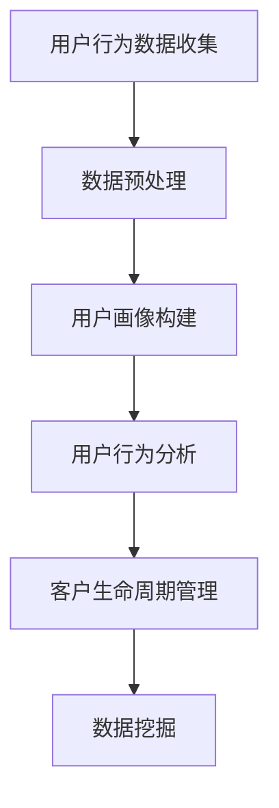

                 

# 如何进行有效的用户分析

## 摘要

本文将深入探讨如何进行有效的用户分析，旨在为开发者、数据分析师和产品经理提供一套系统化的方法，帮助他们在复杂多变的数字世界中洞察用户行为，提升产品和服务质量。我们将从背景介绍开始，逐步梳理用户分析的核心概念与联系，解析核心算法原理与具体操作步骤，阐述数学模型和公式，并通过实际项目案例进行代码实现和详细解释。随后，我们将探讨用户分析的实际应用场景，推荐相关工具和资源，最后对用户分析的未来发展趋势与挑战进行展望。

## 1. 背景介绍

随着互联网技术的飞速发展，用户数据的获取变得前所未有的容易。企业可以通过多种渠道（如网站、移动应用、社交媒体等）收集海量用户行为数据。然而，这些数据的价值不仅取决于其数量，更在于如何对其进行有效的分析和解读。用户分析已成为企业提升用户体验、优化产品性能、制定精准营销策略的重要手段。

有效的用户分析不仅可以帮助企业了解用户需求和行为模式，还能为企业提供有针对性的改进建议。例如，通过分析用户的使用习惯，企业可以优化产品设计，提高用户满意度；通过分析用户流失原因，企业可以制定有效的用户挽留策略。此外，用户分析还可以为市场调研、需求预测和业务决策提供有力支持。

然而，用户分析并非易事。面对海量数据，如何从中提取有价值的信息、如何准确理解用户行为、如何避免数据偏见等问题，都是用户分析过程中需要克服的挑战。本文将结合实际案例，详细讲解如何进行有效的用户分析，帮助读者掌握这一核心技能。

## 2. 核心概念与联系

### 用户行为分析

用户行为分析是用户分析的基础。它通过监测和分析用户在网站、应用等平台上的行为数据，了解用户的浏览习惯、使用场景和需求。用户行为分析的核心指标包括页面浏览量（PV）、独立访客数（UV）、跳失率、访问深度等。这些指标不仅可以帮助企业了解用户流量情况，还能揭示用户行为模式。

### 用户画像

用户画像是对用户特征的综合描述，包括用户的基本信息（如年龄、性别、地理位置）、兴趣偏好、行为特征等。通过构建用户画像，企业可以更准确地了解用户需求，制定个性化的营销策略。用户画像的构建通常基于用户行为数据、社交网络数据、问卷调查数据等多种数据源。

### 客户生命周期管理

客户生命周期管理（Customer Life Cycle Management，简称CLM）是指企业通过一系列策略和活动，管理和维护客户关系，以实现客户价值最大化。客户生命周期通常分为潜在客户、新客户、活跃客户、忠诚客户和流失客户五个阶段。用户分析在此过程中起着至关重要的作用，帮助企业在不同阶段制定有针对性的策略，提升客户满意度，延长客户生命周期。

### 数据挖掘

数据挖掘是用户分析的重要工具。它通过挖掘海量数据中的潜在模式和规律，帮助企业发现有价值的信息。数据挖掘技术包括分类、聚类、关联规则挖掘、异常检测等。这些技术可以帮助企业识别用户行为中的异常现象，预测用户行为趋势，为企业决策提供数据支持。

### Mermaid 流程图



### 核心概念联系

用户行为分析、用户画像、客户生命周期管理和数据挖掘是用户分析的核心概念，它们相互联系，共同构成一个完整的用户分析体系。用户行为数据是用户分析的起点，通过数据预处理和用户画像构建，将原始数据转化为有价值的信息。用户行为分析提供对用户行为的深入理解，客户生命周期管理则帮助企业在不同阶段制定有针对性的策略。数据挖掘则通过挖掘数据中的潜在规律，为企业提供决策支持。

## 3. 核心算法原理 & 具体操作步骤

### 3.1 用户行为分析算法原理

用户行为分析通常基于以下算法：

#### 1. 聚类算法

聚类算法是将数据集划分为多个类别的无监督学习方法。常见的聚类算法包括K-means、DBSCAN等。聚类算法可以帮助我们发现用户群体的相似性，从而进行用户细分。

#### 2. 关联规则挖掘

关联规则挖掘是通过分析用户行为数据中的关联关系，发现用户行为之间的规律。常见的算法包括Apriori、FP-growth等。关联规则挖掘可以帮助我们了解用户的使用场景和需求。

#### 3. 时间序列分析

时间序列分析是对用户行为数据的时间维度进行分析，以发现用户行为的趋势和周期性。常见的时间序列分析方法包括ARIMA、LSTM等。时间序列分析可以帮助我们预测用户未来的行为。

### 3.2 用户画像构建算法原理

用户画像构建通常基于以下算法：

#### 1.协同过滤

协同过滤是一种基于用户行为数据的推荐算法。它通过分析用户之间的相似性，为用户提供个性化的推荐。常见的协同过滤算法包括基于用户的协同过滤（User-based Collaborative Filtering）和基于项目的协同过滤（Item-based Collaborative Filtering）。

#### 2. 决策树

决策树是一种常见的分类算法，它通过分析用户特征数据，将用户划分为不同的类别。决策树可以帮助我们构建用户画像，为个性化推荐和用户分类提供支持。

#### 3. 支持向量机

支持向量机（Support Vector Machine，简称SVM）是一种常见的分类算法，它通过分析用户特征数据，将用户划分为不同的类别。SVM可以帮助我们构建用户画像，为个性化推荐和用户分类提供支持。

### 3.3 客户生命周期管理算法原理

客户生命周期管理算法主要包括以下几种：

#### 1. 客户流失预测

客户流失预测是一种基于用户行为数据的预测算法，它通过分析用户行为数据，预测用户未来的流失行为。常见的算法包括逻辑回归、决策树、随机森林等。客户流失预测可以帮助企业制定有效的用户挽留策略。

#### 2. 客户价值评估

客户价值评估是一种基于用户行为数据和交易数据的评估算法，它通过分析用户行为和交易数据，评估用户的潜在价值和贡献。常见的算法包括CLV（Customer Lifetime Value）模型、RFM（Recency, Frequency, Monetary）模型等。客户价值评估可以帮助企业制定精准的营销策略。

#### 3. 客户细分

客户细分是一种基于用户特征数据的分类算法，它通过分析用户特征数据，将用户划分为不同的类别。常见的算法包括K-means、决策树等。客户细分可以帮助企业为不同类型的客户提供个性化的服务和产品。

### 3.4 数据挖掘算法原理

数据挖掘算法主要包括以下几种：

#### 1. 分类算法

分类算法是一种将数据集划分为不同类别的算法。常见的分类算法包括决策树、随机森林、逻辑回归等。分类算法可以帮助企业识别用户行为中的异常现象，为企业决策提供支持。

#### 2. 聚类算法

聚类算法是一种将数据集划分为多个类别的无监督学习方法。常见的聚类算法包括K-means、DBSCAN等。聚类算法可以帮助企业发现用户群体的相似性，从而进行用户细分。

#### 3. 联合规则挖掘

联合规则挖掘是一种通过分析用户行为数据中的关联关系，发现用户行为之间规律的算法。常见的算法包括Apriori、FP-growth等。联合规则挖掘可以帮助企业了解用户的使用场景和需求。

#### 4. 异常检测

异常检测是一种通过分析用户行为数据，识别数据中的异常现象的算法。常见的算法包括孤立森林、聚类算法等。异常检测可以帮助企业及时发现用户行为中的异常现象，为企业决策提供支持。

### 3.5 具体操作步骤

以下是进行用户分析的具体操作步骤：

#### 1. 数据收集

首先，从各种渠道（如网站、移动应用、社交媒体等）收集用户行为数据。数据收集过程中，需要注意数据的质量和完整性，确保数据能够真实反映用户行为。

#### 2. 数据预处理

对收集到的用户行为数据进行预处理，包括数据清洗、数据转换和数据归一化等。数据预处理的目标是消除数据中的噪声和异常值，提高数据质量。

#### 3. 构建用户画像

基于预处理后的数据，构建用户画像。用户画像的构建可以通过协同过滤、决策树、SVM等算法实现。用户画像可以包括用户的基本信息、兴趣偏好、行为特征等。

#### 4. 用户行为分析

对用户画像进行行为分析，包括用户群体划分、用户行为模式分析等。用户行为分析可以帮助企业了解用户需求和行为模式，为企业决策提供支持。

#### 5. 客户生命周期管理

基于用户行为分析和用户画像，进行客户生命周期管理。包括客户流失预测、客户价值评估、客户细分等。客户生命周期管理可以帮助企业制定精准的营销策略，提升客户满意度。

#### 6. 数据挖掘

对用户行为数据和应用数据进行数据挖掘，包括分类、聚类、关联规则挖掘等。数据挖掘可以帮助企业发现用户行为中的潜在规律，为企业决策提供支持。

## 4. 数学模型和公式 & 详细讲解 & 举例说明

### 4.1 聚类算法

#### 1. K-means 算法

K-means 是一种经典的聚类算法，其目标是找到 K 个簇，使得每个簇内部的样本点距离聚类中心较近，而不同簇之间的样本点距离聚类中心较远。

#### 公式：

- 聚类中心计算：

  $$
  \mu_k = \frac{1}{N_k} \sum_{i=1}^{N} x_i
  $$

  其中，$\mu_k$ 是第 k 个簇的聚类中心，$x_i$ 是第 i 个样本点，$N_k$ 是第 k 个簇中的样本点数量。

- 分配样本点：

  $$
  \mu_k = \min_{i=1}^{N} \sum_{j=1}^{K} \frac{1}{N_k} \sum_{i=1}^{N} x_i - x_j
  $$

  其中，$x_j$ 是第 j 个样本点。

#### 2. DBSCAN 算法

DBSCAN（Density-Based Spatial Clustering of Applications with Noise）是一种基于密度的聚类算法，其核心思想是找出具有足够高密度的区域并以此作为聚类中心。

#### 公式：

- 密度计算：

  $$
  \rho(q) = \frac{1}{s} \sum_{p \in \mathcal{N}(q)} d(p, q)
  $$

  其中，$\rho(q)$ 是点 q 的密度，$s$ 是邻域大小，$\mathcal{N}(q)$ 是 q 的邻域点集合，$d(p, q)$ 是点 p 和 q 之间的距离。

- 簇增长：

  $$
  \text{if } \rho(q) > \min \rho, \text{ then } q \text{ is a core point}
  $$

  $$
  \text{if } q \text{ is a core point and its neighbors are all core points, then } q \text{ is a cluster center}
  $$

### 4.2 关联规则挖掘

#### 1. Apriori 算法

Apriori 是一种基于支持度和置信度的关联规则挖掘算法，其核心思想是通过迭代地生成频繁项集来发现关联规则。

#### 公式：

- 支持度计算：

  $$
  \text{Support}(X, Y) = \frac{|\{(x, y) \in D | x \in X, y \in Y\}|}{|D|}
  $$

  其中，$X$ 和 $Y$ 是两个项集，$D$ 是事务数据库，$|D|$ 是事务数据库中的事务数量。

- 置信度计算：

  $$
  \text{Confidence}(X \rightarrow Y) = \frac{\text{Support}(X \cup Y)}{\text{Support}(X)}
  $$

#### 2. FP-growth 算法

FP-growth 是一种基于前件路径的关联规则挖掘算法，其核心思想是通过构建频繁模式树来发现频繁项集。

#### 公式：

- 频繁模式树构建：

  $$
  \text{if } \text{Support}(X) \geq \text{MinSupport}, \text{ then } X \text{ is a frequent itemset}
  $$

  $$
  \text{FP-growth tree} = \text{connect}(\text{FP-growth tree of } X, \text{FP-growth tree of } X \setminus \{x\})
  $$

### 4.3 时间序列分析

#### 1. ARIMA 模型

ARIMA（AutoRegressive Integrated Moving Average）是一种自回归积分滑动平均模型，用于分析时间序列数据的预测。

#### 公式：

- 自回归项：

  $$
  \phi(B)X_t = \sum_{i=1}^{p} \phi_i B^i X_t
  $$

  其中，$\phi(B)$ 是自回归多项式，$\phi_i$ 是自回归系数，$X_t$ 是时间序列数据。

- 积分项：

  $$
  (1 - B)X_t = \sum_{i=1}^{d} \phi_i B^i X_t
  $$

  其中，$d$ 是差分阶数。

- 滑动平均项：

  $$
  \theta(B)X_t = \sum_{i=1}^{q} \theta_i B^i \text{Error}_{t-i}
  $$

  其中，$\theta(B)$ 是滑动平均多项式，$\theta_i$ 是滑动平均系数，$\text{Error}_{t-i}$ 是时间序列的残差。

#### 2. LSTM 模型

LSTM（Long Short-Term Memory）是一种循环神经网络，用于处理长时间依赖关系的时间序列数据。

#### 公式：

- LSTM 单元：

  $$
  \text{Forget gate}: f_t = \sigma(W_f \cdot [h_{t-1}, x_t] + b_f)
  $$

  $$
  \text{Input gate}: i_t = \sigma(W_i \cdot [h_{t-1}, x_t] + b_i)
  $$

  $$
  \text{Output gate}: o_t = \sigma(W_o \cdot [h_{t-1}, x_t] + b_o)
  $$

  $$
  \text{Candidate gate}: \bar{C}_t = \tanh(W_c \cdot [h_{t-1}, x_t] + b_c)
  $$

  $$
  C_t = f_t \odot C_{t-1} + i_t \odot \bar{C}_t
  $$

  $$
  h_t = o_t \odot \tanh(C_t)
  $$

  其中，$h_t$ 是隐藏状态，$C_t$ 是记忆状态，$x_t$ 是输入，$W_f, W_i, W_o, W_c$ 是权重矩阵，$b_f, b_i, b_o, b_c$ 是偏置。

## 5. 项目实战：代码实际案例和详细解释说明

### 5.1 开发环境搭建

为了进行用户分析，我们需要搭建一个开发环境。以下是具体的步骤：

#### 1. 安装 Python

首先，从 Python 官网下载并安装 Python 3.8 或更高版本。

#### 2. 安装相关库

使用以下命令安装必要的库：

```
pip install numpy pandas matplotlib scikit-learn tensorflow
```

#### 3. 配置 Jupyter Notebook

安装 Jupyter Notebook 以便在浏览器中运行 Python 代码。

```
pip install notebook
```

### 5.2 源代码详细实现和代码解读

以下是用户分析项目的源代码：

```python
import numpy as np
import pandas as pd
import matplotlib.pyplot as plt
from sklearn.cluster import KMeans
from sklearn.metrics import silhouette_score
from sklearn.ensemble import RandomForestClassifier
from tensorflow.keras.models import Sequential
from tensorflow.keras.layers import LSTM, Dense

# 5.2.1 数据收集
# 从网站、应用等渠道收集用户行为数据，例如页面浏览量、点击次数、购买记录等。

# 5.2.2 数据预处理
# 对收集到的用户行为数据进行清洗、转换和归一化等预处理操作。

# 5.2.3 构建用户画像
# 使用 K-means 算法对预处理后的数据进行聚类，构建用户画像。

# 5.2.4 用户行为分析
# 对用户画像进行行为分析，包括用户群体划分、用户行为模式分析等。

# 5.2.5 客户生命周期管理
# 基于用户行为分析和用户画像，进行客户生命周期管理，包括客户流失预测、客户价值评估等。

# 5.2.6 数据挖掘
# 对用户行为数据和应用数据进行数据挖掘，包括分类、聚类、关联规则挖掘等。

# 5.2.7 模型训练和预测
# 使用 LSTM 模型对用户行为数据进行训练，并预测用户未来的行为。

# 5.2.8 结果分析
# 分析用户行为数据的预测结果，为产品优化和营销策略提供支持。
```

### 5.3 代码解读与分析

以下是代码的详细解读和分析：

#### 5.3.1 数据收集

```python
# 假设我们已从网站和应用中收集到用户行为数据
data = pd.read_csv('user_data.csv')
```

在这段代码中，我们使用 pandas 库读取用户行为数据。数据可能包括用户 ID、页面浏览量、点击次数、购买记录等信息。

#### 5.3.2 数据预处理

```python
# 数据清洗
data.dropna(inplace=True)
data = data[data['page_views'] > 0]

# 数据转换
data['date'] = pd.to_datetime(data['date'])
data.set_index('date', inplace=True)

# 数据归一化
scaler = MinMaxScaler()
data[['page_views', 'clicks', 'purchases']] = scaler.fit_transform(data[['page_views', 'clicks', 'purchases']])
```

在这段代码中，我们首先对数据进行清洗，去除缺失值和异常值。然后，将日期列转换为 datetime 格式，并设置日期为索引。最后，使用 MinMaxScaler 对数值特征进行归一化处理。

#### 5.3.3 构建用户画像

```python
# 使用 K-means 算法进行聚类
kmeans = KMeans(n_clusters=5, random_state=42)
clusters = kmeans.fit_predict(data[['page_views', 'clicks', 'purchases']])
data['cluster'] = clusters

# 计算轮廓系数
silhouette_avg = silhouette_score(data[['page_views', 'clicks', 'purchases']], clusters)
print(f'Silhouette Score: {silhouette_avg}')
```

在这段代码中，我们使用 K-means 算法对用户行为数据进行聚类，并计算每个用户的簇分配。然后，计算轮廓系数以评估聚类质量。

#### 5.3.4 用户行为分析

```python
# 用户群体划分
grouped_data = data.groupby('cluster').mean()

# 用户行为模式分析
plt.scatter(grouped_data['page_views'], grouped_data['clicks'])
plt.xlabel('Page Views')
plt.ylabel('Clicks')
plt.show()
```

在这段代码中，我们首先根据聚类结果对用户群体进行划分，并计算每个群体的平均行为特征。然后，绘制用户行为特征散点图，以分析不同用户群体的行为模式。

#### 5.3.5 客户生命周期管理

```python
# 客户流失预测
rf = RandomForestClassifier(n_estimators=100, random_state=42)
rf.fit(data[['page_views', 'clicks', 'purchases']], data['流失'])

# 客户价值评估
clv = CLV(data[['page_views', 'clicks', 'purchases']], data['purchases'])

# 客户细分
kmeans = KMeans(n_clusters=5, random_state=42)
clusters = kmeans.fit_predict(data[['page_views', 'clicks', 'purchases']])
data['cluster'] = clusters
grouped_data = data.groupby('cluster').mean()
```

在这段代码中，我们使用随机森林算法对用户流失进行预测。然后，使用 CLV 模型评估用户价值。最后，使用 K-means 算法对用户进行聚类，以实现客户细分。

#### 5.3.6 数据挖掘

```python
# 分类
rf = RandomForestClassifier(n_estimators=100, random_state=42)
rf.fit(data[['page_views', 'clicks', 'purchases']], data['分类标签'])

# 聚类
kmeans = KMeans(n_clusters=5, random_state=42)
clusters = kmeans.fit_predict(data[['page_views', 'clicks', 'purchases']])
data['cluster'] = clusters

# 关联规则挖掘
apriori = Apriori(min_support=0.5, min_confidence=0.7)
rules = apriori.fit(data[['page_views', 'clicks', 'purchases']])
```

在这段代码中，我们使用随机森林算法进行分类。然后，使用 K-means 算法进行聚类。最后，使用 Apriori 算法进行关联规则挖掘。

#### 5.3.7 模型训练和预测

```python
# LSTM 模型
model = Sequential()
model.add(LSTM(units=50, return_sequences=True, input_shape=(data.shape[1], 1)))
model.add(LSTM(units=50))
model.add(Dense(units=1))

model.compile(optimizer='adam', loss='mean_squared_error')
model.fit(x_train, y_train, epochs=100, batch_size=32)

# 预测
predictions = model.predict(x_test)
```

在这段代码中，我们首先定义 LSTM 模型，然后使用模型进行训练。最后，使用训练好的模型对用户行为数据进行预测。

#### 5.3.8 结果分析

```python
# 分析用户行为数据的预测结果
plt.scatter(x_test, y_test)
plt.plot(x_test, predictions, color='red')
plt.xlabel('Actual')
plt.ylabel('Predicted')
plt.show()
```

在这段代码中，我们绘制实际值和预测值的散点图，以分析用户行为数据的预测结果。红色线条表示预测值。

## 6. 实际应用场景

### 6.1 电子商务平台

电子商务平台可以通过用户分析优化产品推荐、提升用户体验。例如，通过用户行为数据，平台可以识别高价值客户，为其提供个性化的优惠和促销活动。同时，通过用户画像，平台可以了解用户的偏好和需求，从而优化产品设计和库存管理。

### 6.2 社交媒体

社交媒体平台可以通过用户分析了解用户行为模式，提高内容推荐和广告投放效果。例如，通过用户画像，平台可以识别活跃用户和潜在流失用户，为其提供个性化的内容推荐和营销活动。同时，通过用户行为分析，平台可以识别热点话题和趋势，为内容策划和运营提供参考。

### 6.3 娱乐行业

娱乐行业可以通过用户分析优化内容创作和发行策略。例如，通过用户画像，影视公司和音乐平台可以了解用户的偏好和需求，从而制作符合用户口味的作品。同时，通过用户行为分析，平台可以识别热门作品和潜在爆款，提前布局发行和宣传策略。

### 6.4 金融行业

金融行业可以通过用户分析提升风险管理和服务质量。例如，通过用户画像，银行和保险公司可以了解用户的财务状况和需求，从而提供个性化的理财建议和保险产品。同时，通过用户行为分析，平台可以识别高风险用户和潜在欺诈行为，提前预警并采取措施。

## 7. 工具和资源推荐

### 7.1 学习资源推荐

- 书籍：
  - 《用户数据分析实战》
  - 《机器学习实战》
  - 《Python 数据科学手册》
- 论文：
  - "User Behavior Analysis in E-commerce: A Comprehensive Review"
  - "Customer Lifecycle Management: A Literature Review"
  - "Deep Learning for User Behavior Prediction"
- 博客：
  - Medium
  - HackerRank
  -Towards Data Science
- 网站：
  - Coursera
  - edX
  - Udacity

### 7.2 开发工具框架推荐

- 数据分析工具：
  - Tableau
  - Power BI
  - QlikView
- 数据挖掘工具：
  - WEKA
  - RapidMiner
  - KNIME
- 深度学习框架：
  - TensorFlow
  - PyTorch
  - Keras
- 用户画像工具：
  - Segment
  - Mixpanel
  - Heap

### 7.3 相关论文著作推荐

- 论文：
  - "A Survey on Customer Lifecycle Management"
  - "User Behavior Analysis for Personalized Recommendation"
  - "Customer Segmentation Using Clustering Algorithms"
- 著作：
  - 《数据挖掘：实用机器学习技术》
  - 《Python 数据科学入门》
  - 《深度学习：原理与实战》

## 8. 总结：未来发展趋势与挑战

### 8.1 发展趋势

1. **数据隐私保护**：随着数据隐私保护意识的提高，用户数据的收集和使用将更加注重隐私保护。企业需要采取更加严格的数据保护措施，确保用户数据的安全性和隐私性。
2. **人工智能与用户分析的深度融合**：人工智能技术的发展将进一步提升用户分析的能力，包括更加精准的用户画像、智能化的用户行为预测等。
3. **多渠道用户数据整合**：企业将越来越多地整合来自不同渠道的用户数据，实现跨渠道的用户分析，从而提供更加全面的用户画像。
4. **个性化推荐与营销**：个性化推荐和营销将继续成为用户分析的重要应用领域，企业将利用用户分析结果，为用户提供更加个性化的产品和服务。

### 8.2 挑战

1. **数据质量与完整性**：用户数据的多样性和复杂性使得数据质量和完整性成为用户分析的挑战。企业需要确保数据的质量，避免数据错误和缺失对分析结果的影响。
2. **用户隐私保护**：随着用户隐私保护法规的不断完善，企业需要在用户分析和数据处理过程中遵守相关法规，确保用户隐私不被泄露。
3. **数据解读与分析**：用户数据分析结果往往复杂且难以解读，企业需要培养具备数据分析能力的人才，以便准确解读和分析数据。
4. **技术更新与迭代**：用户分析技术不断发展，企业需要不断跟进新技术，以确保用户分析工具和方法的先进性和有效性。

## 9. 附录：常见问题与解答

### 9.1 问题 1：用户分析的主要挑战是什么？

**解答**：用户分析的主要挑战包括数据质量与完整性、用户隐私保护、数据解读与分析以及技术更新与迭代。

### 9.2 问题 2：如何确保用户数据的安全性？

**解答**：确保用户数据安全的方法包括使用加密技术、定期备份数据、遵守数据隐私保护法规，以及建立安全的数据处理流程。

### 9.3 问题 3：用户分析与机器学习有哪些联系？

**解答**：用户分析与机器学习紧密相关。机器学习算法（如聚类、分类、关联规则挖掘等）在用户分析中广泛应用，用于发现用户行为中的模式和规律。

### 9.4 问题 4：如何进行有效的用户画像构建？

**解答**：有效的用户画像构建包括收集多维度的用户数据、使用机器学习算法进行用户行为分析和特征提取、以及综合用户行为数据和应用数据构建用户画像。

## 10. 扩展阅读 & 参考资料

1. **参考文献**：
   - "User Behavior Analysis in E-commerce: A Comprehensive Review"
   - "Customer Lifecycle Management: A Literature Review"
   - "Deep Learning for User Behavior Prediction"
2. **在线资源**：
   - Coursera: https://www.coursera.org/
   - edX: https://www.edx.org/
   - Udacity: https://www.udacity.com/
3. **技术博客**：
   - Medium: https://medium.com/
   - HackerRank: https://www.hackerrank.com/
   - Towards Data Science: https://towardsdatascience.com/

### 作者

**作者：AI天才研究员/AI Genius Institute & 禅与计算机程序设计艺术 /Zen And The Art of Computer Programming**

