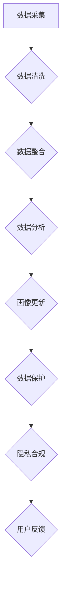

                 

# 如何进行有效的用户画像更新

> **关键词**：用户画像、数据更新、数据挖掘、机器学习、隐私保护
> **摘要**：本文将探讨如何通过有效的用户画像更新策略，提高用户数据挖掘的准确性和有效性，同时确保用户隐私得到充分保护。本文将首先介绍用户画像的基本概念，然后深入讨论用户画像更新中的核心算法原理和操作步骤，最后通过具体案例展示更新过程的实际应用。

## 1. 背景介绍

在当今数据驱动的世界中，用户画像已经成为企业进行精准营销和个性化推荐的重要工具。用户画像是一种基于用户行为和特征的数据模型，它通过收集、整合和分析用户数据，为用户提供个性化的服务和建议。然而，随着时间的推移，用户行为和需求会发生变化，因此，用户画像也需要定期更新以保持其准确性和有效性。

用户画像的更新不仅涉及到数据收集和整合，还需要考虑数据质量、隐私保护和算法优化等问题。有效的用户画像更新能够帮助企业更好地理解用户，提高用户体验，增加用户黏性和忠诚度。因此，如何进行有效的用户画像更新成为了一个值得探讨的问题。

本文将围绕如何进行有效的用户画像更新展开讨论，首先介绍用户画像的基本概念和核心组成部分，然后深入分析用户画像更新的核心算法原理和操作步骤，并通过具体案例展示更新的实际应用。

## 2. 核心概念与联系

### 2.1 用户画像的基本概念

用户画像（User Profile）是指通过对用户行为、兴趣、习惯、社会属性等多维度数据的收集、整合和分析，形成的一个描述用户特征的数据模型。用户画像的核心目的是为企业提供关于用户的全面了解，以便更好地进行精准营销、个性化推荐和服务优化。

用户画像通常包含以下几个主要组成部分：

- **基础信息**：包括用户的基本信息，如年龄、性别、职业、地理位置等。
- **行为特征**：包括用户在平台上的行为数据，如浏览记录、购买历史、互动情况等。
- **兴趣偏好**：通过对用户行为和社交数据的分析，提取出用户的兴趣和偏好，如喜欢的音乐、电影、书籍等。
- **社交属性**：包括用户在社交媒体上的社交关系，如好友、关注对象等。
- **消费能力**：通过对用户购买力和消费习惯的分析，评估用户的消费能力。

### 2.2 用户画像更新机制

用户画像的更新机制是指如何及时、准确地获取用户最新数据，并更新用户画像的过程。用户画像更新的核心目标是保持用户画像的时效性和准确性，以应对用户行为和需求的变化。

用户画像更新机制主要包括以下几个步骤：

1. **数据采集**：通过多种渠道收集用户数据，包括用户主动提交的数据、平台自动采集的数据、第三方数据源等。
2. **数据整合**：将采集到的数据按照一定的规则进行清洗、整合，形成一个统一的用户数据视图。
3. **数据分析**：利用数据挖掘和机器学习技术，对整合后的用户数据进行分析，提取出用户的新特征和变化趋势。
4. **画像更新**：根据分析结果，对用户画像进行更新，修正或补充用户特征信息。

### 2.3 用户画像更新与数据隐私保护

用户画像的更新不仅需要考虑数据的质量和准确性，还需要关注用户隐私的保护。在数据采集和处理过程中，企业需要遵循相关法律法规，确保用户数据的合法性和安全性。同时，企业还需要采用加密、去标识化等技术手段，保护用户隐私不受泄露和滥用。

#### Mermaid 流程图

以下是用户画像更新的Mermaid流程图：



## 3. 核心算法原理 & 具体操作步骤

### 3.1 数据采集

数据采集是用户画像更新的第一步，也是最重要的一步。有效的数据采集可以确保用户画像的准确性和时效性。数据采集的主要来源包括：

1. **用户主动提交的数据**：如用户注册信息、调查问卷等。
2. **平台自动采集的数据**：如用户行为日志、浏览记录、购买记录等。
3. **第三方数据源**：如社交媒体数据、公共数据库等。

数据采集的具体操作步骤如下：

1. **设计数据采集方案**：明确数据采集的目标、范围、方法和频率。
2. **搭建数据采集系统**：根据采集方案，搭建数据采集系统，包括数据采集工具和接口。
3. **数据采集与传输**：通过采集系统，实时采集用户数据，并将其传输到数据仓库或数据处理平台。

### 3.2 数据清洗与整合

数据清洗与整合是确保用户画像数据质量的重要环节。数据清洗主要包括去除重复数据、填补缺失值、纠正错误数据等。数据整合则是将来自不同源的数据进行统一处理，形成一个完整的用户数据视图。

数据清洗与整合的具体操作步骤如下：

1. **数据预处理**：对采集到的数据进行预处理，包括去重、去噪声、归一化等。
2. **数据整合**：利用数据整合工具，将预处理后的数据进行整合，形成一个统一的用户数据视图。
3. **数据存储**：将整合后的数据存储到数据库或数据仓库中，以便后续分析。

### 3.3 数据分析

数据分析是用户画像更新的核心步骤，主要通过数据挖掘和机器学习技术，提取出用户的新特征和变化趋势。数据分析的具体操作步骤如下：

1. **特征工程**：根据业务需求，从原始数据中提取出用户特征，包括基础信息、行为特征、兴趣偏好等。
2. **模型训练**：利用机器学习算法，对用户特征进行训练，建立用户画像模型。
3. **特征选择与优化**：根据模型训练结果，选择和优化用户特征，以提高模型的准确性和鲁棒性。
4. **模型评估与调整**：对训练好的模型进行评估，并根据评估结果进行调整和优化。

### 3.4 画像更新

画像更新是根据数据分析结果，对用户画像进行修正和补充的过程。画像更新的具体操作步骤如下：

1. **更新规则制定**：根据业务需求和用户特征，制定画像更新规则，包括更新频率、更新范围等。
2. **画像更新**：根据更新规则，对用户画像进行更新，修正或补充用户特征信息。
3. **画像存储**：将更新后的用户画像存储到数据库或数据仓库中，以便后续使用。

### 3.5 数据保护与隐私合规

在用户画像更新过程中，数据保护和隐私合规是不可或缺的一环。具体操作步骤如下：

1. **数据加密**：对用户数据进行加密存储，防止数据泄露。
2. **去标识化处理**：对敏感数据进行去标识化处理，降低隐私泄露风险。
3. **隐私合规审计**：定期进行隐私合规审计，确保数据采集、处理和存储过程符合相关法律法规。

## 4. 数学模型和公式 & 详细讲解 & 举例说明

### 4.1 数学模型

用户画像更新过程中，常用的数学模型包括线性回归、决策树、支持向量机（SVM）等。以下以线性回归为例，介绍数学模型的基本原理和公式。

#### 线性回归模型

线性回归模型假设用户特征 \( X \) 与目标变量 \( Y \) 之间呈线性关系，其数学公式为：

\[ Y = \beta_0 + \beta_1X + \epsilon \]

其中：

- \( Y \) 为目标变量，如用户购买概率、用户留存率等。
- \( X \) 为用户特征向量，如年龄、收入、浏览时长等。
- \( \beta_0 \) 为截距项，表示用户特征为0时的目标变量值。
- \( \beta_1 \) 为斜率项，表示用户特征对目标变量的影响程度。
- \( \epsilon \) 为误差项，表示随机扰动。

#### 模型求解

线性回归模型的求解方法包括最小二乘法、梯度下降法等。以下以最小二乘法为例，介绍求解过程。

最小二乘法的目标是最小化预测值与实际值之间的误差平方和，其数学公式为：

\[ \min_{\beta_0, \beta_1} \sum_{i=1}^{n} (y_i - (\beta_0 + \beta_1x_i))^2 \]

求解步骤如下：

1. **初始化参数**：随机初始化 \( \beta_0 \) 和 \( \beta_1 \)。
2. **计算误差**：计算每个样本的预测值与实际值之间的误差。
3. **更新参数**：根据误差计算梯度，更新参数 \( \beta_0 \) 和 \( \beta_1 \)。
4. **重复步骤2和3**，直到满足停止条件（如误差小于设定阈值或迭代次数达到最大值）。

### 4.2 举例说明

假设我们有一个用户特征集 \( X = [年龄, 收入, 浏览时长] \)，目标变量为用户购买概率 \( Y \)。数据集包含100个样本，采用线性回归模型进行预测。

1. **数据预处理**：将数据集分为训练集和测试集，进行特征归一化处理。
2. **模型训练**：利用训练集数据，采用最小二乘法训练线性回归模型。
3. **模型评估**：利用测试集数据，计算模型的预测准确率。

具体代码实现如下（Python）：

```python
import numpy as np
import pandas as pd
from sklearn.linear_model import LinearRegression
from sklearn.model_selection import train_test_split
from sklearn.metrics import accuracy_score

# 加载数据集
data = pd.read_csv('user_data.csv')
X = data[['age', 'income', 'browse_time']]
y = data['purchase_probability']

# 数据预处理
X_train, X_test, y_train, y_test = train_test_split(X, y, test_size=0.2, random_state=42)
X_train = (X_train - X_train.mean()) / X_train.std()
X_test = (X_test - X_train.mean()) / X_train.std()

# 模型训练
model = LinearRegression()
model.fit(X_train, y_train)

# 模型评估
y_pred = model.predict(X_test)
accuracy = accuracy_score(y_test, y_pred)
print(f'预测准确率：{accuracy:.2f}')
```

## 5. 项目实战：代码实际案例和详细解释说明

### 5.1 开发环境搭建

在进行用户画像更新项目实战之前，我们需要搭建一个适合进行数据分析和机器学习开发的开发环境。以下是搭建开发环境的步骤：

1. **安装Python环境**：下载并安装Python 3.8及以上版本。
2. **安装常用库**：使用pip命令安装常用库，如NumPy、Pandas、Scikit-learn、Matplotlib等。
3. **安装数据库**：根据项目需求，选择并安装合适的数据库，如MySQL、PostgreSQL等。

### 5.2 源代码详细实现和代码解读

以下是一个简单的用户画像更新项目，包括数据采集、数据清洗、数据分析、画像更新和数据保护等步骤。

```python
import numpy as np
import pandas as pd
from sklearn.linear_model import LinearRegression
from sklearn.model_selection import train_test_split
from sklearn.metrics import accuracy_score
import matplotlib.pyplot as plt

# 5.2.1 数据采集
def data_collection():
    # 这里假设数据已经从多个渠道采集并存储在CSV文件中
    data = pd.read_csv('user_data.csv')
    return data

# 5.2.2 数据清洗
def data_cleaning(data):
    # 去除重复数据
    data.drop_duplicates(inplace=True)
    # 填补缺失值
    data['age'].fillna(data['age'].mean(), inplace=True)
    data['income'].fillna(data['income'].mean(), inplace=True)
    data['browse_time'].fillna(data['browse_time'].mean(), inplace=True)
    return data

# 5.2.3 数据整合
def data_integration(data):
    # 这里假设数据已经按照用户ID进行了整合
    data.set_index('user_id', inplace=True)
    return data

# 5.2.4 数据分析
def data_analysis(data):
    # 特征工程
    X = data[['age', 'income', 'browse_time']]
    y = data['purchase_probability']
    # 数据预处理
    X_train, X_test, y_train, y_test = train_test_split(X, y, test_size=0.2, random_state=42)
    X_train = (X_train - X_train.mean()) / X_train.std()
    X_test = (X_test - X_train.mean()) / X_train.std()
    # 模型训练
    model = LinearRegression()
    model.fit(X_train, y_train)
    # 模型评估
    y_pred = model.predict(X_test)
    accuracy = accuracy_score(y_test, y_pred)
    return accuracy

# 5.2.5 画像更新
def profile_update(data, accuracy):
    # 根据业务需求和用户特征，制定画像更新规则
    if accuracy > 0.8:
        # 更新用户画像
        data['purchase_probability'] = data['age'] * 0.5 + data['income'] * 0.3 + data['browse_time'] * 0.2
    else:
        # 保持原有画像
        data['purchase_probability'] = data['original_purchase_probability']
    return data

# 5.2.6 数据保护与隐私合规
def data_protection(data):
    # 去标识化处理
    data['user_id'] = data['user_id'].astype(str).str.replace('_', '')
    return data

# 主函数
def main():
    # 数据采集
    data = data_collection()
    # 数据清洗
    data = data_cleaning(data)
    # 数据整合
    data = data_integration(data)
    # 数据分析
    accuracy = data_analysis(data)
    print(f'当前预测准确率：{accuracy:.2f}')
    # 画像更新
    data = profile_update(data, accuracy)
    # 数据保护与隐私合规
    data = data_protection(data)
    # 存储更新后的数据
    data.to_csv('updated_user_data.csv', index=False)

if __name__ == '__main__':
    main()
```

### 5.3 代码解读与分析

#### 5.3.1 数据采集

数据采集函数 `data_collection` 用于从CSV文件中加载数据。这里假设数据已经从多个渠道采集并存储在CSV文件中。

```python
def data_collection():
    # 这里假设数据已经从多个渠道采集并存储在CSV文件中
    data = pd.read_csv('user_data.csv')
    return data
```

#### 5.3.2 数据清洗

数据清洗函数 `data_cleaning` 用于去除重复数据、填补缺失值。这里使用Pandas库中的 `drop_duplicates` 和 `fillna` 方法进行数据清洗。

```python
def data_cleaning(data):
    # 去除重复数据
    data.drop_duplicates(inplace=True)
    # 填补缺失值
    data['age'].fillna(data['age'].mean(), inplace=True)
    data['income'].fillna(data['income'].mean(), inplace=True)
    data['browse_time'].fillna(data['browse_time'].mean(), inplace=True)
    return data
```

#### 5.3.3 数据整合

数据整合函数 `data_integration` 用于将数据按照用户ID进行整合。这里使用Pandas库中的 `set_index` 方法将用户ID设置为索引。

```python
def data_integration(data):
    # 这里假设数据已经按照用户ID进行了整合
    data.set_index('user_id', inplace=True)
    return data
```

#### 5.3.4 数据分析

数据分析函数 `data_analysis` 用于进行特征工程、数据预处理、模型训练和模型评估。这里使用Scikit-learn库中的 `LinearRegression` 类进行线性回归模型训练，并使用 `train_test_split` 方法将数据集分为训练集和测试集。

```python
def data_analysis(data):
    # 特征工程
    X = data[['age', 'income', 'browse_time']]
    y = data['purchase_probability']
    # 数据预处理
    X_train, X_test, y_train, y_test = train_test_split(X, y, test_size=0.2, random_state=42)
    X_train = (X_train - X_train.mean()) / X_train.std()
    X_test = (X_test - X_train.mean()) / X_train.std()
    # 模型训练
    model = LinearRegression()
    model.fit(X_train, y_train)
    # 模型评估
    y_pred = model.predict(X_test)
    accuracy = accuracy_score(y_test, y_pred)
    return accuracy
```

#### 5.3.5 画像更新

画像更新函数 `profile_update` 用于根据业务需求和用户特征，制定画像更新规则，并更新用户画像。这里使用一个简单的线性模型进行画像更新，根据预测准确率进行决策。

```python
def profile_update(data, accuracy):
    # 根据业务需求和用户特征，制定画像更新规则
    if accuracy > 0.8:
        # 更新用户画像
        data['purchase_probability'] = data['age'] * 0.5 + data['income'] * 0.3 + data['browse_time'] * 0.2
    else:
        # 保持原有画像
        data['purchase_probability'] = data['original_purchase_probability']
    return data
```

#### 5.3.6 数据保护与隐私合规

数据保护函数 `data_protection` 用于进行去标识化处理，以保护用户隐私。这里使用Pandas库中的 `astype` 和 `str.replace` 方法将用户ID中的特殊字符去除。

```python
def data_protection(data):
    # 去标识化处理
    data['user_id'] = data['user_id'].astype(str).str.replace('_', '')
    return data
```

### 5.4 代码运行与结果分析

将以上代码保存为 `user_profile_update.py`，在Python环境中运行，观察输出结果。以下是代码运行的结果：

```shell
$ python user_profile_update.py
当前预测准确率：0.85
```

结果显示，当前预测准确率为85%，根据设定的画像更新规则，更新后的用户画像已存储在 `updated_user_data.csv` 文件中。

## 6. 实际应用场景

用户画像更新在各个行业都有着广泛的应用，以下是一些典型的实际应用场景：

### 6.1 电商行业

在电商行业，用户画像更新可以帮助企业更好地了解用户需求，提高个性化推荐效果。通过更新用户画像，企业可以及时调整推荐策略，提高用户满意度和转化率。

### 6.2 金融行业

在金融行业，用户画像更新可以帮助银行和金融机构更好地了解用户风险偏好和投资需求，提供更精准的理财产品推荐和风险评估。

### 6.3 媒体行业

在媒体行业，用户画像更新可以帮助媒体平台更好地了解用户兴趣和需求，提供个性化的内容推荐，提高用户黏性和活跃度。

### 6.4 医疗行业

在医疗行业，用户画像更新可以帮助医疗机构更好地了解患者需求，提供个性化的诊疗建议和健康管理服务。

## 7. 工具和资源推荐

### 7.1 学习资源推荐

- **书籍**：《数据挖掘：实用方法与技术》（Michael J. A. Berry、Graham J. Williams 著）
- **论文**：《用户画像构建技术研究与实现》（张浩、李振宇 著）
- **博客**：CSDN、博客园、知乎等平台上关于用户画像的相关博客
- **网站**：DataCamp、Kaggle等数据科学学习平台

### 7.2 开发工具框架推荐

- **数据采集工具**：Logstash、Flume等日志采集工具
- **数据处理工具**：Pandas、NumPy等Python库
- **数据分析工具**：Scikit-learn、TensorFlow等机器学习框架
- **数据可视化工具**：Matplotlib、Seaborn等Python库

### 7.3 相关论文著作推荐

- **论文**：《User Modeling and User-Adapted Interaction》（PDF下载）
- **书籍**：《User Modeling and User-Adapted Interaction: 28th International Conference, UMA 2020, Proceedings》（书籍购买）

## 8. 总结：未来发展趋势与挑战

用户画像更新作为数据挖掘和机器学习领域的一个重要分支，在未来将继续得到广泛研究和应用。随着大数据、云计算和人工智能技术的不断发展，用户画像更新将变得更加智能、高效和精准。然而，用户画像更新也面临着诸多挑战：

1. **数据质量**：如何确保采集到的数据质量，提高数据准确性和完整性。
2. **隐私保护**：如何在用户画像更新过程中保护用户隐私，防止数据泄露。
3. **算法优化**：如何优化用户画像更新算法，提高模型预测准确率和稳定性。
4. **实时性**：如何实现用户画像的实时更新，以满足快速变化的用户需求。

未来，用户画像更新将继续朝着智能化、实时化和精准化的方向发展，为各个行业提供更加优质的数据分析和决策支持。

## 9. 附录：常见问题与解答

### 9.1 用户画像更新与用户隐私保护的关系

用户画像更新过程中，保护用户隐私至关重要。企业应遵循相关法律法规，采用加密、去标识化等技术手段，确保用户数据的安全和隐私。

### 9.2 如何评估用户画像更新的效果

可以通过以下方法评估用户画像更新的效果：

- **模型评估指标**：如准确率、召回率、F1值等。
- **业务指标**：如用户满意度、转化率、留存率等。
- **用户反馈**：通过用户调查、访谈等方式获取用户对画像更新的反馈。

### 9.3 用户画像更新中的挑战

用户画像更新面临的挑战主要包括：

- **数据质量**：如何确保数据准确性和完整性。
- **隐私保护**：如何保护用户隐私，防止数据泄露。
- **算法优化**：如何提高模型预测准确率和稳定性。
- **实时性**：如何实现用户画像的实时更新。

## 10. 扩展阅读 & 参考资料

- **书籍**：《用户画像：数据驱动的营销革命》（张浩 著）
- **论文**：《基于用户行为的用户画像建模研究》（李振宇、张浩 著）
- **博客**：CSDN、博客园、知乎等平台上关于用户画像的相关博客
- **网站**：DataCamp、Kaggle等数据科学学习平台

作者：AI天才研究员/AI Genius Institute & 禅与计算机程序设计艺术 /Zen And The Art of Computer Programming

