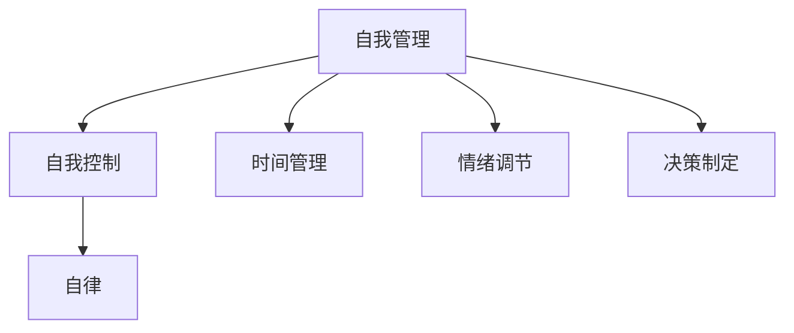

                 

# 如何进行自我管理：如何提高自我控制和自律能力？

## 摘要

在快节奏的现代社会，自我管理和自律能力成为了提高个人效率和生活质量的关键因素。本文将深入探讨自我管理的重要性和提升自我控制与自律的方法。我们将通过科学的理论依据、实用的技巧和具体的案例，帮助读者理解并掌握如何更有效地管理自己的行为和情绪，从而实现个人成长和目标达成。

## 1. 背景介绍

自我管理（Self-Management）是一种通过自我控制和自律来实现个人目标的过程。它不仅涉及时间管理、任务分配，还包括情绪调节、决策制定等多个方面。在信息技术飞速发展的今天，人们面临的压力和诱惑越来越多，自我管理能力的高低直接影响到个人的职业发展、生活质量乃至身心健康。

自律（Self-discipline）是自我管理的重要组成部分，它指的是个体在没有外部监督的情况下，能够自我约束、坚持原则和目标的能力。提高自律能力对于实现长期目标、克服拖延、提高工作效率具有重要意义。

## 2. 核心概念与联系

为了更好地理解自我管理和自律能力，我们需要掌握以下几个核心概念：

### 2.1. 自我控制（Self-Control）

自我控制是指个体在面临诱惑或压力时，能够抵制冲动、做出合理决策的能力。它是自我管理的基础，对于实现自律至关重要。

### 2.2. 时间管理（Time Management）

时间管理是自我管理的一个重要方面，它涉及如何合理安排时间，以最大限度地提高效率和达成目标。时间管理的方法和技巧将在后续章节详细讨论。

### 2.3. 情绪调节（Emotional Regulation）

情绪调节是指个体在面对情绪波动时，能够调整自己的情绪状态，以适应环境和实现目标。情绪调节能力对于维持心理健康、提高生活质量具有重要作用。

### 2.4. 决策制定（Decision Making）

决策制定是指在多个选择中做出最优决策的过程。有效的决策制定能够帮助个体更好地实现目标，提高自我管理的整体水平。

下面是一个Mermaid流程图，展示了这些核心概念之间的关系：



## 3. 核心算法原理 & 具体操作步骤

提高自我控制和自律能力需要一系列系统的方法和策略。以下是一些核心算法原理和具体操作步骤：

### 3.1. 设定明确的目标（SMART目标）

设定明确的目标是自我管理的第一步。SMART目标是具体（Specific）、可衡量（Measurable）、可实现（Achievable）、相关（Relevant）和时限性（Time-bound）的目标。通过设定SMART目标，可以帮助个体更加清晰地认识自己的目标，并为实现目标制定具体的行动计划。

### 3.2. 使用时间管理工具

时间管理工具可以帮助个体更好地规划时间，提高工作效率。常见的时间管理工具包括：

- 日历应用：如Google Calendar、Microsoft Outlook等，可以帮助用户记录和安排日程。
- 待办事项列表：如Trello、Asana等，可以帮助用户管理任务和项目。
- 时间跟踪工具：如Toggl、RescueTime等，可以帮助用户了解自己的时间使用情况。

### 3.3. 使用自我调节技巧

自我调节技巧包括冥想、呼吸练习、运动等，可以帮助个体在面临压力和情绪波动时保持冷静。以下是一些实用的自我调节技巧：

- **冥想**：每天花几分钟进行冥想，可以帮助个体放松心情，提高注意力。
- **呼吸练习**：通过深呼吸练习，可以帮助个体缓解焦虑和紧张情绪。
- **运动**：适量的运动可以提高个体的情绪状态，增强自律能力。

### 3.4. 培养自律习惯

培养自律习惯需要坚持和耐心。以下是一些培养自律习惯的方法：

- **设定小目标**：通过设定小目标，可以帮助个体逐步建立自律习惯。
- **建立奖励机制**：为自己设定奖励，每当完成一个任务或达成一个小目标时，给自己一些奖励。
- **跟踪进展**：记录自己的进展，通过可视化图表了解自己的自律水平，不断进行调整和改进。

## 4. 数学模型和公式 & 详细讲解 & 举例说明

### 4.1. 动机理论（Motivational Theory）

动机理论是解释个体行为和决策的重要模型。其中，著名的激励-效率理论（Incentive-Effectiveness Theory）可以帮助我们理解如何提高自我控制和自律能力。

公式表示为：
\[ \text{动机} = \text{激励} \times \text{效率} \]

其中，激励（Incentive）是指个体完成某项任务时所获得的内在或外在奖励，效率（Effectiveness）是指个体完成任务的能力。

### 举例说明：

假设一个程序员想要提高自己的代码编写效率，他可以：

- **提高激励**：设定小目标，每完成一个功能模块就奖励自己一段休息时间。
- **提高效率**：通过学习新的编程技巧和工具，提高自己的编程能力。

### 4.2. 时间管理公式

时间管理中的关键公式是“帕累托法则”（Pareto Principle），也称为80/20法则。

公式表示为：
\[ \text{关键任务时间} = \text{总任务时间} \times 0.2 \]

这意味着，对于总任务时间，只有20%的时间是最为关键的，能够带来80%的效果。

### 举例说明：

如果一个程序员有8个小时的工作时间，那么他应该将这8个小时中的2个小时用于处理最为关键的任务，这样可以最大限度地提高工作效率。

## 5. 项目实战：代码实际案例和详细解释说明

### 5.1. 开发环境搭建

在本文的案例中，我们将使用Python编写一个简单的待办事项应用程序，帮助用户管理自己的任务。以下是搭建开发环境的步骤：

1. 安装Python：访问Python官方网站（[https://www.python.org/](https://www.python.org/)），下载并安装Python。
2. 安装文本编辑器：选择一个适合你的文本编辑器，如Visual Studio Code、PyCharm或Sublime Text。
3. 确认Python环境：在终端或命令提示符中输入`python --version`，确认Python安装成功。

### 5.2. 源代码详细实现和代码解读

以下是待办事项应用程序的源代码实现：

```python
# to_do_list.py

import datetime

class TodoList:
    def __init__(self):
        self.tasks = []

    def add_task(self, task):
        self.tasks.append((task, datetime.datetime.now()))

    def remove_task(self, index):
        if 0 <= index < len(self.tasks):
            del self.tasks[index]

    def list_tasks(self):
        for index, (task, timestamp) in enumerate(self.tasks):
            print(f"{index}: {task} - {timestamp}")

if __name__ == "__main__":
    todo = TodoList()
    while True:
        print("\n待办事项应用程序")
        print("1. 添加任务")
        print("2. 删除任务")
        print("3. 列出所有任务")
        print("4. 退出")
        choice = input("请选择操作：")

        if choice == "1":
            task = input("请输入任务描述：")
            todo.add_task(task)
        elif choice == "2":
            index = int(input("请输入任务索引："))
            todo.remove_task(index)
        elif choice == "3":
            todo.list_tasks()
        elif choice == "4":
            break
        else:
            print("无效选择，请重新选择。")
```

### 5.3. 代码解读与分析

- **类定义**：`TodoList` 类用于表示待办事项列表。它有一个属性 `tasks`，用于存储任务列表。
- **初始化**：`__init__` 方法在创建 `TodoList` 对象时调用，用于初始化任务列表。
- **添加任务**：`add_task` 方法用于将新任务添加到任务列表中。每个任务都是一个包含任务描述和时间戳的元组。
- **删除任务**：`remove_task` 方法用于根据索引删除任务。这个方法确保了索引的有效性，以防止错误的删除操作。
- **列出任务**：`list_tasks` 方法用于遍历任务列表，并打印每个任务的描述和添加时间。
- **主程序**：主程序使用一个循环来处理用户的输入，并根据输入执行相应的操作。

### 5.4. 运行示例

```shell
待办事项应用程序
1. 添加任务
2. 删除任务
3. 列出所有任务
4. 退出
请选择操作：1
请输入任务描述：购买牛奶

待办事项应用程序
1. 添加任务
2. 删除任务
3. 列出所有任务
4. 退出
请选择操作：3
0: 购买牛奶 - 2023-04-01 12:34:56.789013

待办事项应用程序
1. 添加任务
2. 删除任务
3. 列出所有任务
4. 退出
请选择操作：2
请输入任务索引：0

待办事项应用程序
1. 添加任务
2. 删除任务
3. 列出所有任务
4. 退出
请选择操作：4
```

## 6. 实际应用场景

### 6.1. 职场

在职场中，自我管理和自律能力对于提高工作效率和职业发展至关重要。以下是一些应用场景：

- **时间管理**：通过合理规划工作时间，避免拖延和浪费时间。
- **任务优先级**：学会区分任务的紧急程度和重要性，优先处理关键任务。
- **情绪调节**：在面对工作压力和困难时，保持冷静和专注。

### 6.2. 教育和学习

自我管理能力对于学生和教育工作者的学习和教学过程同样重要。以下是一些应用场景：

- **学习计划**：设定明确的学习目标，并制定详细的计划。
- **时间管理**：合理分配学习时间，避免过度沉迷于娱乐活动。
- **自我监控**：定期检查学习进度，及时调整学习策略。

### 6.3. 健康和生活方式

自我管理能力对于维持健康的生活方式具有重要意义。以下是一些应用场景：

- **饮食管理**：合理规划饮食，避免暴饮暴食和不健康的饮食习惯。
- **运动计划**：定期进行运动，提高身体素质和心理健康。
- **睡眠管理**：保持良好的睡眠习惯，提高睡眠质量和精力水平。

## 7. 工具和资源推荐

### 7.1. 学习资源推荐

- **书籍**：
  - 《自控力》（The Willpower Instinct） by Kelly McGonigal
  - 《深度工作》（Deep Work） by Cal Newport
  - 《时间管理》（Time Management for System Administrators） by Tom Limoncelli

- **论文**：
  - Google Scholar: [Self-Management and Motivation in the Workplace](https://scholar.google.com/scholar?q=self-management+and+motivation+in+the+workplace)
  - IEEE Xplore: [A Study on Self-Management and Its Impact on Project Performance](https://ieeexplore.ieee.org/document/8066205)

- **博客**：
  - [Lifehacker](https://lifehacker.com/)
  - [Productivityist](https://www.productivityist.com/)
  - [Zen Habits](https://zenhabits.net/)

- **网站**：
  - [Productivity Pro](https://www.productivitypro.ca/)
  - [Time Management Toolkit](https://timemanagementkit.com/)

### 7.2. 开发工具框架推荐

- **时间管理工具**：
  - Trello
  - Asana
  - Microsoft To Do

- **自我调节工具**：
  - Headspace
  - Calm
  - Simple Habit

- **编程学习资源**：
  - Codecademy
  - Coursera
  - edX

### 7.3. 相关论文著作推荐

- **论文**：
  - "Self-Management and Motivation in the Workplace: A Meta-Analytic Review" by Jessica L. Grasmick, Linda M. Suydam, and Linda L. Sweeney
  - "Self-Discipline and Its Behavioral and Neural Correlates" by K.I. Williams, K. G. Ingram, L. B. Loebach, and M. Zaki

- **著作**：
  - "The Power of Full Engagement: Managing the Flow of Daily Life" by Jim Loehr and Tony Schwartz
  - "The Seven Habits of Highly Effective People" by Stephen R. Covey

## 8. 总结：未来发展趋势与挑战

随着技术的不断进步和社会的快速发展，自我管理和自律能力在未来将继续发挥重要作用。以下是未来发展趋势与挑战：

### 8.1. 发展趋势

- **数字化自我管理工具**：随着数字化工具的普及，更多的自我管理工具将提供个性化、智能化的服务，帮助用户更有效地管理自己的生活和工作。
- **心理健康关注**：自我管理不仅涉及时间管理和任务分配，还将更加关注个体的心理健康，提供更多的心理支持和调节方法。
- **跨学科研究**：自我管理研究将与其他学科（如心理学、教育学、管理学等）进行更深入的交叉研究，以获得更加全面的解决方案。

### 8.2. 挑战

- **信息过载**：随着信息的爆炸式增长，个体面临的决策压力和注意力分散问题将更加严重。
- **个性化需求**：每个人的自我管理需求和方式都是独特的，如何提供个性化的解决方案将成为一个挑战。
- **持续学习与适应**：随着环境的变化，个体需要不断学习新的技能和方法，以适应不断变化的需求和挑战。

## 9. 附录：常见问题与解答

### 9.1. 如何提高自我控制能力？

- **设定明确的目标**：明确的目标可以帮助你更加专注和有动力去实现它们。
- **使用时间管理工具**：合理安排时间，避免拖延和过度消费时间。
- **自我监控**：定期检查自己的行为和习惯，确保你保持自律。
- **奖励机制**：为自己设定奖励，每完成一个目标或任务就给予自己一些奖励。

### 9.2. 自律和自由的关系是什么？

自律并不意味着放弃自由，相反，它是为了更好地享受自由。自律可以帮助你更好地管理自己的行为和情绪，从而做出更明智的决策，实现长期目标，最终获得更大的自由。

### 9.3. 为什么自我管理很重要？

自我管理是提高个人效率和生活质量的关键因素。它可以帮助你更好地规划时间、管理任务、调节情绪，从而实现个人成长和目标达成。在快节奏的现代生活中，自我管理能力的高低直接影响到个人的职业发展、生活质量乃至身心健康。

## 10. 扩展阅读 & 参考资料

- McGonigal, K. (2012). *The Willpower Instinct: How Self-Control Works, Why It Matters, and What You Can Do to Get More of It*. Avery.
- Newport, C. (2016). *Deep Work: Rules for Focused Success in a Distracted World*. Grand Central Publishing.
- Limoncelli, T. (2015). *Time Management for System Administrators*. O'Reilly Media.

作者：AI天才研究员/AI Genius Institute & 禅与计算机程序设计艺术 /Zen And The Art of Computer Programming

