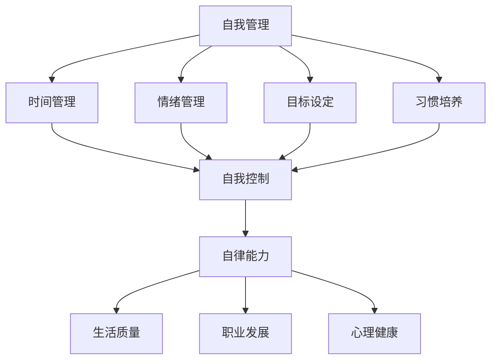

                 

# 如何进行自我管理：如何提高自我控制和自律能力？

## 摘要

本文旨在探讨自我管理和自律能力的重要性，并提供一系列有效的策略和工具，帮助读者提高自我控制能力。我们将从心理、行为和环境三个角度进行分析，并借助具体的案例和数学模型，来帮助读者深入理解自我管理的本质和方法。

关键词：自我管理，自律能力，自我控制，策略，数学模型

## 1. 背景介绍

在快节奏的现代社会中，自我管理和自律能力显得尤为重要。无论是职场上的高效工作，还是个人生活中的自我提升，自我管理都是成功的关键因素之一。然而，许多人常常发现自己难以抵制诱惑，容易分心，无法坚持计划，这正是因为缺乏有效的自我控制能力。

自我管理不仅仅关乎个人的生活品质，它还直接影响到职业发展、健康状态以及人际关系。通过提高自我控制能力，我们可以更好地规划时间、减少压力、提高效率，从而实现个人目标和提升生活质量。

本文将结合心理学、行为科学和数学模型，为读者提供一套全面且实用的自我管理方法。我们将探讨自我管理的核心概念，介绍有效的自我控制策略，并通过实际案例和代码实现，帮助读者理解并应用这些方法。此外，我们还将推荐一些实用的工具和资源，以帮助读者在实践中更好地应用自我管理策略。

## 2. 核心概念与联系

### 2.1 自我管理的定义

自我管理是指个人对自己行为、情绪和时间的主动控制，以实现既定目标和提高生活质量。自我管理包括多个方面，如时间管理、情绪管理、目标设定、习惯培养等。有效的自我管理需要综合运用心理学、行为科学和数学模型，以实现自我控制和自律。

### 2.2 自我控制的重要性

自我控制是自我管理的重要组成部分，它是指个体在面对诱惑、压力和困难时，能够保持冷静、坚定和自律的能力。自我控制不仅影响到个人的生活质量，还对其职业发展、人际关系和心理健康产生重要影响。

### 2.3 自律能力的衡量标准

自律能力通常可以通过以下标准进行衡量：

1. **时间管理能力**：能否合理安排时间，避免拖延和分心。
2. **情绪控制能力**：能否在压力和诱惑面前保持冷静和理智。
3. **目标达成能力**：能否坚持计划，实现个人目标和任务。
4. **习惯养成能力**：能否养成良好的生活习惯，如早起、锻炼、阅读等。

### 2.4 自我管理的影响因素

自我管理受到多种因素的影响，包括：

1. **心理因素**：如自我效能感、意志力、情绪状态等。
2. **环境因素**：如社会支持、物理环境、文化背景等。
3. **行为因素**：如日常习惯、行为模式、自我监控等。

### 2.5 Mermaid 流程图

以下是一个简化的自我管理流程图，展示了自我控制与自律能力的核心概念和相互关系：



## 3. 核心算法原理 & 具体操作步骤

### 3.1 原理介绍

自我管理和自律能力的提升需要建立在一个坚实的理论基础之上。心理学和行为科学为我们提供了多种有效的策略和方法，以下是一些核心算法原理：

1. **目标设定理论**：由著名心理学家爱德华·德西和理查德·瑞恩提出，强调明确、具体的目标设定对于提升自律能力的重要性。
2. **习惯养成理论**：由心理学家詹姆斯·克利尔提出，指出通过重复和坚持，可以逐渐养成良好习惯。
3. **情绪调节理论**：包括认知重构、情感表达、放松训练等多种方法，帮助个体在压力和诱惑面前保持冷静。
4. **自我监控理论**：自我监控是指个体对自己的行为、情感和认知过程进行监控和调整的能力。

### 3.2 具体操作步骤

1. **目标设定**：

   - **明确目标**：首先，明确你的目标是什么。目标应该具体、明确，可以量化，例如“每天阅读1小时”。
   - **分解目标**：将大目标分解为小目标，逐步实现。例如，将“减重20斤”分解为每周减重1斤。
   - **设定时间限制**：为每个小目标设定时间限制，以增加紧迫感和动力。

2. **习惯养成**：

   - **选择习惯**：选择一个你希望养成的良好习惯，例如早起、锻炼、阅读等。
   - **制定计划**：制定一个具体的行动计划，包括每天的具体时间、地点和活动内容。
   - **坚持重复**：重复执行这个行动计划，直到它成为你的自然习惯。

3. **情绪调节**：

   - **认知重构**：通过改变你对问题的看法，来改变你的情绪状态。例如，将“任务太难，我不可能完成”改为“这是一个挑战，我可以尝试解决”。
   - **情感表达**：找到合适的方式表达你的情感，例如与朋友聊天、写日记、绘画等。
   - **放松训练**：通过深呼吸、冥想、瑜伽等放松技巧，缓解压力和焦虑。

4. **自我监控**：

   - **记录进度**：定期记录你的行为和进展，以了解你的自律程度和效果。
   - **自我激励**：为自己设定奖励和惩罚机制，以增加自律动力。
   - **寻求反馈**：与朋友、家人或专业人士交流，获取他们的意见和建议。

## 4. 数学模型和公式 & 详细讲解 & 举例说明

### 4.1 目标设定公式

目标设定理论中的一个核心概念是目标难度与动力之间的关系。以下是一个简单的数学模型来描述这一关系：

$$
动机 = \frac{目标难度}{能力水平}
$$

- **目标难度**：目标应该具有一定难度，但不应过于困难，否则会降低动力。
- **能力水平**：个体的能力水平决定了他们能够处理的目标难度。

### 4.2 习惯养成公式

习惯养成的数学模型通常基于重复和持续的概念。以下是一个简单的模型来描述习惯的形成：

$$
习惯强度 = 时间 \times 频率 \times 强化
$$

- **时间**：养成习惯所需的时间。
- **频率**：每天或每周重复习惯的次数。
- **强化**：习惯完成后给予的正向反馈，如奖励。

### 4.3 情绪调节公式

情绪调节的一个有效方法是认知重构。以下是一个简单的认知重构公式：

$$
新情绪状态 = 认知重构 \times 原始情绪状态
$$

- **认知重构**：改变你对情境的看法。
- **原始情绪状态**：最初的情绪反应。

### 4.4 举例说明

假设小明想要养成每天阅读1小时的习惯，并且他希望能够在两周内完成这个目标。根据习惯养成公式，我们可以计算出小明的习惯强度：

$$
习惯强度 = 14 \text{天} \times 1 \text{次/天} \times 1 \text{强化} = 14
$$

这意味着小明的习惯强度为14，通过持续的阅读和适当的强化，他有望在两周内养成每天阅读1小时的习惯。

## 5. 项目实战：代码实际案例和详细解释说明

### 5.1 开发环境搭建

为了演示如何通过代码实现自我管理策略，我们将使用Python作为编程语言，并使用Jupyter Notebook作为开发环境。以下是在Jupyter Notebook中搭建开发环境的步骤：

1. 安装Python：在官方网站下载并安装Python。
2. 安装Jupyter Notebook：打开终端，执行以下命令：
   ```bash
   pip install notebook
   ```
3. 启动Jupyter Notebook：在终端中执行以下命令：
   ```bash
   jupyter notebook
   ```
4. 在浏览器中打开Jupyter Notebook界面，即可开始编写代码。

### 5.2 源代码详细实现和代码解读

以下是一个简单的Python代码示例，用于跟踪阅读习惯：

```python
class ReadingGoal:
    def __init__(self, duration, days):
        self.duration = duration
        self.days = days
        self.reach_goal = False

    def check_progress(self, day):
        if day >= self.days:
            self.reach_goal = True
            return "目标已完成！"
        elif day < self.days:
            return f"您已经阅读了{day}天，距离目标还有{self.days - day}天。"

    def reward(self):
        if self.reach_goal:
            return "恭喜您，获得了奖励！"
        else:
            return "目标尚未完成，请继续努力！"

# 实例化ReadingGoal对象
reading_goal = ReadingGoal(1, 14)

# 模拟阅读进度
print(reading_goal.check_progress(1))
print(reading_goal.check_progress(7))
print(reading_goal.check_progress(14))

# 给予奖励
print(reading_goal.reward())
```

### 5.3 代码解读与分析

1. **类定义**：`ReadingGoal` 类用于表示阅读目标，包括目标持续时间和天数。
2. **初始化**：`__init__` 方法初始化阅读目标的持续时间（`duration`）和天数（`days`），以及是否达到目标的标志（`reach_goal`）。
3. **检查进度**：`check_progress` 方法用于检查当前进度，并返回一个消息。
4. **奖励**：`reward` 方法根据是否达到目标给予相应的奖励。

通过这个简单的代码示例，我们可以跟踪阅读进度，并在目标达成时给予奖励。这有助于提高自律能力，鼓励坚持阅读。

## 6. 实际应用场景

### 6.1 职场中的应用

在职场中，自我管理可以帮助员工提高工作效率，减少加班时间。通过设定明确的工作目标，合理安排工作时间，员工可以更好地平衡工作与生活。例如，使用项目管理工具如Trello或Asana，可以帮助员工跟踪任务进度，提高自律能力。

### 6.2 个人生活中的应用

个人生活中，自我管理可以帮助我们养成良好的生活习惯，如定期锻炼、健康饮食和充足睡眠。通过使用手机应用程序如MyFitnessPal和Google Calendar，可以更好地管理健康和生活事务。

### 6.3 教育场景中的应用

在教育场景中，自我管理可以帮助学生提高学习效率，减少拖延。通过设定学习目标和制定学习计划，学生可以更好地管理学习时间，提高自律能力。教师可以指导学生使用学习管理工具，如Google Classroom和Quizlet，以促进自我管理。

## 7. 工具和资源推荐

### 7.1 学习资源推荐

1. **书籍**：
   - 《自控力》：凯利·麦格尼格尔著，详细介绍了自我控制和自律的科学原理和实践方法。
   - 《习惯的力量》：查尔斯·杜希格著，深入探讨了习惯的养成和改变。

2. **论文**：
   - “The Science of Self-Control”：一篇综述论文，总结了自我控制领域的研究成果和应用。

3. **博客**：
   - [Chris Bailey 的博客](https://www.chrisbailey.ca/)：Chris Bailey 提供了许多关于自我管理和时间管理的实践建议。

4. **网站**：
   - [Psychology Today](https://www.psychologytoday.com/)：提供关于自我管理和自律能力的心理学研究和个人经验分享。

### 7.2 开发工具框架推荐

1. **Trello**：一个功能强大的项目管理工具，适用于个人和团队。
2. **Asana**：适用于团队协作的任务管理工具，可以帮助员工更好地跟踪任务进度。
3. **Google Calendar**：一款强大的日历应用程序，可以帮助用户合理安排时间。

### 7.3 相关论文著作推荐

1. **德西和瑞恩的《自我决定理论》**：详细介绍了自我决定理论，为自我管理提供了理论基础。
2. **詹姆斯·克利尔的《原子习惯》**：探讨了习惯养成的科学方法和实践策略。

## 8. 总结：未来发展趋势与挑战

随着技术的发展，自我管理和自律能力的提升将越来越依赖于智能工具和算法。未来的发展趋势可能包括：

1. **个性化自我管理策略**：通过大数据和人工智能，为用户提供个性化的自我管理建议。
2. **智能反馈机制**：使用传感器和智能设备，实时监测行为和健康数据，提供即时反馈。
3. **虚拟现实（VR）应用**：通过VR技术，模拟自我管理的场景，帮助用户更好地理解和实践自我管理策略。

然而，未来也面临着一些挑战，如：

1. **隐私问题**：智能工具和算法需要收集大量的个人数据，如何保护用户隐私成为一个重要问题。
2. **依赖性增加**：过度依赖智能工具可能导致用户自律能力的下降，需要找到平衡点。
3. **伦理问题**：自我管理工具的应用可能会引发伦理问题，如如何平衡个人自由与监控。

## 9. 附录：常见问题与解答

### 9.1 什么是自我管理？

自我管理是指个人对自己行为、情绪和时间的主动控制，以实现既定目标和提高生活质量。

### 9.2 自我管理的重要性是什么？

自我管理对于个人的生活质量、职业发展和心理健康具有深远影响，可以提高工作效率、减少压力、改善人际关系等。

### 9.3 如何设定明确的目标？

设定明确的目标需要具体、量化，并具有可实现性。目标应包括具体的任务、完成时间和预期结果。

### 9.4 如何养成良好习惯？

养成良好习惯需要坚持重复，并给予适当强化。可以使用习惯养成公式（时间 × 频率 × 强化）来评估习惯的强度。

### 9.5 如何提高自我控制能力？

提高自我控制能力可以通过目标设定、习惯养成、情绪调节和自我监控等方法。具体策略包括认知重构、奖励机制和定期自我评估等。

## 10. 扩展阅读 & 参考资料

1. **德西和瑞恩的《自我决定理论》**
2. **詹姆斯·克利尔的《原子习惯》**
3. **[Chris Bailey 的博客](https://www.chrisbailey.ca/)**

## 作者

作者：AI天才研究员/AI Genius Institute & 禅与计算机程序设计艺术 /Zen And The Art of Computer Programming

