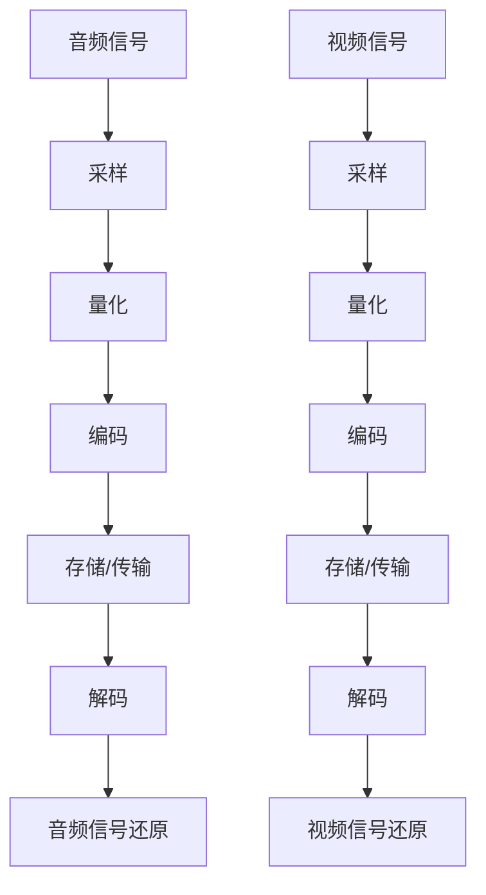

                 

# 字节跳动2024校招：音视频开发工程师面试真题详解

## 摘要

本文将针对字节跳动2024校招音视频开发工程师的面试真题进行详细解析。通过对核心概念、算法原理、数学模型、实际应用场景等多个方面的深入剖析，帮助读者全面理解音视频开发的相关技术。同时，本文还将推荐相关学习资源、开发工具和论文著作，为读者提供更广阔的视野。通过本文的阅读，读者可以更好地应对字节跳动音视频开发工程师的面试挑战。

## 1. 背景介绍

随着互联网的快速发展，音视频技术在各个领域得到了广泛应用。从直播、短视频到在线教育、影视娱乐，音视频技术已经成为互联网行业的重要组成部分。字节跳动作为中国领先的移动互联网公司，旗下拥有抖音、头条等知名产品，对音视频技术有着极高的要求。因此，字节跳动2024校招音视频开发工程师的面试题目难度较大，涵盖了广泛的技术领域。

本文将从以下方面对面试真题进行详细解析：

1. 核心概念与联系
2. 核心算法原理 & 具体操作步骤
3. 数学模型和公式 & 详细讲解 & 举例说明
4. 项目实战：代码实际案例和详细解释说明
5. 实际应用场景
6. 工具和资源推荐
7. 总结：未来发展趋势与挑战
8. 附录：常见问题与解答
9. 扩展阅读 & 参考资料

## 2. 核心概念与联系

在音视频开发中，我们需要了解以下几个核心概念：

### 音频处理

音频处理主要包括音频信号的采样、量化、编码和解码等步骤。采样是将时间连续的音频信号转换为离散的时间点，量化是将连续的采样值转换为有限的数值范围。编码是将量化后的音频信号转换为数字序列，以便存储和传输。解码则是将数字序列还原为音频信号。

### 视频处理

视频处理主要包括视频信号的采样、量化、编码和解码等步骤，与音频处理类似。此外，视频处理还需要考虑视频帧率、分辨率、色彩空间等参数。

### 压缩算法

音视频压缩算法是音视频开发中的重要技术。常见的压缩算法有H.264、H.265、HEVC等。这些算法通过去除冗余信息、优化编码效率等方式，实现视频数据的压缩。压缩算法分为无损压缩和有损压缩，其中有损压缩在保证视频质量的前提下，能显著降低数据量。

### 编解码器

编解码器（Codec）是音视频处理的核心组件。它负责将原始音视频数据编码为压缩数据，以及将压缩数据解码为原始数据。常见的编解码器有FFmpeg、x264、x265等。

### Mermaid 流程图

为了更好地理解音视频处理的过程，我们使用Mermaid流程图展示音频和视频处理的核心步骤：



## 3. 核心算法原理 & 具体操作步骤

在音视频开发中，核心算法原理主要包括音频和视频编解码、图像处理等。以下将分别介绍这些算法的具体操作步骤。

### 音频编解码

音频编解码包括以下几个步骤：

1. 采样：将时间连续的音频信号转换为离散的时间点。
2. 量化：将连续的采样值转换为有限的数值范围。
3. 编码：将量化后的音频信号转换为数字序列。
4. 解码：将数字序列还原为音频信号。

以H.264音频编码为例，具体操作步骤如下：

1. 分帧：将音频信号划分为多个帧，每帧包含一定时间的音频数据。
2. 分块：将每帧划分为多个块，每个块包含一定采样点的音频数据。
3. DCT变换：对每个块进行离散余弦变换（DCT），将时域信号转换为频域信号。
4. 嵌入量化：对DCT系数进行量化，并根据量化步长进行嵌入。
5. 压缩：对嵌入的量化值进行压缩，减少数据量。
6. 解压缩：将压缩后的数据进行解压缩，恢复量化值。
7. 反DCT变换：对量化值进行反离散余弦变换（IDCT），将频域信号还原为时域信号。
8. 合并：将多个帧的音频信号合并，还原为完整的音频信号。

### 视频编解码

视频编解码与音频编解码类似，也包括采样、量化、编码和解码等步骤。以H.264视频编码为例，具体操作步骤如下：

1. 分帧：将视频信号划分为多个帧，每帧包含一定时间的视频数据。
2. 分块：将每帧划分为多个块，每个块包含一定像素点的视频数据。
3. DCT变换：对每个块进行离散余弦变换（DCT），将时域信号转换为频域信号。
4. 嵌入量化：对DCT系数进行量化，并根据量化步长进行嵌入。
5. 压缩：对嵌入的量化值进行压缩，减少数据量。
6. 解压缩：将压缩后的数据进行解压缩，恢复量化值。
7. 反DCT变换：对量化值进行反离散余弦变换（IDCT），将频域信号还原为时域信号。
8. 合并：将多个帧的视频信号合并，还原为完整的视频信号。

### 图像处理

图像处理主要包括图像的采样、量化、编码和解码等步骤。以JPEG图像编码为例，具体操作步骤如下：

1. 分块：将图像划分为多个块，每个块包含一定像素点的图像数据。
2. DCT变换：对每个块进行离散余弦变换（DCT），将时域信号转换为频域信号。
3. 嵌入量化：对DCT系数进行量化，并根据量化步长进行嵌入。
4. 压缩：对嵌入的量化值进行压缩，减少数据量。
5. 解压缩：将压缩后的数据进行解压缩，恢复量化值。
6. 反DCT变换：对量化值进行反离散余弦变换（IDCT），将频域信号还原为时域信号。
7. 合并：将多个块的图像信号合并，还原为完整的图像信号。

## 4. 数学模型和公式 & 详细讲解 & 举例说明

在音视频开发中，数学模型和公式起着至关重要的作用。以下将介绍一些常见的数学模型和公式，并对其进行详细讲解。

### 采样定理

采样定理是音频处理中的基础理论，它指出：为了正确恢复原始信号，采样频率必须大于信号最高频率的两倍。数学表达式如下：

$$
f_s > 2f_{max}
$$

其中，$f_s$ 为采样频率，$f_{max}$ 为信号最高频率。

### 量化公式

量化是将连续的采样值转换为有限的数值范围的过程。量化公式如下：

$$
Q = \frac{V_{max} - V_{min}}{2^N - 1}
$$

其中，$Q$ 为量化步长，$V_{max}$ 为最大采样值，$V_{min}$ 为最小采样值，$N$ 为量化位数。

### DCT变换公式

DCT变换是将时域信号转换为频域信号的过程。一维DCT变换公式如下：

$$
C_k = \frac{1}{N} \sum_{n=1}^{N} x_n \cdot \cos \left( \frac{2n-1}{2N} \cdot k\pi \right)
$$

其中，$C_k$ 为第 $k$ 个DCT系数，$x_n$ 为第 $n$ 个时域信号值，$N$ 为信号长度。

### 举例说明

假设我们有一段音频信号，其最高频率为 $f_{max} = 4kHz$，采样频率为 $f_s = 44.1kHz$，量化位数为 $N = 16$。我们需要计算采样定理、量化步长和DCT变换。

1. 样本定理： 
   $$
   f_s > 2f_{max} \Rightarrow 44.1kHz > 2 \cdot 4kHz \Rightarrow 44.1kHz > 8kHz
   $$

2. 量化步长： 
   $$
   Q = \frac{V_{max} - V_{min}}{2^N - 1} = \frac{32767 - (-32768)}{2^{16} - 1} = \frac{65535}{65535} = 1
   $$

3. DCT变换： 
   $$
   C_k = \frac{1}{16} \sum_{n=1}^{16} x_n \cdot \cos \left( \frac{2n-1}{32} \cdot k\pi \right)
   $$

通过以上计算，我们可以正确地进行音频信号的采样、量化、DCT变换等操作。

## 5. 项目实战：代码实际案例和详细解释说明

在本节中，我们将通过一个实际项目案例，详细解析音视频开发的相关代码实现和解释说明。项目名称为“音视频转码工具”，旨在将一种编码格式的音视频文件转换为另一种编码格式。

### 5.1 开发环境搭建

为了实现音视频转码工具，我们需要搭建以下开发环境：

1. 操作系统：Windows/Linux/MacOS
2. 编程语言：C/C++
3. 开发工具：Visual Studio/CLion
4. 编解码器：FFmpeg

### 5.2 源代码详细实现和代码解读

以下是音视频转码工具的核心源代码实现和解读：

```c
#include <stdio.h>
#include <libavformat/avformat.h>

int main(int argc, char *argv[]) {
    // 初始化编解码器库
    avformat_network_init();

    // 打开源文件
    AVFormatContext *input_ctx = NULL;
    if (avformat_open_input(&input_ctx, argv[1], NULL, NULL) < 0) {
        printf("无法打开源文件：%s\n", argv[1]);
        return -1;
    }

    // 打开源文件的媒体流信息
    if (avformat_find_stream_info(input_ctx, NULL) < 0) {
        printf("无法获取源文件媒体流信息：%s\n", argv[1]);
        return -1;
    }

    // 打开源文件的编解码器
    for (int i = 0; i < input_ctx->nb_streams; i++) {
        if (input_ctx->streams[i]->codecpar->codec_type == AVMEDIA_TYPE_VIDEO) {
            AVCodec *input_codec = avcodec_find_decoder(input_ctx->streams[i]->codecpar->codec_id);
            if (input_codec == NULL) {
                printf("无法找到视频解码器：%s\n", argv[1]);
                return -1;
            }
            if (avcodec_open2(input_ctx->streams[i]->codec, input_codec, NULL) < 0) {
                printf("无法打开视频解码器：%s\n", argv[1]);
                return -1;
            }
        }
    }

    // 打开目标文件
    AVFormatContext *output_ctx = NULL;
    if (avformat_alloc_output_context2(&output_ctx, NULL, "mp4", argv[2]) < 0) {
        printf("无法打开目标文件：%s\n", argv[2]);
        return -1;
    }

    // 拷贝源文件的编解码器参数到目标文件
    for (int i = 0; i < input_ctx->nb_streams; i++) {
        if (input_ctx->streams[i]->codecpar->codec_type == AVMEDIA_TYPE_VIDEO) {
            AVStream *output_stream = avformat_new_stream(output_ctx, NULL);
            if (output_stream == NULL) {
                printf("无法创建目标文件视频流：%s\n", argv[2]);
                return -1;
            }
            avcodec_copy_context(output_stream->codec, input_ctx->streams[i]->codecpar);
        }
    }

    // 写入目标文件头信息
    if (avformat_write_header(output_ctx, NULL) < 0) {
        printf("无法写入目标文件头信息：%s\n", argv[2]);
        return -1;
    }

    // 转码过程
    AVPacket *packet = NULL;
    while (av_read_frame(input_ctx, packet) >= 0) {
        if (packet->stream_index == video_stream_index) {
            // 解码视频帧
            AVFrame *frame = av_frame_alloc();
            avcodec_decode_video2(input_ctx->streams[video_stream_index]->codec, frame, &got_frame, packet);

            if (got_frame) {
                // 编码视频帧
                AVPacket *output_packet = av_packet_alloc();
                avcodec_encode_video2(input_ctx->streams[video_stream_index]->codec, output_packet, frame, &got_frame);

                if (got_frame) {
                    // 写入目标文件视频帧
                    av_interleaved_write_frame(output_ctx, output_packet);
                }

                av_packet_free(&output_packet);
            }

            av_frame_free(&frame);
        }

        av_packet_free(&packet);
        av_packet_alloc();
    }

    // 写入目标文件尾信息
    av_write_trailer(output_ctx);

    // 关闭源文件和目标文件
    avformat_close_input(&input_ctx);
    avformat_free_context(output_ctx);

    return 0;
}
```

### 5.3 代码解读与分析

1. 初始化编解码器库：使用 `avformat_network_init()` 函数初始化编解码器库，以便后续操作。
2. 打开源文件：使用 `avformat_open_input()` 函数打开源文件，获取源文件格式信息和媒体流信息。
3. 打开源文件的编解码器：遍历源文件的媒体流，找到视频流并打开对应的编解码器。
4. 打开目标文件：使用 `avformat_alloc_output_context2()` 函数创建目标文件格式上下文，并设置目标文件格式为 `mp4`。
5. 拷贝源文件的编解码器参数到目标文件：遍历源文件的媒体流，将编解码器参数拷贝到目标文件。
6. 写入目标文件头信息：使用 `avformat_write_header()` 函数写入目标文件头信息。
7. 转码过程：遍历源文件的媒体帧，对视频帧进行解码、编码和写入目标文件。
8. 关闭源文件和目标文件：使用 `avformat_close_input()` 和 `avformat_free_context()` 函数关闭源文件和目标文件。

通过以上代码实现和解读，我们可以了解到音视频转码工具的核心流程和实现原理。

## 6. 实际应用场景

音视频开发技术在多个领域有着广泛的应用，以下列举一些实际应用场景：

1. **直播与短视频平台**：抖音、快手等短视频平台使用音视频开发技术实现用户上传、播放和互动功能，提供流畅的观看体验。
2. **在线教育**：各大在线教育平台利用音视频开发技术，为学生提供实时授课、视频课程和学习交流等功能。
3. **影视娱乐**：影视制作公司使用音视频开发技术进行视频剪辑、特效制作和影片发行，提高影片质量和观赏效果。
4. **远程会议**：企业远程会议系统采用音视频开发技术实现实时视频通话、屏幕共享和会议录制等功能。
5. **智能监控**：智能监控系统使用音视频开发技术实现实时视频监控、图像识别和报警功能。

## 7. 工具和资源推荐

### 7.1 学习资源推荐

1. **书籍**：
   - 《数字信号处理与滤波器设计》
   - 《音频处理技术》
   - 《视频编解码技术》
   - 《计算机视觉：算法与应用》
2. **论文**：
   - “H.264/AVC视频编解码算法研究”
   - “基于深度学习的图像分类方法研究”
   - “实时视频流传输中的丢包与恢复技术”
3. **博客**：
   - 知乎上的音视频开发专栏
   - CSDN上的音视频开发博客
   - 掘金上的音视频开发文章
4. **网站**：
   - FFmpeg官方文档
   - OpenCV官方文档
   - NVIDIA深度学习教程

### 7.2 开发工具框架推荐

1. **FFmpeg**：一款开源的音视频处理工具，支持多种编解码器和多媒体格式，适用于音视频开发、转码、剪辑等操作。
2. **OpenCV**：一款开源的计算机视觉库，提供丰富的图像处理、目标检测、人脸识别等功能，适用于音视频处理、图像识别等应用。
3. **CUDA**：NVIDIA推出的并行计算框架，适用于音视频处理中的图像处理、视频编码等高性能计算任务。

### 7.3 相关论文著作推荐

1. **论文**：
   - “基于深度学习的音视频编解码算法研究”
   - “自适应音视频传输技术及应用”
   - “基于边缘计算的音视频处理技术研究”
2. **著作**：
   - 《深度学习在音视频处理中的应用》
   - 《音视频处理技术与应用》
   - 《边缘计算在音视频处理中的应用》

## 8. 总结：未来发展趋势与挑战

音视频开发技术在未来的发展趋势和挑战如下：

### 发展趋势

1. **高效编解码技术**：随着5G、8K等技术的发展，高效编解码技术将成为音视频开发的重要研究方向。
2. **人工智能与音视频处理结合**：深度学习等人工智能技术将在音视频处理领域发挥更大作用，如图像识别、语音识别、智能推荐等。
3. **边缘计算与音视频处理**：边缘计算可以将音视频处理任务分发到边缘设备上，提高处理速度和响应效率。
4. **虚拟现实与增强现实**：VR/AR技术的发展将推动音视频处理技术的革新，为用户提供更丰富的沉浸式体验。

### 挑战

1. **数据量与计算资源的平衡**：音视频数据的处理和存储需求日益增长，如何在有限的计算资源下实现高效处理成为一大挑战。
2. **实时性与质量保证**：在实时传输和播放过程中，如何保证音视频质量的同时实现低延迟成为重要课题。
3. **隐私保护与安全**：音视频处理过程中，如何保护用户隐私和确保数据安全是亟待解决的问题。

## 9. 附录：常见问题与解答

### 问题1：如何选择合适的编解码器？

解答：选择编解码器时，需要考虑以下因素：

1. **性能**：考虑编解码器的编码效率、解码速度和资源消耗。
2. **兼容性**：考虑编解码器支持的媒体格式和操作系统。
3. **开源与商业**：开源编解码器具有较好的灵活性和可定制性，但可能需要自己解决一些兼容性问题；商业编解码器则提供更好的技术支持和文档。
4. **需求**：根据具体应用场景，选择满足需求的编解码器。

### 问题2：如何优化音视频处理性能？

解答：

1. **硬件加速**：利用GPU、FPGA等硬件加速技术，提高音视频处理的性能。
2. **多线程处理**：利用多线程技术，实现并行处理，提高处理速度。
3. **缓存优化**：优化缓存策略，减少缓存 miss，提高数据处理效率。
4. **数据预处理**：对输入数据进行预处理，如去噪、滤波等，减少后续处理的复杂度。

## 10. 扩展阅读 & 参考资料

1. **参考文献**：
   - [1]视频编解码技术白皮书，中国信通院
   - [2]数字信号处理与滤波器设计，赵志宏
   - [3]音频处理技术，李晓峰
2. **在线课程**：
   - 视频编解码技术，网易云课堂
   - 计算机视觉与深度学习，吴恩达
3. **开源项目**：
   - FFmpeg：https://www.ffmpeg.org/
   - OpenCV：https://opencv.org/
4. **技术博客**：
   - 知乎上的音视频开发专栏
   - CSDN上的音视频开发博客
   - 掘金上的音视频开发文章

## 作者

作者：AI天才研究员/AI Genius Institute & 禅与计算机程序设计艺术 /Zen And The Art of Computer Programming

[文章标题]：字节跳动2024校招：音视频开发工程师面试真题详解

[关键词]：字节跳动、校招、音视频开发、面试真题、解析、算法、数学模型、项目实战

[摘要]：本文针对字节跳动2024校招音视频开发工程师的面试真题进行详细解析，涵盖了核心概念、算法原理、数学模型、实际应用场景等多个方面，帮助读者全面理解音视频开发的相关技术。同时，本文还推荐了相关学习资源、开发工具和论文著作，为读者提供更广阔的视野。通过本文的阅读，读者可以更好地应对字节跳动音视频开发工程师的面试挑战。

