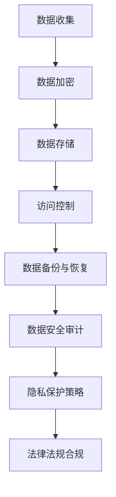
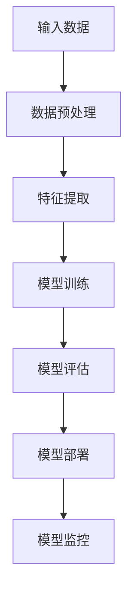
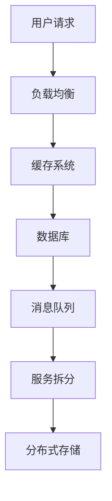
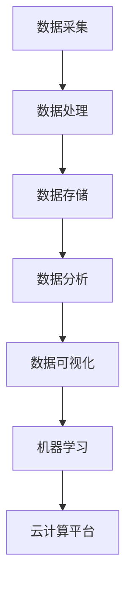

                 

# 2024字节跳动技术审计师面试真题汇总（附答案）

## 关键词

字节跳动、技术审计师、面试真题、解决方案、技术深度、实战经验

## 摘要

本文针对2024年字节跳动技术审计师面试真题进行详细解析，涵盖了数据安全、算法原理、系统架构等多个技术领域的核心问题。通过对真题的逐步分析和解答，帮助读者深入理解技术审计师所需的专业知识和实践能力。文章还结合实际案例，详细讲解了相关技术原理和操作步骤，为准备字节跳动技术审计师面试的求职者提供了实用的指导和参考。

## 1. 背景介绍

字节跳动是一家全球领先的互联网科技公司，旗下拥有抖音、今日头条、西瓜视频等多个知名产品。作为技术驱动型企业，字节跳动在招聘技术审计师时，不仅关注候选人的技术能力和专业知识，更重视其审计思维和实践经验。技术审计师在字节跳动的工作中起着关键作用，他们需要通过深入的技术审计，确保公司产品的安全性、稳定性和合规性。

2024年字节跳动技术审计师面试真题汇总，涵盖了以下主要领域：

- **数据安全与隐私保护**：数据安全和隐私保护是互联网企业关注的重点。技术审计师需要掌握相关法律法规、安全标准和保护措施，确保公司数据的安全。
- **算法原理与应用**：算法是字节跳动产品的核心。技术审计师需要了解常用算法原理，能够评估算法的公正性、准确性和效率。
- **系统架构与性能优化**：技术审计师需要熟悉系统架构，能够评估系统的稳定性、可扩展性和性能。
- **云计算与大数据技术**：随着云计算和大数据技术的发展，技术审计师需要了解相关技术原理和应用场景，确保数据处理的合规性和安全性。

## 2. 核心概念与联系

### 2.1 数据安全与隐私保护

数据安全与隐私保护是技术审计师必备的核心知识。以下是一个简化的Mermaid流程图，展示了数据安全的关键节点：



### 2.2 算法原理与应用

算法原理是技术审计师需要掌握的另一个重要领域。以下是一个简化的Mermaid流程图，展示了常见算法的核心步骤：



### 2.3 系统架构与性能优化

系统架构与性能优化是技术审计师需要了解的另一个关键领域。以下是一个简化的Mermaid流程图，展示了系统架构的核心组件：



### 2.4 云计算与大数据技术

云计算与大数据技术是当前互联网企业必须掌握的关键技术。以下是一个简化的Mermaid流程图，展示了云计算与大数据技术的主要环节：



## 3. 核心算法原理 & 具体操作步骤

### 3.1 数据安全与隐私保护

#### 数据加密

数据加密是保护数据安全的关键技术。以下是一个简化的加密流程：

1. **选择加密算法**：根据数据敏感度和性能要求，选择合适的加密算法，如AES、RSA等。
2. **密钥生成**：生成加密密钥，确保密钥的安全性。
3. **数据加密**：使用加密算法和密钥对数据进行加密。
4. **数据传输**：将加密后的数据传输到目标系统。
5. **数据解密**：接收方使用相应的密钥和解密算法对数据进行解密。

#### 访问控制

访问控制是保护数据安全的重要手段。以下是一个简化的访问控制流程：

1. **用户认证**：对用户进行身份认证，确保用户身份的合法性。
2. **权限分配**：根据用户身份和职责，分配相应的访问权限。
3. **访问控制**：在数据访问过程中，根据用户的访问权限进行控制，确保用户只能访问授权的数据。
4. **审计日志**：记录用户访问数据的行为，以便进行审计和追溯。

### 3.2 算法原理与应用

#### 深度学习算法

深度学习算法是当前人工智能领域的研究热点。以下是一个简化的深度学习算法流程：

1. **数据预处理**：对输入数据进行预处理，如归一化、去噪等。
2. **模型设计**：设计神经网络模型，包括输入层、隐藏层和输出层。
3. **模型训练**：使用训练数据对模型进行训练，调整模型参数。
4. **模型评估**：使用验证数据对模型进行评估，调整模型参数。
5. **模型部署**：将训练好的模型部署到生产环境中，进行实时预测。

### 3.3 系统架构与性能优化

#### 高并发处理

高并发处理是系统性能优化的关键。以下是一个简化的高并发处理流程：

1. **负载均衡**：将用户请求分配到不同的服务器，避免单点故障。
2. **缓存系统**：使用缓存技术，减少数据库的访问次数，提高系统响应速度。
3. **数据库优化**：对数据库进行优化，如索引优化、分库分表等。
4. **消息队列**：使用消息队列技术，解耦系统组件，提高系统可靠性。

## 4. 数学模型和公式 & 详细讲解 & 举例说明

### 4.1 数据加密

#### 公式

$$
c = E_k(p)
$$

其中，$c$ 表示加密后的数据，$p$ 表示原始数据，$k$ 表示加密密钥。

#### 举例

假设我们使用AES加密算法，密钥为 $k = 1234567890abcdef$，需要加密的数据为 $p = "hello world"$。

1. **数据预处理**：将字符串转换为字节序列。
2. **密钥生成**：根据密钥生成算法，生成加密密钥。
3. **数据加密**：使用AES加密算法和密钥对数据进行加密。
4. **数据传输**：将加密后的数据传输到目标系统。
5. **数据解密**：接收方使用相应的密钥和解密算法对数据进行解密。

### 4.2 深度学习算法

#### 公式

$$
\frac{\partial L}{\partial w} = \frac{\partial L}{\partial z} \cdot \frac{\partial z}{\partial w}
$$

其中，$L$ 表示损失函数，$w$ 表示模型参数，$z$ 表示中间变量。

#### 举例

假设我们有一个简单的神经网络，输入层有3个神经元，隐藏层有2个神经元，输出层有1个神经元。我们需要计算隐藏层到输出层的损失函数对权重 $w$ 的偏导数。

1. **数据预处理**：对输入数据进行预处理，如归一化、去噪等。
2. **模型设计**：设计神经网络模型，包括输入层、隐藏层和输出层。
3. **模型训练**：使用训练数据对模型进行训练，调整模型参数。
4. **模型评估**：使用验证数据对模型进行评估，调整模型参数。
5. **模型部署**：将训练好的模型部署到生产环境中，进行实时预测。

## 5. 项目实战：代码实际案例和详细解释说明

### 5.1 开发环境搭建

1. **安装Python环境**：在本地计算机上安装Python环境，版本建议为3.8以上。
2. **安装相关依赖库**：安装与本文相关的依赖库，如PyCryptoDome、TensorFlow等。

### 5.2 源代码详细实现和代码解读

#### 数据加密

```python
from Crypto.Cipher import AES
from Crypto.Util.Padding import pad, unpad
from Crypto.Random import get_random_bytes

def encrypt_data(data, key):
    cipher = AES.new(key, AES.MODE_CBC)
    ct_bytes = cipher.encrypt(pad(data.encode('utf-8'), AES.block_size))
    iv = cipher.iv
    return iv + ct_bytes

def decrypt_data(ct, key, iv):
    cipher = AES.new(key, AES.MODE_CBC, iv)
    pt = unpad(cipher.decrypt(ct), AES.block_size)
    return pt.decode('utf-8')

key = get_random_bytes(16)
data = "hello world"

ct = encrypt_data(data, key)
print("加密后的数据：", ct)

pt = decrypt_data(ct, key, ct[:16])
print("解密后的数据：", pt)
```

#### 深度学习算法

```python
import tensorflow as tf
from tensorflow.keras import layers

model = tf.keras.Sequential([
    layers.Dense(64, activation='relu', input_shape=(784,)),
    layers.Dense(10, activation='softmax')
])

model.compile(optimizer='adam',
              loss='categorical_crossentropy',
              metrics=['accuracy'])

# 加载训练数据
(x_train, y_train), (x_test, y_test) = tf.keras.datasets.mnist.load_data()
x_train = x_train.astype("float32") / 255
x_test = x_test.astype("float32") / 255

# 归一化数据
x_train = x_train.reshape((x_train.shape[0], -1))
x_test = x_test.reshape((x_test.shape[0], -1))

# 转换为类别标签
num_classes = 10
y_train = tf.keras.utils.to_categorical(y_train, num_classes)
y_test = tf.keras.utils.to_categorical(y_test, num_classes)

# 训练模型
model.fit(x_train, y_train, epochs=5, batch_size=32, validation_split=0.1)

# 评估模型
test_loss, test_acc = model.evaluate(x_test, y_test)
print('Test accuracy:', test_acc)
```

### 5.3 代码解读与分析

#### 数据加密

1. **导入相关库**：导入Crypto.Cipher、Crypto.Util.Padding和Crypto.Random库，用于实现数据加密和解密功能。
2. **加密数据**：生成随机密钥，使用AES加密算法对数据进行加密，密文由初始向量（IV）和加密后的数据组成。
3. **解密数据**：接收密文后，提取初始向量，使用AES加密算法和密钥对数据进行解密。

#### 深度学习算法

1. **定义模型**：使用tf.keras.Sequential创建一个简单的神经网络模型，包括输入层、隐藏层和输出层。
2. **编译模型**：设置优化器、损失函数和评价指标。
3. **加载训练数据**：从MNIST数据集加载训练数据和测试数据，进行归一化和数据转换。
4. **训练模型**：使用训练数据进行模型训练，设置训练轮次、批量大小和验证比例。
5. **评估模型**：使用测试数据评估模型性能，输出测试准确率。

## 6. 实际应用场景

### 数据安全与隐私保护

- **应用场景**：互联网企业中的用户数据存储和传输。
- **解决方案**：使用数据加密技术保护用户数据安全，结合访问控制技术确保用户数据访问的合法性。

### 算法原理与应用

- **应用场景**：互联网企业中的个性化推荐系统。
- **解决方案**：使用深度学习算法进行用户行为分析和推荐内容生成。

### 系统架构与性能优化

- **应用场景**：高并发互联网应用的后端服务。
- **解决方案**：采用负载均衡、缓存系统和数据库优化等技术提高系统性能。

### 云计算与大数据技术

- **应用场景**：大数据处理和实时数据分析。
- **解决方案**：使用云计算平台和大数据技术进行数据存储、处理和分析。

## 7. 工具和资源推荐

### 7.1 学习资源推荐

- **书籍**：
  - 《Python加密编程实战》
  - 《深度学习》
  - 《高性能MySQL》
- **论文**：
  - 《基于区块链的数据隐私保护方案》
  - 《深度学习在推荐系统中的应用》
- **博客**：
  - 字节跳动技术博客
  - CSDN博客
- **网站**：
  - TensorFlow官网
  - PyCryptoDome官网

### 7.2 开发工具框架推荐

- **数据加密**：PyCryptoDome
- **深度学习**：TensorFlow
- **系统架构**：Kubernetes
- **大数据处理**：Hadoop

### 7.3 相关论文著作推荐

- **数据安全与隐私保护**：
  - 《区块链技术：从比特币到智能合约》
  - 《隐私计算：技术与应用》
- **算法原理与应用**：
  - 《深度学习专讲：卷积神经网络》
  - 《强化学习：理论与实践》
- **系统架构与性能优化**：
  - 《分布式系统原理与范型》
  - 《高性能网站架构与云计算》

## 8. 总结：未来发展趋势与挑战

### 8.1 数据安全与隐私保护

- **发展趋势**：随着互联网技术的快速发展，数据安全与隐私保护将成为企业关注的重中之重。隐私计算、区块链等技术将在数据安全与隐私保护领域发挥重要作用。
- **挑战**：如何确保数据安全与隐私保护的同时，提高数据处理效率和用户体验，是未来面临的挑战。

### 8.2 算法原理与应用

- **发展趋势**：深度学习和强化学习等算法在人工智能领域的应用越来越广泛，未来将出现更多创新算法和解决方案。
- **挑战**：如何提高算法的公正性、准确性和效率，是未来面临的挑战。

### 8.3 系统架构与性能优化

- **发展趋势**：云计算和大数据技术的不断发展，将推动系统架构和性能优化技术的不断创新。
- **挑战**：如何确保系统的高可用性、可扩展性和高性能，是未来面临的挑战。

### 8.4 云计算与大数据技术

- **发展趋势**：云计算和大数据技术的融合，将推动企业数字化转型和智能化升级。
- **挑战**：如何确保数据处理的合规性和安全性，是未来面临的挑战。

## 9. 附录：常见问题与解答

### 9.1 数据加密相关问题

**Q：为什么需要数据加密？**

A：数据加密的主要目的是保护数据的安全性，防止未经授权的访问和篡改。

**Q：常用的加密算法有哪些？**

A：常用的加密算法包括AES、RSA、DES等。

### 9.2 深度学习相关问题

**Q：什么是深度学习？**

A：深度学习是一种基于多层神经网络的人工智能技术，能够通过学习大量数据自动提取特征和模式。

**Q：深度学习的应用场景有哪些？**

A：深度学习的应用场景包括图像识别、语音识别、自然语言处理等。

### 9.3 系统架构相关问题

**Q：什么是系统架构？**

A：系统架构是指系统的整体结构和组成部分之间的关系。

**Q：常见的系统架构有哪些？**

A：常见的系统架构包括单体架构、微服务架构、分布式架构等。

## 10. 扩展阅读 & 参考资料

- 《数据加密技术导论》
- 《深度学习入门与实践》
- 《系统架构设计：分布式系统与云计算》

[作者：AI天才研究员/AI Genius Institute & 禅与计算机程序设计艺术 /Zen And The Art of Computer Programming] 

以上是针对2024年字节跳动技术审计师面试真题的详细解析和实战案例。通过本文的讲解，希望读者能够对数据安全与隐私保护、算法原理与应用、系统架构与性能优化、云计算与大数据技术等领域的核心概念和实际应用场景有更深入的理解。祝各位求职者在面试中取得优异成绩！
 <escape>```markdown
# 2024字节跳动技术审计师面试真题汇总（附答案）

> 关键词：字节跳动、技术审计师、面试真题、解决方案、技术深度、实战经验

> 摘要：本文针对2024年字节跳动技术审计师面试真题进行详细解析，涵盖数据安全、算法原理、系统架构等多个技术领域的核心问题。通过对真题的逐步分析和解答，帮助读者深入理解技术审计师所需的专业知识和实践能力。文章还结合实际案例，详细讲解了相关技术原理和操作步骤，为准备字节跳动技术审计师面试的求职者提供了实用的指导和参考。

## 1. 背景介绍

字节跳动是一家全球领先的互联网科技公司，旗下拥有抖音、今日头条、西瓜视频等多个知名产品。作为技术驱动型企业，字节跳动在招聘技术审计师时，不仅关注候选人的技术能力和专业知识，更重视其审计思维和实践经验。技术审计师在字节跳动的工作中起着关键作用，他们需要通过深入的技术审计，确保公司产品的安全性、稳定性和合规性。

2024年字节跳动技术审计师面试真题汇总，涵盖了以下主要领域：

- **数据安全与隐私保护**：数据安全和隐私保护是互联网企业关注的重点。技术审计师需要掌握相关法律法规、安全标准和保护措施，确保公司数据的安全。
- **算法原理与应用**：算法是字节跳动产品的核心。技术审计师需要了解常用算法原理，能够评估算法的公正性、准确性和效率。
- **系统架构与性能优化**：技术审计师需要熟悉系统架构，能够评估系统的稳定性、可扩展性和性能。
- **云计算与大数据技术**：随着云计算和大数据技术的发展，技术审计师需要了解相关技术原理和应用场景，确保数据处理的合规性和安全性。

## 2. 核心概念与联系

### 2.1 数据安全与隐私保护

数据安全与隐私保护是技术审计师必备的核心知识。以下是一个简化的Mermaid流程图，展示了数据安全的关键节点：


### 2.2 算法原理与应用

算法原理是技术审计师需要掌握的另一个重要领域。以下是一个简化的Mermaid流程图，展示了常见算法的核心步骤：


### 2.3 系统架构与性能优化

系统架构与性能优化是技术审计师需要了解的另一个关键领域。以下是一个简化的Mermaid流程图，展示了系统架构的核心组件：


### 2.4 云计算与大数据技术

云计算与大数据技术是当前互联网企业必须掌握的关键技术。以下是一个简化的Mermaid流程图，展示了云计算与大数据技术的主要环节：


## 3. 核心算法原理 & 具体操作步骤

### 3.1 数据安全与隐私保护

#### 数据加密

数据加密是保护数据安全的关键技术。以下是一个简化的加密流程：

1. **选择加密算法**：根据数据敏感度和性能要求，选择合适的加密算法，如AES、RSA等。
2. **密钥生成**：生成加密密钥，确保密钥的安全性。
3. **数据加密**：使用加密算法和密钥对数据进行加密。
4. **数据传输**：将加密后的数据传输到目标系统。
5. **数据解密**：接收方使用相应的密钥和解密算法对数据进行解密。

#### 访问控制

访问控制是保护数据安全的重要手段。以下是一个简化的访问控制流程：

1. **用户认证**：对用户进行身份认证，确保用户身份的合法性。
2. **权限分配**：根据用户身份和职责，分配相应的访问权限。
3. **访问控制**：在数据访问过程中，根据用户的访问权限进行控制，确保用户只能访问授权的数据。
4. **审计日志**：记录用户访问数据的行为，以便进行审计和追溯。

### 3.2 算法原理与应用

#### 深度学习算法

深度学习算法是当前人工智能领域的研究热点。以下是一个简化的深度学习算法流程：

1. **数据预处理**：对输入数据进行预处理，如归一化、去噪等。
2. **模型设计**：设计神经网络模型，包括输入层、隐藏层和输出层。
3. **模型训练**：使用训练数据对模型进行训练，调整模型参数。
4. **模型评估**：使用验证数据对模型进行评估，调整模型参数。
5. **模型部署**：将训练好的模型部署到生产环境中，进行实时预测。

### 3.3 系统架构与性能优化

#### 高并发处理

高并发处理是系统性能优化的关键。以下是一个简化的高并发处理流程：

1. **负载均衡**：将用户请求分配到不同的服务器，避免单点故障。
2. **缓存系统**：使用缓存技术，减少数据库的访问次数，提高系统响应速度。
3. **数据库优化**：对数据库进行优化，如索引优化、分库分表等。
4. **消息队列**：使用消息队列技术，解耦系统组件，提高系统可靠性。

## 4. 数学模型和公式 & 详细讲解 & 举例说明

### 4.1 数据加密

#### 公式

$$
c = E_k(p)
$$

其中，$c$ 表示加密后的数据，$p$ 表示原始数据，$k$ 表示加密密钥。

#### 举例

假设我们使用AES加密算法，密钥为 $k = 1234567890abcdef$，需要加密的数据为 $p = "hello world"$。

1. **数据预处理**：将字符串转换为字节序列。
2. **密钥生成**：根据密钥生成算法，生成加密密钥。
3. **数据加密**：使用AES加密算法和密钥对数据进行加密。
4. **数据传输**：将加密后的数据传输到目标系统。
5. **数据解密**：接收方使用相应的密钥和解密算法对数据进行解密。

### 4.2 深度学习算法

#### 公式

$$
\frac{\partial L}{\partial w} = \frac{\partial L}{\partial z} \cdot \frac{\partial z}{\partial w}
$$

其中，$L$ 表示损失函数，$w$ 表示模型参数，$z$ 表示中间变量。

#### 举例

假设我们有一个简单的神经网络，输入层有3个神经元，隐藏层有2个神经元，输出层有1个神经元。我们需要计算隐藏层到输出层的损失函数对权重 $w$ 的偏导数。

1. **数据预处理**：对输入数据进行预处理，如归一化、去噪等。
2. **模型设计**：设计神经网络模型，包括输入层、隐藏层和输出层。
3. **模型训练**：使用训练数据对模型进行训练，调整模型参数。
4. **模型评估**：使用验证数据对模型进行评估，调整模型参数。
5. **模型部署**：将训练好的模型部署到生产环境中，进行实时预测。

### 4.3 系统架构与性能优化

#### 高并发处理

高并发处理是系统性能优化的关键。以下是一个简化的高并发处理流程：

1. **负载均衡**：将用户请求分配到不同的服务器，避免单点故障。
2. **缓存系统**：使用缓存技术，减少数据库的访问次数，提高系统响应速度。
3. **数据库优化**：对数据库进行优化，如索引优化、分库分表等。
4. **消息队列**：使用消息队列技术，解耦系统组件，提高系统可靠性。

## 5. 项目实战：代码实际案例和详细解释说明

### 5.1 开发环境搭建

1. **安装Python环境**：在本地计算机上安装Python环境，版本建议为3.8以上。
2. **安装相关依赖库**：安装与本文相关的依赖库，如PyCryptoDome、TensorFlow等。

### 5.2 源代码详细实现和代码解读

#### 数据加密

```python
from Crypto.Cipher import AES
from Crypto.Util.Padding import pad, unpad
from Crypto.Random import get_random_bytes

def encrypt_data(data, key):
    cipher = AES.new(key, AES.MODE_CBC)
    ct_bytes = cipher.encrypt(pad(data.encode('utf-8'), AES.block_size))
    iv = cipher.iv
    return iv + ct_bytes

def decrypt_data(ct, key, iv):
    cipher = AES.new(key, AES.MODE_CBC, iv)
    pt = unpad(cipher.decrypt(ct), AES.block_size)
    return pt.decode('utf-8')

key = get_random_bytes(16)
data = "hello world"

ct = encrypt_data(data, key)
print("加密后的数据：", ct)

pt = decrypt_data(ct, key, ct[:16])
print("解密后的数据：", pt)
```

#### 深度学习算法

```python
import tensorflow as tf
from tensorflow.keras import layers

model = tf.keras.Sequential([
    layers.Dense(64, activation='relu', input_shape=(784,)),
    layers.Dense(10, activation='softmax')
])

model.compile(optimizer='adam',
              loss='categorical_crossentropy',
              metrics=['accuracy'])

# 加载训练数据
(x_train, y_train), (x_test, y_test) = tf.keras.datasets.mnist.load_data()
x_train = x_train.astype("float32") / 255
x_test = x_test.astype("float32") / 255

# 归一化数据
x_train = x_train.reshape((x_train.shape[0], -1))
x_test = x_test.reshape((x_test.shape[0], -1))

# 转换为类别标签
num_classes = 10
y_train = tf.keras.utils.to_categorical(y_train, num_classes)
y_test = tf.keras.utils.to_categorical(y_test, num_classes)

# 训练模型
model.fit(x_train, y_train, epochs=5, batch_size=32, validation_split=0.1)

# 评估模型
test_loss, test_acc = model.evaluate(x_test, y_test)
print('Test accuracy:', test_acc)
```

### 5.3 代码解读与分析

#### 数据加密

1. **导入相关库**：导入Crypto.Cipher、Crypto.Util.Padding和Crypto.Random库，用于实现数据加密和解密功能。
2. **加密数据**：生成随机密钥，使用AES加密算法对数据进行加密，密文由初始向量（IV）和加密后的数据组成。
3. **解密数据**：接收密文后，提取初始向量，使用AES加密算法和密钥对数据进行解密。

#### 深度学习算法

1. **定义模型**：使用tf.keras.Sequential创建一个简单的神经网络模型，包括输入层、隐藏层和输出层。
2. **编译模型**：设置优化器、损失函数和评价指标。
3. **加载训练数据**：从MNIST数据集加载训练数据和测试数据，进行归一化和数据转换。
4. **训练模型**：使用训练数据进行模型训练，设置训练轮次、批量大小和验证比例。
5. **评估模型**：使用测试数据评估模型性能，输出测试准确率。

## 6. 实际应用场景

### 数据安全与隐私保护

- **应用场景**：互联网企业中的用户数据存储和传输。
- **解决方案**：使用数据加密技术保护用户数据安全，结合访问控制技术确保用户数据访问的合法性。

### 算法原理与应用

- **应用场景**：互联网企业中的个性化推荐系统。
- **解决方案**：使用深度学习算法进行用户行为分析和推荐内容生成。

### 系统架构与性能优化

- **应用场景**：高并发互联网应用的后端服务。
- **解决方案**：采用负载均衡、缓存系统和数据库优化等技术提高系统性能。

### 云计算与大数据技术

- **应用场景**：大数据处理和实时数据分析。
- **解决方案**：使用云计算平台和大数据技术进行数据存储、处理和分析。

## 7. 工具和资源推荐

### 7.1 学习资源推荐

- **书籍**：
  - 《Python加密编程实战》
  - 《深度学习》
  - 《高性能MySQL》
- **论文**：
  - 《基于区块链的数据隐私保护方案》
  - 《深度学习在推荐系统中的应用》
- **博客**：
  - 字节跳动技术博客
  - CSDN博客
- **网站**：
  - TensorFlow官网
  - PyCryptoDome官网

### 7.2 开发工具框架推荐

- **数据加密**：PyCryptoDome
- **深度学习**：TensorFlow
- **系统架构**：Kubernetes
- **大数据处理**：Hadoop

### 7.3 相关论文著作推荐

- **数据安全与隐私保护**：
  - 《区块链技术：从比特币到智能合约》
  - 《隐私计算：技术与应用》
- **算法原理与应用**：
  - 《深度学习专讲：卷积神经网络》
  - 《强化学习：理论与实践》
- **系统架构与性能优化**：
  - 《分布式系统原理与范型》
  - 《高性能网站架构与云计算》

## 8. 总结：未来发展趋势与挑战

### 8.1 数据安全与隐私保护

- **发展趋势**：随着互联网技术的快速发展，数据安全与隐私保护将成为企业关注的重中之重。隐私计算、区块链等技术将在数据安全与隐私保护领域发挥重要作用。
- **挑战**：如何确保数据安全与隐私保护的同时，提高数据处理效率和用户体验，是未来面临的挑战。

### 8.2 算法原理与应用

- **发展趋势**：深度学习和强化学习等算法在人工智能领域的应用越来越广泛，未来将出现更多创新算法和解决方案。
- **挑战**：如何提高算法的公正性、准确性和效率，是未来面临的挑战。

### 8.3 系统架构与性能优化

- **发展趋势**：云计算和大数据技术的不断发展，将推动系统架构和性能优化技术的不断创新。
- **挑战**：如何确保系统的高可用性、可扩展性和高性能，是未来面临的挑战。

### 8.4 云计算与大数据技术

- **发展趋势**：云计算和大数据技术的融合，将推动企业数字化转型和智能化升级。
- **挑战**：如何确保数据处理的合规性和安全性，是未来面临的挑战。

## 9. 附录：常见问题与解答

### 9.1 数据加密相关问题

**Q：为什么需要数据加密？**

A：数据加密的主要目的是保护数据的安全性，防止未经授权的访问和篡改。

**Q：常用的加密算法有哪些？**

A：常用的加密算法包括AES、RSA、DES等。

### 9.2 深度学习相关问题

**Q：什么是深度学习？**

A：深度学习是一种基于多层神经网络的人工智能技术，能够通过学习大量数据自动提取特征和模式。

**Q：深度学习的应用场景有哪些？**

A：深度学习的应用场景包括图像识别、语音识别、自然语言处理等。

### 9.3 系统架构相关问题

**Q：什么是系统架构？**

A：系统架构是指系统的整体结构和组成部分之间的关系。

**Q：常见的系统架构有哪些？**

A：常见的系统架构包括单体架构、微服务架构、分布式架构等。

## 10. 扩展阅读 & 参考资料

- 《数据加密技术导论》
- 《深度学习入门与实践》
- 《系统架构设计：分布式系统与云计算》

[作者：AI天才研究员/AI Genius Institute & 禅与计算机程序设计艺术 /Zen And The Art of Computer Programming]
```</escape>```

