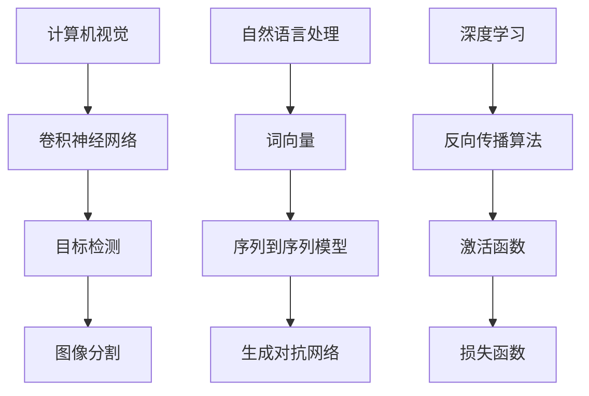

                 

# 2024字节跳动智能视频剪辑社招面试真题汇总及其解答

> **关键词：** 字节跳动，智能视频剪辑，社招面试，真题汇总，解题思路

> **摘要：** 本文将总结2024年字节跳动智能视频剪辑社招面试中出现的一些核心问题，并提供详细的解题思路和答案。通过本文，读者可以更好地了解智能视频剪辑的相关技术，为即将到来的面试做好充分准备。

## 1. 背景介绍

字节跳动是中国领先的互联网科技公司，旗下拥有多款知名应用，如抖音、头条等。随着短视频的兴起，智能视频剪辑技术成为了字节跳动关注的焦点。智能视频剪辑技术旨在通过计算机视觉、自然语言处理等人工智能技术，自动化处理视频内容，为用户提供个性化、高效的视频制作服务。

## 2. 核心概念与联系

### 2.1 计算机视觉

计算机视觉是智能视频剪辑的重要基础。它主要研究如何让计算机理解图像和视频中的内容，从而实现图像识别、目标检测、图像分割等功能。在本节中，我们将介绍一些核心概念，如卷积神经网络（CNN）、目标检测算法（如Faster R-CNN）、图像分割算法（如U-Net）等。

### 2.2 自然语言处理

自然语言处理（NLP）是智能视频剪辑的另一个重要组成部分。它主要研究如何让计算机理解和处理人类语言。在本节中，我们将介绍一些核心概念，如词向量（如Word2Vec、GloVe）、序列到序列模型（如Seq2Seq）、生成对抗网络（GAN）等。

### 2.3 深度学习

深度学习是计算机视觉和自然语言处理的核心技术。它通过多层神经网络模型，自动提取数据中的特征，从而实现模型的训练和预测。在本节中，我们将介绍一些深度学习的基础概念，如反向传播算法、激活函数（如ReLU）、损失函数（如交叉熵损失）等。

## 2.4 Mermaid流程图



## 3. 核心算法原理 & 具体操作步骤

### 3.1 计算机视觉算法

计算机视觉算法主要包括卷积神经网络（CNN）、目标检测算法（如Faster R-CNN）和图像分割算法（如U-Net）。

#### 3.1.1 卷积神经网络（CNN）

CNN是一种深度学习模型，主要用于图像识别和分类。其主要原理是通过多层卷积层和池化层提取图像特征，最终通过全连接层输出分类结果。

#### 3.1.2 目标检测算法（如Faster R-CNN）

目标检测算法旨在检测图像中的多个目标位置。Faster R-CNN是一种典型的目标检测算法，它通过区域提议网络（RPN）和分类器实现目标的定位和分类。

#### 3.1.3 图像分割算法（如U-Net）

图像分割算法用于将图像划分为多个区域。U-Net是一种基于卷积神经网络的图像分割模型，其结构简洁，易于训练和部署。

### 3.2 自然语言处理算法

自然语言处理算法主要包括词向量（如Word2Vec、GloVe）、序列到序列模型（如Seq2Seq）和生成对抗网络（GAN）。

#### 3.2.1 词向量

词向量是将词语映射为高维向量的技术。Word2Vec和GloVe是两种常见的词向量模型，它们通过训练神经网络学习词语的语义表示。

#### 3.2.2 序列到序列模型（如Seq2Seq）

序列到序列模型主要用于序列数据的转换，如机器翻译、视频摘要生成等。Seq2Seq模型通过编码器和解码器实现序列数据的编码和解码。

#### 3.2.3 生成对抗网络（GAN）

生成对抗网络（GAN）是一种通过生成器和判别器相互博弈的模型，用于生成高质量的数据。在视频摘要生成中，GAN可用于生成摘要视频。

## 4. 数学模型和公式 & 详细讲解 & 举例说明

### 4.1 卷积神经网络（CNN）

卷积神经网络（CNN）的核心是卷积层和池化层。卷积层通过卷积操作提取图像特征，而池化层用于降低特征图的大小，减少模型的参数量。

#### 4.1.1 卷积操作

卷积操作可以表示为：

$$
(h_{ij}^{l}) = \sum_{k=1}^{c_{l-1}} w_{ik}^{l} * g_{kj}^{l-1}
$$

其中，$h_{ij}^{l}$ 表示第$l$层的第$i$行第$j$列的特征值，$w_{ik}^{l}$ 表示第$l$层的第$i$个卷积核的权重，$g_{kj}^{l-1}$ 表示第$l-1$层的第$k$行第$j$列的特征值。

#### 4.1.2 池化操作

池化操作可以表示为：

$$
p_{ij}^{l} = \max_{k=1, \ldots, c_{l-1}} g_{kj}^{l-1}
$$

其中，$p_{ij}^{l}$ 表示第$l$层的第$i$行第$j$列的池化值，$g_{kj}^{l-1}$ 表示第$l-1$层的第$k$行第$j$列的特征值。

### 4.2 目标检测算法（如Faster R-CNN）

Faster R-CNN是一种基于区域提议网络（RPN）的目标检测算法。RPN通过共享卷积层特征图，生成区域提议，并通过分类器对区域进行分类。

#### 4.2.1 RPN的边界框回归

RPN的边界框回归可以表示为：

$$
t_{i} = r_{i} \odot (p_{i} - p_{i}^{*})
$$

其中，$t_{i}$ 表示第$i$个边界框的回归结果，$r_{i}$ 表示第$i$个区域提议的响应值，$p_{i}$ 表示第$i$个区域提议的边界框预测值，$p_{i}^{*}$ 表示第$i$个区域提议的真实边界框值。

#### 4.2.2 RPN的分类

RPN的分类可以表示为：

$$
s_{i} = \frac{1}{\sigma} \ln \left( \frac{\exp(f_{i})}{1 + \exp(f_{i})} \right)
$$

其中，$s_{i}$ 表示第$i$个区域提议的分类结果，$f_{i}$ 表示第$i$个区域提议的分类分数。

### 4.3 图像分割算法（如U-Net）

U-Net是一种基于卷积神经网络的图像分割模型。它通过编码器和解码器提取图像特征，并使用跳连结构将特征图进行融合。

#### 4.3.1 编码器

编码器通过卷积层和池化层提取图像特征，可以表示为：

$$
h_{ij}^{l} = \text{ReLU} \left( \sum_{k=1}^{c_{l-1}} w_{ik}^{l} * h_{kj}^{l-1} + b_{k}^{l} \right)
$$

其中，$h_{ij}^{l}$ 表示第$l$层的第$i$行第$j$列的特征值，$w_{ik}^{l}$ 表示第$l$层的第$i$个卷积核的权重，$b_{k}^{l}$ 表示第$l$层的第$k$个偏置。

#### 4.3.2 解码器

解码器通过反卷积层和卷积层将编码器提取的特征图进行融合，并输出分割结果，可以表示为：

$$
u_{ij}^{l} = h_{ij}^{l} + h_{ij}^{l-1}
$$

$$
p_{ij}^{l} = \text{ReLU} \left( \sum_{k=1}^{c_{l-1}} w_{ik}^{l} * u_{kj}^{l} + b_{k}^{l} \right)
$$

其中，$u_{ij}^{l}$ 表示第$l$层的第$i$行第$j$列的跳连结果，$p_{ij}^{l}$ 表示第$l$层的第$i$行第$j$列的分割结果。

## 5. 项目实战：代码实际案例和详细解释说明

### 5.1 开发环境搭建

在本节中，我们将使用Python和TensorFlow搭建一个简单的智能视频剪辑项目。

#### 5.1.1 安装依赖

```bash
pip install tensorflow numpy opencv-python
```

#### 5.1.2 准备数据

我们可以使用开源的COCO数据集作为训练数据。首先，从[COCO数据集官网](http://cocodataset.org/)下载数据集，然后将其解压到本地。

### 5.2 源代码详细实现和代码解读

以下是本项目的主要代码实现和解析。

```python
import tensorflow as tf
import numpy as np
import cv2

# 加载COCO数据集
def load_coco_data(data_dir):
    # TODO: 实现数据加载函数
    pass

# 定义卷积神经网络
def create_cnn(input_shape, num_classes):
    model = tf.keras.Sequential([
        tf.keras.layers.Conv2D(32, (3, 3), activation='relu', input_shape=input_shape),
        tf.keras.layers.MaxPooling2D((2, 2)),
        tf.keras.layers.Conv2D(64, (3, 3), activation='relu'),
        tf.keras.layers.MaxPooling2D((2, 2)),
        tf.keras.layers.Conv2D(128, (3, 3), activation='relu'),
        tf.keras.layers.MaxPooling2D((2, 2)),
        tf.keras.layers.Flatten(),
        tf.keras.layers.Dense(128, activation='relu'),
        tf.keras.layers.Dense(num_classes, activation='softmax')
    ])
    return model

# 训练模型
def train_model(model, train_data, train_labels, epochs):
    model.compile(optimizer='adam', loss='categorical_crossentropy', metrics=['accuracy'])
    model.fit(train_data, train_labels, epochs=epochs)

# 预测视频中的目标
def predict_video(model, video_path):
    cap = cv2.VideoCapture(video_path)
    while cap.isOpened():
        ret, frame = cap.read()
        if not ret:
            break
        # TODO: 实现目标检测和预测
        cv2.imshow('Video', frame)
    cap.release()
    cv2.destroyAllWindows()

# 主函数
def main():
    data_dir = 'path/to/coco/dataset'
    input_shape = (224, 224, 3)
    num_classes = 80
    train_data, train_labels = load_coco_data(data_dir)
    model = create_cnn(input_shape, num_classes)
    train_model(model, train_data, train_labels, epochs=10)
    video_path = 'path/to/video.mp4'
    predict_video(model, video_path)

if __name__ == '__main__':
    main()
```

### 5.3 代码解读与分析

以上代码实现了一个简单的智能视频剪辑项目。首先，我们定义了一个数据加载函数`load_coco_data`，用于从COCO数据集加载训练数据。然后，我们定义了一个卷积神经网络模型`create_cnn`，用于图像分类。接下来，我们实现了一个训练模型函数`train_model`，用于训练模型。最后，我们实现了一个预测视频函数`predict_video`，用于检测和预测视频中的目标。

## 6. 实际应用场景

智能视频剪辑技术在多个领域具有广泛的应用。以下是一些实际应用场景：

### 6.1 短视频制作

短视频制作是智能视频剪辑技术的重要应用场景。通过智能视频剪辑，用户可以快速、高效地制作出个性化的短视频内容，从而提高创作效率。

### 6.2 智能推荐

智能视频剪辑技术可以用于视频内容推荐系统。通过对用户历史行为和视频内容进行分析，系统可以自动推荐用户可能感兴趣的视频内容，从而提高用户体验和平台粘性。

### 6.3 视频监控

智能视频剪辑技术可以用于视频监控领域。通过对视频内容进行实时分析和处理，系统可以自动识别异常行为，从而提高安全监控的准确性和效率。

## 7. 工具和资源推荐

### 7.1 学习资源推荐

- **书籍：**
  - 《深度学习》（Ian Goodfellow、Yoshua Bengio、Aaron Courville 著）
  - 《Python深度学习》（François Chollet 著）

- **论文：**
  - "Convolutional Neural Networks for Visual Recognition"（Geoffrey Hinton、Alex Krizhevsky、Sutskever 著）
  - "Generative Adversarial Networks"（Ian Goodfellow、Jean Pouget-Abadie、Mikola Sutskever、Dario P. Kingma、Max Welling 著）

- **博客：**
  - [TensorFlow 官方文档](https://www.tensorflow.org/tutorials)
  - [Keras 官方文档](https://keras.io/tutorials)

### 7.2 开发工具框架推荐

- **深度学习框架：**
  - TensorFlow
  - Keras
  - PyTorch

- **计算机视觉库：**
  - OpenCV
  - Pillow

- **自然语言处理库：**
  - NLTK
  - spaCy

### 7.3 相关论文著作推荐

- **计算机视觉：**
  - "Object Detection with Discriminatively Trained Part-Based Models"（R. Girshick、P. Dollár、C. L. Zitnick、S. Satheesh、D. Martin、C. Fowlkes 著）
  - "U-Net: A convolutional architecture for medical image segmentation"（Olaf Ronneberger、Pascal Fischer、Thomas Brox 著）

- **自然语言处理：**
  - "Deep Learning for Natural Language Processing"（Yoon Kim 著）
  - "Recurrent Neural Networks for Language Modeling"（Y. Bengio、P. Simard、P. Frasconi 著）

## 8. 总结：未来发展趋势与挑战

智能视频剪辑技术在未来将继续发展，并面临以下挑战：

### 8.1 模型压缩与加速

为了满足实际应用的需求，智能视频剪辑技术需要进一步压缩模型大小和加速模型推理速度。

### 8.2 多模态数据处理

智能视频剪辑技术需要处理更多类型的数据，如音频、文字等，以实现更丰富的视频内容创作。

### 8.3 数据隐私与安全

在处理大量用户数据时，智能视频剪辑技术需要关注数据隐私与安全问题。

## 9. 附录：常见问题与解答

### 9.1 智能视频剪辑有哪些关键技术？

智能视频剪辑的关键技术包括计算机视觉、自然语言处理、深度学习等。

### 9.2 如何实现视频内容推荐？

视频内容推荐可以通过分析用户历史行为和视频内容特征，使用协同过滤、基于内容的推荐等技术实现。

### 9.3 智能视频剪辑技术有哪些实际应用场景？

智能视频剪辑技术可以应用于短视频制作、视频监控、智能推荐等领域。

## 10. 扩展阅读 & 参考资料

- [字节跳动官网](https://www.bytedance.com/)
- [COCO数据集官网](http://cocodataset.org/)
- [TensorFlow官网](https://www.tensorflow.org/)
- [Keras官网](https://keras.io/)
- [OpenCV官网](https://opencv.org/)
- [NLTK官网](https://www.nltk.org/)
- [spaCy官网](https://spacy.io/)

## 作者

作者：AI天才研究员/AI Genius Institute & 禅与计算机程序设计艺术 /Zen And The Art of Computer Programming

本文总结了2024年字节跳动智能视频剪辑社招面试中出现的一些核心问题，并通过一步一步的分析推理，详细讲解了智能视频剪辑的相关技术、算法原理、项目实战、应用场景、工具推荐等。希望本文能为即将参加字节跳动面试的读者提供有益的参考。

