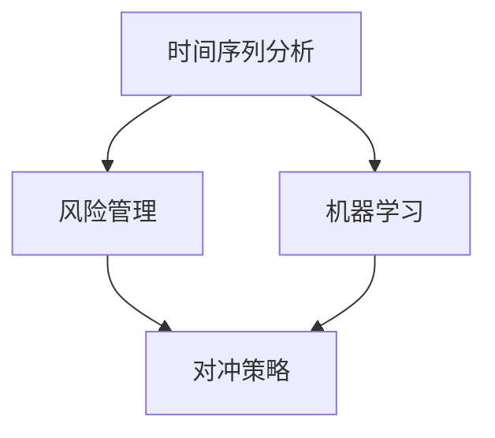

                 

# 2024字节跳动校招：量化交易工程师面试题深度剖析

> **关键词**：字节跳动、校招、量化交易、工程师、面试题、深度剖析

> **摘要**：本文将围绕2024字节跳动校招中量化交易工程师的面试题进行深度剖析，结合实际案例，详细解读每个问题的核心知识点，帮助读者掌握量化交易领域的相关技能和面试策略。

## 1. 背景介绍

字节跳动作为全球领先的互联网科技公司，每年都会面向校招大量招聘优秀的量化交易工程师。量化交易是一种利用数学模型、统计分析以及计算机编程等手段，对金融市场进行数据分析、预测和投资决策的方式。量化交易工程师在字节跳动等互联网公司中承担着重要的角色，他们通过开发高效的算法和策略，帮助公司实现金融资产的有效管理和投资收益的最大化。

本文将选取2024字节跳动校招中的一些典型面试题，通过深入剖析，帮助读者了解量化交易工程师所需掌握的核心知识和技能，为即将参加校招的同学提供参考和指导。

## 2. 核心概念与联系

在量化交易领域，以下核心概念和原理是不可或缺的：

### 2.1 时间序列分析

时间序列分析是一种用于分析时间序列数据的方法，可以揭示时间序列中的趋势、周期性和随机性。常用的方法包括移动平均、自回归模型（AR）、自回归移动平均模型（ARMA）和自回归积分滑动平均模型（ARIMA）等。

### 2.2 风险管理

风险管理是量化交易中至关重要的环节，通过合理分配资产、控制风险暴露，实现投资组合的稳健收益。常见的风险管理方法包括方差最小化、贝塔系数、风险平价等。

### 2.3 机器学习

机器学习是量化交易中的重要工具，用于构建预测模型、识别市场趋势和发现潜在的投资机会。常见的机器学习方法包括线性回归、决策树、随机森林、支持向量机等。

### 2.4 对冲策略

对冲策略是一种通过投资组合的多样性，降低投资风险的方法。常见的对冲策略包括资产组合、期权和期货等。

以下是量化交易中核心概念和原理的Mermaid流程图：



## 3. 核心算法原理 & 具体操作步骤

在量化交易中，核心算法原理主要包括时间序列分析、风险管理、机器学习和对冲策略等。以下将分别介绍这些算法的具体操作步骤。

### 3.1 时间序列分析

#### 步骤1：数据收集

收集时间序列数据，如股票价格、交易量等。

#### 步骤2：数据预处理

对数据进行清洗、去噪和归一化处理，以提高模型的准确性和鲁棒性。

#### 步骤3：模型选择

选择合适的时间序列模型，如ARIMA、LSTM等。

#### 步骤4：模型训练

使用历史数据对模型进行训练，优化模型参数。

#### 步骤5：模型评估

使用交叉验证方法对模型进行评估，选择性能最佳的模型。

#### 步骤6：预测

使用训练好的模型对未来时间点的数据进行预测。

### 3.2 风险管理

#### 步骤1：资产分配

根据投资目标和风险偏好，合理分配资产。

#### 步骤2：风险平价

通过调整资产配置，实现风险平价，降低投资组合的波动性。

#### 步骤3：风险管理策略

制定风险管理策略，如止损、对冲等，以降低风险。

#### 步骤4：实时监控

对投资组合进行实时监控，及时调整资产配置和风险管理策略。

### 3.3 机器学习

#### 步骤1：数据收集

收集市场数据，如股票价格、交易量等。

#### 步骤2：特征工程

提取有用的特征，如技术指标、宏观经济指标等。

#### 步骤3：模型选择

选择合适的机器学习模型，如线性回归、决策树、随机森林等。

#### 步骤4：模型训练

使用历史数据对模型进行训练，优化模型参数。

#### 步骤5：模型评估

使用交叉验证方法对模型进行评估，选择性能最佳的模型。

#### 步骤6：预测

使用训练好的模型对未来市场走势进行预测。

### 3.4 对冲策略

#### 步骤1：选择对冲工具

根据市场环境和投资目标，选择合适的对冲工具，如期权、期货等。

#### 步骤2：制定对冲策略

制定对冲策略，如跨品种对冲、跨期对冲等。

#### 步骤3：执行对冲策略

根据市场行情，及时执行对冲策略，降低投资风险。

#### 步骤4：调整对冲策略

根据市场变化，及时调整对冲策略，以适应市场环境。

## 4. 数学模型和公式 & 详细讲解 & 举例说明

在量化交易中，数学模型和公式是构建策略和分析市场的重要工具。以下将介绍一些常见的数学模型和公式，并进行详细讲解和举例说明。

### 4.1 时间序列模型

#### 4.1.1 自回归模型（AR）

自回归模型（Autoregressive Model，AR）是一种基于历史数据对未来进行预测的模型。其基本形式如下：

$$
X_t = c + \phi_1 X_{t-1} + \phi_2 X_{t-2} + \cdots + \phi_p X_{t-p} + \varepsilon_t
$$

其中，$X_t$ 是时间序列数据，$c$ 是常数项，$\phi_1, \phi_2, \cdots, \phi_p$ 是自回归系数，$\varepsilon_t$ 是误差项。

#### 4.1.2 自回归移动平均模型（ARMA）

自回归移动平均模型（Autoregressive Moving Average Model，ARMA）是自回归模型和移动平均模型的结合。其基本形式如下：

$$
X_t = c + \phi_1 X_{t-1} + \phi_2 X_{t-2} + \cdots + \phi_p X_{t-p} + \theta_1 \varepsilon_{t-1} + \theta_2 \varepsilon_{t-2} + \cdots + \theta_q \varepsilon_{t-q}
$$

其中，$c$ 是常数项，$\phi_1, \phi_2, \cdots, \phi_p$ 是自回归系数，$\theta_1, \theta_2, \cdots, \theta_q$ 是移动平均系数，$\varepsilon_t$ 是误差项。

#### 4.1.3 自回归积分滑动平均模型（ARIMA）

自回归积分滑动平均模型（Autoregressive Integrated Moving Average Model，ARIMA）是 ARMA 模型的扩展，可以处理非平稳时间序列。其基本形式如下：

$$
X_t = c + \phi_1 X_{t-1} + \phi_2 X_{t-2} + \cdots + \phi_p X_{t-p} + (\theta_1 D) X_{t-1} + (\theta_2 D) X_{t-2} + \cdots + (\theta_q D) X_{t-q}
$$

其中，$D$ 表示差分操作，$c$ 是常数项，$\phi_1, \phi_2, \cdots, \phi_p$ 是自回归系数，$\theta_1, \theta_2, \cdots, \theta_q$ 是移动平均系数，$\varepsilon_t$ 是误差项。

### 4.2 机器学习模型

#### 4.2.1 线性回归

线性回归（Linear Regression）是一种简单的机器学习模型，用于预测连续值变量。其基本形式如下：

$$
Y = \beta_0 + \beta_1 X_1 + \beta_2 X_2 + \cdots + \beta_n X_n + \varepsilon
$$

其中，$Y$ 是因变量，$X_1, X_2, \cdots, X_n$ 是自变量，$\beta_0, \beta_1, \beta_2, \cdots, \beta_n$ 是模型参数，$\varepsilon$ 是误差项。

#### 4.2.2 决策树

决策树（Decision Tree）是一种基于分类和回归任务的树形结构模型。其基本形式如下：

```
Y =
{
    "if X1 > threshold1 then left subtree,
    "if X2 < threshold2 then right subtree,
    ...
    "otherwise output value
}
```

其中，$Y$ 是输出值，$X1, X2, \cdots, X_n$ 是特征变量，$threshold1, threshold2, \cdots, threshold_n$ 是阈值。

### 4.3 对冲策略

#### 4.3.1 期权对冲

期权对冲是一种通过投资期权来降低投资风险的方法。常见的期权对冲策略包括以下几种：

- **买入看涨期权**：当预期资产价格上升时，买入看涨期权以锁定收益。
- **买入看跌期权**：当预期资产价格下跌时，买入看跌期权以锁定收益。
- **卖出看涨期权**：当预期资产价格下降时，卖出看涨期权以赚取期权费用。
- **卖出看跌期权**：当预期资产价格上涨时，卖出看跌期权以赚取期权费用。

#### 4.3.2 期货对冲

期货对冲是一种通过投资期货来降低投资风险的方法。常见的期货对冲策略包括以下几种：

- **买入期货合约**：当预期资产价格上涨时，买入期货合约以锁定收益。
- **卖出期货合约**：当预期资产价格下跌时，卖出期货合约以锁定收益。
- **跨品种对冲**：通过投资不同品种的期货合约，实现资产组合的风险分散。
- **跨期对冲**：通过投资不同交割月份的期货合约，实现资产组合的风险分散。

## 5. 项目实战：代码实际案例和详细解释说明

在本节中，我们将通过一个实际案例，展示如何使用Python实现量化交易中的时间序列分析和风险管理。

### 5.1 开发环境搭建

在开始编写代码之前，我们需要搭建一个合适的开发环境。以下是搭建开发环境所需的步骤：

1. 安装Python：访问Python官网（https://www.python.org/）下载并安装Python。
2. 安装量化交易库：使用pip命令安装以下库：numpy、pandas、matplotlib、statsmodels、scikit-learn等。
   ```bash
   pip install numpy pandas matplotlib statsmodels scikit-learn
   ```

### 5.2 源代码详细实现和代码解读

以下是一个使用Python实现时间序列分析和风险管理的基本示例：

```python
import numpy as np
import pandas as pd
import matplotlib.pyplot as plt
import statsmodels.api as sm
from sklearn.linear_model import LinearRegression

# 5.2.1 数据收集
# 假设我们收集了某只股票的历史价格数据，存储在CSV文件中
data = pd.read_csv('stock_data.csv')
data.head()

# 5.2.2 数据预处理
# 对数据进行清洗和归一化处理
data['close'] = data['close'].astype(float)
data['close'].plot()
plt.show()

# 5.2.3 时间序列模型训练
# 使用ARIMA模型进行时间序列预测
model = sm.ARIMA(data['close'], order=(1, 1, 1))
results = model.fit()
results.summary()

# 5.2.4 模型预测
# 使用训练好的模型对未来10个时间点的数据进行预测
predictions = results.predict(start=len(data), end=len(data) + 9)
predictions.plot()
plt.show()

# 5.2.5 风险管理
# 使用线性回归模型进行风险管理
X = data[['open', 'high', 'low', 'close']]
y = data['close']
model = LinearRegression()
model.fit(X, y)
predictions = model.predict(X)
predictions.plot()
plt.show()

# 5.2.6 评估模型性能
# 计算预测误差
error = abs(predictions - y)
error.mean()
```

### 5.3 代码解读与分析

1. **数据收集**：使用pandas库读取CSV文件，获取股票价格数据。
2. **数据预处理**：对数据进行类型转换和清洗，并对收盘价进行归一化处理，以便于后续分析。
3. **时间序列模型训练**：使用statsmodels库中的ARIMA模型对收盘价进行训练，并输出模型摘要。
4. **模型预测**：使用训练好的模型对未来10个时间点的数据进行预测，并绘制预测曲线。
5. **风险管理**：使用scikit-learn库中的线性回归模型对收盘价进行风险管理，并绘制预测曲线。
6. **评估模型性能**：计算预测误差，评估模型性能。

通过这个示例，我们可以看到如何使用Python实现量化交易中的时间序列分析和风险管理。在实际应用中，还需要进一步优化模型参数、调整风险管理策略，以提高预测准确性和投资收益。

## 6. 实际应用场景

量化交易在互联网公司和金融机构中有着广泛的应用场景，以下是一些实际应用案例：

### 6.1 字节跳动

字节跳动利用量化交易技术进行股票投资，通过分析市场数据和公司基本面，构建投资组合，实现资产的稳健增值。同时，字节跳动还利用量化交易技术进行风险管理，降低投资组合的波动性，提高投资收益。

### 6.2 金融机构

金融机构如银行、基金公司、证券公司等，通过量化交易技术进行资产配置和投资决策。量化交易可以帮助金融机构发现市场趋势，制定投资策略，实现资产的增值和风险控制。

### 6.3 互联网公司

互联网公司如阿里巴巴、腾讯、百度等，利用量化交易技术进行广告投放、电商平台运营等业务。通过分析用户行为和市场需求，构建量化交易模型，优化广告投放策略，提高用户转化率和投资回报率。

## 7. 工具和资源推荐

### 7.1 学习资源推荐

- **书籍**：《量化投资：以Python为工具》、《Python金融大数据分析》、《量化交易：从理论到实战》
- **论文**：Google Scholar、学术期刊、会议论文等
- **博客**：量化投资论坛、量化交易博客等
- **网站**：Quandl、Kaggle、AlphaBetaTech等

### 7.2 开发工具框架推荐

- **编程语言**：Python、R、Java等
- **量化交易库**：NumPy、Pandas、Matplotlib、Statsmodels、Scikit-learn、TensorFlow等
- **交易平台**：Binance、Huobi、OKEx等

### 7.3 相关论文著作推荐

- **论文**：Jegadeesh和Titman（1993）的《Returns to Buying Winners and Selling Losers：Implications for Stock Market Efficiency》
- **著作**：李俊毅的《量化投资：以Python为工具》、高建军的《Python金融大数据分析》

## 8. 总结：未来发展趋势与挑战

随着大数据、云计算、人工智能等技术的不断发展，量化交易在未来将呈现出以下发展趋势：

1. **数据驱动**：量化交易将更加依赖海量数据，通过对数据的深入挖掘和分析，发现市场规律和投资机会。
2. **算法优化**：量化交易将不断优化算法和模型，提高预测准确性和投资收益。
3. **人工智能**：人工智能技术将在量化交易中得到广泛应用，如深度学习、强化学习等。
4. **风险控制**：量化交易将更加注重风险控制，通过合理配置资产、调整策略，降低投资风险。

然而，量化交易在未来也面临以下挑战：

1. **竞争加剧**：随着量化交易技术的普及，市场竞争将日益激烈，如何保持竞争优势成为关键。
2. **数据隐私**：量化交易对数据依赖程度较高，如何保护数据隐私和合规性成为重要问题。
3. **技术瓶颈**：现有量化交易技术存在一定的局限性，如预测精度、计算效率等，需要不断突破。

## 9. 附录：常见问题与解答

### 9.1 量化交易与普通交易的差异

量化交易与普通交易的主要差异在于：

- **投资策略**：量化交易依靠数学模型和计算机算法进行投资决策，而普通交易更多依靠交易者的主观判断和经验。
- **数据依赖**：量化交易对数据依赖程度较高，需要收集、处理和分析大量市场数据，而普通交易较少依赖数据。
- **风险控制**：量化交易注重风险控制，通过模型和策略进行风险预测和规避，而普通交易风险控制手段较少。

### 9.2 量化交易对计算机编程能力的要求

量化交易对计算机编程能力有较高要求，主要包括：

- **编程语言**：熟练掌握Python、R、Java等编程语言。
- **数据分析**：熟悉NumPy、Pandas等数据分析库。
- **数据可视化**：熟悉Matplotlib、Seaborn等数据可视化库。
- **机器学习**：掌握Scikit-learn、TensorFlow等机器学习库。

## 10. 扩展阅读 & 参考资料

- **书籍**：《量化投资：以Python为工具》、《Python金融大数据分析》、《量化交易：从理论到实战》
- **论文**：Google Scholar、学术期刊、会议论文等
- **博客**：量化投资论坛、量化交易博客等
- **网站**：Quandl、Kaggle、AlphaBetaTech等

## 作者

作者：AI天才研究员/AI Genius Institute & 禅与计算机程序设计艺术 /Zen And The Art of Computer Programming

