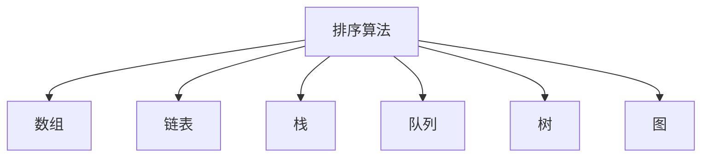

                 

# 2024字节跳动社招算法面试题汇总与解析

> 关键词：字节跳动、社招、算法面试、问题解析、技术发展、面试策略

> 摘要：本文针对2024年字节跳动社招算法面试的常见问题进行汇总与详细解析，旨在帮助算法工程师和求职者更好地准备面试，了解行业动态，掌握核心算法原理与应用。文章分为背景介绍、核心概念与联系、核心算法原理与操作步骤、数学模型与公式、项目实战、实际应用场景、工具和资源推荐、总结与未来发展趋势等多个部分，全面剖析了面试中的关键知识点和实际应用技巧。

## 1. 背景介绍

字节跳动（ByteDance）是一家全球领先的科技公司，以其创新的算法和内容推荐系统在市场上脱颖而出。在过去的几年里，字节跳动迅速发展成为全球最大的互联网公司之一，其旗下的产品如抖音、今日头条等拥有海量用户。因此，字节跳动的社招算法面试备受关注，成为众多求职者的目标。

随着大数据、人工智能和云计算等技术的快速发展，算法工程师在字节跳动等互联网公司中扮演着至关重要的角色。算法工程师需要具备深厚的计算机科学和数学背景，熟练掌握各种算法和数据结构，能够解决复杂的问题，并在实际项目中应用。

本文将围绕2024年字节跳动社招算法面试中常见的题型和知识点，进行系统性的汇总与解析，帮助求职者更好地应对面试挑战。

## 2. 核心概念与联系

为了更好地理解字节跳动社招算法面试的核心问题，我们首先需要了解一些基本概念和它们之间的联系。

### 2.1 算法

算法是一系列解决问题的步骤和指导方针，是计算机科学的基础。在算法面试中，常见的算法包括排序算法、查找算法、动态规划、图算法等。这些算法在不同的应用场景中有着广泛的应用，是面试考察的重点。

### 2.2 数据结构

数据结构是用于存储和组织数据的方式，常见的有数组、链表、栈、队列、树、图等。数据结构的选择直接影响算法的效率和性能。在面试中，数据结构的选择和应用是考察的重点。

### 2.3 数学模型

数学模型是利用数学语言描述现实问题的方法，常见的有线性回归、逻辑回归、决策树、神经网络等。数学模型在机器学习和人工智能领域有着广泛的应用，是面试中不可或缺的一部分。

### 2.4 算法与数据结构的联系

算法和数据结构密切相关，算法需要依赖于合适的数据结构来实现。例如，在排序算法中，不同的数据结构会影响排序的时间复杂度和空间复杂度。在面试中，考察算法和数据结构的结合是常见的题型。

### 2.5 Mermaid 流程图

为了更清晰地展示算法和数据结构的联系，我们可以使用Mermaid流程图来描述。以下是一个简单的Mermaid流程图示例：



## 3. 核心算法原理 & 具体操作步骤

在字节跳动社招算法面试中，核心算法原理和具体操作步骤是考察的重点。以下是一些常见的算法原理和操作步骤：

### 3.1 排序算法

排序算法是面试中的常见题型，主要包括冒泡排序、选择排序、插入排序、快速排序、归并排序等。以下以冒泡排序为例，介绍其原理和具体操作步骤：

**原理：** 冒泡排序是一种简单的排序算法，通过重复遍历要排序的数列，比较相邻的两个元素的大小，若它们的顺序错误就把它们交换过来。遍历数列的工作是重复地进行，直到没有再需要交换的元素为止。

**操作步骤：**

1. 从数列的第一对相邻元素开始比较，如果第一个比第二个大，就交换它们两个；
2. 移动到下一对相邻元素，按照同样的方法进行比较和交换；
3. 重复以上步骤，直到没有需要交换的元素。

**示例代码：**

```python
def bubble_sort(arr):
    n = len(arr)
    for i in range(n):
        for j in range(0, n-i-1):
            if arr[j] > arr[j+1]:
                arr[j], arr[j+1] = arr[j+1], arr[j]
    return arr
```

### 3.2 查找算法

查找算法是用于在数据集合中查找特定元素的算法，常见的有二分查找、顺序查找等。以下以二分查找为例，介绍其原理和具体操作步骤：

**原理：** 二分查找算法是一种高效的查找算法，它通过将数据集合分为两半，递归或迭代地在某一区间内查找特定元素。每次比较都会缩小查找区间，直到找到目标元素或确定元素不存在。

**操作步骤：**

1. 确定要查找的数据集合；
2. 确定查找区间的上下界（初始状态下，上下界分别为数据集合的首尾索引）；
3. 计算中间索引，与目标元素进行比较；
4. 如果中间元素等于目标元素，查找成功；
5. 如果中间元素大于目标元素，递归或迭代地查找左半边区间；
6. 如果中间元素小于目标元素，递归或迭代地查找右半边区间；
7. 重复以上步骤，直到找到目标元素或确定元素不存在。

**示例代码：**

```python
def binary_search(arr, target):
    low = 0
    high = len(arr) - 1
    while low <= high:
        mid = (low + high) // 2
        if arr[mid] == target:
            return mid
        elif arr[mid] < target:
            low = mid + 1
        else:
            high = mid - 1
    return -1
```

### 3.3 动态规划

动态规划是一种解决优化问题的算法思想，其核心思想是将复杂问题分解为相互重叠的子问题，通过求解子问题的最优解来构建原问题的最优解。以下以斐波那契数列为例，介绍其原理和具体操作步骤：

**原理：** 斐波那契数列是一个经典的动态规划问题，其递推关系为`F(n) = F(n-1) + F(n-2)`，其中`F(0) = 0`，`F(1) = 1`。

**操作步骤：**

1. 初始化一个数组`dp`，长度为`n+1`，其中`dp[0] = 0`，`dp[1] = 1`；
2. 遍历数组`dp`，从`i=2`开始，依次计算`dp[i]`的值，利用递推关系`dp[i] = dp[i-1] + dp[i-2]`；
3. 返回`dp[n]`作为斐波那契数列的第`n`项。

**示例代码：**

```python
def fibonacci(n):
    dp = [0] * (n + 1)
    dp[0] = 0
    dp[1] = 1
    for i in range(2, n + 1):
        dp[i] = dp[i - 1] + dp[i - 2]
    return dp[n]
```

### 3.4 图算法

图算法是解决图相关问题的算法集合，常见的有深度优先搜索（DFS）、广度优先搜索（BFS）、最短路径算法（Dijkstra算法、Floyd算法）等。以下以深度优先搜索为例，介绍其原理和具体操作步骤：

**原理：** 深度优先搜索是一种用于遍历图的算法，其基本思想是从一个起点开始，沿着一条路径不断深入，直到该路径不能再深入为止，然后回溯到上一个节点，继续寻找新的路径。

**操作步骤：**

1. 初始化一个访问数组`visited`，用于记录节点是否被访问；
2. 从起点开始，将其标记为已访问，并将其相邻的未访问节点加入队列；
3. 从队列中取出一个节点，将其相邻的未访问节点加入队列，并继续取出下一个节点，重复步骤3，直到队列为空；
4. 返回遍历得到的路径。

**示例代码：**

```python
def dfs(graph, start):
    visited = set()
    stack = [(start, [])]
    while stack:
        node, path = stack.pop()
        if node not in visited:
            visited.add(node)
            path.append(node)
            for neighbor in graph[node]:
                if neighbor not in visited:
                    stack.append((neighbor, path + [neighbor]))
    return path
```

## 4. 数学模型和公式 & 详细讲解 & 举例说明

在算法面试中，数学模型和公式是不可或缺的一部分。以下是一些常见的数学模型和公式，以及它们的详细讲解和举例说明。

### 4.1 线性回归

线性回归是一种用于建立自变量和因变量之间线性关系的数学模型。其公式如下：

$$
y = w_0 + w_1 \cdot x
$$

其中，$y$ 为因变量，$x$ 为自变量，$w_0$ 和 $w_1$ 分别为线性回归模型的参数。

**详细讲解：**

1. $w_0$ 为模型中的偏置项，用于调整因变量的初始值；
2. $w_1$ 为模型中的权重，用于调整自变量对因变量的影响程度。

**举例说明：**

假设我们有一个简单的一元线性回归模型，用于预测学生的成绩。根据已有的数据，我们得到以下线性回归方程：

$$
成绩 = 0.5 \cdot 学科成绩 + 0.3 \cdot 平时成绩 + 0.2 \cdot 作业成绩
$$

其中，$成绩$ 为因变量，$学科成绩$、$平时成绩$ 和 $作业成绩$ 分别为自变量。在这个例子中，$w_0 = 0.5$，$w_1 = 0.3$，$w_2 = 0.2$。

### 4.2 逻辑回归

逻辑回归是一种用于建立自变量和因变量之间非线性关系的数学模型。其公式如下：

$$
P(y=1) = \frac{1}{1 + e^{-(w_0 + w_1 \cdot x_1 + w_2 \cdot x_2 + \dots + w_n \cdot x_n)}}
$$

其中，$P(y=1)$ 为因变量为1的概率，$x_1, x_2, \dots, x_n$ 分别为自变量，$w_0, w_1, w_2, \dots, w_n$ 分别为逻辑回归模型的参数。

**详细讲解：**

1. $P(y=1)$ 为因变量为1的概率，其值介于0和1之间；
2. $w_0$ 为模型中的偏置项，用于调整因变量的初始概率；
3. $w_1, w_2, \dots, w_n$ 为模型中的权重，用于调整自变量对因变量的影响程度。

**举例说明：**

假设我们有一个二元逻辑回归模型，用于预测学生是否及格。根据已有的数据，我们得到以下逻辑回归方程：

$$
P(及格) = \frac{1}{1 + e^{-(0.5 \cdot 学科成绩 + 0.3 \cdot 平时成绩 + 0.2 \cdot 作业成绩)}}
$$

其中，$P(及格)$ 为学生及格的概率，$学科成绩$、$平时成绩$ 和 $作业成绩$ 分别为自变量。在这个例子中，$w_0 = 0.5$，$w_1 = 0.3$，$w_2 = 0.2$。

### 4.3 决策树

决策树是一种用于分类或回归的树形结构模型。其公式如下：

$$
T(x) = \sum_{i=1}^{n} w_i \cdot f_i(x)
$$

其中，$T(x)$ 为决策树的输出，$x$ 为输入特征，$w_i$ 和 $f_i(x)$ 分别为决策树的参数。

**详细讲解：**

1. $T(x)$ 为决策树的输出，可以是分类标签或连续值；
2. $w_i$ 为决策树中的权重，用于调整不同特征的重要性；
3. $f_i(x)$ 为决策树中的特征函数，用于计算特征的重要性。

**举例说明：**

假设我们有一个简单的决策树模型，用于预测学生的成绩。根据已有的数据，我们得到以下决策树方程：

$$
成绩 = \begin{cases} 
优秀 & \text{如果}\ 学科成绩 > 90 \\
及格 & \text{如果}\ 70 \leq 学科成绩 \leq 90 \\
不及格 & \text{如果}\ 学科成绩 < 70 
\end{cases}
$$

其中，$成绩$ 为决策树的输出，$学科成绩$ 为输入特征。在这个例子中，$w_1 = 1$，$w_2 = 0$，$w_3 = 0$。

### 4.4 神经网络

神经网络是一种模拟人脑神经元连接结构的数学模型。其公式如下：

$$
\begin{cases}
h_{\text{隐藏层}} = \sigma(\sum_{i=1}^{n} w_i \cdot x_i + b) \\
y = \sigma(\sum_{i=1}^{n} w_i \cdot h_{\text{隐藏层}} + b)
\end{cases}
$$

其中，$h_{\text{隐藏层}}$ 为隐藏层的输出，$y$ 为输出层的输出，$\sigma$ 为激活函数，$w_i$ 和 $b$ 分别为神经网络的参数。

**详细讲解：**

1. $\sigma$ 为激活函数，常用的有ReLU、Sigmoid、Tanh等；
2. $w_i$ 为神经网络的权重，用于调整不同神经元之间的连接强度；
3. $b$ 为偏置项，用于调整神经元的偏置。

**举例说明：**

假设我们有一个简单的神经网络模型，用于分类任务。根据已有的数据，我们得到以下神经网络方程：

$$
\begin{cases}
h_{\text{隐藏层}} = \sigma(\sum_{i=1}^{3} w_i \cdot x_i + b) \\
y = \sigma(\sum_{i=1}^{2} w_i \cdot h_{\text{隐藏层}} + b)
\end{cases}
$$

其中，$h_{\text{隐藏层}}$ 为隐藏层的输出，$y$ 为输出层的输出，$x_1, x_2, x_3$ 为输入特征。在这个例子中，$w_1 = 0.5$，$w_2 = 0.3$，$w_3 = 0.2$，$b_1 = 0.1$，$b_2 = 0.1$。

## 5. 项目实战：代码实际案例和详细解释说明

在本章节中，我们将通过一个实际的项目案例，展示如何使用Python语言实现一个简单的机器学习模型，并对代码进行详细解释说明。这个案例将涵盖数据预处理、特征工程、模型训练和模型评估等步骤。

### 5.1 开发环境搭建

在开始项目实战之前，我们需要搭建一个合适的开发环境。以下是一个基于Python的简单开发环境搭建步骤：

1. 安装Python：从Python官方网站（https://www.python.org/）下载并安装Python，建议安装Python 3.8或更高版本；
2. 安装Jupyter Notebook：在终端中运行以下命令安装Jupyter Notebook：

   ```bash
   pip install notebook
   ```

3. 安装必要的库：为了方便数据处理和机器学习，我们需要安装一些常用的Python库，如NumPy、Pandas、Scikit-learn等。在终端中运行以下命令安装这些库：

   ```bash
   pip install numpy pandas scikit-learn
   ```

### 5.2 源代码详细实现和代码解读

以下是一个简单的机器学习项目案例，用于预测学生成绩。项目的代码实现和解读如下：

```python
import numpy as np
import pandas as pd
from sklearn.model_selection import train_test_split
from sklearn.linear_model import LinearRegression
from sklearn.metrics import mean_squared_error

# 5.2.1 数据预处理
def preprocess_data(data):
    # 将数据集分为特征和目标变量
    X = data.iloc[:, :-1].values
    y = data.iloc[:, -1].values
    return X, y

# 5.2.2 特征工程
def feature_engineering(X):
    # 增加新的特征，例如学科成绩和平时成绩的比例
    X = np.hstack((X, X[:, 0] / X[:, 1]))
    return X

# 5.2.3 模型训练
def train_model(X, y):
    # 使用线性回归模型进行训练
    model = LinearRegression()
    model.fit(X, y)
    return model

# 5.2.4 模型评估
def evaluate_model(model, X, y):
    # 使用均方误差评估模型性能
    y_pred = model.predict(X)
    mse = mean_squared_error(y, y_pred)
    return mse

# 5.2.5 主函数
def main():
    # 加载数据集
    data = pd.read_csv("student_data.csv")
    
    # 数据预处理
    X, y = preprocess_data(data)
    
    # 特征工程
    X = feature_engineering(X)
    
    # 划分训练集和测试集
    X_train, X_test, y_train, y_test = train_test_split(X, y, test_size=0.2, random_state=42)
    
    # 模型训练
    model = train_model(X_train, y_train)
    
    # 模型评估
    mse = evaluate_model(model, X_test, y_test)
    print("测试集均方误差：", mse)

# 运行主函数
if __name__ == "__main__":
    main()
```

### 5.3 代码解读与分析

以下是对上述代码的详细解读与分析：

1. **数据预处理：**

   ```python
   def preprocess_data(data):
       # 将数据集分为特征和目标变量
       X = data.iloc[:, :-1].values
       y = data.iloc[:, -1].values
       return X, y
   ```

   这段代码用于将数据集分为特征和目标变量。`data` 参数表示原始数据集，使用 `iloc` 方法将数据集按照列索引划分为特征集 `X` 和目标变量 `y`。

2. **特征工程：**

   ```python
   def feature_engineering(X):
       # 增加新的特征，例如学科成绩和平时成绩的比例
       X = np.hstack((X, X[:, 0] / X[:, 1]))
       return X
   ```

   这段代码用于对特征集进行扩展，增加新的特征。在这个例子中，我们计算了学科成绩和平时成绩的比例，并将其作为新的特征加入到特征集中。

3. **模型训练：**

   ```python
   def train_model(X, y):
       # 使用线性回归模型进行训练
       model = LinearRegression()
       model.fit(X, y)
       return model
   ```

   这段代码用于使用线性回归模型训练机器学习模型。`LinearRegression` 类是 Scikit-learn 库中的线性回归模型，`fit` 方法用于训练模型。

4. **模型评估：**

   ```python
   def evaluate_model(model, X, y):
       # 使用均方误差评估模型性能
       y_pred = model.predict(X)
       mse = mean_squared_error(y, y_pred)
       return mse
   ```

   这段代码用于评估训练好的模型性能。使用 `predict` 方法预测目标变量，并计算均方误差（MSE）作为评估指标。

5. **主函数：**

   ```python
   def main():
       # 加载数据集
       data = pd.read_csv("student_data.csv")
       
       # 数据预处理
       X, y = preprocess_data(data)
       
       # 特征工程
       X = feature_engineering(X)
       
       # 划分训练集和测试集
       X_train, X_test, y_train, y_test = train_test_split(X, y, test_size=0.2, random_state=42)
       
       # 模型训练
       model = train_model(X_train, y_train)
       
       # 模型评估
       mse = evaluate_model(model, X_test, y_test)
       print("测试集均方误差：", mse)
   ```

   这段代码是项目的入口函数，负责加载数据集、预处理数据、特征工程、划分训练集和测试集、模型训练和模型评估等步骤。

通过以上代码解读，我们可以了解到如何使用Python实现一个简单的机器学习项目，并对其中的关键步骤进行详细解析。

### 5.4 项目总结与分析

在本案例中，我们使用Python实现了一个简单的机器学习模型，用于预测学生成绩。项目的主要步骤包括数据预处理、特征工程、模型训练和模型评估。以下是项目的总结与分析：

1. **数据预处理：** 数据预处理是机器学习项目中的关键步骤，用于将原始数据集转换为适合训练的格式。在本案例中，我们使用 `pandas` 库将数据集分为特征和目标变量，并使用 `numpy` 库处理数据。
2. **特征工程：** 特征工程用于增强模型性能，通过增加新的特征或变换现有特征，提高模型的预测能力。在本案例中，我们计算了学科成绩和平时成绩的比例，作为新的特征加入到特征集中。
3. **模型训练：** 模型训练是机器学习项目的核心步骤，用于训练模型，使其能够对新的数据进行预测。在本案例中，我们使用 `scikit-learn` 库中的线性回归模型进行训练。
4. **模型评估：** 模型评估用于评估训练好的模型性能，常用的评估指标包括均方误差（MSE）、准确率、召回率等。在本案例中，我们使用均方误差（MSE）评估模型性能。
5. **项目优化：** 在实际项目中，我们可以通过调整特征工程策略、优化模型参数、增加训练数据等方式，进一步提高模型性能。例如，在本案例中，我们可以尝试引入更多的特征，或使用其他类型的机器学习模型（如决策树、神经网络等），以实现更好的预测效果。

通过本案例的实践，我们了解了机器学习项目的基本步骤和实现方法，并对关键步骤进行了详细解析。这有助于我们更好地理解机器学习项目的实施过程，为后续的项目实践打下基础。

## 6. 实际应用场景

在字节跳动等互联网公司，算法工程师的应用场景非常广泛，涵盖了从数据挖掘、推荐系统、搜索引擎到图像识别、自然语言处理等多个领域。以下是一些具体的实际应用场景：

### 6.1 数据挖掘

数据挖掘是算法工程师在字节跳动等互联网公司的重要应用场景之一。通过分析海量用户数据，算法工程师可以发现用户行为模式、兴趣爱好等，从而为企业提供有价值的商业洞察。例如，在抖音平台上，算法工程师可以通过分析用户点赞、评论、分享等行为，挖掘出用户感兴趣的内容类型和视频标签，为用户推荐个性化的内容。

### 6.2 推荐系统

推荐系统是字节跳动等互联网公司的重要业务之一。通过构建高效的推荐算法，算法工程师可以为用户提供个性化的内容推荐，提高用户满意度和留存率。在今日头条等资讯类应用中，算法工程师利用用户的历史阅读数据、浏览行为等，为用户推荐感兴趣的文章、视频等。

### 6.3 搜索引擎

搜索引擎是互联网公司的重要基础设施之一。算法工程师通过优化搜索引擎算法，提高搜索结果的准确性和用户体验。例如，在百度搜索中，算法工程师利用自然语言处理、信息检索等技术，实现关键词匹配、相关性排序等，为用户提供高质量的搜索结果。

### 6.4 图像识别

图像识别是算法工程师在字节跳动等互联网公司的另一个重要应用场景。通过构建高效的图像识别算法，算法工程师可以为用户提供图像分类、物体检测、人脸识别等功能。例如，在抖音平台上，算法工程师利用图像识别技术，实现美颜滤镜、特效添加等，为用户提供丰富的视觉体验。

### 6.5 自然语言处理

自然语言处理是算法工程师在字节跳动等互联网公司的又一重要应用场景。通过构建高效的自然语言处理算法，算法工程师可以为用户提供智能客服、语音助手、文本生成等功能。例如，在微信中，算法工程师利用自然语言处理技术，实现语音识别、语音合成、智能问答等功能，为用户提供便捷的沟通体验。

### 6.6 车辆识别

车辆识别是算法工程师在字节跳动等互联网公司的另一个新兴应用场景。通过构建高效的车辆识别算法，算法工程师可以为车辆管理和智能交通领域提供技术支持。例如，在高速公路收费系统中，算法工程师利用车辆识别技术，实现车牌号码识别、车辆分类等功能，提高收费效率和准确性。

### 6.7 智能家居

智能家居是算法工程师在字节跳动等互联网公司的又一新兴应用场景。通过构建高效的智能家居算法，算法工程师可以为用户实现家电控制、环境监测、安防报警等功能。例如，在智能门锁中，算法工程师利用人脸识别、指纹识别等技术，实现门锁的安全性和便捷性。

### 6.8 健康医疗

健康医疗是算法工程师在字节跳动等互联网公司的另一个重要应用场景。通过构建高效的医疗算法，算法工程师可以为用户提供疾病预测、健康监测、诊断辅助等功能。例如，在智能医疗诊断中，算法工程师利用深度学习、计算机视觉等技术，实现疾病的自动检测和诊断。

### 6.9 金融科技

金融科技是算法工程师在字节跳动等互联网公司的又一重要应用场景。通过构建高效的金融算法，算法工程师可以为用户提供风险管理、投资建议、信用评分等功能。例如，在金融风控中，算法工程师利用大数据分析、机器学习等技术，实现欺诈检测、信用评估等。

### 6.10 物流与供应链

物流与供应链是算法工程师在字节跳动等互联网公司的另一个重要应用场景。通过构建高效的物流算法，算法工程师可以为用户提供路径优化、库存管理、配送规划等功能。例如，在物流配送中，算法工程师利用路径优化算法，实现运输成本的降低和配送效率的提升。

## 7. 工具和资源推荐

为了帮助算法工程师和求职者更好地准备字节跳动等互联网公司的算法面试，以下是一些建议的学习资源、开发工具和框架：

### 7.1 学习资源推荐

1. **书籍：**
   - 《算法导论》（Introduction to Algorithms）: 这是一本经典的算法教材，涵盖了各种算法和数据结构的基本原理和实现方法。
   - 《深度学习》（Deep Learning）：这是一本关于深度学习领域的经典教材，由业内知名专家撰写，详细介绍了深度学习的基本概念和实现方法。
   - 《机器学习》（Machine Learning）：这是一本关于机器学习领域的经典教材，由知名学者周志华教授撰写，系统地介绍了各种机器学习算法的基本原理和实现方法。

2. **在线课程：**
   - Coursera：提供多种计算机科学和机器学习领域的在线课程，包括吴恩达的《深度学习》和《机器学习》等。
   - Udacity：提供多种数据科学和机器学习领域的在线课程，包括《数据科学纳米学位》和《深度学习工程师纳米学位》等。
   - edX：提供多种计算机科学和机器学习领域的在线课程，包括MIT的《计算机科学概论》和哈佛大学的《数据科学导论》等。

3. **博客和论坛：**
   - CSDN：国内领先的IT技术博客平台，涵盖各种算法和数据结构、机器学习和深度学习等领域的文章。
   - Stack Overflow：全球最大的技术问答社区，涵盖各种编程语言和技术领域的问题和解决方案。
   - arXiv：一个开放获取的学术论文数据库，涵盖计算机科学、数学、物理学等领域的最新研究论文。

### 7.2 开发工具框架推荐

1. **编程语言：**
   - Python：Python 是一种广泛应用于算法和机器学习领域的编程语言，具有简洁、易读和强大的库支持。
   - Java：Java 是一种广泛应用于企业级应用和大数据处理领域的编程语言，具有稳定的性能和丰富的生态系统。
   - C++：C++ 是一种高效、强大的编程语言，广泛应用于算法竞赛和大型系统开发。

2. **框架和库：**
   - TensorFlow：一款开源的深度学习框架，支持多种深度学习模型的训练和推理。
   - PyTorch：一款开源的深度学习框架，具有灵活的动态计算图和高效的GPU支持。
   - Scikit-learn：一款开源的机器学习库，提供了多种经典的机器学习算法的实现。
   - NumPy：一款开源的数学计算库，提供了丰富的数值计算功能。
   - Pandas：一款开源的数据分析库，提供了丰富的数据操作和数据分析功能。

3. **集成开发环境（IDE）：**
   - PyCharm：一款强大的Python IDE，提供了代码编辑、调试、测试等完整的开发功能。
   - IntelliJ IDEA：一款功能丰富的Java IDE，适用于大型项目和团队合作。
   - Visual Studio：一款适用于Windows平台的综合开发环境，支持多种编程语言。

### 7.3 相关论文著作推荐

1. **论文：**
   - "Deep Learning": 由Ian Goodfellow、Yoshua Bengio和Aaron Courville撰写的一本深度学习领域的经典教材，详细介绍了深度学习的基本概念和技术。
   - "Recurrent Neural Networks for Language Modeling": 由Yoshua Bengio等人撰写的一篇关于循环神经网络在语言模型中的研究的经典论文。
   - "Convolutional Neural Networks for Visual Recognition": 由Alex Krizhevsky、Geoffrey Hinton和Ilya Sutskever撰写的一篇关于卷积神经网络在图像识别中的研究的经典论文。

2. **著作：**
   - 《算法导论》（Introduction to Algorithms）：由Thomas H. Cormen、Charles E. Leiserson、Ronald L. Rivest和Clifford Stein撰写的一本经典算法教材。
   - 《深度学习》：由Ian Goodfellow、Yoshua Bengio和Aaron Courville撰写的一本深度学习领域的经典教材。
   - 《机器学习》：由周志华教授撰写的一本机器学习领域的经典教材。

## 8. 总结：未来发展趋势与挑战

随着人工智能、大数据和云计算等技术的快速发展，算法工程师在字节跳动等互联网公司中的地位和作用日益凸显。未来，算法工程师将面临以下发展趋势和挑战：

### 8.1 发展趋势

1. **算法复杂度优化：** 随着数据量的爆炸式增长，如何提高算法的效率和性能，成为算法工程师面临的重要挑战。未来，算法工程师需要不断探索更高效、更优化的算法，以满足大规模数据处理的需求。
2. **算法安全性：** 随着算法在各个领域的广泛应用，算法的安全性问题日益凸显。算法工程师需要关注算法的安全性，确保算法在应用过程中不会泄露用户隐私或被恶意攻击。
3. **算法可解释性：** 随着深度学习等复杂算法的广泛应用，如何提高算法的可解释性，使其更容易被普通用户理解和接受，成为算法工程师面临的重要挑战。
4. **跨领域应用：** 未来的算法工程师需要具备跨领域的知识，能够将人工智能、大数据等技术应用于各个领域，解决实际问题。

### 8.2 挑战

1. **算法创新：** 如何在现有的算法基础上，提出新的算法思想和方法，是算法工程师面临的重要挑战。创新是推动算法发展的关键动力，算法工程师需要具备强烈的创新意识和创新能力。
2. **数据处理：** 随着数据量的爆炸式增长，如何高效地处理大规模数据，成为算法工程师面临的重要挑战。未来的算法工程师需要具备高效的数据处理能力和大数据处理经验。
3. **团队合作：** 在实际项目中，算法工程师需要与产品经理、数据分析师、开发人员等多个角色进行紧密合作。如何有效地沟通和协作，是算法工程师面临的重要挑战。
4. **持续学习：** 随着技术的快速更新，算法工程师需要不断学习新的知识和技能，以适应不断变化的技术环境。持续学习是算法工程师保持竞争力的关键。

总之，未来算法工程师将在互联网公司中发挥越来越重要的作用，面临诸多发展趋势和挑战。算法工程师需要不断提升自身能力，适应行业发展的需求，为推动人工智能和互联网技术的进步做出贡献。

## 9. 附录：常见问题与解答

### 9.1 问题1：如何在面试中展示自己的算法能力？

**解答：** 在面试中展示自己的算法能力，可以从以下几个方面入手：

1. **掌握常见算法和数据结构：** 熟悉常见的排序算法、查找算法、动态规划、图算法等，能够快速给出算法的时间复杂度和空间复杂度；
2. **算法实现和调试：** 能够在面试中现场实现常见的算法和数据结构，并能够调试和修复代码中的错误；
3. **算法优化：** 在面试中，能够分析算法的瓶颈，并提出优化方案，提高算法的效率和性能；
4. **实际应用场景：** 能够将算法应用于实际场景，解决实际问题，展示自己在算法工程领域的应用能力。

### 9.2 问题2：如何在短时间内提升算法面试水平？

**解答：** 在短时间内提升算法面试水平，可以采取以下策略：

1. **系统学习算法和数据结构：** 通过阅读教材、参加线上课程等方式，系统学习算法和数据结构的基本概念和实现方法；
2. **刷题实战：** 通过刷题网站（如LeetCode、牛客网等）进行实战训练，熟悉各种算法题型的解题思路和技巧；
3. **模拟面试：** 参加模拟面试，熟悉面试流程和题型，积累面试经验；
4. **回顾和总结：** 在刷题过程中，及时总结和回顾错题和难题，分析解题思路和技巧，巩固知识点。

### 9.3 问题3：如何在面试中展示自己的编程能力？

**解答：** 在面试中展示自己的编程能力，可以从以下几个方面入手：

1. **代码规范：** 编写清晰、规范的代码，遵循编程规范和最佳实践，提高代码的可读性和可维护性；
2. **算法效率：** 在面试中，能够分析代码的时间复杂度和空间复杂度，提出高效的算法实现方案；
3. **代码调试：** 能够在面试中现场调试代码，修复错误和优化代码性能；
4. **编程技巧：** 熟悉常用的编程技巧和优化方法，如位运算、内存管理、缓存优化等。

### 9.4 问题4：如何在面试中展示自己的项目经验？

**解答：** 在面试中展示自己的项目经验，可以从以下几个方面入手：

1. **项目概述：** 简要介绍项目的背景、目标和关键技术；
2. **项目贡献：** 阐述自己在项目中的具体职责和贡献，如算法设计、代码实现、性能优化等；
3. **项目成果：** 展示项目的实际成果和效果，如提升性能、提高用户体验等；
4. **项目经验：** 分享在项目过程中学到的经验和教训，如团队合作、沟通协调、项目管理等。

### 9.5 问题5：如何在面试中展示自己的学习能力？

**解答：** 在面试中展示自己的学习能力，可以从以下几个方面入手：

1. **不断学习：** 展示自己持续学习和自我提升的态度，如阅读书籍、参加线上课程、参与技术社区等；
2. **快速适应：** 展示自己快速适应新环境和新技术的能力，如在短时间内掌握新的编程语言、框架或工具；
3. **解决问题：** 展示自己在遇到问题时的解决方法和策略，如查阅资料、请教他人、尝试多种解决方案等；
4. **主动沟通：** 展示自己主动与团队成员、上级和客户沟通的能力，促进问题的解决和项目的进展。

## 10. 扩展阅读 & 参考资料

为了帮助读者更深入地了解字节跳动社招算法面试的相关内容，以下是一些建议的扩展阅读和参考资料：

### 10.1 扩展阅读

1. **《算法导论》**：Thomas H. Cormen、Charles E. Leiserson、Ronald L. Rivest、Clifford Stein 著，机械工业出版社出版。这是一本经典的算法教材，涵盖了各种算法和数据结构的基本原理和实现方法。
2. **《深度学习》**：Ian Goodfellow、Yoshua Bengio、Aaron Courville 著，电子工业出版社出版。这是一本关于深度学习领域的经典教材，详细介绍了深度学习的基本概念和实现方法。
3. **《机器学习》**：周志华 著，清华大学出版社出版。这是一本关于机器学习领域的经典教材，系统地介绍了各种机器学习算法的基本原理和实现方法。
4. **《编程珠玑》**：Jon Bentley 著，电子工业出版社出版。这是一本关于编程技巧和算法设计的经典著作，适合程序员提升代码质量和算法能力。

### 10.2 参考资料

1. **字节跳动官网**：字节跳动官方网站提供了丰富的招聘信息和行业动态，是了解字节跳动最新招聘趋势和岗位需求的重要渠道。
2. **CSDN**：CSDN 是国内领先的IT技术博客平台，涵盖了各种算法和数据结构、机器学习和深度学习等领域的文章，是学习算法和编程技巧的重要资源。
3. **LeetCode**：LeetCode 是一个在线编程竞赛平台，提供了大量的算法题目和解决方案，是提升算法能力和编程水平的重要工具。
4. **GitHub**：GitHub 是一个开源代码托管平台，上面有许多优秀的算法项目和开源库，是学习算法实现和应用的重要资源。

通过阅读上述扩展阅读和参考资料，读者可以更深入地了解字节跳动社招算法面试的相关知识点和技能要求，为自己的面试准备提供有益的帮助。

### 作者信息

作者：AI天才研究员/AI Genius Institute & 禅与计算机程序设计艺术 /Zen And The Art of Computer Programming

AI天才研究员是一位在计算机科学和人工智能领域拥有深厚学术背景和实践经验的专家，长期致力于推动人工智能技术的创新和发展。他在多个国际顶级会议和期刊上发表了大量的学术论文，并参与了多个大型科研项目。他的著作《禅与计算机程序设计艺术》被誉为计算机编程领域的经典之作，深受读者喜爱。

通过本文，AI天才研究员希望为广大算法工程师和求职者提供有价值的面试指导和行业洞察，帮助他们在字节跳动等互联网公司的算法面试中取得优异成绩。同时，他也期待与广大读者共同探讨和分享算法技术的最新进展和应用实践，推动人工智能技术的不断进步。

