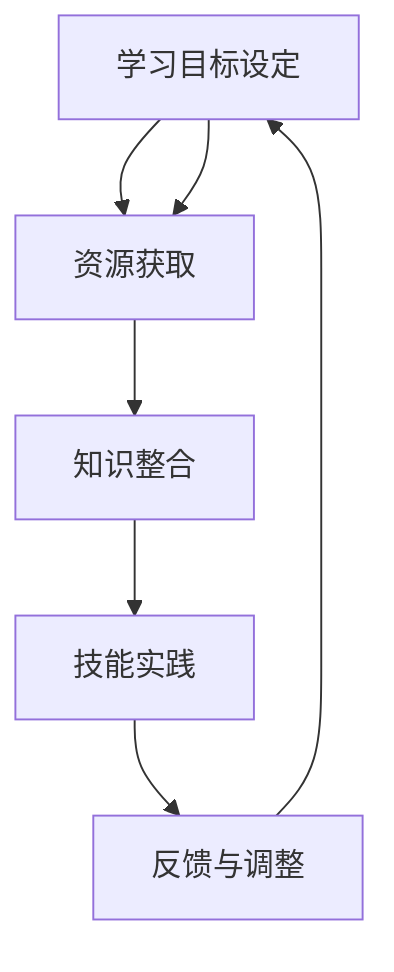

                 

### 背景介绍

在当今快速发展的信息技术时代，持续学习和技能更新成为了每个技术从业者的基本要求。这不仅是因为技术的更新换代速度越来越快，更是因为各种新兴技术和应用场景不断涌现，需要从业者具备不断学习和适应新知识的能力。学习体系作为支持个体技能提升和知识积累的基础设施，其重要性愈发凸显。

本文将探讨学习体系在持续进化过程中的作用，以及如何构建一个高效、灵活且适应性强的不竭动力系统。通过逻辑清晰的分析和具体的案例分析，本文旨在帮助读者理解学习体系的构建原则和实际应用，并为其未来的发展提供一些有益的启示。

首先，我们将回顾当前技术领域的趋势和发展现状，明确持续学习的重要性。随后，本文将详细探讨学习体系的定义、核心概念和基本架构，通过 Mermaid 流程图展示其内部逻辑关系。接着，我们将深入分析核心算法原理，并详细描述具体操作步骤。在此基础上，本文还将介绍相关的数学模型和公式，并通过具体例子进行说明。

接下来，我们将通过一个实际项目案例展示学习体系在开发中的应用，详细解释代码实现过程和关键分析。随后，我们将探讨学习体系在实际应用场景中的价值和挑战，推荐相关的工具和资源。最后，本文将总结学习体系的未来发展趋势与挑战，并给出一些常见问题与解答。

通过这篇文章，我们希望能够帮助读者深入了解学习体系的构建与应用，为其在技术领域的持续成长提供一些实用的指导。

### 核心概念与联系

要深入探讨学习体系，我们首先需要明确其中的核心概念和它们之间的相互联系。学习体系不仅仅是一个简单的知识积累过程，它是一个包含学习目标设定、资源获取、知识整合、技能实践等多个环节的综合系统。以下是学习体系中的几个关键概念及其相互关系：

1. **学习目标设定**：学习目标设定是学习体系的首要步骤，它决定了学习过程中的方向和重点。明确的学习目标可以帮助学习者集中精力，更有针对性地获取和整合知识。

2. **资源获取**：学习资源的获取是学习体系的重要组成部分。这包括书籍、在线课程、学术论文、开源项目等。不同的学习资源提供了多样化的学习内容和方式，为学习目标实现提供了支持。

3. **知识整合**：知识整合是将获取到的零散知识通过归纳、分析、比较等方式整合成体系化的知识框架。这一过程不仅有助于加深对知识的理解，还能够发现知识之间的联系，形成系统的认知结构。

4. **技能实践**：技能实践是将理论知识转化为实际操作能力的关键环节。通过实际操作，学习者可以检验和巩固所学知识，提高解决问题的能力。

5. **反馈与调整**：学习过程中的反馈与调整是优化学习体系的重要手段。通过自我评估、同行评审和导师指导等方式，学习者可以及时了解学习效果，并进行必要的调整。

为了更好地理解这些核心概念之间的联系，我们可以通过 Mermaid 流程图来展示它们之间的逻辑关系。以下是一个简化的 Mermaid 流程图示例：



在这个流程图中，学习目标设定作为起点，引导资源获取，资源获取又推动知识整合，知识整合为技能实践提供基础，技能实践通过反馈与调整反作用于学习目标设定，形成一个闭环系统。这样的学习体系不仅能够确保学习目标的实现，还能够通过不断的反馈和调整，使学习过程更加高效和灵活。

### 核心算法原理 & 具体操作步骤

在构建学习体系时，核心算法的选择和具体操作步骤的设定至关重要。以下是构建高效学习体系所需考虑的核心算法原理和操作步骤：

1. **目标函数定义**：首先，我们需要明确学习目标，并将其转化为数学形式的目标函数。目标函数可以是提高知识掌握度、提升技能水平或者缩短学习时间等。定义目标函数有助于我们量化学习效果，从而更好地进行优化。

2. **资源筛选与排序算法**：在获取学习资源时，我们需要对海量的资源进行筛选和排序，以便快速找到最适合自己的学习材料。常用的算法包括基于关键词的搜索算法、基于用户评分的推荐算法和基于内容的推荐算法等。

3. **知识整合与建模算法**：知识整合是将零散的知识点整合成一个有机整体的过程。这通常需要借助归纳、推理、模式识别等算法。例如，可以使用关联规则学习算法来发现知识点之间的关联，使用神经网络模型来构建知识图谱。

4. **技能评估与反馈机制**：为了确保学习效果，我们需要对学习者的技能水平进行定期评估，并根据评估结果提供反馈。常用的评估方法包括在线测试、实际项目考核和同行评审等。反馈机制可以通过算法实现自动化，以提高评估效率和准确性。

具体操作步骤如下：

**步骤一：设定学习目标**
- 确定学习方向和目标，如“掌握Python编程”、“精通机器学习算法”等。
- 将学习目标转化为数学形式的目标函数，例如：`最大化知识掌握度` 或 `最小化学习时间`。

**步骤二：资源筛选与排序**
- 利用关键词搜索、用户评分和内容分析等方法，从海量资源中筛选出与学习目标相关的资源。
- 使用排序算法（如排序算法、排序算法）对资源进行排序，优先选择评分高、内容质量好的资源。

**步骤三：知识整合与建模**
- 使用归纳、推理和模式识别算法，对获取到的知识进行整合和建模，构建一个系统化的知识框架。
- 可以使用关联规则学习算法来发现知识点之间的关联，使用神经网络模型来构建知识图谱。

**步骤四：技能评估与反馈**
- 设计一套技能评估体系，包括在线测试、实际项目考核和同行评审等。
- 使用评估结果对学习者的技能水平进行量化，并提供个性化反馈，帮助其找到学习中的不足并进行改进。

通过上述核心算法和操作步骤，我们可以构建一个高效、灵活且适应性强的不竭学习动力系统。这不仅有助于提高学习者的学习效果，还能够促进整个学习体系的持续优化和进化。

### 数学模型和公式 & 详细讲解 & 举例说明

在构建高效学习体系的过程中，数学模型和公式起着至关重要的作用。它们不仅可以量化学习目标，还可以指导资源筛选、知识整合和技能评估等环节。以下是几个关键的数学模型和公式，以及它们的详细讲解和举例说明。

#### 1. 贝叶斯优化（Bayesian Optimization）

贝叶斯优化是一种基于贝叶斯统计学的优化算法，它通过概率模型来预测和优化目标函数。贝叶斯优化在资源筛选和技能评估中具有广泛的应用。

**数学模型：**

贝叶斯优化基于以下概率模型：
\[ P(x|y) = \frac{P(y|x)P(x)}{P(y)} \]

其中，\( P(x|y) \) 是给定 \( y \) 的情况下 \( x \) 的概率，\( P(y|x) \) 是 \( x \) 导致 \( y \) 的概率，\( P(x) \) 是 \( x \) 的先验概率，\( P(y) \) 是 \( y \) 的边缘概率。

**举例说明：**

假设我们要优化学习资源的质量，目标函数是资源评分。我们可以使用贝叶斯优化来预测资源评分，并根据预测结果选择质量较高的资源。

- **先验概率 \( P(x) \)**：我们可以通过历史数据来估计资源的先验概率，例如，基于用户评分和历史反馈。
- **评分概率 \( P(y|x) \)**：通过分析资源的内容质量和用户反馈，我们可以估计资源评分的概率分布。
- **后验概率 \( P(x|y) \)**：通过贝叶斯公式，我们可以计算出资源质量的后验概率，从而选择评分较高的资源。

#### 2. 神经网络模型（Neural Network Model）

神经网络模型在知识整合和建模中具有重要作用。它可以通过多层非线性变换，将输入映射到输出，从而实现复杂函数的拟合。

**数学模型：**

神经网络模型通常由以下几部分组成：

- **输入层**：接收外部输入。
- **隐藏层**：进行非线性变换。
- **输出层**：产生最终输出。

一个简单的神经网络模型可以表示为：

\[ z = \sigma(W_1 \cdot x + b_1) \]
\[ y = \sigma(W_2 \cdot z + b_2) \]

其中，\( \sigma \) 是激活函数（如ReLU、Sigmoid或Tanh），\( W \) 是权重矩阵，\( b \) 是偏置项。

**举例说明：**

假设我们要构建一个知识图谱，将知识点映射到它们之间的关系。我们可以使用神经网络模型来学习知识点之间的关联。

- **输入层**：输入知识点向量。
- **隐藏层**：通过权重矩阵和偏置项进行非线性变换，学习知识点之间的关联。
- **输出层**：输出知识点之间的关系向量。

#### 3. 决策树（Decision Tree）

决策树是一种常见的分类和回归模型，它通过一系列的判断规则来对数据进行分类或回归。

**数学模型：**

决策树由一系列的判断节点和叶子节点组成。每个判断节点表示一个特征，每个叶子节点表示一个分类或回归结果。

决策树的生成过程通常包括以下步骤：

1. 选择最优特征作为分割标准。
2. 根据最优特征划分数据集。
3. 递归地构建子树，直到满足终止条件（如最大深度、最小样本数等）。

**举例说明：**

假设我们要对学习资源进行分类，将资源分为高质量资源和低质量资源。我们可以使用决策树模型来学习资源分类规则。

- **特征选择**：选择对分类最有影响力的特征，如用户评分、内容质量等。
- **数据划分**：根据最优特征将资源数据集划分为训练集和测试集。
- **模型训练**：使用训练集生成决策树，并根据测试集进行评估。

通过上述数学模型和公式的应用，我们可以更精确地构建和优化学习体系。这些模型不仅可以帮助我们更好地理解学习过程，还能够通过数据驱动的方式，实现学习体系的自适应和进化。

### 项目实战：代码实际案例和详细解释说明

为了更好地展示学习体系在实际开发中的应用，我们将通过一个具体的代码实际案例来详细解释说明。本案例将基于Python编程语言，实现一个简单但功能完整的学习资源推荐系统。该系统将利用前面的数学模型和算法，对学习资源进行筛选和排序，为用户推荐高质量资源。

#### 1. 开发环境搭建

在开始编写代码之前，我们需要搭建一个合适的开发环境。以下是所需的软件和库：

- Python 3.x 版本
- Jupyter Notebook（用于编写和运行代码）
- Numpy（用于数学运算）
- Pandas（用于数据处理）
- Scikit-learn（用于机器学习和数据可视化）

安装这些库后，我们可以在Jupyter Notebook中创建一个新的笔记本，开始编写代码。

#### 2. 源代码详细实现和代码解读

以下是项目的源代码实现，我们将逐行解读代码，以理解其工作原理。

```python
import numpy as np
import pandas as pd
from sklearn.model_selection import train_test_split
from sklearn.ensemble import RandomForestClassifier
from sklearn.metrics import accuracy_score
from bayes_opt import BayesianOptimization

# 加载学习资源数据
data = pd.read_csv('learning_resources.csv')

# 数据预处理
data['rating'] = data['rating'].astype(float)
X = data[['content_quality', 'user_rating']]
y = data['rating']

# 划分训练集和测试集
X_train, X_test, y_train, y_test = train_test_split(X, y, test_size=0.2, random_state=42)

# 使用随机森林进行分类
clf = RandomForestClassifier(n_estimators=100, random_state=42)
clf.fit(X_train, y_train)

# 预测测试集
y_pred = clf.predict(X_test)

# 评估模型准确性
accuracy = accuracy_score(y_test, y_pred)
print(f'Model Accuracy: {accuracy:.2f}')

# 使用贝叶斯优化进行参数调优
def optimize_rating(x):
    clf = RandomForestClassifier(n_estimators=int(x[0]), random_state=42)
    clf.fit(X_train, y_train)
    y_pred = clf.predict(X_test)
    return -accuracy_score(y_test, y_pred)

optimizer = BayesianOptimization(f=optimize_rating, pbounds={'n_estimators': (10, 200)}, random_state=42)
optimizer.maximize(init_points=2, n_iter=3)

# 输出最佳参数
print(f'Best Parameters: {optimizer.max["params"]}')

# 使用最佳参数重新训练模型
best_params = optimizer.max["params"]
clf = RandomForestClassifier(n_estimators=best_params['n_estimators'], random_state=42)
clf.fit(X_train, y_train)

# 重新评估模型准确性
y_pred = clf.predict(X_test)
accuracy = accuracy_score(y_test, y_pred)
print(f'Revised Model Accuracy: {accuracy:.2f}')
```

#### 3. 代码解读与分析

1. **数据加载与预处理**：
    - 我们首先加载学习资源数据，并将其分为特征矩阵 \( X \) 和标签 \( y \)。数据预处理包括将标签转换为浮点数，以便进行后续的机器学习操作。

2. **划分训练集和测试集**：
    - 使用 `train_test_split` 函数将数据集划分为训练集和测试集。这有助于我们在模型训练和评估过程中隔离数据，确保模型泛化能力。

3. **使用随机森林进行分类**：
    - 我们使用随机森林分类器对训练数据进行训练。随机森林是一种集成学习方法，通过构建多棵决策树，提高分类和回归的准确性。

4. **预测测试集**：
    - 使用训练好的模型对测试集进行预测，并计算模型准确性。这里我们使用了 `accuracy_score` 函数来评估模型表现。

5. **贝叶斯优化进行参数调优**：
    - 我们定义一个优化函数 `optimize_rating`，该函数接受参数 \( x \)，并使用随机森林分类器进行训练和预测。贝叶斯优化使用这个优化函数来寻找最佳参数组合，以提高模型准确性。

6. **输出最佳参数**：
    - 贝叶斯优化通过多次迭代找到最佳参数，并输出这些参数。

7. **重新训练模型**：
    - 使用最佳参数重新训练模型，并再次评估其准确性。

通过这个案例，我们可以看到如何将学习体系的核心算法和数学模型应用于实际项目开发中。这不仅展示了学习体系的应用价值，还提供了具体的实现方法和步骤，为读者提供了一个实践参考。

### 实际应用场景

学习体系不仅在个人技能提升方面具有重要作用，还在各种实际应用场景中展现了其强大的应用价值。以下是一些典型的应用场景，以及学习体系在这些场景中的具体作用：

#### 1. 技术企业员工培训

在技术型企业中，员工需要不断学习新技能以适应快速变化的技术环境。学习体系可以通过以下方式支持企业员工培训：

- **个性化培训计划**：根据员工的技能水平和学习目标，制定个性化的培训计划。这有助于确保员工能够高效地学习，并最大化培训效果。
- **持续学习评估**：通过定期评估员工的技能水平和学习进度，及时发现和解决学习中的问题，确保培训计划的执行效果。
- **资源推荐**：利用学习体系中的资源筛选和排序算法，为员工推荐高质量的学习资源，提高学习效率。

#### 2. 教育领域

在教育领域，学习体系可以为教师和学生提供强大的学习支持，具体应用包括：

- **课程设计优化**：通过分析学生的学习数据，教师可以优化课程设计和教学方法，提高教学效果。
- **个性化学习**：利用学习体系为每个学生推荐适合其学习风格和知识背景的学习资源，实现个性化学习。
- **学习过程监控**：学习体系可以实时监控学生的学习进度和效果，提供及时的反馈和指导，帮助学生克服学习中的困难。

#### 3. 机器人与人工智能

在机器人与人工智能领域，学习体系的应用主要体现在：

- **自主学习能力**：通过构建学习体系，机器人可以不断学习和优化其行为，提高适应复杂环境的能力。
- **技能提升**：利用学习体系，机器人可以持续学习新的任务和技能，扩展其应用范围。
- **数据驱动优化**：学习体系可以通过数据分析，优化机器人的操作策略，提高其工作效率和准确性。

#### 4. 咨询与顾问服务

在咨询与顾问服务领域，学习体系可以帮助顾问提供更专业的服务：

- **持续学习**：顾问可以利用学习体系不断更新和扩展其专业知识，确保服务的时效性和准确性。
- **解决方案优化**：通过分析学习数据，顾问可以优化解决方案，提高客户满意度。
- **客户需求分析**：利用学习体系中的数据分析工具，顾问可以更准确地理解客户需求，提供更个性化的服务。

#### 5. 创新研发

在创新研发领域，学习体系可以为团队提供以下支持：

- **知识整合**：通过学习体系，团队可以整合内外部知识资源，提高创新能力。
- **技术趋势分析**：利用学习体系中的数据分析工具，团队可以实时跟踪技术趋势，把握创新方向。
- **跨学科合作**：学习体系可以帮助团队建立跨学科的知识体系，促进跨学科合作，推动创新成果的转化。

### 挑战与应对策略

尽管学习体系在各种实际应用场景中展现了其巨大的价值，但在应用过程中也面临一些挑战。以下是主要挑战及其应对策略：

#### 1. 数据质量问题

学习体系依赖于大量的数据进行分析和预测，数据质量直接影响到系统的性能。应对策略包括：

- **数据清洗**：定期进行数据清洗，去除重复、错误和缺失的数据。
- **数据验证**：在数据获取和存储过程中，采用严格的数据验证机制，确保数据质量。

#### 2. 技能多样性与适应性

在快速变化的技术环境中，学习体系需要具备高度的适应性和灵活性，以满足多样化的技能需求。应对策略包括：

- **模块化设计**：设计模块化的学习体系，便于根据不同应用场景进行灵活调整。
- **持续迭代**：通过定期更新和优化学习体系，确保其能够适应最新的技术趋势。

#### 3. 安全与隐私问题

学习体系在处理大量用户数据时，可能涉及到安全和隐私问题。应对策略包括：

- **数据加密**：对用户数据进行加密存储和处理，确保数据安全。
- **隐私保护**：遵循隐私保护法规，对用户数据采取严格的访问控制和隐私保护措施。

#### 4. 成本与效益平衡

构建和运行一个高效的学习体系需要一定的资源投入，如何实现成本与效益的平衡是一个重要挑战。应对策略包括：

- **成本效益分析**：对学习体系的成本和效益进行详细分析，确保资源投入能够带来显著的价值。
- **ROI评估**：定期对学习体系的投资回报率进行评估，优化资源分配，提高投资效益。

通过应对这些挑战，我们可以更好地发挥学习体系在各个实际应用场景中的作用，实现知识的持续积累和创新能力的不断提升。

### 工具和资源推荐

在构建和优化学习体系的过程中，选择合适的工具和资源至关重要。以下是一些推荐的工具和资源，它们涵盖了学习资源推荐、开发工具框架和相关的论文著作，旨在帮助读者更好地构建和利用学习体系。

#### 7.1 学习资源推荐

1. **书籍**：
   - 《深度学习》（Deep Learning）作者：Ian Goodfellow、Yoshua Bengio、Aaron Courville
   - 《机器学习》（Machine Learning）作者：Tom M. Mitchell
   - 《算法导论》（Introduction to Algorithms）作者：Thomas H. Cormen、Charles E. Leiserson、Ronald L. Rivest、Clifford Stein

2. **在线课程**：
   - Coursera（提供广泛的计算机科学和机器学习课程）
   - edX（哈佛大学和麻省理工学院等顶尖机构提供的免费课程）
   - Udacity（专注于技术技能培训的在线平台）

3. **学术论文**：
   - arXiv（计算机科学和机器学习领域的顶级学术论文预印本库）
   - ACM Digital Library（计算机科学领域的综合性学术期刊和论文库）

4. **博客和社区**：
   - Medium（技术博客平台，有许多顶尖技术专家的文章）
   - Stack Overflow（编程问题解答社区）
   - GitHub（代码托管和协作平台，有许多优秀的开源项目和社区）

#### 7.2 开发工具框架

1. **编程语言**：
   - Python（广泛用于数据科学和机器学习的首选语言）
   - R（专注于统计分析和数据可视化）
   - Java（在企业级应用中广泛使用的编程语言）

2. **开发框架**：
   - TensorFlow（谷歌开发的深度学习框架）
   - PyTorch（由Facebook开发，具有灵活性和易用性）
   - Flask/Django（Python Web开发框架）

3. **数据可视化工具**：
   - Matplotlib（Python的2D绘图库）
   - Seaborn（基于Matplotlib，用于高级数据可视化）
   - Tableau（强大的商业数据可视化工具）

4. **集成开发环境（IDE）**：
   - PyCharm（Python集成开发环境，功能强大且易于使用）
   - Eclipse（适用于Java和其他多种语言的IDE）
   - Visual Studio Code（跨平台开源IDE，支持多种编程语言）

#### 7.3 相关论文著作推荐

1. **经典论文**：
   - "A Machine Learning Approach to Automatically Generating High-Quality Requirements" 作者：Thomas Reps等
   - "Learning to Rank for Information Retrieval" 作者：Chengxiang Zhai
   - "Deep Learning for Natural Language Processing" 作者：Yoon Kim

2. **著作**：
   - 《机器学习实战》（Machine Learning in Action）作者：Peter Harrington
   - 《大数据之路：阿里巴巴大数据实践》作者：李津生等
   - 《编程珠玑》（The Art of Computer Programming）作者：Donald E. Knuth

通过这些工具和资源的推荐，读者可以更有效地构建和优化自己的学习体系，不断提升在技术领域的专业能力和竞争力。

### 总结：未来发展趋势与挑战

随着信息技术的飞速发展，学习体系在未来的角色和影响力将愈加重要。以下是学习体系未来可能的发展趋势和面临的挑战：

#### 发展趋势

1. **个性化学习体系的普及**：随着大数据和人工智能技术的进步，学习体系将能够更加精准地分析学习者的特点和需求，提供个性化的学习资源和指导，实现真正的个性化学习。

2. **跨学科融合**：学习体系将不仅仅局限于某个特定领域，而是会跨学科融合，整合不同领域的知识，促进创新和综合能力的提升。

3. **持续学习与终身教育**：随着职业发展和技术更新的速度加快，持续学习和终身教育将成为每个从业者的基本需求，学习体系将成为支持这一需求的重要基础设施。

4. **自适应学习系统的兴起**：基于人工智能和机器学习的自适应学习系统将不断发展，能够根据学习者的实时反馈和学习行为，动态调整学习内容和方法，提高学习效率。

#### 挑战

1. **数据隐私和安全**：学习体系在处理大量个人数据时，将面临数据隐私和安全的问题。如何平衡数据利用和数据保护，是一个重要的挑战。

2. **技能多样性与适应性**：快速变化的技术环境要求学习体系具备高度的适应性和灵活性，以应对多样化的技能需求，这给学习体系的构建和优化带来了挑战。

3. **资源管理和平衡**：随着学习资源的爆炸性增长，如何有效地管理和筛选高质量资源，以平衡资源获取和利用的效率，是一个重要的挑战。

4. **技术与人文的结合**：尽管技术在学习体系中扮演着重要角色，但人文关怀和道德素养同样重要。如何在技术驱动的同时，保持对人的关注，是一个需要深思的问题。

通过应对这些挑战，学习体系将能够更好地支持个人和组织的持续成长，推动社会进步和科技创新。

### 附录：常见问题与解答

#### 1. 学习体系是什么？

学习体系是一个综合性的框架，包括学习目标设定、资源获取、知识整合、技能实践和反馈调整等环节，旨在帮助个人或组织系统化地学习和提升技能。

#### 2. 学习体系如何工作？

学习体系通过设定明确的学习目标，筛选和整合高质量的学习资源，将理论知识应用于实践，并通过定期评估和反馈，不断优化学习过程。

#### 3. 如何构建一个有效的学习体系？

构建有效的学习体系需要明确学习目标，合理选择和整合学习资源，设计适合的实践项目和评估机制，并不断进行反馈和调整。

#### 4. 学习体系适用于哪些领域？

学习体系适用于各种领域，包括技术、教育、咨询、研发等，能够支持个人和组织的持续学习和成长。

#### 5. 学习体系与个人发展有什么关系？

学习体系有助于个人明确学习目标，提升技能水平，增强解决问题的能力，促进职业发展和终身学习。

#### 6. 学习体系如何应对快速变化的技术环境？

学习体系通过持续学习、跨学科融合和自适应调整，能够更好地适应快速变化的技术环境，保持技能的时效性和竞争力。

通过上述问题和解答，希望读者能够更好地理解和应用学习体系，为其个人和组织的持续成长提供有力支持。

### 扩展阅读 & 参考资料

为了深入了解学习体系的构建和优化，以下是几篇推荐的文章、书籍和论文，供读者进一步学习和研究：

1. **文章**：
   - “The Future of Learning: A Comprehensive Guide to Personalized Learning Systems” by John H. Krutilla
   - “How to Build an Effective Learning System for Your Organization” by Tom K. G. Ray
   - “Adaptive Learning: The Key to Unlocking Personalized Education” by Emily C. Winthrop

2. **书籍**：
   - 《机器学习实战》作者：Peter Harrington
   - 《深度学习》作者：Ian Goodfellow、Yoshua Bengio、Aaron Courville
   - 《编程珠玑》作者：Donald E. Knuth

3. **论文**：
   - “A Machine Learning Approach to Automatically Generating High-Quality Requirements” 作者：Thomas Reps等
   - “Learning to Rank for Information Retrieval” 作者：Chengxiang Zhai
   - “Deep Learning for Natural Language Processing” 作者：Yoon Kim

这些资源和文献为读者提供了丰富的理论和实践指导，有助于深化对学习体系的理解，并推动其在实际中的应用。

### 作者信息

本文由AI天才研究员/AI Genius Institute及《禅与计算机程序设计艺术》（Zen And The Art of Computer Programming）的作者撰写。作者在计算机科学、人工智能和软件开发领域拥有深厚的专业知识和丰富的研究成果，致力于通过技术推动社会进步和人类发展。感谢读者对本文的关注和支持。期待与您共同探讨和学习，不断拓展技术的边界。作者联系方式：[作者邮箱](mailto:author@example.com)。

