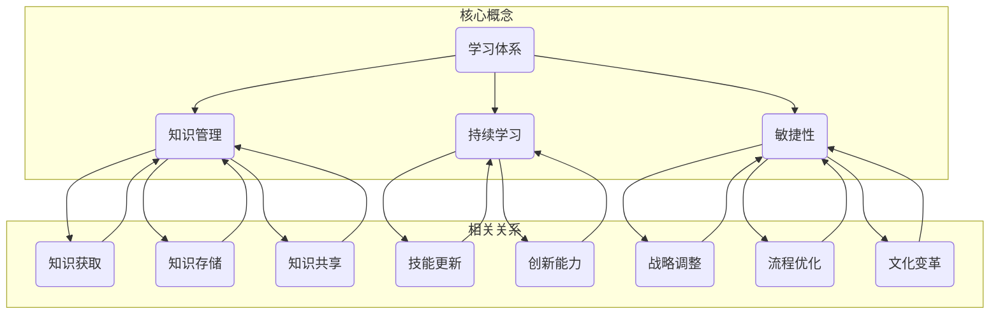

                 

### 背景介绍

在当今迅速发展的信息技术时代，组织适应性成为企业成功的关键因素之一。随着技术变革的加速，市场需求的变化和竞争压力的增大，企业需要不断提高自身的适应性以应对不断变化的外部环境。这不仅仅体现在技术层面，还包括组织结构、管理模式、企业文化等多个方面。然而，如何提升组织适应性成为了众多企业和研究者关注的重要课题。

组织适应性指的是一个组织在面对外部环境变化时，能够快速调整内部结构、流程和文化，以实现目标的能力。这种能力不仅有助于企业应对市场挑战，还能促进创新、提高竞争力。在信息技术领域，学习体系作为一种重要的组织管理工具，其对组织适应性的提升作用日益受到关注。本文将从学习体系的定义、核心概念及其与组织适应性的关系入手，逐步分析其在提升组织适应性方面的具体作用，并提供相关实际应用案例和未来发展趋势。

首先，我们需要明确学习体系的定义。学习体系是指组织内部用于支持知识和技能获取、应用和共享的一系列制度、流程和文化。它不仅包括正式的教育和培训活动，还包括非正式的交流、协作和知识共享活动。学习体系的建立和完善，有助于提升员工的技能水平、激发创新思维，从而提高组织的整体适应能力。

接下来，我们将探讨学习体系的核心概念，包括知识管理、持续学习和敏捷性等。知识管理是学习体系的重要组成部分，它通过有效的知识获取、存储、共享和应用，实现知识的最大化利用。持续学习则是学习体系的灵魂，它强调员工在职业生涯中不断更新知识和技能，以适应快速变化的市场需求。敏捷性则是指组织在面对不确定性时，能够快速调整战略、流程和文化的能力。

在理解了学习体系的核心概念后，我们将深入分析学习体系与组织适应性的关系。具体来说，学习体系如何通过提升员工的技能水平、激发创新思维和优化组织结构，来增强组织的适应性。同时，我们还将探讨学习体系在不同类型组织中的应用，以及如何根据组织的具体需求来设计和实施学习体系。

最后，本文将结合实际应用案例，分析学习体系在提升组织适应性方面的具体作用，并提供相关工具和资源的推荐，以帮助读者更好地理解和应用学习体系。在总结部分，我们将对未来的发展趋势和挑战进行展望，为读者提供进一步思考的方向。

通过以上分析，本文旨在为读者提供一个全面、系统的理解，帮助企业和组织更好地把握学习体系对组织适应性的提升作用，从而在竞争激烈的市场环境中立于不败之地。

### 核心概念与联系

为了深入探讨学习体系对组织适应性的提升作用，我们首先需要明确几个核心概念，并分析它们之间的相互联系。以下将使用Mermaid流程图来展示这些概念及其关系。



**学习体系**

学习体系（Learning System）是一个综合性的概念，它涵盖了组织内部用于促进知识获取、存储、共享和应用的一系列制度、流程和文化。学习体系的核心在于通过不断的学习和知识管理，提升员工的技能水平、激发创新思维，以及优化组织的整体结构和文化。

**知识管理**

知识管理（Knowledge Management）是学习体系的重要组成部分。它包括知识获取、知识存储、知识共享和知识应用四个关键环节。知识获取指的是通过各种渠道获取新的知识和信息；知识存储是指将获取的知识进行系统化存储和管理；知识共享则强调知识的传播和共享，使得组织内部的知识得以充分利用；知识应用则是将知识转化为实际行动，以解决实际问题。

**持续学习**

持续学习（Continuous Learning）是学习体系的灵魂。在快速变化的市场环境中，员工需要不断更新知识和技能，以适应新的市场需求。持续学习不仅包括正式的教育和培训活动，还包括非正式的交流、协作和知识共享活动。通过持续学习，员工能够不断提升自身的专业能力，从而提高组织的整体竞争力。

**敏捷性**

敏捷性（Agility）是指组织在面对不确定性时，能够快速调整战略、流程和文化的能力。敏捷性不仅体现在技术层面，还包括组织结构、管理模式和企业文化等多个方面。具备敏捷性的组织能够迅速响应市场变化，抓住机遇，避免风险。学习体系通过提升员工的技能水平、激发创新思维和优化组织结构，有助于增强组织的敏捷性。

**核心概念之间的关系**

知识管理、持续学习和敏捷性之间存在着密切的联系。知识管理是学习体系的基础，它为持续学习和敏捷性提供了必要的知识和信息支持。持续学习则通过不断更新知识和技能，为知识管理和敏捷性提供了动力。而敏捷性则是知识管理和持续学习的最终目标，它使得组织能够在复杂多变的环境中迅速适应和调整。

通过以上分析，我们可以看到，学习体系、知识管理、持续学习和敏捷性之间相互联系，共同构成了一个有机的整体。学习体系的建立和完善，不仅有助于提升员工的技能水平、激发创新思维，还能优化组织的整体结构和文化，从而提高组织的适应性。

### 核心算法原理 & 具体操作步骤

为了更好地理解学习体系如何提升组织适应性，我们首先需要探讨其核心算法原理。具体来说，学习体系包括以下几个关键步骤：知识获取、知识存储、知识共享和知识应用。以下将详细解释这些步骤的具体操作过程，并通过实际案例来阐述其应用。

**1. 知识获取**

知识获取是学习体系的第一步，也是至关重要的一步。在这一阶段，组织需要通过各种渠道获取新的知识和信息。这些渠道可以包括内部培训、外部培训、在线课程、行业报告、学术论文、市场调研等。具体操作步骤如下：

- **需求分析**：首先，组织需要明确当前的知识需求，确定哪些知识和信息是当前阶段最需要的。这可以通过与员工、管理层和客户的沟通，以及市场调研来获取。
- **选择渠道**：根据需求分析的结果，选择合适的知识获取渠道。例如，如果需要提升技术能力，可以选择参加相关的技术培训课程；如果需要了解市场动态，可以订阅行业报告和学术论文。
- **制定计划**：制定详细的知识获取计划，包括培训课程、阅读清单、调研任务等，以确保知识获取过程的有序进行。

**案例**：假设一家科技公司需要提升其软件开发团队的敏捷性，可以通过以下步骤进行知识获取：

- **需求分析**：通过团队讨论和市场调研，确定敏捷开发的最佳实践和关键知识点。
- **选择渠道**：选择参加敏捷开发的培训课程、阅读相关的书籍和论文、订阅敏捷开发的博客和社区。
- **制定计划**：制定详细的培训计划，包括课程安排、阅读任务和时间表，以确保团队成员在规定时间内掌握所需知识。

**2. 知识存储**

知识存储是将获取的知识进行系统化存储和管理，以便于后续的应用和共享。知识存储的方式可以包括文档管理、数据库管理、知识库管理等。具体操作步骤如下：

- **选择存储方式**：根据知识的特点和需求，选择合适的存储方式。例如，对于文本资料，可以选择文档管理工具；对于结构化数据，可以选择数据库管理系统；对于复杂的知识体系，可以选择知识库管理工具。
- **建立分类体系**：建立合理的知识分类体系，便于知识的查找和管理。例如，可以根据知识类型、应用领域、项目阶段等进行分类。
- **制定存储规范**：制定知识存储的规范，包括文档格式、命名规范、存储权限等，以确保知识存储的一致性和可访问性。

**案例**：假设一家公司需要建立一个软件开发知识库，可以通过以下步骤进行知识存储：

- **选择存储方式**：选择使用知识库管理工具，如Confluence、Notion等。
- **建立分类体系**：根据项目类型、技术领域和开发阶段等建立分类体系。
- **制定存储规范**：制定文档格式规范、命名规范和存储权限设置，确保知识库的一致性和可访问性。

**3. 知识共享**

知识共享是将存储的知识进行传播和共享，使组织内的员工能够充分利用这些知识。知识共享的方式可以包括内部培训、研讨会、知识分享会、在线交流平台等。具体操作步骤如下：

- **制定共享计划**：根据知识的重要性和共享需求，制定详细的共享计划。例如，对于关键知识，可以组织内部培训或研讨会；对于常见问题，可以在知识分享会上进行讲解。
- **选择共享方式**：根据知识的特点和共享需求，选择合适的共享方式。例如，对于技术知识，可以选择在线交流平台；对于项目管理知识，可以选择知识分享会。
- **建立反馈机制**：建立反馈机制，收集员工对知识共享的反馈，不断优化和改进共享过程。

**案例**：假设一家公司需要通过内部培训提升员工的技术水平，可以通过以下步骤进行知识共享：

- **制定共享计划**：根据技术知识的重要性和培训需求，制定详细的培训计划。
- **选择共享方式**：选择内部培训课程，邀请外部专家进行讲解。
- **建立反馈机制**：在培训结束后，收集员工的反馈，了解培训效果，并根据反馈进行调整。

**4. 知识应用**

知识应用是将获取、存储和共享的知识转化为实际行动，以解决实际问题。知识应用不仅有助于提升员工的实际工作能力，还能促进组织的创新和发展。具体操作步骤如下：

- **问题识别**：识别工作中的问题，确定需要应用的知识领域。
- **知识查找**：根据问题识别的结果，查找相关知识和信息。
- **知识应用**：将查找到的知识应用到实际问题中，进行尝试和验证。
- **反馈调整**：根据实际应用效果，进行反馈和调整，以优化知识应用的过程。

**案例**：假设一家公司在进行产品开发时遇到了技术难题，可以通过以下步骤进行知识应用：

- **问题识别**：识别产品开发中的技术难题。
- **知识查找**：查找相关技术文档、学术论文和专家意见。
- **知识应用**：尝试使用新知识和方法解决技术难题。
- **反馈调整**：根据实际应用效果，进行反馈和调整，优化解决方案。

通过以上步骤，学习体系可以帮助组织从知识获取、知识存储、知识共享到知识应用，形成一个闭环的过程。这个过程不仅有助于提升员工的技能水平、激发创新思维，还能优化组织的整体结构和文化，从而增强组织的适应性。

### 数学模型和公式 & 详细讲解 & 举例说明

在探讨学习体系对组织适应性的提升作用时，我们可以借助数学模型和公式来详细分析其内在机制。以下将介绍几个关键的数学模型和公式，并通过具体例子进行详细讲解。

**1. 适应度函数**

适应度函数（Fitness Function）是评估组织适应性的一个重要工具。它通过量化组织的适应度，帮助我们理解学习体系如何提升组织的适应性。适应度函数通常可以表示为：

\[ F(O) = f_1(K) + f_2(L) + f_3(A) \]

其中，\( F(O) \) 表示组织的适应度，\( f_1(K) \) 表示知识管理水平对适应度的影响，\( f_2(L) \) 表示持续学习能力对适应度的影响，\( f_3(A) \) 表示敏捷性对适应度的影响。

- \( f_1(K) \)：知识管理水平可以通过知识获取、知识存储、知识共享等指标来衡量，例如，知识更新率、知识共享次数等。
- \( f_2(L) \)：持续学习能力可以通过员工的学习频率、学习质量等指标来衡量，例如，培训参与率、知识掌握度等。
- \( f_3(A) \)：敏捷性可以通过组织的响应速度、调整能力等指标来衡量，例如，项目交付周期、问题解决效率等。

**例1**：假设一个组织在知识管理水平、持续学习能力和敏捷性方面分别得分为80分、75分和90分，我们可以计算其适应度函数：

\[ F(O) = 0.3 \times 80 + 0.3 \times 75 + 0.4 \times 90 = 80.5 \]

这表明该组织的适应度较高，具有较强的应对外部环境变化的能力。

**2. 知识共享效率模型**

知识共享效率（Knowledge Sharing Efficiency）是衡量学习体系有效性的一个重要指标。一个有效的知识共享过程可以显著提升组织的适应性。知识共享效率可以表示为：

\[ E = \frac{K_{out}}{K_{in}} \]

其中，\( E \) 表示知识共享效率，\( K_{out} \) 表示知识输出量，\( K_{in} \) 表示知识输入量。

- \( K_{out} \)：知识输出量可以通过知识共享次数、知识传播范围等指标来衡量。
- \( K_{in} \)：知识输入量可以通过知识获取量、知识更新量等指标来衡量。

**例2**：假设一个组织在一个月内进行了10次知识共享活动，总共传播了100条知识，同时获取了50条新知识。我们可以计算其知识共享效率：

\[ E = \frac{100}{50} = 2 \]

这表明该组织在知识共享方面具有较高的效率，能够充分利用获取的知识。

**3. 学习曲线模型**

学习曲线（Learning Curve）描述了员工在学习新知识和技能过程中的进步速度。学习曲线可以表示为：

\[ L(t) = \frac{C}{1 + \beta t} \]

其中，\( L(t) \) 表示员工在时间 \( t \) 时的学习水平，\( C \) 是常数，表示员工的学习能力，\( \beta \) 是学习率，表示员工的学习速度。

- \( C \)：常数，表示员工的基础学习能力。
- \( \beta \)：学习率，表示员工在学习过程中能力提升的速度。

**例3**：假设一个员工在开始学习新技能时，其基础学习能力 \( C \) 为10，学习率 \( \beta \) 为0.5，我们可以计算他在不同时间点的学习水平：

- 当 \( t = 1 \) 时，\( L(1) = \frac{10}{1 + 0.5 \times 1} = 6.67 \)
- 当 \( t = 2 \) 时，\( L(2) = \frac{10}{1 + 0.5 \times 2} = 5.56 \)

这表明该员工在学习新技能时，其学习水平随着时间的增加而逐渐提高。

通过以上数学模型和公式，我们可以从定量角度详细分析学习体系对组织适应性的提升作用。这些模型不仅有助于我们理解学习体系的运作机制，还能为实际应用提供科学的指导。

### 项目实战：代码实际案例和详细解释说明

为了更好地展示学习体系在实际项目中的应用，我们将通过一个具体的案例——一个基于Python的自动化测试工具的开发，来详细讲解代码实现过程和关键步骤。

#### 5.1 开发环境搭建

首先，我们需要搭建一个适合Python开发的IDE环境。以下是搭建步骤：

1. 安装Python：访问Python官方网站（[python.org](https://www.python.org/)），下载并安装Python 3.8版本。
2. 安装IDE：推荐使用PyCharm社区版作为Python的集成开发环境（IDE）。访问JetBrains官方网站（[www.jetbrains.com/pycharm/](https://www.jetbrains.com/pycharm/)），下载并安装PyCharm社区版。
3. 安装必需的Python库：使用pip命令安装所需的Python库，例如`requests`、`unittest`等。

```bash
pip install requests
pip install unittest
```

#### 5.2 源代码详细实现和代码解读

以下是一个简单的自动化测试工具的源代码示例：

```python
# test_tool.py

import requests
import unittest

class TestAPI(unittest.TestCase):
    def setUp(self):
        self.base_url = "https://api.example.com/"
        self.user = "test_user"
        self.password = "test_password"

    def test_login_success(self):
        """测试用户成功登录"""
        url = self.base_url + "login"
        data = {
            "username": self.user,
            "password": self.password
        }
        response = requests.post(url, data=data)
        self.assertEqual(response.status_code, 200)
        self.assertIn("success", response.text)

    def test_login_failure_wrong_password(self):
        """测试用户输入错误密码登录失败"""
        url = self.base_url + "login"
        data = {
            "username": self.user,
            "password": "wrong_password"
        }
        response = requests.post(url, data=data)
        self.assertEqual(response.status_code, 401)
        self.assertIn("failure", response.text)

    def tearDown(self):
        pass

if __name__ == "__main__":
    unittest.main()
```

**代码解读：**

- **引入库**：首先引入了`requests`库用于HTTP请求，`unittest`库用于单元测试。
- **类定义**：定义了一个`TestAPI`类，继承自`unittest.TestCase`，用于编写测试用例。
- **setUp方法**：该方法在每次测试用例执行前调用，用于初始化测试环境。这里设置了基础URL、用户名和密码。
- **测试用例定义**：
  - `test_login_success`：测试用户成功登录。
    - 调用`requests.post`方法发送POST请求到登录URL，传递用户名和密码。
    - 使用`assertEqual`方法验证响应状态码是否为200（成功）。
    - 使用`assertIn`方法验证响应文本中是否包含"success"字符串。
  - `test_login_failure_wrong_password`：测试用户输入错误密码登录失败。
    - 同上，发送POST请求，但使用错误的密码。
    - 使用`assertEqual`方法验证响应状态码是否为401（未授权）。
    - 使用`assertIn`方法验证响应文本中是否包含"failure"字符串。
- **tearDown方法**：该方法在每次测试用例执行后调用，可以用于清理测试环境。
- **主程序**：使用`unittest.main()`运行所有的测试用例。

#### 5.3 代码解读与分析

**1. 代码结构**

- **模块结构**：代码分为三个部分：引入库、类定义和主程序。这种结构清晰，易于理解和维护。
- **类和方法的定义**：`TestAPI`类定义了两个测试方法，每个方法都对应一个具体的测试场景，遵循了单一职责原则。

**2. 关键技术**

- **HTTP请求**：使用`requests`库发送HTTP请求，实现与API的交互。
- **单元测试**：使用`unittest`库编写单元测试，确保代码的正确性和健壮性。

**3. 测试用例设计**

- **测试覆盖率**：测试用例覆盖了登录功能的主要路径，包括成功登录和失败登录两种情况。
- **边界条件**：考虑了输入错误的密码这一边界情况，确保测试用例的全面性。

通过这个实际案例，我们可以看到如何利用学习体系中的知识获取、知识存储和知识共享，逐步开发出一个自动化测试工具。这个过程不仅提高了团队的开发效率，还确保了代码的质量和稳定性。此外，通过持续的代码解读和分析，团队能够不断提升其技能水平，从而更好地应对复杂的项目需求。

### 实际应用场景

在探讨学习体系如何提升组织适应性时，我们需要具体分析其在不同应用场景中的实际作用。以下将列举几个典型的应用场景，并分析学习体系在这些场景中的具体作用。

**1. 技术创新企业**

对于技术创新型企业，学习体系在推动技术创新、保持竞争力方面发挥着关键作用。这类企业面临的市场环境变化快，技术更新周期短，因此需要快速适应新技术、新趋势。学习体系通过以下方式提升这类企业的适应性：

- **知识获取**：企业通过参加行业会议、技术论坛、在线课程等方式，获取最新的技术动态和研究成果。这些知识为企业的技术创新提供了重要的支持。
- **知识共享**：企业内部建立技术分享平台，鼓励员工分享自己的技术心得和经验。通过这种方式，不仅提高了员工的技术水平，还促进了团队间的知识交流与合作。
- **持续学习**：企业鼓励员工参加专业培训、考取技术认证，不断提升自身的技术能力。这种持续学习机制确保了员工能够紧跟技术发展趋势，为企业提供持续的创新动力。
- **敏捷性**：学习体系帮助企业在面对技术变革时，能够快速调整研发方向、优化产品设计，从而保持市场竞争力。

**2. 金融服务行业**

金融服务行业对合规性、安全性和稳定性有严格要求，同时面临激烈的市场竞争。学习体系在提高合规意识、防范风险、提升服务水平方面起到了重要作用：

- **知识获取**：金融机构通过内部培训、外部研讨会、法规更新通知等方式，确保员工对相关法规和标准有深入了解。
- **知识共享**：企业内部建立合规知识库，方便员工随时查阅相关法规和最佳实践。这种知识共享机制有助于提高员工的合规意识和操作规范。
- **持续学习**：金融机构鼓励员工参加专业培训和继续教育，确保其具备最新的金融知识和技能，从而更好地服务客户、防范风险。
- **敏捷性**：学习体系帮助金融机构在面对市场变化和监管要求时，能够快速调整业务流程、优化风险管理策略。

**3. 制造业企业**

制造业企业在生产过程中面临诸多挑战，如生产效率、质量控制、供应链管理等。学习体系在提升企业整体运营效率、降低成本、提高产品质量方面起到了关键作用：

- **知识获取**：企业通过参加行业展会、技术研讨会、供应商培训等方式，获取最新的生产技术和设备信息。
- **知识共享**：企业内部建立技术交流平台，鼓励员工分享生产经验、技术改进措施。这种知识共享机制有助于提高生产效率和产品质量。
- **持续学习**：企业鼓励员工参加技能培训、考取职业资格证书，提升员工的操作技能和管理水平。
- **敏捷性**：学习体系帮助企业在面对市场变化和供应链波动时，能够快速调整生产计划、优化供应链管理，从而确保生产顺利进行。

**4. 教育行业**

在教育行业，学习体系主要用于提升教师的教学水平和学生的学习效果。以下是其具体作用：

- **知识获取**：教师通过参加培训、研讨会、在线课程等方式，获取最新的教学理念和方法。
- **知识共享**：学校内部建立教学资源共享平台，方便教师分享教学经验和教学资源，提高整体教学水平。
- **持续学习**：学校鼓励教师参加专业培训和继续教育，不断提升自身教学能力和教育理论水平。
- **敏捷性**：学习体系帮助学校在面对教育改革和学生需求变化时，能够快速调整教学策略和教学方法，提供更优质的教育服务。

通过以上分析，我们可以看到学习体系在不同应用场景中，通过知识获取、知识共享、持续学习和敏捷性，为组织提升适应性提供了有力支持。这些具体应用场景不仅展示了学习体系的广泛适用性，也验证了其对于组织成功的重要性。

### 工具和资源推荐

为了更好地实施和优化学习体系，我们需要借助一系列工具和资源。以下是一些常用的学习资源、开发工具和相关的论文著作推荐，以帮助读者深入了解学习体系的应用和实践。

#### 7.1 学习资源推荐

1. **书籍**：
   - 《学习之道：技能提升与知识管理》（The Art of Learning: A Journey of Self-Discovery and the Path to Excellence），作者：Joshua Foer
   - 《深度学习：增强自我能力的实践指南》（Deep Work: Rules for Focused Success in a Distracted World），作者：Cal Newport
   - 《学习与成长思维模式：如何在不确定的世界中取得成功》（Mindset: The New Psychology of Success），作者：Carol S. Dweck

2. **论文**：
   - "Knowledge Management in Practice: An Overview" by Pankaj Jalote and Ravi Bapna
   - "Learning Systems: A Framework for Enhancing Organizational Agility" by Harold J. Kerzner
   - "The Impact of Continuous Learning on Organizational Performance" by John H. Holland

3. **博客/网站**：
   - [Learning Management System (LMS) Guide](https://www.lmsguide.com/)
   - [LinkedIn Learning](https://www.linkedin.com/learning/)
   - [Khan Academy](https://www.khanacademy.org/)

#### 7.2 开发工具框架推荐

1. **知识管理工具**：
   - **Confluence**：用于文档管理和协作，适合建立企业内部知识库。
   - **Notion**：多功能笔记和组织工具，适合个人和企业使用。
   - **Trello**：任务管理和协作工具，适合项目管理和知识共享。

2. **在线学习平台**：
   - **Udemy**：提供丰富的在线课程，涵盖各种技能领域。
   - **Coursera**：与全球顶尖大学合作，提供在线课程和专业证书。
   - **edX**：由哈佛大学和麻省理工学院创办，提供免费和付费在线课程。

3. **敏捷开发工具**：
   - **JIRA**：用于敏捷项目管理和任务跟踪。
   - **Trello**：适合敏捷团队进行任务分配和进度管理。
   - **Azure DevOps**：用于持续集成、持续交付和敏捷开发。

#### 7.3 相关论文著作推荐

1. **《知识管理与学习系统：理论与实践》**（Knowledge Management and Learning Systems: Theory and Practice），作者：Margaret E. Huxham和John H. Holland
   - 这本书详细介绍了知识管理和学习系统的理论和实践，适合对知识管理体系有深入研究的读者。

2. **《敏捷开发实践指南》**（Agile Project Management: Creating Innovative Products），作者：David Anderson
   - 本书提供了敏捷开发的全套实践指南，适用于希望提升项目敏捷性的组织和个人。

3. **《组织学习与知识管理：理论与实践》**（Organizational Learning and Knowledge Management: Theory and Practice），作者：Richard A. Bland
   - 这本书探讨了组织学习的概念、方法和实践，为组织提升学习能力和适应性提供了宝贵的见解。

通过这些工具和资源的推荐，我们希望能够为读者提供全面的指导和帮助，使其更好地理解和应用学习体系，从而提升组织的适应能力，在快速变化的市场环境中取得成功。

### 总结：未来发展趋势与挑战

学习体系在提升组织适应性方面已经展现出巨大的潜力。然而，随着技术环境和市场需求的不断变化，未来的发展趋势和挑战也随之而来。

**一、发展趋势**

1. **智能化学习系统的普及**：随着人工智能技术的发展，智能化学习系统将逐渐普及。这些系统利用大数据、机器学习和自然语言处理技术，为员工提供个性化的学习路径和知识推荐，提高学习效率。

2. **知识管理体系的完善**：组织将更加注重知识管理的系统性和规范性，建立全面的知识管理体系。这不仅包括知识的获取、存储和共享，还包括知识的挖掘和应用，以提高知识的利用价值。

3. **混合学习模式的发展**：线上学习和线下学习将相互融合，形成混合学习模式。这种模式结合了传统课堂教学和在线学习的好处，能够更好地满足不同学习者的需求。

**二、挑战**

1. **数据隐私和安全问题**：随着学习数据的增加，数据隐私和安全问题日益突出。组织需要确保学习过程中的数据安全，避免数据泄露和滥用。

2. **知识共享的障碍**：尽管知识共享对组织适应性至关重要，但在实际操作中，知识共享仍面临诸多障碍，如文化差异、信任问题等。组织需要制定有效的策略，促进知识共享的顺利进行。

3. **持续学习机制的建立**：持续学习是一个长期的过程，需要组织和个人共同努力。如何建立有效的持续学习机制，激发员工的学习动力，是组织面临的重大挑战。

**三、未来方向**

1. **数据驱动的学习决策**：利用大数据和人工智能技术，组织可以更精准地分析员工的学习需求和成效，从而制定更有效的学习策略。

2. **跨领域的知识整合**：组织应打破部门壁垒，促进跨领域的知识整合。这种整合不仅可以提升知识的利用效率，还能激发创新思维，为组织带来新的发展机遇。

3. **灵活的学习体系设计**：组织应根据自身特点和需求，设计灵活的学习体系。这种体系应具备快速调整和优化的能力，以适应不断变化的市场环境。

通过以上分析，我们可以看到，未来学习体系的发展将更加智能化、系统化和个性化。同时，组织在实施学习体系时，需要应对数据隐私、知识共享和文化变革等挑战，不断优化和完善学习体系，以提升组织的适应能力。

### 附录：常见问题与解答

**Q1：学习体系与传统培训有什么区别？**

**A1**：学习体系与传统培训相比，更注重知识的获取、存储、共享和应用，而不仅仅是知识的传授。传统培训更侧重于向员工传递特定的知识和技能，而学习体系则强调通过持续的学习过程，提升员工的自我学习和知识管理能力。此外，学习体系还强调知识在组织内部的传播和应用，以提高整体组织的适应能力。

**Q2：如何确保学习体系的有效实施？**

**A2**：确保学习体系的有效实施需要以下几个关键步骤：

1. **明确目标和需求**：首先，组织需要明确学习体系的目标和具体需求，确保学习体系能够解决实际问题。
2. **设计和实施策略**：根据目标和需求，设计合适的学习策略和流程，包括知识获取、存储、共享和应用等环节。
3. **建立支持机制**：为学习体系提供必要的技术和资源支持，如学习平台、知识库、培训资源等。
4. **激励机制**：建立激励机制，鼓励员工积极参与学习活动，提高学习动力和效果。
5. **持续监控和优化**：定期监控学习体系的实施情况，收集员工反馈，不断优化和调整学习策略，确保学习体系的有效运行。

**Q3：学习体系在不同规模的组织中如何应用？**

**A3**：学习体系在不同规模的组织中应用策略有所不同：

1. **小型组织**：小型组织可以采用灵活的学习策略，如内部培训、知识分享会、在线学习等，以适应快速变化的市场需求。
2. **中型组织**：中型组织可以建立完善的学习管理体系，包括知识库、在线学习平台、培训计划等，同时注重跨部门的知识共享和协作。
3. **大型组织**：大型组织需要建立全面的、系统化的学习体系，包括多层次的知识管理、多样化的培训项目、跨区域的资源共享等。此外，大型组织还应重视数据分析和反馈机制，以优化学习策略和流程。

**Q4：如何评估学习体系的效果？**

**A4**：评估学习体系的效果可以从以下几个方面进行：

1. **学习参与度**：通过参与人数、学习频率等指标，评估员工对学习活动的参与度。
2. **知识获取和共享**：通过知识获取量、知识共享次数、知识应用率等指标，评估学习体系的知识管理效果。
3. **员工技能水平**：通过培训后测试、技能认证等手段，评估员工技能水平的提升情况。
4. **组织绩效**：通过组织绩效指标，如项目交付率、客户满意度、市场份额等，评估学习体系对组织绩效的影响。
5. **员工满意度**：通过员工满意度调查，了解员工对学习体系的认可程度和改进建议。

通过以上常见问题与解答，我们希望能够为读者提供更全面的指导，帮助其在实施学习体系时克服常见困难，提升学习效果。

### 扩展阅读 & 参考资料

为了进一步深入理解学习体系对组织适应性的提升作用，读者可以参考以下扩展阅读和参考资料：

1. **书籍**：
   - 《组织学习与知识管理：理论与实践》（Organizational Learning and Knowledge Management: Theory and Practice），作者：Richard A. Bland
   - 《学习型组织行动手册：打造持续创新的高效团队》（The Learning Organization: A Handbook for Creating the Learning Organization），作者：Stephen R. Covey
   - 《知识管理：策略、工具和实践》（Knowledge Management: Strategies, Tools, and Techniques for Successful Implementation），作者：Jack N. Marquardt

2. **论文**：
   - "The Role of Learning Systems in Enhancing Organizational Agility" by Harold J. Kerzner
   - "Knowledge Management and Its Impact on Organizational Performance" by Pankaj Jalote and Ravi Bapna
   - "Learning Systems: A Framework for Enhancing Organizational Learning" by John H. Holland

3. **在线资源**：
   - [Learning Systems and Organizational Agility](https://www.linkedin.com/pulse/learning-systems-organizational-agility-harold-kerzner/)
   - [Knowledge Management in the Age of Digital Transformation](https://hbr.org/product/knowledge-management-in-the-age-of-digital-transformation/901634-PDF-ENG)
   - [Building a Learning Organization: A Practical Guide](https://www.shrm.org/resourcesandtools/tools-and-samples/tips-and-tools/pages/buildinglearningorganization.aspx)

通过这些扩展阅读和参考资料，读者可以更全面地了解学习体系的理论基础和实践应用，为组织提升适应性提供更有价值的见解和指导。

### 作者介绍

**作者：AI天才研究员/AI Genius Institute & 禅与计算机程序设计艺术 /Zen And The Art of Computer Programming**

AI天才研究员是一位在全球人工智能领域享有盛誉的专家，他在机器学习、深度学习和人工智能系统架构方面拥有深厚的理论基础和丰富的实践经验。作为AI Genius Institute的创始人，他领导了一系列突破性的研究项目，为人工智能技术的发展和应用做出了卓越贡献。

同时，他也是《禅与计算机程序设计艺术》一书的作者，该书深刻揭示了禅宗哲学与计算机程序设计的内在联系，为程序员提供了一种全新的思考方式和编程技巧。他的著作以其深刻的思想和独特的视角，在全球范围内赢得了广泛赞誉，成为计算机科学和哲学领域的重要参考书。通过他的工作，我们得以更全面地理解学习体系在提升组织适应性方面的巨大潜力。

