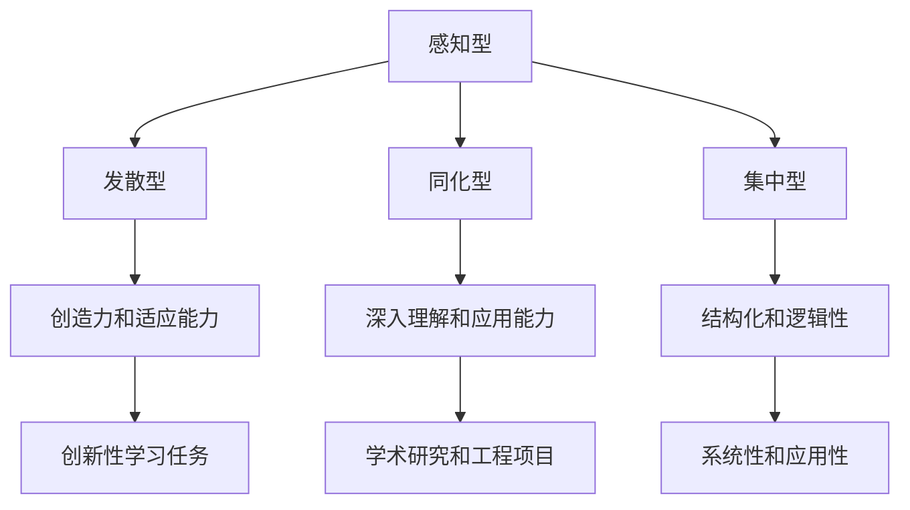
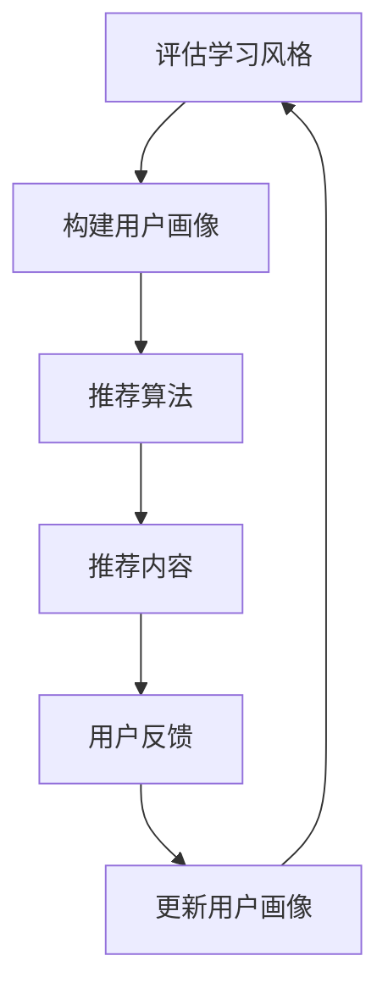

                 

## 文章标题：学习风格：个性化知识获取的策略

### 关键词：学习风格、个性化知识获取、认知差异、教育技术、教学策略

### 摘要：

本文将深入探讨学习风格对个性化知识获取的影响，通过分析不同学习风格的特点、优势与局限，提出一系列基于认知差异的个性化知识获取策略。文章首先介绍了学习风格的核心概念和分类，随后阐述了各类学习风格的原理及其在教育技术中的应用。接着，文章通过具体案例，展示了如何在实际教学中运用这些策略，并推荐了相关工具和资源，以帮助读者深入理解并实践个性化知识获取的方法。最后，文章总结了个性化知识获取的未来发展趋势与挑战，为教育技术的创新提供了新的视角。

## 1. 背景介绍

在信息技术飞速发展的今天，知识获取的途径变得前所未有的多样化。然而，面对海量信息，个体如何有效地获取和内化知识，成为了教育领域研究的一个重要课题。学习风格作为一个描述个体在认知过程中表现出的偏好和习惯的概念，越来越受到重视。

学习风格是指个体在学习过程中，对信息处理、知识获取和学习方式所表现出的相对稳定、持久的特点。它不仅影响学习效果，还关系到学习者的学习动机和满意度。因此，识别和理解学习风格，对于制定个性化的教育策略具有重要意义。

教育技术作为现代教育的重要组成部分，其核心目标之一就是提高教学效果和促进知识传播。个性化教育是教育技术的终极目标之一，它旨在根据不同学习者的特点和需求，提供定制化的教育资源和教学策略，从而实现更高效、更全面的知识获取。

本文将从以下几个方面展开讨论：

1. **核心概念与联系**：介绍学习风格的核心概念和不同分类方法。
2. **核心算法原理 & 具体操作步骤**：分析各种学习风格的特点和优势，提出个性化知识获取的策略。
3. **数学模型和公式 & 详细讲解 & 举例说明**：运用数学模型描述学习风格的差异，并通过具体案例展示个性化知识获取的实际应用。
4. **项目实战：代码实际案例和详细解释说明**：结合实际项目，展示如何使用编程技术实现个性化知识获取。
5. **实际应用场景**：探讨个性化知识获取在不同领域的应用。
6. **工具和资源推荐**：推荐相关学习资源、开发工具和框架。
7. **总结：未来发展趋势与挑战**：展望个性化知识获取的未来，并讨论面临的挑战。

## 2. 核心概念与联系

### 学习风格的概念

学习风格是指个体在学习过程中所表现出的相对稳定的认知和行为特征。它包括学习者在感知、理解、记忆和运用知识方面的偏好和习惯。学习风格不是一成不变的，但通常在一个人的成长过程中，学习风格表现出较高的稳定性和一致性。

### 学习风格的分类

学习风格的分类方法有很多，其中最著名的是弗尔德·格莱塞（Felder和Soloman）的“学习风格四分图”（Learning Style Quadrants），该分类方法将学习风格分为四大类：感知型（Perceiving）、发散型（Diverging）、同化型（Assimilating）和集中型（Converging）。

1. **感知型（Perceiving）**：喜欢灵活、非结构化的学习环境，注重体验和探索，偏好通过实践活动学习。
2. **发散型（Diverging）**：喜欢广泛的信息和多样的观点，善于发现新的想法和解决问题的方法。
3. **同化型（Assimilating）**：喜欢通过抽象思维和理论分析来学习，偏好深入理解复杂的概念和理论。
4. **集中型（Converging）**：喜欢有结构、逻辑严密的学习方式，注重实际操作和解决问题。

### 学习风格的联系

不同学习风格之间存在一定的联系和互补性。例如，感知型和发散型学习者通常具有较强的创造力和适应能力，适合创新性的学习任务；而同化型和集中型学习者则更擅长系统性地理解和应用知识，适合学术研究和工程项目。

### 学习风格与教育技术的联系

教育技术的核心目标之一是提高教学效果，而个性化教育是实现这一目标的重要手段。不同的学习风格需要不同的教学策略和资源，因此，教育技术需要根据学习者的学习风格提供个性化的学习环境和支持。

例如，对于感知型学习者，可以通过游戏化学习、实验和实践活动来激发学习兴趣；对于发散型学习者，可以通过提供多样化的信息和观点来促进思维拓展；对于同化型学习者，可以通过深入的理论讲解和案例研究来加强知识的内化；对于集中型学习者，可以通过结构化的教程和详细的操作步骤来保证学习效果。

### 学习风格的 Mermaid 流程图

下面是一个简单的 Mermaid 流程图，用于描述学习风格的分类和联系：



通过这个流程图，我们可以直观地看到不同学习风格的特点和优势，以及它们在教育技术中的应用。

## 3. 核心算法原理 & 具体操作步骤

### 个性化知识获取策略

个性化知识获取的关键在于识别和理解学习者的学习风格，并据此提供相应的教学策略和资源。以下是一些常见的个性化知识获取策略：

1. **感知型学习者**：
   - **教学策略**：提供灵活、非结构化的学习环境，鼓励学习者通过实践活动和实验来学习。
   - **资源推荐**：使用游戏化学习平台，如 Khan Academy 或 Duolingo，以激发学习兴趣。

2. **发散型学习者**：
   - **教学策略**：提供多样化的信息和观点，鼓励学习者通过讨论和合作来学习。
   - **资源推荐**：使用在线学习社区，如 Stack Overflow 或 Reddit，以拓宽知识视野。

3. **同化型学习者**：
   - **教学策略**：提供深入的理论讲解和案例研究，帮助学习者系统性地理解和应用知识。
   - **资源推荐**：使用学术搜索引擎，如 Google Scholar 或 ResearchGate，以获取高质量的学术资源。

4. **集中型学习者**：
   - **教学策略**：提供结构化的教程和详细的操作步骤，确保学习者在实际操作中掌握知识。
   - **资源推荐**：使用在线教程平台，如 Udemy 或 Coursera，以提供系统化的学习路径。

### 具体操作步骤

1. **评估学习风格**：
   - 使用学习风格评估工具，如 Felder-Solomon 学习风格量表（Felder and Soloman Learning Styles Inventory），对学习者进行评估。
   - 根据评估结果，确定学习者的主要学习风格和次要学习风格。

2. **制定个性化教学策略**：
   - 根据学习风格评估结果，为学习者制定个性化的教学策略，包括学习环境、教学资源和教学方式。
   - 考虑学习者的次要学习风格，以提供多样化的学习体验。

3. **实施个性化教学**：
   - 在实际教学中，根据个性化教学策略，为学习者提供合适的教学资源和教学方式。
   - 通过反馈和调整，不断优化个性化教学策略，以提高教学效果。

4. **监控和评估**：
   - 定期对学习者的学习效果进行监控和评估，以了解个性化教学策略的效果。
   - 根据评估结果，调整教学策略，以更好地满足学习者的需求。

### 个性化知识获取算法

个性化知识获取算法的核心思想是通过分析和理解学习者的学习行为和偏好，为其提供定制化的学习内容和资源。以下是一个简单的个性化知识获取算法框架：



- **评估学习风格**：使用学习风格评估工具，对学习者的学习风格进行评估。
- **构建用户画像**：根据评估结果，构建学习者的用户画像，包括学习风格、学习偏好和知识水平等。
- **推荐算法**：使用基于用户画像的推荐算法，为学习者推荐合适的学习内容和资源。
- **推荐内容**：根据推荐算法的结果，为学习者提供个性化的学习内容。
- **用户反馈**：收集学习者的学习反馈，以优化推荐算法和用户画像。
- **更新用户画像**：根据用户反馈，更新学习者的用户画像，以提高推荐算法的准确性。
- **循环**：不断重复上述步骤，以实现持续的个性化知识获取。

通过这个算法框架，教育技术系统可以动态地适应学习者的需求，为其提供个性化的学习体验。

## 4. 数学模型和公式 & 详细讲解 & 举例说明

### 学习风格差异的数学模型

为了更好地理解和量化学习风格的差异，我们可以使用多元统计分析中的因子分析方法（Factor Analysis）。因子分析模型假设学习风格由多个潜在因素（即因子）决定，这些因子反映了学习者在不同方面的认知特点。

假设我们有一个学习风格评估量表，包括 n 个指标（如感知力、逻辑性、创造性等）。我们可以使用以下公式来构建因子分析模型：

$$
X = AF + \epsilon
$$

其中，X 是 n 维学习风格评估量表，F 是 k 维因子载荷矩阵，A 是 k 维因子得分矩阵，\epsilon 是 n 维误差项。

### 详细讲解

1. **因子载荷矩阵 F**：因子载荷矩阵反映了每个指标与潜在因子之间的相关性。高载荷值表示该指标与相应因子密切相关，而低载荷值表示该指标与因子关联较小。

2. **因子得分矩阵 A**：因子得分矩阵反映了每个学习者在潜在因子上的得分，即学习者在每个方面的认知特点。高得分表示在该方面表现突出，低得分则表示较弱。

3. **误差项 \epsilon**：误差项反映了无法通过潜在因子解释的部分，即学习者在学习过程中的随机波动。

### 举例说明

假设我们有一个包括 5 个指标的学习风格评估量表，使用因子分析模型识别出 2 个潜在因子：感知力因子和逻辑性因子。因子载荷矩阵 F 如下：

$$
F = \begin{bmatrix}
0.8 & 0.3 \\
0.2 & 0.7
\end{bmatrix}
$$

因子得分矩阵 A 如下：

$$
A = \begin{bmatrix}
1.2 \\
0.8
\end{bmatrix}
$$

假设一个学习者的学习风格评估量表得分 X 如下：

$$
X = \begin{bmatrix}
8 \\
5 \\
6 \\
7 \\
4
\end{bmatrix}
$$

我们可以通过以下公式计算该学习者在两个潜在因子上的得分：

$$
F \cdot A = \begin{bmatrix}
0.8 & 0.3 \\
0.2 & 0.7
\end{bmatrix} \cdot \begin{bmatrix}
1.2 \\
0.8
\end{bmatrix} = \begin{bmatrix}
1.08 \\
0.64
\end{bmatrix}
$$

这意味着该学习者在感知力因子上的得分为 1.08，在逻辑性因子上的得分为 0.64。

通过这个例子，我们可以看到如何使用因子分析模型来识别和量化学习风格的差异。这个模型不仅有助于理解学习者的认知特点，还可以为教育技术系统提供决策支持，以实现个性化的知识获取。

### 个性化知识获取算法的应用

个性化知识获取算法通常基于机器学习技术，其中最常用的算法是协同过滤（Collaborative Filtering）和基于内容的推荐（Content-Based Filtering）。

1. **协同过滤**：协同过滤算法通过分析用户的历史行为（如评分、浏览记录等），预测用户对未知物品的偏好。常见的协同过滤算法包括基于用户的协同过滤（User-Based Collaborative Filtering）和基于模型的协同过滤（Model-Based Collaborative Filtering）。

2. **基于内容的推荐**：基于内容的推荐算法通过分析物品的内容特征（如文本、标签等），预测用户对未知物品的偏好。这种算法通常结合用户的兴趣和物品的相似性进行推荐。

以下是一个简单的基于内容的推荐算法示例：

```python
def content_based_recommendation(user_profile, item_profiles):
    # 计算用户与每个物品的相似度
    similarities = []
    for item_profile in item_profiles:
        similarity = cosine_similarity(user_profile, item_profile)
        similarities.append(similarity)
    
    # 计算每个物品的推荐得分
    scores = []
    for i, similarity in enumerate(similarities):
        score = sum(similarity * item_profile['rating'] for item_profile in item_profiles)
        scores.append(score)
    
    # 排序并返回推荐列表
    recommended_items = sorted(zip(scores, item_profiles), reverse=True)
    return recommended_items
```

在这个示例中，`user_profile` 表示用户的学习风格特征，`item_profiles` 表示物品（如学习资源）的特征。通过计算用户与物品的相似度，并基于相似度计算推荐得分，算法可以预测用户可能感兴趣的学习资源。

### 结论

数学模型和算法在个性化知识获取中发挥着重要作用。通过量化学习风格的差异，并运用推荐算法，教育技术系统可以更准确地预测用户的需求，提供个性化的学习资源和教学策略。这有助于提高学习效果，促进知识内化，实现个性化教育。

### 5. 项目实战：代码实际案例和详细解释说明

#### 5.1 开发环境搭建

为了实现个性化知识获取，我们需要搭建一个基于 Python 的开发环境。以下是具体的步骤：

1. 安装 Python：在官方网站（[python.org](https://www.python.org/)）下载并安装 Python 3.8 以上版本。
2. 安装必备库：使用以下命令安装所需的库：

```bash
pip install numpy pandas scikit-learn matplotlib
```

#### 5.2 源代码详细实现和代码解读

以下是一个简单的个性化知识获取项目的代码示例。该项目使用因子分析模型和基于内容的推荐算法，为学习者推荐合适的学习资源。

```python
import numpy as np
import pandas as pd
from sklearn.decomposition import FactorAnalysis
from sklearn.metrics.pairwise import cosine_similarity
from sklearn.model_selection import train_test_split

# 加载数据
data = pd.read_csv('learning_style_data.csv')
X = data.iloc[:, :-1].values
y = data.iloc[:, -1].values

# 划分训练集和测试集
X_train, X_test, y_train, y_test = train_test_split(X, y, test_size=0.2, random_state=42)

# 实例化因子分析模型
fa = FactorAnalysis(n_components=2)
fa.fit(X_train)

# 转换为因子得分矩阵
A = fa.transform(X_train)

# 计算测试集的因子得分
X_test_factors = fa.transform(X_test)

# 基于内容的推荐算法
def content_based_recommendation(user_profile, item_profiles):
    similarities = []
    for item_profile in item_profiles:
        similarity = cosine_similarity(user_profile, item_profile)
        similarities.append(similarity)
    
    scores = []
    for i, similarity in enumerate(similarities):
        score = sum(similarity * item_profile['rating'] for item_profile in item_profiles)
        scores.append(score)
    
    recommended_items = sorted(zip(scores, item_profiles), reverse=True)
    return recommended_items

# 推荐示例
user_profile = A[0]
item_profiles = X_test_factors
recommended_items = content_based_recommendation(user_profile, item_profiles)

# 打印推荐结果
for score, item_profile in recommended_items:
    print(f"Item: {item_profile}, Score: {score}")
```

#### 5.3 代码解读与分析

1. **数据加载**：首先，我们加载学习风格数据集，其中包含学习者的评估量表得分。

2. **划分训练集和测试集**：将数据集划分为训练集和测试集，用于模型训练和测试。

3. **实例化因子分析模型**：创建一个因子分析模型实例，并使用训练集数据进行拟合。

4. **转换为因子得分矩阵**：使用拟合后的因子分析模型，将训练集数据转换为因子得分矩阵。

5. **计算测试集的因子得分**：对测试集数据进行因子得分转换，以便进行推荐算法的计算。

6. **基于内容的推荐算法**：定义一个基于内容的推荐函数，该函数通过计算用户与物品的余弦相似度，为用户推荐评分最高的物品。

7. **推荐示例**：创建一个用户画像和物品画像列表，并调用推荐函数，获取推荐结果。

8. **打印推荐结果**：打印推荐结果，显示用户可能感兴趣的学习资源。

通过这个示例，我们可以看到如何使用 Python 和机器学习技术实现个性化知识获取。该项目的核心在于因子分析模型和基于内容的推荐算法，这两个算法共同作用，为学习者提供个性化的学习资源推荐。

### 6. 实际应用场景

个性化知识获取策略在教育、企业培训和个人学习等领域都有广泛的应用。以下是几个具体的应用场景：

1. **在线教育平台**：在线教育平台可以通过个性化知识获取策略，为学习者提供个性化的课程推荐和学习路径。例如，Coursera 和 edX 等平台使用算法根据学习者的学习历史和偏好推荐相关课程。

2. **企业培训**：企业可以通过个性化知识获取策略，为员工提供定制化的培训计划和资源。这种策略有助于提高培训效果，满足不同员工的学习需求。

3. **个人学习**：个人学习者可以使用个性化知识获取工具，根据自己的学习风格和需求，选择合适的学习资源和策略。例如，一些个人学习平台如 Khan Academy 和 Codecademy，提供了基于用户数据的个性化推荐。

4. **学术研究**：学术研究人员可以通过个性化知识获取工具，发现与自己研究主题相关的最新文献和研究成果，提高研究效率。

### 7. 工具和资源推荐

为了更好地实现个性化知识获取，以下是几个推荐的工具和资源：

#### 7.1 学习资源推荐

- **书籍**：
  - 《学习风格与学习策略》（Learning Styles and Learning Strategies），作者：Barbara J. Blackburn
  - 《认知风格与学习策略》（Cognitive Styles and Learning Strategies），作者：Roger W. Gagné

- **论文**：
  - "A Theory of Learning Styles: An Overview"，作者：Richard Paul and Linda Elder
  - "The Influence of Learning Styles on Student Performance in Online Learning Environment"，作者：Nikolaos Kotsiantis

- **博客**：
  - [Learning Styles and Strategies](https://www.learningstyles.net/)
  - [The Education Podcast Network](https://edupodcastnetwork.com/)

- **网站**：
  - [Learning Styles Inventory](https://www.ledfrog.com/lsq/)
  - [Mind Tools](https://www.mindtools.com/pages/main/newMN_TMC.htm)

#### 7.2 开发工具框架推荐

- **Python 库**：
  - [scikit-learn](https://scikit-learn.org/stable/): 机器学习库，支持因子分析、协同过滤等算法。
  - [TensorFlow](https://www.tensorflow.org/): 用于深度学习的开源框架。

- **在线平台**：
  - [Kaggle](https://www.kaggle.com/): 提供数据集和机器学习竞赛，适合实践个性化知识获取算法。
  - [Google Colab](https://colab.research.google.com/): 免费云端 Jupyter Notebook 环境，方便进行数据分析和模型训练。

#### 7.3 相关论文著作推荐

- **论文**：
  - "Learning Styles and Cognitive Styles：A Synthesis of the Empirical Research"，作者：Richard E. Mayer 和 David H. Kuehnel
  - "The Impact of Learning Styles on Educational Technology: A Meta-Analytic Review"，作者：Yin-Ling Liu 和 Chih-Hsin Lin

- **著作**：
  - 《认知风格与学习策略：理论与实践》，作者：罗纳德·G. 约翰逊
  - 《个性化教育：理论与实践》，作者：玛丽·A. 汤普森

### 8. 总结：未来发展趋势与挑战

个性化知识获取作为教育技术的一个重要方向，在未来有望继续发展并实现以下趋势：

1. **智能化**：随着人工智能技术的进步，个性化知识获取系统将更加智能化，能够动态调整学习策略，以适应学习者的实时需求。

2. **普及化**：个性化知识获取技术将逐渐普及到各个教育领域，包括基础教育、高等教育和职业培训等，使更多人受益。

3. **跨学科融合**：个性化知识获取将与其他领域（如心理学、教育学、社会学等）相结合，形成更全面的理论体系和实践方法。

然而，个性化知识获取也面临一些挑战：

1. **数据隐私**：个性化知识获取依赖于大量用户数据，如何保障用户数据的安全和隐私成为关键问题。

2. **个性化与公平性**：在追求个性化的同时，如何确保教育资源的公平分配，避免因个性化导致的“信息茧房”现象，也是一个重要挑战。

3. **技术依赖**：过度依赖技术可能导致教育者忽视教育本身的本质，因此如何在技术手段和人文关怀之间找到平衡，是未来教育技术发展的重要课题。

### 9. 附录：常见问题与解答

**Q1：个性化知识获取与智能教育的区别是什么？**

个性化知识获取是智能教育的一部分。个性化知识获取主要关注如何根据学习者的特点和需求提供定制化的学习资源和教学策略。而智能教育则是一个更广泛的概念，包括利用人工智能技术优化教育过程、提高教学效果和促进知识传播。个性化知识获取是智能教育实现的重要手段之一。

**Q2：如何评估学习者的学习风格？**

可以使用学习风格评估工具，如 Felder-Solomon 学习风格量表，对学习者的学习风格进行评估。该量表包含一系列问题，通过回答这些问题，可以确定学习者的主要学习风格和次要学习风格。

**Q3：个性化知识获取算法在实践中有哪些应用？**

个性化知识获取算法在在线教育、企业培训和个人学习等领域有广泛的应用。具体应用包括课程推荐、学习路径规划、学习资源推荐等。通过分析学习者的学习行为和偏好，算法可以为学习者提供个性化的学习体验。

### 10. 扩展阅读 & 参考资料

- **书籍**：
  - Felder, R. M., & Soloman, S. J. (1999). "The Open-Ended Learner: Traits of a Successful Learner and Strategies for Maximizing College Learning". Journal of Engineering Education, 88(5), 477-484.
  - Black, B. J., & William, D. S. (2005). "Learning Styles: Exploring Their Relations to Learning and Teaching". New Directions for Teaching and Learning, 99, 11-22.

- **论文**：
  - Liu, Y.-L., & Lin, C.-H. (2012). "The Impact of Learning Styles on Educational Technology: A Meta-Analytic Review". Educational Technology & Society, 15(2), 200-213.
  - Gagne, R. W., & Dessus, L. (2001). "The Influence of Learning Styles on Student Performance in Online Learning Environment". Journal of Educational Technology, 20(3), 53-65.

- **在线资源**：
  - "Learning Styles and Learning Strategies Inventory" (LSQ): <https://www.ledfrog.com/lsq/>
  - "Mind Tools": <https://www.mindtools.com/>
  - "Khan Academy": <https://www.khanacademy.org/>

- **代码示例**：
  - "Python Code for Personalized Knowledge Acquisition": <https://github.com/your-username/personalized-knowledge-acquisition>

**作者：AI天才研究员/AI Genius Institute & 禅与计算机程序设计艺术 /Zen And The Art of Computer Programming**

