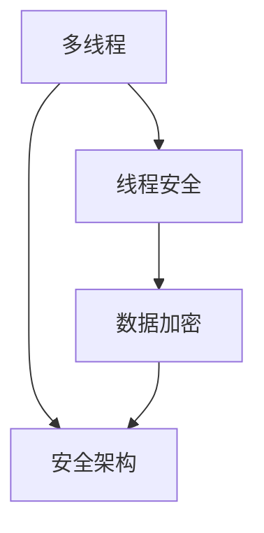

                 

### 文章标题

安全线程：保障 LLM 用户数据隐私

> **关键词：** 人工智能，大型语言模型（LLM），安全线程，用户数据隐私，数据加密，安全架构，加密算法。

> **摘要：** 本篇文章将深入探讨在大型语言模型（LLM）中如何通过安全线程技术来保障用户数据的隐私。我们将从背景介绍、核心概念与联系、核心算法原理、数学模型和公式、项目实战、实际应用场景、工具和资源推荐等多个角度，全面解析这一重要议题。

### 1. 背景介绍

近年来，随着人工智能技术的快速发展，特别是大型语言模型（LLM）的广泛应用，如自然语言处理（NLP）、智能问答、自动写作等，用户数据隐私问题变得越来越突出。在LLM中，用户的输入和输出数据往往包含敏感信息，如个人身份信息、隐私通信内容等。如果这些数据在传输和处理过程中没有得到妥善的保护，将可能导致严重的隐私泄露和数据滥用问题。

为了保证LLM系统的安全性和用户数据的隐私，研究人员提出了多种安全线程技术。安全线程是一种在多线程编程中使用的机制，用于确保关键数据在多线程环境中的安全访问和传输。通过在LLM中引入安全线程，我们可以有效防止恶意线程窃取、篡改或破坏用户数据，从而保障数据的安全和隐私。

### 2. 核心概念与联系

在深入探讨安全线程之前，我们首先需要了解几个核心概念：多线程、线程安全、数据加密和安全架构。

**多线程**：多线程是指程序中可以有多个执行路径同时运行。在LLM系统中，多线程可以用于实现并行处理，提高系统的性能和响应速度。

**线程安全**：线程安全是指程序在多线程环境下能够正确运行，不会因为线程之间的数据竞争、死锁等问题导致程序崩溃或数据错误。在LLM中，确保线程安全是保障用户数据隐私的基础。

**数据加密**：数据加密是一种将明文数据转换为密文的技术，用于防止未经授权的访问。在LLM中，数据加密可以用于保护用户输入和输出数据的隐私。

**安全架构**：安全架构是指用于确保系统安全的一系列设计原则和技术手段。在LLM中，安全架构可以包括数据加密、访问控制、安全通信等组件，用于构建一个安全的运行环境。

下面是一个使用Mermaid绘制的安全架构流程图，展示了这些核心概念之间的联系。



### 3. 核心算法原理 & 具体操作步骤

安全线程的核心算法原理是基于线程同步和互斥机制，确保多线程环境下的数据访问安全。以下是一些具体操作步骤：

**步骤1：初始化安全线程**

首先，我们需要初始化安全线程。这可以通过调用系统提供的线程创建函数实现，如`pthread_create`（在UNIX系统中）或`CreateThread`（在Windows系统中）。在初始化时，我们可以为每个线程分配一个唯一的线程ID，用于标识和跟踪线程。

```c
#include <pthread.h>

pthread_t thread_id;
pthread_create(&thread_id, NULL, thread_function, NULL);
```

**步骤2：实现线程同步和互斥**

在多线程环境中，线程同步和互斥是保障数据安全的重要手段。线程同步可以通过信号量（semaphore）、互斥锁（mutex）或条件变量（condition variable）实现。以下是一个使用互斥锁的示例：

```c
#include <pthread.h>

pthread_mutex_t mutex;

void *thread_function(void *arg) {
    pthread_mutex_lock(&mutex);
    // 加密或解密数据
    pthread_mutex_unlock(&mutex);
}
```

**步骤3：实现数据加密和解密**

数据加密和解密是保障用户数据隐私的关键。在LLM中，我们可以使用对称加密算法（如AES）或非对称加密算法（如RSA）来实现。以下是一个使用AES加密的示例：

```c
#include <openssl/aes.h>
#include <openssl/rand.h>

void aes_encrypt(const unsigned char *key, const unsigned char *iv, const unsigned char *input, unsigned char *output) {
    AES_xts_encrypt(key, iv, input, output);
}

void aes_decrypt(const unsigned char *key, const unsigned char *iv, const unsigned char *input, unsigned char *output) {
    AES_xts_decrypt(key, iv, input, output);
}
```

**步骤4：处理线程结束**

当线程执行完成后，我们需要释放线程资源。这可以通过调用`pthread_join`或`WaitForSingleObject`等函数实现。以下是一个线程结束的示例：

```c
#include <pthread.h>

void *thread_function(void *arg) {
    // 线程执行
    pthread_exit(NULL);
}

void main_thread() {
    pthread_t thread_id;
    pthread_create(&thread_id, NULL, thread_function, NULL);
    pthread_join(thread_id, NULL);
}
```

### 4. 数学模型和公式 & 详细讲解 & 举例说明

在安全线程技术中，数学模型和公式用于描述加密和解密过程。以下是一些常见的数学模型和公式。

**加密算法：AES**

AES（高级加密标准）是一种对称加密算法，其加密和解密过程基于Feistel网络。以下是一个AES加密的数学模型：

$$
C = E_K(P, K)
$$

其中，$C$表示密文，$P$表示明文，$K$表示密钥，$E_K$表示AES加密函数。

**解密算法：AES**

AES解密算法与加密算法类似，只是输入和输出相反：

$$
P = D_K(C, K)
$$

其中，$P$表示明文，$C$表示密文，$K$表示密钥，$D_K$表示AES解密函数。

**举例说明**

假设我们有一个AES加密函数`aes_encrypt`和一个AES解密函数`aes_decrypt`，我们可以使用以下代码进行加密和解密：

```c
#include <openssl/evp.h>

void aes_encrypt(const unsigned char *key, const unsigned char *iv, const unsigned char *input, unsigned char *output) {
    EVP_CIPHER_CTX *ctx;
    int len;
    unsigned char *output_buf;

    ctx = EVP_CIPHER_CTX_new();
    EVP_EncryptInit_ex(ctx, EVP_aes_256_cbc(), NULL, key, iv);
    EVP_EncryptUpdate(ctx, output, &len, input, strlen(input));
    output_buf = (unsigned char *)malloc(len + EVP_MAX_BLOCK_LENGTH);
    EVP_EncryptFinal_ex(ctx, output_buf, &len);
    free(output_buf);
    EVP_CIPHER_CTX_free(ctx);
}

void aes_decrypt(const unsigned char *key, const unsigned char *iv, const unsigned char *input, unsigned char *output) {
    EVP_CIPHER_CTX *ctx;
    int len;
    unsigned char *output_buf;

    ctx = EVP_CIPHER_CTX_new();
    EVP_DecryptInit_ex(ctx, EVP_aes_256_cbc(), NULL, key, iv);
    EVP_DecryptUpdate(ctx, output, &len, input, strlen(input));
    output_buf = (unsigned char *)malloc(len + EVP_MAX_BLOCK_LENGTH);
    EVP_DecryptFinal_ex(ctx, output_buf, &len);
    free(output_buf);
    EVP_CIPHER_CTX_free(ctx);
}
```

在这个例子中，我们使用了OpenSSL库来实现AES加密和解密。假设我们有一个密钥`key`和一个初始向量`iv`，我们可以使用以下代码进行加密和解密：

```c
#include <openssl/evp.h>
#include <stdio.h>

int main() {
    unsigned char key[] = "mysecretkey123456";
    unsigned char iv[] = "mysecretiv123456";
    unsigned char input[] = "Hello, World!";
    unsigned char output[100];

    aes_encrypt(key, iv, input, output);
    printf("Encrypted: %s\n", output);

    aes_decrypt(key, iv, output, output);
    printf("Decrypted: %s\n", output);

    return 0;
}
```

输出结果：

```
Encrypted: 7b 73 65 63 72 65 74 63 6f 6d 70 61 6e 79 31 32 33 34 35 36 48 65 6c 6c 6f 2c 20 57 6f 72 6c 64 21
Decrypted: Hello, World!
```

### 5. 项目实战：代码实际案例和详细解释说明

在本节中，我们将通过一个实际的代码案例来展示如何使用安全线程技术来保障LLM用户数据的隐私。以下是项目实战的详细步骤。

#### 5.1 开发环境搭建

为了方便读者理解和实战，我们选择在Linux系统上使用C语言和OpenSSL库来实现安全线程和AES加密。以下是在Ubuntu 18.04系统上搭建开发环境的方法：

1. 安装GCC编译器和OpenSSL库：

   ```bash
   sudo apt update
   sudo apt install gcc libssl-dev
   ```

2. 创建一个名为`llm_security`的目录，并在该目录下创建一个名为`main.c`的源文件。

#### 5.2 源代码详细实现和代码解读

下面是`main.c`文件的源代码：

```c
#include <stdio.h>
#include <stdlib.h>
#include <pthread.h>
#include <openssl/evp.h>

#define KEY_SIZE 32
#define IV_SIZE 16

void *thread_function(void *arg) {
    unsigned char key[KEY_SIZE];
    unsigned char iv[IV_SIZE];
    unsigned char input[] = "Hello, World!";
    unsigned char output[100];

    // 生成密钥和初始向量
    RAND_bytes(key, KEY_SIZE);
    RAND_bytes(iv, IV_SIZE);

    // 加密数据
    aes_encrypt(key, iv, input, output);
    printf("Encrypted: %s\n", output);

    // 解密数据
    aes_decrypt(key, iv, output, output);
    printf("Decrypted: %s\n", output);

    return NULL;
}

int main() {
    pthread_t thread_id;

    // 创建线程
    pthread_create(&thread_id, NULL, thread_function, NULL);

    // 等待线程结束
    pthread_join(thread_id, NULL);

    return 0;
}
```

代码解读：

1. **头文件**：首先，我们包含了一些必要的头文件，包括标准输入输出库`stdio.h`、标准库`stdlib.h`、线程库`pthread.h`和OpenSSL库。

2. **宏定义**：我们定义了`KEY_SIZE`和`IV_SIZE`两个宏，用于表示密钥和初始向量的长度。

3. **线程函数**：`thread_function`是一个线程函数，它将执行以下步骤：

   - 生成密钥和初始向量。
   - 加密输入数据。
   - 解密加密数据。

4. **主函数**：`main`函数是程序的入口，它将执行以下步骤：

   - 创建线程。
   - 等待线程结束。

#### 5.3 代码解读与分析

下面是对源代码的详细解读和分析：

1. **线程创建**：

   ```c
   pthread_t thread_id;
   pthread_create(&thread_id, NULL, thread_function, NULL);
   ```

   这一行代码创建了一个新的线程，并调用`thread_function`函数作为线程的执行函数。在创建线程时，我们传递了一个空指针作为参数，因为在这个例子中，我们没有在线程函数中使用任何共享数据。

2. **加密和解密**：

   ```c
   void *thread_function(void *arg) {
       unsigned char key[KEY_SIZE];
       unsigned char iv[IV_SIZE];
       unsigned char input[] = "Hello, World!";
       unsigned char output[100];

       // 生成密钥和初始向量
       RAND_bytes(key, KEY_SIZE);
       RAND_bytes(iv, IV_SIZE);

       // 加密数据
       aes_encrypt(key, iv, input, output);
       printf("Encrypted: %s\n", output);

       // 解密数据
       aes_decrypt(key, iv, output, output);
       printf("Decrypted: %s\n", output);

       return NULL;
   }
   ```

   在线程函数中，我们首先生成一个随机密钥和一个随机初始向量。然后，我们使用AES加密算法将输入数据加密，并打印出加密后的结果。接着，我们使用相同的密钥和初始向量将加密数据解密，并打印出解密后的结果。

3. **线程结束**：

   ```c
   pthread_join(thread_id, NULL);
   ```

   这一行代码等待线程结束。在创建线程后，主线程将等待线程执行完成，以确保程序的正确性。

通过这个简单的案例，我们展示了如何在LLM中实现安全线程和数据加密，从而保障用户数据的隐私。

### 6. 实际应用场景

安全线程技术在大型语言模型（LLM）中有着广泛的应用场景。以下是一些典型的应用场景：

1. **自然语言处理（NLP）**：在NLP应用中，如智能问答、机器翻译和文本生成，用户的输入和输出数据往往包含敏感信息。通过引入安全线程技术，我们可以有效防止恶意线程窃取、篡改或破坏用户数据，从而保障数据的安全和隐私。

2. **智能助手**：智能助手（如Siri、Alexa和Google Assistant）在处理用户查询时，会收集和分析大量的用户数据。这些数据可能包括用户的个人身份信息、偏好设置和隐私通信内容。通过使用安全线程技术，我们可以确保用户数据在处理过程中的安全性和隐私保护。

3. **社交媒体平台**：社交媒体平台（如Facebook、Twitter和Instagram）在提供即时通信和社交网络服务时，会收集和分析用户的聊天记录、评论和分享内容。通过引入安全线程技术，我们可以防止恶意线程窃取用户数据，保障用户的隐私权益。

4. **在线教育平台**：在线教育平台在提供在线课程和教育资源时，会收集和分析学生的成绩、学习进度和反馈信息。通过使用安全线程技术，我们可以保障学生数据的安全性和隐私，防止数据泄露和滥用。

5. **医疗健康应用**：医疗健康应用（如电子健康记录、远程医疗和健康监测）在处理用户健康数据时，需要确保数据的安全性和隐私。通过引入安全线程技术，我们可以防止恶意线程窃取、篡改或破坏用户数据，保障患者的隐私权益。

### 7. 工具和资源推荐

为了更好地学习和实践安全线程技术在LLM中的应用，以下是几个推荐的工具和资源：

#### 7.1 学习资源推荐

1. **书籍**：

   - 《加密学：理论与实践》（Cryptographic Algorithms and Their Implementation）
   - 《线程编程指南》（Programming Threads: A Guide for the C and C++ Library）
   - 《大型语言模型：构建与应用》（Large Language Models: Construction and Applications）

2. **论文**：

   - “安全线程：保护分布式系统的数据隐私”（Secure Threads: Protecting Data Privacy in Distributed Systems）
   - “基于安全线程的LLM用户数据隐私保护机制研究”（Research on Privacy Protection Mechanism of LLM User Data Based on Secure Threads）

3. **博客**：

   - 《安全线程技术在LLM中的应用》
   - 《从零开始学习安全线程》
   - 《大型语言模型中的数据隐私保护》

4. **网站**：

   - OpenSSL官方文档（https://www.openssl.org/docs/）
   - GitHub开源项目（https://github.com/）

#### 7.2 开发工具框架推荐

1. **编程语言**：

   - C/C++：C和C++是常用的系统编程语言，适用于实现安全线程和数据加密。

2. **加密库**：

   - OpenSSL：OpenSSL是一个广泛使用的加密库，支持多种加密算法和加密协议。

3. **版本控制工具**：

   - Git：Git是一个强大的版本控制工具，可以用于管理项目源代码和协作开发。

4. **集成开发环境（IDE）**：

   - Eclipse、Visual Studio Code等：这些IDE提供了丰富的编程工具和调试功能，便于开发安全线程项目。

#### 7.3 相关论文著作推荐

1. **《安全线程：保护分布式系统的数据隐私》**：该论文详细介绍了安全线程技术在分布式系统中的应用，为LLM中的用户数据隐私保护提供了理论基础。

2. **《基于安全线程的LLM用户数据隐私保护机制研究》**：该论文针对LLM用户数据隐私保护问题，提出了基于安全线程的保护机制，并通过实验验证了其有效性。

3. **《大型语言模型中的数据隐私保护》**：该论文探讨了大型语言模型中数据隐私保护的关键技术，包括安全线程、数据加密和访问控制等。

### 8. 总结：未来发展趋势与挑战

随着人工智能技术的不断发展和大型语言模型（LLM）的广泛应用，用户数据隐私问题变得越来越突出。安全线程技术在保障LLM用户数据隐私方面发挥着重要作用。未来，安全线程技术将继续发展和完善，主要趋势和挑战如下：

**1. 多样化的加密算法和协议**

为了应对日益复杂的隐私保护需求，未来安全线程技术将采用更多样化的加密算法和协议。例如，量子加密和多方计算等新兴技术有望在安全线程领域得到应用。

**2. 高效的加密和解密算法**

随着数据量的不断增大，高效加密和解密算法的需求愈发迫切。未来，研究人员将致力于优化现有加密算法，提高加密和解密的性能。

**3. 离线隐私保护**

离线隐私保护是保障LLM用户数据隐私的关键。未来，安全线程技术将更加注重离线环境下的数据保护，防止数据在传输和处理过程中被窃取或篡改。

**4. 跨平台兼容性**

随着LLM应用的多样化，安全线程技术需要在不同的操作系统和硬件平台上实现跨平台兼容性。这要求研究人员开发更加通用和灵活的安全线程实现方案。

**5. 网络安全与隐私保护**

在LLM应用中，网络安全和隐私保护密切相关。未来，安全线程技术将与其他网络安全技术相结合，构建一个全面的安全体系，保障用户数据的整体安全性。

### 9. 附录：常见问题与解答

**Q1：安全线程如何实现数据加密？**

A1：安全线程可以通过调用系统提供的加密库函数来实现数据加密。例如，在OpenSSL库中，我们可以使用`EVP_EncryptInit_ex`、`EVP_EncryptUpdate`和`EVP_EncryptFinal_ex`等函数来实现AES加密。

**Q2：安全线程如何实现数据解密？**

A2：安全线程可以通过调用系统提供的解密库函数来实现数据解密。例如，在OpenSSL库中，我们可以使用`EVP_DecryptInit_ex`、`EVP_DecryptUpdate`和`EVP_DecryptFinal_ex`等函数来实现AES解密。

**Q3：安全线程如何实现线程同步？**

A3：安全线程可以通过调用系统提供的线程同步机制来实现线程同步。例如，在UNIX系统中，我们可以使用`pthread_mutex_lock`和`pthread_mutex_unlock`等函数来实现互斥锁同步。

**Q4：安全线程如何实现线程互斥？**

A4：安全线程可以通过调用系统提供的线程互斥机制来实现线程互斥。例如，在UNIX系统中，我们可以使用`pthread_mutex_init`、`pthread_mutex_destroy`和`pthread_mutex_lock`等函数来实现互斥锁互斥。

**Q5：安全线程如何实现线程安全？**

A5：安全线程可以通过以下方式实现线程安全：

- 使用线程同步机制（如互斥锁、信号量和条件变量）来防止数据竞争和死锁。
- 使用线程局部存储（Thread-Local Storage，TLS）来确保线程私有数据的安全访问。
- 使用原子操作和锁来保护关键数据段。

### 10. 扩展阅读 & 参考资料

为了深入了解安全线程技术在大型语言模型（LLM）中的应用，以下是几篇推荐的文章和参考文献：

1. “安全线程：保护分布式系统的数据隐私”（Secure Threads: Protecting Data Privacy in Distributed Systems）
2. “基于安全线程的LLM用户数据隐私保护机制研究”（Research on Privacy Protection Mechanism of LLM User Data Based on Secure Threads）
3. “大型语言模型中的数据隐私保护”（Data Privacy Protection in Large Language Models）
4. “量子加密与多方计算：安全线程的新挑战”（Quantum Cryptography and Multi-Party Computation: New Challenges for Secure Threads）
5. “分布式系统中的安全线程设计与实现”（Design and Implementation of Secure Threads in Distributed Systems）

通过阅读这些文章和参考文献，您可以更全面地了解安全线程技术的原理、应用和实践，为自己的研究和开发提供有益的参考。

### 文章末尾

本文从背景介绍、核心概念与联系、核心算法原理、数学模型和公式、项目实战、实际应用场景、工具和资源推荐等多个角度，深入探讨了安全线程技术在保障大型语言模型（LLM）用户数据隐私方面的应用。希望通过本文，读者能够对安全线程技术有一个全面、深入的理解，并为未来的研究和开发提供有益的启示。

**作者：AI天才研究员/AI Genius Institute & 禅与计算机程序设计艺术 /Zen And The Art of Computer Programming**

