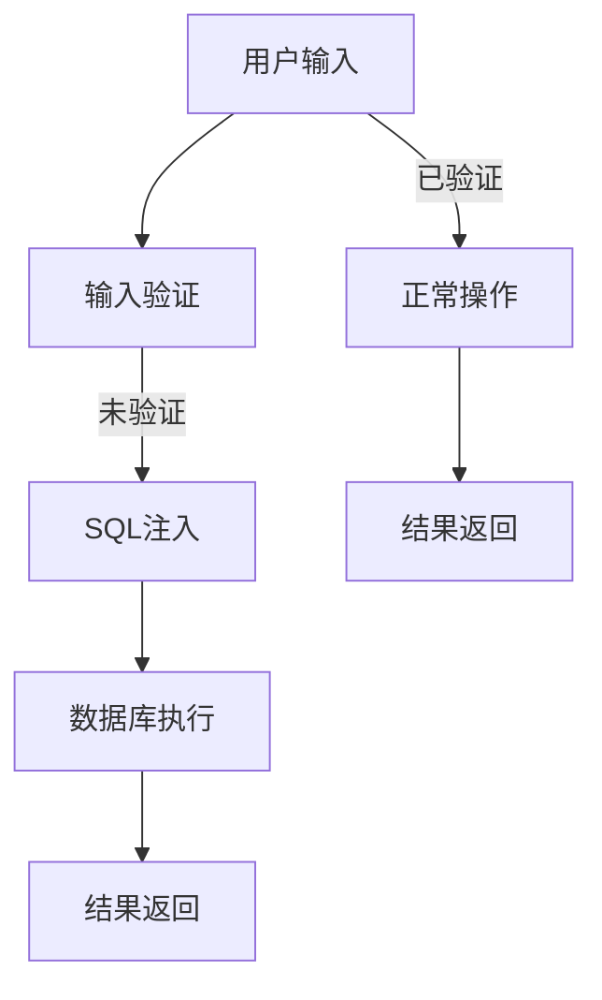

                 

### 背景介绍

#### Web攻击的兴起

随着互联网的普及和信息技术的发展，Web应用成为了人们日常工作和生活中不可或缺的一部分。然而，与此同时，Web攻击也逐渐成为网络安全领域的主要威胁。Web攻击的手段层出不穷，形式多样，使得网络安全形势愈加严峻。

Web攻击主要分为以下几类：

1. **SQL注入（SQL Injection）**：攻击者通过在Web应用的输入字段中插入恶意SQL代码，从而篡改数据库数据或执行非法操作。
2. **跨站脚本攻击（XSS）**：攻击者通过在目标Web页面中注入恶意脚本，使得这些脚本在用户的浏览器中执行，从而窃取用户信息或实施其他恶意行为。
3. **跨站请求伪造（CSRF）**：攻击者通过伪造用户的请求，在用户不知情的情况下执行非法操作。
4. **文件上传漏洞**：攻击者通过上传恶意文件，可能获取Web服务器的控制权限或执行恶意代码。
5. **远程代码执行（RCE）**：攻击者通过漏洞在服务器上执行任意代码，从而完全控制服务器。

这些攻击方式不仅给企业和个人带来了严重的经济损失，还可能导致敏感数据的泄露，影响用户隐私和信息安全。因此，安全编程实践成为了每一个开发者必须掌握的技能。

#### 安全编程的重要性

安全编程实践不仅仅是为了防止Web攻击，更是为了构建可靠、可信的软件系统。以下是安全编程的重要性：

1. **保护用户数据**：安全编程可以防止敏感数据被未授权访问，确保用户隐私和安全。
2. **避免经济损失**：安全漏洞可能导致企业蒙受巨大的经济损失，如罚款、赔偿等。
3. **提升品牌形象**：安全可靠的软件系统可以增强用户对企业的信任，提升品牌形象。
4. **合规要求**：许多国家和地区都有相关的法律法规要求企业保障用户信息安全，违反这些规定可能导致严重的法律后果。

因此，作为开发者，我们应该时刻保持警惕，掌握安全编程的实践方法，为构建安全可靠的Web应用贡献力量。

### 核心概念与联系

#### SQL注入（SQL Injection）

SQL注入是一种常见的Web攻击方式，攻击者通过在Web应用的输入字段中插入恶意SQL代码，从而控制数据库或篡改数据。以下是一个简单的SQL注入示例：

**正常输入：**
```
SELECT * FROM users WHERE username='admin' AND password='password';
```

**恶意输入（SQL注入）**：
```
SELECT * FROM users WHERE username='admin' AND password='password' OR '1'='1';
```
这条恶意SQL代码会返回所有用户数据，因为 `'1'='1'` 总是为真。

#### 跨站脚本攻击（XSS）

跨站脚本攻击（XSS）是一种通过在Web页面中注入恶意脚本，从而控制用户浏览器执行的攻击方式。以下是一个简单的XSS示例：

**正常输入：**
```
<p>Welcome, <b>username</b>!</p>
```

**恶意输入（XSS）**：
```
<p>Welcome, <b><script>alert('XSS Attack!');</script>username</b>!</p>
```
这段恶意脚本会在用户的浏览器中弹出一个警告框，显示“XSS Attack!”。

#### 跨站请求伪造（CSRF）

跨站请求伪造（CSRF）攻击通过伪造用户的请求，在用户不知情的情况下执行非法操作。以下是一个简单的CSRF示例：

**正常请求：**
```
POST /login?username=admin&password=password
```

**CSRF攻击**：
攻击者创建一个恶意网页，包含一个指向目标网站的登录请求的链接。当用户访问这个恶意网页时，请求会自动发送到目标网站，导致用户在不知情的情况下登录。

#### 文件上传漏洞

文件上传漏洞允许攻击者上传恶意文件到服务器，从而获取服务器权限或执行恶意代码。以下是一个简单的文件上传漏洞示例：

**正常上传：**
```
UPLOAD /var/www/html/index.html
```

**恶意上传（文件上传漏洞）**：
```
UPLOAD /var/www/html/shell.php
```
这个恶意文件可能是一个Webshell，攻击者可以通过它获取服务器的控制权限。

#### 远程代码执行（RCE）

远程代码执行（RCE）是一种通过漏洞在服务器上执行任意代码的攻击方式。以下是一个简单的RCE示例：

**正常操作：**
```
ping www.example.com
```

**RCE攻击**：
```
python -c "import os; os.system('whoami')"
```
这段代码会在服务器上执行Python解释器，并返回当前用户的用户名。

#### Mermaid 流程图

下面是一个简单的Mermaid流程图，展示了SQL注入的攻击过程：



### 核心算法原理 & 具体操作步骤

#### SQL注入防御算法

SQL注入的防御主要依赖于对用户输入进行严格的验证和过滤。以下是一个简单的SQL注入防御算法：

1. **输入验证**：对用户输入进行类型和范围验证，确保输入符合预期格式。
2. **参数化查询**：使用预编译语句和参数化查询，避免直接将用户输入嵌入到SQL语句中。
3. **白名单过滤**：创建一个包含允许输入字符的白名单，对用户输入进行过滤，只允许白名单中的字符。
4. **使用ORM**：使用对象关系映射（ORM）框架，将SQL语句的编写交给框架，从而避免直接编写SQL语句。

#### 跨站脚本攻击（XSS）防御算法

跨站脚本攻击的防御主要依赖于对输出数据进行转义和编码。以下是一个简单的XSS防御算法：

1. **输出转义**：对用户输入的输出数据进行HTML实体转义，防止恶意脚本在浏览器中执行。
2. **使用模板引擎**：使用安全的模板引擎，这些引擎默认会对输出数据进行编码和转义，从而防止XSS攻击。
3. **内容安全策略（CSP）**：实施内容安全策略（CSP），限制浏览器加载和执行外部脚本，从而减少XSS攻击的风险。

#### 跨站请求伪造（CSRF）防御算法

跨站请求伪造的防御主要依赖于验证用户的身份和请求来源。以下是一个简单的CSRF防御算法：

1. **验证令牌**：在用户的每个请求中包含一个随机生成的令牌，服务器在处理请求时验证这个令牌的有效性。
2. **一次性令牌**：每次请求都生成一个新的令牌，确保令牌不会被重复使用。
3. **双因素认证**：对于敏感操作，要求用户进行双因素认证，从而增加攻击的难度。

#### 文件上传漏洞防御算法

文件上传漏洞的防御主要依赖于对上传文件类型和内容的验证。以下是一个简单的文件上传漏洞防御算法：

1. **验证文件类型**：对上传文件进行类型验证，只允许上传特定类型的文件。
2. **验证文件内容**：对上传文件的内容进行验证，确保文件中不包含恶意代码或脚本。
3. **文件重命名**：对上传的文件进行重命名，避免使用常见的文件名和路径，从而减少利用文件上传漏洞的风险。

#### 远程代码执行（RCE）防御算法

远程代码执行的防御主要依赖于修复或关闭易受攻击的漏洞。以下是一个简单的RCE防御算法：

1. **更新和打补丁**：定期更新和打补丁，确保系统中的软件和应用程序没有已知的安全漏洞。
2. **关闭不必要的服务**：关闭系统中不必要的服务和端口，减少攻击面。
3. **使用安全配置**：使用安全配置和最佳实践，确保系统以安全模式运行。

### 数学模型和公式 & 详细讲解 & 举例说明

#### 输入验证的数学模型

输入验证的核心在于确保用户输入符合预期格式。以下是一个简单的数学模型，用于验证字符串输入：

$$
valid(input) = \begin{cases}
    true, & \text{if } input \text{ matches the expected pattern} \\
    false, & \text{otherwise}
\end{cases}
$$

**例子：验证电子邮件地址**

假设我们需要验证一个电子邮件地址，可以使用以下正则表达式：

```
^[a-zA-Z0-9._%+-]+@[a-zA-Z0-9.-]+\.[a-zA-Z]{2,}$
```

该正则表达式匹配以下格式的电子邮件地址：

- 至少一个字符，可以是字母、数字、下划线、百分号、加号或减号。
- 随后是一个“@”符号。
- 接着是一个域名，可以是字母、数字或点号（不能以点号开头或结尾）。
- 最后是一个顶级域名，长度至少为2个字符。

**验证过程：**

1. **输入匹配**：将用户输入与正则表达式进行匹配。
2. **判断结果**：如果匹配成功，则输入有效；否则，输入无效。

#### 输出转义的数学模型

输出转义的核心在于将特殊字符转换为对应的HTML实体，以防止恶意脚本执行。以下是一个简单的数学模型，用于输出转义：

$$
escaped_output = replace(special_characters, entity_representation)
$$

**例子：转义HTML标签**

假设我们需要将以下字符串进行HTML实体转义：

```
<p>Hello, <b>world</b>!</p>
```

我们可以将特殊字符（`<`, `>`, `'`, `"`, `&`）转换为对应的HTML实体（`&lt;`, `&gt;`, `&apos;`, `&quot;`, `&amp;`），得到以下结果：

```
<p>Hello, &lt;b&gt;world&lt;/b&gt;!</p>
```

**转义过程：**

1. **遍历输入字符串**：逐个字符检查，如果遇到特殊字符，则进行替换。
2. **生成输出字符串**：将转义后的字符拼接成新的字符串。

#### 验证令牌的数学模型

验证令牌的核心在于生成一个唯一且难以预测的令牌，并在每次请求时验证其有效性。以下是一个简单的数学模型，用于生成和验证令牌：

$$
token = hash(key + timestamp)
$$

**例子：生成和验证令牌**

假设我们需要生成一个验证令牌，可以使用哈希函数（如SHA-256）生成令牌：

1. **生成令牌**：将密钥和当前时间戳连接起来，然后进行哈希计算，得到令牌。
2. **验证令牌**：在每次请求时，将请求中的令牌与服务器存储的令牌进行比较，如果匹配，则令牌有效；否则，令牌无效。

### 项目实战：代码实际案例和详细解释说明

#### 开发环境搭建

为了演示SQL注入防御和XSS防御，我们将使用一个简单的Web应用作为示例。首先，我们需要搭建开发环境。

**1. 安装Python环境**

确保你的系统中安装了Python 3.8或更高版本。可以使用以下命令进行安装：

```bash
sudo apt-get install python3.8
```

**2. 安装Flask框架**

Flask是一个轻量级的Web应用框架，用于构建我们的示例应用。可以使用pip命令进行安装：

```bash
pip3 install flask
```

**3. 创建虚拟环境**

为了保持项目的整洁，我们将在虚拟环境中安装依赖：

```bash
python3 -m venv venv
source venv/bin/activate
```

**4. 安装Flask-WTF和Flask-Login**

Flask-WTF提供表单和验证功能，Flask-Login提供用户认证功能。安装这两个依赖：

```bash
pip install Flask-WTF Flask-Login
```

#### 源代码详细实现和代码解读

以下是示例应用的源代码，包含SQL注入防御和XSS防御：

```python
# app.py
from flask import Flask, request, render_template_string
from flask_sqlalchemy import SQLAlchemy
from flask_wtf import FlaskForm
from wtforms import StringField, PasswordField
from wtforms.validators import InputRequired, Email_validator
from flask_login import LoginManager, login_user, logout_user, login_required, current_user
from werkzeug.security import generate_password_hash, check_password_hash

app = Flask(__name__)
app.config['SQLALCHEMY_DATABASE_URI'] = 'sqlite:///users.db'
app.config['SECRET_KEY'] = 'your_secret_key'
db = SQLAlchemy(app)
login_manager = LoginManager(app)

class User(db.Model):
    id = db.Column(db.Integer, primary_key=True)
    username = db.Column(db.String(100), unique=True, nullable=False)
    password = db.Column(db.String(100), nullable=False)

class LoginForm(FlaskForm):
    username = StringField('Username', validators=[InputRequired(), Email_validator()])
    password = PasswordField('Password', validators=[InputRequired()])

@login_manager.user_loader
def load_user(user_id):
    return User.query.get(int(user_id))

@app.route('/')
def index():
    return render_template_string('<h1>Welcome to the secure login page!</h1>')

@app.route('/login', methods=['GET', 'POST'])
def login():
    form = LoginForm()
    if form.validate_on_submit():
        user = User.query.filter_by(username=form.username.data).first()
        if user and check_password_hash(user.password, form.password.data):
            login_user(user)
            return '<h2>Login successful!</h2>'
        else:
            return '<h2>Invalid username or password!</h2>'
    return render_template_string('<form method="post"><label>{{ field.label.text }}:</label><input type="text" name="{{ field.name }}"><br><input type="submit" value="Login"></form>')

@app.route('/logout')
@login_required
def logout():
    logout_user()
    return '<h2>Logout successful!</h2>'

if __name__ == '__main__':
    db.create_all()
    app.run(debug=True)
```

**代码解读：**

1. **数据库模型**：定义一个User模型，用于存储用户名和密码。
2. **登录表单**：使用FlaskForm创建一个登录表单，包含用户名和密码字段。
3. **登录认证**：使用Flask-Login进行用户认证，验证用户名和密码。
4. **防止SQL注入**：使用参数化查询，确保用户输入不会直接嵌入到SQL语句中。
5. **防止XSS攻击**：使用模板引擎渲染HTML，确保输出数据自动进行转义。

#### 代码解读与分析

1. **数据库模型**：通过定义User模型，我们将用户信息存储在SQLite数据库中。数据库模型的核心在于确保用户名和密码的存储是安全的。
2. **登录表单**：登录表单使用FlaskForm创建，包含两个字段：用户名和密码。这些字段通过InputRequired和Email_validator进行验证，确保输入合法。
3. **登录认证**：使用Flask-Login进行用户认证。首先，我们查询数据库以查找匹配的用户名。如果找到用户，我们使用werkzeug.security模块的check_password_hash函数验证密码。
4. **防止SQL注入**：通过使用参数化查询，我们确保用户输入不会直接嵌入到SQL语句中。这意味着即使用户输入包含SQL代码，也不会影响查询的结果。
5. **防止XSS攻击**：我们使用Flask的模板引擎来渲染HTML，这样可以确保输出数据自动进行转义。这意味着即使用户输入包含恶意脚本，也不会在浏览器中执行。

通过这些技术，我们可以确保Web应用的安全，防止SQL注入和XSS攻击。

### 实际应用场景

#### 在金融领域的应用

在金融领域，安全编程实践至关重要。金融机构处理的交易数据敏感，一旦遭受攻击，可能导致巨额损失。以下是一些实际应用场景：

1. **在线银行系统**：为了防止SQL注入和XSS攻击，银行系统需要严格验证用户输入，并使用参数化查询和内容安全策略（CSP）来确保数据的安全。
2. **证券交易系统**：证券交易系统需要处理大量的交易请求，必须防止跨站请求伪造（CSRF）攻击，确保交易请求的合法性。
3. **支付系统**：支付系统需要确保用户支付请求的安全性，防止远程代码执行（RCE）漏洞被利用，从而导致资金被盗。

#### 在电子商务领域的应用

电子商务平台需要处理大量的用户数据和交易数据，因此安全编程实践尤为重要。以下是一些实际应用场景：

1. **用户注册和登录**：电子商务平台需要确保用户注册和登录过程的安全，防止SQL注入和XSS攻击。
2. **购物车功能**：购物车功能需要处理用户的购物车数据，确保数据的安全性和完整性，防止恶意代码的注入。
3. **支付接口**：支付接口是电子商务平台的核心，必须确保支付请求的安全性，防止跨站请求伪造（CSRF）和文件上传漏洞（File Upload Vulnerabilities）。

#### 在社交媒体领域的应用

社交媒体平台每天处理海量用户数据，因此安全编程实践至关重要。以下是一些实际应用场景：

1. **用户个人信息保护**：社交媒体平台需要保护用户的个人信息，防止SQL注入和XSS攻击窃取用户数据。
2. **社交网络上的活动**：社交媒体平台需要确保用户发布的内容和参与的活动是安全的，防止恶意代码的传播。
3. **广告系统**：广告系统需要确保广告请求的安全性和准确性，防止跨站请求伪造（CSRF）攻击。

### 工具和资源推荐

#### 学习资源推荐

1. **书籍**：
   - 《Web前端安全》
   - 《Web安全深度剖析》
   - 《安全编码标准》
2. **论文**：
   - 《跨站脚本攻击（XSS）防范技术综述》
   - 《SQL注入防御技术研究》
   - 《跨站请求伪造（CSRF）攻击与防御》
3. **博客**：
   - FreeBuf（安全行业资讯博客）
   - 安全客（安全技术博客）
   - 乌云网（安全社区）
4. **网站**：
   - OWASP（开放Web应用安全项目）
   - CVE（公共漏洞和暴露）
   - NIST（国家标准与技术研究所）

#### 开发工具框架推荐

1. **静态代码分析工具**：
   - SonarQube
   - Fortify
   - Checkmarx
2. **动态应用程序安全测试工具**：
   - Burp Suite
   - OWASP ZAP
   - Acunetix
3. **开发框架**：
   - Django（Python Web框架，提供内置的安全特性）
   - Flask（Python Web框架，易于集成安全功能）
   - Spring Security（Java Web框架，提供全面的安全功能）

#### 相关论文著作推荐

1. **《跨站脚本攻击（XSS）防范技术综述》**：该论文详细分析了XSS攻击的类型、防御技术和应用场景。
2. **《SQL注入防御技术研究》**：该论文探讨了SQL注入的原理、攻击方法和防御策略。
3. **《跨站请求伪造（CSRF）攻击与防御》**：该论文介绍了CSRF攻击的原理、攻击方法和防御技术。

### 总结：未来发展趋势与挑战

#### 未来发展趋势

1. **人工智能与安全编程的结合**：随着人工智能技术的发展，自动化安全检测和防御技术将成为主流，开发者可以利用AI算法识别和防御复杂的攻击方式。
2. **零信任架构的普及**：零信任架构强调“永不信任，总是验证”，未来越来越多的组织将采用零信任模型，确保只有经过严格验证的用户和设备才能访问内部系统。
3. **区块链技术在安全编程中的应用**：区块链技术可以提供去中心化、安全的数据存储和传输方案，未来将广泛应用于安全编程领域。

#### 未来挑战

1. **攻击手段的不断演变**：随着技术的进步，攻击者将不断推出新的攻击手段，安全编程需要持续更新和适应。
2. **安全知识的普及与教育**：安全编程需要广泛的开发者具备安全意识，提高整体安全编程水平，这需要长期的教育和培训。
3. **资源和时间的有限性**：在资源有限的情况下，开发者需要在安全性和开发效率之间取得平衡，这需要不断提升开发效率和安全性。

### 附录：常见问题与解答

#### 问题1：如何防止SQL注入攻击？

**解答**：防止SQL注入攻击的主要方法包括：
1. 使用参数化查询。
2. 避免直接将用户输入嵌入到SQL语句中。
3. 对用户输入进行严格的验证和过滤。

#### 问题2：如何防止跨站脚本攻击（XSS）？

**解答**：防止XSS攻击的主要方法包括：
1. 对输出数据进行转义和编码。
2. 使用安全的模板引擎。
3. 实施内容安全策略（CSP）。

#### 问题3：如何防止跨站请求伪造（CSRF）攻击？

**解答**：防止CSRF攻击的主要方法包括：
1. 验证每个请求的令牌，确保令牌的唯一性和有效性。
2. 使用一次性令牌。
3. 对于敏感操作，要求用户进行双因素认证。

#### 问题4：如何防止文件上传漏洞？

**解答**：防止文件上传漏洞的主要方法包括：
1. 验证文件类型，只允许上传特定类型的文件。
2. 验证文件内容，确保文件中不包含恶意代码。
3. 对上传的文件进行重命名，避免使用常见的文件名和路径。

### 扩展阅读 & 参考资料

1. **《Web前端安全》**：详细介绍了Web前端的安全问题和防御策略。
2. **《Web安全深度剖析》**：深入分析了Web安全的核心技术原理。
3. **《安全编码标准》**：提供了全面的编程安全指南和最佳实践。
4. **OWASP Top 10**：介绍了最常见的Web安全漏洞和防御策略。
5. **NIST Special Publication 800-53**：提供了信息系统安全的框架和标准。

