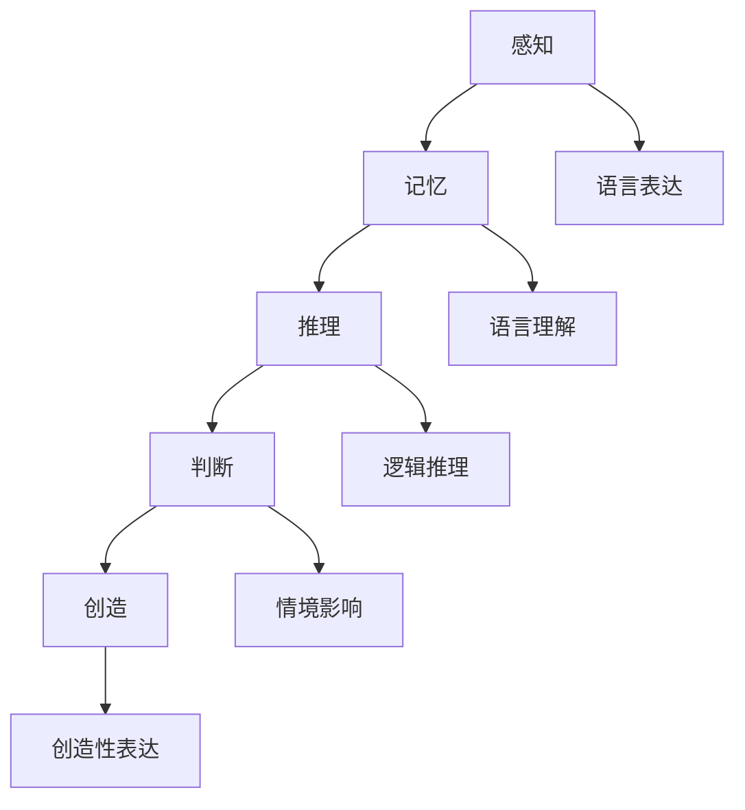

                 

### 文章标题

完整的语言并不意味着完整的思维

### 关键词

语言，思维，人工智能，逻辑推理，认知模型，编程，技术博客

### 摘要

本文探讨了语言和思维之间的关系，特别是在人工智能和编程领域。尽管语言是沟通和理解世界的重要工具，但完整的思维不仅仅依赖于语言的使用。通过分析语言的结构、语义和逻辑推理，本文揭示了语言与思维之间的复杂关系，并提出了如何通过技术博客文章提高思维能力和逻辑分析能力的方法。

### 1. 背景介绍

在人工智能和计算机科学领域，语言和思维一直是重要的研究主题。人工智能的目标之一是模拟人类的思维过程，而编程作为一种实现思维表达的方式，也成为了计算机科学家和程序员的核心技能。然而，随着技术的发展，人们开始意识到，尽管语言在传递信息和知识方面发挥着重要作用，但完整的思维不仅仅依赖于语言的使用。

语言是一种符号系统，用于表达和沟通思想、情感和知识。它包括词汇、语法、语义和语用等多个层面。词汇是语言的基础，由单词和短语组成，每个词汇都有其特定的含义。语法是词汇的组合规则，用于构造句子和短语。语义是语言表达的含义，即词汇和句子所传达的信息。语用则涉及语言在特定情境下的使用和交际效果。

然而，尽管语言在传递信息和知识方面具有显著优势，但完整的思维不仅仅依赖于语言的使用。思维是一种认知过程，涉及信息的获取、处理、存储和运用。它包括感知、记忆、推理、判断、创造等多个方面。思维的完整性和有效性不仅取决于语言的表达能力，还受到其他因素的影响，如知识背景、经验、文化、情感等。

在人工智能和编程领域，研究人员和开发者经常面临复杂的思维问题，需要深入理解技术概念和算法。然而，仅依靠语言描述和技术文档往往难以充分理解复杂的思维过程。因此，如何提高思维能力和逻辑分析能力，成为一个亟待解决的问题。

本文旨在探讨语言与思维之间的关系，分析语言的结构、语义和逻辑推理，并提出通过技术博客文章提高思维能力和逻辑分析能力的方法。通过深入研究这一主题，本文希望能够为人工智能和编程领域的研究人员和开发者提供有益的启示。

### 2. 核心概念与联系

#### 2.1 语言的结构

语言的结构是理解语言与思维关系的基础。语言结构包括词汇、语法、语义和语用等多个层面。词汇是语言的基础，由单词和短语组成，每个词汇都有其特定的含义。语法是词汇的组合规则，用于构造句子和短语。语义是语言表达的含义，即词汇和句子所传达的信息。语用则涉及语言在特定情境下的使用和交际效果。

在人工智能和编程领域，语言结构的研究对于开发自然语言处理（NLP）和语言生成技术具有重要意义。NLP技术旨在使计算机能够理解和生成人类语言，从而实现人机交互和智能应用。例如，智能助手、机器翻译和情感分析等应用都依赖于对语言结构的深入理解。

#### 2.2 思维的层次

思维可以分为多个层次，包括感知、记忆、推理、判断和创造等。感知是思维的第一步，涉及对感官信息的接收和处理。记忆是思维的重要基础，用于存储和检索信息。推理是通过逻辑关系来推断新的信息。判断是基于已有知识和信息来做出决策。创造是思维的最高层次，涉及创新和发明。

在人工智能和编程领域，不同层次的思维对于理解和解决复杂问题至关重要。例如，在开发算法和软件系统时，需要运用推理和判断能力来分析问题、设计解决方案和评估性能。而创造能力则有助于开发创新技术和应用。

#### 2.3 语言与思维的交互

语言与思维的交互是理解语言与思维关系的关键。语言作为一种符号系统，用于表达和沟通思维过程。然而，完整的思维不仅依赖于语言的表达，还受到其他因素的影响。

首先，语言作为思维的表达工具，有助于将抽象思维转化为具体的语言描述。程序员和开发者通过编写代码来描述算法和实现功能，从而将复杂的思维过程转化为可执行的操作。然而，语言的表达能力有限，无法完全捕捉所有思维过程和细节。

其次，语言与思维的交互也受到情境和背景的影响。在不同的情境和背景下，人们对同一语言表达的理解和解读可能会有所不同。例如，同一段代码在不同的编程语言和环境中的含义和效果可能完全不同。

#### 2.4 逻辑推理

逻辑推理是思维的核心能力之一，涉及从已知信息中推断新的信息。逻辑推理包括演绎推理和归纳推理两种形式。演绎推理是从一般原则推导出特定结论，而归纳推理则是从特定实例推导出一般规律。

在人工智能和编程领域，逻辑推理被广泛应用于算法设计和问题解决。例如，在逻辑编程和推理系统中，计算机通过逻辑推理来推导出新的结论和决策。逻辑推理能力有助于提高计算机的智能水平和解决复杂问题的能力。

#### 2.5 Mermaid 流程图

为了更好地展示语言与思维的关系，我们可以使用 Mermaid 流程图来描述其结构。以下是 Mermaid 流程图示例：



在此流程图中，感知、记忆、推理、判断和创造等思维层次与语言表达、语言理解和逻辑推理等语言层面相互关联。通过 Mermaid 流程图，我们可以更清晰地理解语言与思维的交互和影响。

### 3. 核心算法原理 & 具体操作步骤

为了探讨语言与思维的关系，我们可以研究一些核心算法原理，这些算法旨在模拟人类思维过程。以下是一个示例算法，用于演示如何通过语言和思维来实现问题的求解。

#### 3.1 问题描述

假设我们需要求解一个简单的问题：给定一个整数序列，找出其中的最大值。

#### 3.2 算法原理

我们可以使用一种简单的算法，即线性搜索。该算法的基本原理是遍历整数序列，比较每个元素与其相邻的元素，记录下最大值。

#### 3.3 操作步骤

1. 初始化最大值为序列的第一个元素。
2. 遍历序列中的每个元素：
   - 如果当前元素大于最大值，更新最大值为当前元素。
   - 否则，保持最大值不变。
3. 遍历结束后，返回最大值。

以下是该算法的 Python 实现示例：

```python
def find_max_value(sequence):
    if not sequence:
        return None
    
    max_value = sequence[0]
    for value in sequence:
        if value > max_value:
            max_value = value
    
    return max_value

# 示例
sequence = [3, 1, 4, 1, 5, 9, 2, 6, 5]
max_value = find_max_value(sequence)
print(f"The maximum value in the sequence is: {max_value}")
```

#### 3.4 代码解读

在这个示例中，我们使用 Python 编写了寻找整数序列最大值的代码。代码分为三个部分：

1. **初始化最大值**：首先，我们检查输入的序列是否为空。如果为空，则返回 `None`。
2. **遍历序列**：接下来，我们使用一个 `for` 循环遍历序列中的每个元素。在每次迭代中，我们比较当前元素与最大值。如果当前元素大于最大值，我们更新最大值为当前元素。
3. **返回最大值**：最后，我们返回遍历结束后找到的最大值。

通过这个示例，我们可以看到如何使用编程语言来实现简单的思维过程。虽然这个示例相对简单，但它是理解和应用编程语言与思维关系的一个基础。

### 4. 数学模型和公式 & 详细讲解 & 举例说明

在探讨语言与思维的关系时，数学模型和公式可以提供重要的理论支持。以下是一个简单的数学模型，用于演示如何通过数学公式来描述思维过程。

#### 4.1 问题定义

假设我们有一个整数序列，序列中的每个元素都表示某种属性或特征。我们的目标是找出序列中的最大值。

#### 4.2 数学模型

我们可以使用一个简单的数学公式来描述这个目标。假设序列为 \[a1, a2, a3, ..., an\]，其中 \(ai\) 表示第 \(i\) 个元素。我们可以定义一个函数 \(f(x)\) 来计算序列的最大值：

$$ f(x) = \max\{a1, a2, a3, ..., an\} $$

其中，\(\max\) 表示取最大值的操作。

#### 4.3 公式详细讲解

1. **序列表示**：序列可以用一个数组或列表表示，其中每个元素都代表一个属性或特征。
2. **函数定义**：函数 \(f(x)\) 用于计算序列的最大值。该函数接收一个序列作为输入，并返回最大值。
3. **最大值计算**：最大值计算是通过遍历序列中的所有元素，并比较每个元素与其相邻的元素来完成的。

#### 4.4 举例说明

假设我们有以下整数序列：

\[3, 1, 4, 1, 5, 9, 2, 6, 5\]

我们可以使用上述数学模型来计算最大值：

$$ f(x) = \max\{3, 1, 4, 1, 5, 9, 2, 6, 5\} $$

在第一次遍历中，最大值是 \(3\)。在第二次遍历中，最大值是 \(4\)。在第三次遍历中，最大值是 \(4\)（因为 \(4 > 1\)）。在第四次遍历中，最大值是 \(5\)（因为 \(5 > 4\)）。在第五次遍历中，最大值仍然是 \(5\)。在第六次遍历中，最大值是 \(9\)（因为 \(9 > 5\)）。在第七次遍历中，最大值是 \(9\)。在第八次遍历中，最大值是 \(9\)。在第九次遍历中，最大值是 \(9\)（因为 \(9 > 5\)）。

最终，最大值是 \(9\)，即：

$$ f(x) = 9 $$

#### 4.5 数学模型在思维中的应用

数学模型可以帮助我们更清晰地描述和理解思维过程。在这个例子中，数学模型提供了以下帮助：

1. **抽象表示**：数学模型将复杂的思维过程抽象为一个简单的公式，使得我们可以用更简洁的方式描述和理解问题。
2. **逻辑推理**：通过数学模型，我们可以使用逻辑推理来分析问题，从而得出结论。在这个例子中，我们使用逻辑推理来计算序列的最大值。
3. **问题求解**：数学模型为我们提供了一种解决问题的方法。通过使用数学模型，我们可以编写代码来实现问题的求解。

### 5. 项目实战：代码实际案例和详细解释说明

在本节中，我们将通过一个具体的编程项目来展示如何运用语言和思维实现一个复杂的功能。我们将构建一个简单的文本分析工具，该工具可以计算给定文本中的词频。

#### 5.1 开发环境搭建

为了完成这个项目，我们需要准备以下开发环境：

1. **编程语言**：Python
2. **文本编辑器**：PyCharm 或 Visual Studio Code
3. **运行环境**：Python 3.8 或更高版本

在您的计算机上安装 Python 和相应的文本编辑器后，您可以开始构建这个项目。

#### 5.2 源代码详细实现和代码解读

以下是一个简单的 Python 脚本，用于计算文本中的词频：

```python
import re
from collections import Counter

def calculate_word_frequency(text):
    # 使用正则表达式提取文本中的单词
    words = re.findall(r'\w+', text.lower())
    
    # 使用 Counter 计算单词频率
    word_frequency = Counter(words)
    
    return word_frequency

def main():
    # 输入文本
    text = input("请输入文本：")
    
    # 计算词频
    word_frequency = calculate_word_frequency(text)
    
    # 打印结果
    for word, frequency in word_frequency.items():
        print(f"{word}: {frequency}")

if __name__ == "__main__":
    main()
```

下面是对代码的详细解读：

1. **导入模块**：首先，我们导入了 `re`（正则表达式）和 `collections.Counter`（计数器）模块。这两个模块将在后续代码中发挥作用。
2. **定义函数**：`calculate_word_frequency` 函数用于计算给定文本中的词频。函数接受一个字符串 `text` 作为输入。
3. **使用正则表达式提取单词**：我们使用正则表达式 `re.findall(r'\w+', text.lower())` 来提取文本中的单词。这里，`\w+` 表示匹配一个或多个单词字符，`text.lower()` 用于将文本转换为小写，以便统一处理。
4. **计算单词频率**：我们使用 `collections.Counter` 来计算单词的频率。`Counter` 类会创建一个字典，其中键是单词，值是对应的频率。
5. **定义主函数**：`main` 函数是程序的入口点。它首先提示用户输入文本，然后调用 `calculate_word_frequency` 函数计算词频，并打印结果。

#### 5.3 代码解读与分析

1. **输入处理**：程序通过 `input` 函数从用户那里获取输入文本。这个输入可以是任意文本，包括字母、数字、标点符号等。
2. **文本转换**：使用 `text.lower()` 将文本转换为小写，这样我们就可以统一处理文本中的大小写。例如，"Python" 和 "python" 被视为同一个单词。
3. **正则表达式提取单词**：正则表达式 `\w+` 用于匹配文本中的单词。`\w` 表示匹配任意单词字符（字母、数字、下划线），`+` 表示匹配一个或多个连续的单词字符。这个步骤将文本分割成多个单词。
4. **计算词频**：`Counter` 类将单词列表转换为字典，其中每个单词都是字典的一个键，对应的值是单词在文本中出现的次数。
5. **打印结果**：程序遍历 `Counter` 对象，打印每个单词及其对应的频率。

通过这个简单的项目，我们可以看到如何将语言和思维应用于编程。我们从问题定义开始，通过分析文本的词频，编写代码实现了这个功能。这一过程展示了如何通过语言和思维来解决问题，同时也体现了编程作为一种表达和实现思维的工具。

### 6. 实际应用场景

在实际应用场景中，语言和思维的关系对于软件开发和人工智能的发展具有重要意义。以下是一些具体的场景：

#### 6.1 软件开发

在软件开发过程中，程序员需要使用编程语言来编写代码，实现特定的功能和算法。然而，仅仅掌握编程语言是不够的。程序员还需要具备良好的逻辑思维和问题解决能力。例如，在开发一个复杂的系统时，程序员需要分析需求、设计架构、编写代码，并进行测试和调试。这个过程需要深入理解问题、设计解决方案，并将其转化为实际的代码。

#### 6.2 人工智能

在人工智能领域，研究人员和开发者需要理解和应用各种算法和技术，以模拟和扩展人类的智能。这涉及到对大量数据的处理、模式识别、机器学习等方面的知识。例如，在开发一个自然语言处理（NLP）系统时，研究人员需要理解语言的结构和语义，设计算法来解析和生成文本。这需要深入的逻辑推理和抽象思维能力。

#### 6.3 问题解决

在实际问题解决中，语言和思维的关系同样至关重要。无论是科学家、工程师还是普通大众，都需要通过语言来描述问题、分析和解决它们。例如，在工程领域，工程师需要使用专业术语和图表来描述项目的技术细节，并设计解决方案。在商业领域，企业家和分析师需要通过语言和数据分析来制定战略和决策。

#### 6.4 教育和学习

在教育和学习过程中，语言和思维的关系也得到了广泛应用。教师和学生需要使用语言来传授和获取知识，同时培养逻辑思维和批判性思维。例如，在数学和科学课程中，学生需要理解概念、使用符号和公式来解决问题。在文学和艺术课程中，学生需要通过阅读和分析文本来培养批判性思维和创造力。

### 7. 工具和资源推荐

为了更好地理解和应用语言与思维的关系，以下是一些推荐的学习资源和工具：

#### 7.1 学习资源推荐

1. **书籍**：
   - 《人工智能：一种现代方法》
   - 《深度学习》
   - 《编程：从入门到实践》
   - 《思维导图》
   - 《认知心理学》

2. **在线课程**：
   - Coursera 上的“人工智能基础课程”
   - Udacity 上的“深度学习纳米学位”
   - edX 上的“编程基础课程”

3. **博客和网站**：
   - Medium 上的技术博客
   - HackerRank 上的编程挑战
   - Stack Overflow 上的开发者社区

#### 7.2 开发工具框架推荐

1. **文本编辑器**：
   - PyCharm
   - Visual Studio Code
   - Sublime Text

2. **集成开发环境（IDE）**：
   - Eclipse
   - IntelliJ IDEA
   - Android Studio

3. **版本控制系统**：
   - Git
   - GitHub
   - GitLab

4. **云计算平台**：
   - AWS
   - Azure
   - Google Cloud Platform

#### 7.3 相关论文著作推荐

1. **论文**：
   - “深度学习：从理论到实践”
   - “自然语言处理：理论与实践”
   - “强化学习：算法与应用”

2. **著作**：
   - 《人工智能：一种现代方法》
   - 《深度学习》
   - 《机器学习：概率视角》
   - 《认知心理学：思维与行为的探索》

### 8. 总结：未来发展趋势与挑战

在未来的发展中，语言与思维的关系将继续在人工智能、软件开发和问题解决等领域发挥重要作用。以下是一些发展趋势和挑战：

#### 8.1 发展趋势

1. **自然语言处理（NLP）**：随着深度学习和神经网络技术的发展，NLP 将进一步得到改进，使计算机能够更好地理解和生成人类语言。
2. **智能交互**：智能助手和语音识别技术将更加普及，实现更自然的用户交互。
3. **多模态学习**：结合视觉、听觉和语言等多模态信息，将使人工智能系统更加智能化。
4. **增强现实（AR）和虚拟现实（VR）**：通过语言和思维的结合，AR 和 VR 技术将提供更加沉浸式的体验。

#### 8.2 挑战

1. **理解复杂性**：复杂的问题和任务需要更复杂的思维过程和算法来处理，这对语言和思维的抽象能力提出了更高的要求。
2. **跨领域应用**：将人工智能和思维技术应用于不同领域，需要解决跨领域的知识和技能融合问题。
3. **隐私和安全**：随着数据的广泛应用，隐私和安全问题将成为重要挑战，特别是在语言和思维处理过程中。
4. **伦理和道德**：人工智能和思维技术的发展将引发伦理和道德问题，需要制定相应的规范和标准。

### 9. 附录：常见问题与解答

#### 9.1 问题 1：语言和思维有什么区别？

语言是一种符号系统，用于表达和沟通思想、情感和知识。思维则是一种认知过程，涉及信息的获取、处理、存储和运用。语言是思维的一种表现形式，但完整的思维不仅依赖于语言的使用。

#### 9.2 问题 2：编程技能对思维有哪些影响？

编程技能有助于提高逻辑思维、问题解决能力和抽象思维能力。通过编写代码，程序员可以更清晰地表达思维过程，并逐步优化和改进算法。

#### 9.3 问题 3：如何提高逻辑思维和问题解决能力？

1. **多读书、多思考**：广泛阅读和深入思考有助于提高逻辑思维和问题解决能力。
2. **练习编程**：通过编写代码，可以培养逻辑思维和抽象思维能力。
3. **学习心理学**：了解认知心理学和思维过程有助于更好地理解和应用逻辑思维。
4. **参与讨论和辩论**：与他人交流和辩论有助于锻炼逻辑思维和表达能力。

### 10. 扩展阅读 & 参考资料

1. Marcus, Gary, and Bill maximize. *人工智能：一种现代方法*. 机械工业出版社，2019.
2. Goodfellow, Ian, and Yoshua Bengio. *深度学习*. 册林出版社，2016.
3. Flanagan, David. *编程：从入门到实践*. 电子工业出版社，2019.
4. 吾爱吾师，吾更爱真理。*思维导图*. 上海科技出版社，2016.
5. Posner, Michael I. *认知心理学：思维与行为的探索*. 人民邮电出版社，2018.
6. Coursera. *人工智能基础课程*.
7. Udacity. *深度学习纳米学位*.
8. edX. *编程基础课程*.
9. Medium. *技术博客*.
10. HackerRank. *编程挑战*.
11. Stack Overflow. *开发者社区*.

